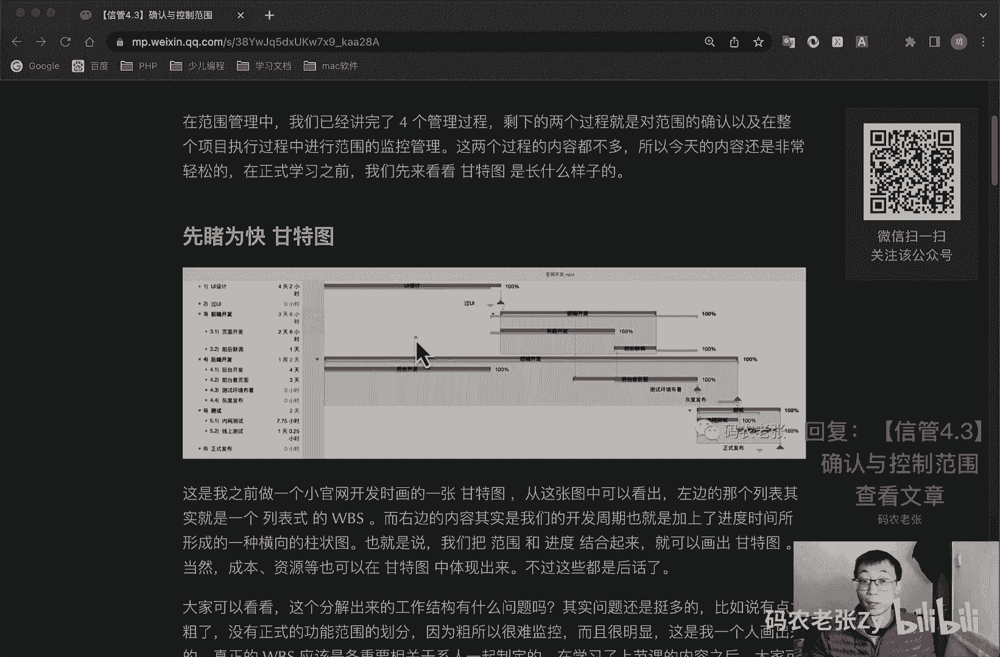
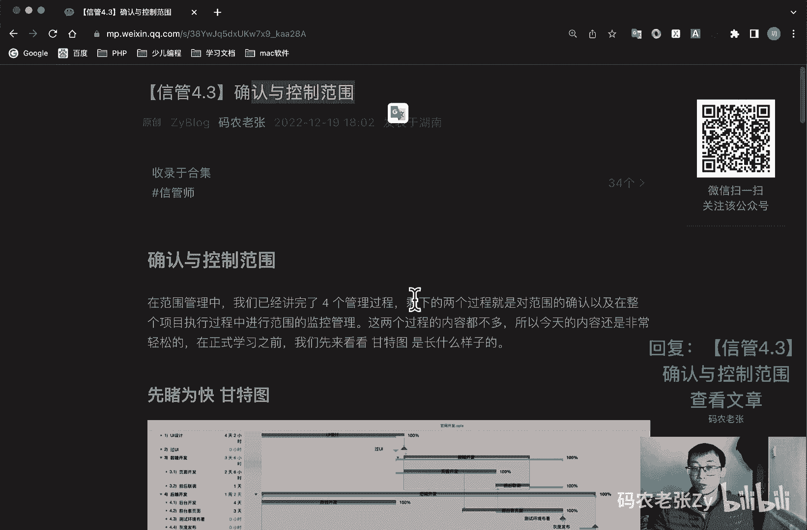

# 【信管4.3】确认与控制范围 - P1 - 码农老张Zy - BV1Js4y1s7GU

哈喽大家好，今天呢我们来学习的信息系统项目管理师，第四大篇章的第三篇文章，确认与控制范围，在范围管理中呢，我们讲完了四个管理过程，剩下的两个过程呢就是对范围的确认，以及在整个项目执行过程中。

进行范围的监控管理，这两个过程的内容都不多，所以今天的内容呢还是非常轻松的，在正式学习之前呢，我们先来看看甘特图是长什么样子啊，这个呢是我之前画过的一个，就是做过的一个项目，然后在里面所画的一个甘特图。

这张图中我们可以看出来就左侧这个地方啊，就这个地方呢，其实就是我们的列表式的一个w bs对吧，而右边的内容呢，其实就是加上了时间之后的这个任务对吧，这还是这个任务，还是这个任务跟他对应起来的。

跟它对应起来了，但是呢因为它加上了这个时间这个横轴啊，它表示的是时间，就是在这一格就是一天对吧，一格就一天，然后我们就占几天的时间，这样的话呢他就通过这个进度，就是把这个进度的这种形式也给展示出来了。

这个呢就是一个就是通过这样一个，横向的著作图呢，这个表现出来的呢就叫做甘特图，也就是说呢我们是把范围和进度结合起来了，画出来的这个图，当然了，成本和资源等这些东西呢，也可以在甘特图中体现出来。

不过这些都是后话了，就大家可以看一看啊，在这个分解出来的工作结构有什么问题吗，其实问题还是挺多的，比如说有点太粗了。

没有正式的功能范围的划分，因为粗呢，所以他也很难监控对吧，而且很明显的就是我一个人画出来的，真正的wb s呢，应该是个重要相关干系人一起制定的，在学习了上节课的内容之后呢。

大家就不要像我一样在画出这样的甘特图来了，这个刚才图还是比较失败的，但是很简单，就非常简单的一句话一下也是可以的，关于甘特图的内容呢，后面我们还会再说到这里，就是简单的先看一下好，我们直接进入主题啊。

就就是剩下的两个过程，第一个呢就是确认范围，确认范围呢其实也是贯穿项目始终的一个过程，它可以叫做是范围核实或者是核实范围，它包括与客户或者发起人一起审查可交付成果，确保可交付成果已经圆满完成。

并获得客户或发起人的正式验收，在信息系统项目集成项目中的，确认范围并不是容易的事，这个不容易的主要体现在与用户的沟通上，项目团队倾向于让用户确认范围，以尽快开始后续的工作。

而用户则可能认为自己什么也没有看到，怎么可以确认呢，因此项目团队沟通能力在确认项目范围，这里具有非常重要的作用，项目干系人进行范围确认时呢，一般要检查以下几个方面的问题啊。

这些问题呢主要包括可交付成果的，是否是确定的，可确认的，每个可交付成果是否有明确的里程碑，里程碑是否是明确的，可辨别的事件是否有明确的质量标准，审核和承诺呢，是否有清晰的表达，项目范围呢。

是否覆盖了需要完成的产品或服务，进行的所有活动，有没有遗漏或者错误项目的风险呢是否太高，管理层是否能够降低可预见的风险，发生时对项目的一个冲击，确认范围中最主要的是项目的干系人，例如说客户啊，发起人啊。

对项目的范围进行确认和接受的工作，每个人对项目范围所关注的方面也是不同的，这个也是我们所有干系人需要关注的不同点，这些点呢主要包括哪些内容呢，他们包括管理层所关注的项目范围，是指项目范围对项目的进度。

资金和资源的影响，然后客户呢主要关心的是产品的范围，关心项目可交付成果是否满足产品或服务，项目，管理人员呢，主要关注，可交付成果是否满足需求和必须完成时间，资金和资源是否充足。

而项目团队成员的主要关心项目范围中，自己参与的元素和负责的元素，检查自己的工作时间是否足够，如果在确认范围工作中，发现项目范围说明书wbs中有遗漏或者是错误，需要向项目团队明确指出错误的内容。

项目团队呢需要根据修改意见，重新修改项目范围说明书和w p s，在确认范围工作过程中，也可能会出现范围变更请求，如果这些范围变更请求得到了批准，那么也要重新修改范围说明书和wb，确认项目过程中呢。

有个工具叫做什么叫做检查，他呢是指开展测量审查与确认等活动，来判断工作和可交付成果，是否符合需求和产品验收标准，检查有设备也被称为审查产品，审查和巡检等等，而确认范围的输出呢则是验收的可交付成果。

最高他的输出啊，验收的可交付成果，说白了就是我们要正式交付的产品服务等，它是所有结束项目阶段和过程的重要输入，如果项目在早期被终止，确认范围过程也要记录它的完成情况，记住项目只要有开始，就一定要有结束。

在整体管理中有讲过的，结束项目或者阶段的工作，那是必不可少的，即使是失败和提前结束的项目，他们的资料呢也会成为组织过程资产，最后呢我们再来看一下，确认范围与几个术语之间的一个比较好。

确认范围内与核实产品，核实产品呢是针对产品是否完成，强调产品是否完整，而确认范围呢则是针对项目的可交付成果，由客户或发起人在阶段末确认验收的一个过程，下一个呢就是确认范围与质量控制。

确认范围呢是有关工作结果的接受问题，而质量控制呢是关注交付成果的正确性，质量控制的一般在确认范围前进行，当然同时进行也是可以的，确认范围体现在多少，也就是范围的大小是由多是由外部来验收的。

而质质量控制呢更多的体现在好坏，都是属于内部检查的，确认范围与项目收尾啊，确认范围强调的是何时与接受，而项目收尾强调的是结束项目或阶段，所做的流程性的工作好了，最后一个控制范围，在控制范围的过程中呢。

我们要重点关注的焦点问题，包括对造成范围变更的因素施加影响，以确保这些变更得到一致的认可，确定范围变更是否已经发生，当范围变更发生时呢，对实际的变更进行管理，既然我们要关注这么多问题，那么项目的范围。

一般会在什么情况下发生变更呢，这个主要包括政策，就是政府政策的问题，同时也可以看成是项目外部环境发生了变化，另外呢就是项目的范围，计划编制不周密，详细有一定的错误或者遗漏。

这一点大多数可以归结为人的原因，市场上出现了或者设计人员提出了新的技术，新手段或者新方案呃，项目执行组织本身发生了变化，这是内部环境发生了变化，然后就是客户对项目，项目产品或服务的要求发生变化。

这还是人的问题，还记得我们之前讲过一个什么东西呢，就是非常出名的，就是叫做这个人财物法环，这也不是非常出名啊，就是非常好用啊，这个人才物法还在这里，是不是你看一下它是不是也是这几个原因对吧。

这其实也类似的对吧，可以说大部分的变更你就不管是范围，成本进度还是什么，基本都和这五个元素是相关的，控制范围，确保所有的变更请求，推荐的纠正措施和预防措施，都通过实施整体变更控制过程来进行处理。

未经控制的产品或者项目范围的扩大，就是未经控制的产品或者项目，范围扩大的需求变更对吧，面对时间成本和资源做出相应调整，被称为什么称为范围蔓延，除了范围蔓延之外呢，还有一个名词叫做镀金，他的意思是。

团队成员内部发起的范围扩大的问题，没有经过正式的变更处理流程，从而导致整体范围，项目范围的一个扩展，比如说程序员主动为一个功能，添加了一些额外的辅助功能，这个东西呢就叫做镀金，而客户直接找程序员。

并要求马上添加的额外功能呢就是需求慢圆，他们都是失控的变更，都没有经历正规的变更流程，都应该在项目过程中是极力避免的，注意他们俩之间的区别范围蔓延是客户提出的，然后没有继续进。

就是没有经过正式的变更流程的客户提出的，然后镀金呢是我们项目成员自己去做的，一些东西，也是没有经过那个正式的变更的流程的，但是我们自己去额外多做的东西，这个叫做镀金，自己做的叫镀金。

客户提出的要求叫做范围蔓延，注意他们两个都是没有，都是没有什么，都是没有经过正规的一个变更流程的，他们都是失控的变更好，最后我们再一起看一下，在整个项目周期内，范围变更控制的主要工作。

包括但不限于什么呢，影响导致范围变更的因素，并尽量使这些因素向有利的方向发展，判断范围变更是否已经发生，范围变更，发生时管理实际的变更，确保所有请求的变更，按照项目整体变更控制过程来处理好了，总结一下。

静态内容不多对吧，很轻松所说内容少了，但确认范围的概念与质量控制的区别，控制范围产生的原因，以及范围蔓延和镀金的概念，这些内容呢都是需要我们去深入理解和记忆的，到此为止呢，项目范围管理内容呢。

我们就学习完了项目管理十大知识领域，我们学习完了两个，不知道大家有没有感觉到，貌似项目管理部分的内容还是比较轻松的，确实相比不是计算机相关专业的人员，去学习网络和系统知识来说呢。

项目管理方面的知识其实更通用一些，而且也更大家好理解一些，既然如此的话，大家还是多多加油吧，当然难点还是有的，比如说我们马上要进入到什么呢，就是项目进度管理的学习，以及后面的项目成本管理。

都会比范围管理的难度要高一些，为什么，因为这两个里面有我们整个系列里面，最重要的两个计算部分的内容，就在进度管理和成本管理里面，好了嗯，大家可以回复文章的标题，信管4。3确认与控制范围。

来获得这篇文章的具体内容，内容不是特别多啊，大家不过重点的地方，大家也要详细的去看一下好了。

今天的内容就这些。

