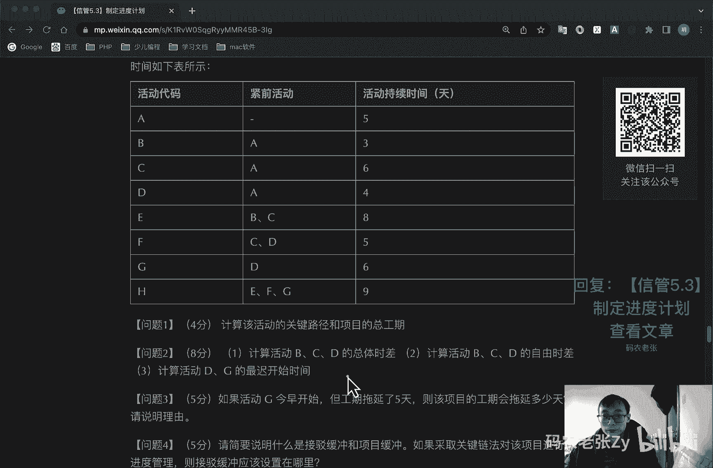
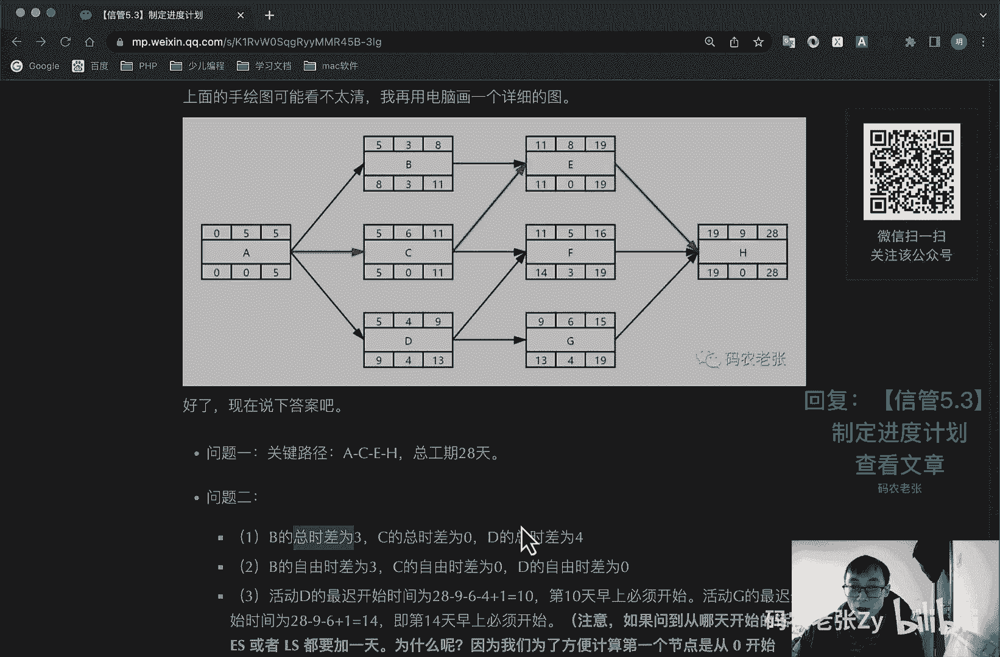
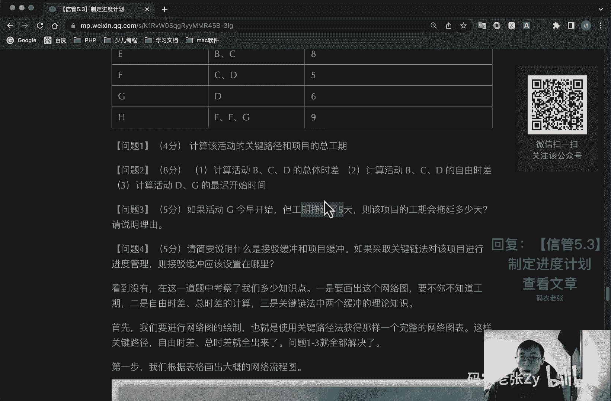
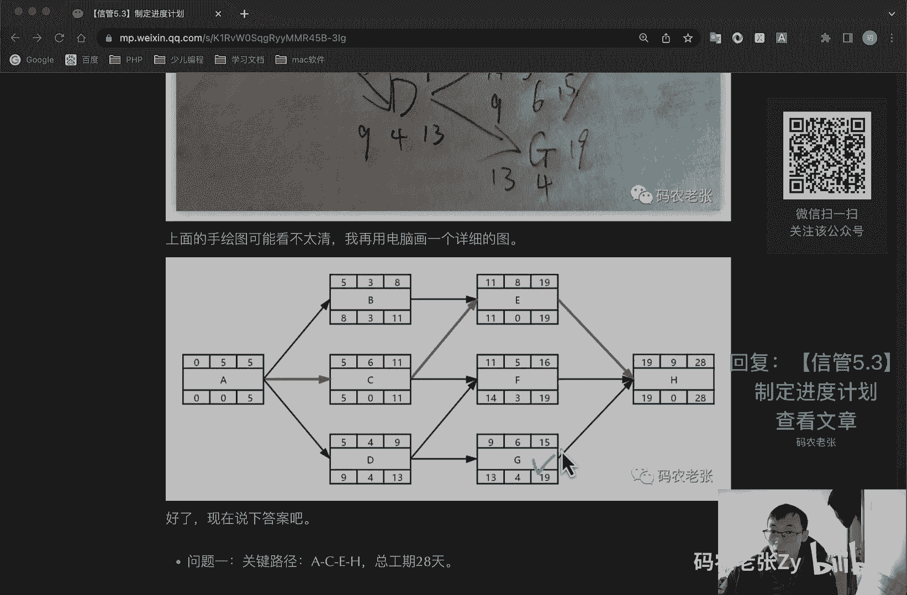
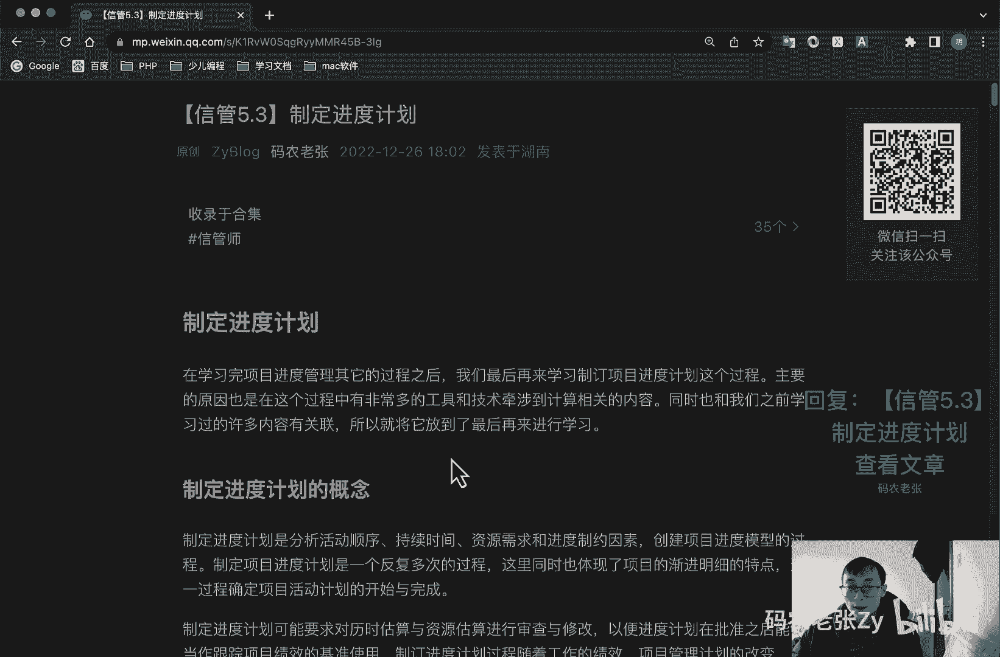

# 【信管5.3】制定进度计划 - P1 - 码农老张Zy - BV14y4y1X7Lp

哈喽大家好，今天呢我们来学习的是信息系统项目管理师，第五大篇章的第三篇文章，制定进度计划，在学习完项目进度管理的其他过程之后呢，主要的原因也是在这个过程中，有非常多的工具和技术牵扯到计算相关的内容。

同时呢也和我们之前学习过的许多内容有关联，所以说呢我们就把它放到了最后再来进行学习，好我们先来看一下制定进度计划的概念，制制定进度计划是分析活动顺序，持续时间，资源需求和进度制约因素。

创建项目进度模型的过程，它制定项目进度计划，是一个反复多次的一个过程，但同时也体现了项目的渐进明细的一个特点，这一过程确定项目活动计划的开始与完成，制定进度计划呢，可能要求对历史估算与资源估算。

进行审查与修改，以便监督计划在批准之后，能够当做跟踪项目绩效的基准使用，制定进度计划过程，随着工作的绩效，项目管理计划的改变，以及预期的风险结果发生或消失，或识别出新的风险而贯穿于整各项目的始终。

对于项目的进度计划来说呢，有几个时间制约，因素是我们需要关注的这些制约因素呢，对项目有强制性的制约，比如说老板说哪天要上线，对不对，这个东西非常非常强制了啊，好我们主要来看一下啊。

这这这里是具体的来说一下，第一个就是活动开始或结束的强制性日期，用来约束项目的开始时间不早于开始日期，或者说项目结束的时间不晚于结束日期，第二个呢就是项目发起人，客户或其他干系人。

经常指定关键事件或者里程碑，他们都会影响在指定日期内完成项目的交付，其他需要关注的进度计划，数据与信息还包括什么里程碑啊，计划活动啊，活动属性啊，假设约瑟因素啊，按时间段提出的资源。

需求和其他可供选择的进度计划和进度，应急储备等等，制定进度计划的输出，首先呢就是进度基准啊，这个东西呢是经过批准的项目进度计划对吧，我们之前学过什么了，已经学过了范围，基准范围基本是什么，还记得吧。

需求规格说明书以及wb s，还有w bs知识点，对不对，然后呢这个进度计划是呃，这个进度基准是什么呢，就是经过批准的项目进度计划好了，两个精准都有了，后面我们还有一个基准叫做成本基准。

我们后面还会再学到的，那么项目进度计划都包含哪些内容呢，项目进度计划包含进度模型的输出，展示活动之间的相互关联，以及计划日期持续时间，里程碑和熟悉资源，具体来说呢，它一般包括三种表格。

这三种表格第一个就是里程碑，进度计划也叫做里程碑图，只标示出主要的可交付成果，和关键外部接口的计划，开始完成的日期，里程碑啊，前面说一直都在说啊，里程碑就是一个菱形的那种，实心菱形的代表里程碑了。

它一般是主要的一些活动节点，这个呢就是里程碑图，然后呢第二个就是横道图，横道图就是我们常说的甘特图了，活动列于纵轴，日期列于横轴，常用于向管理层汇报和使用情况干的图，简单明了，直观且容易复制啊。

容易编制，但是不能表示复杂的关系呢，以定量计算和分析，这个甘特图也不用多说了，之前经常看到的对吧，之前之前也说过，这边是活动，对不对，这个活动就是根据w bs，你直接用wb s也可以啊。

或者说你w b s再分解一下，分解成一个具体的活动，然后然后这边呢是时间对吧，这边是时间，然后每个活动所占用的时间，然后他们之间还可以连线，就像呃对呃，像像这个一样对吧，这个连线这个连线的表示。

就是我们之前讲过那个fs的对吧，fs开始结束的对吧，结束开始结束开始的，然后这几个就表示这种逻辑关系的，然后这个就是一个比较复杂的一个，这个甘特图的一个演示，好。

就是你不管是在那个windows底下使用微软的project，还是imac底下使用omi plan核心的功能呢，都是绘制这样的甘特图，好这个刚才图的具体内容呢也就不多说了，我们就直接来说。

最主要的就是我们，第三个东西就是项目管理计划，项目进度管理计划，最主要的一个东西就是项目进度网络图，这个呢是我们马上要学习的内容了，好在学习这个内容之前呢，我们先要了解就是关键路径法。

关键路径法是什么意思啊，我们看到在这里关键路径法，关键路径法叫做cp m，然后之前我们还学过什么什么什么单代号，网络图，对不对，还有什么a o n啊，呃什么什么aoa啊什么的，单单代号网络图。

双代号网络图啊，pdm a a d m啊，对不对，然后这里又多了一个cpm，这个叫做关键路径法，它呢是借助网络图和活动所需时间的估计值，计算每一项活动最早或最迟开始或者结束时间。

cp m算法的核心思想是将工作分解结构，w bs分解的活动，按逻辑关系加以整合，统筹，计算出整个项目的工期和它的一个关键的路径，关键路径法呢沿着项目进度，网络路线进行正向与反向分析。

从而计划出所有的计划活动，理论上的最早开始完成时日期，最迟开始与完成日期，不考虑任何资源限制，好，还记得我们之前在进度管理，第一篇文章中看到的这个网络图对吧，我现在要把它定下来。

因为我们后面要去仔细的去研究一下这张图，好先对好，现在定下来了，在这个图讲这个图之前呢，我们还要复习一下，就是我们之前也学过的，就是这个图上面的这个各个，各个点上面的一些意思，对不对。

最左上角这个是什么es最早开始玩，最早开始的时间，然后中间这个是工期，也就是我们要耗费的时间，然后后面这个叫做ef有最早完成的时间，然后下面这个呢是最迟完成的时间，这个是总浮动时间。

这个叫做最迟完成时间，这个最迟开始时间，这个是最迟完成时间，然后这个地方呢大家也要去记住，一定要烂剧于心，然后你可以看一下，仔细观察一下这张图啊，这张图上有几个有有一些线段是加粗的，像这个线看到没有。

这个线是加粗的，这个加粗的呢其实表示的就是一个关键路径，这个关键路径是什么意思啊，这个关键路段其实很好理解，就是把我们这个工期你看到没有，这个工期去加起来，就按照这个箭头啊，把这些工期加起来。

比如说你看我们这个箭头有这样一条线路，对不对，然后呢有这样一条线路，有这样一条线路，然后还有这样一条线路对吧，把这几条线路上面的这个工期全部加起来，工期最长的那条线路就叫做关键路径。

关键路径这个就叫做关键路径，这个关键路径有什么用啊，这个关键路径呢其实就代表了我们整个项目，整个项目的一个完整的一个工期，如果关键路径上的活动发生了延迟啊，或者是推迟啊，那么整个我们整个项目的。

它那个工期都会往后推延，对不对，因为他是本身就是这个最长的这条线路，然后呢，这些非关键路径是有非关键路径上的这些活动，它会有一个时差的概念，这个时差表示的就是这些非关键路径的活动呢。

你可以在这个允许的时差范围内，有一个上下的一个波动，就是比如说我这个活动晚个几天开始也没关系，他不会去影响到我们总工期，也不会去影响到我们的关键路径，但是如果他超过这个时差了，超过这个时间了。

那么他有可能就会变成一个关键路径上的活动，去影响整个工期的一个长短了，这个呢就是关键路径和非关键路径上的，活动的一个区别，好这个地方呢也是大家只需要去了解的，ok我们先来看一下关键路径法去正推工期。

这个是什么意思啊，这个这个我就不按这个上面写的来讲了，然后我就直接拿这个图来说啊，这个正推正推工期是什么意思呢，其实就是说呃就是说在考试的时候呢，他其实给的题目呢很多他只会给一个工期。

然后给这个活动的一些前后的，颈前和颈后的一个逻辑顺序，这样的话呢就让我们去进行一些计算，在这种情况下，你必须要把这个图给画出来，对不对，跟这个图一样去把这个图画出来，这个这个时候呢你只有工期。

只有它的逻辑顺序，就不只有这些箭头，那么我们怎么去算出这些这些值呢，就比如说这些值对吧，这些值怎么去算出来呢，这个呢就是通过一个是通过正推法，一个是通过逆推法好，正推法呢就是去计算上面这三个。

就是这三个，正推法去计算，这个和这个最早开始时间和最早完成时间的好，就比如说我们现在这些都是空的，就其他的功能我们只有一个二，只有一个中间，这个只有它，然后只有这个a b c d和这些箭头好。

那我们去推算的话，其实非常简单啊，就是这个最早开始时间零，我们第一个活动他肯定是零对吧，第一个活动肯定是零，从他开始，当然也可能不一定是，只有一个开始开始的活动啊，也可能有多个啊，有多个的话。

他们的开始开始时间都是零，你注意啊，他都是零啊，最早开始时间加上工期，就等于最早完成时间，就这么简单就这么简单，真的就这么简单，好这个第一个就出来了对吧，022就出来了，然后呢后面两个活动呢。

后面两个活动最早开始时间就是，其实就是他的紧前活动，也就是他的上一个活动的这个最早完成时间，对不对，你要上一个活动完成了之后，后面的活动才开始嘛，我在这个网络图里面，我们所有的走的都是fs，都是fs啊。

注意都是fs什么意思，还记得吧，就是前面那个活动必须完成了，后面那个活动才能开始，所以说呢他们两个的开始时间都是二，看到没有，都是二啊，都是二，然后拿这个拿他们的这个最早开始时间，然后去加上他们的工期。

得到的结果呢，就是他们的最早完成时间了对吧，就是他们的最早完成时间，2+18=20，好我们再继续接着往后推就行了，那么在这种情况下呢，有一个特殊的地方是什么地方呢，就比如说像这个活动。

这个f这个活动它有两个金钱活动，看到没有，他有两个紧前活动，对不对，那么他的最早开始时间按谁的来呢，他的最早开始时间呢其实就是按紧前活动，按紧前活动最大值来算，紧前活动最大值。

你看c的这个最早完成时间是15对吧，然后这个b的最早完成时间是20，那么按这个20来算，所以这个地方填20 20，然后加十，然后加到30，加10=30对吧，然后把这所有的所以这个地方也一样的。

这个地方也一样的，他前面只有这一个20，对不对，所以说呢我们在这个地方呢就直接去这个地方，应该是填错了对吧，他这个地方填那个22对吧，他应该是20的，他应该是按他前面的那个来算的好，这个去20了之后呢。

你就一路往前去填，一一路一路往后去填，填，到最后呢就会获得一个总的工期，看到没有，总的工期呢其实就出来了235，对不对，这个地方绝对是填错了，这个地方填错了，这个是我从别的地方截图过来的。

他这个地方就直接就填错了，这个地方好，这个地方是需要注意的，这也是包括出题的时候都有可能不小心，对不对，出现这种小的，这就出现这种小错误好了，这个呢就是一个正推法，正推法去推去计算什么。

计算上面这两个e和ef好，这么一路推过去之后呢，我们就可以再去计算什么呢，再去计算它的一个倒推法，去计算什么呢，倒推法计算最迟完成时间和最迟开始时间倒退，反正是什么意思啊，就从后往前，从后往前。

为什么要从后往前算呢，他这个最迟完成时间和最迟开始时间，就是说你这个活动最晚可以什么时候开始，你可以有几天的空余时间，对不对，但是我们之前说过了关键路径，关键路径是非常重要的一条路径，对不对。

关键路径上的活动呢，它是影响整个项目工期的，因此在关键路径上的活动呢，它的最迟完成时间和最迟开始时间，其实跟最早开始时间和最早完成时间是一样的，它是没有浮动时间的，你看在这个图上其实也能明显的看出来。

看到没有，在关键路径上的这些全都是零，然后跟上面的也都是一样的，也都是一样的，看出来没有，看出来没有好，那么这么这样一看的话，其实就非常简单了，这几个节点的这几个节点呢。

下面这三个就直接马上就可以填好了，对不对，关键路径上的马上就可以填好了，那么其实在这个地方呢，我们最主要看的就是非关键路径上的内容好，非关键路径上内容要怎么看呢，这个最迟完成时间啊。

他其实也是从这个倒推过来的，对不对，倒推过来的，我们从最后一个节点开始看，235，235去，它的算法就是前面这个最迟开始时间，l s的算法呢，其实就是这个lf去减去工期，减去这个工期。

然后获得这个值的对吧，获得这个值的好，我们去看关键路径上的就不不讲了，我们主要看非关键路径上的，就是看这个一节两个e节点，它这个lf是200，这个是怎么来的呢，其实就是紧后活动紧后活动的最迟开始时间。

紧后活动的l s啊，紧后活动的l s把它填过来就行了，把它填过来了之后呢，拿它去减去它的工期，15之后呢，获得这个185，这个185呢就是它的最迟开始时l s，然后这个中间这个自由时差是怎么算的啊。

这个总时差是怎么算的呢，这个总时差呢其实就是l f减去e f，或者说l s减去e s就可以了，注意是对等的去减啊，这样的去减，这样的去减，去减了之后获得的这个就是自由时差呃，不是总时差，老老说错了。

这个总时差它代表什么意思呢，总时差就是说这个活动它可以自由活动的时间，他可以晚135天才开始，他也不会去影响关键路径，这个就是这个意思啊，就是这个意思就是这个意思，但是如果他超过这个时间了。

它就有可能会变成它就有可能变成关键路径了，你注意啊，它就有可能会变成关键路径了，比如说它这个地方变成100，第186天开始了，对不对，186天开始加上15，这个地方变成201了，201。

根据我们之前的那个正推的那种算法的话，这个地方这个地方他肯定不能填200了，他肯定不能填200了，因为这个活动到了第201天才结束的，那么这个地这个活动，他必须要在201天之后才开始，对不对。

所以说它这个节点就变成关键路径了，所以说这个是有影响的，这个呢就是逆推法，ok这前面的也是一样的算法，185185填过来，然后185去减去这个八，然后获得前面的这个值好吧，这个就比较简单了。

这个也就不多说了，ok我们就这么一路的一路往前推，下面这几个也就出来了，下面这几个也就出来了，好我们再来看一下啊，再来看一下，就是这个逆推法，逆推法的话，其实它也是有这个有这个就是有有。

就是有两个紧后活动，像这个有两个紧后活动的这种情况，有这两个紧后活动，这种情况呢其实它的规则也是非常简单的，前面我们说过，就是按这个算法的时候，这个算法的时候是取前面，是取前一个紧前活动的最大值对吧。

最大值，那么逆推法的时候，逆推法的时候，这个lf lf的取值呢是颈后活动的最小值，你看这个警徽活动呢是20对吧，这个井号活动是177，当然这个是在关键路径上的啊，这个这个其实前面已经说过了。

关键路径是很特别的，就是说假如他不是关键路径的话，那么他如果有两个这样的紧凑活动的话，那么我们就取最小值啊，l s他的警号活动里面，ios的最小值就是取这个20就可以了，这个呢就是这样去取的好。

这样的话整个一个网络图就出来了，这个东西非常非常重要，你做后面一切计算的基础都是在这个地方，就是这个这个怎么去正推，或者上面的这两个e和ef怎么去逆推，或者l f i l s以及tf怎么去。

怎么去弄这些东西，这个东西是非常非常非常重要的，好我们先来看一下这个地方呢，大家可以自己再来仔细的看一下，我们来看一下正向与逆向的一个步骤的总结啊，通过正向计算的推算，最早完工时间的步骤，从网络图始端。

就是从始端向终端去计算，第一个活动的项目开始，第一个活动的e为零，然后活动开始时间呢，加上一个他的那个持续时间是工期，然后后续活动的开始时间呢，根据后续活动的开始时间，根据前置活动的时间和大家时间而定。

多个前置活动存在时呢，根据最迟的活动时间也就最大值来定好，通过反向计算呢，我们可以活出最晚完工时间，就是反过来去算那个下面的下面的三个，对不对，从网络图的终端，从这边终端向始端去计算。

最后一个活动的完成时间，为项目的一个就为项目的完成时间，活动开始时间呢，我要完成时间减去持续时间对吧，前面说过了去捡，然后呢，前置活动的完成时间，根据后续活动的时间和大家时间而定。

然后有多个后续活动存在时呢，根据最早的活动，也就最小的这个后续活动时间来定好，我们再来看一下总浮动时间与自由浮动时间啊，我们前面一直在说的这个中间这个是叫什么，tf tf呢，它表示的是总活动时间。

也叫做总时差，总浮动时间呢也叫做总时差，是我们的活动节点图中下方的中间那个tf，他表示的是在不延误项目完工时间，且不违反进度制约因素的前提下，活动可以从最早开始时间推迟或拖延的时间量。

也就是该活动的进度灵活性，它的计算方法呢是本活动的最迟完成时间，减去本活动的最早完成时间，或者说本活动的最迟开始时间，减去本活动的最早开始时间，前面说过的对吧，对等的去减啊。

很明显关键路径的tf呢它都是零，这个前面已经说过了，而c d e这三个非关键路径上的节点呢，它都是有tf的，比较直白的说，就是这些非关键路径活动可以延误的时间，比如说c延误在五天之内。

它不会影响后续的一个总工期235天，这五天呢就是c的一个总浮动时间，也都有总时差，除了总浮动时间之外呢，还有一个叫做自由浮动时间，就我经常老说错的那个词啊，叫做自由时差，他指的是在不延误。

任何紧后活动的最早开始时间，且不违反进度制约因素的前提下，活动可以从最早开始时间推迟或拖延的时间量，自由浮动，时间也可以叫做自由时差，计算方式呢是紧后活动最早开始时间的最小值，减去本活动的最早完成时间。

还是拿c来看啊，它的紧后紧后活动只有一个f，它的颈后只有一个活动f，那么它的自由时差呢就是f的e s，f的e这个e20 ，然后减去他自己的这个e f 15，这个呢就是一个自由时差。

一般来说呢自由时差它是小于总时差，自由时差小于它这个是相等的，它这个也是五对吧，他这个也是五，自由时差呢，自由时差表示的它是不影响紧后活动啊，它它是不影响紧后活动的一种情况。

自由时差他他那个就是出题的时候呢，计算会比较少，他关注的是前后两个活动一对多的一个情况，自由时差呢一般不会在活动节点中展示出来，它的缩写叫做f f好，我们再接着往下看，最后看一下公式的总结啊。

经过就是经过前面的讲解了，其实我们就可以得到活动节点，各个开始结束时间，以及总时差和自由时差的公式，那我们可以总结一下，就是这个e s e就是等于最小的，最大的紧前活动的一个ef。

就最大的活动ef如果是开始最开始的，这个他肯定是零开始的对吧，好e f就等于e加上du d o，就是那个工期有f l f，l f就是最最迟完成时间，对l f l f呢是最小的紧后活动的ios对吧。

最小的紧后活动，ios这个指的是最迟完成时间的确定，应该是这个节点后续的所有节点中，最小的那个ios的值，然后关键路径上的跟那个是一样的，然后最后一个节点的那个e s e f，就是他的l f好。

l s l s就前面这个l s l s呢，就是l f减去du点去工期，然后自由时差呢就等于ios减e f，或者是l f减去e f，然后嗯呃呃这这这个是总时差，总时差tf总时差啊，然后自由市场自由时差呢。

就是最小紧扣活动的最小的这个e，紧扣活动最小的这个e啊，这个e s e s，最小的这个e去减去他自己的这个ef，减去他自己的这个e f好，这就是这几个公式，这个公式呢一定要记住，一定要明白。

一定要熟记于心，它是重他们是重点中的重点，或者说是整个信信管师学习中的超级重点之一，另一个超级重点呢就是我们下一章就要学习的，成本管理中的政治管理的计算，每次考试的案例计算题，这两种题啊必出其一。

甚至是一道题中的融合，这两种计算，比如说让你先算工期，也就是先计算进度，然后再问你成本进度的情况，这是政治计算的内容，然后再次提醒啊，每次考试必有其一啊，好这非常非常重要，好我们再来看一下关键练法。

关键链法叫做ccm，前面那个什么关键路径法叫做cp m，这个叫做ccm，是一种进度规划方法，允许项目团队在任何项目进度路径上设置缓冲，以应对资源限制和项目的不确定性，这种方法建立在关键路径法治上。

考虑了资源分配，资源优化，资源平衡和活动历史不确定性，对关键路径的影响，关键链法呢，它主要就是引用了什么一个缓冲的概念，包括接驳缓冲对吧，捷豹缓冲，还有一个叫做项目缓冲。

项目缓冲呢一般是放置在关键链的末端，用来保证项目不应关键链的延误而延误，另外一个接驳缓冲呢，一般是放在非关键链与关节链的一个结合点上，用来保护关节链不受非关节链延误的影响，一旦确定了建缓冲活动呢。

就可以按可能的最迟开始与最迟完成日期，来安排计划活动，这样一来呢，关键练法不再管理网络路径的总浮动时间，而是重点管理剩余的缓冲，持续时间，与剩余的活动练持续时间之间的一个匹配关系。

好这个大家了解一下就行了，ok我们再来看一下资源优化技术，资源优化呢是根据资源供需情况来调整，进度模型的技术，包括但不限于资源平衡呃，为了在资源需求与资源供给之间取得平衡，根据资源制约。

对开始日期和结束日期进行调整的一种技术，虽然平衡的往往导致关键路径的改变，通常是延长关键路径好，这个是注意啊，资源平衡，另外一个叫做资源平滑，这两个地方一定要分清楚啊。

资源平滑呢是对进度模型中的活动进行调整，从而使项目资源需求，不超过预定的资源限制的一种技术，资源平滑不会去改变项目的关键路径，完工日期呢也不会延，延迟活动，只会在自由浮动时间和总浮动时间内延迟，资源。

平滑技术呢可能无法实现所有资源的一个优化，好了，这两个东西也是比较重要的，容易出选择题的，好进度压缩技术啊，这个名词解释也有可能出现在简答题里，好进度压缩技术，进度压缩技术呢。

是指在不缩减项目范围的前提下，缩短进度，工期，已满足进度制约因素，强制日期或其他进度目标，进度压缩技术呢包括但不限于什么，第一个是管赶工，赶工就是通过增加资源，以最小成本增加压缩项目工期的一种技术。

赶工的例子包括什么，就叫做批准加班，增加额外资源或者支付加班加班的紧急费用，来加快关键路径上的活动，赶工呢可能导致风险或者是成本的增加，肯定会导致的，但是在我们国内要上节课，我也说了，不一定啊。

大部分很多人，很多小朋友啊加班都喜欢去免费的加班，这个是不好的习惯啊，好了，第二个就是快速跟进，将正常情况下按顺序进行的活动或阶段，改为至少是部分并行开展的快速跟进，可以可能造成返工和风险的一个增加。

好了现在我们就来看例题，上面讲了那么多啊，如果你没有就是没有学过pmp的基础，或者是第一次看的话，那么相信你跟我第一次看到的时候，也应该是一样的感觉，那就是两个字懵逼了，但是不要怕，不要急。

光说不练假把式，我们用一个例题来说明，就会非常清楚了，好某项目细分为什么a b c d e f g8 个模块，而且各个模块之间的依赖关系和持续时间，就跟这个表格上面写出来了，这个给你列出来了，好。

看一下他的问题啊，这个是简答题，他会分为几个小问题，第一个问题就是计算该活动的关键路径，和项目的总工期好，第二个问题是计算活动b c d的总总总时差，然后计算活动b c d的自由时差。

然后计算活动d和g的最迟开始时间好，第三题，如果活动计今天早上开始，但工期延迟了335天，则该项目的工期会延迟多少天，请说明旅游，ok这三个问题我跟你说，全部都是画像，把那个网络图。

把我们前面讲的那个网络图画出来，这三个问题解决了，搞定好，第四个问题，请简要说明什么是接波缓冲和项目缓冲，如果采取关键链法对该项目进行进度管理，则接波缓冲应该设置在哪里，这个不用多说了。

这就是前面的那个概念题，就概就就是这些概念方面的问题啊，好这个就背下来就行了，这个没什么多说的，ok重点呢，其实就是在我们要把这个网络图给画下来，我们看一下它的逻辑关系啊，我在这里直接就简单的。

先先进行简单的一个画的啊，我们看一下第一个是a对不对，第一个是a然后第二个是b b是属于a的，对不对，b是b的紧前活动是a对不对，那就可以这样去换了，然后是c1 c也是a的，好吧好。

c也是a d i d也是a的，d也是a的，然后呢我们看一下b e e的紧前活动是b和c，那么e就是这样的，那么它有两个紧前活动，就是b和c对不对，b和c然后看一下f f的紧前活动是c和d。

那么f放在这里吧，前活动是c和d对不对，然后呢gg的前景前活动哎，g的紧前活动是d，那这里再放一个g吧，g的紧前活动是d，然后有个h h是e f g都指向h了，对吧好，逻辑关系画出来了，对不对。

逻辑关系就这样出来了，很简单对吧好，我们再看一下活动持续时间啊，第一个是五天，对不对，然后b是三天，c是六天，d是什么，d是四天，然后是e啊，e这个地方挡住一点了，挡住一点了好然后这个f是五天。

然后g是六天，h是九天，这个是八天是吗，这个好像是八天吧，八天好，我先简单算一下，我们下面还有那个详细的说明，ok开始推算推算呢，正推什么正推上面的e s和e f对不对，第一个我都写完了是吧，很快对吧。

然后ok这三个都是五，为什么，因为他们都是从a出来的，对不对，他们的活动都是a，那么他们的这个五都说出来了，11这个九这个八简单不简单好，这个e的e的紧前ei ef 4是谁呢，最大值对不对，11对吧。

它它的紧前活动是两个b和c最大值是几啊，11对不对，这里填11，然后这个f f的是颈前活动是c和d，c和d的话最大值也是11，好也是11，然后这个g这个g的话它只有一个d d是九，那就是99+65对吧。

95这个是16，这个是19 19好到最后一个活动了，最后一个活动九，他以前最大值是19对吧，19 19+9的话，28 28搞定了，搞定了，对不对，其实关键路径也看出来了对吧，关键路径是哪一条。

关键路径最大的那条对吧，应该是这一条这一条，然后到11的11的，然后8889这个地方到19对吧，就是他们就a c e h a c e h这条是关键路径，ok有了关键路径之后，下面这些就好填了，对不对。

28零19把关键路径的这些填完，然后再把那些那些那个填完了就有了，是不是非常简单，好好我们接着往下看啊。

我们接着往下看，我是不是这么做的好，这个呢就是第一步我们可以拿草稿纸来画啊，第一步就是这么画出来的，看到没有，是不是跟我刚刚画的那个步骤是一样的，画完了之后呢，然后向下推算出e s e f。

从而得到关键路径和总工期是不是一样的，a c e h对吧，a c e h没问题吧，好得到这个上面这三个值了之后呢，再给他逆推出来，把所有的值都填出来，把所有的值都填出来，看到没有，这是逆推出来的结果。

逆推出来的结果，最后呢我们拿这个电脑来画一下，就画的比较清楚啊，就是这个样子的，看到没有，就这个样子的，所有的题是不是都出来了，就是我前面说的那个问题，123结果是不是都出来了，好我们看一下。

先看一下问题一，问题一关键路径是什么，a c e h对吧，总共期多少天，28天好，第一个问题解决，第二个问题，b的总时差，为什么，b的总时差它不是在关键路径上的对吧，它的总时差为三。

这个呢我们就直接算出来的对吧，总是差为三，然后c的自由时差哦，这个是c的总时差，c的总时差是零，它是关键路径上的嘛，然后d的总时差为第四对吧，跌的总身上为四四，这个就不用多说了，对吧好。

我们再看一下自由时差，自由时差是紧后活动对吧，今后活动的最小的e s去减去它的这个e f，对不对，紧后活动的那么b的自由时差是多少，b的自由时差是三对吧，b的自由时差也是三，他警徽混沌只有一个11嘛。

11去减去这个八嘛，自由是一样的是三，然后c的自由时差，c的自由时差它是关键路径上的零，然后那个d的自由时差，d的自由时差它后面有两个对吧，后面有两个，然后取最小的那个也是九九，减九的话也等于零。

对不对，自由时差，注意自由时差是影响是否影响紧后活动啊，是否影响紧后活动，这个警告活动它就是久了，他不能再不能再晚了，再晚的话他就它就要影响他的颈后活动了，这个对吧，这个是总时差和自由时差的题都出来了。

好问题啊，还有一个问题是吧。

还有一个问题是活动地的最迟开始时间是什么，诶，我看一下活动，看下题目啊，计算d和g的最迟开始时间，d和g的最迟开始时间不都写在这里了吗，d的最迟开始时间就是这个九嘛，对不对啊。

这里我是把那个把那个算式给列出来了，就是这次开始时间就是这么倒的对吧，到了28去减九，然后减六，然后加4+1，怎么等于十，第十天早上必须开始，然后活动记得也是这样的，但其实都在这里写出来的，但注意啊。

我这里多加了个一，多加了一个一是什么意思啊，这个呢其实就是如果问从哪天开始的话，e s或者l s都要去加一天，为什么呢，因为我们为了方便计算啊，第一个节点就是第一个节点，我们这个都是从零开始的。

这个零呢代表的是第零天，但其实真正开始做工作的时候，你应该是从第一天开始的，对不对，其实他这里填一是才是最正确的，最符合实际情况的，但是呢我们为了方便计算呢，我们通常会去取这个零，这样的话呢。

就是如果说题目里面问你从哪一天开始，或者是问这种题目的时候呢，你需要去把这个结果去给他加1+1，注意啊，如果如果你画图的时候，你直接就是第一个就是从开始的时候，你就把它写成一，你就把它写成一。

这个写成11+5，然后这个地方就变成六，然后这样的话一路过去，然后最后这个地方就变成29了，注意这个地方这个时候总工期29，你是需需要去减一的，为什么，因为你是从第一天开始算的。

但是其实你只工作了多少天，28天，所以说这个就是他们俩的一个区别的，一个地方啊，注意啊，这个地方这个地方很容易绕晕的，所以说这可能一般都是，只是这种小题里面去扣一点小分，但是这个地方你一定要去注意的。

好好，还有一个问题三对吧，问题三就是说你工期延误了，对不对，问题三是如果活动季今天早上开始，但是工期拖延了，拖延了几天。

拖延了五天嗯，g是吧，看一下活动季，活动季，活动季活动季工期拖延了五天，拖延了五天，其实只要看这里就行了，它的总时差总时差只有四天，你拖延了五天，那么它会变成关键路径上的东西了，它会影响总工期的。

所以他会去呃，就是整整个总工期也会往后去拖延一天好了，这个你就直接把它写上来就行了，看见没记得总时差为四，延期了五天，他的du会变成九天，从而导致g成为关键路径节点呃，关键路径会变为a c g h。

所以说呢工期就变成29天了，所以工期会延误，逆全好，最后一个问题四就不说了，这上面的内容就直接背下来就行了，好这个例题呢它是来源于信管网，是2019年下半年的案例真题。

这种题呢是所有进度相关计算题中最最简单的，你只要把这个图网络图画出来，你就可以做出来了，如果他看到考试中的时候时候的题是这个题呢，除了这种题之外呢，还可能会出现甘特图类型的，或者是多种任务综合起来的。

但是不管怎么样，核心都是要把这个网络图给他画出来，至于要考试的同学呢，买那个真题的参考资料，多做，没别的办法，这个题的原文链接呢也在这个地方好吧，总结一下今天的内容呢，是整个进度管理中重点中的重点。

特别是关键路径法绘图这一块，以及节点中各部分的公式计算法则，不管是选择题还是案例题，最直接的方式都是把那个图画出来，只要把这个网络图画出来了，相信你离做对题目就不远了，剩下的无非就是各种公式的替换而已。

当然出题者还可能会出现各种变种的题目出来，有的是会，有的会有一些烧脑，但是还是有那句话，把握进度计算的根本规则和公式，最主要的什么，画那张网络图好，信息系统项目管理师计算类试题真题讲解。

还有信息系统项目管理师，2013至2018年试题分析与答案，都是不错的一个参考书籍，ok今天内容呢就是这些，大家可以回复文章的标题，信管5。3，制定进度计划来获得这篇文章的具体内容。

特别是这一块的这个这一块的，这个详细的一个文字的讲解，大家也可以仔细的再过来看一下，我刚刚就直接对着这个图说的，然后大家也可以再看一下这块的内容好了，今天的内容就是这些。

