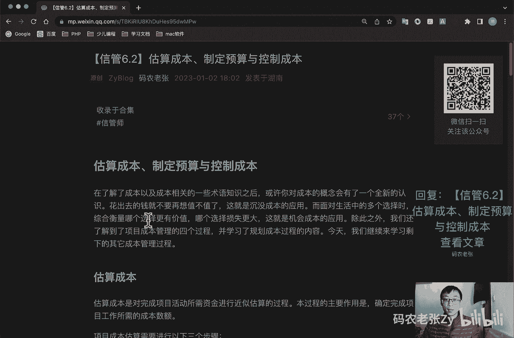

# 【信管6.2】估算成本、制定预算与控制成本 - P1 - 码农老张Zy - BV1DM4y1D7dd

哈喽大家好，今天呢我们来学习的是信息系统项目管理师，第六大篇章的第二篇文章，估算成本，制定预算以控制成本，其实也就是成本，这个里面的剩下的三个过程组啊，好了，我们先来看一下，在了解了成本以及成本。

相关的一些术语知识之后呢，或许你对成本的概念呢会有了一个全新的认识，花出去的钱就不要再想了，值不值了，这个就是沉没成本的应用，而面对生活中的多个选择时呢，衡量综合衡量哪个选择更有价值，哪个选择损失更大。

这个呢就是机会成本的应用，除此之外呢，我们还了解到了项目成本管理的四个过程，并学习了规划成本的过程的内容，今天呢我们就继续来学习，剩下的其他的成本管理的过程，好我们先看一下估算成本啊。

估算成本是对完成项目活动所需资金，进行近似估算的一个过程，本过程的主要作用呢，就是确定完成项目所需的一个成本的一个数额，好项目成本估算呢需要进行以下的三个步骤啊，第一个就是识别并分析成本的构成科目。

包括人设备材料的种类，第二个呢就是根据已识别的项目，成本的构成科目，估计每一个科目的一个成本的大小，第三个就是分析成本估算结果，找出各种可以互相替代的成本，协调各种成本之间的比例关系。

对于估算成本这个步骤来说呢，我们需要大量的数据资料，包括资源要求的品种数量，资源单价，资源占用时间等等，还需要考虑通货膨胀补贴，融资成本，应急成本等等，总之成本的估算呢是非常困难的。

它的困难点呢还包括哪些呢，还包括复杂的信息技术的变化，同类项目的缺乏，缺乏专业和富有经验的人才，信息系统项目建设人员的不同，以及管理才能压力与误解，估算成本呢，在成本管理中所能影响的因素包括呢。

非直接成本，墨成本学习曲线，项目完成的实现质量要求，储备信息包括应急和管理储备，这两个是什么东西，还记得吧，估算成本的工具与技术呢，其实是大家非常熟悉的，就是我们之前在讲进度的时候也讲过的什么呢。

参数估算类比，估算三点，估算三点，估算什么PRPERT还记得是什么吧是吧，最有可能的，然后最好的最差的三种是不是怎么去计算的，那些还记得吧，估算成本呢需要考虑已知的风险，需要由项目团队进行。

在项目生命周期中呢，项目估算的准确性，亦将随着项目的进展而逐步提高，例如在启动阶段呢，我们可以得出项目的粗略量级的一个估算，这个这个它的简称呢是IM，它的范围区间呢是在负25%，到正75%之间之后呢。

随着信息越来越详细，确定性，估算区间可缩小到负5%到正10%，这也体现了我们成本估算其实和项目一样，它是一个逐渐明晰，越来越清晰的一个过程，估算成本的输出呢主要是两部分的内容啊，我们先来看一下。

第一个呢就是成本估算，包括对完成项目工作可能需要的成本应对，以识别风险的应急储备，以及应对计划外工作的管理储备的，量化的一个估算，如果间接成本也包含在项目估算中呢。

则可能在活动层次或更高层次上激烈间接成本，默认的常规情况下是不包括这个间谍成本的，第二个呢就是估算依据，主要包括关于估算依据的文件，就是估算是如何编制的，比如说像这种文件啊。

另外呢就是关于全部假设条件的文件，还有关于各种已知制约因素的文件等等，好我们再来看第二个啊，第二个过程呢就是制定预算的过程，制定预算呢是汇总所有的单个活动或工作包，的一个估算成本。

建立一个经批准的成本基准的过程，最后一个基准成本基准等过程的重要作用呢，它是确定成本基准，可据此监督和控制项目绩效，最后一个基准成本基准，它就是经过批准，且按时间段分配的一个项目预算，但不包括管理储备。

制定预算的步骤包括哪几部呢，总共有三部，第一步呢就是分摊项目总成本，到WBS的各个工作包装当中去，为每一个工作包呢建立一个总预算成本，就是把那个工作包一条一条一条，他的成本给算起来。

然后呢将每个工作包分配得到的成本，在二次分配到工作包所包含的各项活动上面，就是再往再往下面的那一层去分，然后呢再确定各项成本预算支出的时间计划，以及每一时间点对应的累积预算成本。

制定出项目的一个成本预算计划，反正就是这样累加的，我们看一下啊，工具与技术，在制定预算的过程中呢，我们会用到一些工具与技术，大家可以简单的了解一下，第一个呢就是成本汇总，首先呢以WBS中的工作包为单位。

对活动成本估算进行汇总，然后再由工作包汇总到WBS的更资高层级，如控制账户，并最终得出整个项目的总成本，第二个呢就是储备分析，储备分析呢，主要就是计算出所需的应急储备与管理储备，第三个就是专家判断。

在制定预算的过程中呢，应该根据项目的工作需要，基于所在的应用领域，知识领域，学科行业等专业知识来做出专家判断，第四个呢就是历史关系，有关变量之间可能存在一些可据以进行参数，估算或类比估算的历史关系。

可以基于这些历史关系呢，利用项目参数来建立数学模型，预测项目的总成本，然后呢就是资金限制平衡，根据对项目资金的任何限制啊，来平衡资金的支出，如果发现资金限制与计划支出之间的差异。

则可能需要调整工作的进度计划，以平衡资金的支出水平，这可以通过在项目进度计划中添加强制日期，来实现制定预算的一个输出，它主要包括成本基准，项目资金需求，项目文件更新三部分内容。

我们主要来看成本基准和项目资金需求，这个成本基准啊是经过批准的，按时间段分配的，什么项目预算，不包括任何的管理储备，注意它不包括管理储备，只能通过正式的变量控制程序才能变更。

用作与实际结果进行比较的依据，这段话呢其实我们已经说了很多遍了，关键词也都在这几个什么批准的，按时间段的项目预算对吧，不包括任何管理储备，只能通过正式的变更控控制程序才能变更，这个东西呢就叫做成本基准。

之前我们还讲过什么，讲过那个进度基准，进度基准是什么，想一想啊，还有范围基准，范围基准又是什么呢，想一想好了，成本基准的过程呢，基本就是制定预算的过程，先汇总各项工作活，项目活动的成本估算及应急储备。

得到相关工作包的成本，然后汇总各工作包的成本估算及其应急储备，得到控制账户的成本，在汇总各控制账户的成本，得到成本基准，最后呢在成本基础上增加管理储备，我们就得到了整个项目的一个预算啊，他就是从下到上。

一步一步的去汇总出来的好项目，资金需求呢，则是根据成本基准确定总资金需求和阶段性，比如说季度或年度的资金需求，项目资金呢通常以增量而非连续的方式投入，并且可能是非均衡的，如果有管理储备。

则资金需求呢等于成本基准加上管理储备，在资金需求文件中呢，也可以说明资金的一个来源，好制定预算这一块，其实我们就已经算出了，这种总共我们所需要的一个成本，还有资金的需求都在这里面获得了好。

最后我们再看一下控制成本，控制成本呢是监督项目状态，已更新项目成本，管理成本基准变更的一个过程，它只监督资金的支出，而不考虑由这些支出所完成的工作的价值，对项目没什么意义啊。

最多只能使项目团队不超出资金限制，所以在成本控制中呢，曾因重点分析项目资金支出，与相应完成的实际工作之间的关系，有效成本控制的关键在于，对经批准的成本基准及其变更来进行管理，控制成本主要关注两种活动。

一个是当前正在进行的活动，第二个就是成本预算大的活动，在控制成本的过程中呢，我们重点关注上节课学习过的，造成成本失控的那些原因，要避免成本失控带来的巨大风险问题，项目成本控制主要包括。

对造成成本基准变更的因素施加影响，确保所有变更请求都得到及时的处理，当变更实际发生时的管理期间变更，确保成本支出不超过批准的资金限额，既不超出按时间段IWBS组件，按活动分配的限额。

也不超出项目总时间限额，然后呢就是监督成本绩效，找出并分析与成本基准之间的一个偏差，对照资金支出监督工作绩效，防止成本或资源，在使用报告中出现未经批准的变更，向有关干系人报告。

所有经批准的变更及其相关成本，设法把预期成本超支控制在可接受的范围之内，控制成本的工具和技术中，最核心的就是我们要买，马上要学习的一个叫正值计算的东西啊，就说过，整个项目管理领域的两大核心计算之一。

案例计算必出题之一，我们将在下一课去详细的小姐之前，一个就是什么那个网络图对吧，进度方面呢就是那个网络图相关的计算，然后在成本这一块，就是这个政治计算非常非常重要，好了，总结一下。

今天的内容呢是整个项目成本管理中，剩余的三个过程，包括各个过程的概念定义，要解决的问题，以及一些工具和技术的介绍，当然最最核心的内容呢我们将放到下节课再讲，但是这些概念内容呢也是必不可少的。

毕竟论文的基础就是这些过程和工具内容好了，今天的内容呢就是这些，大家可以回复文章的标题，信管6。2，估算成本，制定预算，控制成本来获得这篇文章的具体内容，以及相关的一些小经验，内容呢还是比较重要的。

大家还是要回来再好好的看一看的好了，今天的内容呢就是这些。

