# 【信管6.3】成本挣值计算 - P1 - 码农老张Zy - BV1UG4y1P7vb

大家好，今天呢我们来学习的是信息系统项目管理师，第六大篇章的第三篇文章，成本正值计算非常重要的一节课啊，好了铺垫了那么久，不知道大家期不期待，总算到了正值计算这一刻，这个名字很奇怪啊，什么叫做正直啊。

成本不是我们投资吗，这个正值他到底是要干嘛，带着这些疑问呢，我们就来看看正值计算到底是来计算个啥，正值计算啊，它的英文简称是ebm，就是把范围进度和资源绩效综合起来考虑，以评估项目绩效和进展的方法。

它是一种常用的项目绩效测量方法，他把范围基准，成本基准和进度基准整合起来，形成绩效基准，以使项目管理团队评估和测量，项目绩效以及进展，emv的原理适用于所有行业所有项目，它针对每个工作包和控制账户。

计算并监测以下三个关键指标，非常非常重要啊，先来看一下第一个叫做计划价值，它的缩写叫pv，注意啊，这个非常重要，计划价值缩写叫pv，也可以叫做b c w s，但是这个一般说的就是考试的时候。

可能会见得比较少，主要还是叫这个pv，这两个英文缩写呢都表示的是计划价值，它就是为计划工作分配的经批准的预算，它的公式是计划的工作量乘以预算定额，比如说我们某个活动，计算出来每天的各种人员工资啊。

资源啊，材料的成本，那它就是1000块钱，然后呢这个活动要实施30天，那么这个活动的pv就是3万元，项目的总的计划价值，也就是所有活动汇总的工作量与预算的成绩呢，就是项目的总计划价值。

简称文b a c就是汇总以后啊，就所有的pv全部汇总以后，就叫做b v c b a c好了，这两个这两个很重要啊，先记住了好了，我们再来看第二个，第二个就是正直，简称是e v。

另一个缩写呢是b c w p啊，主要还是这个ev好，他呢是对已完成工作量的一个测量值，注意他是已完成工作量的测量值啊，上面这个是你计划的，你计划的你做的预算你还没有开始做。

你可以提前把很多活动这些预算先给做出来，这个是你计划的，然后这个正直是你实际上已经完成了工作，的一个测量值，它是用分配给该中工作的预算来表示的，它的公式呢就是已完成的工作量乘以预算定额。

这注意他乘的还是预算，但是呢它是按你已完成的工作量来进行计算的，同样还是上面那个任务，假设我们在第十天的时候，你看上面上面计算的时候，我们是什么，30天每天1000元，对不对，那么在第十天的时候。

其实我们应该是花多少钱，1000x10，对不对，应该是1万块钱对吧，但是呢假设我们在第十天的时候，完成了12天的工作量，那么我们的正值ev就是12000，明白这个意思吗，就是我们多完成了两天的工作量。

我们多做了，做的多了，对不对，明显的我们做的比pv要多，因为pv到第十天的时候应该才是1万对吧，这个呢就是进度提前的一种标志，相反的情况下，如果说我们的ev没有pv多。

那么项目就是处在进度落后的一个状态下了，好这个叫做ev啊，概念要记清楚好，第三个实际成本ac实际上ac啊很重要，实际上ac那个缩写是ac w p，主要还是前面这个ac啊。

他呢是在给定时间段内执行某项工作，而实际发生的成本好，这个又不一样了，这个是实既发生的成本啊，就比如说还是上面那个活动啊，实际上我们在第十天的时候，消耗了13000元的成本。

而我们的一位就是我们之前算的一位啊，我们一维是多少啊，12000对吧，我们干了12天的活，但是呢我们花了13天的钱，这个问题呢是不是就很严重了，其实就能看出来什么呢。

相反如果说我们的实际成本它是小于正值的话，比如说我们在第十天的时候，我们花的实际成本只有11000，那么那么就是说我们现在的成本还是有结余的，对不对，我们用11天的成本，然后干了12天的活。

但是实际呢我们其实只用了十天的量，这个呢是不是就可以算出来他们一个成本，还有一个进度的一个情况，是不是很有意思对吧，很有意思好了，这三个指标呢是正值计算的一个核心指标，你会发现一个问题啊。

那就是他们都必须有一个时间维度，就是我就是上面这个例子里面的第十天，对不对，如果没有这个时间维度，那么正值的计算它就没有意义了，pv代表的是指定时间计划的价值，干没干活，这个值它都存在。

因为它是我们计划出来的，对不对，是我们估算成本和制定预算的一个结果，而ev呢表示指定时间内，我们实际上干了多少活，这些活值多少钱，事情发生了，但是我们只看干的活的一个价值，就我前面说的，到第十天的时候。

我们干了12天的活了，是不是这个就叫做一维，然后ac呢表示实际上在这段时间指定的时间内，我们到底花了多少钱，还是上面那个例子，我们在第十天的时候，我们干了12天的活，但是呢我们花了13天的钱。

是不是这个呢就是事情发生了，我们不看干了多少活，只看花了多少钱，好这三个东西啊，这三个东西非常非常重要，概念一定要搞清楚好了，我们再来看一下偏差分析，其实呢在上面这个例子啊，我们就已经看过了。

就是通过ev和ac和pv的计算就已经看出了，利用这三个数值呢，我们可以知道大概的项目进度情况和成本情况，是不是很神奇，其实这个呢也是有些公式的，分别是偏差公式和绩效指数，偏差公式，绩效指数啊。

好第一个我们看一下叫做进度偏差，它的简称是sv，诶，又来了sv，它呢表示的是正直与计划价值的之差，也就是s v等于e v减pv，前面我们讲ev的时候呢，就讲过ev与pv的关系，可以表示进度情况。

所以现在这样相减之后呢，我们就可以根据减去的结果来确定进度情况，如果说suv小于零，进度就是落后的，而让sv大于零时呢，进度就是提前的，但它刚好等于零的时候呢，表示进度刚刚好，ok我们再回来看这个例子。

再回来看这个例子啊，我们的sv是多少呢，应该就是e v12000 去减去我们的pv，第十天的时候pv是多少，1万对吧，因为我每天是1000块钱嘛，第十天的时候就是1万啊，上面这个上面这个例子呢。

这个这个30，那这个3万的话，我们可以看作是b a c对吧，它是1000x30天的，对不对，好这个是b c，然后第十天的时候是1万，一定要搞清楚啊，然后e v减pv 12000~1万。

我们赋予了2000，对不对，我们负余了2000，所以说我们这个s v它是它是什么，它是大于零的，大于零的时候就说明我们的进度是提前的好，现在明白了吧，如果它小于零的呢，那么就是进度是落后的好。

第二个第二个叫做成本偏差，就是cv很明显啊，他就是正值与实际成本的差，它的公式就是cv等于e v减ac好，还是我们上面那个例子，我们上面那个cv是多少啊，ac是多少，ac是13000，对不对。

13000，同样的还是我们的正值12000，去减这个13000，我们得到的是-1000，-1000表示什么呢，看一下啊，-1000就是如果小于一，如果大于一，就是啊这在这里啊，如果小于零，那么成本超支。

如果大于零，表示目前还有结余，那么我们上面那个项目的，现在的一个情况是什么呢，就是我们的cv cv是提前的，cv是有2000，对不对，然后我们的sv是2000，然后我们的cv呢是-1000，对不对。

-1000，也就是说我们的是进度提前，成本超支，大概就是这样一个情况，那么最惨的是什么情况呢，最惨的就是进度落后，成本超支，对不对，最好的是什么情况呢，最好的那肯定就是进度提前，然后成本还有节鱼。

对不对，这个呢就是一个最好和最差的情况，好了，我们再来看一下进度绩效指数，进度绩效指数叫做s p i是吧，s开头的跟他是不是有点关系啊，跟季度偏大远的关系，他们就是正值计划价值的一个比值。

也就是说spi等于ev，比上pv这个公式呢会获得一个进度系数，如果这个系数其实跟上面那个减法是一样的，对不对，这个系数啊就是他们俩的比值，如果说它大于一的话，那么就是进度提前的很明显吗。

12000比上1万来，不是我们是对，以12000比上1万，那么我们那个比例的话肯定就是大于一的对吧，它的总体思想呢和sv的概念呢，其实是一致的对吧，不过我们后面要学习到的一些其他公式。

会用到这种系数形式的数据，可以方便计算的，然后除了这个spy呢，另外还有一个就叫做cpi，叫做成本绩效指数，他们就表示为正值与实际成本之比，也就是cpi等于e v a c。

其实跟这个成本偏差也是一样的对吧，好这个呢同样的它和思维的思想是相同的对吧，如果大于一表示有结余，好这四个概念和公式就是这四个s v cv spi，cpi也是非常非常重要的指标，我们可以看出啊。

不管是s v还是cv小于零，小于零，它都代表着不好的事情，大于零呢都代表着好事，同理s p i和cpi也是小于一，都代表着不好的事情，而大于一代表进度和成本都不错，这也是一种记忆的方式。

就是小鱼都快是大于受欢迎好了，这四个也非常非常重要啊，好了我们现在已经知道几个了，再复习一下p v e v a c什么意思嗯，pv计划价值，ev正值，ac实际成本。

然后他们之间的互相的一个计算都是以什么，都是以e为开头的，注意啊，这四个s v cv spi cpi都是以e v开头的，然后sv和cv是减法，e v减pv和ev减ac，然后s spi和cpi呢都是除法。

它是算一个系数的，都是e v pv或者ev ac好了，一个是计计算它的进度的，s s开头的是跟进度有关的，c开头的是跟成本有关的，好了，这这几个东西啊，这七个东西啊，这七个呃，这七个非常非常重要。

好了我们再来看一下预测，预测呢就是说随着项目不断的前进啊，项目团队啊，它可以根据上面的项目绩效对完工估算，就这个东西叫做完工估算，叫做e ac，又来了eac进行预测。

这个预测的结果呢可能与完工预算b a c，b a c还记得吧，所有的pv加起来就叫做b a c，就是说我们对完工的估算啊，这个还还有多少要完工，这个e a c的估算呢，和b a c呢它可能会存在差异。

为什么呢，就前面我们说过了，然后我们的进度又落后了，那么我们原来的b a c可能就可能可能，可能可能不够了，对不对，因为我们的完工预算，肯定可能我们之前做的预算就不够了，这个时候要怎么办呢。

这个东西我们就可以用预测来解决它啊，好b a c呢我们在前面已经讲过了，就是所有活动pv汇总起来的，也就是整个项目的预算就是b a c，而完工估算e a c，则是我们在开始项目一段时间后。

比如说就前面那个我们做了十天以以后，我们10年以后我们发现什么呢，进度超前，但是成本落后了，这个时候呢我们再去根据正值分析的结果，来估算出来，最终我们的b a c要花费多少。

因为这个b a c他肯定要产生变化了，为什么要产生变化呢，我前面已经说过了，我们的进度提前了，这个时候bc肯定是不会跟原来的是完全一样的，注意啊，这个这个大部分情况下。

他肯定不会跟原来的完全一样的理想状态下，当然就是我怎么算呢，就是我们的e a e a c等于b a c，对不对，这个就是最完最最最最好的情况，最好的情况用问用我们上面例子怎么解释呢。

就是说我们pv在第十天的时候，我们的ev也是1万，然后a c也是1万，这个呢就是完全相等的，那么我们可能最后的e a c，可能还不会发生变化，但是我们说过这个项目它是不一定的，我们后面还有20天的工期。

对不对，所以说这个事情还不一定好了，这个都说了，这个就是最理想状态，对不对，能够这样正正好好的情况是少之又少的，那么这个e a c l如何计算呢，这里就要牵扯出另外一个名词了。

就叫剩余工作的完攻尚需估算etc，哎呀又来一个ea c etc，对不对，eac你可以想到他是跟这个bc是比较像的，然后这个etc它又是什么鬼的，他呢其实就是我们在执行一段项目工作之后。

就比如说我们上面那个我们已经干了十天，对不对，剩下的工作还需要多少成本，如果说我们是遵从pv的，也就是说我们的我们的e v现在是1万，然后ac也是1万，那么在这种情况下呢，我们是后面20天的话。

如果我们还是跟原来的b a c一样的话，那我们可能还需要2万就够了对吧，但是呢正是因为我们的进度提前了，现在这个b a c就是剩下的剩下的20天，他不一定啊，他2万不一定够了，所以说呢。

这个时候我们就要重新去计算这一块的，所以说这个这个剩下20天的内容就叫做etc，好这一块好好自己捋一下，好好一定要好好捋清楚好，我们这个e e s l它有好几个公式啊，它它不是一个公式啊。

这个你你在选择使用哪个公式的时候，你一定要审题好，我们先来看第一个公式啊，就假设项目经理，以已完成工作的实际成本为基础，并根据以积累的经验来为剩余项目工作，编制一个新的估算的话。

那么e a c等于ac加上自下而上的etc，这个自下而上的etc什么意思啊，其实它就是重新的20%天，就剩下的20天，我们就是前面我们说过的那个，前面十天已经确定了，对不对，你因为你已经盖完了嘛对吧。

那么我们剩下20天的工作，现在20个工作他重新再来估算一遍，重新再通过制定预算来重新的去估算一遍，好这个公式啊，其实它应用的并不是特别多，因为它太简单了，为什么呢，因为我们通常题目里面他会说明了。

是根据经验完全估算了etc，那么他肯定就会给出一个这个etc的值，这样的话我们ea就好算了，就直接拿ac加上那个etc就行了，这个就非常非常简单，所以说这种题出的不太多，这种题你就一定要注意的。

就是他在题目里面会说他根据经验，然后完重新注意要重新估算了etc，然后他会把这个etc的值给你，然后你去加一下就行了，非常非常简单，这就相当于送分的题了，好了就就就一定要注意这个关键词啊，好了。

除了这个方法之外呢，我们还可以通过cpi和s p i等方式来计算，各种风险情况下的正值，分析数据的一个e a c值，这几个方法会更重要一些，也是必须掌握的好，这个就牵扯到剩下的两种计算啊。

剩下的三种计算方式了，好第二种就是假设按预算单价完成etc工作，也就是说后面的工作呢，还是按我们之前pv的预算去进行的，就我们之前pv的预算剩下20天还有多少啊，还有还有2万块钱对吧。

这种方式就是说不管目前的ev它偏差是好是坏，我们都不管了，后面继续按之前pv的计算，但是后面的etc实际上就是什么呢，实际上就是b a c去减掉ev了，为什么呢，因为我们现在已经去做了这个值了，诶。

就是已经做了那么多工作了，对不对，实际上就是我们后面的etc就变成什么呢，etc就变成了b a c减1v，我们原来b a c是多少3万对吧，3万 30000-1 v1 v是干了12000，对不对。

其实还有多少1万，还有18000对吧，还有18000，然后呢这个剩下的，然后我们还要把实际已经花费a c d加上来，这样的话呢，完整的公式就是e a c等于ac，加上b a c减e v。

这样的话呢其实ac我们用了多少，13000对不对，13000，然后我们这边啊，这边那个呃，我们先看一下ac是13000对吧，我们就算13了，然后b a c是18了。

然后我们把他们俩加起来的话就变成了多少了，是不是21了，对不对，比原来的就是比那个原啊，不不不是21啊，就是31了对吧，31了，是不是这个呢就是我们这种情况啊，这个这个就是这种情况。

这种计算方式呢它其实就是我们在做题的时候，他也会出一个名词，就叫做非典型偏差计算，非典型偏差计算它也有，它也有可能说是什么，就是说当前的呃，就就是说就是说不管目前的ev是好是坏。

就是继续按之前的pv来计算，它可能会有两种说法，一个叫做非典型偏差计算，就是用非典型偏差来计算，另外一个呢就是说按继续按之前的pv来计算，他出题的时候，这两个关键字啊一定要注意啊，一个叫非典型偏差。

一个叫按继续按之前的pv来计算好，这里还有个例子，就比如说我们当前的当前的ev，当前的ea啊，ea现在是1000对吧，然后这里我们ac然后ac现在是1100，然后b a c就是原来那个计划出来的。

所有的b a c是12000，看啊我们要注意看这些条件，那么e a c现在，那么那么如果他的题目里面说了，现在按非典型偏差来计算，或者说继续按之前的pv来计算，只要他题目里面出现这两个关键词了。

那么我们剩下来的ea c的计算，然后他问你ea c要多少钱，或者说你以后要超支还是结余，那么我们就可以来计算了，就是使用e a c的公式了，就是什么ac ac是多少，11000对吧。

11000去加上dc减一为12000-1000，最后的值呢就变成12100，也就是说最后预测出来的总体成本花费呢，我们要超支100块钱了，为什么，因为原来的b a c是12000，对不对。

这就是第一种计算方式，还是注意要抓关键词啊，很重要啊，抓关键词好有非典型的，那么也有典型的，这个典型是什么意思呢，就是说假设以当前的cpi继续完成etc工作，也就是说后面的etc预算就是后面的20天啊。

还还拿最早的那个例子，就是后面的20天的预算，以当前的ev和ac的比例来进行计算，这个很好理解啊，就整个预算b a c与我们计算出来的cpi的比值，它就是整体的ea c了。

这个就是小学这个小学还初中数学的问题了，对吧，e a c就等于b a c h比上cpi，就我们到第十天的时候计算出来的这个cpi，我们拿之前之前我们的整体预算b a c去比上。

这个我们到第十天的这个cpi的那个一个系数，那么我们计算出来的结果呢，就是我们后面要那个最最最最终的这个，e a c的结果了，这种计算方式呢叫做什么，叫做典型偏差计算，典型偏差计算。

当然他题目里面还会问到还会怎么说呢，就是说以当前的cpi继续完成遗体呃，etc工作啊，就或者说完成剩余工作，或者说完成etc工作，都有可能这两个单词要么叫剩余，要么叫etc。

或者说他会问你以典型偏差的方式来进行计算，求最后的一个e a c，求最后的一个e a c，或者说求你最后是超支还是结余对吧，他几种挑还是抓关键字啊，注意抓关键字好，这里也有一个例子啊。

就是还是以这个例子，比如说当前的e v，当前的这个ev是我就写个e啊，ev是1000对吧，然后ac是1100，然后b a c是一二呃，12000哎，还是前面那个对吧，就跟这个例子一样的。

那么eac现在是多少了呢，那么eac现在就是12000对吧，在这里公式在这里了，12000除以这个cpi cpi是什么，e v比ac对不对，12000除以这个ev比ac。

它的结果算出来的结果就是13200块钱，那么我们预设的预测出来的，这个e a c就要超值，就以现在的这个呃，以现在这个呃cpi来进行计算，因为现在我们现在本来，就已经是一个超支状态了，对不对。

e v比a c少啊对吧，所以说到最终的结果之后呢，他肯定是往后面，如果按现在这个cpi比率来进行计算的话，那么他越到后面，他肯定超支的也就越多了，好最终就是超值了11200块钱，1200块钱好。

我们再来看啊，我们再来看就是最后一种假设，就是假设s p i与cpi同时影响etc工作，好继续抓关键字啊，我们把这个颜色换一下，假设s p i与cpi同时去影响etc的工作。

这个就说明这两个指标就就就这个东西，就说明两个指标，就是spi和cpi，同时都有可能对后续的工作造成影响，那么我们就需要将这两个指标同时带入计算啊，注意还是抓关键词啊。

哎就是同时去影响s p i和cpi同时去影响，或者说指标所有的指标，所有的指标都有可能造成影响，那么就需要将这两个指标同时去代入计算，后续工作，bc减b a c a c的变动。

会和spi和cpi都产生影响，那么etc也就等于这个公式了，b a c减e v比上cpi乘以s p i，还是做一个系数的计算对吧，我们b a c去减上e v需要d a c去减上一枚。

就是我们剩余的这个计划成本，剩余的计划成本比上我们好，我们cpi和spi同时去影响的一个结果好，最后计算出来的ea c的公式是什么呢，他就是e a c等于ac。

加上b a c减e v除以cpi乘以p i5 ，感觉好复杂对吧，但但是呢其实都很简单了，他出题的时候都会跟我这个一样，它会出现这种很简单的一种整数的加减乘除，还是比较简单的好，我们现在还是看这个例子。

首先我们说这个他的ev是一杯是多少，1000对吧1000，然后ac是1100，还是那个ac是1100，然后pv是1200，pv是1200，诶我看一下这个结果哦，那他干的活少对吧，干的活少。

这两个他都是小于他们算那个cv或者sv的话，他都是小于的，就说现在是成本超支，进度落后的一个状态，他现在就已经就很惨的状态了，好那么这种这种情况下呢，他们两个同时作用的话。

那么最后呃那我再看一下b a c是12000，那么ea c它的结果就是套公式呗对吧，套公式，那么a c a c1100 1000，加上什么b a c减1v12000 减1000，然后再在比上呃。

再除以s spi s p i，然后乘以cpi的结果，然后最后算出来的就是15520对吧，我们预测出来的ea c，要超支3520块钱了哇炒的越来越多了，为啥呢，就是因为我们的cpi和s pi它都小于一了。

进度落后，成本超支两个一起作用，后续的工作的话，那肯定这个这个成本超支越来越多了是吧，越来越惨了好了，这几个计算啊同样的非常非常重要好吧，ea c这几个计算也非常非常重要，有几种三种，对不对，有三种诶。

我这个就变颜色了，好有三种有呃，不是三种，四种对吧，四种抓关键字，还记得抓关键字这个自上而下的对吧，自上而下的一以呃，就是以以完成工作的实际成本为基础，然后自上而下的去进行剩余工作的估算的话。

那么就是这个公式对吧，这个是最简单的好，第二个呢，第二个关键词是什么呢，就是按预算单价完成一定工作，就是按之前的pv预算进行，然后是非典型偏差计算使用的是哪个公司呢。

就是这个公式a c加上b a c e a好，这个也比较简单，注意这个括号，这还有个括号，然后呢就是以当前的cpi继续完成etc工作，就是后面的c e t c预算呢，以前的e v和ac的比例来进行计算。

然后它的关键字还有一个就是非典，就是典型偏差，典型偏差上面这个是非典型的，这个是典型偏差，好的，它的公式就是b a c比上cpi好，最后一个特别复杂的就是c s p i和cpi，同时影响etc工作。

这个呢它的公式就比较复杂了，他这个公式就是a c加上b a c减ev，然后除以cpi乘以p i的一个值，最后的一个综合系数，那么他最后的就是一个e a c的计算结果了，他注意的就是所有的指标都同时影响。

后续的工作，或者说叫etc的工作，这个etc就是后续的工作，e a c就是我们根据后续工作的一个计算，来获得了一个最终的一个，就是根据当前的进度情况，获取的最终的一个预算的值o。

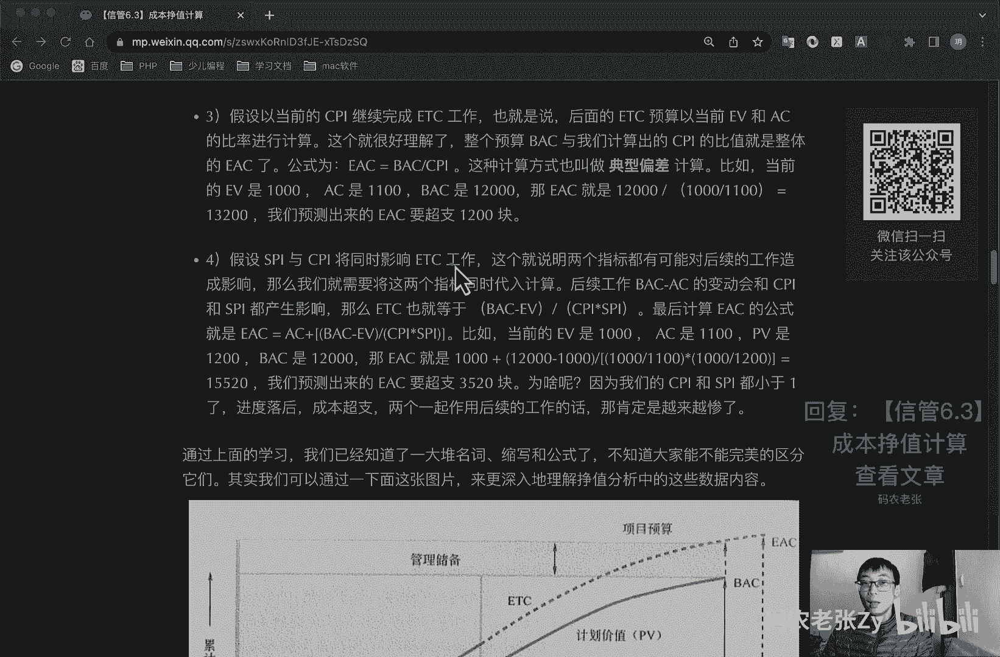

通过就是上面这些学习啊，我们已经知道了一大堆的名词缩写和公式了，不知道大家能不能完美的区分他们啊，你第一天听这个课肯定还是分不清的，我们还是要不断的来复习，不断的来就是去做一些题啊，来学习一下好。

我们再可以，我们也可以通过这张图片再来看一下，这个图片也是成本基准的一部分啊，只有成本基准里面说的那个s曲线，就是这个东西，就是这个东西，这个东西就是一个s型的一个曲线，看到没好，我们先来看一下啊。

这个线怎么看啊，你看这一条线啊，这上面写了这个叫做pv，对不对，pv到最终项目做完这个地方就叫做b a c好吧，b a c它不包含管理储备，b a c不包含管理储备，对不对，好，这个就是pv。

然后这条线，这条线就是我们假设的那个时间节点，就比如说我们前面说的那个第十天，第十天好吧，这个这条线就是我们时间节点，然后为什么pv是一路向后，一直到这个项目结束呢，因为pv是我们的计划价值呀。

pv是我们提前已经计划好的，所以说它是可以到头的，它是它是已经编制完了，已经到头的对吧，然后我们这个ev啊，这个ev ev是只到这个时间节点的对啊，我们到这个时间节点干了多少活儿，对不对。

这个是一杯我们挣了多少，挣了多少钱是吧，挣了多少活回来就叫正值好，他直到这个时间节点了，他没有后续的啊，他没有后续的好，我们再来看一下，就是实际成本，实际成本就是我们到这一天已经花了多少钱，对不对。

我们到这一天已经花了多少钱，他也是到这个地方截止的，但是他后面有个虚线，这个虚线是什么呢，虚线就是我们上面算的那四个啊，那个etc啊，etc就是在这一块的这个虚线，就是etc，就是我们上面那四个算法。

四个算法最后算出来的结果，到项目结束的地方，这个地方这个结果就叫做ea c，它可能是比这个多的，对不对，比abc多了，它在它的上面，这个呢就是这几个名词都解释到了，对不对，然后还有几个名词在哪里啊。

还有几个名词cv对不对，1v简p v c v对吧，嗯这个是s v s v s v e v减pv是s v对吧，然后呢你看这条线就是s v是不是好，我们再来看ev和a c e v和ac的是什么cv，对不对。

cv cv就是这一条线，是不是这一条线就是c为，有意思吗，有意思吗，上面我们学过的那一大堆名词啊，那一大堆缩写啊，全在这一张图里面全展示出来了，这张图就是成本基准，非常非常重要好非常非常重要。

ok下面这个具体解释呢，大家也可以再过来看一下啊，刚刚我已经其实都说过了，这张图上所有的东西，好这个图啊，这个图你其实也一眼能看出来了，也能看出来什么问题了，这个图就是进度落后，为什么呢。

因为这个正直啊，你看正直在这个时间节点，它是在最底下的，我们看一下它的这个这个纵轴，这个纵轴是累计的值，也就是我们现在那个金额对吧，然后横轴是时间日期对吧，在这个时间点上，这个正值是在最底下的。

他他去底下的，然后ac pv比他多，对不对，ac比他多，那么它很明显的他就是相当于呃进度落后，成本超值了，你很明显吗，你这个点就比如说这个点是1000块钱，对不对，然后p前面说的那个pv是什么。

pv是11100对吧，然后那个ac是多少，1200，对不对，就假设你这个ev现在是12000的水平的话，那么他这个点应该跟这个ac的点是在一起的，对不对，但是他现在比他低，那很明显了。

现在就是进入落后成本超支的一个状态，对不对，从这个图也能看出来是吧，很有意思吧，如果这个正值这个正值在它的上面，那么它就是比那个他和pv，他就是他在pv的上面的话，那么就是s v还可以的。

进度还是可以的，那么他如果这个正值在最顶上的话，比他们两个都高的话，那么就是进度提前了，成本也是有结余的，那是最好的情况对吧好，这张图把上面那一堆公式其实也全讲了，是不是非常有意思的。

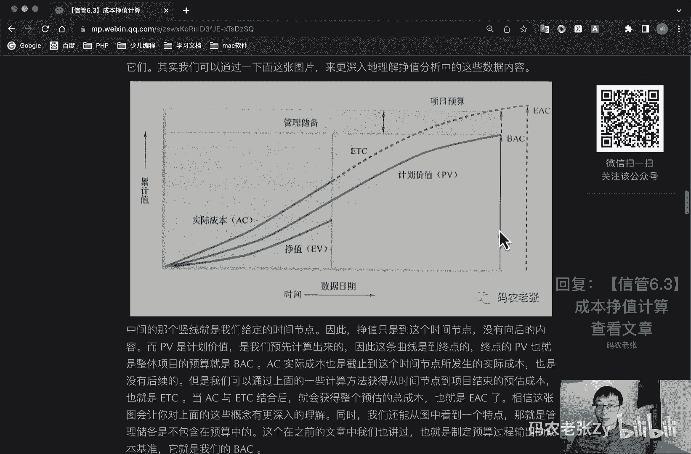

好了，我们再来看一下啊，完工尚需绩效指数，哎呀又来两个，又来两个，放心放最后两个了，最后两个了，好完工尚需绩效指数呢叫做tcp i，它是一种为了实现特定的管理目标，剩余资源的使用必须达到成本，绩效指数。

是完成剩余工作所需的成本与剩余预算之比，t c p i呢是指为了实现具体的管理目标，比如说b a c或者是ea c，也就是说我们还想按以前的b a c来做，对不对。

剩余工作的实施必须达到成本绩效的一个指标，如果b a c已经明显不可行了，这项目经理应该考虑使用e a c进行tc pi计算，经过批准之后，就使用e a c取代b a c好，我们先来看第一种啊。

就是基于b a c的计算公式，他这个什么意思啊，我们先不说这个公式啊。

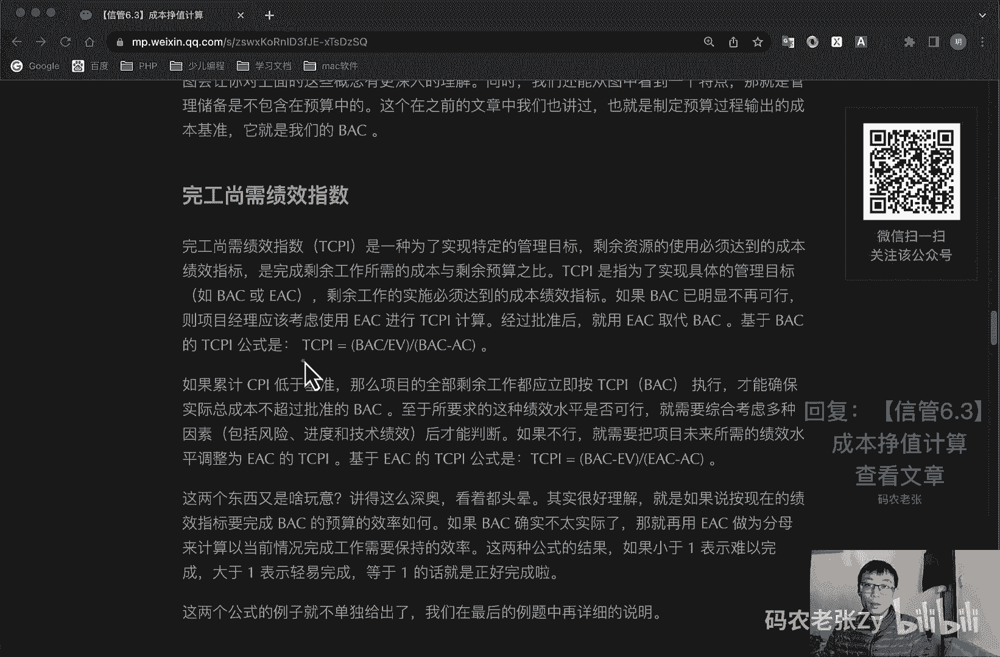

我们先来说这个什么意思啊，就是说我们还要看这张图，就是说我们最后还是想以b a c，最后还是想以这个成本来结束项目，来结束项目，然后在这种情况下，就以当前这个时间节点，这个e v当前的这个情况来看的话。

我们要以这个来结束项目的话。

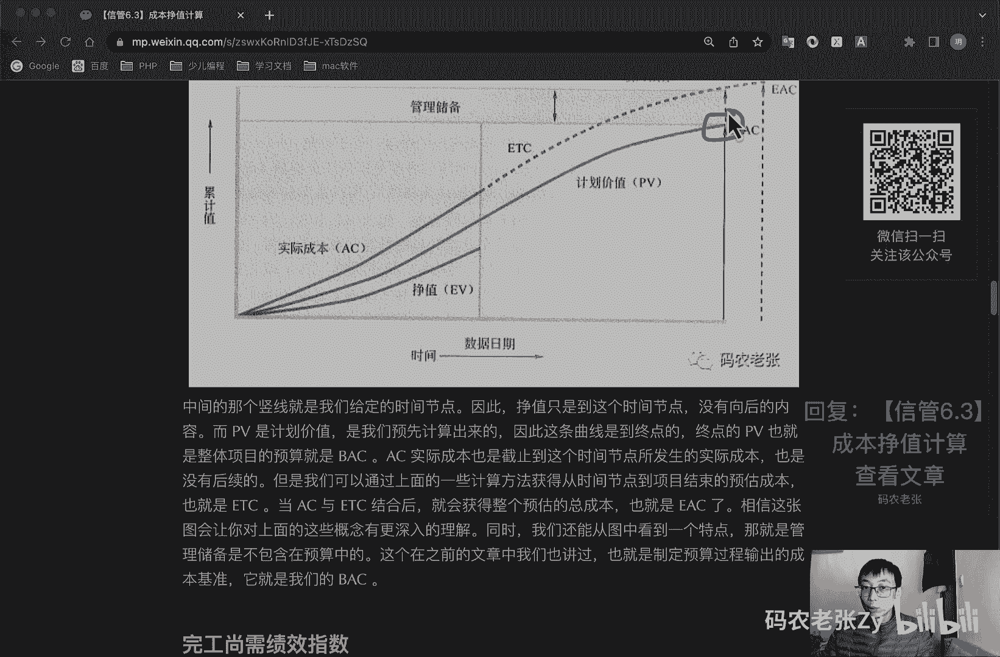

我们需要付出多少的一个代价，知道吗，大概就是这个意思啊，大概就这个意思好，我们第一个就是第一个公式啊，就是基于b a c，就我刚刚说的而已，b a c为最终的那个实际的一个成本。

我们现在还就是还需要完工，尚需的一个绩效指数是多少，就是它的公式就是d a c，b e a除以b a c减去a c b c减ac，就是我们剩余的还有多少钱，对不对，我们还是拿前面那个来说。

就是说我们那个ev是多少，ev是12000啊，也就是ac是1万啊，13000，对不对，然后b c是3万，对不对，这个就是相当于我们剩下还剩下多少钱，还剩下17000块钱了对吧。

还剩下1017000块钱了，然后前面这个b a c比上这个ev呢，就是我们现在已经计算完的那个呃，就是我们已经挣到了钱，已经挣到的钱和这个总预算的总预算，和已经挣到的那个正值之间一个比值。

最后跟他们俩再去做一个比较的话，我们就获得一个最终的一个完工，尚需完工，还需需要有多多大程度的一个努力才能达到，这个，我们当我我我们最后可以通过bc，就是不增加其他的成本预算的情况下。

来完成这个项目的一个完工，尚需绩效的一个指数，第二种情况呢就是如果累计cpi低于基准，那么项目的全部剩余工作，都应该立即按t c p i b a c执行，才能确保项目实际总成本不超过批准的b a c。

至于所要求的这种绩效水平是否可行，就需要综合考虑多种因素了，包括风险啊，进度啊，技术绩效，最后才能判断，如果不行的话，就是前面那个b a c，我们肯定就是感觉这个差距有点太大的话。

那么就必须要用e a c来取代这个b a c了，用e a c来计算的话，它的公式就稍微变一下啊，就是b a c e a比上b a c a e a c减ac好，这个有还是又稍微有一点点变化了。

这个就是b a c减e v，还是就是我们那个总的预算，减去我们已经挣到的那些值，我们还剩下多少工作没有做完对吧，还剩多少工作没有做完，这是前面的第一部分，然后第二部分它的比值呢。

就是我们这个根据最后推算出来的ea对吧，ea减去我们已经实际花费的成本，我们还剩多少钱可以去可以去做对吧，还剩多少钱可以去做，那些上没有完成的那些工作好，最后他会算出来一个另外一种体c p i。

一个是以b a c为基础，一个是以e a c a为基础啊，注意这两个公式的一个区别，同样还是看题抓关键字好吧，好看题抓关键字好了，这两个东西啊又是啥东西呢，讲的这么深奥，看着都头晕对吧。

我前面讲的可能也有点绕啊，其实很好理解啊，就是说如果按现在的绩效指标，要完成b a c的预算的效率如何，我就是前面说过了对吧，如果ba确实不太实际了，那就再用ea c作为分母来计算当前的情况。

完成工作需要保持的一个效率，这两个公式的结果它都是一个系数，对不对，就是说他们的结果如果是小于一的话，表示难以完成了，很难完成了啊，大于一的话表示可以轻易的去完成，轻的去完成。

等于一的话就是正好完成对吧，就是呃就是比如说我们还是想以b a c来进行，最终的一个计算的话，那么如果这个b a c计算的公式的结果呢，它是小于一的，就是说现在的b a c已经不太可行了。

你可能就是很难达到你的那个呃，之前b a c归计划出来的那个啊花费的水平了，那么我们就把它换成e c来进行，再进行一下计算对吧，就是就是大概是这样一个意思好了，这两个公司这两个公式的例子呢。

就不单独给出了，我们在最后的例题中会再进行一个详细的说明，好我们来总结一下今天的公式开盘是吧，好多东西对不对，其实总体来说还算过得去啊，因为都只是简单的加减乘除，只是有些概念呢你需要搞清楚。

有的公式如果你理解了，其实就会有更好的记忆，注意这些公式啊，今天的课程内容呢全部全部都是重点啊。

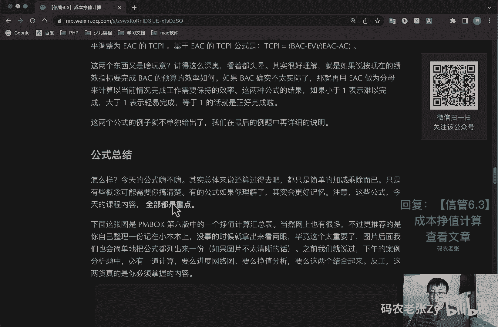

非常非常重要的啊，全部全部都是重点，下面这张图呢就是这个图啊，这个图呢它是偏book第六版中的一个，正值计算的一个汇总表，当然网上也有很多这种互动表，不过更推荐的是你自己去整理一份。

没事的时候呢就拿出来看两眼，毕竟这个东西太重要了，图片后面呢，我们会简简单的把公式再列出来一份，如果图片不太清晰的话，之前呢我们就说过，下午的案例分析题中必有一道计算题，要么就是进度网络图。

要么就是政治分析，反正这两货真的是你必须要掌握的内容。

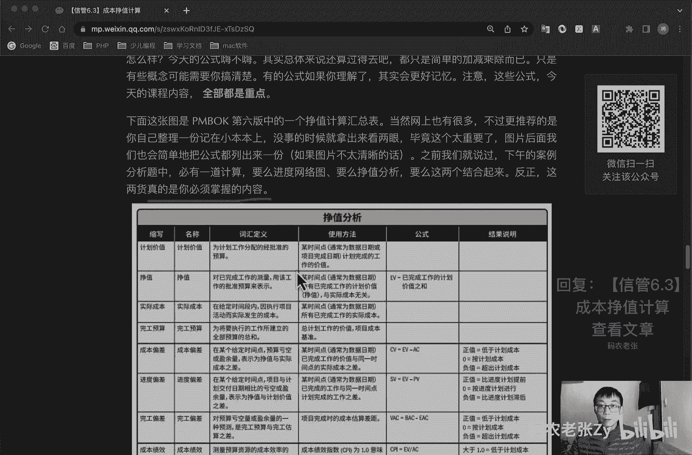

好这个是书上的内容，我就不看了，这个图可能也会有一点小，大家也可以你自己放大去看一下，我们主要看下面那个公式，下面那个公式就是cv等于1v减ac，不用多说了吧，前面都说过了，然后sv等于1v减pv。

然后v a c等于b a c e a c，这个没说啊，这个没说，我们可以看下图啊。

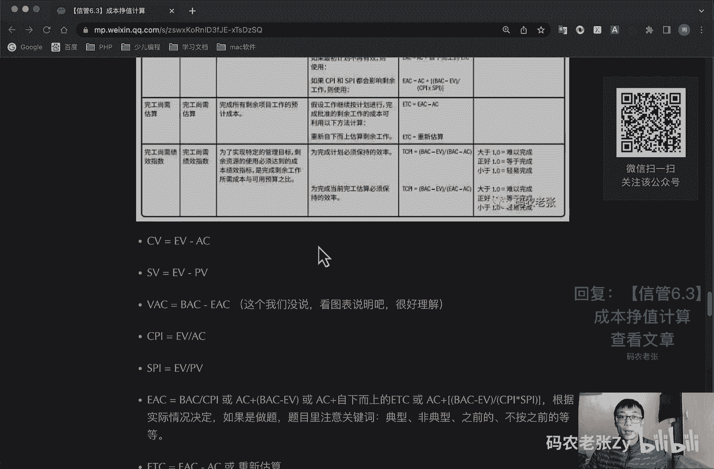

这个v a c是什么东西啊，vc在这上面vc它叫做完工偏差，人工偏差呢是对预算亏空量或盈余额的一种预，测，是完工预算与完工估算的之差，项目完成时的成本估算差距啊，它就是它的公式，就是b a c。

就是我们之前计划的一个b a c减去那个ea，就比如说我们成本超之类之后，他的ea肯定会比这个b a c多的，他就是一个负数对吧，所以说啊如果他是一个负值的话，就是说超出了我们计划的成本。

如果他是零的话，就跟计划成本正好相等的，如果他是正直的话，就是说我们现在是低于计划成本的好，这个叫做v a c。

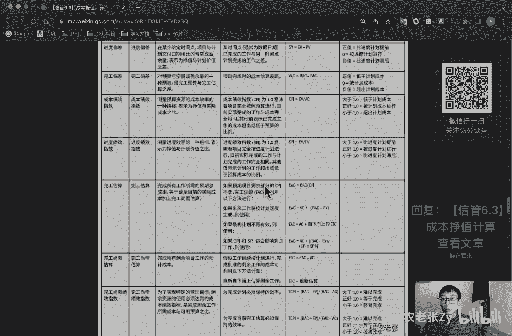

这个一般出题出的不太多啊，这vc一般出的不太多，好cp cp i e a b a c对吧，s p i e v比pv，然后ea c ea c有好几种计算公式，对不对，aa c等于b a c比cpi。

或者说是ac加上bc减，你为，或者说是ac加上自下而上的etc，或者说是ac加上b a c e a比上cpi乘以cpi，s p i这个抓关键词，再强调抓关键词，根据实况实际情况决定。

如果是做题题目里面注意关键词，典型的有哪个典型的有哪个对吧，非典型的有哪个，之前的是不是还按之前的cpi，对不对，或者是不按之前的cpi怎么样，对吧对吧，这个就是这些好etc etc的话。

一般它的计算公式就是一个b a c减a c，或者说是重新估算，重新估算的话，就是他会直接把这个etc的这个值给你，然后怎么做呢，ac加上这个重新估算的etc就行了是吧，非常简单就可以算出ea了。

好t cpi tcp两个公式，对不对，一个以b a c为基础的，一个以e a c为基础的，同样我们要根据题目中的实际情况，题目中就是把这把握关键字，继续计划或者是计划已经不可行了，计划不可行了。

用哪个对吧，还是继续之前的计划用哪个是吧，想一想好，接下来看例题了好了，和进度管理中的网络图关键路径法一样，就是不来个例题，这些公式真的会让人感觉非常的飘渺，那我就来做一个例题啊啊我们来看一下。

就是财政基本建设管理信息系统，是一套能够为财政服务提供财政基本建设，自己的财务监督审核，为财政了什么，基建预算科和国务科提供相关部门提供，相互互晓了一个啊，工程项目管理的一个应用系统，系统。

充分的体现了财务部门呢，对基本建设项目的一个管理，对国家预算安排的基本建设资金的使用的管理，反映财务部门对基本建设项目的一个管理，更好地实现了财政的管理监督的职能作用，ok这个一般都是题目的前景啊。

这个简单看一下就行了，好这个就是正题，一般在这个地方啊，好张公是大型电子政务项目系统集集成商，信息技术型公司，这个这个什么的一个项目经理啊，目前正在为项目经理负责c a s i。

c s a i与某地财政局开发的，基本建设管理信息系统，项目项目组成员包括项目经理，一个人，系统分析师，一个人，高级程序员三个人，程序员什么什么一堆人啊，这个这个这个这个这上面这些东西都没用。

然后呢由于财政年度等因素啊，项目的计划工期啊，注意看项目的计划工期40周，预算总预算成本505000 10万ac出来了，对不对，好，我们就把这盯住啊，a c a c出来了，对不对。

然后呢根据项目的需求和进度的要求，项目具有公积金技术高，什么复杂的特点啊，什么这些的，大家看一下就行了，好在项目的实施过程中呢，第19周的时候注意时间点出来啊，时间点出来，第19周的时候。

他向报报告进展状态，在状态报告中呢，经理列出了第18周，包含第18周的项目状态啊，他真实的真实的在这里对吧，第18周好，截止当前的项目状态日期呢，实际上已经完成了工作量为50%。

诶实际啊这个不是a c l这是b a c对吧，下面这个是b a c，这是预算总成本b a c对吧，这个地方才是a c，是不是完成了50%，百分之五十五十万的50%多少了，25万对吧。

好的我们第一个找出来了，b a c，找到了a c，找到了截止项目状态日期的项目，已完成工作量的实际成本ac哦，这个是ac啊，已完成的实际成本是ac是28，诶不对，我看没有，我都搞错了，这个是28。

这已经给出来了28，那么这个以完成工作，以完成的工作量为百哦，这个是一维雅啊，雅啊雅差一点就做错了对吧，这个是意为这个是意味啊已完成的工作量啊，这个是意味好，截止项目状态日期的项目的计划成本pv。

26万，26万哎，关键关键的都有了对吧，b a c500000 ，50 25，28，26是不是都找到了好了，这个东西很关键啊，啊我们再来看一下啊，我们看一下这个具体的一个问题啊，第一个问题就是呃。

是确定项目截止到项目状态日期，已完成的工作量的增值ev啊，这个刚刚已经找到了吗，不是50吗，然后第二个呢就是呃，呃预测项目结束时的总成本，e a c e e a c的公式啊，e a c的公式好了。

有有三三种模式啊，这个呢一会我们再看，然后呢，就是请对项目在费用控制方面的执行状况，进行一个分析，这个就费用控制情况的一个分析，然后问题四呢就是项目经理在检查经费超支时。

发现呢有一项任务f还没有开始实施，但为f购买设备的支票已经支付，其费用为4万元，就是ac又多加了一点啊，ac你看到没有，他已经支付了，那么ac要多加4万块钱，他的意思就是这个啊。

然后另外呢还有一张已经支付的支票，其费用为3万块钱，多加7万块钱吗，是这个是作为整个h任务的一个硬件费用，但h任务呢，在状态日期完成的工作量为40%，就3万的40%，这个地方要注意啊。

他他这个方又有坑了3万 3万的40%啊，就注意这个地方根据这一信息呢，在预测项目结束时的一个总成本，就是说他现在在在状态完成日期的啊，这是个意味，他这意味啊又加了一个3万的40%，好。

这个地方一定要把图题读明白了，然后我们就开始套用上面的公式啊，把所有的数据全给计算出来，不管有没有没用的，我们就当做是练习对吧，然后把所有的算出来好，我们前面分析的对吧，b c b a c是50万。

然后pv 26，ac 28，e v25 ，对不对，这个我们都是上面说出来的好，这四个是哪里来的，就是预算成本50万，这个对吧，然后是b a c，然后在详细情况，实际已完成工作量为50%，这个是e v啊。

这个是e v，前面我差点搞错了那个地方，这个是e v好，这个就是25万，然后剩下的ac和pv呢，他那个题目里面直接给出来了，好接下来我们算什么呢，接下来就是算cv对吧，cv很简单啊，3万。

然后cpi也出来了，0。89，然后s v是1万啊，-10000对吧，-10000，然后s p i是0。96，s p i是0。96，啊这个是-30000，这个-10000，这个0。96哎他都行。

这个不用多解释了，目前来看进度落后，成本超支好了，我们再来看一下ea c ea c等于b a c比上cpi，为什么是这个公式呢，对吧，因为题目里面啊他没有给啥有用的信息，你看这个题目里面他说的什么。

题目里面，就是说就是说预测项目结束时的总成本ec，他什么都没说，那么如果他什么都没说的话，我们就按典型偏差来进行计算，如果题目里面什么都没说，就按这个来明白吗，就按这个来好，这这个意思呢。

就是假设后面的工作都会受到cpi的影响，他什么都没说，就按这个来，如果题目中给出了他说的是非典型的话，那我们的公式就要换成那个ac加上b a c，减ev这种形式了，对不对，好我们就按这个最什么都没说。

这个来说的话，那么他最后的这个e a c就是50，6。18万对吧，很明显这一题就是包括下面这一题，也就呃包括那个包括那个第几题啊，包括第三题也出来了对吧，他现在的执行状况的分析也出来了。

他已经是在超支的状态了，好我们再看计算一下etcl，etc等于ea c减ac就是56。18，减去二二十8=28的一七，好vc我们也给出来算一下啊，vc就是e a c减去b a c等于56。17。

减去50=6。17，好这两个也不多解释了，他肯定是已经那个超值了，好我们就来看一下那个t cpi，如果b a c如果以b a c来作为目标计算的话，tc p i等于b a c。

e a除以b a c a c等于结果是1。14，如果以e a c为目标来计算的话，他就是公式是b a c减e a除以e a c减ac，它的结果就是0。89，很明显就是典型ec来看的话，成功率会高一些。

而之前如果以之前的b a c为目标的话，可能项目完成的成功率就比较低了，注意tcp i是大于一的，是更加难以完成的，这个问题啊，就相信1~3就有上面这一堆计算出来的结果。

之后就是问题1~3都没问题了对吧，我们最后来看一下问题四啊，就我前面说过的这个地方是有坑的，他那个就一有一个任务还没开始实施对吧，但是他购买来的支票却已经支付了，就ac肯定多多了点钱了。

这个呢我们就来看一下，具体这个地方怎么分析啊，好我们仔细分析分析四已经支付的支票呢，其实就是ac，但是我们在统计的时间，截止节节点的f任务还没有开始，那么它的支出应该还不是算在当前时间点的。

同理呢h任务完成了40%，那么其实还是有60%，是不算在当前的ac当中的，因此ac就变成了什么，就变成了28减去哦，它它是减啊，我看一下啊，f是f还不f任务还没有开始，那么ac还不算他。

ac还不算这个ac，那我们要减去这个4万，他实际成本原来有28万，但是他因为他多加了那4万对吧，所以我们要减掉一个4万，同时呢我们还要再减去一个3x0。6，也就是这个ac。

也就是那个h任务只完成了40%的，然后最后他这个ac就产生变化了，它就变成2。22了，那么在这个情况下，cpi就变成了25以上，2。22，其实他就已经，他他他他前面的那各种情况都已经反过来对吧。

然后典型的e a c呢就变成44。24了，就是成本其实是有结余的了对吧，他这个其实就已经好了很多了，ok这个例题呢它也是选自于新管网的，它的原始链接和参考答案就是这个啊。

大家可以自己再去复制这个链接去看一下好了，你会发现啊，就是在这个参考答案中呢，计算e a c的方式和我们的不一样啊，其实这也是一个小技巧。

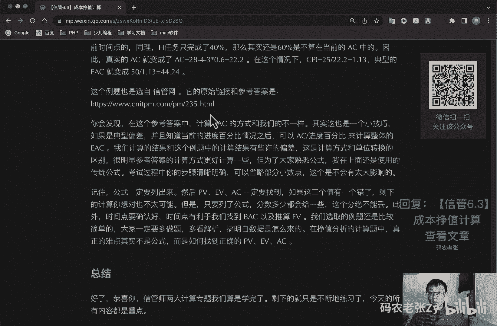

我们看一下啊，看一下这个参考答案，就是他这个ea是怎么去算的，好这个就是这个原题啊，这个原题的话，看一下他的这个e a c e a c算的公式是什么，我看一下啊，还有他的e a c是28。

加上28%除以这个50%，等于56万元，他他最后的结果ea是这么算的好。

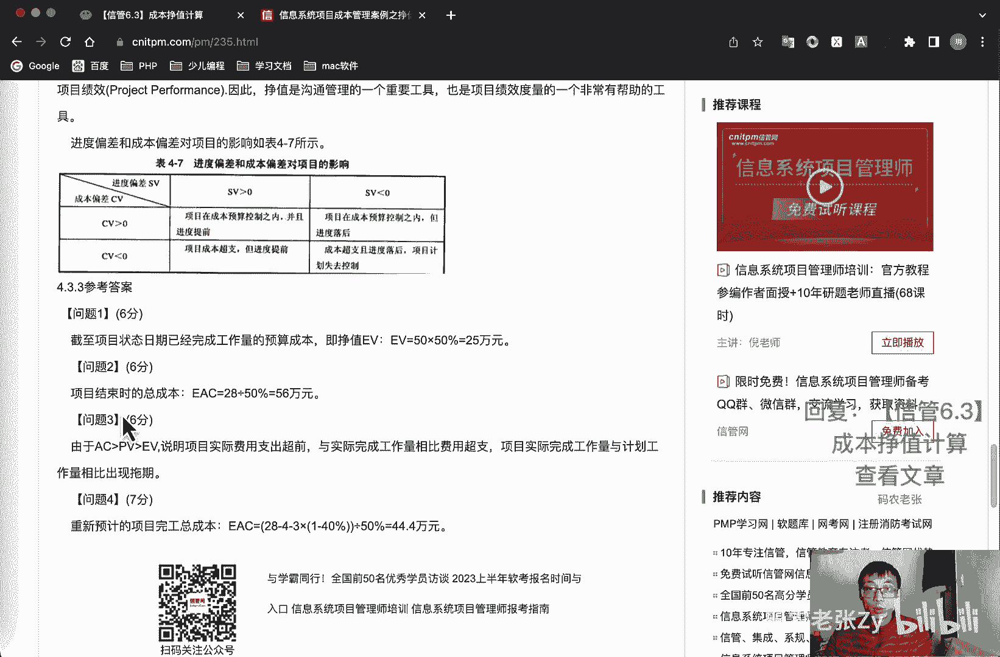

他这种算法啊，其实这也是一个小技巧，如果是典型偏差的话，并且知道当前的进度百分比的情况之后呢，就可以使用ac以上进度百分比，来计算整体的这个ec，我们计算的结果和这个例题中的计算结果呢。

是有些许的偏差的，这是计算方式和单位转换的一个区别，很明显参考答案的计算方式更好计算一些，但是呢我们为了大家熟悉公式，我在上面使用的还是传统的公式，当然大家最好考试的时候，也是使用传统公式会更好一些。

考试过程中你的步骤清晰明确，可以省略那些小数点，这个是不会有太大影响的，好了，记住就是你考试的时候，公式一定要列出来啊，你把上面这一堆公式都列出来都可以啊，只要有公式，他就会给你点分的。

然后p v e v a c一定要找到，我前面差点什么搞错了什么，是不是ev差点搞错了，ev和ac差点搞错了，对不对，在那个地方，所以说这三个呢一定要找到，如果这三个值有一个错了。

那么剩下的计算你想做对也不太可能了，但是你只要列了公式啊，就是你公式就是我前面说的那些那一大堆公式，你把它都列出来，分数多少都会给一些的，这个分绝不能丢，此外呢时间点要确认好。

就是时间点是有利于我们找到b a c，以及推算ev，还有那个pv相关的内容的，我们选取的例题呢还是比较简单，就上面那个例题是比较简单的，除了第四个小题有一点点坑对吧，大家一定要多做题，多看解析。

搞明白数据是怎么来的，在正值分析的计算题中呢，真正的难点其实不是公式，而是要搞清楚，正确的就是p v e v和ac，因为大部分公式其实都是简单的加减乘除，对不对，公式还是比较好记的。

但是确实这些公式啊有点多啊，这张图对吧，下面这一堆公式真的有点多，好了，我们来总结一下，恭喜你，就是信管师两大计算专题，那我们算是学完了，剩下的就是不断的练习了，今天的所有内容全部都是重点。

跟那个进度那一块的是一样的啊，跟进度计算那一块是一样的，但说实话，不管是网络图的关键路径法计算还是政治计算，公式推理都不难，难道是他们会变换各种题型的，让你找不准真实的数据，比如说进度题。

给各种怪异的参数提升，你画出那个基础网络图的难度，而正值方面呢只会让你很难看出ev是多少，或者说pv是多少，这些才是难点，没别的办法，就是刷题啊，再次推荐这两本书啊，自己大家去看一下。

另外网络上的资料也不少，包括刚刚那个新闻网的对吧，没事做两道题，不费什么时间的好了，今天的内容呢就是这些，大家可以回复文章的标题，信馆6。3，成本正值计算来获得这篇文章的具体内容。

以及这个详细的这个例题的一个一个计算过程。

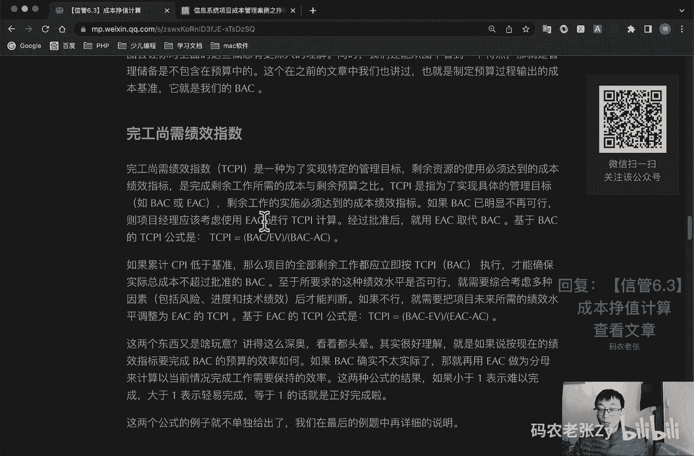

可以详细的去看一下啊，好了。

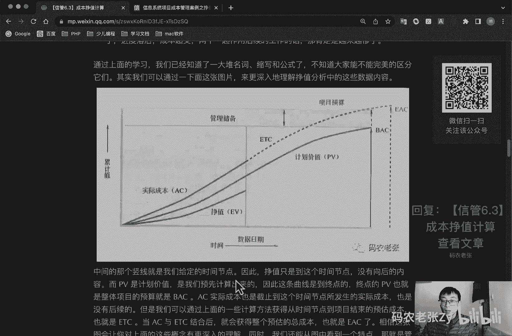

今天的内容呢就是这些。

