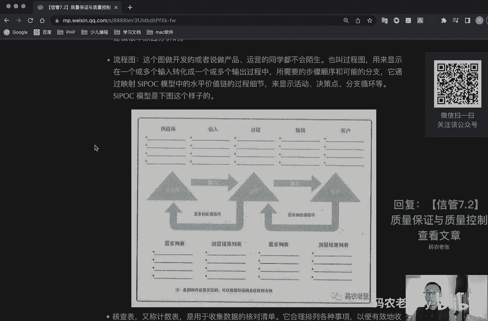
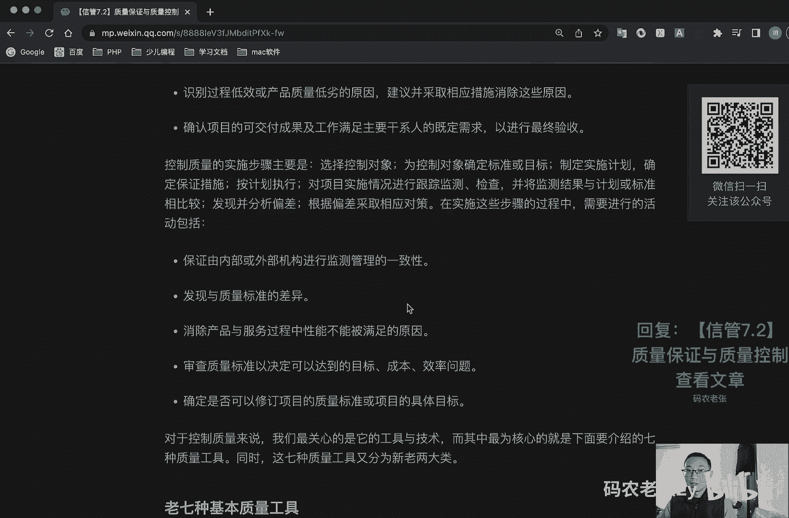
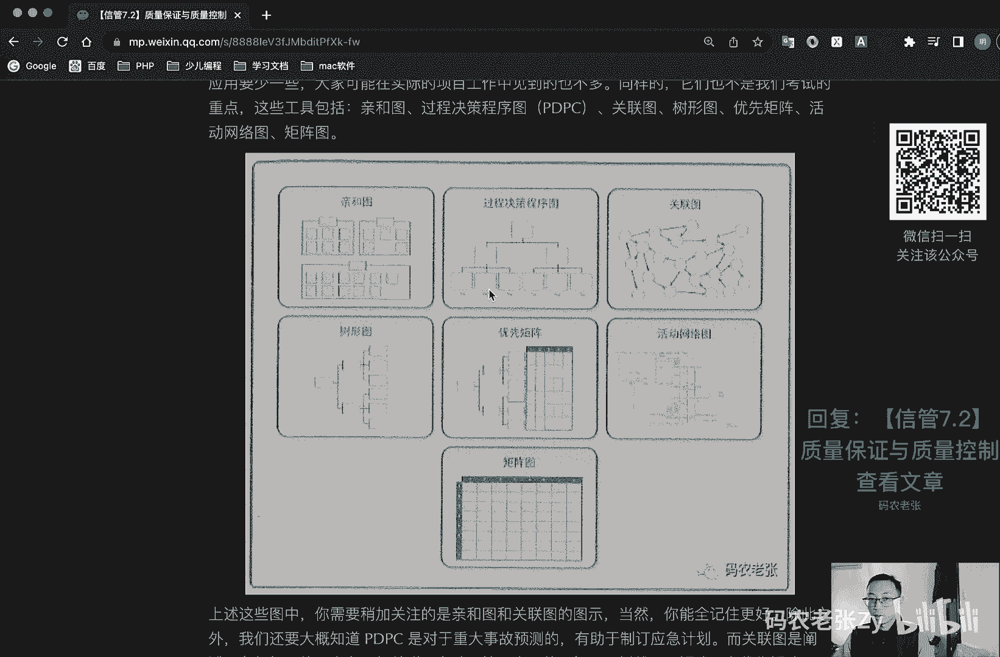
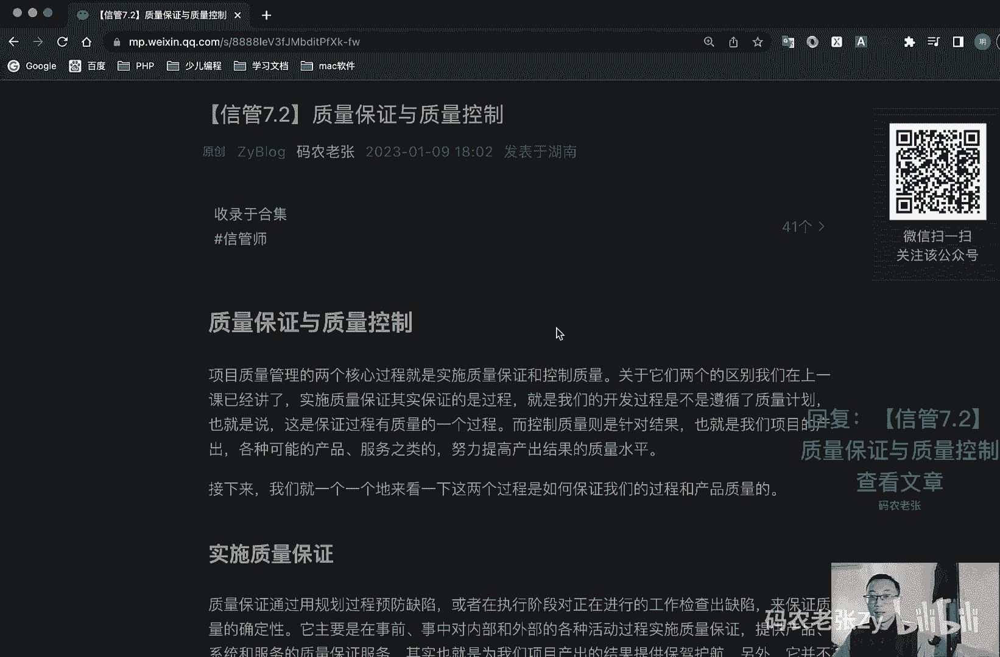
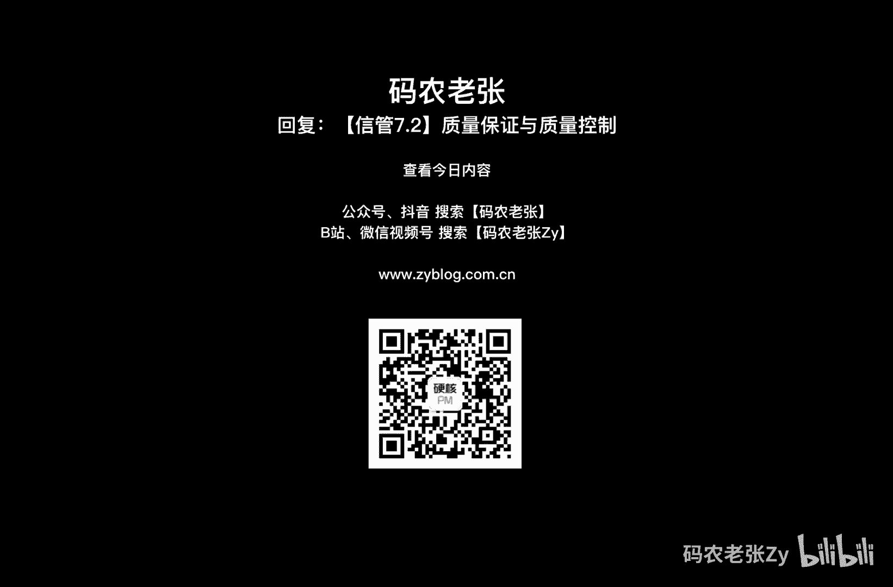

# 【信管7.2】质量保证与质量控制 - P1 - 码农老张Zy - BV1vj411N7Si

hello，大家好，今天呢我们来学习的是信息系统项目管理师，第七大篇章的第二篇文章，质量保证与质量控制，项目质量管理的两个核心过程呢，就是实施质量保证和控制质量，它关于他们两个的区别呢。

我们在上一课已经讲了，实施质量保证呢，其实保证的是过程，就是我们的开发过程是不是遵循了质量计划，也就是说呢这是保证过程有质量的一个过程，而控制质量呢则是针对结果，也就是我们的项目产出各种可能的产品。

服务之类的，努力提高产出结果的质量水平，接下来呢我们就一个一个的来看一下，这两个过程是如何保证的，我们的过程和产品质量的好，我们先来看，第一个就是实施质量保证，质量保证呢通过用规划过程预防缺陷。

或者在执行阶段对正在进行的工作检查出缺陷，来保证质量的确定性，要就是在事前事中，对内部和外部的各种活动过程实施质量保证，其实呢也就是为我们的项目产出的结果，提供保驾护航。

另外呢它并不是一种单纯的保证质量，更多的是在于对这些活动过程的质量，实施情况的一个评价，质量保证呢着眼于项目使用的过程，只在高效的执行项目过程，包括遵守和满足标准。

向相关方保证最终产品可以满足他们的需求，期望和要求，同时呢实施质量保证，还与产品设计和过程改进有关，它是建立干系人信息的一个重要手段，实施质量保证的活动包括哪些呢，主要有四个啊，第一个就是制定质量标准。

第二个就是质量制定质量的一个控制流程，第三个是提出质量保证，所采用的一个方法和技术，最后呢就是建立质量保证的一个体系，实施质量保证的内容，包括呢，就是有要制定出切实可行的一个质量管理计划。

应该安排独立于项目组的qa人员负责q a工作，第三个呢就是对软件开发过程的实施，质量保证和一个审计，另外呢就是加强技术评审工作，注重对需求设计等文档的一个技术评审，然后呢就是注重测试工作。

应该安排相对独立的一个测试人员，最后呢就是对发现的缺陷进行统计分析，确定最终的产软件产品的一个质量好，对于实施质量保证来说呢，我们主要关心的是两个工具与技术，第一个呢就是叫做质量审计。

又称为质量保证体系，审计是对具体质量管理活动的结构性的评审，他的目标是识别全部正在实施的，良好及最佳实践，识别全部违规做法差距及不足，分享所在组织或行业中，类似项目的一个良好实现，积极主动地提供协助。

以改进过程的一个执行，从而帮助团队提高生产效率，强调每次审计呢都应对组织经验，教训的积累作出贡献，质量审计呢可以是事先安排的，也可以是随机进行的，可以由内部外部第三方组织来实施质量审计。

尽量审计呢还确认已批准的变更请求，包括更新纠正和缺陷补救以及预防的措施了，一个实施的情况呃，过程分析就是第二个工具叫做过程分析，它呢是指按照过程改进计划中概括的步骤，来识别所需的一个改进。

他也要检查在过程运行期间遇到的一些问题啊，制约因素啊，以及发现的非政治活动，过程分析呢包括根本原因分析，用于识别问题，探究根本原因，并制定预防措施的一种具体的技术，好这个根本原因为什么加粗了呢。

一会我们就会看到啊，好了我们再来看控制质量，质量控控制是监督并记录质量活动执行结果，以便评估绩效，并推荐必要的变更过程等，过程的主要作用包括呢，第一个就是识别过程低效或产品，质量低劣的原因。

建议并采取相应措施消除这些原因，第二个呢就是确认项目的可交付成果及工作，满足主要干系人的既定需求，以进行最终的验收，控制质量的实施步骤主要是，第一个就是选择控制对象，第二个是被控制对象确定标准或目标。

第三个是实时制定实施计划，确定保证措施，第四个是按计划执行，第五个呢就是对项目实施情况进行跟踪，监测检查，并将监测结果与计划或标准进行比较，然后呢就是发现分析偏差，根据偏差采取相应的对策。

在实施这些步骤的过程当中，需要进行一些的去进行一些活动，包括这些啊，第一个呢就是保证内部或外部机构，进行监测管理的一致性，第二个是发现与质量标准的差异，第三个呢消除产品与服务过程中。

性能能不能被满足的一个原因，第四个呢就是审查质量标准，以及决定可以达到的目标成本效率问题，第五呢就是确定可以修订项目的质量标准，或项目的具体目标，对于控制质量来说呢，我们最关心的是它的工具与技术。

而其中最为核心的就是我们下面要介绍的，启动质量工具，同时呢这启动质量工具呢又分为新老两大类，好我们先来看老七种基本质量工具，老七种工具就是对他其七种工具，其实就七个图啊，他这个七系统工具图呢。

相对于新系统工具来说是更加重要一些的，而且更加的常见，或许你已经在很多项目中见过其中的大部分了，而且主要都是以各种图表的形式展现出来的，它主要包括的就是这个因果图啊，流程图核查表。

然后这个是什么帕雷托图，然后直方图，然后控制图，然后就是一个散点图啊，这些图了大家先看一下啊，啊如果你没见过的话，也可以去网上搜一下，看看这个图具体出来是什么样子的，好我们就一个一个来具体说一下。

边说的时候我也会简单的来画一下好，第一个因果图，因果图啊，这个图啊它又叫做石川啊，鱼骨图或者说是石川图啊，不知道大家有没有见过，他有可能中间放一个鱼骨头一样的图啊。

然后大概是呃也有可能是这样画一个箭头啊，然后上面跟鱼刺一样的，这样列出来很多东西应该是这样斜的斜的，这样列出来很多东西，列出来很多东西，这个样子我我是先画一下啊，大概是这个样子的。

然后下面也有对应的这种斜线，然后每一个上面都有这样的，大概是这个样子的，这个呢他又叫他他的创始人叫做石川新啊，所以说他要么叫鱼骨图，要么叫石川图，指的都是同一个这种图啊。

然后它呢是将问题陈述就是这个问题，这个问题是一个什么问题，然后放在这个鱼骨的头部，也就是这个箭头的头部也是可以的啊，作为起点，然后呢我们来追溯这个问题的来源，然后回推到可行动的一个根本原因。

注意关键字因果图呢他是做什么的，根本原因分析的是吧，前面我们说的加粗的那个地方，叫做根本原因分析对吧，好在这个图上呢，一般来说一般来说大部分情况下，可能上面上面是遇到的问题，上面是遇到的问题。

然后下面呢就是根据这个问题分析出来的原因，分析出来的原因，大概这个鱼骨图就是这个样子的，这里你可以写各种各种问题，然后这里就是写这个问题出现的原因啊，这这个大概是一个问题的一个表现啊。

这个问题的一个表现，然后这个地方是总的那个汇总的问题啊，然后这个呢就是鱼骨图，也叫做因果图，也叫做石川图啊，然后大家也可以自己去百度上面再去搜一下，这个图，这个图有很多展现形式。

但是大部分情况下都是这个形式的好，第二个叫做流程图，流程图这个其实这个其实不用太多说了吧对吧，你跟产品经理合作的时候，他肯定会有这种肯定会见过的啊，就是这个样子的对吧，这个这样子的一步一步下去的。

有时候可能也会有什么啊，就是有这个菱形，菱形是表示那个呃条件情况的，对不对，条件情况的，然后产品经理都这么会往下这么画这个流程图，对吧，这种图呢就叫做流程图啊，这个这个这个这个你只要是做过产品开发的话。

你肯定都会见过这个图的，然后或者而且是产品经理啊，或者是做运营的同学啊，肯定都不会陌生的，他们有时候也叫做这个过程图，是用来显示在一个或多个输入，转化成一个或多个输出的过程中。

所需要的步骤顺序和可能的分支，它通过映射这个s i p o c模型中的水平，价值链的过程细节呢来显示活动决策点，分支循环等，s i p o c模型呢就是下面这个样子，这个图可能会见的就比较少了。

前面我说的那种就是标准的那个那个流程图，前面我说的那个是标准的流程图，然后这个s i p u c呢，可能是这就是我们这个教材里面，就是新提出来的一个，同时呢，它也是就是我们的流程图呢。

是映射这个si p o c这个图的好，这个s i p o c图又是什么东西呢，它其实代表的就是几个含义，这个呃这其中这个i i就是input，o就是一个output的，其实就是一个输入和一个输出。

然后这个s代表的是供应商，然后p代表着process也就是一个过程，然后这个c代表的custom也就是一个客户，其实就是上面这五个，就是上面这五个的就是si p，然后oc就是他们的一个缩写。

然后具体的就是这样一个过程，其实呢就是我们这个呃我们的客户，然后需要把把关键，把一些关键信息输入输了之后呢，通过我们的过程流程进行一个处理，处理完了之后输出，输出完了之后又交给一个客户。

大概就是这样一个意思啊，好这个就是流程图，流程图其实还是比较简单的，大家也可以自己去搜一下啊。

如果如果说你没见过的话，好，我们再来看一下这个核查表，核查表又叫做基数表，它是用于收集数据的核对清单，它就一条一条一条一条一条的一条一条，然后前面可能是有一个那个选择框，然后就打勾打勾打勾。

这样的话这个东西呢就叫做核查表，然后呢是用于收集数据的核对清单，它合理安排各种事项，然后以便有效地收集关于潜在质量问题的，有用数据，再开展至呃，开展检查以识别缺陷时呢。

用核查表收集属性数据呢就特别的方便，用核桃表收集的关于缺陷数量及后果的，一个数据呢，又经常用于帕雷托图，用来显示好这个帕列托图啊，你看到前面这个地方我加粗了，对不对。

加粗的地方这个帕列托图就是比较重要的，为什么它有个概念，他那是一种特殊的一个垂直的一个条形图啊，好我们先画一下啊，这个图大概是这样的对吧，有一个纵轴，有一个横轴，纵轴横轴代表什么意思呢。

你可能就是根据具体的业务情况来定啊，然后他这个帕洛特图中间就是这个条形图，中间就是这样的条形图，好注意，帕洛托图它是普通的条形图的一个排序之后，展示的一个结果，为什么说是排序之后展示的结果呢。

其实大部分情况下就是出现问题的原因啊，或者各种情况，各种情况的发生呢，最核心的问题往往都是那80%的情况下，会出现的那种那种问题，其实他这里就牵扯到一个，二八法则的一个问题啊，就是说在前面这两个柱子呢。

一般都会占据80%以上的问题的情况，就是帕列托图一般都会有这样的反应出来，然后后面的呢可能就会少很多啊，可能就是只是占据那个，后面可能还有很多很多柱子，很多柱子，但是他可能会只占20%。

然后我们主要关心呢，其实就是这80%的原因，80%的原因造成我们的系统不够用啊，或者是出现各种问题和各种bug的问题了，这个呢就是帕雷托图最主要的一个问题啊，它主要就是针对这些问题的原因进行一个排序。

然后去展示最重要的那一部分的原因，好我们再来具体看一下解释啊，它呢是一种特殊的一个垂直的条形图，用于识别造成大多数问题的一个少数，重要的原因，就我前面说的，在横轴上所显示的是元音类别与作为有效的。

概率分布呢，涵盖百分之百的可能观察结果，他其实是非常出名的，什么二八法则的一个具体体现，我刚刚也说过了，就是什么是二八法则呢，就是我们日常中使用的软件，或者说他其他的一些产品，其实在大部分情况下呢。

你只是使用它20%的功能，而另外80%的功能你可能根本都不知道，同样的，我们也会将我们使用软件的80%的时间，消耗在那20%的功能之上，比如说微信和手机，大部分人可能都不知道。

微信中设置早已有了什么青少年模式，也不知道呢，你可以给你的微信好友添加名片啊，图片啊，各种备注，对不对，这些功能呢可能很多人根本都不知道，而手机上的功能呢我相信很多人就更不清楚了。

比如说你如果你不是做开发的，那么你肯定就不太会关心开发者模式，对不对，大部分情况下呢，你只需要会打电话，会发短信，会装微信就可以了，所以说呢就包括微信，对不对，我们最常用的功能其实是什么呢。

一个微信支付，另外一个就是聊天，对吧好，那么在我们的使用手机的时候呢，80%以上的注意力呢，其实也都是消耗到了在什么抖音啊，或者是微信等几个有限的app上，就是你平常使用app也是这个道理啊。

你80%的时间都是抖音，微信或者是b站什么什么之类的，这些消耗时间的，或者是某些游戏，对不对，这些app上从上述的内容就可以看出呢，就是这个二八法则真的是无处不在的，而且我要再去就是详细说的一点。

就是我们学习中，大部分你在生活中运用到的东西呢，其实也是遵循二八法则的，就是你学习中，有大概20%的内容是非常重要的，但是80%的内容呢，其实你可以去了解的态度去进行的啊。

这样的话呢其实你不管是你的学习结果，还是你之后工作的时候运用这些内容的时候呢，其实都是非常就是怎么说呢，就是你能够达到一个快速学习的一个效果，就是把握住了20%的核心内容，就那个东西是非常重要的。

好这个二八法则的内容呢，大家也可以再去详细的，就是再详细的去查询一下相关的资料，这个东西还是非常非常有意思的，很好玩很好玩的一个东西啊，对于我们的学习啊，对就我前面说过，那个就是学习的时候。

打完了20%的一个核心内容，然后就是你做产品的时候出现问题的时候，同样的也是去呃做做产品，出现质量问题的时候呢，反过来的，你是要去把握的80%的内容对吧，你主要看的是前面那几个柱状图的内容。

这个就是帕雷托图在质量这一块的主要内容啊，你主要看的是前面80%啊，在质量问题那里面看的是80%，就是前面那几个柱子好，下一个呢就是直方图，直方图呢它就是一种特殊形式的一个条形图，用于描述集中趋势。

分散程度和一个呃统计分布的，一个那个相关数据啊，他呢这是什么，它就刚刚我们说的是帕利托图对吧，直方图呢其实很简单啦，直方图就是呃不一定按那个什么不排序的，对不对，它有可能这么高这么低对吧。

这么高一会高一会低，一会高一会低的，这个就叫做直方图，然后前面我们那个排过序的，排过去的，然后最核心的原因占80%，在前面那几个柱子的那个呢就是帕累托图啊，注意他们俩之间的区别啊。

在质量这边呢就还还还有再强调一下，就是在质量这边呢，它是反过来的，我们关注的是前面那几个柱子对吧，造成呃问题的80%，问题的原因就是往往其实只是那两个原因，而那两个原因呢在所有的原因里面。

可能有只是占了20%，对不对，这个东西啊有点绕是有点绕有点绕啊，大家仔仔细的再去想一想，然后也可以查一下相关的资料啊，就是帕列托图是非常重要的一个部分，就是非常重要的一个内容，好我们再来看一下控制图。

控制图呢是另外一个比较重要的图啊，控制图呢就是可以判断某一过程处于控制之中，还是处于失控状态，用于监测各种类型的一个输出的一个变量，也可以用来呢监测成本与进度偏差啊，这个我这么这么来画。

哎我把它定住一下，这么来画，然后下面呢我就用普通的普通的线，下面的一个普通的线好，这个呢就是这个呢，中间呢这个就这个呢我们就可以叫做一个基线，然后上下一个控制的一个边界，就比如说我们来的数据呢来个数据。

我们每天去记录这个数据，然后我们这个横轴呢，就是一个数据的一个时间点，7号8号对吧，一直往后排，一直往后排，然后你在第一天这个点就是你可以去打一个点，在这个地方，对不对，然后第二天打一个点在这个地方。

第三天打一个点在这个地方，第四天打一个点，点在这个地方，在这个点啊，这个点打在哪个地方呢，取决于中间这个纵轴，这个纵轴呢可能是你生产的一些数据的一个，质量的情况，对不对，呃，是不是获得一个产品率啊。

或者一个什么bug出现的一个情况对吧，然后我们每天这个bug的控制范围呢都在这两个，就是这两个上下这个界限之间，那么我们现在这个呃这个产品呢就还是可控的，在这种情况下呢，就是还是可控的。

如果你这一个点啊，突然某一天你飙到外面去了对吧，标到上面去了，或者是呃标到下面去了，就是超出这个上下的一个控制界限了，那么在这种情况下呢，我们就说明我们现在的开发，或者说我们做的产品是失控了。

这个这个东西啊就叫做控制图，就看到这种图啊，就叫做控制图，然后在控制图里面还有一个非常重要的一个，就叫做七点规则，什么叫做七点规则呢，就是说我们的所有的这个标的这个点啊，全部都在上下界限之内。

但是但是它是呈现一个规则的，就比如说它是连续下降234567，看到没有，这七个点，它全都在这个界限之内，但是呢因为他连续七个点都是往同一个方向，要么高，要么低出现问题的，那么这个情况下呢。

其实它也是属于一个质量失控的情况，这种情况呢也是我们需要去关注的一个情况啊，就这种情况是我们需要关注的，还有这个点超出了上下界限之外呢，这个也是我们需要去关注的情况，然后中间这个基线呢也是非常重要的啊。

这这这就是这个表格，其实它也是有一个纵轴，有个横轴的概念对吧，横轴是我们的时间，然后纵轴的就是我们一个质量的一个情况，比如说我们八个的点数对不对，bug的一个点数，当然bug肯定都是零是最好的对吧。

但是呢这个情况也不也也有可能排除啊，嗯就是也也有可能有例外啊，就是说一般在那个什么在生产的时候，可能会有什么良品率啊，或者是一个次品率啊，这种情况就是上下的两条界限，这个呢可能就是会见的会更多一点啊。

就是在软件开发里面可能会少一点，为什么呢，软件开发一般我们这个极限肯定就是零嘛，我们肯定是希望是每天都是零，就是不要去出现bug这种情况的好，这个呢就是控制图好，最后还有一个就是散点图。

散点图呢是可以显示两个变量之间是否有关系，就是我们最常见到的自变量和因变量的关系图，用于解释当自变量发生变化的时候，因变量是如何产生变化的啊，这个就是初中的知识了，同样还是一个啊。

同样还是一个这种坐标轴形式的，然后中间可能有一条线，对不对，我们会有一个x有一个y，然后因为这个x的x把它做的那个自变量的话，然后这个y是受它影响的，对不对，i y是因变量。

然后在这上面呢就根据那个算式，然后就去去也同样也是给他打点对吧，然后看这个点在这个中间，这条线的一个分布情况，然后就可以看到它们之间的一个关系，的一个变化，好这个呢就叫做散点图啊。

这个散点图这个应该是上高中吧，高中还是初中应该就见过的吧，像这种散点图对不对，然后这这这种就就这个点打到这外面来了，这个肯定是有很大的问题，对不对，这肯定是有很大的问题，或者是这种对吧。

这种就都是有问题的，如果我们都是在中间这个标线中间的话，就是按这个就是呃这个怎么说呢，就是一个正态分布的，就是一个正常的一个这种分布情况的，分布的情况的话，那么他应该都是围绕中间这条线对吧。

这个呢就是一个非常基础的一个，散点图的一个应用，好这个呢就是重点的图啊，就是重点的图我们上面已经讲完了，这七个重点的图呢，就是我们家出的这个加粗的这几个，哪几个呢，就是第一个因果图对吧，因果图。

然后第二个就是帕雷托图，帕累托图，帕列托图里面的，最主要的是，我们要关心的就是这个二八法则的意思啊，然后第三个呢就是一个控制图，这三个图呢是非常非常重要的，当然每个图每个图我刚刚都画了一下对吧。

所以说每个图如果如果考试的时候，他把这个图亮出来了，或者说他问你这个图大概是一个什么样子，或者是他描述了一下，描述了一下这个图啊，比如说他问了，他说这个图是表示两个变量之间关系的。

那么他肯定就是散点图了对吧，这种这种题都有可能出的好，对于质量问题的分析来说呢，我们可以使用直方图，散点图，控制图，而因果图和流程图呢是既可以用作分析的，也可以用作问题识别的，对吧，因果图对吧。

因果图再强调一遍，因果图是什么，根本原因分析，对不对，根本原因分析派对托图二八法则，然后控制图有一个起点规则啊，起点规则非常重要，好这几个关键点好，接下来我们再来看一下新系统工具。

新系统工具呢是用文字语言来明确问题的，着重用于解决规划阶段的有关问题，相对来说呢他们的应用会少一点，大家可能在实际的项目工作中见到的也不多，同样的他们也不是我们考试的一个重点啊。

然后这些工具呢就包括清河图，大概这个样子的清河图，然后过程决策呃，程序图啊，这这个样子的，然后什么关联图啊，然后树形图优先矩阵啊，活动网络图，然后矩阵图啊，这几个图大家也可以去查一下，在这些图中呢。

你主要关注的就是清河图和关联图的图示啊，清河图就这个样子，当然你能全记住就更好了，除此之外呢，我们要大概知道pdp c图，就这个图大概是长什么样子的啊，它是对于重大事故预测的，有助于制定这个应急计划。

而关联图呢则是阐述现象与问题的，清河图呢与关联图，有助于管理人员去解决问题啊，树状图矩阵图和优先矩阵用于展开方针目标，然后pdp c呢和活动网络图呢，用于安排时间进度，活动网络图对吧，很熟悉对不对。

很熟悉好这个这个图啊大概是什么东西啊，就是说其实他那个中间啊，其实他那个中间啊，就是我们呃它它它是这个这个形式的，我大概简单的画一下清河图，就是它是这个样子的这个样子的，然后里面呢是每一项每一项的内容。

里面呢是每一项每每一项每一项的内容，大概就是这个这个这个德性呢就是一个清和图，好这个过程，决策图呢其实它就是一个决策树一样的，有有不同的一个分支，有不同的一个分支。

然后在不同的分支上面可能会有各种的问题，可能会有各种问题产生，然后这个呢就是大概它的，主要就是做决策用的对吧，有制定一个应急计划的，大概就是决策图有各种分支下的，然后关联图啊。

关联图就是一个就跟那个什么样的，就跟我们学数据结构里面做的那个图一样的，它会有各种各种事件，各种事件的，然后他们会有各种关联，然后就会有这个线给它关联上对吧，就跟我们做那个学数据结构里面。

做那个图一样的，大概就是这个样子的，这这这这种形式的这个关联图，然后树状图，树状图就我跟我们那个树形菜单一样的对吧，树形菜单一样的，然后就是大概是这样一个问题，然后衍生出来的哪些问题。

然后大概是有好几点对吧，呃也也有点像那个什么像那个思维导图，对不对，树形图就是往同一个方向的这种思维导图啊，大概就是这个样子的，然后优先矩阵呢其实也是类似的，但是优先矩阵里面的内容可能会详细一些。

然后活动网络图的不用多说了对吧，然后最后一个矩阵图就是一个表格，ok就这种形式的，然后就不太清楚的话，你就去搜一下这个图长什么样子啊，可以大概的去看一眼，但是考试的时候呢，说实话考试的时候呢。

这一块可能考的不多，考的不多，你大概知道，就大概知道我这里讲的这些内容就可以了，好同样的还有就是还有就是你要清楚啊，就是清楚上面这些图哪些是新七种工具里面的，哪些是狼的七种工具里面的。

把这个也要也要给它分清楚啊，好我们再来看另外一个工具啊，另外一个工具叫做统计抽样，统计抽样呢是指从目标总体中抽取一部分，相关样本，用于检查和测量，已满足质量管理计划中的规定，在这里呢，我们主要弄清楚。

以下表格中的一些统计相关的名词，是什么意思啊，它非常简单，基本也是高中数学中学过的，一些统计学相关的知识好，第一个就是概率，就是某件事情发生的可能性的一个大小啊，这个这个没什么可多解释了。

然后就是随机抽样，随机抽样呢，就是总体中的每个个体都有同等的机会和概率，被抽中，如果不借助外在的工具呢，作为有意识的人，就是我们人去做这种随机抽样的话，那是无法做到随机的，哪怕他主观上想要随机。

但是程序是比较方便能做到的对吧，做一个随机数啊，然后我们就去抽那个号，对不对，抽那个号，然后看具体是挑哪个产品出来，去进行那个抽样验证对吧，然后呢就是特殊车辆，特殊车辆呢就是结果符合或者不符合。

一般用于产品检验了，然后有一定的规则，然后呢就是变量抽样，变量测量呢就是结果在测量符合程度的，连续坐标系统的表示它是有规则的，然后呢就是预防，预防就是把错误排除在过程之外。

这个我们上一节只上一节课也讲过了，然后就检查把错误排除在可到达客户之前，接下来呢对特殊原因啊，主要产生异常事件，然后随机原因产生过正常的过程偏差，然后这些呢主要是记一下这些概念的。

具体的一个解释就可以了啊，好我们再来看一下检查，检查呢是指检查工作产品，以确定是否符合书面标准，检查的结果呢通常包括相关的测量数据检查，可以在任何层次上进行检查，也称为审查同行审查。

审计或者是巡检就行了，就是检查看一下你的系统怎么样，然后信息系统开发中的质量把控，最后我们再来学习一些扩展的内容啊，就是在信息系统开发中，对产品质量的一些把控原则以及方案啊。

第一个呢就是技术评审与管理评审，技术评审的主要目标，是发现任何形式的一个技术功能，逻辑或实现方面的一个错误，通过评审验证系统的需求，保证系统按照预先预定的一个标准来表示。

从而让你获得的系统以统一的方式开发，使项目呢更容易去管理，去看一下你做的对不对，然后阶段管理评审呢是根据定义好的，每个开发阶段的开始和结束边界，检查该阶段的过程与工作成果，是否会符合质量标准。

就是每个阶段每个里程碑我们去检查一下，我们要有效的利用评审机制来确保项目的质量，一般来说呢，软件项目的评审需要关注以下的内容，第一个就是人员的构成，参与评审的包括谁呢，同行专家，上下级人员。

专管领导客户等等，第二个呢就是评审形式，主要是正式评审和非正式评审两种，第三个呢就是评审过程，包括制定评审计划，会议准备，然后缺陷记录与跟踪，缺陷分类原因分析过程改进更新详细数据库，结束评审等等。

好我们再看一下软件的一个质量衡量指标，对于软件系统来说呢，我们衡量指质量的指标主要包括六个方面，这个东西也比较重要的，这个东西有时候经常那个选择题也会考，第一个呢就是功能性。

主要包括适合性和准确性和互操作性啊，一种性和安全性，第二呢就是可靠性，成熟性和容错性啊和以恢复性，然后第三个就是易实用性啊，就是易理解性，易学习性和易操作性，第四个呢就是效率，就是时间特性和资源特性。

就是我们的开发出来的软件啊，速度快，占用硬件网络资源少对吧，这个效率就比较高，然后呢就是可维护性啊，就比比较好维护啊，这一分析性易更改性，稳定性和易测试性，最后呢就是可移植性啊。

就可以在各个平台去使用对吧，适应性安装性，一致性和一替换性这个东西怎么记啊，非常简单，就功能靠用小护翼的这些功能靠用小互译，这个小呼吸是什么意思呢，小互译就是呃就是后面那个笑，然后维护的护。

然后移植性的一对吧，小护业功能就是功能靠用小护翼啊，这个东西啊有一点点误对吧，还不算太污哈，不过确实用这种方式呢会是比较好记的好，我们再来看一下软件质量的保证活动。

软件质量保证活动与普通的质量保证活动呢，其实差别不大，我们通过人员活动，工作内容三个方面来看一下软件质量，保证人员的素质呢，包括有较强的沟通能力啊，这是人员方面的，要熟悉软件工程过程。

要能应对繁重的工作，要能客观公正且有责任心，第二呢就是软件质量保证的活动，主要包括制定软件质量的保证计划，参与开发该软件的质量过程描述，第三个呢就是评审各项软件工程活动。

然后第四个就是审计指定的软件工作产品，最后呢就是记录并处理偏差，然后报告，最后呢就是软件质量保证的一个工作内容啊，第一个就是与软件质量保证计划，直接相关的工作，包括项目计划的制定，定义各阶段的检查重点。

第二个呢就是参与项目的阶段性评审和审计，并给出明确的结论，第三个呢，对于对项目日常活动与规程的符合性进行检查，尽早发现问题，把问题控制在最小范围之内，第四个呢就是对配置工作的一个检查和审计。

保证所有人都是开发过程产品的有效版本，最后呢就是跟踪问题的解决情况，可以直接向高层经理汇报，有可能出问答题啊，有可能啊，好接下来就是提高信息系统的项目质量，提高信息系统质量的过程呢。

其实也是适用于所有的产品，而不仅限于信息系统相关的产品，然后我们第一个主要的关心呢，就是要有强有力的领导，包括制定公司质量及管理方针，选择质量标准或者制定质量要求，然后制定质量控制流程。

提出质量保证所采取的方法和技术，提供相应的资源，第二呢，就是我们建立建立组织级的一个项目管理体系，第三个呢建立组织集的质量管理体系对吧，第四个呢就是建立项目级的一个知激励制度，第五呢就是理解质量成本。

质量成本成一致性成本对吧，预防和评估，然后非一致性成本就是内部和外部的，还记得那张图吧，还记得那张图吧啊一边是一致性的，一边是非一致性的，对不对，然后一致性的底下有预防和评估，预防包括哪些评估包括哪些。

然后这边有内部的，包括哪些，外部的，包括哪些，对不对，召回是属于哪一个的，对吧好，然后呢就是提高项目的文档质量，最后呢就是发展和遵从成熟度模型，ok总结一下老七种工具呢是今天的重点内容。

我刚刚也是花了很多的篇幅在讲了对吧，其他的谈不上重点不重点的，但也不至于完全不用看，反正多记住一些总没坏处，项目质量管理的内容呢就全部完成了，整个项目管理体系中最核心的范进制程范围，进度。

成本质量我们就都学完了，当然并不是说剩下的内容就不重要了对吧，十大管理体系，我们还剩下五个，只是说没有这四个的作用大和影响大而已，毕竟很多人只要听说过pp呢，多少他都会知道这四个的音乐啊，千万不要松懈。

信息管事的内容呢还非常多啊，同志们还要继续努力，加油好了，今天的内容就是这些，大家可以回复文章的标题，信管7。2，质量保证与质量控制，来获得这篇文章的具体内容，以及一些想详细的解释。

特别是这些老气动工具，这几个图我没有一个一个截图，因为比较多也比较累，所以说这个东西啊这个图名字也放在这里了，大家自己去搜一下，看一下这个图具体是长什么样子的，这个东西非常非常重要。

好一定要搞清楚老气动工具和新系统工具，他们在概念，然后他们是就是说一个工具，你要知道它是属于老的还是属于新的。

好了，有这些东西就差不多了，ok今天的内容呢就这些。

