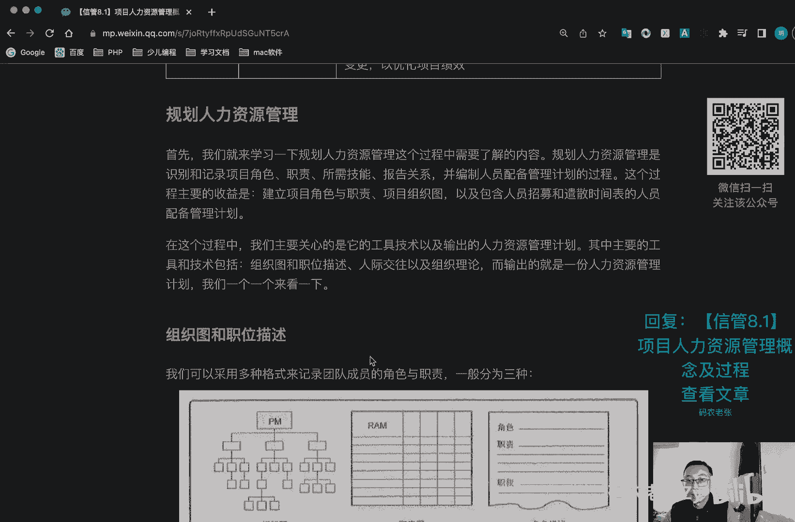
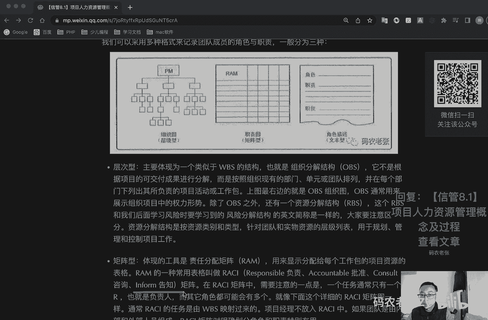
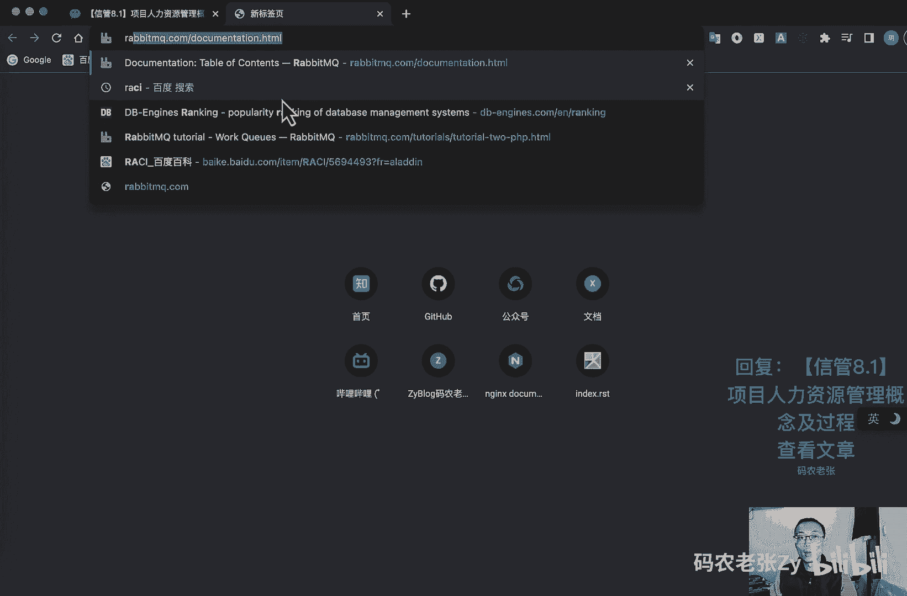
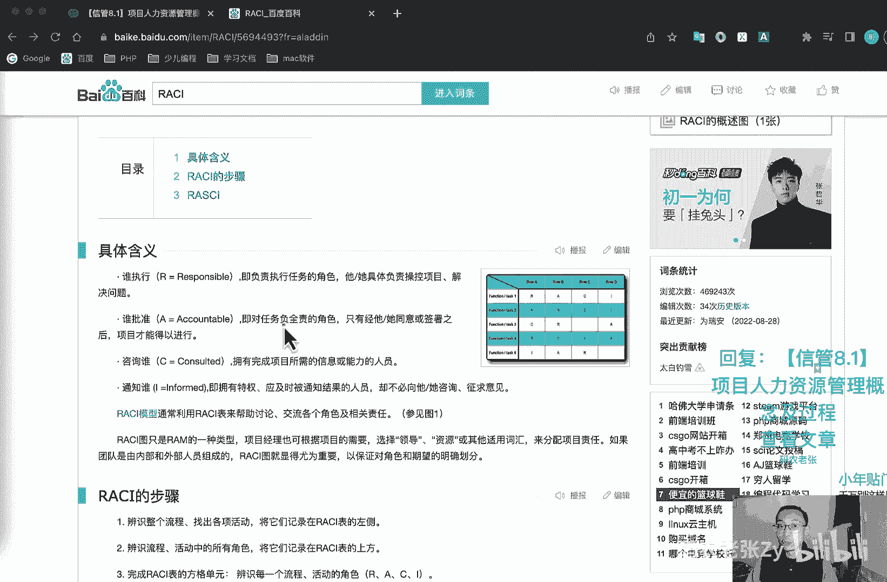
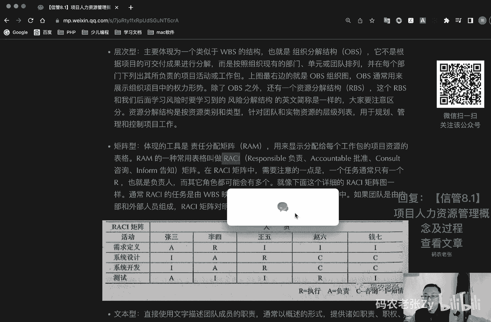

# 【信管8.1】项目人力资源管理概念及过程 - P1 - 码农老张Zy - BV1xb411Q7RR

哈喽大家好，今天呢我们来学习的是信息系统项目管理师，第八大篇章的第一篇文章，项目人力资源管理的概念以及过程好了，不管你做什么事呢，要成就什么事业，要做什么项目，这一切都是由人来完成的，因此呢。

人力资源对于项目管理来说，是非常重要的一个管理过程，同时呢，人力资源管理呢，也是整个管理学当中的一个重要的一个分支啊，不管你是本科的专业课程呢，还是考研之后的研究方向。

人力资源管理呢都是非常热门的一个专业啊，他是管理学里面的一个非常重要的一个专业，毕竟你的事业离不开人，即使你只是一个打工仔，你也有同事的上级和下级对吧，这些也是你的圈子，也是你的人力资源，一样需要管理。

人力资源管理的目标呢，其实就是明确需要的人管，就是企业看战略，项目，看活动对吧，然后呢找到合适的人，这个人呢态度合适，能力ok性格匹配对吧，这种情况呢就是最好的情况了，总结人力资源管理的一句话。

那就是用好身边的人，留住优秀的人，这个非常重要啊，好我们就接着往下看，团队与领导回到项目管理上来，项目团队就是project team，是由未完成项目，而承担不同角色与职责的人员所组成的。

这些人员可能是全职的或者是坚持的，也可能随着项目的进展呢而增加或者减少，而项目管理团队的project management team，他们注意和上面的这个项目团队，不是一个概念啊。

他是负责项目管理和领导活动的一个团队，也成为核心团队或者领导团队，这个团队可以由整个项目团队分担呢，也可以由项目经理来独自承担，我们再看一下领导和管理，管理者负责是某件事情的一个管理。

或者是实现某个目标，而领导者呢就是确定一个方向，统一思想，激励和鼓舞在项目管理中的项目经理，同时具有领导者和管理者的双重身份，这个我们在很早的时候就讲过了对吧，在项目项目经理的那一篇的时候就已经讲过了。

这一点是需要大家注意的，领导和管理是两个不同的概念啊，在现代企业中的，我们更推崇的是领导利益，就是让领导占据管理者更多的时间，成为管理的主要活动，而将管理呢更多的放到制度和流程中。

让制度和流程来进行管理的约束，好我们再看一下冲突的一个竞争，冲突啊，冲突就是指两个或两个以上的社会单元，在目标上互不相容，或者是互相排斥，从而产生心理上或行为上的一个矛盾。

而竞争呢是双方具有同样的目标啊，不需要发生势不两立的一个争夺，从表面上来看呢，竞争是有利于冲突的，我们也推崇一个良性的竞争，并不是说所有的冲突都是有害的，一团和气的这个集体啊。

它并不是一个高效率的一个集体，项目经理呢对于有害的冲突呢，要设法加以加以利用，要鼓励团队成员的良性竞争，关于冲突管理方面的内容呢，我们在下一篇文章会详细的去说好，我们来看一下人力资源管理的一个过程啊。

人力资源管理过程呢主要就是四个啊，第一个过程是在规划过程中的，就是规划人力资源管理，它的主要是识别和记录项目角色职责，所需技能报告关系，并编制人员配备管理计划，第二呢就是执行过程组，它主要是组件呃。

呃组建项目团队，建设项目团队，还有一个管理项目团队，这个比较好叫组建建设管理，第一个组建项目团队呢，就是确认人力资源的可用情况，并未开始项目活动，而组建团队，第二个呢就是建设项目团队。

他就是提高工作能力，促进团队成员互动，改善团队整体气氛，以提高项目绩效，第三个呢就是管理项目团队，他主要就是跟踪团队成员工作表现，提供反馈，解决问题并管理团队变更，以优化项目的绩效好。

我们先来看第一个过程啊，规划人力资源管理，首先呢我们就来学习一下规划人力资源管理，这个过程中需要了解的内容，规划人力资源管理呢是识别和记录项目角色，职责所需技能报告关系。

并编制人员配备管理计划的一个过程，这个过程的主要收益呢，就是建立项目与角色与职责，项目组织图，以及包含人员招募和遣散时间表的，人员配备管理计划，在这个过程当中呢，我们主要关心的是它的工具技术。

以及输出的人力资源管理计划，其中主要的工具和技术包括组织图和职位描述，人际交往及组织理论，而输出的就是一份人力资源管理计划，好我们就一个一个来看一下，第一个呢就是组织图和职位描述啊。

我们可以用多种形式，多种形式来记录团队成员的角色与职责，一般分为三种啊，第一个第一种就是这种树形的组织图对吧，它也叫做层次型的，它主要就是展现为一个w bs，就跟我们之前学过w bs非常像。

也就是组织分解结构叫做o b s，他不是根据项目的可交付成果而进行分解的，而是按照组织线的部门单元或者团队排列，并在每个部门下列出其所负责的项目活动，或者工作包。

上图中的最右边就是这个就是o b s组织图，o b s呢通常通常用来最最左边，这里写错了，最左边的最左边的就是这个o b s图，除了o b s之外呢，还有一个叫做资源分解结构r bs。

这个rbs呢和我们后面要学习风险时，要学习到的风险分解结构的英文简称是一样的，考试的时候，如果他问了r，他如果写的是r bs，他这种缩写啊，一般来说是指的风险分解结构啊。

不是这个人力资源这边的这个资源分解结构，这个一般是要注意一下的，好资源分类结构呢是被资源类，是按资源类别和类型，针对团队和实物资源的一个成绩列表，用于规划管理和控制工作，然后第二个呢就是矩阵型的。

就是矩阵型的，就是大概这个形式的一个责任图，他呢主要就是一个叫做责任分配矩阵，简称就是rm，用来显示分配给每个工作包的，项目资源的一个表格，i m的一种常用表格呢叫做r a c i矩阵啊。

r a c i它也是几个单词的缩写啊，r就是代表这个负责的意思，然后a就是这个批准的意思，然后这个c就是咨询的意思，然后这个i就是告知的意思。

然后这个呢就是用它来形成一个矩阵，有更详细的就是这个矩阵r c i矩阵，这个r a c i矩阵啊，其实是一个比较有意思的一个地方啊，他就是在这个地方，你看到我们在这个地方呢写的这个r。

它是负责的意思对吧，但是在这个图里面呢，我们在这个地方写的r是直行的意思，然后在这里呢有个a它是批准的意思对吧，在这里的这个a呢是负责的意思，这两个地方不一样，看到没有，这两个地方完全不一样对吧。

就是就怎么说呢，他这个两个东西啊都没有错，为什么这么说呢，为什么说没有错呢，因为你去百度去搜一下翻译，就是这个responsible和这个account able，它这两个英文单词的意思呢。

它都是负责的意思，它都是负责的意思啊，这很有意思的一个地方啊，但是呢其实从这里我们也看出来，他有的时候会把r当做执行，但是a一直都是一个负责的意思，你看看这个批准批准是干嘛。

批准其实就是以就是你具体负责这个项目，你才能批准这个地方对吧，你你才能批准这个任务好，那我们呢，那么呢我们可以去看一下，这个具体的一个百科的解释啊，我之前也已经查过了啊。

r a c i对吧，r a c i在百度百科里面呢，它是怎么解释的呢，它的解释啊，你看一下解释呢，就是这个r就是谁执行对吧，谁执行，他是一个执行者，对不对，也就是负责执行任务的一个角色，注意啊。

这里有负责两个字，对不对，然后呢就是批准对吧，批准是a a他是对任务负全责的一个角色。

负全责的一个角色啊，这样的话呢其实我们就能看出来了，因为我们在后面说了，就是r r c a i g r r a c i矩阵当中，需要注意的一点，就是一个任务通常只有一个r负责人。

也就是说他有且只有一个负责人，而其他角色都可能会有多个，那么也就是说呢，其实我们的a是只能有一个的，但是我们r呢是可以有多个的，就像下面这个详细的这个列表里面一样对吧。

通常r a ci的任务呢是由w bs映射过来的，你看这个地方的活动对不对，w bs映射过来的，然后呢项目经理是不放入rsa当中的，如果团队是由内部和外部人员组成的。

rsi举证对明确的划分角色和职责特别有用好，那我们就具体的看一下这个表格，首先呢我们看一下这个李四，你看在第一个任务需求定义里，这个任务里面的李四是一个具体的一个执行人，对不对。

那么他们现在可以预估它应该是一个产品经理，一般是产品经理负责这个需求的定义，或者是什么需求调查员之类的，注意项目经理是不放入r a c a当中的，其实他也有可能是个项目经理对吧。

但是项目经理是不放入这个里面的好，那么也有可能也有可能是什么呢，就是项目经理他监产品经理，对不对，如果他兼产品经理的话，那么他也是可以放在这个地方来的，好，我们先不纠结这个问题了，然后呢。

这个需求定义它具体的一个负责人是谁呢，其实是张三对吧，那么这个张三呢我们可以看，可以给他理解成，可能会是一个更高层一点的领导对吧，他来负责整个需求的一个定义，好。

王五赵六和前期在第一个任务需求定义当中呢，都只是一个通知的角色，就是告诉他们，现在我们这个需求再定义了就可以了，好，我们在第二个活动里面就可以看出来系统设计，在系统设计里面呢。

王五王五是主要的执行人对吧，我们再看啊，第三个系统开发里面，它也是一个主要执行人，ok在这个地方呢，我们其实就能看出来王五他进行了系统设计，进行了系统开发，他应该是技术负责人或者是我们的主力工程师。

对不对，他就是主要负责开发这一块的一个工程师，然后呢在这个地方呢，李四是主要的两个负责人对吧，还是有点像项目经理，对不对，但是啊项目经理是不放入这里面的，所以说李四可能还是以产品经理为主的，一个角色好。

剩下的赵六和前期呢在这个这两个任务里面呢，他都是一个这个咨询的角色对吧，咨询的角色呢，它主要就是会参考他们的一个意见好了，最后一个就最后一个活动就是测试，在这个活动里面呢，我们的赵六他是一个主要的执行。

那我们可以看出来赵六应该是一个测试工程师，对不对，然后呢我们张三在最后一个活动里面呢，他又是一个政体负责的一个人了，也就是说我们这个张三呢，他非常关心需求的定义，非常关心一个测试的结果。

那么他可能也是一个，类似于产品经理或者产品总监，反正是等级会比较高的一个一个这样的角色，或者是项目总监这种类型的一个角色，好在最后一个绝对最后一个人，这个前期啊你注意啊。

他在所有的这四个活动中都没有去执行，也没有去负责，只是起到一个咨询和一个告知的一个作用，那么它可能是一个外部的一个啊专家，或者是一个相关的一个联络人之类的一个角色，好。

这个呢就是一个r a c i矩阵的一个，具体的一个实例，这个呢大家需要了解一下，然后呢就是文本型，文本型的比较简单了，他就直接用文字描述团队成员的职责，通常以概述的形式啊，职责职权。

能力和资格等方面的这种文件呢有多种名称，如职位描述啊，角色职责职权表等等啊，这个呢就是大家了解一下事情了，好我们再看一下人际交往与组织理论，人际交往呢就是在组织行业或者职业环境中。

与他人的正式或非正式的互动，包括主动写信啊，行业会议啊，非正式对话，午餐会有座或者座谈会等等，他在项目的初始的时候特别有用，并可在项目期间以及项目结束后，有效的促进项目经理的一个职业的一个发展。

然后组织理论的阐述，个人团队和组织部分的一个行为方式，有利于利用组织理论当中的通用知识，可以节约编制人力资源，管理计划的时间成本及人力投入，提高规划工作的效率，了解一下就行了啊。

最后呢就是人力资源管理计划，这个人力资源管理计划，提供了关于如何定义配配备管理，及最终遣散项目人力资源的一个指南，它主要包括角色与职责，角色与职责主要包括角色职责，权利能力。

然后就是项目的组织图上面说过的那三种对吧，然后就是人力人员配备管理计划，包括人员招募啊，资源日历啊，人员遣散释放计划，培训需要认可奖励啊什么这些的东西啊，然后在大多数项目中的人力。

项目的人力资源管理计划编制过程呢，主要作为项目最初阶段的一部分，但是呢这一过程的结果呢，应该在项目全生命脏器当中经常复查，以保证它的持续性，这个就是滚动式规划啊，不多说了，好在项目人力资源计划编制过程。

总是与沟通计划编制过程呢是紧密联系的，因为项目组织结构呢会对项目的沟通需求，产生重要的影响，在编制人力资源计划时呢，需要注意与项目成本，进度质量及其他因素的相互影响。

同时呢也应注意与其他项目对同类人员的争夺，所以说项目要有备选人员，这个也是非常重要的，好我们接着来看第二个过程啊，第二个过程叫做组建项目团队，组建项目团队呢是确认人力资源的可用情况，并未开展项目活动。

而组建团队的过程，本过程的主要收益就是，指导团队选择和职责分配，组建一个成功的团队，在这个过程中呢，同样我们比较关注的是它的工具与技术啊，这几个攻击技术也是，就是这个加粗的是比较重要的。

好第一个我们看下叫做预分派，玉芬派呢就是如果项目团队成员有事先选定的，他们就是被玉芬派的，玉芬派可以在下列情况下发生，第一个在竞标过程中呃，承诺分派特定人员进行的项目工作，第二个呢就是项目成功。

取决于特定人员的专有技能，或者说是项目章程中，指定了某些人员的一个工作分派，ok非常重要的一点啊，就是一分派老板指定的人，你必须要给他安排进去，对不对，这个人就是宇文派的，这个这个就非常清楚了，对吧好。

你你不用管他是不是能力特别强啊，或者说跟老板有什么关系啊，只要是老板指定的，只要是你的甲方指定的，或者是怎么样的指定的，这些你必须要参与这个项目的人，他们就是语文派的好，第二个就是谈判。

通过谈判完成人员分派，包括与职能经理啊，其他项目团队管理呃，管理团队啊，然后外部组织卖发供应商，承包商等等，这个进行谈判，第三那就是招募就招人了嘛，外部招人，如果执行组织不能提供未完成项目所需的人员。

就需要从外部获得所所需的服务，这些可能包括雇佣独立咨询师啊，或者把相关工作分包给其他组织，a外包也算，对不对，好，下面就叫做虚拟团队，可定义为具有共同目标，在完成角色任务过程中。

很少或者没有时间面对面工作的一群人，现代工程技术呢包括电子邮件，电话会议，社交媒体，网络会议和视频会议等等，使虚拟团队都成为可行的一个方案，虚拟团队呢可以让组织内部。

在地处于不同地理位置的员工之间组成团队，为项目团队呢增加特殊的技能啊，这点很重要，可以为项目团队增加特殊技能，即使相应的人员不在同一个地理区域，最后呢就是可以将在家办公的员工纳入团队啊，这三个点啊。

这三个点啊，不同的地理位置，然后增加特殊技能，然后再加办公，这三个点有可能是选择题啊，当然了，虚拟团队有一些缺点，比如说可能产生误解，有孤立感，团队成员之间难以分享知识和经验，采用通信技术或者是成本。

ok这个呃前面说对吧，选择题有可能，而且简答题也有可能他简答题直接出一个小题，问你虚拟团队有什么好处，有什么坏处对吧，有什么优点，有什么缺点，他直接就问你这个地方这个，所以说这个东西也是非常重要的啊。

非常重要的，训练团队好，下一个就是多标准决策分析，多标准决策分析呢，就是在组建项目团队的过程中，经常需要使用项目团队的成员选择标准，通过多标准决策分析制定选择标准，并据此对候选团队成员进行定期获得打分。

可用的标准包括可用性，成本，经验能力，知识技能态度，国际因素等等，大概了解一下好组建项目团队过程的输出呢，主要是项目人员分派和资源日历，项目人员分派呢，就是把团队成员分派到全程的项目岗位上。

而资源日历呢就是记录每个项目团队成员，在项目上的工作时间段，包含节假日啊，资源日历是包含节假日的，好了总结一下，通过今天的学习呢，想必你对项目人力资源管理呢，也有了进一步的认识。

今天的重点主要包括的就是领导和管理的区别，这个其实看之前的内容就知道了，然后就是o b s还记得是啥吧，然后就是r a c i r a c l非常重要的，然后就是组建项目团队中的那几个工具与技术。

特别是什么预分派招募和虚拟团队的概念，干部也说了对吧，内容呢不是特别的多，但都是一些小考点，是需要重点去关注一下的，好了，今天的内容呢就是这些，大家可以回复文章的标题，信管8。1。

项目人力资源管理概念及过程，来获得这篇文章的具体内容，然后详细的一个说明呢，特别是这几个重点的地方呢，一定要好好的看一下这个东西呢，如果还不是特别清楚的话，你可以再去搜索以下相关的资料啊。

a c i矩阵好了。

今天的内容呢就是这些。

