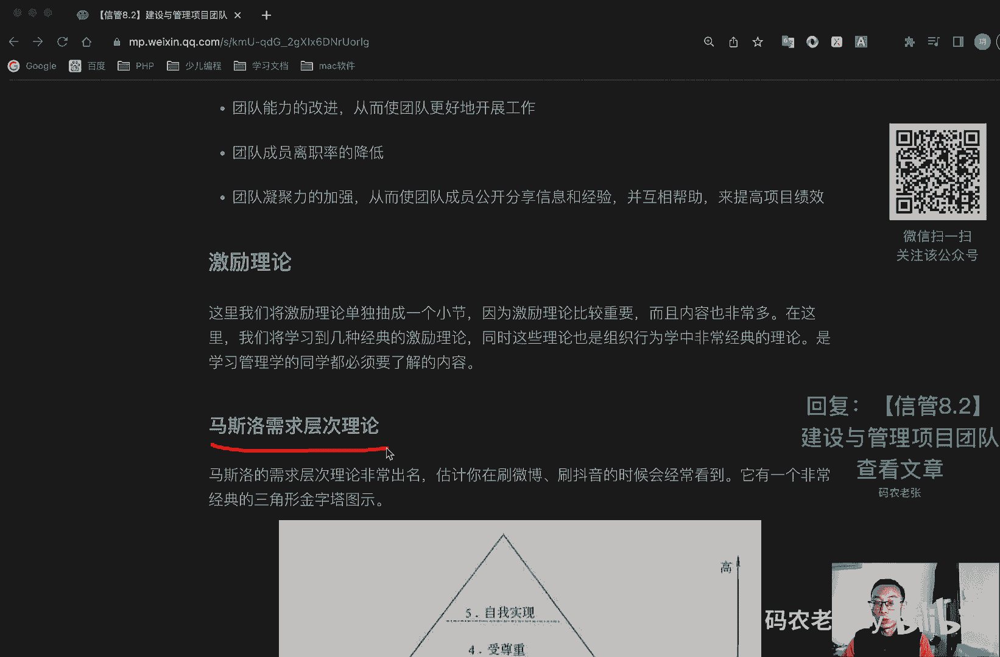
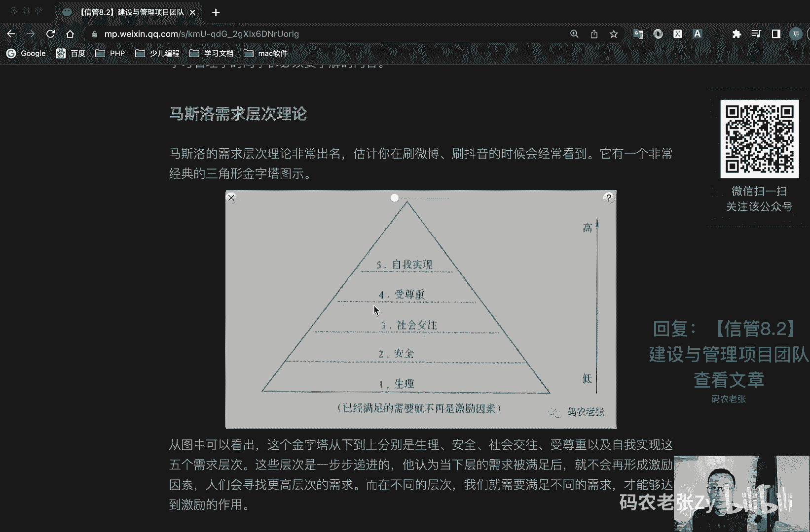
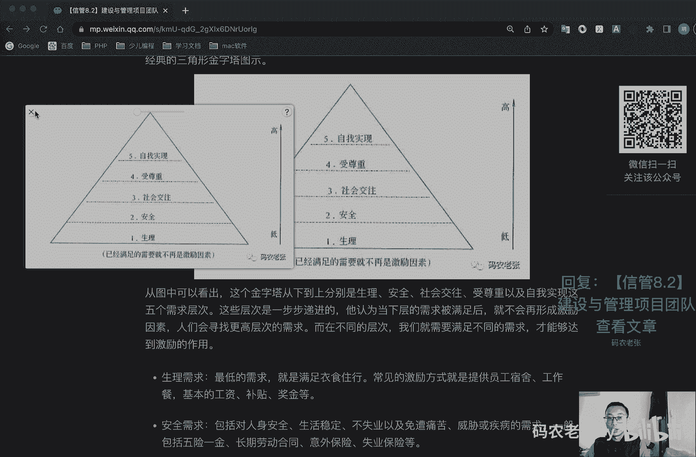
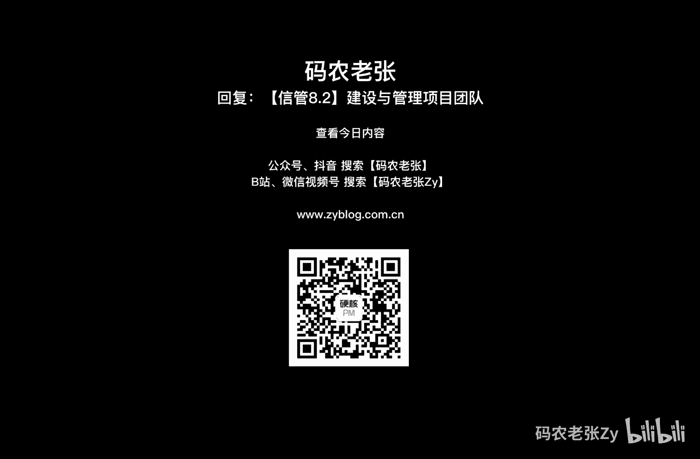

# 【信管8.2】建设与管理项目团队 - P1 - 码农老张Zy - BV1XM41177BM

hello，大家好，今天呢我们来学习的是信息系统项目管理师，第八大篇章的第二篇文章，建设与管理，项目团队在经过制定人力资源管理计划之后呢，我们就有了人力资源管理计划的文档，然后通过组建团队呢。

也让团队有了正式的成员，接下来干什么呢，当然就是在项目的开发过程当中，不断的去建设团队和管理团队了，这两个部分内容呢，也是我们项目人力资源管理，这个知识领域当中的一个重点的过程啊，这两个过程好了。

第一个就是建设项目团队，建设团队呢是提高工作能力，工作促进团队成员互动，改善团队成员的一个整体氛围，以提高项目绩效的一个过程，这个过程的主要收益就是改进团队协作，增进增强人际技能，然后激励团队成员。

降低人员离职率，以及提升整体的一个项目绩效，项目经理呢在合理化环境和富有文化的多样性，项目中呢，应该利用文化差异去了解他们，尊重他们，能够入乡随俗的融入到项目团队中，在整个项目生命周期中。

致力于去发展和维护团队，建设项目团队的一个目标，就是第一个提高项目团队成员的个人技能啊，以提高他们完成项目活动一个能力，与此同时降低成本，缩短工期，改进质量并提高绩效，这个都是关联起来的。

你个人能力提高了，这些东西肯定就是水到渠成的对吧，第二呢，就是提高项目团队成员之间的信任感和凝聚力，以提高士气，降低冲突，促进团队合作，这个东西也非常重要对吧，第三个呢就是创建动态的团结合作的团队文化。

以促进个人与团队的生产率，团队精神和团队协作，鼓励团队成员之间交叉培训和切磋，以共享经验和知识，从上面目标可以看出呢，其实我们要做到的就是，让个人绩效和团队绩效，都能够有一定程度的提高。

最终让我们的团队能够有明确的目标，成员清楚自己的工作对象和对项目的贡献，然后呢就是团队的组织能够解，组织结构呢能够清晰岗位，明确有成文的或者习惯的工作流程和方法，而且流程简明有效。

项目经理呢能够对团队成员有明确的考核，评价标准，工作结果是公正公开的，想赏罚也是分明的，大家共同可以制定并遵守组织纪律，能够协同工作，善于总结和学习，好在这个地方呢，我们要学习一个东西。

就是团队的一个发展阶段，这个团队发展阶段呢，是一个非常重要的一个理论啊，它叫做团队发展理论，优秀的团队从来都不是一蹴而就的，一般要经历五个阶段，这个阶段也叫做塔克曼阶梯理论，非常重要，塔科曼阶梯理论啊。

再画再画两下，再划两下，非常重要的，具体内容包括什么呢，第一个在团队在整个团队的一个呃，就是他进行合作的一个过程当中呢，会分为五个阶段，第一个阶段呢就是形成阶段，这个呢就是刚刚成立项目。

团队成员之间相互独立的一个阶段，这个时候产出，那肯定是比较一般的，因为大家还不熟悉对吧，第二呢就是震荡阶段，这个时候呢就是团队开始执行任务了，然后往往会遇到一些超出预期的困难。

个体之间呢因为因为不了解嘛对吧，所以他们会出现争执，然后互相指责，这个阶段是冲突最多的一个阶段，第三个阶段呢叫做规范阶段，经过一段时间的磨合之后呢，大家就开始协同工作，并调整各自的习惯和行为来支持团队。

在这个阶段当中呢，成员之间开始有信任，也是我们常说的会开始打配合的一个阶段了，下一个呢就是发挥阶段了，这个阶段的默契程度进一步加强，团队能够像一个组织有序的单位那样，工作成员之间的相互依靠。

可以平衡高效的解决问题，这个阶段的团队呢就是业绩最好的，产出也是最高的，非常棒，最后呢就是解散时间段，所有工作完成之后呢，团队就要解散了，好呃这里面呢就是这个关键词形成震荡，规范发挥和解散。

同样后面还有几个关键词对吧，相互独立是什么形成阶段的，然后这个冲突最多的是什么震荡阶段的对吧，然后呢打开始打配合了是什么阶段，规范阶段，然后产出最高业绩最好是什么，发挥阶段，解散阶段就不用多说了。

塔科曼模型这五个阶段呢通常是按顺序进行的，不过呢团队也有可能会停滞在某个阶段，或者是退回到较早的阶段，比如说不管你现在团队是属于什么阶段，不管是处于哪个阶段之中，只要有一个新同事加入。

那么他马上就回到第一个行程阶段，这是必然的啊，当然也不一定啊，就是如果如果这个这个清加入的成员呢，本身原来跟我们合作过，而且非常非常熟悉，是非常非常好的朋友，非常好的非常好的同事。

那么也有可能直接跳过这个行程阶段，或者行程和震荡阶段，直接到规范阶段也是有可能的啊，所以说他这个阶段不一定是固定的啊，所以某个阶段持续时间的长短呢，要取决于团队的一个活力，团队规模和团队管理。

就是管理团队的一个领导力，项目经理应该对团队活力有较好的理解，以便有效的团队历经所有的阶段，当然最好的是什么，最好的肯定是这两个阶段了，这个阶段是非常非常棒的了，但也不一定要，不一定。

某个团队就是从头到尾他都能到达这个阶段，它有可能会一直停滞在这个阶段也是有可能的，所以说呢这个就很体现项目经理的一个功力了，好，我们再看一下这个建设项目，团队里面的一些工具和技术。

建设项目团队的工具和技术，主要包括人际关系，技能培训，团队建设活动基本规则，因为办公之间可以奖励人事测评工具，我们就一个一个来简单了解一下啊，第一个就是人际关系的一个技能，有时也被称为软技能啊是吧。

有点呃应该大家就是有一点印象啊，应该也听说过的，什么叫做软技能对吧，职场的软技能，他呢是因富有情商并熟练掌握沟通技巧，冲突解决方法，谈判技巧，影响技能，团队建设技能和团队引导技能，而具备的行为能力。

它主要包括什么，领导力激励，以沟通影响力谈判，建立信任冲突管理，有效决策，教练技术，团队建设等等，教练技术我们在敏捷里面讲过，对不对好了，第二个呢就是培训，包括旨在提高项目团队成员能力的全部活动。

可以是正式的或者是非正式的方式呢，包括课堂培训啊，在线培训啊，计算机辅助培训啊，在岗培训啊，或者有其他团队成员提供的，然后包括辅导及训练等等，注意啊，注意就是在项目管理的理论当中的成员。

如果能力不足的话，首先考虑培训，而不是辞退，就是在项目管理理论里面，在考试里面不要先想着辞退啊，首先考虑培训，所有的题一定要往大好人的方向面去选择和考，虑，就跟什么。

就跟你做那个驾校的那个科目一样的对吧，所有的事情一定要往最好的地方去考虑，所以说如果你这个人，我们团队里面就是他出的题目里面，就是说你这个团队里面的那个人啊，可能能力不太行啊，或者是某个方面不太行啊。

我们要怎么办啊，肯定是先排雷训好，下面呢就是团队建设活动呃，就是既可以是状态审查会上的五分钟议程，也可以是为改善人际关系而设计的，在非工作场所专门举办的事业提升活动，团建团建，对不对，出去玩嘛。

非正式沟通和活动呢，有利于建立信任和良好的工作关系，这是一种持续的过程，好了，下一个就叫做基本规则，基本规则呢就是对项目团队成员的可接受行为，做出明确的规定，对注入行为规范啊，沟通方式啊，协同工作。

会议礼仪等规则进行讨论，规则注意规则一旦建立，全体成员必须遵守这个规则，是我们一起建立的一个基本规则，好下一个叫做集中办公，之前我们说过，虚拟团队呢是可以分布在各地区进行办公的，对不对。

而集中办公呢则是指，把部分的或者全部的团队成员的，安排在同一个物理地点工作，以增强团队工作能力，集中办公呢既可以是临时的，也可以是贯穿整个项目的好，下一个叫做认可与奖励，主要呢就是利益相关的内容了。

通过对行为的认可和奖励，来激励人们获得成就感和新的技能，来迎接新的挑战，相关的激励理论呢我们专门开辟的一节来讲啊，一会大家就会看到了，最后呢就是人事测评工具，能够让项目经理和团队成员。

洞察成员的优势和劣势，评估团队成员的偏好和愿望，然后呢就是团队成员如何处理和整理信息，团队成员如何制定决策，以及团队成员喜欢如何与人打交道，有各种工具如态度调查，细节评估系列结构化面谈，能力测试啊。

焦点小组讨论啊，这些工具呢都是有利于增进团队成员之间的理，解信任，忠诚和沟通，在整个项目期间，不断提高团队成员的一个成效的，好这个了解一下就行了，建设项目团队的输出啊，主要就是一个团队绩效的一个评价啊。

这个呢就是这些评价呢，包括正式或者非正式的有效的团队建设策略呢，和呃活动团队绩效啊，从而提高项目目标的可能性，那就是提高实现项目目标的可能性啊，评价团队有效性的指标呢，可以包括个人技能的改造。

从而使成员更有效的完成工作任务，然后呢就是团队能力的改进，然后从而使团队更好的开展工作，然后呢就是团队成员离职率的一个降低对吧，这很重要，然后团队凝聚力的加强，这个非常重要的。

从而使团队成员公开共享分享信息和经验，并互相帮助来提高项目绩效，女主只要代购团队，你就知道这一部分内容非常非常重要，非常非常有用，对不对，你只要带的话，那你肯定知道的好了，我们再来看一下。

看下集体理论呃，在这里呢，我们就是要将激励理论呢单独做成一个小结，因为激励理论是非常重要的，而且内容也非常多，在这里呢我们将学习到几种经典的激励理论，这些理论也是组织行为学，组织行为学。

管理学或者心理学都会讲这个东西的，就是组织行为学，他在在其中非常经典的，一个非常经典的几个理论啊，是学习管理学的同学都必须要了解的一个内容，好第一个非常出名的马斯洛需求层次理论啊。

这个大家不知道有没听说过，我估计很多人都听说啊。

最最最近有个电视剧里面也讲到了，这个马斯洛的需求层次理论，非常非常出名了，估计你在刷微博刷抖音的时候，或者是看电视的时候，经常会看到它有一个非常经典的一个三角形的，这样一个金字塔图示啊。

我把它给定下来好吧。

好定下来之后我们就可以看到，从这个图中，我们看到这个金字塔从下到上分别有几个层次，对不对，几个层次呢一个就是生理对吧，然后有这个生理生理需求，安全需求，社会交往需求，然后一个就是受尊重。

最后一个是自我实现，这几个需求层次呢是从低到高不断往上走的，生理需求呢它是最低的一个需求，就是其实就是满足我们的衣食住行啊，吃的饱穿的暖，然后也有地方能住对吧，晚上有个地方能睡觉。

常见的激励方式呢就是提供员工宿舍啊，工作餐啊，基本的工资啊，补贴啊，奖金等等，这些呢就是最基本的一个生理生理方面的需求，第二呢就是安全需求，安全需求包括对人身人身安全啊，生活稳定。

不失业以及免遭痛苦威胁或者疾病的一个需求，一般包括什么五险一金啊，长期劳动合同啊，意外保险，失业保险啊，这些就是就是什么就叫什么福利，对吧对，就是福利待遇，就是一个安全需求。

然后呢就是一个社会交往的需求，包括对友谊啊，爱情啊以及隶属关系的需求，当生理或者安全需求满足之后呢，社会社交需求就会凸显出来，如果这些需求得不到满足，会影响人们的精神，导致缺钱啊，低生产率啊。

常见的激励措施包括定期的员工活动啊，聚会啊，比赛啊，俱乐部等等，就是什么我们之前所有的团建对吧，然后呢就是受尊重的需求，说真的协调呢主要包括自尊心和荣誉感，荣誉来自别人，自尊来自自己对吧。

这个层次下的激励措施呢，包括荣誉性的奖励对吧，形象地位的提升，成为导师等等，什么年终的时候年终奖对不对，还有那个年终的时候评比什么优秀员工对吧，这些都是受尊重的需求，最后一个呢就是自我实现的需求。

实现自己的潜力，发挥个人的能力到最大程度，使自己越来越成为自己所期望的人物，这个层次的激励呢包括给予更多的空间，让他负责参与决策，参与管理等等，好了，非常经典非常出名的理论，牢牢记住马斯洛大神啊。

但是呢他的这个理论，其实也早就受到很多这个心理学家的质疑，原因就在于他这个需求层次啊，在一定的假设前提下完成的，一是呢人是要生存的，二是呢人的需求按重要性从低到高，这样去排列的，这个不一定的啊。

我跟你说这个这个东西就不一定了，第三个呢就是只有低单，就是这个低端的需求满足之后呢，才会往上去追求更高一级的这个东西，都是不一定的，不是所有人都是这样的，比如说有一些人在追求自我实现的道路上呢。

可能任何需求都不用，就像让我们现在有美好生活呃，对不对，当然了，也有些人可以跳过某些层次，比如说很多白手起家的一些创业者，他可能在创业的过程中并没有什么，并没有受过尊重啊，然后社会社会呃。

这个什么社会交往的可能也不是太多啊，他可能呃他他可能在创业的过程中，他他是先实现了自我实现就完成了创业，完成了自我实现之后才享受到了什么受尊重啊，还有下面这些内容的，它有可能是这种形式的啊。

啊这这这种形式啊，像我们这些普通人最多也就是达到什么，最多也就达到这个社会交往的层次了，什么有家有势，有点朋友，即使这样呢，有可能一次失业也会让我们直接往下掉，对不对，又往回退了。

就就我我就有过这种经历的，对不对，所以说呢在就在那种情况之下，我还是在不停的学习啊，最终目标呢反而就是我我学习的目的，反而就是为了为了一个自我实现上对吧，这个东西就很有意思了，我当时可能就是连安全。

就是连那个呃，这个可能都达不到了，但是我还是在一直不停的学习，一直不停的努力，就是为了实现一个自我的一个实现这个东西啊，当然我这个自我实现的也没想过什么荣誉，就是没有想过什么受尊重，没有想过什么荣誉。

只是想写一些东西，把自己的，就是把自己知道的一些东西给分享出来，所以说呢这个理论还是有些问题的，现实中的层次呢没有那么严格，也不是从下到上的这种依次往上的，他也是可能来回跳的这种形式的。

所以说呢这个这这个东西啊，啊就没没有没有这个看出来的，或者上面解释的那么好，但是啊但是你一定要注意的，就是因为这个东西实在是太出名了，你学任何的管理学或者学心理学啊。

你就是就是在这些理论学科方面来说的话，这个东西啊它有可能是错的，但是它因为它太经典了，所以说我们也必须要研究它，因为他也也也有它的一些优点，有些的优势对不对，也有一些参考的意义对吧。

所以说这个东西还是非常非常重要的，非常非常重要的，而且这个东西也是出去交友啊，玩的时候啊，或者是干嘛的时候，这个东西呢也都是非常好玩的，一个谈的就是一个谈资对吧。

一个非常好玩的一个东西，好我们再接着往下看，下一个呢叫做呃赫兹伯格的双因素理论，这个理论呢又叫做激励因素理论，激励因素理论它呢是由赫斯伯格提出的，它定义了两种完全不同的因素，影响了人们的工作行为。

第一个呢就是保健因素，这类因素是与工作环境或者条件有关的，能够防止人们产生不满意感的一类因素，它包括工作环境，工资薪水，然后公司政策，个人生活管理监督，人际关系等等，当保健因素不健全的时候。

人们就会对工作产生不满意感，你可以把保健因素看成是马斯洛需求层次，就是我们前面讲的那个底层的三个层次的汇总，也就是保健因素等于生理加安全加社会，好吧，这这这这样的话就好记了对吧。

保健就是生理加安全加社会，第二呢就是激励因素，这些因素呢是与原公共的工作本身，或者是工作内容有关的，能促使人们产生工作满意的一类因素，是高层次的需要，包括成就，承认工作本身啊，责任啊，发展机会等等。

当激励因素缺乏的时候，人们就缺乏进取心，对工作无所谓，但一旦具备了激励因素呢，员工则会感到强大的激励力量，而产生对工作的满意感，所以说只有这类因素呢才能真正的激励员工，我们也可以把激励因素看成什么呢。

我们前面说过，保健因素呢是马斯洛需求层次理论底下的三个，对不对，那么激励因素呢，就是它顶部的那两个高层次的需求对吧，金字塔尖对吧，往上走的高层次的两个高层次的需求，也就是说激励因素呢是等于受尊重。

加上自我实现，好吧，这个也比较好记啊，保健因素呢可以消除不满，而激励因素呢可以产生满意，这个呢在我们的管理过程中呢，不能一直只关注保健因素，过分的关注呢只是进一步让员工减少不满，这个。

这个其实也有点像我们之前讲过那个什么对吧，讲过的那个叫做卡顿模型，卡诺分析那个东西还记得不，卡诺卡诺分析对吧，我现在就画出来卡诺分析，它有这种的是吧，还有个这个对不对，这个呢就是如果按这个来说的话。

保健因素，保健因素就是这一条线线性增长的这一条线，对不对，然后激励因素就是上面这一条线对吧，因为这个线性增长呢它会是一直这样增长的，所以说它的它的这个增长幅度增长频率啊。

跟那个都是基本就是这种平行的这种形式的，但是如果精力因素比较高的话，他这个纵轴，这个纵轴y轴呢它会一下子穿到非常高，所以说这个东西啊，就是跟这个卡诺分析呢也是有一点点向导，这些理论啊。

理论方面的东西都是很像的一个那种感觉，对吧好吧，这个东西呢就是我联想到我联想了，但是真正的是不是呃呃呃是不是这样的话呢，还是大家自己去研究啊，好了，这个呢就是双因素理论，赫兹伯格的双因素理论好。

我们再来看一下x理论和y理论，这两个理论呢其实是一个理论，也就也可以叫做x杠y理论，它呢是由麦格雷戈啊，又一个人出来对吧，麦格雷戈提出的，我们要来看一看x和y分别代表什么，第一个就是x理论。

他对人性有如下假设，第一个就是人天性好逸恶劳，只有可能只要有可能就会逃避工作，第二个呢就是人生来就是以自我为中心的，淡漠组织的要求，第三个呢就是人缺乏进取心，逃避责任，甘愿听从指挥，受于现状。

没有创造性，第四个呢就是人们容易受骗，容易受人煽动，第五呢就是人们天生反对改革，第六位置是人的工作动机，是为了获得经济报酬是吧，看出来什么没有对吧，很明显啊，就是x理论是他的出发点是人性本恶。

都是非常负面非常非常负面的一些看法，所以说呢崇尚x理论的这些领导者，他会赶他，他会有他会有一些什么意见呢，他就是说在领导工作中呢，必须要对员工采取一些强制是吧，强制的强制的惩罚的和解雇等手段。

强迫员工去努力的工作对吧，这个强迫很重要，然后对员工应当严格监督控制和管理，主要人性本恶，x x理论就是人性本恶的，就是这几个关键词啊，都要记住好，我们再接着往下看，就是歪理论，y理论是对人性的假设。

和x理论就是完全相反的了，y理论呢就是人天生并不是好逸恶劳的，他们热爱工作，从工作中得到满足感和成就感对吧，然后外来的控制和处罚，对于人们实现组织的目标呢，不是一个有效的办法。

下属能够实现自我确定的目标，自我指指挥和自我控制，然后呢在适当条件下的人们愿意主动承担责任，大多数人具有一定的想象力和创造力，在现代社会中的人们的智慧和潜能呢，只是部分的得到了发挥，如果给予机会呢。

人们喜欢工作，并渴望发挥其才能，崇尚y理论的管理者，对员工采取以人为中心，宽容的及放权的一个领导方式，是下属和主机目标很好地结合起来，常用的激励办法呢包括，将员工个人目标与组织目标相融合。

扩大员工的工作范围，尽可能安排有意以前有挑战性的工作，使员工达到自我激励对吧，他们两个很有意思，一个是人性本恶，那歪理论反过来的对吧，人性善对不对，很有意思啊，好这个东西呢大家也了解一下，接下来呢啊。

这个这个这个选择，就是那个就是那个什么问答题，问答题见过的x0 和y理论问答题见过的，这几个都有可能出问答题啊，这几个呃宝剑就是那个赫兹伯格双因素理论，然后这个马斯洛需求层次，赫兹伯格。

然后x理论y理论都是都是有简答题的可能的，然后还有什么期望理论，最后一个期望理论它呢是有弗鲁姆提出来的，又一个人名对吧，又一个人民这几个人名也要记住的，弗鲁姆提出来的，他那是通过考察人们的努力行为。

与其所获得的最终奖筹之间的因果关系，来说明激励过程，并以选择合适的行为，来达到最终的奖筹目标的理论，他认为一个目标对人的激励程度呢，受两个因素的影响，第一个叫做目标下价，第二个叫做期望值啊。

我们先来看目标，下价是指实现该目标，对个人有多大价值的一个主观判断，如果实现该目标对个人来说很有价值，个人的积极性就很高，反之呢积极性就比较低了，目标下价啊，第二个呢就是期望值，指个人对实现该目标。

可能性大小的一个主观估计，只有个人认为实现该目标的可能性很大，才会努力去实现，从而在较高程度上发挥目标的一个激励作用，好了这四个理论，这个理论非常非常重要啊，都有可能选择题，选择题，简答题。

甚至你写论文的时候也可以去写一写啊，这个东西啊没问题的，还可以凑不少字数的对吧好了，我们再来看最后一个过程啊，叫做管理项目团队管理，项目团队呢是跟踪项目团队的一个成员，工作的表现，提供反馈。

解决问题并管理团队变更，以优化项目绩效的一个过程，等过程的主要收益呢就是影响团队行为，管理冲突，解决问题并评估团队成员的绩效，实施项目团队管理之后呢，应将项目人员配备管理计划进行更新，可以提出变更请求。

更新人力资源管理计划，实现问题的解决，同时为组织绩效评估提供依据，为组织的数据库呢增加新的经验教训，在管理项目团队的过程中呢，我们同样是关注它的工具与技术，主要包括观察和交谈，项目绩效评估，冲突管理。

影响力，管理技巧以及人际关系技能，其中的人际关系技能呢我们在之前已经讲过了，只要重点再看一下其他的几个工具就行了啊，人际关系技能我们前面讲了对吧好了，第一个就是观察与交谈，通过观察与交谈呢。

随时了解项目团队成员的工作和态度，可以用于监督项目进展，了解团队成员和项目团队成员，内部的一个人际关系，并针对项目问题进行资源复合分析，以及资源平衡的一个优化，好了解一下两个关键词就行了。

这两个关键词是属于这个观察与交谈里面的好，第二个就是项目的一个绩效评估，在项目过程中进行绩效评估的目的呢，就是诚心角色与职责，向团队成员提供建设性的反馈，发现未知的或未决的问题，制定私人培训计划。

然后呢以及确立未来的一个目标，能够带来的好处呢，包括技能的改进，从而使成为了更高效的完成分配的任务，然后呢就是能力和情感方面的改进，从而提高团队能力，帮助团队更好的共同工作。

然后呢就是团队成员流动率可以降低，最后呢就是增加团队凝聚力，好下一个冲突管理啊，今天的第二大重点内容啊，第二大重点内容嗯，第二大重点内容，在项目环境当中的冲突是不可避免的。

不一致的需求呢对稀缺资源的竞争啊，然后还有沟通不畅啊，进度优先安排及顺序啊，以及个人工作风格差异等等多种因素，都有可能成为冲突的一个起源，说白了计划与现实，人与人的期望，人与人的利益之间的矛盾。

任何一点呢，任何一点的不可调和呢，都会产生什么冲突，在项目管理中的最主要的冲突就是进度优先级，资源技术管理过程成本，个人几个方面，项目中的冲突根源在于项目的高压环境啊，责任模糊啊，存在多个上级啊。

新科技的使用啊等等啊，这几个关键词啊，了解一下，能记得就记住一下好吧，如果管理得当的话，意见分歧呢有利于提高创造力和改进决策，但假如意见分歧成为负面因素的话，应该首先由项目团队成员负责解决。

如果冲突升级了，项目经理应该提供协助促成满意的解决方案，来采用直接或者合作的方式，尽早并通常在私底下解决冲突好了，有五种冲突解决方法是我们需要重点关注的啊，打个新好，第一个叫做撤退回避啊，都加粗了啊。

撤退回避，这个呢就是指从实际或潜在的冲突中退出，将问题推迟到准备充分的时候，或者将问题推给其他人解决，这是一种让步的做法，让步的做法可以让冲突双方降温，好几个关键字对吧，让步的临时的降温就是撤退与回避。

好吧，非常重要啊，好真的真的非常重要，再打一颗星了，非常非常重要，这五个东西好了，第二个叫做缓和和包容，这个呢就是强调一致，淡化分歧，为维持和谐与关系而单方面退让一步，一个人退步，某一个人退步对吧。

两个人冲突了，某一个人退步，最简单的四个字就可以概括他，那就是求同存异对吧，一个人退步，求同存异就是什么缓和包容，注意啊，关键词之间的关系，然后第三个叫做妥协和调解，他那是寻找能够让各方都在一定程度上。

满意的方案，这是一种折中的方案，可能各方都会有损失，所以需要大家各让一步，所有人各让一步，上面那个缓和包容是某一个人退让一步，下面这个妥协与调解就是各让一步啊，是一种折中的方案，好第四个叫做强迫与命令。

这个呢就是以牺牲其他方为代价，推行某一方的观点，这种方面，这这种方案呢只提供一方赢的结果，就是一个就是甲和乙去产生冲突了，那么我们作为项目经理的话，我们就是强，我们就直接指定就是假的方案。

就是使用假的方案，或者是怎么样就是假甲甲说的是对的，好吧，这种情况下呢，我们就是强行的去推行甲的观点，但是呢这个值，然后就是只提供甲方去赢了一个观点，他那是一种强权的方案。

那么乙方的心理肯定是不是乙方的心理，他心里肯定不会舒服的对吧，这个就是一个强迫命令的，它是一种强权方案，好最后一个叫做合作解决问题啊，这个肯定是最好的对吧，综合考虑不同的观点和意见。

采用合作的态度和开放式的对话，引导各方达成共识和承诺，很明显它是一种解决冲突的方式，可以让多数人共赢，就是大部分人都可以共赢，他需要面对面的一起去找原因，所以说因为需要面对面，然后还需要一起去找原因。

所以说他可能非常非常慢啊，本身大家都是有冲突的，对不对，这个时候呢我们要坐下来慢慢谈，慢慢的去找原因，那么他肯定就是解决，当然它的效果是最好的，但是它也可能是解决速度最慢的。

ok这个地方这个地方经常是出题的，而且这个题是很诡异的啊，好比如说两个两个同事，甲和乙他们现在产生冲突了，我就跟他们说，让你们去自己回去再好好的想一想，然后去想一下解决方案。

然后呃然后我最最晚最晚明天下午之前呢，把你们的最后想到的那个解决方案再再告诉我，然后由我最后来评判啊，到底是采用谁的方案，在这种情况下呢，这个冲突解决的方式呢，是属于哪个冲突解决方式呢，大家可以想一想。

这个是属于哪个冲突解决方式啊，我就不卖关子了，这个是彻底会回避啊，注意啊，撤退会回避啊，为什么呢，因为我让他们进，现在先去先去拿出自己的解决方案，然后明天下午明天晚上我再来决定。

所以说它是一我做的这个方法，就是一个呃不不是让步啊，我说的方法是临时，让冲突双方降温的一种方式啊，我做的我做的这个决定，是临时让双冲突双方降温的一个方式，不是说我现在就要决定，不是强迫和命令啊，注意啊。

不是强迫命令，是撤退和回避，就刚刚我那个例子非常有意思啊，也非常这个这个出题啊，非常容易在这里出坑的，一定要小心好，再来看一下影响力啊，影响力啊非常出名的，有本书就叫影响力，对不对。

在项目环境中的项目团队，项目经理，对团队成员通常呃，没有或者仅有很小的命令职权，所以说他们事实影响相关方的能力呢，对保证项目成功非常非常关键啊，影响力也是影响行为，改变事情的一个过程和方向。

克服阻力的方式，其中呃权力是影响力的一部分，权利会让人们进行原本不愿意进行的事情，一般包括五种权利，这个东西打个小心也很重要对吧，这个这个也是一个很重要的东西，所以说我打一颗小心也放在这里好了。

职位权利啊，职第一个就是职位权利，职位权利，那就是来源于管理者在组织中的职位和职权，是一种合法的权利啊，这个不用多说，不用多解释对吧，你的领导就是你的领导好，第二个呢就是惩罚权利啊。

这个也是领导可以用的，对不对，使用降职扣薪，惩罚批评威胁等负面手段的能力，要谨慎使用啊，这个考试啊，项目管理理论啊，里面的这些考试啊，p m p啊，或者是新款式的考试啊，都是呃都都是往好的方面去想对吧。

这种惩罚肯定是要谨慎使用的对吧，现实中不一定啊，然后呢就是奖励权利，奖励权利的就是给予下属奖励的能力，包括加薪升职福利，休假礼物，口头表扬啊，认可啊，这个一般过年的时候都会有的，对不对。

这个也就不多说了好还有两个呢，一个叫做专家权利，这个就是来源个人专业的能力，就就怎么说呢，就我们做技术的，有我就是经常有一点啊，我就我我之前我之前刚毕业的时候，我就是领导特别牛逼，那我就服他，对不对。

领导特别牛逼，我就服他领导领导如果不是特别牛逼的话，那我可能就我在工作的过程中，可能就不会特别的服他，这个就是专家权利带来的一个什么影响力啊，这一点非常重要的好，最后一个就是参照权利。

就是由成为别人学习参照榜样所拥有的力量，是由于他人对你的认可和敬佩，从而愿意模仿和服从你的权利，是一种个人的魅力啊，就这个人的这个人自自身所散发的一种魅力，这个就叫做参照权利好，对于这五种权利来说呢。

这三种权利呢，可以是看作是组织赋予的一种职能权利对吧，它是一种法定的一个权利，而专家和参照权利呢，则是由个人本身所散发出来的一种影响力，好吧，这个影响力这个地方打一个小心，打一个小心。

这个地方也是非常重要的，也是五个，对不对，也是五个也是很重要的，好我们再来看一下管理与领导技巧，最后呢我们再了解一点，就是管理与领导的一个技巧，首先是我们上面说过的这个惩罚权利。

大家都知道这个权利呢是不能滥用的，是需要遵循一些规则的，比如说我们惩罚要马上进行对吧，及时进行，第二个就是罚要罚到胆战心惊赏，要想到心花怒放，这个很重要啊，这个很重要很重要的一条原则。

罚要罚的直接罚罚到他怕，然后少了少到他心花怒放好，第三个就是惩罚是以制度去惩罚啊，一定要注意啊，他是以制度去惩罚，对人不对事啊，不是对事不对人，你看一下说法吗，对事不对啊，增加一下印象。

故意的说法一下好了，下一个就是总结教训，总结教训，获得经验，成长才是最终的一个目的好，另外比较经典的管理风格呢有四种，就大家一起沟通，自由式就随便玩啊，还有官僚是上下联名的这几种啊。

领导的方式比较经典的就是情景式的领导方式，分为支持是教练式，授权式和指导师的四种，注意一个是管理风格，一个是领导风格，具体的领导风格呢，我们之前在敏捷系列的课程中呢，有深入的讲解啊。

在这边大家了解一下下面这张图就行了，这个呢就是情境式领导的一个，比较典型的一张图啊，我们领导形式呢，就是你看这种这个轴，表示的一个是一个关系行为，也就是一个支持性的行为，就是我们作为领导。

给予这个员工有多大一个支持，然后横轴呢就是工作行为，也就是呃横轴呢就是一个指导性的一个行为，指导我们给予他多少的指导，这个是我们给予他多少的一个支持，这个支持对于资源的支持，是我的各方面的支持。

我们还可以看啊，这有四个象限对吧，因为因为这两个轴就所以组成了四个象限，第一个呢就是这个我们怎么看呢，就看这个是从从这边开始看吧，第一个就是授权式的，授权式的呢就是我们指导很低。

然后这个给予的支持也很低，这个呢基本上就是放任了，让他们自己去搞了对吧，让他们自己去弄了，我们作为领导的话就不太不太去参与了对吧，所以它主要使用的一些就是什么观察呀，或者是一些监控啊，就可以了。

然后第二个呢就是第二个就是支持型的，知识型的呢，就是我们会给予很多的支持，但是我们在指导这一块呢就不是特别多，这个时候呢我们从我们作为领导的话，我们主要就是以鼓励为主，然后如果有问题的。

我们会去帮帮帮他们去解决问题好，这就是第二种的这种情境领导的形式，第三个呢叫做教练式，教练式呢就是有很高的这个支持行为，同时呢也给予很高的一个指导行为，这个时候呢我们会给他去解释。

这个工作里面的各种东西，然后同样也会对他，如果如果如果有些东西啊，就是我们出现，就是我们感觉他做的不对的话，我们也会进行一个劝服，大概就是这种这种这种教练式的，就是就是指导啊和这个支持啊都是比较高的啊。

最后呢就是指导式的，指导式的，很明显就是指导性的行为比较多，然后那个支持性的行为会比较少，就是以指示为主，以下指示为主，然后以引导为主，好了，这个就是一个情景式的领导，就之前在我敏捷系列的课程里面呢。

还有一个有专门的讲解这一块的，这一块也是比较有意思的，但是在新馆市这边呢，这个不是特别重要，不是特别重要，了解一下就可以了好了，总结一下吧，今天的内容不少，对不对，重点也比较多。

最重要的三个方面分别是什么，激励理论啊，那四个激励理论，马斯洛需求层次理论，赫兹伯格的双因素理论，然后x y x理论和y理论，还有什么期望理论分别，还同样还有他就是后面这两个理论还有记录，普鲁木啊。

还有那个谁啊，那个啊对对对，那几个人对吧，那名字我都记不住，最后一个x0 和y理论是谁来的，弗鲁姆是那个期望理论的对吧，x理论和y理论是麦格雷戈，对不对，麦格雷戈这几个人名也是也是需要记住的。

然后呢就是第二个就是冲突的解决方式对吧，五种冲突的一个解决方式，对不对，我前面说的那个例题也很有意思的是，他他会问你是属于哪个冲突解决方式的，然后呢就是团队的一个发展阶段，团队发展阶段。

正当阶段什么那些的就是加入了一个新员工，他们会回退到哪个阶段对吧，这个也是经常容易出题的，而且这几个东西简答题都有可能出的好了，其他的内容呢其实也很重要啊，就是各种工具和技术都是选择题所偏爱的。

而重点呢这三个呢就是选择，选择和简答都很爱出对吧，我前面也说了，就不要考虑太多了，直接背下来就行了，项目人力资源管理的内容呢，到此为止就全部结束了，是不是不不比范围进度成本，放置进程的东西要少对吧。

继续继续，咱们的学习内容还很多好，不要止步于此了，ok今天的内容呢就是这些，大家可以回复文章标题，信管8。22建设与管理项目团队，来获得这篇文章的具体内容，以及详细的一些这些信息和资料啊。

这些东西呢一定要去仔细的看，如果有我没讲明白了，或者是你就是特别这些理论方面的东西啊，如果我还讲的不是特明白的话，大家一定要再去查找一些相关的资料，去深入的去了解一下。

好吧，今天内容就这些。

