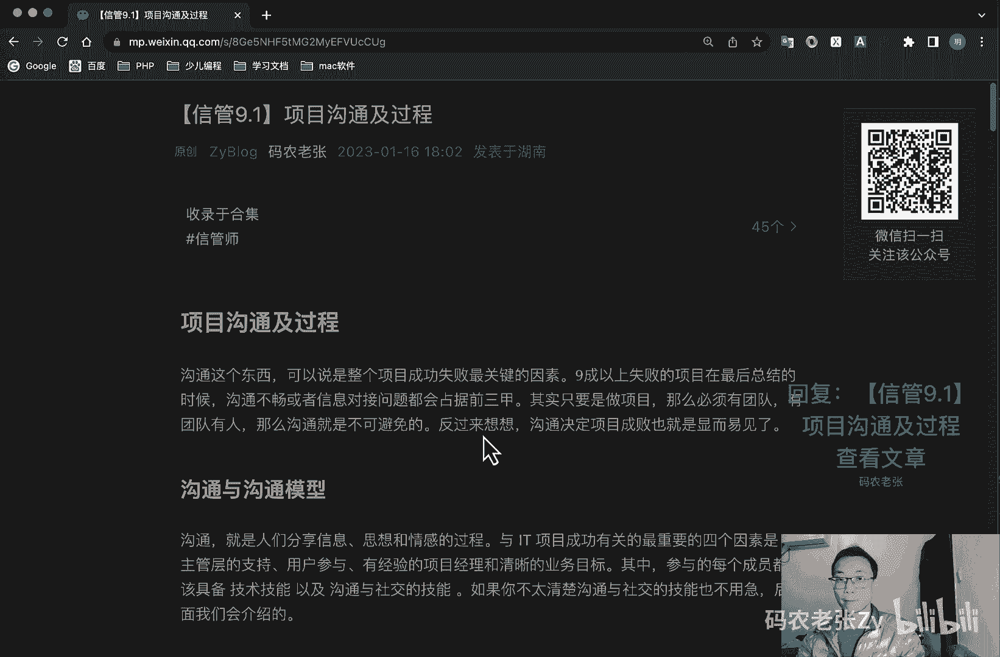

# 【信管9.1】项目沟通及过程 - P1 - 码农老张Zy - BV1VY411e7mm

哈喽大家好，今天呢我们来学习的是信息系统项目管理师，第九大篇章的第一篇文章，项目沟通及过程，这一大篇章呢我们会学习到沟通和干系人，这两个知识域都会放在这个篇章里面去讲好，我们先来看一下项目沟通及过程啊。

沟通这个东西可以说是整个项目成功失败，成功或者是失败的最关键的一个因素啊，九成以上失败的项目在最后总结的时候呢，沟通不畅，或者说信息对接问题呢都会占据前三甲，其实只要是做项目，那么必须有团队。

有团队就有人，那么沟通就是不可避免的，反过来想一想，沟通决定项目成败，也就是显而易见的一件事情了，好沟通与沟通模型啊，我们先看一下，沟通就是人们分享信息思想和情感的过程。

与it项目成功有关的最重要的四个因素是，第一个就是主管层的一个支持，第二个就是用户参与，第三个有经验的项目经理和清晰的业务目标，其中参与的每个成员都应该具备技术技能，以及沟通和社交的技能。

如果你不太清楚沟通与社交的技能，也不用急，后面我们都会介绍到的好，我们先一个一个来看，第一个呢是沟通模型，我们在信管师这一系列课程的第一课当中呢，就学习过这个概念啊。

其实这个沟通模型和我们这个信息的模型，是非常非常像的，不记得小伙伴也可以再回到第一篇文章，去看一下啊，我们看一下其实这个沟通的模型啊，它也是有一个什么过程呢，包括这个编码过程是吧，有发送者。

发送者是信息源，对不对，然后有接收者，然后在这个过程中的信息，要通过一个编码的阶段，然后通过一个沟通媒介，我们之前说过什么什么光缆啊，什么那些的对吧，这些呢或者是电话啊，什么无线电啊。

这些的他都是沟通媒介，然后在一码通过沟通媒介传输到了之后呢，通过这个译码的过程呢，最后交给接收者，然后在这个过程中呢也会有一些媒介的约束，对媒介的选择对不对，然后呢。

我们信息接收者还要对他进行把信息反馈给他，就说我们接收到了对吧，呃那个tcp的三次握手是不是一定要反馈，一定要有反馈啊，好我们具体看一下编码，就是把思想或者想法转化为他人所理解的语言，就是这一块。

然后呢信息和反馈，信息是编码过程所得到的一个结果，这个呢就是一定要让发送者知道，我们收到了他的信息，这个东西真的很重要，我一再强调的，然后呢就是媒介，媒介是用来传递信息的方法，就我前面说过的啊，什么。

不管是光缆啊，无线电啊，或者是手机信号，对不对，然后呢噪声，噪声就是干扰信息传输和理解的一切因素，在这个图中好像没有噪声，对不对，但是我们之前在讲信息的那一个图里面的时候，是讲到有噪声这个东西的。

然后呢，解码解码就是把信息还原成有意义的思，想或者想法的一个过程，好基本的沟通模型呢包含五个基本状态，就是已发送，已收到，已理解，已认可以转化为积极的行动，没有反馈的沟通是无效的沟通，这一点很重要啊。

我再一次强调了，知道为什么丁丁有未读已读的这个提示了吗，对吧，虽然你很烦对吧，但是你的领导非常需要这种功能，这也是丁丁能够在企业市场上成为最强的，m工具的原因之一。

好再来看一下沟通方法与渠道沟通的方式呢，可以有面对面啊，信件啊，电话啊，视频等等方法，包括参与技术讨论啊，征询啊，推销啊，叙述啊等等，这些都是小学的知识啊，没什么可多说的，我们主要来看看沟通的渠道。

沟通的渠道呢或者说种类啊有很多啊，对于个人来说呢，包括个人和非个人两种沟通，个人沟通呢就是两个人互相交流，而非个人沟通呢就是通过媒体，这些媒体包括什么呢，网站啊，电视啊对吧，现在的抖音啊。

微博啊什么的大会活动等等进行沟通，这个呢不是我们学习的重点，我们重点是在于组织中的沟通，组织中的沟通呢可以按多种维度来进行分类，包括但不限于什么呢，第一种内部沟通也叫做队内的沟通。

是针对项目内部或者组织内部的相关方，讲求效率与准确度，可能以非正式的一个形式出现，另外呢就是外部沟通，外部沟通呢也叫做对外沟通，针对外部相关方，如客户，供应商啊，其他项目啊，组织啊，政府啊，公众等等。

强调的是信息的充分和准确，通常是正式的一个对外的一个沟通，主要内部的同样以非正式的形式出现，而外部的通常是以正式的形式出现的对吧，你要对外去发布一个什么信息的时候，肯定是非常非常正式的对吧好。

那么正式沟通，正式沟通呢主要就是报告正式会议，定期获得临时的，然后呢就是会议程和记录相关方简报和演示，多以会议的形式体现出来，正式沟通和正式对吧，然后呢非正式沟通呢一般是采用电子邮件啊。

社交媒体网站以及非正式临时讨论的，一般活动，非正式沟通的场合比较多，即使是中午一起吃盒饭，它也是一种非正式的沟通，然后呢就是层级啊，层级就有什么向上向下沟通对吧，向上呢就是针对你的高层，你的领导。

你跟你的领导沟通就是向上沟通，然后乡下呢就是针对工作团队和其他成员，就是你带的小弟小妹们，这个呢就是向下沟通，向上向下沟通的也可以叫做垂直的沟通对吧，上下的垂直沟通，沟通的信息传播速度非常快。

准确度非常高，这都是关键词啊，这都是关键词啊，然后呢就是层级就是一个横向沟通对吧，他层级有一个是向下向下的一个沟通，有一个就是横向的沟通，横向的沟通呢也叫做水平的沟通。

针对的就是项目经理或者团队的同级人员，特点是复杂程度高，往往不受当事人的控制，对吧好，接下来呢就是官方沟通，官方沟通一般是通过年报啊，成交客户啊，用户啊，通常是正式的沟通形式的，然后呢，非官方的沟通。

通常是采用灵活的手段来建立和维护项目团队，以及其相官方对项目情况的了解和认可，并在他们之间建立强有力的关系，很明显啊，这个肯定走的是非正式的沟通方式了，最后呢就是书面与口头沟通，口头口头啊。

就是这个用词和音调的变化，以及非口头就是肢体语言和行为，社交媒体和网站等进行的发布，书面的特点呢就是清晰就非常清晰，二一性比较少，以及可以作为备忘录，也可以作为双方沟通的一个证据，缺点呢就是缺乏人性化。

就是他他很官方嘛对吧，写的都是那种八股文那种形式的，然后口头沟通呢较为人性化，在沟通的过程中接收到的信息，就是平常我们说啊接收到的信息，就你说话的，说话的信息，其实就是占你接收到信息只占7%。

然后你的声音声调，比如说重点啊，抑扬顿挫啊对吧，这种重音啊什么的，他会占到38%，你特别去强调，特别去重点的这些内容呢，他肯定会占的就是占的比例更高一些，就占到你接收到的信息的比例啊。

最后一个呢就是肢体信息啊，肢体信息占到55%，其实这一点啊这一点毕竟就是p np啊，包括这相关的理论其实都是老外那边引过来的，对不对，就是外国人你会发现就是你学英语的时候，外国人就是很喜欢肢体沟通的。

他很喜欢去做各种手势啊，做各种表情啊什么的，非常丰富，对不对，就是说在他们的英语体系当中呢，肢体沟通的占到的比例是非常非常高的，能占到55%，但是其实这一点啊，呃就这一点就是通过我的理解啊。

就我也没有看过什么别的资料，但是我感觉啊就在中国人，就在我们中国人这里呢，他应该占不到这么高，对不对，因为我们中国人还是比较含蓄，比较内敛的，所以说我们的表情啊。

还有我们的肢体语言可能并不是那么丰富对吧，好，这个呢大家理解一下就好，如果考试碰到这个的话，你一定要记住，语言占7%，声音升到38%，肢体是55%好，因此呢面对面的口头沟通呢。

其实是效率最高的一种沟通形式，但书面沟通的优点呢也不能抹去，那就是合适的场景，要使用合适的沟通方式呢，才是我们最正式的一个选择了，好沟通渠道呢大概就是这些类型，你要清楚的知道。

我们的沟通呢一定是内外有别的，非正式沟通有利于关系融洽，采用对方能够接受的沟通风格，才能有效沟通，书面沟通和面对面沟通的区别和特点呢，也是重点内容啊，上面这一块的，其中呢书面沟通还有个5c原则。

大家可以了解一下，就书面沟通的书面沟通就是写的要非常真实，对不对，所以呢他要有正确的语法和拼写，然后呢又有简洁的表述和无多余的字，另外呢清晰的目的和表述适合读者的需要，然后就是连贯的思维逻辑。

最后呢就是受控语句和想法的一个承接，这个5c原则呢，需要和我们后面要讲的沟通原则来配合，才能发挥效果，后面我们会讲到沟通原则的，另外呢我们再来了解一下沟通渠道的计算，这个沟通渠道的意思呢。

就是人与人之间要沟通的连接数量，比如说我们两个人沟通，其实只需要一条通道就可以了对吧，我说你听你听我听就可以了，而三个人呢就需要三条沟通通道，就是我说的就是你看这张图就知道了，你看这张图就是我说给他听。

对不对，他也可以说给我听，然后我说给他听，他说我听我说给他听，他说我听，你看这三个渠道，这三个渠道呢，但是它是有六条线的对吧，有这条线的，就一条渠道的话是两条线，对不对好，那么如果有五个人沟通呢。

五个人沟通呢，其实这是有个公式的，这个公式是什么呢，n乘以n减一，好公式就在这个地方，它的计算公式就是n乘以n减1÷2，这个呢就比如说你看55x45x4对吧，55-1=45x4÷2。

452 10÷2就有十条，你看你自己去数一下嘛，12345，对不对，678 90是不是十条沟通渠道，对不对，十条沟通渠道，但是如果他问的是双向的，就比如说他在这个题目里面出现了一个双向的。

那么你就不需要这个除二了，不要这个除二了，明白吗，不要这个除二了，或者是你把它算出来之后再乘以一个二，就是双向的，如果他出的那个题里面有问到，双向的沟通渠道的话，那么就不要去除以这个二了。

如果他没有问的话，那么就是n乘以n减1÷2，这个代表的就是这种沟通题啊，千万不要发懵啊，沟通渠道沟通数量代表的都是这个计算啊，还有一个就是他有没有问双向的这个问题啊，好这个呢就是一个沟通渠道的，你去算。

不管多少人，你算出来的沟通渠道，那肯定是符合这个公式的，好我们再来看一下沟通障碍，在沟通过程中最怕的是什么呢，那就是双方理解的不一致，而这些问题都是由于沟通过程中出现的障碍，所导致的，有可能是认知障碍。

双方对工作内容的认知不同，也有可能是语义障碍，理解了错了对方的意思，我们从最通用的角度来看呢，沟通中的障碍一般包括什么呢，第一个呢就是缺乏清晰的一个沟通渠道，第二个就是发送者与接收者存在物理距离对吧。

第三个呢就是沟通双方彼此技术语言不通，第四个呢就是分散注意力的环境因素噪声，第五呢就是有害的态度，敌对和不信任，最后呢就是权力的游戏啊，滞留信息啊，隐藏硬程啊，与敌对情绪等等，好我再强调一点啊。

就是这个沟通的渠道，沟通的渠道，沟通的就是沟通之间你传递的信息，这个渠道越长，比如说你本来要把这个信息告诉给他对吧，但是你是这么绕了一圈来告诉给他的，最后你说出来的东西，你本来想跟他说。

是是是是是跟他说的一件事呢，就是比如说你跟他说的是一个大象，最后传到他这里呢，可能就变成一个老鼠了，对不对，有这样的例子对吧，很多这样的故事，很多这样的例子好，这个是我们再强调一下。

这个也跟沟通障碍是有关的啊，好了我们再来说一下沟通原则，前面说过了，在那个5c原则里面也说了这个沟通原则了，在沟通过程中呢，我们可以秉承一些沟通原则，只要遵循这些原则呢，我就可以为我们带来高效的沟通。

他们包括哪些呢，第一个就是沟通的内外有别的原则对吧，前面也说过了，第二个呢就是非跟正式沟通有利于关系融洽，前面也说过了好，第三个呢就是采用对方能够接受的沟通，应该还加了两个字，沟通形式啊，沟通形式。

对方能够接受的沟通形式或者沟通语言，或者什么各个方面的都可以，然后呢就是最后呢就是沟通升级的原则，四个步骤是不是哪四个步骤，什么叫沟通升级啊，就是你跟这个人说的已经说不清楚了对吧。

你就要把这个沟通升级怎么升级呢，四个步骤，第一步和对方沟通对吧，这是第一步，你先跟他沟通好，说不清楚了，好，跟对方的上级沟通，上级沟通还是不行，或者是沟通渠道不畅通或者怎么样还是不行，对不对。

和自己的上级再去沟通嘛对吧，跟自己的领导再去说说问题嘛，然后就是最后就是自己的领导和对方的领导，去沟通对吧，这就是沟通升级的四个步骤，好这个东西呢也是要需要去记住一下的，好了。

我们再来看一下人际沟通风格类型啊，人际沟通的风格或者说类型的话主要有四种啊，这里有一张图，我们就直接结合来看一下，第一个呢就是实践型，实践型这个地，这这这种形式呢它就是以对视为主。

然后也非常果断的一种类型，他那是比较强势的，很有主见的，注重结果的，很有强烈灌输的欲望，不喜欢讲情感，喜欢命令别人，然后第二种沟通类型呢就是下面这个理想型的，理想型呢就是这个沟通的过程很果断。

但是呢它是以人为主的对吧，以人为主的他就比较温和，然后注重双方的一个交流，讲话比较礼貌，注重团队，注重气氛，然后再一种呢就是表现型的，表现型的就是沟通比较内敛，然后也是以人为主的这种形式呢就是热爱。

然后爱说话，肢体语言比较夸张，语速快，容易配合，最后一种呢就是理想型的，以理性型的分析型的，他呢就是注重过程啊，重视数据，注重细节，防御性强，与陌生人熟悉的过程比较长，注重调理。

具体的内容它呢也是以视为主，然后比较内敛的一种形式，从对人对视和主动果断被动内敛的角度呢，就可以把它们放到这四个象限里面啊，然后这个呢了解一下就行了，大概知道他们这几个类型，然后代表的是什么样子的。

什么比较强劲，比较温和的，热情的和注重过程的就可以了好了，这都是关键词的记忆啊，然后呢就是发展趋势和新兴实践，最后呢在沟通相关的概念和理论中呢，我们再来看一下，沟通管理的发展趋势和新兴实践。

这些内容呢也是p mp第六版中新加的，都是敏捷中比较提倡的一个事件，包括但不限于，第一个是将相关方纳入项目评审范围，第二个呢让相关方参加项目会议，第三个呢社交工具的使用了日益增多了。

第四个呢就是多面性的沟通方式好，我们再看一下项目沟通管理的一个过程，第一个呢就是规划过程组里面包括规划，沟通管理，它主要是根据干系人的信息需要和要求，以及以组织的可用资产情况。

制定合适的项目沟通方式和计划的过程，第二呢就是执行过程主义，包括管理沟通，这个呢就是根据沟通管理计划生成收集颁发，然后储存检索及最终处置项目信息的一个过程，最后呢就是监控过程组的控制。

沟通在整个项目生命周期中呢，对沟通进行监督和控制的过程，以确保满足该项目干系人对信息的一个需求，好了总结一下今天我们学习的内容呢，其实是以沟通的概念为主的，其中涉及的沟通渠道呢是今天的重点内容。

其他的沟通原则障碍什么的，也是需要了解的内容，这些啊虽说几率不高，但是也有可能会出一些选择简答之类的题目，最后呢我们再了解一下项目沟通，管理的一个过程啊，就是这三个过程非常简单的三个过程。

下节课我们再详细的去讲一下他们好了，今天的内容呢就是这些，大家可以回复文章的标题，信管9。1，项目沟通以及过程，来获得这篇文章的具体内容好了，详细的信息呢大家还是要仔细的来看一下的，特别是一些记忆点。

就这些记忆点大家还是要详细的来呃学习一下，仔细的来看一下好了，今天内容呢就是这些。

