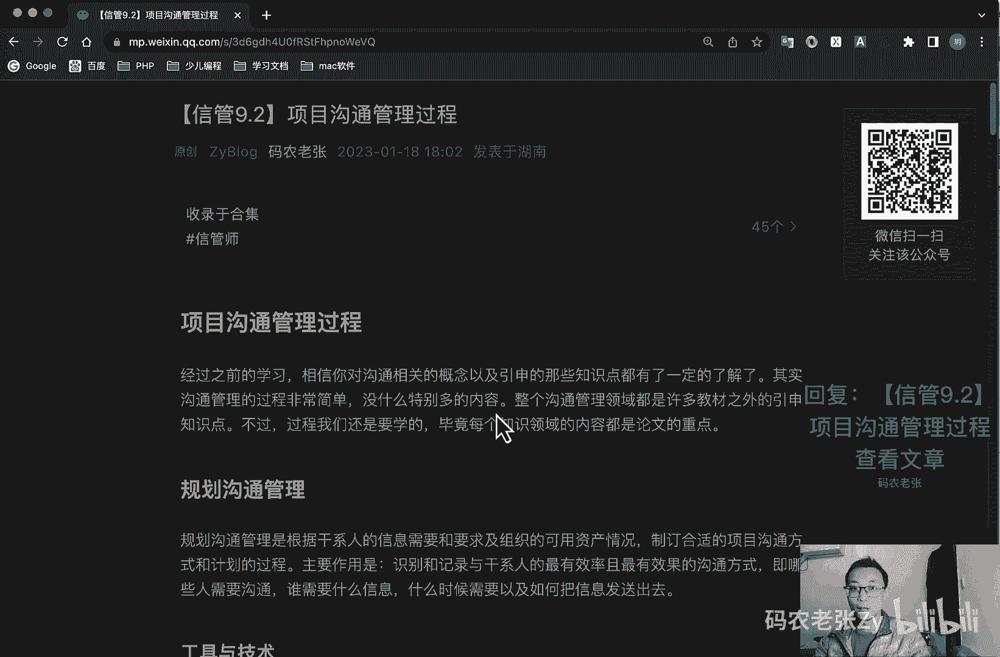
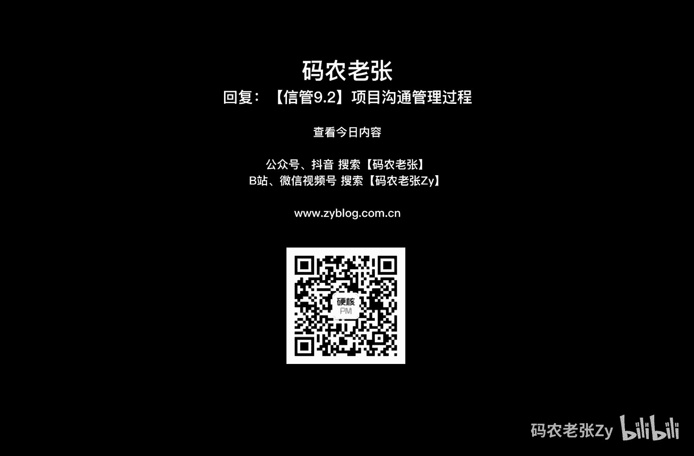

# 【信管9.2】项目沟通管理过程 - P1 - 码农老张Zy - BV1P24y1h7s6

哈喽大家好，今天呢我们来学习的是信息系统项目管理师，第九大篇章的第二篇文章，项目沟通管理过程，好像我们共同管理过程呢，经过之前的学习呢，相信你对沟通相关的概念，以及引申的那些知识点呢有一定的了解了。

其实呢沟通管理的过程非常非常简单，没什么特别多的内容，整个沟通管理领域呢，都是许多教材之外的引申知识点，不过呢过程我们还是要学的，毕竟每个知识领域的内容呢，都是论文的一个重点啊。

好我们先来看一下规划沟通管理，规划沟通管理呢是根据干系人的信息，需要和要求，以及组织的可用资产情况，制定合适的项目沟通方式和计划的一个过程，它的主要作用呢就是识别和记录与感性人。

最有效率而且最有效果的一个什么沟通方式，即哪些人需要沟通，谁需要什么信息，什么时候需要，以及怡和，以及如何把这些信息给发送出去，工具与计算呢包括规划呃，主要包括什么沟通需求分析对吧，然后沟通技术。

然后沟通模型，沟通方法等等，我们简单来看看啊，第一个呢就是沟通需求的分析，它呢主要就是确定项目干系人的信息需求，包括所需信息的类型和格式，以及信息对干系人的价值，用于识别和确定项目沟通需求的信息。

包括但不限于，第一个呢就是组织结构图，第二个是项目组织与干系人之间的责任关系，第三个呢是项目所涉及的学科部门和专业，下一个呢就是参与项目的人数与项目地点，接着呢是内部信息的需求，包括组织内部沟通的时间。

然后呢就是外部的信息需求与媒体，公众或者是外包的一个沟通时间，然后呢，就是来自干系人登记册和干系人的信息和沟，通的一个需求，下一个呢就是沟通技术，我们可以采用各种技术啊，在项目干系人之间传递信息。

包括对话会议啊，网站啊等等，可能影响沟通技术选择的因素，包括信息需求的一个紧迫性，然后技术的可用性，易用性，项目环境信息的敏感性和保密性，沟通模型呢，就是我们在上一讲讲过的那个沟通模型。

也就是什么编码反馈媒介，噪声解码那些内容作为沟通过程的一部分的，发送方要负责信息的传递，确保信息的清晰性和完整性，并确认信息已经被正确理解，而接收方呢负责确保完整的接收信息，正确的理解信息。

必须要告知已收到或者是做出适当的回应，下回就请记住啊，领导对你私聊，或者说在群里发的信息多少，你都要扣一个，一是不是或者回复一个收到很作用很重要，对不对，之前我也讲过了啊，就是你一定要有反馈。

反馈非常非常重要啊，然后沟通方法呢主要分为三种，第一个就是交互式的沟通是最有效的沟通，包括对话会议啊，即时信息等等，第二个呢就是推式沟通了，就是包括信件，电游日志等等，就是我推我发给你对吧，我发给你。

第三个呢就是拉式沟通，企业内网啊，vicki呃，就是知识库啊，在线课程啊等等的，就是我直接去看对吧，我直接去看一一个推是吧，这个地方很重要，推式沟通就是我主动把信息发给你。

然后拉式沟通呢就是你的信息已经放在那里了，然后我主动过去看，我只能过去看啊，注意他们俩是有区别的啊，他们俩是有区别的，推式沟通包括信件电邮日志，对不对，我发给你的。

然后第二个呢拉式沟通就是你已经写好了对吧，你可以放在网站里面，放在vt里面的知识库里面，放在什么地方对吧，我直接去看好，这个就是一个沟通的方法，然后呢输出输出主要包括呢，就是就是在规划沟通这里。

它的输出主要就是沟通管理计划，它主要的就是项目管理计划，它是一个项目管理计划的，一个重要的组成部分啊，描述将如何对其项目沟通进行规划，结构化和监控，一般呢包括以下一些信息。

什么通用数据表的干系人的沟通需求啊，需要沟通的信息啊，包括语言格式，内容详细程度啊，发布信息的原因啊，发布信息以及告知收息或者作出回应，如适用的实现和频率啊，负责沟通相关信息的人员。

负责授权保密信息发布的人员，将要接收信息的个人或者小组，传递信息的技术或者方法，为沟通活动分配的资源，包括时间和预算问题，升级程序，用于规定上下层员工无法解决问题时的上报，实现和上报路径，对吧。

这个我们上节课也讲过了，然后呢就是随期项目进展，对沟通管理计划进行更新与优化的方法，接着就是项目信息流向图啊，工作流程啊，授权顺序啊，报告清单，会议计划等等，最后还有沟通支援因素。

通常来自特定的法律法规，要技术要求和组织政策等等，好这个了解一下就可以了，有可能会问啊，但是几率比较低的好，接下来呢就是管理沟通啊，第二个过程，管理沟通呢是根据沟通管理计划生成收集分发。

存储存检索及最终处置项目信息的一个过程，这个过程的主要作用就是促进项目干系人之间，实现有效率且有效果的沟通，管理沟通过程呢其实没有什么多说的，他输出的就是沟通的记录。

这些记录呢可能就是一些问题的解决方案，但也可能是需求文档的一个雏形，不过呢它有两个工具与技术是我们需要关注的，第一个就是信息管理系统，这类系统呢主要是为项目经理获取储存。

和向干系人发布有关项目信息的一个标准工具，有了管理和分发项目信息的工具有很多，包括纸质文件管理啊，电子通信管理，项目管理，电子工具，电子项目管理工具，电子沟通管理工具，社交媒体管理工具对吧。

缠道是不是肠道好，这个不知道大家有没有用过，还有很多其他的吧，work tail什么那些的啊，很多很多，另外呢发布信息的技术，大家呢也可以了解一下，主要包括发送接收模型啊，媒介选择，写作风格啊。

会议管理技术啊，演示技术啊，引导技术啊，倾听技术等等，就像我们现在都是通过公众号博客，社交媒体，以及短视频等各种手段来发布我的信息一样，就是这种信息的发布技术好，我们再来看下一个，下一个呢就是报告绩效。

报告绩效呢是指收集和发布绩效信息，包括状况，报告进展，测量结果及预测结果，绩效测量基准呢其实就是项目的范围，进度和成本参数的一个整合，有时呢也可以包括什么技术和质量参数。

报告绩效的步骤一般是先收集依据材料，然后根据材料进行绩效评审，评审后输出状态，报告进展报告和项目预测三个文件，也就是上面说过的这三方面的内容，总体来说呢，这三份奖金的报道可能包括对过去的绩效分析。

项目预测分析，包括时间与成本，风险和问题的当前状态，本报告期完成的工作，下个报告期需要完成的工作，本报告期被批准的变更的汇总，然后就是需要审查和讨论的其他相关信息，好了。

这个过程呢就是这这两块工具和技术比较重要，接下来呢我们看最后一个过程组就是控制沟通，控制沟通呢是在整个项目生命周期中的，对沟通进行监督和控制的过程，以确保满足项目干系人对信息的需求，本过程的主要作用呢。

就是随时确保所有沟通参与者之间，信息流动的一个最优化，在这个过程中的工具和技术中，只有一个会议是我们需要关注的啊，输出的内容也没什么特别的沟通，控制过程中出现的问题呢，一般也就是以会变更请求的形式输出。

然后作为项目整体管理中的实施整体变更控制，对吧，还记得吧，是哪个是项目整体管理当中的过程对吧，实施整体变更控制的输入啊，很重要啊，控制过程里面的东西是它的一个输入啊，很多别的知识。

日语中的过程都会产生这样的变更请求，所以说呢也就不多说了啊，很多地方都会产生变更请求，变更请求呢最后就是放到这里，作为他的输入，交给他去实施整体变更控制好，我们来看一下会议。

他这么一个比较重要的一个工具，就是会议啊，开什么会怎么开，那是具体项目具体分析，不同的团队呢开会的形式也可能不同，而我们在这里呢主要了解的是，就是如何开好一个会议啊，或者说是能够高效开会的一个建议。

这个其实网上有很多说过的，我们去简单了解一下，第一个呢就是事先制定一个例会制度对吧，这个一定要定好的，然后呢就是放弃可开可不开的会议啊，一定要注意注意啊，一定要注意放弃可开可不开的。

就是你如果要召开的话，那么这个会一定要有意义的，为什么这么说呢，就是比如说你就像我们很给很多程序员开会啊，你的程序员你的时薪，你的日薪是多少钱，你自己算算最最最低的一天，对不对是吧，四五百起步的。

你一天时间都有，都给他去开会了，这个到底划不划算，而且你是一屋子的人对吧，一屋子的人划不划算，仔细去想一想啊，然后呢就是明确会议的目的和期望的一个结果，然后呢发布会议通知。

在会议之前将会议资料发给参会人员，让大家知道我们在会议室干嘛了，然后呢可以借助视频设备啊，明确会议规则啊，会议一定要有记录啊，一定要有记录，这个也很重要，会议一定要记录，然后呢会后有总结提炼结论啊。

我会用总结提炼结论，不要开，开了半天开了，开了一个礼拜的会，最后什么都没说出来，那个就没意思了，对不对，那个就是可开可不开的一个会议了，好我们再来看一下改进项目沟通，最后呢我们再说一个问题。

那就是如何来改进我们的沟通，沟通的重要性呢，相信不必我再继续重复了一个项目，沟通情况的好坏呢，对项目的结果呢会有着巨大的影响，在项目执行过程中呢，其实是可以在项目团队磨合，以及项目推进的状态下。

对动过程进行不断的改进呢，在这里呢，我们也给出一些有助于改进沟通的建议，供大家参考，第一个呢就是使用项目管理信息系统对吧，p p i m s看到这个看到这个缩写啊，它就是项目管理信息系统。

然后呢就是建立沟通基础设施，然后呢使用项目沟通模板，把握项目沟通基本原则什么的，之前讲过好多遍了，内外有别，非正式，有利于关系融洽，对方能够接受的风格，然后沟通升级，少除沟通障碍。

然后呢就是发展更好的沟通技能，把握人际沟通风格类型啊，这也是上篇文章讲过的对吧，分析型和实战型和表现型啊，理想型，接下来呢就是进行良好的一个冲突管理，然后呢就是指高效的召开会议，发现没有。

其实就是我们之前学过的内容，对不对，把它们综合起来就是改进沟通的一系列方法了，好总结一下，今天的内容呢就是项目沟通管理的三个过程，并没有什么太重要的内容，但是呢这三个过程是干什么的。

大概有些什么工具和技术，你还是要清楚知道的，要不然论文和一些简答题，要出道沟通方面的题目的时候，你也会抓瞎，相对来说呢这些内容呢还是比较好理解，好记忆的好了，今天的内容呢就是这些。

大家可以回复文章的标题，信管9。2，项目沟通管理过程中，来获得这篇文章以及里面具体的内容啊，也是有一些小知识点的，还是需要大家来记一下的好了，今天的内容呢就这些。

