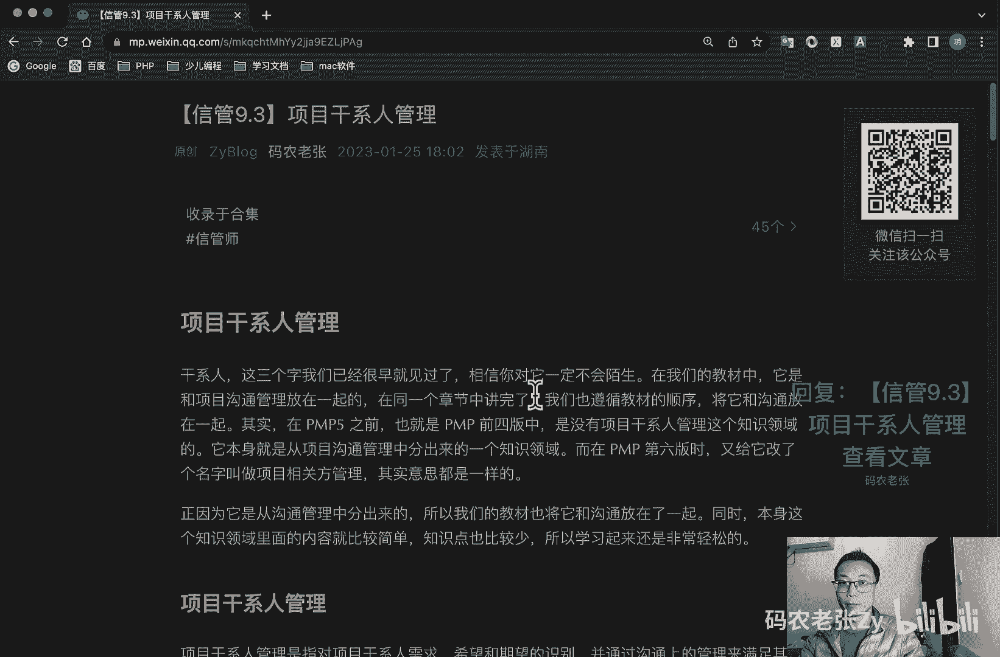

# 【信管9.3】项目干系人管理 - P1 - 码农老张Zy - BV1xg4y1E7UE

哈喽大家好，今天呢我们来学习的是信息系统项目管理师，第九大篇章的第三篇文章，项目干系人管理啊，干系人这三个字啊，我们很早就已经见过了，相信你对他一定不会陌生啊，在我们的教材中。

他是和项目沟通管理放在一起的，在同一个章节里面就讲完了，我们呢也就遵循教材的顺序，把它和沟通放在一起，其实啊在pmp 5之前呢，也就是pm p的前四本当中呢，是没有项目干系人管理这个知识领域的。

它本身就是从项目沟通管理中分出来的，一个知识领域，而在pmp第六版的时候，又给他改了个名字，叫做项目相关方管理，其实意思都是一样的，正因为它是从沟通管理中分出来的。

所以我们的教材也将它和沟通管理放在了一起，同时呢本身这个知识领域的内容呢就比较简单，知识点呢也比较少，所以学起来还是非常轻松的好，我们先来看一下项目干系人管理呃。

项目干系人管理呢是指对项目干系人的需求啊，希望和期望的识别，并通过沟通上的管理呢来满足其需要，解决其问题的一个过程，项目干系人管理呢将会赢得额更多人的支持，然后呢从而能够确保项目取得成功。

像像呃项目干系人管理呢可以带来一些好处啊，第一个就是将会赢得更多的资源对吧，你管理和干系人，第二个呢就是快速频繁的沟通呢，能够确保对干系人的需要呃，然后希望和期望的一个完全的一个理解对吧。

也是要要把需求搞清楚，对不对，第三个呢就是能够预测项目，干系人对项目的一个影响，尽早进行沟通和制定相应的一个行动计划，以免受到项目干系人一个干扰对吧，干系人也不一定全是支持你的，对不对。

他肯定也有反对你的好，这个也就是我们可以去管理它的一个重要，重点的三个方面好，我们看一下项目干系人管理过程，然后它有四个，它站在四个过程中里面都有一些呃，管理过程好，第一个呢就是在启动过程中。

他有个识别干系人，识别该性能，就是识别所有受项目影响的人员和组织，并记录其利益参与情况，和对项目成功的一个影响的过程，第二个呢在规划过程组里面，然后有规划干系人管理啊，这个名字都差不多对吧。

规划里面就是规划干系人，然后基于干系人潜在影响的分析，制定管理策略，调动干系人参与，第三个呢就是执行过程组的，执行的就是管理层对吧，管理干系人，提升干系人的支持，把干系人的抵制呢降到最低。

然后提高项目成功的一个机会，最后呢就是监控过程组，它其实就是控制干系人参与对吧，他呢就是维持并提升干系人，参与活动的一个效率和效果好，那就一个一个来看啊，第一个识别干系人。

识别能影响项目决策活动或结果的个人，群体或组织啊，干系人不一定是一个人啊，他有可能是群体，也有可能是组织以及被项目决策活动，或者是结果影响的个人群体或组织，并分析和记录他们相关信息的一个过程。

这些信息呢包括他们的利益参与度，互相依赖，影响力以及对项目成功的一个潜在影响对吧，看起来还是挺重要的，好了，那么干系人都包括哪些人呢，正常来说，只要是和项目有任何利益相关的人，都是项目干系人。

最经典的问题就是你是做装修施工的，或者说你是一个盖楼房的对吧，那么影响了周边的邻居，那么这些邻居呢他是不是干系人，那肯定是对吧，而且是利益受损的干性人，同样他们也是需要你来管理的，不过对于新系统来说呢。

干系人的范围可能就不会那么大了，主要包括什么呢，项目团队成员啊，社会人员以及其他比较重要的就是前四项，另外需要注意的就是客户与用户的区别，这个我们之前应该也提到过一嘴啊，就是客户是买产品的人。

但他不一定用产品，而用户呢是真正使用产品的人，有的时候呢客户和用户可能是同一个人，但有时候他也不一定是同一个人，比如说我们的cr m系统是由甲方的采购部门，采购的，由甲方的技术部门评估审核的。

但是真正使用系统的呢是一线的销售业务人员，对吧，而用户呢则是销售业务部门，这就是客户和用户的一个区别，ok明白了吗，就是客户和用户他不一定是一个人啊，特别做做外包的时候非常明显，做外包的时候非常明显。

有可能你做不做你接的一些外包项目，比如说你做一个商城，对不对，你是给某个公司做外包的，对不对，你你的客户是这个公司甲方对吧，但是你的用户是谁呢，是商家和真正的一些买东西的那些人，对不对。

你的客户和用户真的是分开的好，那么在这个过程中呢，我们会输出一个干系人登记册，其实呢就是标明这个干系人的一个基础信息，并让他们进行基础简单的一个分类，一边制定管理策略，一般包括基本信息啊。

这些包括什么呢，姓名啊，职位啊，联系方式等等，然后一些评估信息，评估信息主要就是感谢人的需求啊，期望啊，潜在影响力等等，还有干系人的一个分类，就是把它分为关键干系人，非关键干系人，内部干系人。

外部干系人，支持者或者中立者或者反对者啊等等，很明显啊，就是这个关键关系，然后是我们需要重点管理一个对象，因为他们对项目的成功和失败，有着非常重要的影响，也因此呢他们会被称为关键关系人对吧。

评估关键干系人呢，对不同情况能做出的反应及应对，以便策划如何对他们施加影响，提高他们的支持，减轻他们潜在的负面影响是非常重要的一点，为了完成一个这样的干系人登记手册呢，就需要运用一个非常重要的技术工具。

那就是干系人分析这个工具啊，主要是用于识别干系人的利益期望和影响的，一般会用到四种模型好，第一个模型呢就是权力和利益方面，它其实就是两个坐标，一个就是两个那个什么，两个也就是一个坐标系啊。

就两个象限对吧，就这样两条线，一个呢就是权利，一个就是利益，对不对，根据干系人的职位大小呢，和对项目结果的关注和利益程度来进行分类，这个呢我们后面还会再详细的说。

然后第二个呢就是权力和影响方格也是一样的，两条线他只是把一条线换成了，就是把一条线那个利益换成了一个影响了，然后干系人的职权大小，以及主动参与影响项目的一个程度，去进行分类了。

第三个呢就是影响和作用风格还是一样的，还是这样的两个这样的格子，然后呢他会去呃，他就是把那个两个坐标就换成影响和作用了，以及改变项目计划或者执行的能力，进行一个分类了，好最后那个叫凸显模型。

根据相干性人的权利，施加自己意愿的能力，紧迫程度和合法性，对感性人进行分类好，这四个名词呢你要记住他们大概干什么的，你要记住其中比较重点的是什么呢，比较重点的就是这个权利与利益方格好。

权利与利益方格看到没有，就是这样一个只剩下那三个，剩下那三个其实也剩下那几个，其实都是这个形式的，只是它的这个它的这个这两个坐标，可能会有点不一样对吧，权力影响对吧，还有什么影响作用了。

然后就换成凸显模型了，但是呢最重要的是这个权利和利益方格，为什么说它重要呢，你看它分了四个象限，对不对，然后我们权利是从低到高的，然后利益是去也是从低到高的，然后你可以看到就是我如果说一个人。

比如说这中间的点就代表不同的人对吧，这个bh和f他们的权利非常高，同时呢他们的利益相关性也非常高，那么这些人就很重要，对不对，他们有可能是哪些人呢，比如说呃跟项目有关的投资人啊，老板啊什么这些人。

对不对，对于这些人呢，这些干系人呢我们是需要去什么重点管理的，重点管理的对吧，你要满足他们的期望啊什么的，各个方面的，对不对，你需要重点管理的，然后第二个呢你可以看一下，第二个我们看一下权力大。

利益小的，权力大利益小的，比如说在这个范围里面，这个a这个人他是一个权力大，但是利益比较小的人，一般呢就是高层管理人员啊，或者是什么乙方的领导啊，他们有权利，但是呢可能并不直接参与你的项目。

对他们来说呢，因为他你的项目对他们来说没有什么利益，对不对，因此呢为了项目的顺利进行，只需要让他们什么满意就可以了，不要去扯他们后腿啊，不要去发生什么怪了吧唧的事啊，对吧，让他们满意就可以了。

好第三个就是权利小，利益大是吧，权力小的，权力低的，然后利益比较高的是哪里呢，是这个里面的对吧，就是c和e这两个人对吧，c和e这两个人呢，他们呢一般就是什么小投资方案，或者是受项目影响的人啊。

比如说施工周边的邻居等等啊，还有什么乙方团队成员等等，对他们的呀，对他们怎么样呢，要随时告知现在的一个项目的一个情况，就可以了，随时告知现在项目的一个情况，因为他们牵扯的利益很高，对不对。

他们有很大的一个利属性好最后一个是什么呢，最后一个就是权力比较小，然后它的利益相关性呢也比较小，这些人呢比如说什么行政人事部门啊，或者是临时雇佣的什么打杂的一些人啊，对吧，比如说这个g和d啊。

他们就是在这个象限里面，对于这些人呢，我们就监督一下，就花最小的精力进行简单的一个监督就可以了，好了，也不用花太多的精力好，这个权利和利益方格是今天的重点之一啊，重点之一，这几个地方你们要搞清楚好。

接下来呢我们就看第二个过程了，刚刚这个就是识别干系人里面的内容了，我们看第二个过程就是规划干系人管理，基于干系人的需求，利益及对项目成功的潜在影响的分析呢，制定合适的管理策略，有有效调动干系人参与。

整个项目生命周期的过程呢，它就是一个反复的过程，干性的状态呢也是不断的在变化的，所以说这个过程呢应该由项目经理来定期开展，就股就规规划跟现任管理，其实呢把握住上面概念的核心呢，就是规划干系人管理。

这个过程呢，就是根据干系人登记手册当中的信息，根据他们的影响情况来制定相应的策略，在这个过程中呢，我们同样关心的是这个过程中的一个重要，工具与技术，那就是分析技术，在这个基础中呢有个非常重要的内容呢。

就是干系人参与度评估矩阵，他将干系人当就是当前的参与，当前参与项目的水平呢，与我们期望他应该参与的项目水平进行比较，从而用于对干系人呢来进行一个分类，好这个分类啊，我们先看一下这个分类是怎么分啊。

就是干系人的参与水平呢可以分为几种啊，第一个就是不知晓，就不知道项目以及其潜在的影响，就你做的这个项目我根本不知道对吧，这个就是不知晓，第二个呢就是抵制，知道项目集体潜能的影响。

但抵制项目工作和或成果可能引发的任何变更，此类干性人呢不会支持项目的工作或者成果，周边邻居对吧，扰民了对不对，那周边邻居肯定要来抵制，你好，第三个就是中立了解项目，但是既不支持也不反对啊，我了解项目。

我天天上班，从这里过，我知道这里在盖楼房，但是呢我跟他关系不太大啊，我我知道他我不支持，我也不反对，跟我没什么太大关系吗，我是中立的好，第四个那就是支持的了解项目及其潜在的影响。

并且会支持项目工作积极成果啊，啊这参与项目的对吧，大部分肯定都会支持的好，最后就是领导，领导呢就是了解项目经济潜在影响，而且积极的参与，确保项目取得成功的项目经理就不用说了，对不对好啊。

我这里还是举的这个例子，还是举的这个例子，大家可以仔细来看一下，比如说我们还是拿盖楼装修来说，团队成员，那肯定是支持者，另外如果你是公益项目，政府机关，就是你做的是公益项目，政府机关肯定也是。

你也会是你的支持者的，这个和利益的相关性很大，然后呢投资人项目经理，发起人啊，主管都是领导，这个不需要多解释了，周边居民啊，怕噪音或者污染的就肯定抵制者了对吧，我刚才已经说了，而隔了两三条街的邻居啊。

可能会了解到这个项目，但对他们的生活暂时没有影响，所以他们是中立的，最后呢我说了，我也我就是一个上班路过的，对不对，虽然项目施工可能带来堵车这些问题，但是我完全不知道是为什么，就是不知晓，没错。

我也是干系人，我前面说我是中立的，对不对，但是我可能是啊，偶尔一次我可能出差，我经过这个地方，我根本就不知道这是干嘛，为什么堵车了，对不对，可能就是我我我我就是以为我就是以为，可能就是普通的道路堵车了。

但其实可能是因为像周边的项目施工所带来的，堵车等问题哈，但是我还是不知晓的，对不对，但是如果我天天上班的，我天天都走这条路的话，那么我可能会是一个中立状态的，也有可能会是一个抵制状态的。

你影响我上班了对吧好吧，这个都说说不好的，ok然后呢我们就要看这个干系人这个举证啊，就在这个途中呢，就是比如说我们需要我们需要这个干系人一，它是在一个什么位置呢，在一个支持的位置上。

但是呢现在它是在一个不知晓的位置上，那么我们就要努力让他去达到这个位置，这个c呢就是代表他现在所在的一个位置，他现在的一个情况，就干系人现在的一个情况，他就是一个不知晓的情况。

然后我们希望它是达到一个支撑的情况，这个就是用d来表示的，用d来表示的，所以说再比如说你看这个干系人三，那么这个d和c在一起的，这个就是这个干系人就是比较就是怎么说呢，就是笔记。

而我就是呃我们管理的比较好的一个干系人，那么这个干系人一和干系人二，他们现在的一个状态啊，他们现在一个状态都还没有达到，我们所需所所要，我们想要他所达到的一个状态，就是让他们达到一个支持的状态。

好就是这个c啊，注意啊，这个c一定要记住，这个c是他当前的状态，这个d呢是我们期望他的状态啊，这个图也是今天比较重要的，但是小心好吧，小心一个就可以了，好这个呢仔细的大家再仔细的来看一下，好。

我们再来看第三个过程了，第三个过程组，管理干系人在整个项目申请周期中，与干系人进行沟通和协作，以满足他的需求与期望，解决实际出现的问题，并促进干系人合理参与项目活动的过程，此过程的作用就是帮助项目经理。

提升来自干县人的支持，并把干县人的抵制降到最低，从而显著提高项目成功的机会，管理干系人的参与呢包括以下活动啊，调动干系人适时参与项目，已获得或确认他们对项目成功的持续承诺，第二个呢就是通过协商和沟通。

管理干系人的期望，确保项目目标实现，第三个呢处理尚未成为问题的干系人关注点，预测干系人未来可能提出的问题，需要尽早识别和讨论这些关注点，以便评估相关的项目风险，最后呢就是澄清和解决已经识别出的问题。

在管理干系人参与过程中，需要注意特别注意两个原则，一个就是对客户有利的原则，另一个就是平衡各方利益的原则啊，这个稍微记一下就可以了，好最后一个过程了，就是控制感性人参与，一句话。

全面监督项目干系人之间的关系，调整策略和计划，以调动干系人参与的过程等，过程的作用呢是随着项目和环境的变化，维持并提升该系人参与活动的效率和效果，好了，就这么一句，非常简单，没什么特别的内容。

ok总结一下今天的内容呢，呃就是项目管干性管理的内容呢，就是这么多对吧，很轻松，重点呢就是在于权利，利益方格和该学员参与的那个五个等级，不知晓啊，什么抵制啊，那个那五个对吧，当然了。

每个过程的概念内容你也需要了解，同样的就是简答和论文都是以这些过程为主的，所以这个这四个过程呢你还是需要去了解的，ok今天的内容呢就是这些，大家可以回复文章的标题，信管9。3项目干系人管理的。

或者这篇文章的具体内容以及相关的一些内容，就是这些内容我没有详细的，就是完全按照文章去说，然后大家也可以仔细的再过来再看一下好了，今天的内容呢就是这些。

