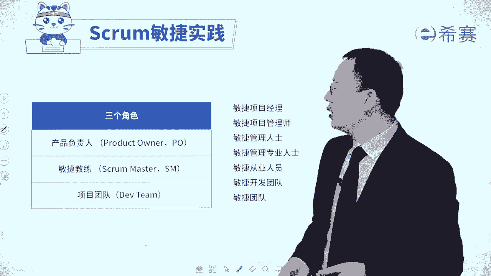
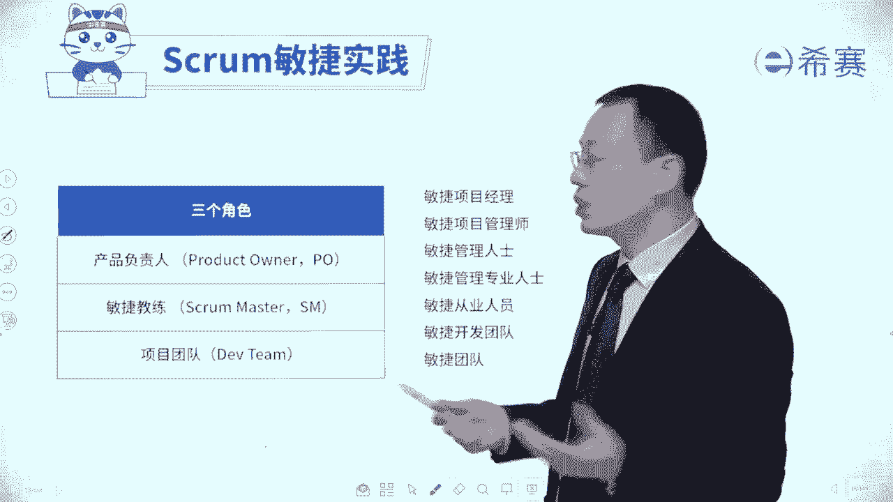
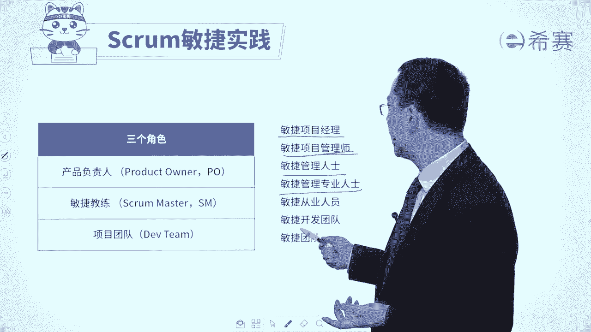

# 【免费分享】PMP项目管理认证考试第七版全套完整系统精讲课 - P105：25产品负责人ProductOwner - PMP课堂 - BV1EqYWerEjx

大家好，接下来我们一起来分享的是敏捷s实践中的三个角色。那这三个角色呢都很重要，考试也考的比较多。所以我们三个角色会分开来讲，首先看到是第一个角色叫产品负责人，叫product owner。

当然第二个角色呢叫敏捷教练scr master。第三个角色是项目的开发团队或叫敏捷开发团队，有的时候呢可能会叫cracr team，有的时候呢可能会叫develop team啊，都说的是这个开发团队啊。

那其实我们在整个考试过程中，你可能会遇到一些陌生的名词，比方说可能叫敏捷项目经理呀，敏捷项目管理专业专业人士啊，敏捷项目管理师啊，敏捷管理专家呀，敏捷项目管理人士啊等等这些东西。

你都可以把它理解为到这一个敏捷教练，还有敏捷的从业人员呢，那就是这些都是敏捷的开发团队呀，是这个敏捷团队呢，有的时候你可以把它理解为说是这个develop team。

有的时候米尼团队如果往大来说，有的时候也会把它包含着这个。所以你要看它的这个意图里面是把这些个PO包含进来，还是呃和敏捷教点包含进来，还是不包含进来。但一般情形下，我们其实不把它包含进来。😊。

因为产品负责人他不只是在做这个项目上的事情，他更多的是去提一些需求呀，然后定一些这种完整定义呀，以及包括说去做验收啊，做这些事情为主。但他可以还做别的一些事情。那敏捷教练呢更多是去给团敏捷做一些支撑。

而具体开发工作是团队自己来完成。好，我们一起来看一下啊。首先看到第一个角色叫产品负责人product owner呢这个角色。有的时候呢考试也经常会把它缩写成PO。那产品负责人这个角色呀。

他有几个重要的事情。这里面给大家体验了三个关键词，一个关键词叫代言人，他是谁的代言人呢？他是客户的代言人，他不是客户，他是你们自己团队内部的，但他是能够代表客户的客户说哪些需求要加进来，他加进来。

客户说哪些需求更重要，他就把他优先级抬高。客户觉得说那个什么样才算是验收通过，那么他就是对应的说那个什么叫验收通过，所以他是一个客户的代言人，他能够去替客户说话的。当然呢，如果说客户自己本身在。

那么就是他就可以直接让客户来说话。如果客户不在，他就去代表客户，这是第一个第二个词呢叫掌舵者，掌舵者，也就是我们整个这一个敏捷团队要做什么东西，或者说是这一轮迭代，我们要做什么东西，都是由他来说了算。

第三个呢叫验收者，就是这一轮迭代做完的结果到底是验收通过还是不通过呢？也是由他来说了算。我们来看一下仔细的类内容。😊，啊，首先第一条。产品负责人PO他要去负责指导产品的开发方向，也就是接下来重点是什么。

其次才是什么？然后再是什么？那么这个整体的这个思路方向节奏由谁来去把控呢？由PO来去把控。第二个，那产品负责人呢，它是根据商业价值来对任务进行排序，什么叫对任务进行排序呢？我们开始简单过了一眼，对吧？

说有一个词呢叫那个product backlog叫产品的代办事项列表，那那个产品代办事项列表，你可以把它简单理解为是一个需求池，需求池里面有那么多需求，到底哪一些重要，哪些不重要，谁来去定呢？

由PO来定，它怎么定的呢？它根据这些东西的商业价值来定哪些东西极其有价值优先放在前面一些，然后在后这样的一种方式来去放。😊，产品负责人他会跟团队来去开展一些日常的合作，提供一些产品反馈。

那么这个提供产品反馈，包括说日常的时候可以给反馈，以及在验收的时候可以给反馈。为开发东西设定方向，以及为开发下一个功能来设定方向。也就是说本轮迭代要做什么东西。他说了算。

我们在这一轮迭代快要结束的时候说啊，下一轮我们重点要做什么东西，也是由他来去提出。他是代表客户的。好，第三个就是产品负责人他可以可会跟各路神仙来合作，来去定义产品开发的方向。所以其实有些时候呢。

并不是说他自己他说什么就是什么，他也会需要去借助一些外力。他能够去跟客户啊，跟相关方呢以及跟团队一前来讨论交流，来去确定这个方向。而整个在敏捷过程中，他们讨论了以后，确定要做什么事情以后呢。

他会负责来去创建。😊，代办列表OK创建整个产品代办事项列表以及迭代代班列表这些东西。但然他不是自己一个人做。他一般来讲是跟团队一起来做，就跟团队来去共同创建这一个代办列表。

那代办列表中就列出了我们要做什么东西，步做什么东西，累些放在前面累些放在后面，就是按照价值来排序，怎么样做才能够交付更多的价值。并且呢他还会列出来这些个要做的东西，也就是我们所谓的这样一个需求。

需求池里面的这样一些需求。这些用户故事，他怎么样做才能够达到标准呢，这个标准也是由他和团队一起来共同定义。所以是他来负责确定产品的功能和要求，他的这标准。😊，还有就是什么东西要加进来，什么东西要减出去。

什么东西要优先往前面排，什么东西要往后面沉这些东西也是由他说了算。所以他PO他来去维护这个产品代办列表，他的话语权比较重，他来去指定一下我们要做东西要交付的内容，以及他能去接受这个结果或者拒绝这个结果。

所以就是验收。所以你会发现他是能够去代表客户来去确定哪些东西要做哪些东西不做，他能够去对整个内容来去进行把关，本轮以及下一轮他是做一个掌舵者，以及他就是要对结果来进行验收，接受或者拒绝验收。

那么什么样的人才能够去做这1个PO呢？呃，我们来去简单认识一下，一般来讲，他的要求是首先他应该是要具备相关的这些工作背景，他能够去懂得这些专业知识，行业知识，这是基础。其次呢他应该是能够比较强。

对很多东西有一些商业的嗅觉，商业的敏觉。就是不仅仅只是说要去做哪些事情，他还知道哪些事情更重要价值。😊，更大。这样的话他才能够去冲当这个事情。当然呢有的时候呢，他并不是所有的东西都亲力亲为。

他也可以去借助别人的帮助。比方说他可以去找一些专业的架构师啊，呃找一些专业的这一些产品经理啊，或者是找一些专门的这样一些专家来去支撑啊，都是可以的那你可以看到。😊，他来去对接客户来去获取客户的需求。

同时他要做客户的代言人，说哪些东西放在这里，哪些放在这里这里这里这里啊按顺序来排。他来去负责去创建这个产品代办事项列表以及跟团队成员一起来去创建这个迭代列表来去定下的哪哪些要做。还有就是这些要做的东西。

他的那个验收的标准准则是什么，也是他来说了算。最后我们在做一个迭代评审会议的时候，团队完成的东西，哪一些可以通过验收，哪一些不行，也是由他来去负责，来说了算。那呃对于考试呢，有这样一些点。

你需要了解一下。首先第一个他要去对接发起人来去收集需求，搞定发起人。😊，那如果说是在题干中会涉及到有客户发钱提了一些新的需求功能的呢？由谁来对接呢？应该是由产品负责人PO他来负责进行对接。好，第二个呢。

他的职责应该是聚焦于产品本身。如果说他的职责是说啊这个功能该怎么做呀，就是那种细节具体的。那么这个其实是有问题的。因为永远都要有人对整体内容来进行把关，有人负责去做一些微观的具体的细节的事情。

而PO他就是那个对整个大内容来进行把关的。所以他是对整个东西来进行掌舵，而不要去聚焦于某一个细节的内容。那但凡是涉及到说他没有关注在了一个产品本身上面，而是在关注一些其他的事情上面的时候呢，那敏捷教练。

就需要去给他做一个题醒，然后把它给掰正回来，是这样的一个逻辑。好，如还有就是他要去创建产品代办事项列表，他可以是自己来创建，也可是借助团队的力量跟团队一起来共同创建。这是他要做的事情。

并且他对于产品代办事项列表中的这些个内容会来进行排序，他排序的资格比C都大，他的那个排序的资格是最大的，高于团队成员以及高于一些主题专家。当然他是基于什么排序的呢？它是基于商业价值来对这些任务。

对这些用户故事，对这些需求进行排序的。所以如果说题干涉及到关于对于需求的优先级排序啊、高低呀，谁来做呢？由PO来去负责。好，还有就是他会去根据一些具体情况，说要去加薪的需求进来，捋清楚一些需求。

对需求进行变更进行排序，这都是由PO来说来算啊，最后还有一条就是他要去参与到整个项目，以及对于已经完成这个部分是由他来进行确认的，是由PO来进行确认，所以谁才有资格说这个东西是做好了做完成的呢？

PO啊有产品负制人 owner这个角色他才有资格，所以如果题干中有出现说啊谁说是那个什么标准不合格呀，不接受呀啊验收有问题什么之类的。

那么理论上来应该是PO和团队一起来去定这个完成的定义叫defin ofD并且呢最后的验收是谁来负责验收呢？如果说客户在当客户验收。如果客户不在就是由PO来去负责验收啊。

所以整个关于产品负制人 owner这个角色他有三个关键词你记住了吗？一个是代言人，他是客户的。😊，代言人，他来去收集客户的需求，对接客户，然后去把那些客户的东西放进来啊。第二个呢，他是掌舵者。

他来确定要做什么东西。整个产品代办事项列表中有什么东西啊，按照什么优先级来进行排序。这一轮迭代，我们要做什么？下一轮迭代又要做什么是掌舵者。第三个他是一个验收者。

这是对于最后做完的结果来进行验收是谁说了算呢？如果有客户在就客户说了算。如果客户不在呢？那就由PO来说了算。好，我们看了这么多以后，接下来我们来去做一些关于PO的题目。

通过题目来去帮你巩固一下关于PO的这个知识点。😊。