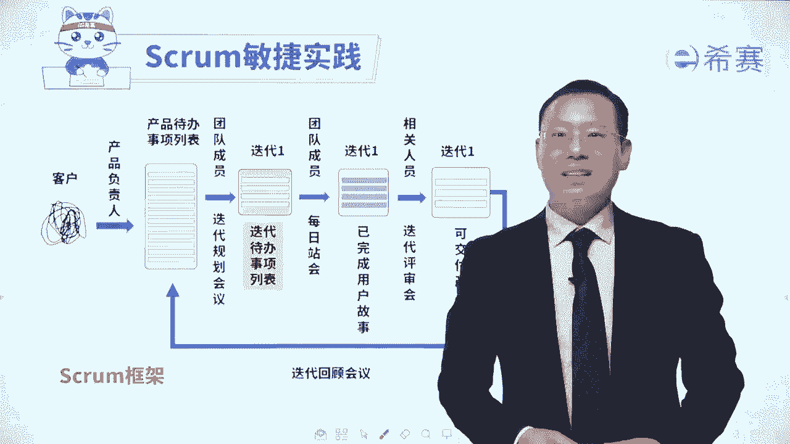
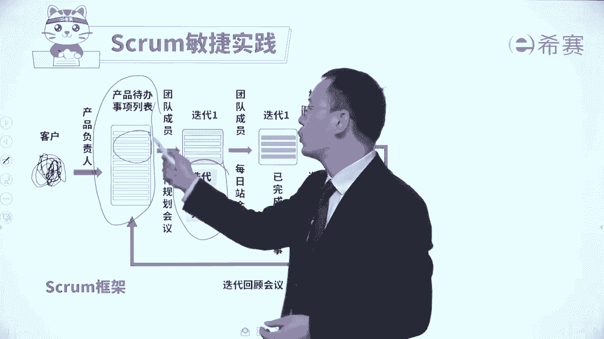

# 【免费分享】PMP项目管理认证考试第七版全套完整系统精讲课 - P113：33迭代待办事项列表SprintBacklog - PMP课堂 - BV1EqYWerEjx

大家好，接下来我们一起来继续分享的是scrrum敏捷实践中三个工建里面的第二个叫迭代代办事项列表。那迭代代办事项列表，你通过这张图大概能够看出来，我们是会把整个产品代办事项列表长长的这么一些内容。

会拎出最顶上那些还没有做的一部分拎过来，作为这一轮迭代所要做的事情。它会是通过这个迭代规划会议来产生迭代代办列表。那本轮迭代呢就是要去完成这个迭代代办事项列表中的这样一些具体内容。我们来具体看一下。

首先，整个迭代代办事项列表叫sprint backlog。那它呢是定义了这一轮迭代的这个基本目标，能够去明确我们在这一轮迭代中具体要做的哪些任务，哪一些事情。并且做完以后的这个表格呢。

应该放在一个大家都可以看到地方，还记得吗？我们在前面讲过一个叫透明沟通。它应该是放在一个共同可以看到的地方，就类似于一个看板的这个样子。并且呢在这一轮中要做的这些任务不是分配下去。

而是团队成员自己来讨论，自己来挑选是自组织自管理，是自我决策的这个过程。每一个任务呢，我们每一天都会要去更新它的这一个剩余工作量，也就是迭代然进图。然进图。你前面也看过了啊。

我们整个这个迭代代办事项列表，它是在迭代规划会议中产生出来的。所以是迭代规划会议会产生迭代代办列表。这个列表呢，它作为团队的一个资产，是我们要去完成的事情，是我们要去做的。

事情便做完以后就会产生有价值的结果，是眼前马上就可以产生结果的东西。我们可以去增加内容，可以去删除内容。但是一般情况下不会增加，也不会删除。所以是通常情形下，我们一般是不做任何改变的。

一旦这个迭代开始了以后就不会做改变。但是如果有一些特殊情况，比方说某一些些的这一些任务已经发现无价值无意义，已经过时。那这个时候呢，我们也可以去删除。但是正常情况下不会轻易去删除。

如果你只是说某一个需求或者某一个任务，它的重要性没那么大了，你不能就此而删除它，除非它是没有价值没有意义。好，如果说团队同意的话呢，他说有一些事情可以是先做整体的估算，然后在迭代开始以后。

在这个过程中来去做分解，分解成小的事情，小的任务来去做估算。那整个关于迭代待班时间列表，这里也给大家列了这样的5个要点，对于解题会有帮助。首先你得要去知道一下整个迭代它那个价值是什么？

就是来定义本轮迭代的这个目标是什么，来去明确本轮迭代的这个具体的任务，以及团队自行讨论这些任务自行认领这些任务。😊，第二个呢，在迭代的过程中，它要它的本质其实就是要完成的工作项。

第三个迭代代班事项列表一般是在迭代规划会议上面来去创建的。第四个呢是迭代过程中，这些迭代事项一般是不会轻易的发生改变。我们一般是优先把这个迭代的那个事项中的内容先去完成。

也就是为了专注的去先完成这个迭代中的任务。但是如果有一些特殊情形，比方说某一些故事已经显然无效，或者遇到一些特别紧急的情况。如果不如何如何，就会产生很严重的效果，对吧？如果有这种特殊紧急情况。

我们也是可以稍微调整的啊，有这么几个点。那你是不是已经对于这个迭代代班事项列表有更深的认知，迫不及待想要去截几道题呢，那我们就马上开始。😊。

