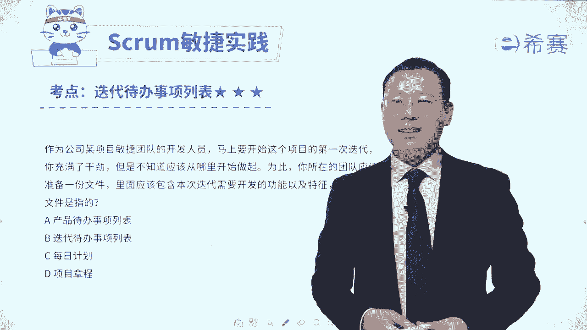
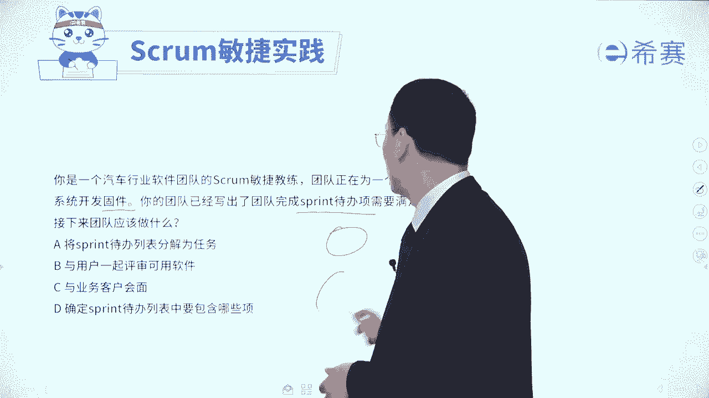
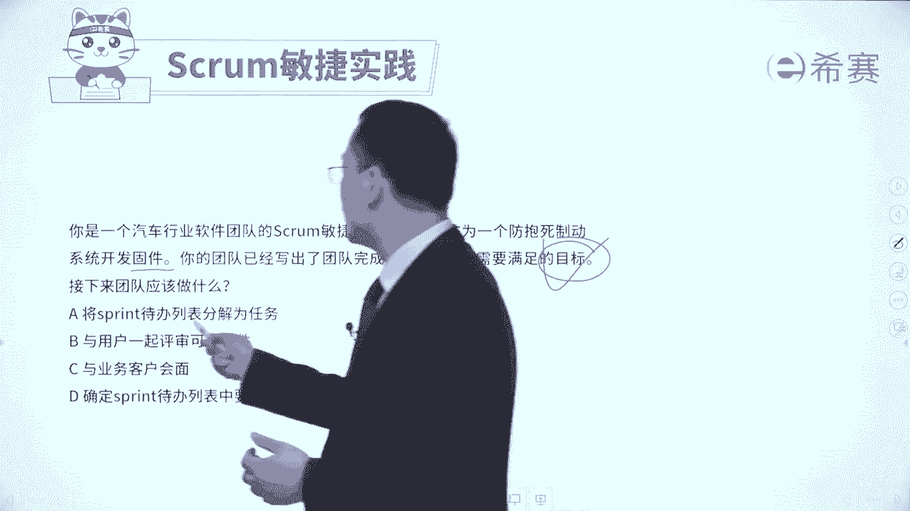

# 【免费分享】PMP项目管理认证考试第七版全套完整系统精讲课 - P114：34迭代待办事项列表习题讲解 - PMP课堂 - BV1EqYWerEjx

大家好，我们接下来呢通过几道题目来对于迭代代班事项列表，它的这个考察方式有一个更加清晰的认识和了解啊，都是一些很有代表性的题目啊。首先我们来看一下这样一道题目，作为公司某项目的这一个敏捷团队的开发人员。

马上要开始这个项目的第一次迭代，你充满了干劲，但是不知道应该从哪里开始做起。为此，你所在的团队应该准备了一份文件，这份文件里面呢是包含了本次迭代所需要开发的功能以及特性。那么这一份文件是什么文件呢？

这是一个概念性的一个说明，对吧？那么这个文件呢，它就是迭代代办事项列表，因为说的是本轮迭代，对不对？😊。

马上就开启这一轮迭代。然后呢，这一轮迭代中所包含的东西，这就是迭代代办事项列表。至于其他几个选项呢，也可以稍微看一下啊，产品代办事项列表是整个我们做这个项目所要需要去做的所有的这些信息内容都包含到里面。

它是一个大的一个需求池。而每日计划呢是计划我今天要干什么，是今天要干什么。项目章程通常是这个还没有开讲这些个具体的发布计划之前提前去拎出来提前列的整个这个项目的一大的愿景呢章程的这些内容。

呃至于说这个题目的这个内容，其实就告诉你每一轮迭代它的目标是什么，然后先定好目标，然后再去定具体的这些任务项，然后定好任务项以后呢，再去做拆解，然后呢，团队再去讨论。那这就是迭代代办事项列表中的内容。

好，我们再来看一个题目。你是一个汽车行业软件团队的敏捷教练。😊。

团队正在进行一个防爆式制动系统的这样一个开发固件。你的团队已经写了一个团队完成的spring迭代代办事项需要满足的这一个目标。那么接下来应该怎么办啊？这里可能有几个陌生名词稍微解释一下啊。

这里有个词叫固件，你可能不知道固件是什么，但你可能听过一个词叫软件，对吧？软件软件其实也就是说我们要去通过电脑的方式，通过程序的方式来去开发了一些这种能够运行的。

在电脑上面呢在手机上面呢在移动终端上面可以去运行的这个东西叫软件，那固件呢你可以把它理解为就说是啊像一个轮胎一个方向盘一个那个刹车这些东西是一个实体的东西，O好，你要去开发这个固件的时候。

你的团队已经是已经写出了要完成这个代办事项，要满足一个目标，先给出说我们这一轮迭代要干什么事情，对吧？大目标，那么接下来呢就列出具体要做哪些项，对不对？然后再来去说这一项该怎么样去分解成任务。

它有个先和后就是先有目标，然后再有哪些项，😊。

后呢再去分解是任务，然后大家再认领任务，一般是这样一个逻辑。我们来看一下四个选项。😊。

A选项将迭代代办列表分解为任务。那首首先呢要有列表啊，你要把那些要做哪些项给放进来，然后才会形成列表。形成列表以后再去做分解。😊。

所以这是下下步的事情。好，第二个与用户一起去评估可用的软件啊，这个评估这是到了验收的时候，到了验收的时候，这还早的很呢，这还没开始呢。第三个与业务客户来去会面。那么与业务客户会面去收集需求吗？

这是更早前的事情啊，第四个确定这轮迭代代办列表中要包含哪些项。所以是先有这个要做的目标，然后再要包含哪些项，那类包含哪些项列出来以后呢，再去把这些东西再分解成任务，分解成任务以后，大再去认领任务。

应该是这样的一个流程，所以这道题目的答案呢是选最后一个选项，也就是整个迭代代办列表中，它的本质是要完成的工作项。😊。

先有目标，再有工作项，再去分解成任务，然后任务呢再去按人去认领。那这些信息都会列到这个迭代代办列表中来。好，我们再来看一道题目。一个scr团队的产品负责人发现利益相关者优先级有变化。

他们还没有开始开发的一个可交付产品。现在呢比目前他们正在开发的一个工作更加的重要。那么团队处理这种情况的时候呢，最佳方法是什么？这个题目其实很容易选错，容易错在哪里呢？就是但你一看就啊那个东西更重要。

我是不是优先做那个东西啊，其实并没有哦，我们在敏捷中会有一个词叫专注专注做这一轮迭代原计划的事情，除非有一种很紧急的情况，或者是原有的事情已经不重要了，才另当别论。所以他只要还是重要的。

我们依然要把它去完成。😊，来看一下四个选项，选项A完成当前的这一轮迭代，并且呢在下一轮的迭代计划中来去调整这个计划，这个肯定是可行的啊，肯定是可行的。好，第二个，通过限制在制品来减少瓶颈。

好像说了什么东西，好像又没有说什么东西，它跟这个题目无关。第3个，立即取消当前的迭代，并且呢创建一个新的计划来反映这个新的优先级。请注意，我们在什么情形下才会去取消呢。😊，一定是这个东西已经证明无效了。

或者是新的东西格外的紧急和重要才会有。所以这种情况它是有有前提条件的啊，不会直接去做。所以呢这个地方是不合适的，在本题中是不合适。好，最后一个开始重构代码以反应更新后的优先级。

这个重构代码跟跟优先级有什么关系，有什么关系。你如果学过重构，你就知道完全无关啊。所以这里只有A选项可以选。那么A选项可以选，他选的原则是什么？就是一般情况下，在迭代的过程中。

我们这个迭代代班列表呢是不会轻易的去改变。一般是优先把这个要做的事情去做完。他如果要改变，一定是有紧急的情况，或者说是现在做的事情已经不重要了。好，我们再来看两个刚好是跟它相关的啊。😊，啊。

某一个迭代呢，他的这一个进行到了一半，产品负责人收到了某某开发运营的这个团队，他的这个邮件email。然后这个开发运营团队负责部署的这个团队构建的软件。他们提醒说有一个新的政策。

他要求要去安装一个脚本来做一个修改。所有的部署中心都必须要包含这一个安装的脚本。那部署呢是召开迭代评审会议的必要条件。所以他重复了三句话来说明这个东西的重要性，并且是必要性，马上要得做好，修改这个脚本。

它会让其他的一些工作项延退到这个迭代之后，那么你应该怎么办呢？啊，产品负责接下来应该怎么做？选项A与团队沟通，在迭代代办列表中增加这个脚本修改的工作，并且呢把最低优先级的工作项移回到产品代办列表中来。

哇，这一看刚好就说的非常完整，对不对？也就是说在这一轮迭代中。😊，我把这个特别重要东西给加进来，同时把里面相对而言优先级最低的那个东西给置换出去，让它又回到了大的这一个整个产品代办事项列表中来。

这不就是完美吗？这就是标准答案啊，所以这就是标准答案。好，第二个，将修改脚本的工作增加到产品代办时间列表中，就是放到这个里面来。而现在是告诉你他又很紧急又很重要。好，第三个，延长他的这个周期。

然后把这个东西涵盖进来。我们一般说是时间和不会轻易的去调整。好，第4个安排与这个团队的经理来去进行一个面对面的会谈，关键是现在你都已经知道他已经提醒你又是政策啊，又是必要条件啊什么之类。

他已经告诉你以后，你应该是要去采取措施的。所以这个题目他就刚好是符合当某一些特别紧急的情况，特别重要的情况发生的时候，我们是可以去把现有的迭代代办列表中，某一些东西先拿出去，然后把这个重要东西给放进来。

这是可以的。😊，当然还有一种情况就是当原有人的故事已经无效了以后，我们也是可以把它拿出去，可以去调整这个迭代代办列表。所以答案是选A选项。我们再来看最后一个题目啊，通过这个题目呢。

就是相当于把刚刚这个内容再做一个完整的补充。😊，敏捷团队在一次迭代的期间，敏捷教练发现正在开发了一项功能已经不需要了，那既然都不需要了，你再去开发，不是浪费了吗？敏捷它也是倡导就是消除浪费啊。

不要有太多浪费。那既然已经不需要了，就应该是要排除，对吧？那么此时敏捷教练应该怎么做呢？你就看一下哪一个是把它给干掉。A选项尽力找出发生这种变化的原因，以便是不再去发生这变化，这有什么用，这有什么用？

第二个，完成这一轮迭代，然后并且是下一轮迭代中，然后去调整优先级。那你既然知道它没有用了，继续把它完成，这就是一种浪费浪费你的时间。好，第三个，建议团队重新去确定冲刺代办列表冲刺这个词。

我们通常是把冲刺和迭代还有sp这三个词可以混着用的啊啊冲刺这个词就是迭代啊，迭代代办列表中的优先顺序，我们建议呢大家重新去确定一下，让团队尽快去开始处理下一个最高优先级的，也就是说目前正在做这一项呢。

我们暂就把它给放下了。😊，这不刚好就是符合嘛，它就是符合那种说单下的这个用户故事已经无效的情况下，我们就要去对它进行调整。😊，好了，这就是关于整个迭代代办事项列表。我们会通过这样几道题目呢。

然后帮你去巩固一下，让你更清楚的去知道哦，原来迭代代办事项列表中的东西它是在什么时候来去敲定的。然后一般情况下我们要优先把它完成。特殊情况下，我们也是可以去做调整的。然后它里面的这些内容呢。

我们是先有目标，然后呢再有具体这些事项，然后再去把它拆解成任务。那关于迭代代办事项列表呢，我们就分享到这里。😊。

