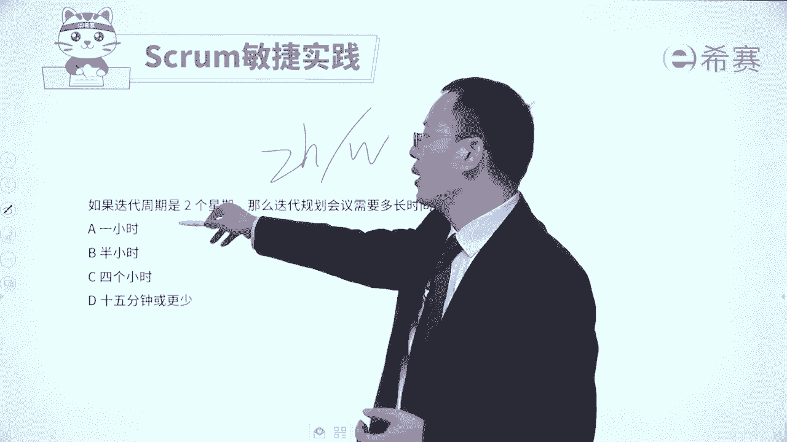
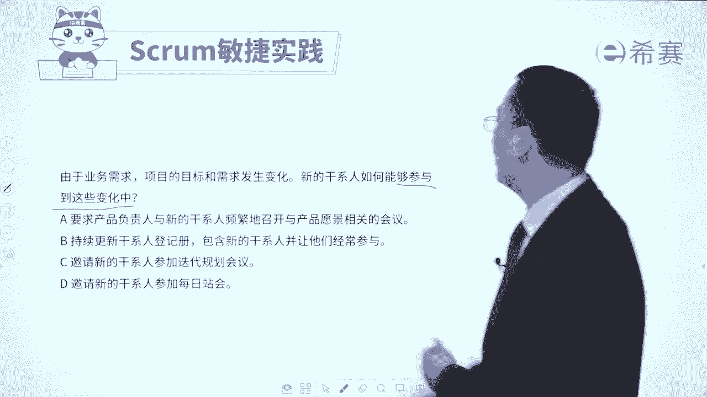

# 【免费分享】PMP项目管理认证考试第七版全套完整系统精讲课 - P118：38迭代规划会议习题讲解 - PMP课堂 - BV1EqYWerEjx

大家好，接下来我们一起来看几道关于那个迭代规划会议的题目，通过这些题目，让我们去反向知道哦，原来迭代规划会议它是这么考的。啊。首先第一个题目，敏捷团队呢在某一个会议上一起讨论并决定了开发用户故事的过程。

使用什么测试方式来对完成的工作进行检验。那么这个决策是在哪个会议上来确定的，请注意他在讨论要做什么东西啊，怎么样去做呀，怎么样去验证，这一定是规划性的东西，那规划性的事情呢，只有这一个叫迭代规划会议。

在迭代规划会议上，我们来去列出这一轮迭代他的目标，他的事项，他的任务该怎么样去做事情，一定是这样的。而至于说每日战会呢是每一天去同步信息，迭代回顾会议呢是来去回顾这一轮迭代做的好的。

做的不好的下一轮怎么改进。而这一个迭代评审会呢，重点是去做一些验收以及做一些反馈。😊。

所以你要知道，原来迭代规划会议上，我们会去讨论关于如何去做这些用户故事，会用什么样的方式来去做这个事情。他的目标是什么，事项是什么都会在这个迭代规划会议上来进行。我们再来看一个题目，敏捷开发模式，强调。

根据环境和客户的需求变化来调整项目的工作事项。那请问敏捷团队在下面的哪一个会议上来确定迭代需要完成的哪一些工作事项。😊，哪一个会议上来去确定智轮迭代要完成哪些工作事项呢，那肯定是计划的会议啊。

规划的会议啊。那么答案就是迭代规划会议。因为你只有在迭代规划会议上才会去明确列出你的目标。你的要完成这些事项，并且去把它去分成任务，去细化这些用户故士得到这个迭代代办列表。😊，一定是这样的。

评审会议是强调是做验收以及做一些反馈，回顾会议去讨论是做的好的做的不好的。下一轮如何去优化和改进。而每日战会更多的是做一些信息的同步，避免一些呃不一致的信息导致冲突矛盾。好，我们再来看一个题目。

如果迭代周期是两个星期，那么迭代规划会议的时间是多长呢？我们说过是每两小时对应的一周。那这里是两个礼拜的话呢，就对应的是4小时，就这么来算的啊，偶尔也有这种题目，但是很少。啊。如果说是4个礼拜的话呢。

对应的就是8小时，就这么来算的。好，我们再来看一个题目。由于业务的需要，项目的目标和需求发生变化。新的干系人如何能够参与到这些变化中来。什么叫如何能参与到这些变化中来呢？

其实也就是他怎么样才能够对这样一些变化有更加深度的认识和了解。😊。

他怎么样才能够了解。那当然就是参加这个迭代规划会议啊。我们来看一下选项A要求产品负责人和新的干系人频繁的继续召开这个产品愿景相关的会议。愿景愿景在什么时候干的？

在很早以前在那个项目还没有开始启动这个迭代的时候，并且呢愿景只能够列出大方向的东西，他并不会给出具体细节的东西。😊。

所以他肯定不合适啊啊，第二个选项持续更新干系人登记册，包含新的干系人，并让他们经常去参与参与什么，他也没有去讲。

是不啊他没有去讲具体参与什么事情来获取这样一些信息。啊，第三个，邀请新的干系人来参与迭代规划会议。因为在迭代规划会议中。PO产品负责人他会去讲整个产品代办事项列表的一些事情，以及这一轮迭代的目标。

然后接下来是我们会重点去做哪一些事项等等。所以呢在这个会议上，他能够去了解下面一个大致的一些情况。好，最后一个邀请新的干系人去参加每日战会。首先第一个他有没有那么多时间，每一天都跑过来参加每日战会。

这是一个很大的挑战，其次呢每日战会更多的是去同步一下我们当下的信息啊，昨天我干什么，今天我要干什么，我干这个事情遇到什么困难和挑战，他不会有那么多全貌的信息，它是一个退而求其次的一个选项了。

所以呢这个题目的答案是选C选项。😊，你就需要去知道，如果他们想要去了解团队情况，了解产品情况，就可以通过参加这个迭代规划会议的方式来去获取来去了解。那整个关于迭代规划会议的这些试题呢，我们就分享到这里。

是不是你对于这样一个迭代规划会议有更深的认识和了解了呢？我们接下来还会再展开另外一个非常重要的就是每日战会。😊。

