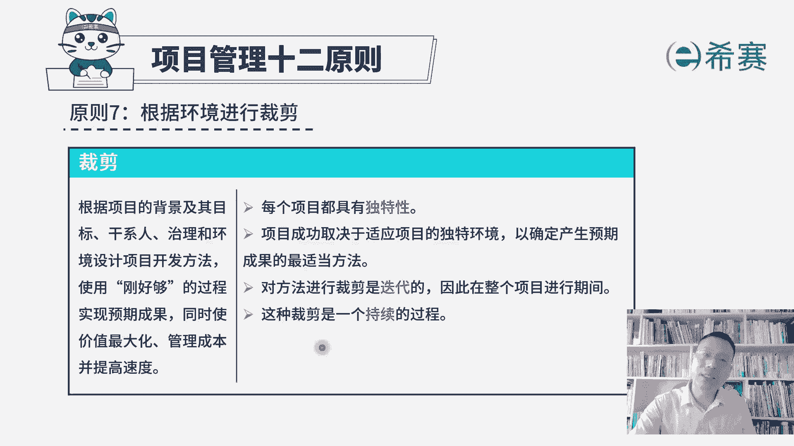
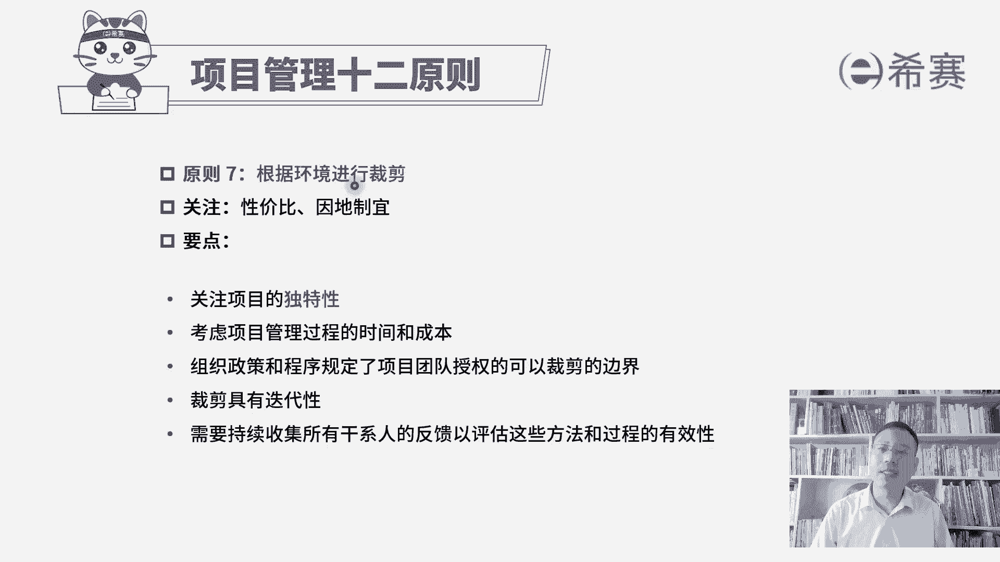

# 【免费分享】PMP项目管理认证考试第七版全套完整系统精讲课 - P51：PMP第七版项目管理原则之07裁剪 - PMP课堂 - BV1EqYWerEjx

接下来我们一起看到的是，项目管理12原则的第七条，叫根据环境进行裁剪，裁剪呢我们前面讲过一个词叫取舍，也就是说我们的这些个五大过程组，十大知识领域，49个过程，那么多的工具和方法。

你其实是并不需要每一个都用得上，你可以根据这个项目的特性，根据这个项目的需要程度来进行取舍，进行裁剪，那我们后面还会学到这样一个SRT，这个敏捷方法，还会学到敏捷的阶段框架模型。

它里面含有大量这样一些个敏捷的实践方法，你也是可以根据需要来进行裁剪的，那我们一起来看一下关于裁剪内容是这样的，根据项目的背景及其目标干系，使用刚好够的过程，以实现预期成果，同时使价值最大化。

管理成本并提高速度，所以这样一个裁剪，它其实是能够用，刚好够用的这样一种方式来做事情，不要去浪费，这其实也是在节省成本，为什么可以去裁剪，是因为每一个项目它都具有独特性，这个项目和那个项目是不相同的。

我们会基于这个项目本身的特性来去裁剪取舍，看要哪些工具，要哪些方法，项目成功取决于适应项目的独特环境，以确定产生预期成果的适当方法，所以不同类型的项目，你用的方式和方法不相同，你用的工具和技术不相同。

你所要展展现的这样一个具体的中间过程，结果和最终的成果可能都会略有差异，我们需要去进行裁剪，对方法进行裁剪是迭代的，什么叫迭代呢，他说的是在整个项目进行期间，你开始想到了一种一个裁剪库。

到后面的过程中的这个情况，可能会发生一些变化和调整，我们需要去根据实际情况来做出相对应的调整，就像比方说你本来是拿了一把扳手，想要去帮忙，结果后来发现那个扳手根本用不上，可能需要拿一个螺丝起子。

那你再搞一个螺丝起子，类似这样一个意思啊，所以我们在整个做项目的过程中，到底会使用什么样的一些方法，使用什么样一些工具，你可能一开始的时候并没有那么清晰和具体，但是你有个大致的框架。

你已经做了一轮的拆解，而在整个过程中，你会持续的来进行裁剪，这是关于项目管理的第七条原则。

根据环境来进行裁剪，所以他其实会用两个词来去总结，很有意思啊，一个词呢叫性价比，就如果说你把所有的工具技术都用上，你把所有这些个方法呀，这些个呃弓箭都做出来，他其实会很耗费资源，很耗费成本。

但是如果我们用裁剪的方式，他就可以用相对比较少的成本，来去完成同样的效果，所以是一种性价比极高的方式，并且呢还有一个词叫因地制宜，这也是我们的助教老师来想出一个很好的词，就是我们要因时制宜，因地制宜。

你这个项目本身它是什么样一个情况，我们就采取什么样的方式来去应对，而不是所有东西都是一股脑一起上，所以这是做裁剪的一个精髓，他关注的是说项目的独特性，并且在整个过程中，是考虑到管理的这个时间和成本。

根据需要来进行裁剪，组织政策和程序，规定了项目授权的这样一个可以裁剪的边界，也就是说你要裁剪的时候，也不是随便你想裁就裁，想舍就舍，有些东西他还是有要求的，我们公司会有公司的这些规则，有这样一个要求。

所以这是公司可能会定好这样一个裁剪的边界，你在这个范围之内来进行适当的裁剪，而产检具有迭代性，需要持续收集所有干系人的反馈，以评估这些方法和过程的有效性，一旦发现这个方法它不起作用。

或这个反馈觉得说是这个过程是不太好的，那我们可能需要进行一些调整，也就是再一次对这个裁剪进行迭代，这就是项目管理师案原则的第七条。

