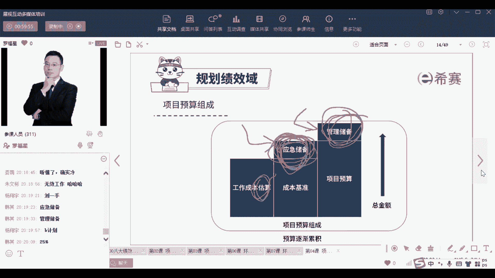
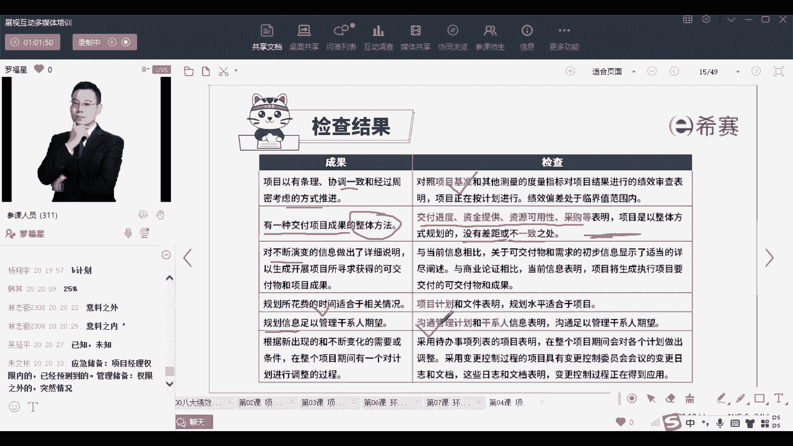

# 【免费分享】PMP项目管理认证考试第七版全套完整系统精讲课 - P68：PMP第七版8大绩效域之04规划绩效域-下 - PMP课堂 - BV1EqYWerEjx

然后呢再来认识一个叫估算，估算呢就包括了估算他的一个时间呐，成本呐，人力资源，人物资源啊，实物资源，那这种估算其实我们先来认识一个点啊，就是任做这些资源估算的时候，他会考虑到什么准准确度，精确度。

区间和信心这几个字嗯，可能如果有同学之前是有学过，但是没有参加考试，你可能会觉得很陌生，可能觉得很陌生，但是我给你稍微捋一下，你可能就觉得啊原来就说了这么回事，他说的是什么呢。

首先第一个我们去做估算的时候呀，越在信息不对称，这是一个时间轴，OK这是一个时间轴线，时间轴线越是在早前的时候，有很多东西不确定的时候，那么他的估算它的内上下浮动会比较大，可能上下浮动。

从负25%到正75%，也就是上下浮动100%，也就是说这个项目大概是一个亿，但是当需求不清晰的时候，你有可能会把它说是1。75个亿，或者也可能有人说是呃0。75个亿啊，也都可以，那么上下浮动很大。

但事实上呢其实是一个亿的项目，所以在前期在早前不清晰的时候，你的这种对于他的这一个范围的估算啊，对于这个成本的估算，可能会这种区间动荡会非常大，随着实践推进，你慢慢的一些信息了解的越来越清楚。

我们说项目有一个特性叫渐进明细对吧，那随着时间推进，项目渐进明细，慢慢的呢你了解的东西越来越清楚，你的估算就越来越准确，越来越准确，最后就越来越靠近中心值，唉这就是所谓的一个区间。

我真的是觉得他妈的写这个书不知道什么，猪脑袋非得要去想这些词汇，用原来内容词汇不行吗，其实就是原来的一个词汇，就是就是说前面是一个，就是这种比较粗放的一个估算的，那个估算到后面的是一个确定性的估算对吧。

一个是前面是一个不太确定的估算，后面是一个确定性的估算，还非得搞了一个新词，你知道是这个逻辑就可以了啊，所以有些同学看了，如果说前面学过了以后，你看他你觉得很陌生，其实我跟你讲清楚以后。

你知道就这么回事好，然后呢再来看到另外一个对，有一些东西真的是让人觉得很讨厌哈，是的，前面是模糊估算，后面是精确估算，你说的很对啊，杨翔宇，然后呢再看到另外一个词，就我们去估算的时候呢。

我们要去估算一些呃进度，那估算进度的时候呀，他其实会讲到进度的估算有这么一些个过程，比方说我们先做一个进度的规划，你做进度规划，你要先要去定义活动，也就是说咱们要做哪些事情啊，ABCD啊，各个事情。

然后呢把这个事情他们自己的顺序给排列一下，哎谁先谁后，在在谁的后面啊，他们有一个先和后的排列，比方说我经常讲的说，你要去指植树，你如果要去植树的话，你先得去刨一个坑，然后你再把小树苗放进去。

然后你再把泥土放进去，然后你再去浇水哎，这里有先和后的顺序，所以我们说了很多个动作以后，要把这些东西他们的先和后给关联起来好，然后再来去估算我要去做这个东西，需要多少时间，需要多少人力，需要多少资源好。

基于这些东西来去做一个进度计划，这就是咱们的进度计划的一个先和后的顺序，当然后面我们再往后面走，你就会发现其实也就是那么回事，也就是也就是在进度管理那一章节，还会再展开来讲好。

然后呢再来看到在进度管理中还会认识两个词，一个叫赶工，一个叫快速跟进，这也是稍微提前来认识一下啊，后面在进度管理中会展开讲的什么意思呢，咱们做事情的时候，如果你发现进度不符合。

他用了一个词叫结束的日期不符，什么叫结束的日期不符，不就是进度落后了吗，对吧，如果说进度有落后，我需要做进度压缩，其实也就是说，我需要更快的时间来去完成这样一个项目，那我可以怎么办呢。

我可以用赶工的方式赶工，就是他说是增加成本的方式，比方说增加人员或是安排加班的方式，这种方式通常都是会要额外去支付一些费用，OK要去付费的这种方式来去做，也就是像在这里，你看原来是张三做五天。

李四做五天，晚五做五天，咱们用赶工怎么做，赶工的话呢，我安排两个人来去做这个事情，那么是不是三天就搞定了，安排两个人去做，或者按一安排一个人晚上还要加班加点的去做，那么四天就搞定了对吧。

哎我让那个几个人去做，是不是更短的时间就搞定了，哎这就是一种赶工的方式，用赶工的，你可以去用加班或者额外加一些资源，OK啊支付加及费用方式让它更快，这就是属于赶工，赶工会花一点点钱，会花一点钱哈。

企业只会让你加班，也不完全啊，有的时候也会调一些人手过来帮你的，有的时候某一些事情，如果另外一拨人手，他来能够让你更快的去完成，它也会看情况，那除了有赶工以外呢，还有一个呢就是快速跟进。

那快速跟进他讲的是说什么，他说正常情况下我们是顺序来进行这件事，然后现在呢我们要把它打断它原有的这个顺序，我们要把他原有的这种顺序的方式，变成并行的方式，咱们用并行的方式来去做，那用并行的方式来去做。

其实打乱它的顺序以后嗯，那你就会需要去考虑一下，原有那个逻辑打乱以后会不会出现问题呀对吧，所以他有可能会导致更多的一些麻烦呐，返工啊，可能会更多的事，那你看快速跟进的方式，需要去搞，搞清楚提前量啊。

滞后量啊，这东西我们到后面会再再展开来讲，那事实上呢快速根据说张三这个A李四这个B，然后王五这个CABC这种方式，那咱们先原来是先做完A然后再做B，B做完再做C，现在呢现在不一样，现在A还没有完全做完。

B马上开始，B还没有完全做完，C马上开始啊，用这种方式来去做事情，效果也是极好的，但是这种方式它打乱了他原有的顺序，就像说有一天呃，那个我去监工，我去看一下，我们我请了三只小白兔过来帮我。

帮我去种胡萝卜，一个一个小白兔专门负责去挖坑，一个小白兔负责专门去把那个胡萝卜，放放进那个坑里面，还有一个小白兔负责去把那个土给再埋上，就填上，结果某一天嗯我去监工的时候呢，发现一个小白兔使劲在挖坑。

另外一个小白兔使劲在填坑，我就问他你们在干嘛，他说我们在种胡萝卜，我说那谁在种，他说种胡萝卜的那个人没来，OK他们在快速跟进，那么种胡萝卜的人没来，这不就是在浪费时间了吗，好好冷好冷的笑话。

你听懂了没有，就这个意思啊，那事实上就说我们就用这种快速跟进的方式啊，他有的时候会会稍微有一点点问题，他会有一点问题好，然后再来看，另外呢还有就是一个关于成本成本的预算，那么成本这个板块中呢。

他会讲的是什么，就是说我们我们去做事情，我们要去估算一下他大概需要花多少成本，然后去算出这些东西以后，然后还要去算出一些储备，什么叫储备呢，储备就是我多留一点点时间，多留一点点金钱，多留一点点资源。

以备出现突发的情况，那么这种突发的情况，可能是说我提前已经已经想到了，当我提前想到了的这种突发情况，我们就把它取名字叫应急储备，就是明明我知道今天晚上呃可能会迟到。

那我就呃提前一个小时开始下班来去干事情，那么这种就提前一个小时下班赶赶车赶过来，这就是属于我来去为这个，我觉得今天晚上可会堵车，这个事情的一个应急储备，那还有一种情况呢是我都没有想到的。

一些额外的情形对吧，那些完全意料之外的一些情形，那我要去多留一点时间，叫管理储备，就是我在我本在今天下午三点钟的时候，我那个右眼皮就在跳，哎又拒绝，心里有点不踏实，我说如果今天按点下班的话。

可能来不及怎么办呢，那我只能再早一点对吧，我多找一点，虽然我也不知道会发生什么事情，但是总觉得心里不踏实，我多留点时间，类似这种方式，管理储备，它是应对一种完全没有预料到的事情。

而这个呢是应对一些我已经提前预料到了的，一些风险，类似这样一个情况，那这都是属于我们这一个预算里面的组成部分，你要稍微了解一下啊，稍微了解一下就可以了。

那么随着时间推进呢，我们会去做这些计划，而这些计划它是能够帮助我们，更好的去推进项目的，你看我们如何去看我们的这个计划，做的好不好呢，咱们有这样一些一些内容，首先第一条他说项目是有条理的，一致性的。

条协调一致的，经过周密思考的方式来去推进，那你就看你有没有做一个项目计划，有没有建一个项目的基准，OK项目的一些范围，基准进度基准成本基准，你看你有没有这些东西，但至于基准是什么，我们后面会展开讲。

就是等到后面的类型内容，我们会展开去讲它好，然后第二句，他说咱们项目有没有那种可以去交付项目成果，一些整体性的方法，那这个整体方法不就是关于交付进度，交付资金，交付资源，能采购等等这些事情。

咱们需要去做什么计划，对不对，这是一个完整的计划，并且请注意，并且这里给了一个叫一致性，一致性，他这个书里面描述描很描述描述的很丑，但其实就是一致性，就是它们之间是有相互关联。

是A和B和C这东西他们应该是具有一致性，他说不要不一致，没有差距，没有不一致，写的是这么一个逻辑，好好下一条，他是对于不断演变的这种方式呢，咱们也要有一些应对方式，咱们不去展开讲啊。

第四条对于时间的花费，也是我们做的计划，需要安排这个时间的维度，然后对于信息的沟通，我们需要去做这个沟通管理计划，这就是整个规划，那么你听完这个沟通，听完这个规划绩效率以后，你听到了什么。

其实就是咱们要去做项目的话，要提前做计划，至于说到底该怎么做计划呢，预测性有预测性的做法，敏捷型有敏捷性的做法，但是不管怎么说，他要包含这些时间呐，进度啊，资源啊，成本啊，沟通啊。

资源风险啊等等这些东西，把这东西考虑进来，这是我们做了一个合适的关于规划。

