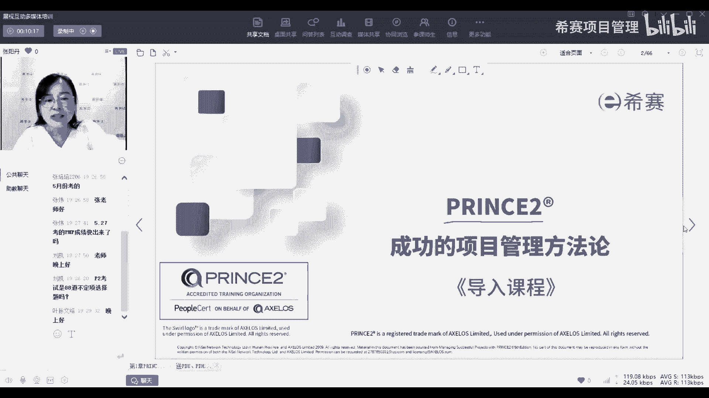
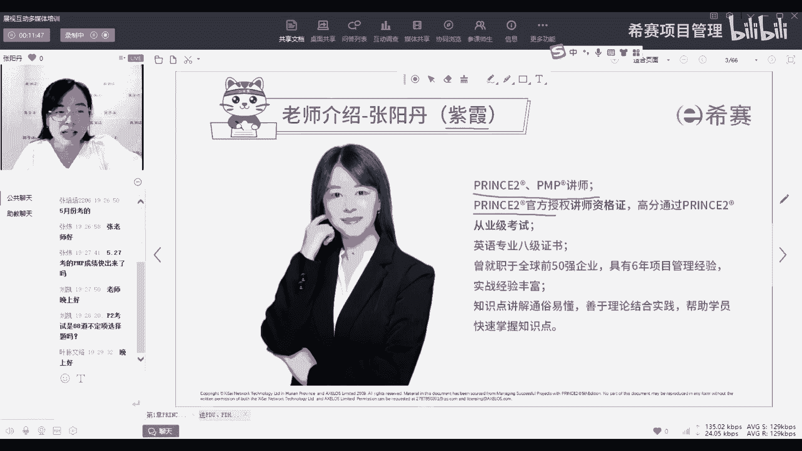
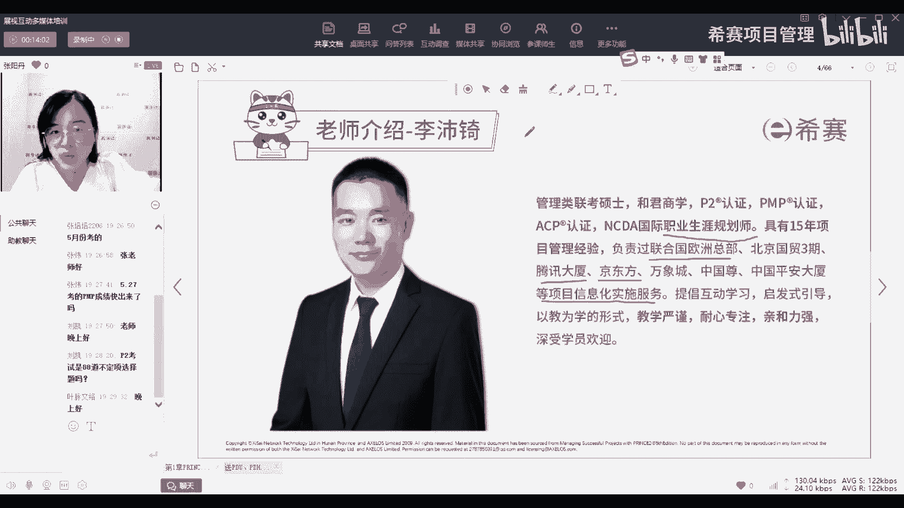
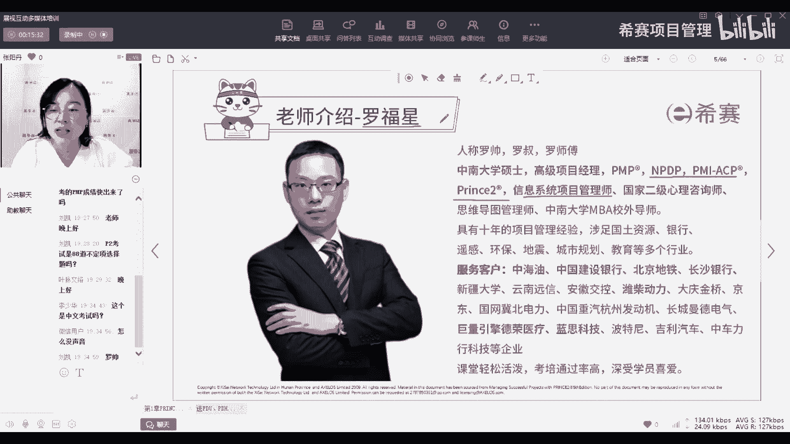

# 【报考指南】2023年Prince2认证考试介绍系列视频（建议收藏）！ - P1：01师资介绍 - 希赛项目管理 - BV1Ru411P74n

那在上课之前呢。

先来做一个自我介绍，那我叫张杨丹，大家可以叫我张老师，也可以叫我杨丹老师，那还有一些同学呢会教我紫霞老师，因为紫霞是我之前在我们现在网的一个艺名，那现在呢我们都是统一开始用真名了。

所以大家在群里应该也有一些群，可能显示的还是我的艺名，所以不管是紫霞也好，张老师，张扬丹也好，都是我，大家可以按照自己的偏好来称呼我，那我目前呢在西塞，是作为prince to和PMP的讲师。

主要负责的呢是习题课和模考课的讲解，那我这边呢也是有prince to，官方授权的讲师资格证，以及通过了princess to的从业级的考试，之前呢也是在嗯制造业的公司做项目管理，做了67年的时间。

所以呢对于制造业关于项目管理，这一块的内容呢也是比较啊，有不能说非常的多吧，也是有一些经验的，如果同学们有刚好有类似的行业，3C制造业有相关的这种嗯，可能可以想要了解的一些内容呀。

或者是想要去沟通的一些内容啊，都可以来找我，大家一起沟通交流一下好那我因为刚刚讲了，我是负责主要讲习题课呀，模考课就是这种关于如何帮助大家解题，如何帮助解答，大家通过考试。

那咱们还有正课是我们的另外一位老师讲，那相信大家对他应该也会非常的熟悉啊。

就是我们的佩奇老师啊，如果同学们我刚看到有一些应该是之前的班级，之前的偏僻的同学，他应该对佩奇老师非常熟悉了，那佩奇老师呢也是我们嗯西在目前的p two，PP的认证老师认证的讲师。

然后呢也是具有职业规划的一个认证，所以呢有一些同学他们会也听了，佩奇老师的课呢，也会去找他进行一些嗯，职业规划方面的一些咨询，那佩奇老师呢，他也是有非常丰富的项目管理的经验。

主要负责呢是一些项目信息化的实施服务，嗯也是有一些非常嗯知名的一些公司，比如说联合国欧洲总部啦，京东方啊，腾讯大厦啦这一些的，那佩奇老师的特点呢就是嗯喜欢跟大家互动，教学。

启发式的引导也是非常受大家欢迎的一位老师，那佩奇老师之后呢，在我们的课程中主要负责讲案例课，那案例课呢其实也就类比我们之前提到的政客，就是会主要是关于讲知识点。

就是带大家梳理整个我们princess two，的知识体系的一个脉络，然后呢，但是因为嗯佩奇老师他自己经验非常丰富，所以呢他也是嗯提倡用那种从案例入手，去带领大家理解知识点，所以呢他的课程上面。

也会把我们的知识点融入到案例中，所以我们的政客呢也会被称为叫案例课，就是通过案例拆解案例来理解我们的知识点，来掌握我们的知识点，那还有一我们佩奇老师还会讲的呢，是我们的一个教练课。

这个也是我们prince to课程的一个特色，就是嗯收集大家在实际的项目工作中，遇到的一些问题，然后从一些角度啊，你引领大家从一些角度入手去分析这些，然后呢并且教授大家如何去拆解问题。

也如何去解决问题的一套体系，让大家学完这个教练课以后之后，不管是遇到类似的问题，还是说遇到其他的一些问题，都可以从这一套体系入手去拆解，实际工作中遇到的问题，那除了我跟佩奇老师呢。

我们还会有一位重磅的老师，这位老师大家也非常的熟悉了，只要是听过我们希赛的课程，应该都对他很熟，就是我们的罗福兴罗老师，那罗老师的职称呢就更多了，他不仅是我们目前我们现在最资深的，项目管理的讲师。

同时呢n p DP AC p prince two，它也还有我们包括高校那边，之前他也有讲授，对我们这个考试现在都是中文考试了，那罗老师呢之前也是有很多年的项目管理经验，服务的客户也是非常多。

目前呢也有会有一些线下的企业的培训团嗯，企业内训的课程也是由罗老师在讲，包括像有些同学可能有机有机会的话，可能就能线下听到罗老师讲真人没有声音吗，这个同学如果没有声音的话，你可以退出，重新进入一下。

或者切换一下网络，因为其他同学应该嗯刚刚测试过，听到我的声音应该是正常的好，但罗老师呢他目前在我们prince two呢，他是录了录制了一些嗯早学的课程。

去帮大家介绍一下我们prince to到底是什么，那后续呢，我们也计划邀请罗老师来参与到我们，prince的授课中，或者是呢邀请他来分享一些，他的实际项目中的一些经验去嗯，给大家了解一下。

我们怎么样把我们的课程，跟实际的项目去进行结合，更好地去落地好。

