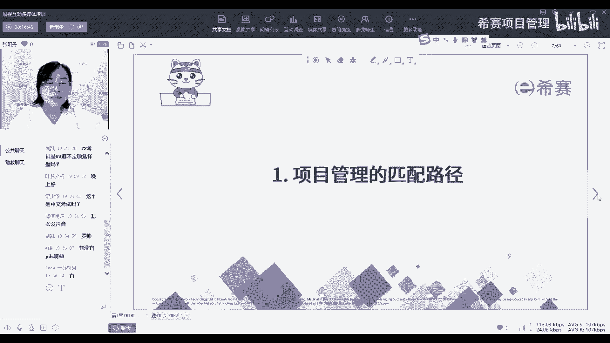
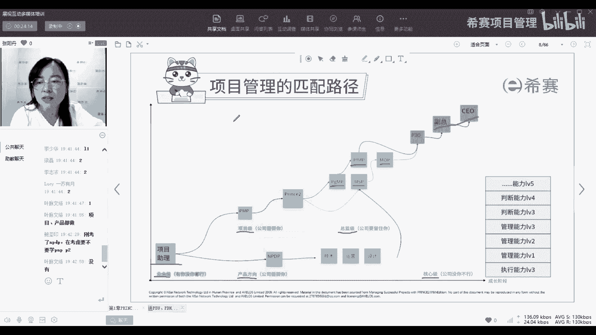
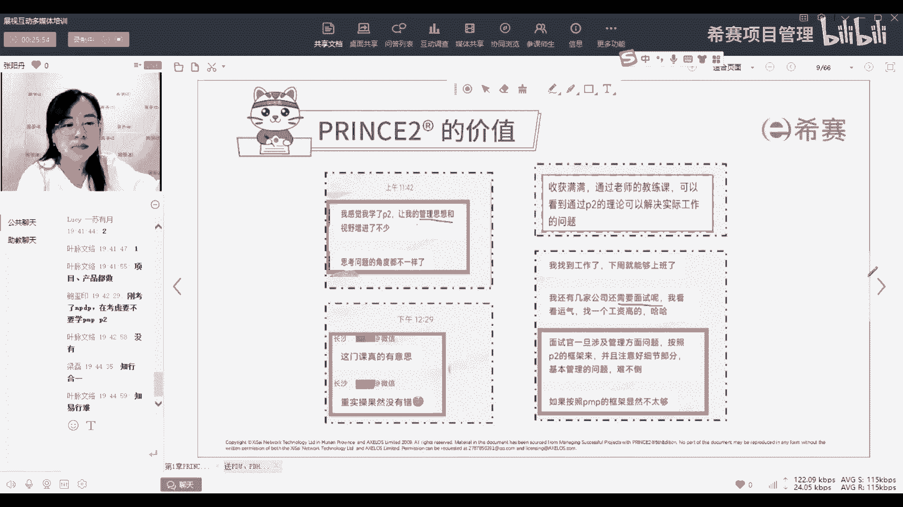
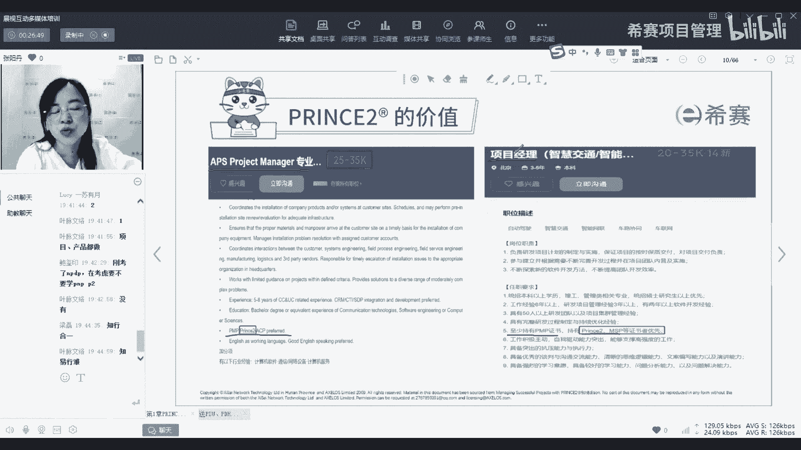
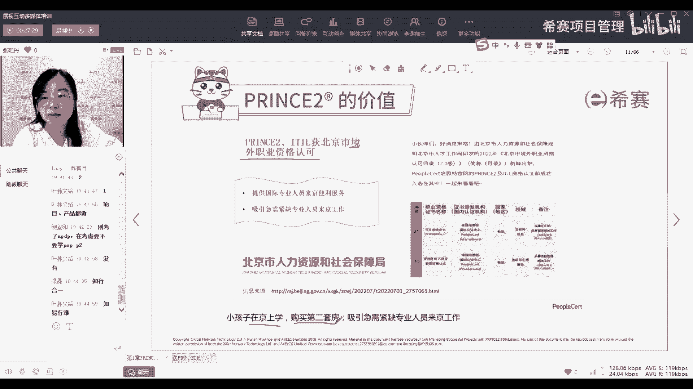

# 【报考指南】2023年Prince2认证考试介绍系列视频（建议收藏）！ - P2：02项目管理的匹配路径 - 希赛项目管理 - BV1Ru411P74n

首先第一个板块项目管理的匹配路径。

那大家有没有想过，就是嗯我们为什么要去考一些证书，因为可能有一些同学他已经工作好几年，甚至有我看有的同学工作十几年了，那为什么我们会选择在这个节点，或者是有一些同学是刚刚入职场一两年的小白。

那我们为什么会在不同的这种工作领域，工作节点会选择来考一门证书呢，那其实呢就跟我们的项目管理的匹配路径，可以结合起来去理解，像包括我刚刚讲的，我们有一些同学可能初入职场，刚刚进入这个公司。

这个企业会成为先成为一个助理级的工作，那这个时候呢你对于企业来说呢，就是一个很业余的，就我们像经常提到的说是临时工一样的角色，就是有你没你都行，你可以做，那如果你今天你不想在这干了或者是怎么样了。

你要去离开，那对于这个公司来说是没有损失的，他可以马上找到一个人去呃，替换掉你，但是这种情况下，对于我们来说其实是非常危险的，因为你有你没你都行，就意味着什么，你没有竞争优势。

那你就得非常谨慎的去处理你的工作，去避免因为一些失误让别人去把你开除啊，或者是怎么样的，或者是在遇到动荡的时候，优先考虑把一些可能没那么重要的，这种可有可无的角色先优先的去嗯清理掉。

那如果我们在一个领域可能工作了几年，在同一个职位工作了几年，我们掌握了一定的经验，对于公司的整个流程和体系也有了一定的了解，那这个时候呢我们就可以去成为叫什么，就是比较专业的，就是叫一个公司。

需要你的一些专家，一个比较职业化，比较有经验的一个这样的一个人员，那这个时候啊有同学在问说，PNP和NPPP为什么把它放在上，把PNB放向上面，NPPP放下面，这个不是说他们是一个上下级的关系啊。

只是因为我们是两条线，一个是项目级，一个是产品级，那偏僻呢就项目级，而NPDP呢就是产品经理，所以它是产品级的，这是两条路线，他们其实都是属于同一个级别，只是两条路线，那这个层这个时候呢。

你在公司的分量就比较重了，如果你想要离职呀，或者是你想要去跟老板谈一些其他的需求啊，老板就会掂量掂，就会觉得嗯，可能会去慎重的考虑你的提出的一些需求，一些想法，那是不是到这个时候就可以了。

那就可以停止不前了呢，肯定是不行的，你肯定还会想要有继续往上走，比如说我们还要想要成为总监级，就是公司要留住你的层面，或者是想要成为核心级，就像什么副总CEO这个层面，那怎么样可以一步一步的去提升呢。

除了我们在工作中，我们通过不断的工作去获取一些经验，去积累经验，去对去进行一些嗯人员的管理，工作的管理，包括跟人际关系之间的管理可以提升，那还有一种比较快速的，可以让我们去提升能力的方法呢。

就是继续在网上去考，考取一些证书，那我们现在这就涉及到为什么我们考完PMP，其实还可以来学一学prince two，或者是包括之后我们会有进阶的，像PGMPMSPMOPP3O。

这些证书都是我们去提升我们在项目管理方面，甚至是在项目组合管理，以及项目管理办公室，这些方面去提升我们的能力，那这些证书带给我们的意义，跟我们在实际工作中去获取到的经验，带给我们的价值有哪些不一样。

像我说到这儿问一下同学们，大家有多少是已经学了PP的，有学了PMP的同学请扣一，如果没有学PMP的同学，请扣二先了解一下同学们，大家都在都是什么样的一个状态，嗯大部分的同学都是学了PMP的好。

然后也有一位同学是学了P图啊，不是是没有学PMP口误了，好的，那基本上大家都是已经学了，偏偏好，那再问一下大家，第二个问题，大家是不是做项目管理工作的，如果是做项目管理工作的，请扣一。

如果不是做项目管理工作，但是想转岗的，请扣二，嗯好，这样看起来就是嗯做项目管理工作的同学，也还是占多数，但是就会有多一些的同学，他是不是做项目管理，那他学这门体系呢，就是想要去了解项目管理的东西。

可能为了以后想要去转岗，或者是想要去转行去进行一些辅助，那为什么我要问同学们这个问题呢，就是因为我自己是从一开始刚毕业，是做项目管理，然后后来是转来做这个教培，那对于我的亲身经验来说呢。

就是虽然我从一个小白到成为一个项目，管理方面的，还算是比较有经验的一个人，我经历了几年的摸爬滚打，那在这过程中我肯定是积累了很多的经验，因为我通过去嗯自己做项目，通过去参考别人，我肯定积累了很多经验。

但是呢这些经验是不是真的形成了，一个体系化的呃一个框架，在我的脑海里，这个真的是大家像刚刚有很多同学说，你们是做项目管理的，你们就可以想一想，你们在实际工作中接触的这些经验。

你能不能用一个体系化的一个框架，去把它总结一下，包括说如果来了公司，你的部门招到了一个新的员工，你要去对他进行培训，让他快速的成为一个嗯，项目管理的专业人士人士，你是不是可以把你这一套。

把你脑海中的这个包括是显性知识也好，隐性知识也好，用一个框架去快速的传授给他，其实这个是非常难的，因为这个不只是说你做做了很多年，你可能自己知道这个东西是什么样，你有这个意识，但是当你想要把它总结下来。

想要告诉别人的时候，你不能只告诉他说你要去领悟，你要从你的经验中，你去观察，去多问，当我们像我们做项目的时候，经常就是那些嗯我们的老师或者是我们的前辈，会跟我们说是多问你多问你就知道了。

但是这个多问这个点就是也是因人而异的，有些人他就是会有一些概念说，哎我知道这个点我可能预预预料到有哪些问题，我可以去通过问别人，然后有一些人呢，他可能就是更侧重于我每一件事情。

我当下针对的这个事情我怎么去做，但是就没有那么多的概念去统筹呀，去分析呀，去总结呀这种，所以我们学习证书的目的是什么，就是把我们的学的这些经验也好，这些野路子的知识也好。

通过一个体系化的框架去把它们两者结合起来，这样就可以达到什么效果，你不仅有经验，你还知道理论，你你不管是去拿经验去说别人，还是拿理论去说服别人，就像开玩笑说的，去把别人唬住。

都是对你自己来说是一个非常大的加成，那这个就是我们为什么要去通过证书，去提升自己的能力的一方面。

那还有一些内容呢啊对两磊同学说的这个很好，就叫知行合一，就是你知道你也做，那二者结合起来，那你肯定就是可以提升到另一个方面，那我们现在目前很多很多人都只能掌握一方面，就是要么我知道这个事情。

但是呢我没有办法去把它做出来，或者是更多的像一些执行者，他们的执行力非常的强，他知道怎么去做，他知道他应该做哪些事情，但他不知道我为什么要做这些事情，所以这两者就像像之前我一直也觉得。

这这四个字一直写在我的，记，在我的脑海里，经常要提醒自己要知行合一好，那接下来呢我们来了解一下prince to的一个价值，因为有一些我们目前也是有有不少的同学，然后呢考完了这个证书。

或者是说还在学习的过程中，他通过学了了解了一些我们prince的知识，然后出去包括是管理自己的公司也好，管理自己的团队也好，或者是说有些同学去面试，他说我拿出我虽然没有做过像啊，就是有一个要转岗的同事。

同学以前是做技术的，他要去转管理，然后呢还没有考P图的证书，但是他把P图的这个框架拿出来，跟面试官聊了一通，包括跟面试官那边的副总聊了一通，副总都非常认可他的这个框架，就觉得哎这个框架非常的不错。

那你懂这些东西，就说明你肯定也是可以能做得好，所以这个就是我们的同学，他学完了这个知识体系以后，给我们的一些很真实的反馈。

那还有一些价值是来源于什么呢，就是外界对我们的认可，这个认外界对我们的认可从哪体现出来，其实说点实在的，就是从我们的工资，从薪酬上面体现出来，那这里呢老师就放了两一些，我们在一些招聘网站上面截到的图。

就是关于呃有一些比如说像这个他要招project manager，像这个也是要招项目经理，那他的职位描述会有什么，而且他的要求里面，这里是有写p m p prince to都优先。

然后这面呢它有还有一个是提到说，至少要有PP证书，然后如果有prince two的话，就优先，而且他写了prince to和MSP有限，也就是把prince to。

MSP都放在一个觉得会更加有用的一个地位上，那这个就是在市场方面，对于我们这个证书的一个认可度。

那还有一个呢就是整个嗯从社会方面，从政府方面初始的出发，队伍对于这个证书的价值，就是目前prince two，他已经获得了北京市境外职业资格认可，这个是什么，这个意思就是说。

比如说如果我们拥有princess to证书，那我们就可以再去申请一些，北京市当地的一些福利的时候，会有一些优先级，比如说你小朋友要上学，要买第二套房，那就如果有这个证书，你要去办一些嗯。

比如说本地的什么本，北，北京的那个什么户口呀这些的，或者去申请这些福利时候就会有加分。

