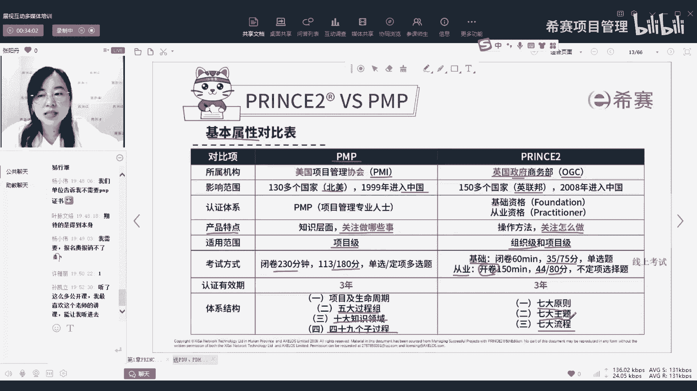
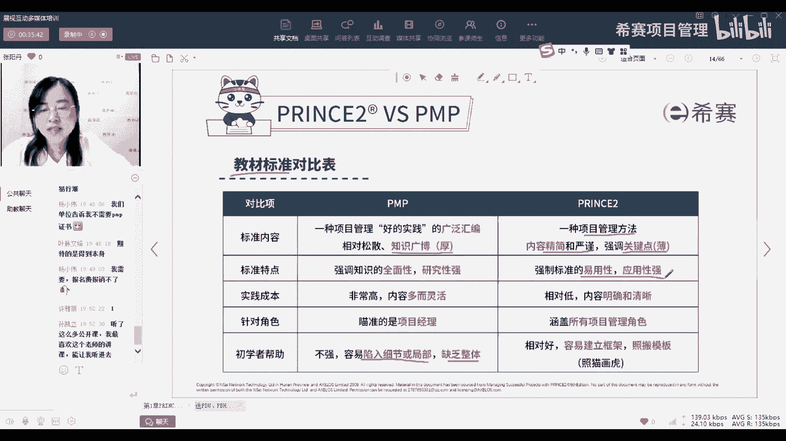
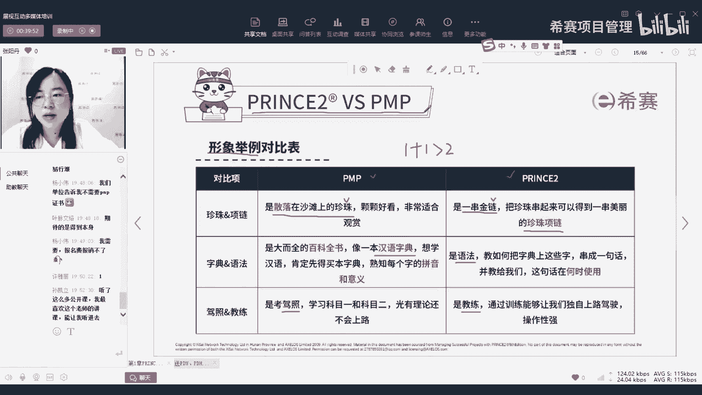
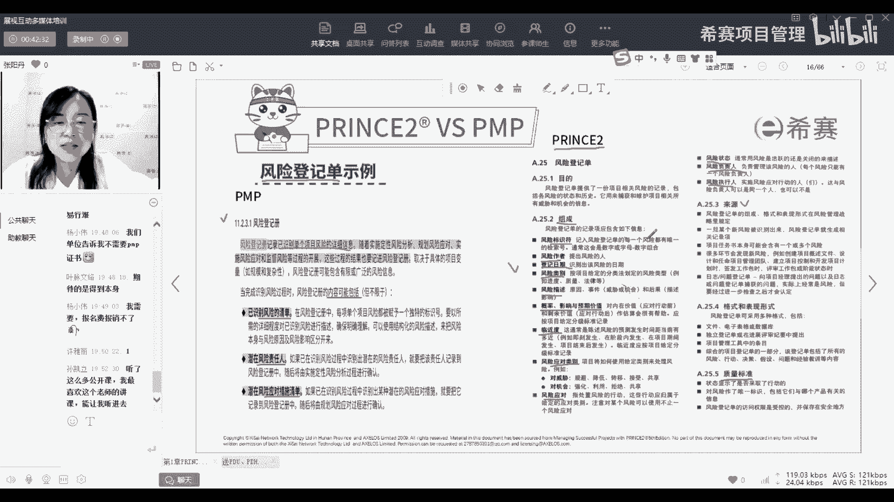

# 【报考指南】2023年Prince2认证考试介绍系列视频（建议收藏）！ - P3：03PRINCE2与PMP - 希赛项目管理 - BV1Ru411P74n

那我们呢通过几张表来先对比一下，首先呢是他们之间的基本属性的一个对比，那PMP大家就非常了解了，它是美国项目管理协会，也就是PMI认证的一个证书，所以呢它的影响范围主要就是在北美国家，然后还有。

因为我们中国现在主要也是跟美国那边，可能经济经贸往来会比较多，所以也是在99年引入了偏僻这个证书，然后prince two呢，所以呢从这个所属机构来看，一个是社会协会，社会团体，一个是政府机构。

就是OGC，我们后面在学习课程上也会经常看到，OGC这个机构，大家知道其实就是类比PMI这个机构，那它主要影响的呢就是我们的英联邦的国家，那它进入中国呢是比较晚，他是08年才进入中国的。

但是呢目前在中国的发展速度，其实也已经相当快了，而且在从全球范围来讲，prince jude在全球的推广其实是要高于偏僻，只是因为在国内偏僻进的早一些，所以呢推广可能目前大家会听起来。

感觉好像偏僻的那个民生好像会稍微的高一点，但是其实像我之前的那个企业啊，他们其实我现在因为我接触了PMP，princess to以后，我就发现我们我之前那个公司，他的很多操作的流程。

就是管理项目的一些流程也好，一些要求也好，都是跟prince中很多内容去相匹配的，那再加上上再接下来看呢就是产品的特点，这个特点大家学了pp就知道，我们pp讲的就是关于知识层面，我们要做哪些事。

他就告诉你我们要关注五大过程组，46个，40大知识领域，49个子过程，你要了解，要知道这些地方都需要去管，但是他不会告诉你具体怎么去管，比如说他就像举个最简单的例子，他告诉你你要去规划范围管理。

然后他会说你要去收集需求，然后跟相关方沟通定义范围，但是具体怎么去收集需求，怎么去定义范围，他只是提到了沟通啊没了，而prince two呢它的特点是关注你怎么做，就是基于我们的嗯，要做项目的这些内容。

要做的这些事情，每一件事就比如说收集需求，这一件事怎么样去收集需求，怎么样去定义范围，它都会有一个明确的流程，包括他会告诉你，要用什么样的技术去收集我们的需求，包括怎么样去呃。

从哪些角度出发去找客户沟通，沟通哪些方面，从这个具体的落脚点上出发，来告诉你怎么样去做一个项目，所以对于初学者或者是初入职场的，项目管理人士来说，prince to会更加的贴心，更加的人性化。

更加的落地好，那再看适用范围，PP它的适用范围就是项目级，因为他一直讲的就是项目管理怎么做，项目经理应该做哪些事情去管理项目，而prince two呢他除了考虑项目级以外，它还会有一个组织集。

就是会强调项目管理，项目经理之上的人以及在职上网公司层面的人，怎么样去参与到我们的项目中，包括项目经理之下的我，怎么样去安排我下面的团队成员，让他们更好的去交付，我安排他的工作以及交付最终的项目成果。

那考试方式呢就大家都刚刚有个同学也问了，我们的PP呢就是B卷230分钟，然后一共是180道题，答对113分就算通过，那prince two呢它是分为基础级和从业级，基础级就是75分。

答对35分就通过是单选题，而从业绩呢一共是80分，答对44分就算通过，但是从业级他是开卷考试，意思就是我们可以带官方教材，你可以翻书啊，还有一个比较方便的点就在于从prince to考试，它是线上考。

就是你只要在线上预约，然后呢你有一台电脑，有一个封闭的环境，你随时都可以考，周末也可以考，平时也可以考上午，下午或者是甚至晚上你都可以去考试，这个就是时间非常的灵活，因为有很多同学之前报pp。

然后呢一直延期，为什么延期，他说啊，我最近太忙了，最近要忙一项目，有十几个20个项目要管，没有时间去复习，没有时间考试，只能说啊去下一批，然后下一批呢可能又不确定什么时候有时间。

但是prince to呢，你就你确定你最近哪一段时间比较空闲，你就可以集中的去学习，可能有有有的同学他说我请一个星期的假，沉浸式的学习，然后我就考试周末就把成证明了，好。

那这个就是他们在考试方式上面的一些不同啊，谢谢这位孙凯丽同学对我的认可，谢谢好，接下来呢啊证书有效期他们都是一样，都是3年，也就是3年需要去续费续证一次，那体系结构我刚刚也提到了。

就是PP它是由五大过程组，十大知识领域，49个子过程，而prince to呢它是有三个七，七大原则，七大主题和其他流程，只要我们把这三个七都理解吃透，你直接去照着这三个七去做项目，那基本上偏差都不大好。

这个是他们的基本属性，那接下来呢关于教材的标准偏僻，它的内容呢十大知识领域采购呀，嗯风险呀，然后进度成本范围质量，还有相关方沟通资源都会管，所以呢它的内容非常的全，非常的广，但是呢全代表着什么权。

可能就是比较泛，就是就就像我们挖井一样，如果你每一个点你想要挖的面积更大，那在同样的时间和同样的成本下，你是不是能挖的深度就会比浅一些啊，如果说你只专精于某一个点，你就深挖这一个点，你持续的去深挖。

那你就会挖的比较深，所以偏僻它的特点让大家学了以后，也知道它内容很多，但是就容易造成什么情况，就是我们反而不知道我应该去重点关注哪一项，就好像每一项我都要看，那每一项我是不是都能抓得住，我就很容易说啊。

只去陷入了某一个细节或者是局部，然后就缺乏了整体啊，漏掉了一个琴，一个情，某一些内容就导致我最后项目啊出现了偏差，而prince to呢它是一种方法论，它一直说它就是一种方法论。

所以他就是希望你能用得了的这种方法，所以它是非常精简的，它的内容呢也是书也是比较薄的，他就强调的是一个易用性，就是你可以快速的就像说明书一样，照着它去上手，去搬则它的模板去照猫画虎就非常的方便。

让我们去入手，这个就是关于教材标准，那还有一个用一个很形象的例子来区分它们，像偏僻，它就像是珍珠，有49颗漂亮的珍珠，有的大有的小啊，每一个都很好看，但是呢这49个珍珠刚刚也讲了。

我们没有办法一次性把它全部抓住，而且你就算遗漏掉一颗也不知道，因为太多了，你没有办法去很好的去把49个都管好，而prince two它更像是一串链子，就是他可能不会是说有那么多的东西。

但是呢他这一串链子它是有逻辑串联关系的，你把它扣上以后拎起来就可以走，你不用担心说我这个链子上的某一环掉，因为它本来就是环环相扣的，那看了这个珍珠和项链的里，大家有没有觉得，如果我有了珍珠，又有了项链。

我是不是就可以有一个更好看的一个珍珠项链，它的价值，它的呈现方式也会更加的多样，那接下来呢关于字典和语法偏僻呢，它就像是一本汉语字典，所有的天嗯，项目管理相关的知识他都会放在里面。

你想要知道的你都可以进去查，但是呢你就是太泛了，你可能会不知道你当下你需要的是什么，只有当你遇到了，你才能去哦，翻出来是知道哦，原来是这个意思，我要去这么管理，而prince two呢。

它其实相当于是语法，就是告诉你你要按照什么样的逻辑去管理，去编写你这个学到的这些字，学到的这些词，还有第三个很形象的例子，就是驾照和教练，像PMP，有很多同学说啊，我考了PNP没用上呀。

那其实就像你考驾照一样，你考完了当下你也知道了，然后你也快速的像什么科目二，科目三科目四也就是突击的练了一段时间，但是等你考完以后，你敢不敢上路，还是不敢上路，因为你没有脱离到一个培训的环境。

没有脱离到一个理论的环境去感受真实的场景，而prince two它就像教练，就像现在的很多那种驾校，有那种陪练的，就你可以让他坐在你旁边，然后你开的时候，他提醒你走到哪了，应该怎么做，遇到有人的时候。

有红绿灯的时候，要要去怎么样减速呀，要踩刹车呀，要怎么样的，那你时间长了，因为是你一直在操作，所以时间长了，你对于这些操作你就有概念了，你就知道哦，原来开车就是这样的，我就可以自己开了。

所以这就是pp和princess to的区别，那偏僻呢相对来说就是偏理论的东西，而princess two呢相对来说就是偏实用性，偏呃实操方面的东西，那我学了pp还要不要学prince to。

就刚刚老师讲的，你当然可以只学理论，只学一个证书去证明你确实学过这一套东西，但是如果你想要真的在你的工作中把它用起来，把它很好地用起来，结合到你的实际工作中，那你肯定是又有理论，又有实操，1+1。

那他肯定就能达到大于二的效果，所以这就也就是我们讲的，我们建议学完PP也来了解一下prince to，这就是优胜于有，有胜于无，也可以是无也没关系，就像有的同学说不需要p mp证书，那我没有。

我也可以做，我通过我的实践，也可以知道我在公司里应该怎么去管项目，那你学了偏偏你就可以知道哦，原来理论我还有一些理论的支撑，那别人比如说提到一些什么项目管理，怎么管的时候，我可以把五大过程组。

十大知识领域拿出来去跟他沟通，跟他battle，那如果你还有了一个更落地的一个方法论，那就你就不仅仅是跟他battle了，而是你可以在实际的工作中，包括你去自己做项目，或者是去培训你的下属。

培训你的团队，把这一整套的方法论跟你的工作结合起来，这就是我们讲的他们二者之间的关系，他们绝对不是互相排斥的，而是一种互补的关系。

那这里呢还有一个就是刚刚老师提到的prince to，为什么更加落地的一个点就是拿了一个文件，风险登记单，那这个风险登记单大家应该很熟了，我们在PMP考试里，经常会考到风险登记册这个文件。

那我左边这边截的呢是我们从偏不上结的，对于风险登记册的一个定义，他会介绍风险登记册是什么啊，要记录哪些信息，然后他会告诉你，你在做的时候，你要去登登记这些内容，那它的内容可能包括什么。

他就说你可能需要记一下，你识别到的风险有哪些东西，然后潜在的风险责任人以及潜在的应对措施，他会告诉你，你需要记这些，但你是不是你实际工作中，是不是只记这些就够了呢，你肯定实际做的时候你才会发现啊。

我还得记一下我什么时候识别到的这个风险，风险，现在的状态是什么，是ongoing还是clothes，还是pending，还是怎么样，那他有没有给一个解决方案，他解决方案要什么时候执行，解决方案做完以后。

他的状态是不是这个风险真的就被解决了，还是说只是降低了一点点，还有一些残余风险，一些次生风险，那是应该怎么样去处理，其实这些都是我们实际项目中，你非常需要知道的，但是呢在pp里它不会给你写写这么细。

你就得自己去悟，自己从实际的工作中再去调一个课文记忆点，而prince to它的实用性就体现在他提前就想到了，你在项目中遇到风险时候需要记哪些，所以他会告诉你你的组成是什么，你要先给它有一个标识符。

然后呢谁识别到的风险，什么时候识别到的，它的类别是什么，是跟进度相关还是质量相关，还是风险相关，还是法律相关，还是那个成本相关，都会列出来，然后这个风险具体是什么，它发生的概率影响。

它可能会涉及到多少的预期价值，以及大概什么时候会发生，那我们应该怎么样去应对它，我们的应对类别以及具体的应对措施，那他后续的一个风险的状态持续的更新，包括他的负责人是谁，谁来管理它。

以及谁去负责具体的执行我们的风险应对策略，那这些信息就是你在实际项目中，基本上就把你呃识别到一个风险去，管理它的内容都囊括进来了，而且他还会给来源，也就是说你识别风险的时候，你可能从哪识别到风险。

从哪些信哪些文件中，或者是从哪些人那儿去获取，你想要去记录的这些内容，包括还会给我们质量标准，也就是说，你怎么样才算是把一个风险记录的非常的完整。

你要去显示哪些内容，然后它的权限是不是受控的，是不是只让需要的人看到他，不需要的人不需要了解他，所以这样的话你就算没有做过项目，你心去一个公司去做项目，然后老板让你去更新做一份风险登记单，你就算没有。

你就照着prince to里面给的这个模板，你就去套嘛，一项一项的列出来，这样的话我觉得可能我不说，我不说太夸张了，咱们目前的市面上的企业50%，他的风险登记单都不可能做到这么详细。

所以如果你能给出一份这么详细的文档，那你的领导绝对会对你刮目相看，这个就是PMP和prince的一个对比。

