# 【报考指南】2023年Prince2认证考试介绍系列视频（建议收藏）！ - P5：05PRINCE2内容框架 - 希赛项目管理 - BV1Ru411P74n

首先我们来看一下我们的prince度框架里面的原，三个七，七个主题，七个原则和七个流程，首先七个原则按阶段管理，关注产品，明确定义角色和职责，持续业务验证，另外管理一项目环境检查，以及吸取经验教训。

嗯那这七个原则呢，它相当于就是大家也不需要这个，不是我们去考试的时候，考这些的点呢不会特别多，但是呢它非常的为什么它非常的重要，是因为我们在后面的流程和主题里面，都会要参考这个，因为像原则。

大家如果你看PP里面有讲那个敏捷的原则，敏捷有12原则，其实他本身也不会说是考你12原则有哪一些，但是你在后面，你不管你是去像比如说我们去迭代，你的迭代的那些事件。

3355都是结合我们的敏捷12原则来的，比如说敏捷12原则，第一条就是什么，嗯这个尽早的交付价值，所以呢一起都是围绕价值，你后面你去交付也好，你去持续的去迭代，每一轮你要去嗯通过排列优先级也好。

都是要以价值为导向，这个就是原则的作用，就是你必须要去参考它，它是你的方向去定基调啊，那主题七个主题分别是商业论证，组织质量计划，风险变更以及进展啊，这七个主题呢其实就是告诉我们，我们在管项目的时候。

要从这个角度出发，从这七个点的内容呢我们都要去关注，而不是说是你啊可以只关注某一方面，你只看某一点，不，你七个点你都要去看，你才能确保你的项目内容，他的你想要做的东西都是包含进来了，同时呢它的呃进程啊。

他的管理啊也都是没有问题的，他的控制也是没有问题的，那其实就我们刚刚提到的商业论证组织，都包含在这里面了，我们后面呢主题，这个主题我们会重点每一个去展开讲，在后面的课程里还有一个七呢，就是七个流程。

那这七个流程呢也是我们prince two就是必备的，七个流程，就是你必须要按照这个流程去管理项目，分别是我们的准备解流程，启动流程，指导流程阶段，边界管理流程阶段控制流程。

产品交付管理流程以及项目收尾流程，那这七个流程也是你照着这个，为什么我们一直说它落地，还有一个点就是它的流程写的很清楚，你每一步后面也会展开讲，就是你在准备流程，你要做哪些工作，然后做完准备流程以后。

下一步会触发哪一个流程，以及哪下一个流程，他做到什么程度，又会接着触发下一个流程，就他们之间的逻辑关系是非常的清晰，就像那个链条上面的一节一节的环一样，它是紧环环相扣，扣的很紧密，你不用担心说啊。

我不知道，我现在应该去看哪个流程，他就明确告诉你这几个流程，你就是要按这个逻辑顺序去进行管理，你说跟讲义有些出入吗，这个图是图的那个展示，就是可能它的颜色会有一点区别，但是它的内容是一样的啊。

好那接下来呢我们就来对于这几个点，逐一的先带大家熟悉一遍，因为我们后面的内容会详细的去讲。

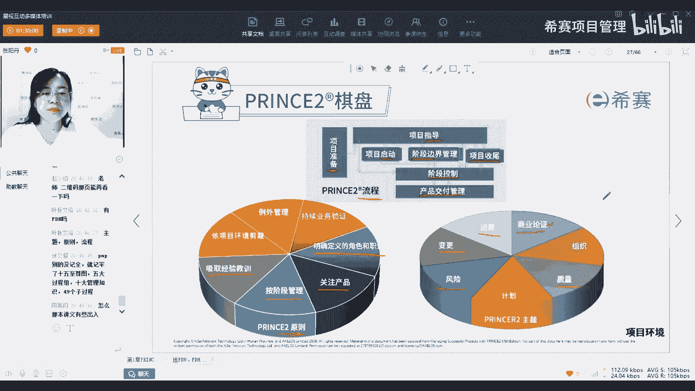

好，那我们首先先来明确一下我们，原则和主题以及流程，它们的作用，原则呢就是基础就是给我们定基调，定方向，告诉你你做事你一定要按照这个方向去走，而主题呢就是动力，就是告诉你你要去做这些事情。

你要怎么样去做这些事情，我为什么要去做这些事，情，为什么要关注这些内容，而流程就是约束，就是说你怎么样能把主题里面的，这些事情去做好，融入到我们整个项目中。

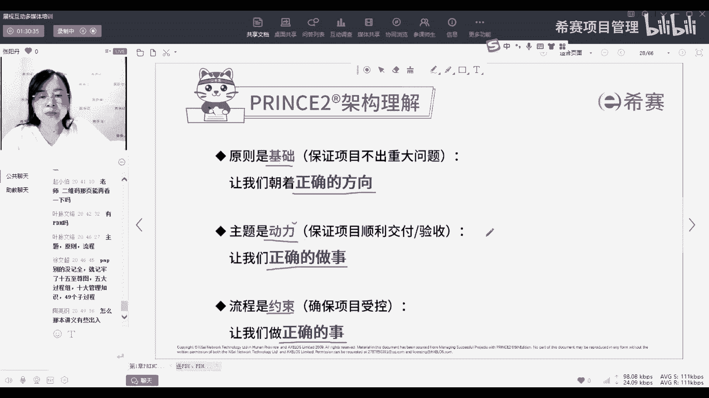

那接下来呢我们就来逐一的看一下这七个原则，首先持续的业务验证，他的意思就是我们要证明项目，有一个合理的理由去开始这个项目，也就是很多我们省很多，在实际项目中会忽略的一个点。

就是我不去想我为什么要做这个项目，反正就是领导把这个项目给我了，那我就去做，但具体不去思考他的理由的话，你很容易做的就是没有动力，或者是说没有方向，然后呢，这个合理性呢，也不是说我们开始的时候只看一下。

你要持续的去验证，也就是在整个项目周期中都要保持是有效的，接下来明确定义角色和职责，就是要确保我们的每一个层级，每一个相关方，他都是明确知道他要在处在哪个位置，他要负责哪些事情，那这里的相关方呢。

它会涉及到三个类型的相关方，商业的，用户的以及供应商的，这个我们在组织主题会详细的去展开，为什么我们需要这些相关方，以及他们在整个项目中又起到了什么样的作用，第三个原则，关注产品。

也就是关注我们要交付什么，我们的质量要求是什么，第四个主题，第四个原则，按阶段管理，就是把我们的项目分成多个管理阶段，那为什么要分成多个管理阶段，其实我们现在应该很多项目，也就是这样的。

就是如果比如说你要吃一块蛋糕，如果这个蛋糕这个饼非常的大，你就不能保证你一次性，你确实一个能把它吃完，或者是说你多久能把它吃完，你是不确定的，那我们就把它分一下，切小一点，切成一些小块块。

这样呢每一块至少这一块你小一点，你就在一个你可控可以可以掌握的这个范围内，你就知道哦，我大概多长时间能把它吃完，或者是说我需要多少嗯，就是这个东西我能吃到几分饱，就比较清晰的去管控它，然后吸取经验教训。

这个点相信大家都知道吸取经验教训的重要性，那我们在prince to do，是强调我们在准备项目的时候，就刚开始初期在项目进展的时候，以及最终项目结束的时候，都要去持续的吸取。

而我们实际工作中呢可能只在第一条和第三条，就是当我开始要做一个项目的时候，先问一下其他项目是怎么做的，其他人是怎么做的，以及结束的时候去总结一下，我本项目有哪些经验教训，但是在项目进展中。

大家经常容易忽略，我们也是要去持续的获取，或者是说我们意识到了，但是基于种种的原因没有去做，而我们的prince to中呢，它是强调你必须要持续的去获取经验教训，以及根据项目环境进行剪裁。

那这个剪裁的意思其实四个字叫什么，因地制宜，那目前我们pp的第七版，其实也提到了剪裁的这个概念，但是在我们prince to中呢，是一直强调这个他是我们的一个原则，就是你必须得遵守的。

就是说你去用我们的，不管什么样的方法论，什么样的技术工具，你都是要跟我们的项目环境相关的，如果项目比较简单，你可能就不需要非常复杂的控制的力度，或者是非常冗杂的一个人员的配置，那如果说你的项目很复杂。

你就不能说我只用三个人，两个人去看一个月，两个月才看一次，那肯定就是不够的，所以你的方法论，你的控制程度都要与我们的项目环境去相匹配，还有例外管理，这个例外管理呢。

它等于是我们prince two中的一个特点，特点就是在其他的方法论中，包括像我们偏僻里面，是没有提到例外管理这个概念的，那它其实就是指的是，我们对于我们六个绩效指标，设定一个允许的偏差。

你在这个允许偏差以内，也就是给你授权，你就可以自己想怎么做都可以，只要你不超出这个给你授权的范围就没关系啊，如果你可能要去突破它，要去超出它了，我们怎么样去控制它，也会去给一个明确的方案。

那我们其实之前我们做项目的时候，虽然我们没有学prince to，但是我们确实也是这么做的，只是当时不理解我们为什么要这么做那种，那个时候就是全凭经验，全凭个人的理解去进行这个管理，就抓01：

08分在手上，然后去让我们的项目会有一些弹性，不至于被卡得死死的，不至于场内跟或者是跟客户那边，完全都是同一条直线，同一个deadline，然后到时候就如果一旦触及到deadline还没搞完。

那就很尴尬，那就很危险，所以这个例外管理也是，大家可能实际项目也会这样，但是我们就通过这个另外管理这门课程，让大家知道我们为什么要这样做，以及这样做的好处，就更加的去支撑我们去做这件事情的一个基础。

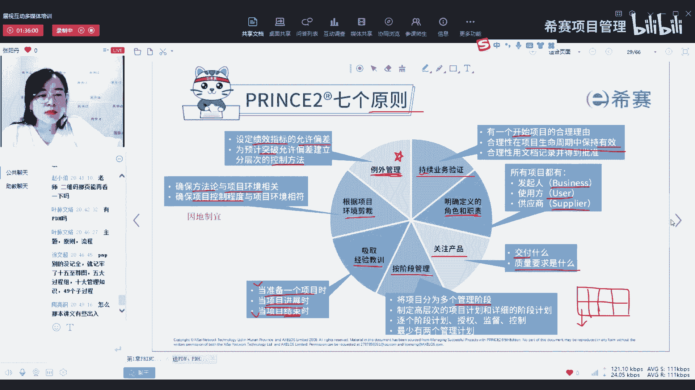

这是我们的七个原则，然后七个主题其实大家可以先看一下这个图，看一下我们项目就是老师这里列的这几个问题，你们在做项目中，你们有没有想过这个问题，或者是说你们规划的时候，有没有把这些问题考虑进来。

包括说我们为什么要做，由谁来做，做什么，什么时候做，怎么去做，投入是多少，如果有意外，如果有不确定性怎么办，那如果有一些变化怎么办，那我们的现在走到哪儿了，我们要去的是哪里，是否应该继续走这个决策。

什么时候做谁来做，以及怎么做这些点，大家是不是我们实际做项目的时候，都需要考虑这些内容，但是我们你可以在一开始，你就知道把这些点都考虑进来吗，更多的是走到这一步了才说哦，我要去管理这一块。

遇到这个问题了，遇到风险了说哦，原来我要去这样做。

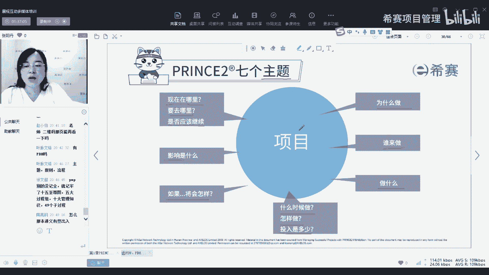

但是我们在prince初中呢，他就告诉你，我们就是七个主题，就是去解决这些问题，所以你要做项目的时候，你就必须要去把这七个主题的内容都囊括进来，那你要去解决这些问题，你就知道该怎么样去解决。

以及什么时候解决，找谁解决，那这七个主题呢就是商业论证，组织质量计划，风险变更以及进展，商业论证刚刚讲了，就是论证它的可行性，而组织呢就是安排人员角色质量是很很明确了。

就是我们的要做一个质量OK的质量过关的，那计划呢，就是平时我们经常也会做一些进度计划，进度表要做什么东西，里面要包括哪些内容以及风险和变更，这都是跟pp也一样啊，唯一有一个比较特别的进展。

进展这个词词我们在P里也没有提它，其实呢除了说我们要看看我们现在走到哪儿，就是check一下当前的状态，以及我们要做一下我们的未来的一个预测，还有一个非常重要的点，是否应该继续进行。

也就是走到这里的时候，看一下我还要不要继续走，也就是做一个决策点，那这个决策的点，其实我们一般是就很少会去考虑到这个点，但是它也非常的重要，它的作用呢就是避免我们做一些无用功。

就如果发现我们的项目不再切实可行了，或者是不再有效了，那我们及时的叫停也是一种可选方案，这就是我们的七个主题，那我们呢还有一个七是七个流程。

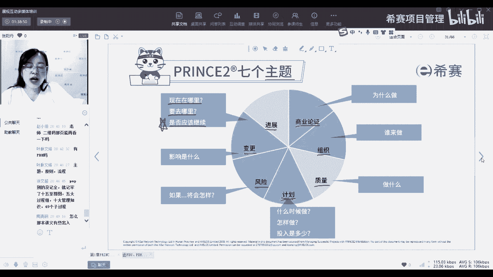

但是我们在讲七个流程的时候呢，老师先跟大家讲，插播一个四，就是我们的四层结构，这个就是我们组织里面的四个组织的层次，分别是嗯，从最上面公司和项目群的管理层，然后项目管理委员会它是属于指导层。

然后项目经理他是属于日常管理的管理层，以及还会有小组经理是负责交付的交付层，那这个层次大家是不是就觉得哎，为什么会把公司也包括进来，我们一般做项目的时候，我们都会说公司的高管层它是属于项目之外。

他不会去参与到我们的项目中来，但是我们在prince中强调，你要把公司也拉进来，为什么你把公司拉进来了，公司知道你这个项目，也知道你付出了什么，那他才会去为你考量，再去做决策的时候。

才会考虑到你这个项目，不然有一些公司他项目下面可能项目太多了，那是当当他要去做一些决策，要去做一些拆嗯，裁剪去拆解去，比如说去剪掉一些项目的时候，那些他亲自参与了的项目，他肯定不会优先去考去捡。

而是去优先砍掉那些他没有参与的，所以我们把公司层面拉进来，让他也接收进来，就可以去确保我们的项目可以走得更好好，那剩下的呢项目管理委员会跟项目经理，大家就比较熟悉了，还有一个小组经理。

这个是负责具体交付，也就是说你具体做事情的那些人，他们呢就是交付层，他们不用去管其他的东西，他只需要知道他要做的是什么，要交付的内容是什么，把它交付出来就够了，为什么我们要先插播一个四层的结构呢。

就是因为我们的流程。

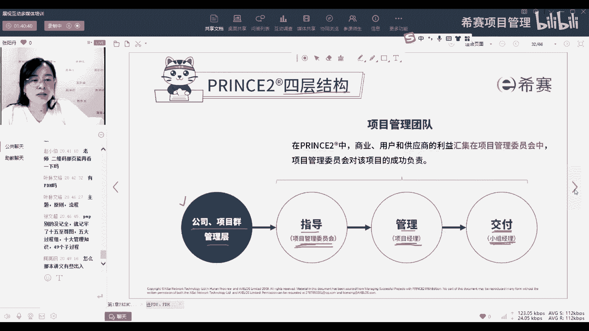

就是跟我们的四层结构是套在一起的，那我们的比如我们刚刚讲了我们的七个流程，准备流程，指导流程，启动流程，边界管理阶段控制，产品交付以及收尾流程，你看在公司层面，他没有直接参与到这个流程里。

但是呢他会对于这些流程有一些指导，而我们的指导层呢就是项目管理委员会，他会去负责的哪些流程准备流程，他要参与指导流程，他要参与，然后呢项目经理他就会更多的像准备流程呀，边界管理，启动流程。

阶段控制以及社会都重点是项目经理去处理，而小组经理他就是负责我们的产品交付，这样一来我们就在什么流程要去找谁，找哪个层次的人去负责，就很清晰，你就不会出现说啊，我不知道这个流程我应该去找谁。

或者是说我去找他，他推卸责任，说这不是他的责任，那就可以避免这种情况，而且明确了层次，如果小组经理他要去向上汇报，他就找他的上一级，那如果是项目经理，他要向人汇报，他就找他的上一级。

那项目管理委员会如果已经超出了他的权限，他就再去找上一级公司，这样一层一层的上报，就不需要说有一点什么大事小情，我都去找项目管理委员会，或者都去找公司，这样的话下面的项目经理或者是小组经理。

他们就一点权限都没有，那项目管理委员会和公司就会过多的要去干，参与进来，但是他们又很忙，你要是等他们做决策，那时间就会拖得太长，所以这个就是可以确保我们一个适当的层次，适当的管理嗯。

这就是我们的七个流程。

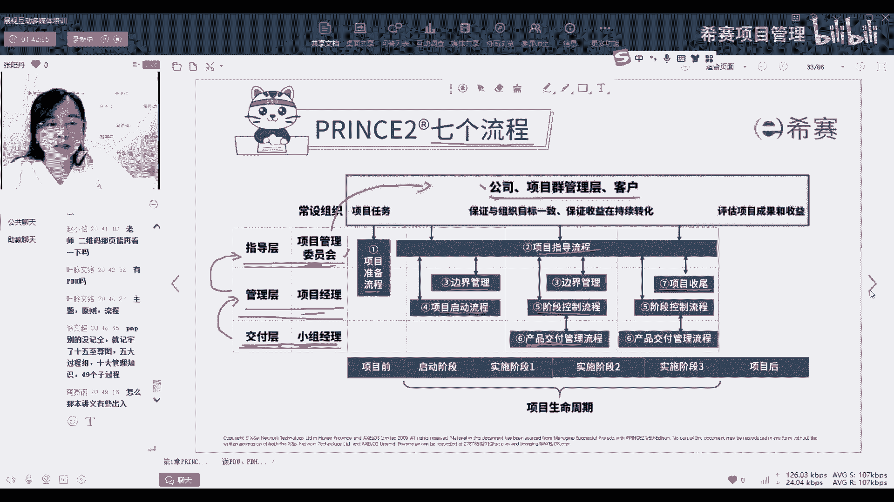

好那我们刚刚讲了我们的项目管理，讲prince to讲什么，就讲我们的三个七，还有一个四就是我们的四个组织的层次，那他还会明确说我不提供什么，那这里提到了，我不提供专业的工作，不提供具体的技术。

也不提供领导力，为什么呢，因为prince to我们是一门通用的项目管理方法论，那既然你是要通用的，你的专业工作，我们有这么多专业工作，什么工程建模呀，什么那个嗯图表怎么画呀，3D图怎么画呀。

图纸怎么画呀，然后机器怎么操作呀，这种专业的工作太多了，我没有办法在一门课程里面把它全部包含起来，所以呢而且这种专业的课程，大家通过自己的实践的工作，你就可以了解到这个专业的课程，专业的工作。

所以我们也不需要在一门管理课程里面，去学这些内容，所以关于专业的工作就不会有具体的技术，也是我们会有很多技术，也包括你去做计划，你会有什么关键路径分析啊，政治分析啊，而政治分析啊，这些又会有不同的嗯。

那个技术具体的技术你可以去用，我们不去限定说你只能用哪一种技术，你只要是你实际工作中确实是用得到，对你有帮助的，你都可以去用，所以呢我们也不会去限定你要用哪些技术，我们就不会讲。

但是这里对于技术有一个特例，就是我们有唯二的两个技术，是我们prince to要讲的，那为什么要讲呢，因为这两个技术它不是具体的，就是它是跟我们prince to的流程和主题息息相关，就你必须得讲。

这两个就包括在我们的内容里面了，所以这两个技术非常重要，也是唯二的两个技术，一个叫基于产品的规划技术，在我们的计划主题里，一个是质量审查技术，在我们的质量主题，那这两个技术也非常的重要，考试也经常考。

所以大家一定要记住这两个技术，其他的技术就不用去管了，就我们的课程里就不会去讲，可能会给大家举一些事例，大家了解就行了，考试也不会考，还有就是领导力，因为领导力这个东西呢它没有一个标准。

因为领导力就是你不同的阶段，或者是不同的团队，或者是不同的文化里面，他有需要的领导力都不一样，所以呢你没有办法说话，那我认为哪一种领导力好用，放到我的课程里，那我也不能说把所有的领导力都放进来。

那他其实也是会让我们的内容过多了，所以呢领导力的内容我们也不讲，如果大家有这方面的需求，你也可以去找到那种专门的讲领导力的课程，去学习这方面的内容，好这个就是我们prince to的介绍。

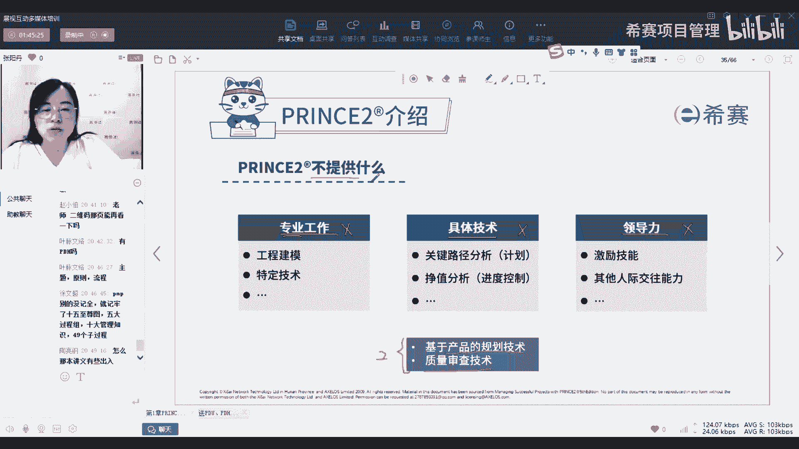

什么讲什么不讲什么，那我们来总结一下我们要讲的内容，就是我们的七个原则，七个主题，七个流程，四层的项目管理，组织的结构以及两个项目管理技术，所以总结下来就是四个3742这四个数数字。

这四个数字非常重要啊，大家可以把它记下来，不是说把接下来就是你要有这个概念，这3742就构成了我们prince的整个框架。

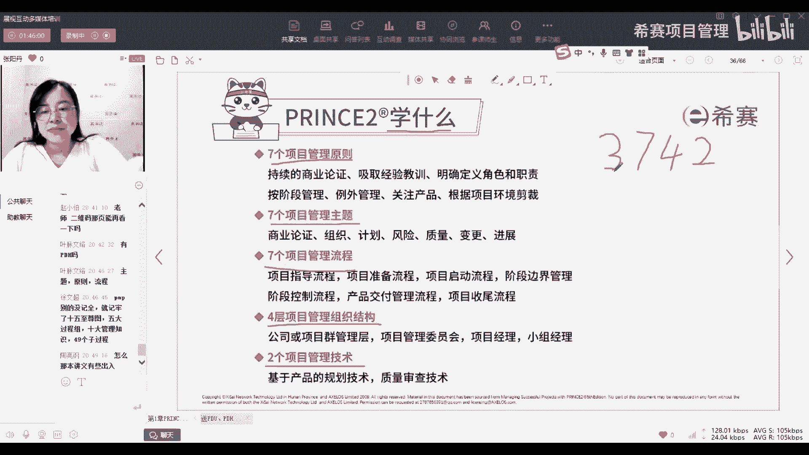

好那我们再来总结一下我们prince to学习的益处，就是学习prince to会给我们带来哪些好处呢，首先它会有三个方面，第一个方面呢它是一个项目管理的最佳实践，我们可以运用到任何类型的项目中。

就你不管什么项目，你都可以去套我们的这一套最佳实践和方法论，同时呢它可以提供一种通用的语言，就是如果大家都是学了prince to，那我就跟你讲流程，讲准备流程要做哪些事情，讲启动流程要做哪些事情。

大家就会很清楚，不需要具体去问啊，启动流程跟准备流程它们的区别是什么啊，指导流程是什么意思，产品交付流程是什么意思，或者是说我们去提到一些管理产品，我要做一个检查点报告，要点报告。

我不用去问什么是检查点报告，什么是要点报告，这样的话大家沟通起来就比较有效率，所以这个呢就是从通用性上面去讲它的益处，那第二个方面呢，从人的方面就是明确定义了我们的职责。

以及确保我们相关方的参与和进行决策，同时呢对于不同的相关方，不同的项目层面来说，它的报告结构是清晰的，而且是全面的，也就是从人的角度来明确我们怎么样去管理人，还有第三点呢，就是明确我们的产品。

我们要交付的是什么，以及每个阶段每个层次我们的要包含哪些内容，同时呢会涉及到另外管理，就是如果我没有办法去达成我的计划，我应该怎么办，那例外管理它的作用就是高效经济的利用时间，也就是说像我刚刚讲的。

因为我们有分层次，那如果我们给每一个层次都授了权，如果这个层次超出了它的权限，他才需要去向上一层的汇报，如果没有超出他的权限，就不需要去每一件事情都去找项目管理委员会，找公司，这样呢。

高层它就可以比较少的时间去关注这个项目，同时也不会说因为他关注的少，导致我们的项目失控，这个就是我们prince to的益处，考试的时候他可能会从这里面去挑一些，问你prince to的益处有哪些啊。

这个大家可以从三个维度，第一个呢就是从做事的维度，第二个呢人的维度以及第三个就是物的维度，就是我们要交付物的维度，从这三个维度去记去理解好。

这个就是我们prince的介绍，那接下来呢大家有没有看一下，我们这里列出来的一些项目的常见困惑，看看你有没有遇到过，比如说项目不受控，你明明计划也做了，但是呢怎么他跑着跑着就跑偏了。

或者是说团队员工分工不明确，你本来规划的是五个成员，然后每个成员他要去负责哪些项目，有人跟进度，有人去嗯记一些那个去更新表格，去记一些事项，然后有人呢去跟厂内，有一些有人呢去对接客户。

但是做着做着呢就成了项目经理一个人的事了，或者是说你们的流程太复杂了，我要去做一个事情，光是签单要签一批的人，或者说我们去沟通的时候啊，你去跟他讲，你说这个东西达不成，他就是不理解为什么达不成。

他就是或者是说你他想要做一个东西，你告诉他做的是不是这个东西，他就是说他要的不是这个，就觉得沟通起来怎么这么难，就有一种鸡同鸭讲的感觉，还有就是我们学完以后，对于知识体系有了一个理解。

但是呢具体实操无从下手，怎么样去控制质量，出了问题找谁解决，或者是说我们的公司怎么去参与进来，都不确定，那这个我们怎么样从prince two的课程里面去。

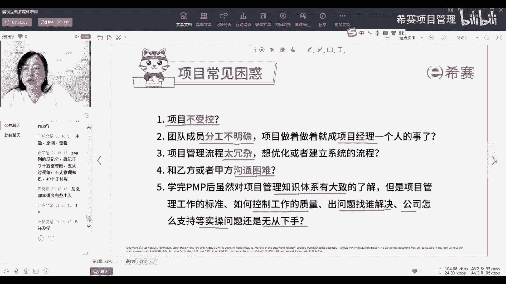

帮大家解惑呢，如果是项目不受控，我们就有分阶段管理和例外管理，就是一次管理一小块，然后这一小块呢给相应的人授权，让他们去管理，如果在他们能力所能及的范围内去管理啊，如果是分工不明确。

我们就从组织的层面就来梳理一下，谁应该做什么事，在他这个职位上，他可以做哪些事情，他应该做哪些事情，那关于流程太冗杂的情况呢，我们就可以考虑我们的七个流程，就从七个流程入手，不需要太多的流程。

然后还有一个裁剪，就是相应的去简化一些东西，或者是去增强一些东西，去做一些调整，那如果是沟通困难，其实为什么有时候会沟通困难，再想一想，是因为大家都方向不一致，你没有一个共同的方向。

这样的肯定就是你说你说的，你你一直在讲啊，这个交付起来很有难度，他一直想的是交付了才他才能实现价值，所以他肯定就会推着你去交，但是我们就需要从商业论证的角度，因为商业论证就是要考虑各个相关方的利益。

你如果各个相关方都能达成统一，那你后面大家提到的这个点大家都是一致的，你沟通起来自然自然也就会排除掉一些困难，那关于我们怎么样去实操，其实就是我们刚刚讲的3742，你把这3742都学好了。

就往流程里面套，往主题，抓住每一个主题的重点，然后往流程里面去套，往我们的工作里面去套。

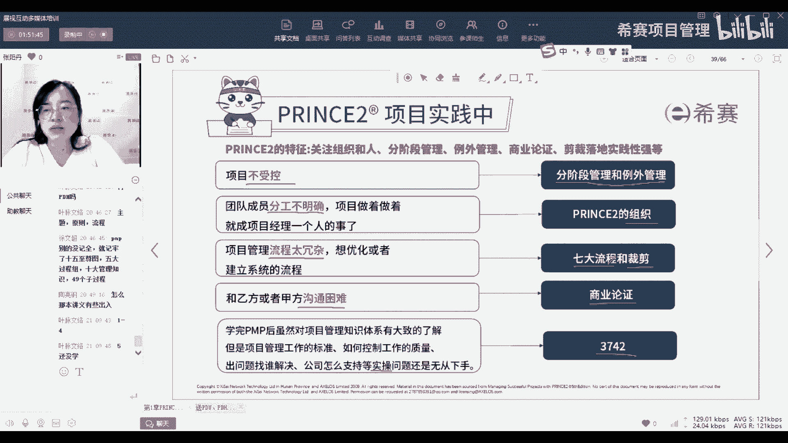