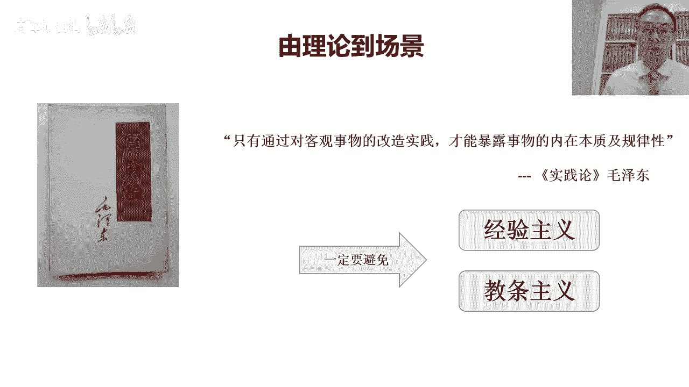
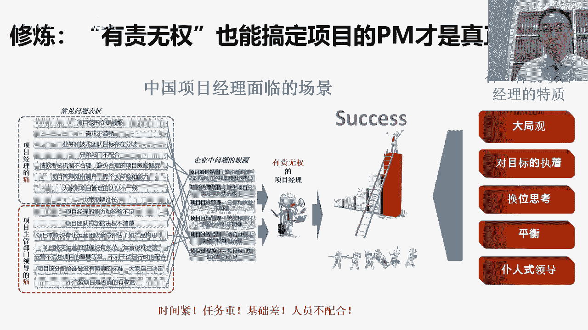
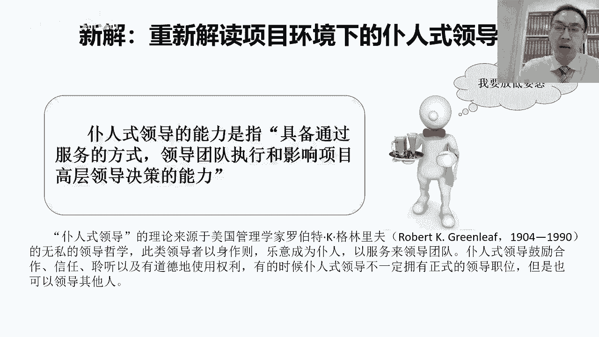
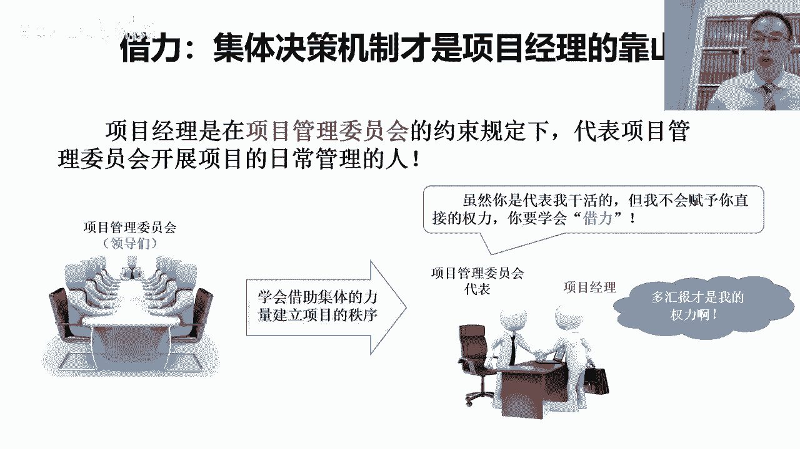
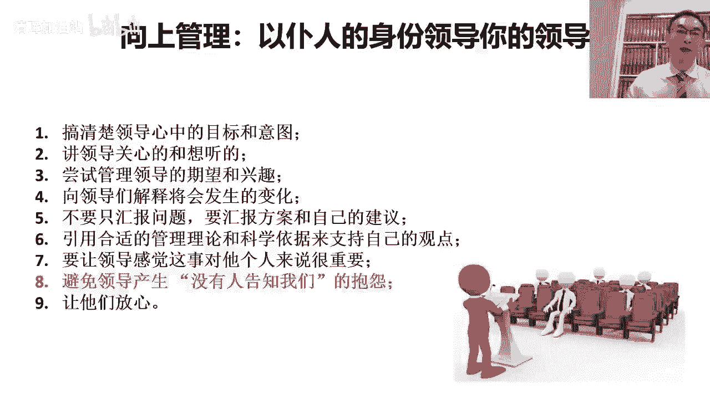

# “拍马屁”是对 “PMP”最深刻的注解 - P2：第二集-“拍马屁”是对 “PMP”最深刻的注解(0) - 清晖加油站 - BV1UG411P7ky

和成长，在我们的这个进行系统化的项目管理，实践的过程中呢，他一定会遇到一个问题，就是关于项目经理的角色定位的问题对吧，第二个项目经理的这个中国的项目经理，跟国外的项目经理是不一样。

那这一点呢其实也是这个项目管理方法呢，在中国企业里面落地是最难的一点，就刚刚我们有提到啊，那在西方的项目管理呢，它的这种项目经理和项目管理的环境，其实比这个国内的项目经理的环境，要好太多太多。

对这一点呢这个之前的时候，因为早年在外资公司的时候特别有体会，尤其是当从管理成熟的外企那，跳到了这个管理不成熟的中国的企业的时候，我们会有一个巨大的落差，这种落差呢就突然发现。

我原来在企业中能够去建立的，这些制度流程都没有了，大家对我的默契的配合突然都消失了，变成各种不理解，各种不配合，那这种环境的落差呢其实恰好是中国，现在其实大多数企业它的项目管理。

组织体的项目管理成熟度其实是很不成熟的，它的组织级项目管理成熟度是很成熟的对吧，我说企业组织级的项目管理成熟度越高，当项目经理越容易，为什么呢，因为大家知道组织级项目管理体系建设的目的。

其实就是为了降低项目经理，个人开展项目工作的难度系数对吧，把很多原来需要靠项目经理苦口婆心，说服大家达成共识的事，变成一个既有的项目的制度和规则对吧，而且呢通过所有的人在企业中前期的学习，对吧和训练。

让这些人其实就已经知道对吧，按照项目管理的要求做事情其实是理所应当的，那这个时候，其实项目经理开展项目工作就会变得很容易，或者即使项目经理自己不太懂项目管理，但是因为整个的项目管理的环境已经具备。

大家的配合度很高，那把项目做砸也不太容易，但是我们国家现在大多数企业的现状是什么呢，其实是组织级项目管理程度很差，那这时候项目的成功对吧，他不是靠组织的能力成功的，他都是靠项目经理的个人能力成功。

所以这时候呢对项目经理个人的要求就很高，所以呢我一直都有一个体会啊，就是说其实外资公司，尤其是外资成熟企业的项目经理，他其实个人能力比国内这些非常不成熟的人质，企业的项目经理的能力水平。

其实是要差很多的对吧，因为呢这个从项目组织级项目管理角度来去看，这个西方的成熟的企业，他的这种项目管理的环境，就像一个温室一样对吧，因为各种制度体系很健全，项目经理能轻易的找到各种不同的制度，来去对吧。

来去这个影响和管理不同的相关方，而且大家会很配合，因为大家其实不是为了配合项目经理，只是为了遵守公司制度要求，而避免被惩罚而获取激励，但在国内的企业中，很多企业中，项目经理的这个项目管理的考核不健全。

激励不健全，项目经理的角色职责也不清楚，然后项目团队成员，大多数都是在科层制的管理之下对吧，更擅长只听自己的直线领导，而不听别人插手自己的工作，在这种长期的被这种文化的训练的过程中是吧。

我们项目经理要还想能够跨职能的，甚至跨企业的把一帮人组织在一块，形成合力，把有挑战性的项目做成功，尤其是这个用着别人的人，干着自个儿的事儿对吧，然后而且还用的很顺手。

这样的项目经理对我们来说都是神一样的，项目经理是真正的高手，换句话说具有卓越的领导力，完全靠自己个人卓越的领导力，打通了跨智能的障碍对吧，然后把人整合到了一起，这就是我们所说的领导力。

如果这样的项目对吧，再增加上几个条件，时间紧对吧，一般人完不成点任务重对吧，任务重活还巨多，很复杂，很有挑战，可能好多事还都没干过，第三基础差对吧，我说这个项目的人员能力水平比较低对吧，高手不多。

然后大家水平一般，但是我们的任务却很这要求却很高，换句话说作为一个优秀的项目经理对吧，我们得能带着一群平凡的人，干出不平凡的事来对吧，这时候我们说对项目经理要求就更高了，再有一点呢。

关键这帮人还不太配合，为什么，因为这帮人之前在长期的时间里面，都是只听自己那个直线领导的，换句话说谁给自己发工资，自己听谁的对吧，而且在自己的职能部门中都被管的服服帖帖，大家轻易不敢不听自己领导的。

我们说在这种情况下对吧，组织级项目管理机制没有对吧，接力的制度要求没有，然后我们又从大领导那领了一个对吧，时间巨紧，任务巨复杂，然后呢人员基础巨差，而且人家还不爱听你的，在这种情况下。

我们还能够把这个项目做成功，我们说这是项目管理真正的高手，但其实这也是我们说项目经理努力的目标，那在中国，如果我们希望成为一个优秀的项目经理，其实我们要做到这一点，换句话说没有权利对吧，但是我们要责任。

没有权利，有责任也能把事干成话说呢，为什么需要有责任啊，大家知道这个项目经理他如果连责任也没有，对我们说没有责任，没有权利，那项目经理根本就没有干这件事的理由，有责任，至少项目经理再去张罗别人。

配合自己工作的时候，他至少有理由，这个理由是我有有责任干这件事对吧，因为什么大领导把这事派给我了，大招有时候没有权利的时候吧，就得多干那狐假虎威的事，狐假虎威的事呢，就说其实我现在组织大家干的事。

它不是我的事，他是大领导派给我的事对吧，所以很多时候，项目经理，他必须得知道自己的项目的发起方是谁，因为通常这个项目的发起方，他一定是个大领导对吧，我们有时候得打着大领导的旗号去做事对吧。

我们很多时候说这事不是我想找你做对吧，是领导要求我找你做，这时候力度不一样了啊，所以很多时候呢说这个事儿的目标，都不是我定的对吧，这是大领导分派下来定的对吧，即使我不愿意，也没有用。

因为我们还得服从领导安排，所以很多的时候呢这个责任很重要，责任是什么呢，是大领导派给自己的啊，自己拿着大领导派给自己的责任去张罗，一些人做事情比自己没有责任，张罗起来更容易，因为至少自己还有个名分对吧。

至少靠着名分也能去组织大家，而且很多的时候呢，我们还要靠着这个名分给自己争取权利对吧，我们说话连责任都没有，就更没有争取权利的理由了，所以呢这个在中国呢这种环境下，绝大多数企业真的是绝大绝大多数企业。

大部分项目经理开始项目的时候，都是有有责无权开始的对吧，因为有了责任，所以得干这个活，得张罗大家对吧，因为没有权利，所以要多动脑筋，多锻炼能力，那我自己一直认为，那是说其实吧权力越大吧。

人越容易变得无脑是一吧，他可以简单粗暴的靠权力去推动事，就不用动太多的脑筋了，但是呢越是有责无权的环境对吧，责任大还没权利，还不得不把这事干成，那这时候呢其实越锻炼项目经理的能力，因为逼得我们对吧。

要去想出来各种不同的方法把这件事干出来，而不能简单粗暴地依赖于权利对吧，去强迫别人做事情，所以这时候呢因为有责无权的环境呢，它其实往往能够使我们的项目经理变得更智慧，对吧。

能把项目经理的领导一个观点出来，什么是领导力呢，我说如果靠考核激励，简单的去去要求别人做事，那不叫领导力，那叫管理，领导力是什么呢，领导力的概念是说我们即使不用考核激励对吧，我们靠个人魅力。

让别人发自内心的去认同自己的追求想法，和自己这种做事的方式，然后通过这样的方式去带领大家，去干一个谁都不太熟悉的事，这个实才是领导力，我们借助公司的原有的管理机制对吧，然后去管着大家。

那时候不是大家怕怕这个领导，大家其实怕的是违反公司错误受惩罚，是因为大家想在这个组织继续待下去，这时候锻炼的不是领导能力，是管理能力，他这种维护秩序的能力，但是优秀的项目经理要锻炼的是领导能力。

领导能力的概念就是说在没有秩序的地对吧，我们能够建立秩序，能够建立秩序的原因是什么呢，是因为大家信任我们对吧，愿意跟我们共同的去建立一个约束大家的秩序，那在这种情况下，他其实才是练的是一种领导力。

这种领导力是首先基于要有责任心对吧，所以要有责对吧，然后呢因为我们要靠领导力，所以就不能给权利对吧，给了权利，大家领导力可能练不出来了。

简单粗暴的靠权力推动事情，那万一再推送错了，就把自己搭进去了，所以有的时候吧有责无权也不一定是坏事，因为有责无权吧，想犯大错不太容易，大家知道这个最怕的是什么呢，权力很大，权力越大，风险越大。

犯大错的机会越多，所以对于项目经理来说呢，我倒是觉得有责无权其实是一种保护，可以让项目经理呢既有成长的动力，但同时呢又减少了犯大错的风险，呃唯一的缺点呢就是比较内心，这个一直以来在中国呢。

你想干好项目经理这事是一个比较费心的活儿，操心对吧，因为没办法简单粗暴的靠权力解决问题，然后组织机制呢又不给力，然后呢这个事不好干，所以呢那只能靠锻炼我们的内心对吧，然后呢靠我们的智慧去解决。

那别人解决不了问题，所以呢其实中国这种有责无权的场景吧，那如果我们想在这种环境下想把这个事干好，那其实首先对吧，我们刚刚讲的时候，首先我们要认得这个有责无权的环境，而且呢我们要明白是说呢。

在这个有责无权的环境之下呢，我们其实可以通过实践去，把我们的项目管理方法，其实逐步的去落地的对吧，避免纸上谈兵，然后呢避免纸上谈兵，认同我们有责无权的环境，那接下来呢当我们要想当好项目经理的时候呢。

对吧，我们要接受的另外一点就是，我们要去做仆人式领导，本人市领导这个词呢也是来源于美国的对吧，不是领导这个词来源于美国的一个管理学家，对，就这个罗伯特k格林里夫，那他呢其实当时提出了一个观点。

就是说呢有一类的领导呢，我们可以把它称之为叫仆人式领导对吧，然后呢这一类的领导呢，它具备通过服务的方式，那在这个过程中呢，我们会发现了这个仆人式领导呢，他不一定有正式领导职位，然后呢他也不一定有权利。

准确的说应该没有权利，但是呢他可以通过呢这个就把姿态放低啊，通过服务别人，然后呢在服务别人的过程中呢，去影响别人的思维和判断对吧，然后让别人认同自己的观点，然后那通过这样的方式呢对吧，建立信任。

换位思考，然后呢影响很多对吧，专家型的人比我们职级高的领导对吧，愿意去支持我们的想法，帮我们做事情对吧，把他们的资源和权力用在我们想做的事上，那这个时候呢其实才能真正的做到仆人式领导。

所以呢如果想做到普瑞士领导呢，他首先得有一点，就是说我们也能学会放低姿态，这个呢其实对很多的嗯，技术出身的项目经理来说，其实还挺有难度的，因为吧这个很多的时候呢，这个一个是做技术出身的项目经理。

再一个就是专家型的人才，他很多的时候呢嗯往往不容易放下面子，就是说呢自尊心呢比较强啊，自尊心强呢，其实我一般会认为啊，他其实说明了内心还不够强大，按照这个通俗的讲，有的时候其实脸皮厚啊。

也是一种内心强大的体现，很多的呢这个技术出身的项目经理和专家呢，就是因为脸皮不够厚，所以很多的时候呢很多低姿态的事吧做不出来，但是低姿态的事做不出来呢，他有时候就跟别人之间他总会有一个隔阂对吧。

就他这个关系没有办法拉近，这样信任建立不起来，那这个呢我们说的在这种情况下，他其实做技术专家没问题，大家都做一个工程师和一个技术专家对吧，自己干自己的事，他不需要跟别人打交道。

当然不用放低姿态之类这些事，但是如果我们干的是一个项目经理啊，尤其是一个仆人式领导师的项目经理，那我们需要主动跟别人拉近关系，跟建立信任对吧，那就不能太自我，不能说哎我自己干自己的。

我不关心别人的事对吧，我练好自己的专业，练好自己的技能对吧，别人不管怎么看我都无所谓，这显然不适合当项目经理，为什么呢，因为项目经理是要把不同的人整合到一起对吧，然后呢你要能获得别人哈斯内心的认同。

那这时候呢我得首先换位思考，能理解别人，然后这样人家才能理解我，然后双方还有结合点，心里才能建立起来，那很多的时候项目经理呢，你为了去主动建立新对吧，他要首先放弃资产，我一上来就趾高气昂的去了。

那这时候别人的，他肯定一开始内心就不容易接受嘛，他懒得理你嘛，所以这个时候其实就不容易建立信任关系，所以呢能够放低姿态啊，这个把脸皮变得稍微厚一点，按照这个我这些年的体会，就是说吧。

其实这个其实可能也许话不应该这么讲，但实际上呢，其实脸皮厚并不是一个丢人的事情啊，放低姿态也不丢人对吧，很多时候我们其实是为了组织大家，做一个对大家都有好处的事情啊，我们去为了实现一个有挑战性的目标。

很多的时候首先放低姿态的人，往往是那些内心强大的人，拿着大招，这个敢于放低姿态，说明我们的内心足够的强大，我们不会轻易的内心受到伤害，在这种情况下呢，我们敢于示弱对吧，大招。

很多的技术型的项目经理或者专家型的人才，因为做不到敢于示弱，所以呢就很难获得别人的认同和支持，那项目经理呢一定要学会是说通过示弱对吧，然后能够去获取别人的信任，获取别人的同情，获取别人的支持对吧。

这样的话我们才有机会呢对吧，把不同的有专业能力的专家对吧，有权利和资源的领导，那把他们能够去整合起来，去实现我们共同的目标，所以呢这个简单的讲呢，就是项目经理一定要学会示弱对吧，敢于称赞别人。

敢于承认自己的不足对吧，大家一定要知道，如果一个非常完美的项目经理，他是不需要借助别人的力量去做项目的，我们最怕的就是什么呢，有些项目经理呢总要在自己的项目中，那证明自己比所有人都厉害都强。

那这样的项目经理他不需要别人的支持啊，那站在项目成员的角度来说，你这么厉害，还需要我们做什么呀，对吧，那就那你自己做吧，那我们都等着看看你能做成一个什么样子，那这样的话其实我们说他就不是团队管理了。

他变成了唱独角戏了，但其实我们说优秀的项目经理的工作，并不是证明自己比所有的项目成员强对吧，优秀的项目经理是要证明，是说所有的项目成员你们都很厉害，我们的项目得靠着你才能把这件事做成功。

而不是全靠项目经理，对项目经理是干什么的，项目经理在项目是打杂的，项目的成员跟领导们，他们才是真正有价值的人对吧，所以呢这个项目经理要保持这个心态是什么呢，就是我们一定要给别人展现出来的一个心态。

是说一个项目做成功，功劳都是领导们的对吧，领导们的英明决策对吧，领导们的方向正确，然后领导们提供了资源，给予了足够多的支持，所以功劳是领导的，第二呢，我们说苦劳全是项目成员的呀，是因为大家加班加点。

额外的付出，额外的精力，才让我们的项目呢对吧，由原来的不可能变成了可能，所以呢功劳是领导的，苦劳是大家的，那项目经理是干什么的，我们不过是打打杂对吧，我们不过是说呢对吧，我们这个因为我们的能力不足够强。

所以我把大家组织在一起，把事干成了对吧，我们更多的是来服务大家的，给大家打杂的，我说这样的项目经理呢，他更容易获得大家的认可，大家才爱跟他做项目，大家最怕的是什么呢，大家辛辛苦苦做完一个项目之后。

功劳全让项目经理自个儿领走了，那这以后就没人跟你一块做项目了对吧，我说如果项目经理在项目团队里面，整天老惦着指高气昂的对吧，这个数了这个数的那个觉得你们都不如我强，那这时候呢大家就都等着看呗。

那你自个儿去做吧对吧，我们看你到底有多强，能不能一个人把大伙的事都干了对吧，再不行的话，我们还能给你对吧，我们还能给你使使绊对吧，给你制造点障碍，比方你那么成功的证明力比我们都强。

所以呢这个要想当好项目经理呢，大家首先要学会当好仆人式领导对吧，要尊重项目中的每一个人，要认可每一个人在项目中的价值，而且要把自己的对大家的认可传递给大家，这样的话其他的人呢对吧。

他才能很有激情的在项目中工作，然后一定不要自己去抢项目成员的风头，也不要去抢领导的风头。

这样的话呢，其实才是真正的一种项目经理的心态，除了这个项目经理的这个心态之外呢，我们说仆人式领导的姿态呢，还有一点呢，其实我们在项目过程中，项目经理也是必须要去锻炼的，就是关于的这个如何在项目中啊。

借助集体的力量来建立项目秩序的这件事，按照这个项目管理呢来源于西方对吧，来源于美国，那项目管理的这种工作方式呢，它跟职能管理是用来互补的，他俩最大的区别就是在于呢，其实这个职能管理科层制啊。

他是领导负责制，团队领导负责制，就是团队成员的sper都算领导的，所以呢领导有权利，他有责任的责权是被等的，但是项目管理呢，它其实跟职能管理的方式吧它不一样，所以他才能互补，项目管理的方式是什么呢。

项目管理的方式，真正的决策不是在项目经理身上，项目经理不负责决策，项目中的决策，它其实是集体的，为什么呢，他跟这个事儿有关系，项目管理呢跟传统的工作，运营类的工作最大的区别，就是说传统的运营类的工作。

干的是大家熟悉的工作，那熟悉的工作呢他一定就有经验的人，那通常呢企业会把最有经验的人呢变成领导，然后让他看着大家，然后去带着大家，然后这时候呢大家不容易犯错，因为最有经验的那个人，他负责看着大家。

谁如果犯错，他会制止，而且他会教大家如何不犯错，所以呢往往就是有经验的，但没有经验的，所以在这种情况下，有经验的对没有经验的负责，这样他才能够让有钱的人去不断的培养，没有经验的人。

但这是传统的常规性的管理，项目管理的刚好是反着的，项目是创新的载体，项目上所承载的工作呢，其实往往都是大家不熟悉和不擅长的，就是我们说的创新类的工作，当我们其实组织一群人去干一个，创新类的工作的时候。

坦诚地讲，没有任何一个人有绝对的把握对吧，可以去决策项目中的每一个点都是对的，但是而且还有一点呢，这个带队的人吧，如果自己做了一个决策，一旦犯错了，大伙就不信你了，因为本来这件事可能将来到底怎么干。

是对的，都不知道对吧，大家开始首先将信将疑的跟着你去做事情，就后来发现你带头做了几次决策都错了，那这时候就没有人信你了，那这时候这个团队就会散的，但是很多时候创新型的工作他不可能不错呀，对吧。

我们有一句古话叫失败是成功之母，没有失败过怎么能成功呢对吧，就算是说第一次做可能就成功了，但是因为并不是没有对比，我们就不知道什么叫成功，可能还得再失败两次再想，哎呦，发现哦，原来第一次是成功的。

所以呢这也意味着什么呢，做一个创新型的工作，他一定会经历失败，然后取得成功，那如果是说前几次失败，责任都算在带队的人身上，那这时候那很有可能还没有等到成功的时候，大家就不跟这个带队的人一块干了。

所以大家觉得你这净给我往沟里带，没有人信了，所以呢为了避免这种问题的出现呢，在这个开展创新型的这种工作，进行这种团队组建的时候呢，那往往呢我们把犯错误的机会留给谁呢，留给了集体，换句话说呢。

这种创新型的组织啊，承载这种创新工作的这种组织，就是我们的项目，真正的决策来源于集体决策，什么叫集体决策呢，就是项目中所有的相关方共同的决策，再换句话说呢，要错大家一块儿错，算大伙的对吧。

大家的错就不叫错，大家的错叫在那个状态下能做出来的，最好的一种选择，但是如果是个人做决策，个人做的决策往往有可能是错的，可能即使是对的，也有可能会被大家认为是错，所以干创新型的工作的时候呢。

这边这里面会有一个会有一个经验对吧，集体的错不叫错，叫对，个人的对不一定要对，可能也叫错，为什么呢，大家知道，因为管理没有绝对的对和错，即使是在当前的时间上，我们看起来可能是一个非常正确的事。

很有可能再过一段时间我们再返回来去看，可能我们能想出一个更好的方式，那这时候当初的对可能就变成了错，所以呢这个为了避免对吧，个人领导啊因为犯错而失去大家的信任，所以我们会把这个决策这件事呢给到了集体。

集体是代表大家对吧，就像我们国家一样，国家的最高决策是什么，它其实都是代表我们全体人民的，他是全体人民的这种决策，那这时候呢算大家共同决策的，大家共同决策的，大家都要认嘛对吧，即使错了。

也是大家一块儿错了，项目也是一样，在项目在这个项目的这种建组织建设过程中，那在我们的项目中，我们叫项目管理委员会，项目管理委员会呢是代表项目中，所有相关方的集体决策机制。

他呢是拥有权唯一拥有权利的一个角色，所以项目管理委员会呢在这个项目组织中，他是个角色对吧，像项目经理是个角色，项目成员是个角色对吧，项目总监是个角色，项目管理委员会也是一个角色。

而且项目管理委员会这个角色他负责做决策，那项目经理是干什么的呢，项目经理呢，他其实首先第一他得组建项目管理委员会，因为并不是所有的项目，一上来都有项目管理委员会的。

很多的公司他可能没有专门的项目管理委员会，他可能都没有空去老管你这个项目的事，他是对整个公司经营负责，他不能只对你这个项目的结果负责，那这时候如果只有项目经理，而没有项目管理委员会的时候。

那这时候这个项目成败责任自然就落项目经理，脑袋差了，但这时候项目经理就会被巨大的压力对吧，可能还要自己拍板或者自己不拍板呢，那就要经过层层审批，既负责拍板，但同时又不用对这个项目的最后的成败。

负责的时候，那这时候他这个拍板就不一定会，非常符合项目的现状，所以为了避免这种问题呢对吧，避免这种项目经理对吧，既有责任对吧，又没有权利，可能还老被项目背锅，那为了避免这种现象呢。

其实项目经理应该按照一个正确的开展，项目管理的工作方式来做，那正确的方式是什么呢，一定要去组建项目管委会，所以呢项目经理一定要学会张罗，项目管理委员会对吧，我们要去张罗项目所有相关方的领导对吧。

那因为有可能是甲乙方的，可能还得张罗客户方的领导，可能还得张罗供应商的领导，对我们把不同相关方的领导张罗在一块儿，形成一个集体决策机制，然后呢我们把项目中所有需要决策的事儿对吧，都是这帮领导们共同决策。

这帮领导们一旦达成共识对吧，项目经常锻炼的是，如何推动这些领导能达成共识的能力，如果这些不同相关方的领导都达成了共识，那意味着这就是集体的意志，集体的意志就是大伙的意志，那集体的意志一旦形成。

那项目经理代表集体啊，去给其他的人传达集体的角色和要求的时候，这时候没有人会去违背这个的，因为他如果违背这个要求，证明他违背了整个集体的秩序，他会被集体所抛弃的，一般没有人敢干这种事。

但是如果没有项目管理委员会，项目管理推行的任何的要求，可能别人都会认为这是项目经理自己想出来的，这时候大家可能就会逆反对吧，跟项目经理关系好的，我就帮你做了，是因为这个对吧，因为咱俩关系好。

那对项目经理本身不信任的，那就欣赏你，凭什么命令我要求我做事情，所以呢项目经理呢在真正的项目管理中，很多的时候不是代表自己，他必须要代表项目管理委员会对吧，然后项目经理对别人提的要求，不是项目经理提的。

而是传达了委员会的要求，那如果项目经理想让项目中的某一个人做事情，他理论上的方式应该是，先给项目管理委员会递交一个方案或一个建议，那如果说服了项目管理委员会，认同了自己的方案和建议。

那这个时候这个方案和建议，就不再是项目经理的方案和建议，而是项目管理委员会的一个决议或一个决策，那项目经理就可以理直气壮地，代表项目管理委员会，把项目管理委员会的决议，去传达给那个负责落实的人对吧。

然后这时候那个人其实不是执行，项目经理的要求，而是执行了代表集体的项目管理委员会的要求，对吧，那这个时候其实那个人负责执行的人，多半不会去拒绝，因为他不能拒绝所有的领导以及集体的要求。

所以呢项目经理呢再返回了，项目经理呢，要学会的是说学会借助集体的力量对吧，帮助我们去建立让项目受控的秩序，可以去约束项目中不同人的行为，去推动不同的人，去向着我们所需要的方向和目标而努力。

但这个的前提是，项目经理要能，首先啊能够去张罗项目管理委员会，当我们在张罗向管理委员会的时候呢，我们要举着谁的大旗呢，我们要举着项目发起人的大旗对吧，他一定是有一些高层的领导，他发起了一个项目。

赋予了项目经理责任，去张罗其他的这些领导，相关方的领导，形成一个给项目做决策的集体决策机制，就是我们说的项目管理委员会，然后项目经理呢，通过给这个项目管理委员会做汇报对吧，做建议，提供各种方案。

去影响项目管理委员会，对项目它本身的认知和决策对吧，然后如果项目管理委员会做出的是项目经理，就认同了项目管理，项目经理递交的方案，而把它变成了项目管理委会的一个决议的话。

那这时候项目经理就可以顺理成章的，借着项目管理委员会的这个决议，去推动项目中所有的相关方对吧，然后呢按照项目管理委员会的要求去做事情，通过这样的方式呢，项目经理才有可能真正的为这个项目去。

建立起来一个秩序，这个秩序是所有的项目成员，服从项目管理委员会要求的秩序对吧，这个秩序是项目经理，可以通过影响项目管理委员会的决议，来去组织大家对吧，遵循项目中的秩序。

以及朝项目的目标努力的这样的一个状态，所以呢项目经理呢，一定要擅长组建项目管理委员会，给项目管理委会做汇报，通过汇报的方式对吧，然后来去名正言顺的去影响项目中，不同的相关方的行为。

所以呢就像我们这上写的这样，多汇报，这是项目经理最大的权利对吧，项目经理最大的权利，不是替项目管理委员会去拍板，项目经理这个角色往往是不拍板的，我们要把拍板的这个重任留给集体，因为集体错不叫错。

个人做个人做错了一定是错，有时候个人做对了可能还都是错对吧，所以项目经理呢都通过汇报的方式，影响项目管理委会的决策啊，然后用借助委员会的力量推动项目的进度。

同时确保项目过程手工。

