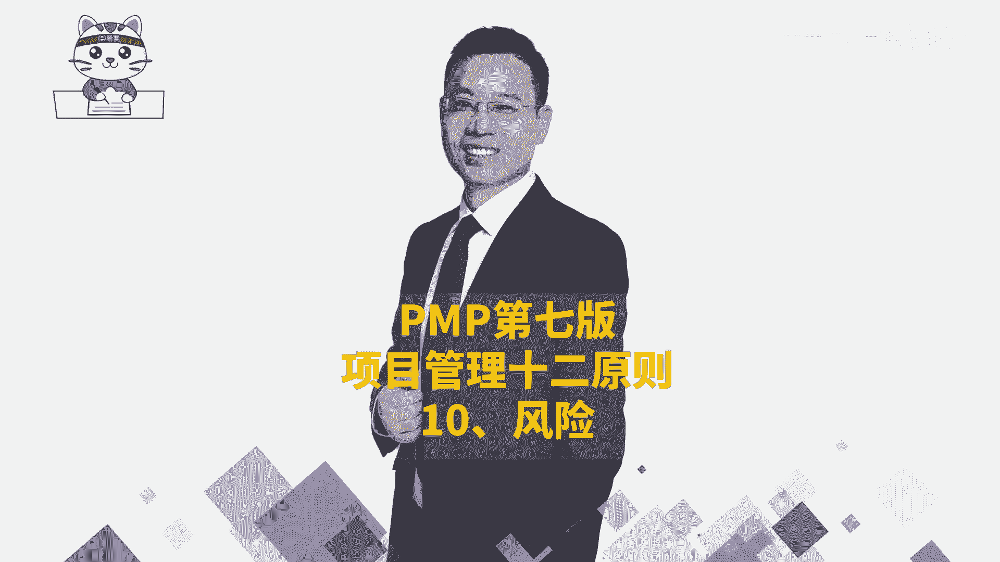
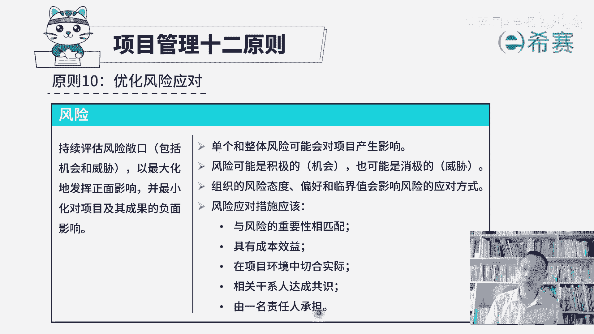
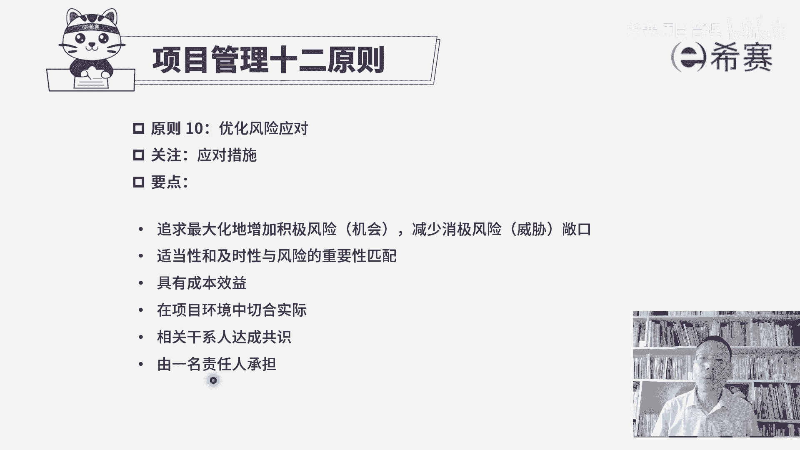

# 【收藏】2024年PMP项目管理考试第七版精讲视频《PMBOK指南》学习教程！零基础入门！ - P11：PMP第七版项目管理原则之10风险 - 希赛项目管理 - BV1gcpMeRE5C

项目管理实验原则的第十条叫优化风险应对，它的焦点是关于风险，风险管理，我们在前面已经是学习过，所以呢你再来看这一段会非常好理解，他说我们要需要去持续评估风险的敞口，包括机会的敞口和威胁敞口。

所谓风险的敞口是指说没有被管控起来的风险，我们需要去持续评估，因为有一些曾经觉得不重要的东西，或者不那么重要的东西，可能突然又变得重要了呢，所以才要持续评估，而目的是什么，以最大化的去发挥正面的影响。

也就是让机会让这样一个正面的影响越大越好，并且呢是最小化的，对项目及其成果的负面影响，就这样负面影响越低越好，所以整个项目中说，单个项目的风险和整体项目的风险，他是可能会对项目造成影响的。

所以我们得要了解一下什么叫风险，风险，它是一个不确定的事件或条件，它一旦发生会对项目造成影响，包括积极的影响，我们也叫忌讳以及消极的影响，也叫威胁，当然在生活中，其实啊威胁更多，机会呢相对少一点。

但是它有多大影响呢，我给你讲一个简单的例子啊，就是在2023年夏天的时候，宝马车展上出现一个冰激凌事件，就是因为这个冰激凌的一个小小的事件，导致宝马公司，它的这个市值蒸发了180亿美元哇。

这是一个很大的一个影响好吗，所以你给他没想到说一个小小的冰激凌，会对自己导致有这么大的一个恶劣，这是对他来讲是一个很大的一个威胁，那同时呢这个事件发生以后，对于别的汽车公司，它却是一个很好的机会。

马上就有些公司推出来，我们这里有免费的冰淇淋，是免费敞开吃的这种冰激凌，OK这叫啪啪的去打了一个宝马的脸，就是这样一个情况对吧，所以你会发现其实项目中风险真的是无处不在，这个不确定性。

所以我们才说要去敬畏客户，敬畏规则，敬畏社会，对好，这里还有一条组织的风险态度偏好和临界值，它也会影响风险的应对方式，就是我们需要去应对风险的时候，采取措施的时候跟很多因素有关系，那比方说风险的偏好。

您是追逐高风险，高收益的，那么遇到一些风险的时候，我们就会说风浪越大，鱼越贵，但是也有一些人，他可能是那种风险厌恶型的，他觉得保住本金才是最核心，最关键最重要的对吧，还有就是这个风险临界值的大小。

如果说你把这个临界值设的特别特别大，你这个容许偏差特别大，那有可能一不小心步子迈得太大，容易扯着蛋，这就是一个很麻烦的事情，所以他需要根据公司自身的能力呀，然后处理事情的这种应对的水平呢。

方方面面来去考量，我们如何去界定这些风险临界值，我们去如何去应对这样一些风险，而在风险应对的时候呢，有这些点需要去考虑，首先第一个他说与风险的重要性相匹配，也就是说，如果说这个风险它本身不那么重要的话。

理论上来讲，你就不应该把它放到一个重要的位置，一般只有那些发生概率相对比较大，并且呢影响也比较大的风险，我们会放到前面某一些风险，它的影响虽然极其的恶劣，但是它的概率是0。0000。

000000001的话，那其实他也不会放到一个重要的位置，所以他的这个重要性是跟概率和影响，两个维度来综合考量，第二个呢我们的这样一个风险应对措施，应该是具有成本效益的，这样一个考虑，什么意思呢。

您去处理这个风险，如果说你所花费的代价有这么多，但是处理完风险，它所导致的这个损失的减少只有这么多，那你其实就是得不偿失，所以我们要去有这样一个投入，产出比，要综合考虑成本和效益啊，第三条说。

风险应对措施应该是在项目环境中切合实际，那肯定是什么，我们应应该因时制宜，因地制宜嘛，并且呢他要与相关方来达成共识，我们这种处理方式应该是大家都认可和一致的，最后一条，有一名责任人承担。

其实我们在前面讲风险管理的时候，没有特别去专门讲，但是在风险中我们如果识别到大量风险以后呀，在整个风险登记册里面，其实有一栏叫风险责任人，也是关于这一条风险该谁来去负责盯着他。

因为风险是一个不确定的事件或条件，它未来可能发生，它也可能不发生，那总得要有人去盯着，并且如果它发生了以后，要有人去有效的应对和管理，所以需要有一名责任人来去承担这样一个风险。

来去盯着，那整个关于优化风险应对呢，它其实讲的是面对风险，我们要去找到相对应的应对措施，整个风险管理的目标就是，让积极的风险或者叫机会越大越好，让消极的风险或者威胁越小越好，那我们再去应对风险的时候呢。

很多因素都有关系，包括说成本效益呀，包括说适当性啊，重要性啊，及时性等等，这些东西都是需要去考虑的，并且是在当下的环境中来切合实际的去做风险，应对，应对方式应该是跟大家达成某种共识。

有专门的一个风险责任人，这是关于项目管理原则的。

