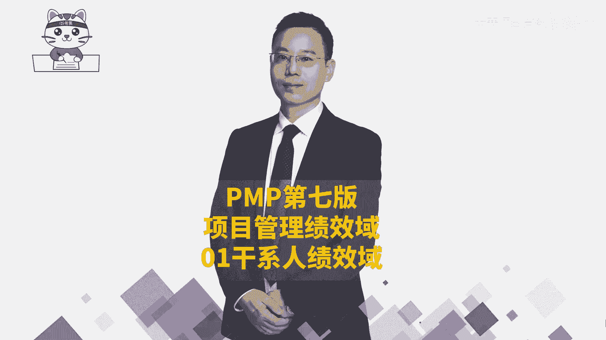
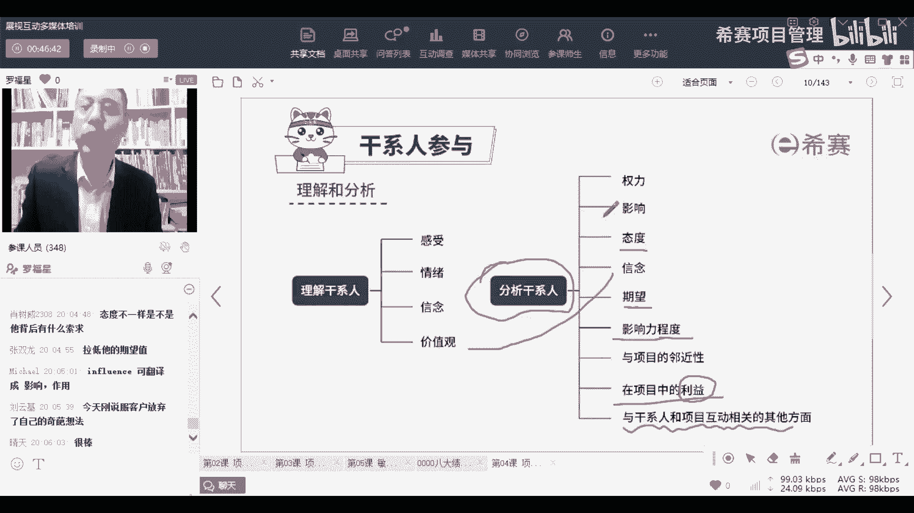

# 【收藏】2024年PMP项目管理考试第七版精讲视频《PMBOK指南》学习教程！零基础入门！ - P15：PMP第七版8大绩效域之01干系人绩效域-中 - 希赛项目管理 - BV1gcpMeRE5C

好了，至少你知道就说我们做干系人参与的，他也会有一套流程，也有一套流程来做事情，第一步，第二步，第三步，第四步，而整个要做这些事情的话，结果其实是希望他能够更好的支持这个项目。

所以你看一下整个干弦参与他要干什么，就是要想办法通过一定的策略来去，促进他更好地参与这个事情，能够让他更好的去支持这个项目往前推进，哎这就是干线参与他要干的事情，那我们分别展开来看一看，首先你要去识别。

你尽量多地识别干系人，你如果没有识别到一些重要的干系人，或者有可能某一些干系人你没有识别到，结果漏掉的话，有可能会导致一个巨大的问题呃，比方说在早两天的时候出现一个事情，就是那个宝马的冰激凌事件。

大家有关注吗，你想就是那么一个小小的冰激凌，能够让它市值蒸发180多个亿，这是什么概念，太过于那啥了，是不是就是太太过于哼哼，太过于自信，完全没有去识别到这个现代的这个时，这种新的时代，这个自媒体时代。

这个干系人对吧，他何苦要这样去搞，所以在前期的时候，我们要尽量多的去识别干系，因为你不知道哪一些人他有什么关系，你比方说嗯有一个不太恰当的例子啊，就说公司来了一个新员工，一个小伙子。

然后我就跟我就负责带他，我就跟他说那个谁谁哈，我们叫他什么什么啊，就讲了他那个那个那个谁是谁，他又是什么什么什么，我们要讲他如何如何啊，那个那个秃头啊，我们都说他是个最抠门的铁公鸡。

然后那个小伙子就说那是我爸，我叫我叫他爸，那你说我尴尬不对吧，这就是很典型的没有识别到干系人，关键是那个秃头那个铁公鸡诶，他是我们公司老板，所以你会发现有些事情，有些时候。

有些事情就是你你不要就是我们说什么，要谨言慎行，谨言慎行，你不知道哪里会有坑，要稍微还是要稍微修养好一点对吧，那么在这里面的话呢，在做项目的时候，你要前期要尽量识别一些高层级的干系人，就是一些领导啊。

领导的领导啊，客户啊，客户的领导啊等这些重要的人，你是需要去识别的，项目的客户和项目的发起人，他是不是同一个，不一定不一定，你不用那么着急，跟着慢慢来，OK啊，然后我们去识别到这个群体。

然后随着时间往前推进，你可能会认识到更多的干系人，那么这里面呢给了很多信息，我们来稍微认识一下啊，首先认识一个词叫发起人，发起人是谁呢，相当于是发起这个项目的人，如果说这个项目是一个内部的项目。

他就是你的领导，就是你们公司的某一个领导，他任命你，比方说哎呀小丸呐，你来做这个项目的项目经理对吧，或者是小蒋啊，你来做这个项目的项目经理，或者是小林啊，你来负责这个项目诶，这个给你任命的那个人。

他就是这个项目的发起人，他会给你授权，给你任命，并且给你一定的资源和资金，让你去管理项目，所以发情是一个层级非常高的一个角色，你知道吗，是一个层层级比较高的，我们经常说有事要抱大腿，他就是你的大腿。

理解了没有，他就是你大腿就是你的靠山，你在做项目的时候，有一些什么重大的事情，搞不定的时候，你就可以去抱大腿，但是同时你也需要去注意一个点，就是那些芝麻芝麻绿豆的小事情，你就不要去找他。

他没那么多闲工夫去答应你，他很忙，他是领导，知道吗，所以一般很多事情都应该是，你作为项目经理去管理好，而不是要去烦扰它，应该是这样一个逻辑啊，好就是这样一个干系人，然后呢。

还有一个呢就是当然我们后面会展开讲啊，很多东西都后面后面会展开讲，然后还有就是你的客户，那客户这就不用说了嘛，他都是出钱的人对吧，他都出钱的人是重要的角色啊，你要去满足他，当然客户里面就既包了客户本身。

也包含了客户的领导，还包含了客户的一些其他的一些什么什么人员，客户有可能有一些客户，他的关系很复杂，有没有，你们有没有有没有做过一些项目，客户关系很复杂，就是客户里面有很多呵层层叠叠之类的嗯，对不对。

还有呢就是你的项目团队成员，OK那你的项目团队成员，他一定是你的重要的干系人呢，因为这些人是会负责去完成这个项目的，会支持这个项目的，所以这里面的这个人群你都很重要，那你们的团队成员里面。

有没有一些人特别的懒惰呀，或者水平很菜呀，很水呀，不能做事情呢，有没有，我相信也是有的，那你怎么样去管理好他呢，也没有有一些人他那个恃才傲物，高傲得像只铁大大公鸡一样的也没有。

所以你怎么样去管理好这个群体，都是你很重要的事情，还可是最终的用户，你这东西做完了以后，最终给谁用，那个用的人他一定会受你这个项目的影响，那你要想好哦，像现在这个时代的话，因为这个传播实在是太过于快。

所以你如果做的东西太垃圾的话，别人转手就给你再发到网上面去，那可不是让你没面子，甚至有可能会让你增发180个亿，180个亿，同志们，还有一些其他的神奇的相关方，那刚有同学一直在问说。

客户和发行是不是同一人，他不一定是同一人，嗯你们你想一想，你们自己在做项目的时候，甲方爸爸他是某某单位对吧，然后你们自己来去接了这个项目，接了这个项目以后，是不是你们公司还有个领导，他来去任命你。

公司里面是不是还有个领导来去授权你，那个授权你任命你的人，他才是发起人，站在，如果说我们把这个项目往大一点去放的话呢，客户的那个老大他是这个项目的发起人，但是玩小一点去犯的话呢，你们自己公司的某个领导。

他是这个项目的发起人，所以你要看怎么看他，你明白你要怎么看，你只要知道谁能够出钱，并且谁能够给你授权，谁能够给你认命，客户他能够给你钱吗，客户他能够授权你任命你吗，所以你要看怎么看待，你知道吗。

并且客户里面有很多人，你想客户里面可能有100个人或者多少个人，他怎么能够给你去授权任命，所以不是完全不要把它搞对等关系啊，这个完全没有什么，没有对等逻辑性，没有对等逻辑性，可能是客户的某一个领导。

他是作为作为这个项目的发起人，也可能是你们自己公司的某个领导，一般很多时候是你们公司的某个领导，来去发起这个项目，来任命你来授权你，这是识别识别了这些干系人，识别了这些相关方以后呢。

接下来我们要去理解这些干干系人，理解相关，你看怎么理解他呃，这些理解的这些措施呢，基本上全部都是一些这种看上去有点虚幻的词，有一点虚的词，可能在你生活中，你都不知道怎么样去施展对吧。

比方说你要去理解他的感受，理解他的情绪，他的信念，还有他的价值观哇，这都是很虚的词，但是我们一定是每一个人都是有感受的，你有没有某一些时候，感觉看到什么东西都是闪闪发亮的。

看到什么东西都觉得哇今天无比的美好，当你心情特别好的时候，你看所有东西都会特别特别好，对不对，那有没有某一些时候你也是不想跟不想工作，今天特别不想上班，因为早上起床的时候脚踢了那个床床铺。

然后踢了一个床，脚脚都很痛，然后整个今天都不想去工作对吧，那么你可能会有很多很多这种不一样的感受，那么在做事情的时候呢，你要能够去关注客户的感受，还有客户的情绪，我们说人其实是一个情绪性动物。

就你心情好的时候，你情绪好的时候，你可能做事情的效率会不一样，你情绪不好的时候，他也会完全不相同，你怎么样去管好这个群体，它其实是一件很难的事情，还有就是他的信念。

或者我们给一个词呢叫加一个前面一个前缀，叫限制性的信念，呃，在心理学这个领域呃，我相信你们应该都看过我的解，看过我的介绍，是不是我还有一个title啊，我是国家二级心理咨询师，我是正儿八经去受过训的。

那么你知道人有很多的信念，有一个信念，我们叫我有有一种表达呢叫限制性的信念，什么叫限制性的心理呢，就是觉得说某一个事情发生，它就只能是这样的一个结果，而这就是一种限制性的信念。

事实上某一个事情发生以后啊，很多不同的人，他看待的东西是完全不一样的，看待角度不相同，但思虑是完全不一样的，也就是说事件本身是中立的，但是不同人他可以看到不同的面，也可以看到不同的解决方式。

以及不同的这样一个结果，那客户他的信念是什么，你是否能够去适当的理解他的信念，并且能够去动摇他的信念，尤其是那些对你这个项目有抵制的人，你能否去动摇他的信念，让他更好的去支持你啊，这是一个很难的事情。

但是是你要去做的事情，还有一个叫价值观，价值观这个词也很虚对吧，价值观这个词一般跟什么东西放到一起呢，啊按这种讲法的话呢，估计我今天能够讲两讲，两三个，讲两三个绩效率啊，但是没关系。

我们先试着用这种比较能够，讲清楚的方式来讲解呃，然后后面再花时间快速讲好不好，那价值观通常是我们先跟那个愿景放在一起，先愿景，然后呢呃使命，然后再讲价值观，就是你们公你们公司有一个什么样的一个使命。

我们想要做什么事情，然后呢会有一个大大的愿景，或将要做成什么东西，然后会有一个战略目标，那你要去达到这个战略目标，要达到这个愿景的时候，我们去做事情的时候呢，会有一套价值观来去支撑这个价值观。

他其实呃用一个比较简单的理解，就是说做事情的这些规则和底线，做事情的规则和底线，你有什么样的规则和底线，比方说有一些公司，他的价值观就是呃叫客户第一对吧，那么如果客你的价值观真的是客户第一的话。

那如果现在客户正在投诉，但是你们正在开一个重要的会议，你是继续开会，还是马上去解决这个客户的投诉呢，唉价值观他会去支撑你怎么做事情，那也有一些公司它的价值观是什么，是团结合作。

那你们的价值观既然是团结合作，而现在呢因为某一个新的政策，导致大家相互之间在撕扯，有利益的牵扯的时候，你该怎么弄呢，所以哎这东西其实会很重要，你需要去了解这些东西，但我们后面其实会讲到的啊。

后面会讲到的后面，因为因为他其实相当于是一个新瓶装老酒，把它重新过了一遍，重新装了一下呃所以在后面的干系人管理中，其实很多内容会去会去讲到，还有就是你要去分析一下干系人，你要分析他的权利。

比方他的权利是大还是中等还是小，还是没有权利呃，他的权利很大的话呢，你可能对他的方式是不一样的，呃有一个词叫拜高踩低，但是这个词我觉得不太好，我们换一种方式叫看人下菜碟。

看人下菜碟这个词好像显得不是很好，但是现实生活中你如果做事情，你连看脸色你都不会，你还能够做好事情吗，想一想自己可以去捋一捋思路啊，好还有呢就是影响力，那么他的影响力是什么，他的影响力是什么。

它能够影响多少人，他是影响会很大，还是影响比较重，还是影响比较小，我们经常有个成语叫人微言轻，人微言轻，什么叫人微言轻，影响力几乎为零，对不对，就没有什么影响力，那为什么宝马它不会给那个。

就是宝马那个车展上面那两个女孩，她为什么不给大家冰激凌，他也觉得大家都是人微言轻，其实对这个事情没有什么进展，没有什么影响，对不对，他没有想到这个东西的影响，后面经过互联网的发酵以后。

变那么大的一个一个一个结果出来，那么做项目的时候，我们中间也会有很多的干系人，他的影响力是什么样的情况，你也需要去了解，嗯OK有少量的词汇不一样，不影响你去理解啊，有少量的词汇不一样，不影响你去理解你。

只要你只要知道，就是我们的这个我们的整个偏僻的话，它跟小时候学的东西是不一样的，更多的是去理解这些路子，理解这些路子啊，好还有呢就是态度了，那么有一些人对于这个这个事件的态度。

或对这些人的态度其实会有很大的不相同，就是嗯怎么讲呢，就是有意识他会很很散，我不知道你们身边有没有这种人，就不管是任何一件事情过来，他首先想的都是一种很散的这种方式，呃，春药中，你不要这样去理解。

作用和影响肯定不是同一样的，不是一样的，但是呢我们更多的是去理解这个大方向的东西，这些小的内容它不会就考试嗯，呃这样讲吧，就你要信我，你要信我，你听我讲的就好了，好不好，你听我讲。

因为你的目的是能够学到东西，并且能够通过考试，我的目的是让你学到东西，并且通过考试，我和你的目的是一样的，所以你跟着我的节奏来是最好的，我讲完以后，你如果还没听懂，你再问我好不好。

这种方式可能会比较好一点好吧，不是不是某一个同学，是所有同学啊，是所有同学好吗，因为你的目的和我的目的是一致的，我希望你们可以可以更好的去学习，并且更好地通过考试，你只有通过考试。

你才会真的觉得我很牛逼，你才会真的是呃把我推荐给更多的其他的朋友，同事明白这个思路很简单啊，就是这个简单的逻辑，还有就是有同学会质疑啊，你讲课怎么怎么怎么样，我讲了这么多年课，也有那么多粉丝。

还是有我的道理的，所以你尽量去跟随我就好了，好不好，然后在我讲完这一批，甚至讲完这些东西以后，你还是没有听懂的地方，你再来问，这样可能会更好一点，好不好，我们用坑空杯的心态来去对待，来学习。

尽量去理解它，整个PNP考试他没有太多需要你非得去记啊，去背这样这个东西的，就是包括这些词汇，需要你去说干性的分析，我们要分析哪些东西吗，哎不太需要你去背诵，更多是让你去理解这个东西，知道有这么回事。

好不好好了，我们继续啊，我解释就到此为止，后面的话呢大家就帮我稍微解释一下啊，后面帮我稍微解释一下，那接下还有一个词呢就是态度，那有一些人他是很散的态度，不管是什么事情发生，他都会很散。

那也有一些人他是会很积极，他都会很积极，那么在这种情况下，其实你会发现不同的人，他对于这个事情的这种处理方式，是完全不一样的，你该怎么样去影响这些人，你要如怎么样去影响，那些不同态度的人。

这都是你作为一个项目经理需要去思考的，还是他的信念，刚刚也解释过了，至于说期望，我们通常情况下，如果说他的期望你能够在一定程度上满足的话，他就会觉得哇哦感觉特别好，但如果说他的一些期望你满足不了的话。

他可能就会觉得啊就不太不太满意对吧，那你怎么样能够比较好的去管理期望，你怎么样去管理期望呢，就是你能够让他知道，他的一些期望是不切实际的期望，还是一些合理的期望。

你要能够让他知道他哪一些期望是合理的期望，哪一些期望是不切实际的期望，并且你要能够去帮他去判断和分析，OK这也是你该需要去搞的事情，还有这个影响力，影响力程度，这些词汇其实都差不多啊，不是特别的嗯。

你就你不用非得去死抠它，那影响力程度，就是你能够对这个事情的这个影响的程度，有多少，还有就是你对这个项目本身的这个影响的程度，而会有多少都不相同，还有说与项目的临近性，其实就说是相关性有多么的相关。

就这个事要跟他的相关度是很近，我们有一个词叫远水解不了近渴，或远水救不了近火，那么其实如果他靠的很近的话，有可能会多多少有些影响，但如果说隔得很远的话，那其实就无所谓，就没太多关系对吧，还有就是利益。

这个利益就说他会从中去受到他的利益，会有加分吗，就是会有有plus plus吗，会变得加吗，还是会有减少呢，那不管是加还是减，如果说加的很多或者减的很少的话，其实你都应该是要想办法去管理好这个群体。

但如果说某一个客户或者某一个重要的相关方，他对于这个事情他不上心，根本就不关心，不care我不care我不关心，那么这个相关方，其实你可能就没，就就不太需要花那么大的代价和力气去管它。

应该是这么一个逻辑，OK那这里还有一个说与干系人和项目互动的，一些其他的方面，就是所以整个项目的相关方管理呢，其实你是要想办法，对这人有更深入的认识和了解呃，你看过那些偶像剧里面经常会有这样一个桥段。

他做人滴水不漏，然后你是一个黑帮老大，你想要去，你想要去拿下某块地呀，或者你拿下某个什么业务啊，你怎么办，你要去分析这个干系人，世人总有弱点，总有那个薄弱的地方可以攻进去的地方。

那你看你从哪个维度去去攻。

