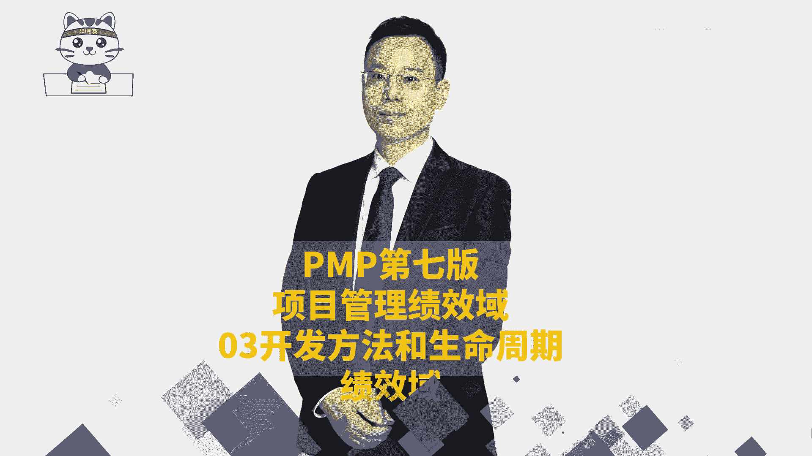
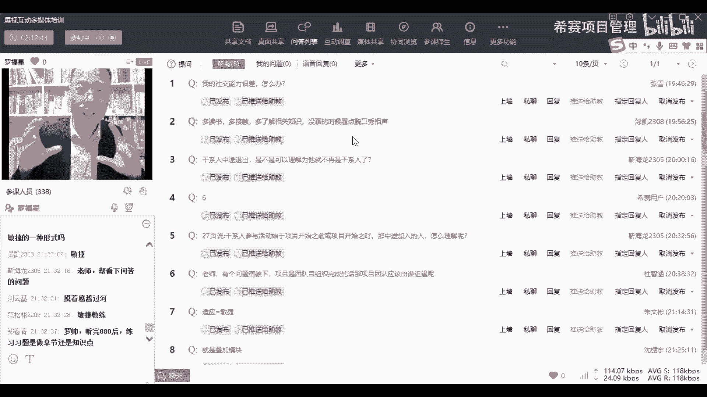

# 【收藏】2024年PMP项目管理考试第七版精讲视频《PMBOK指南》学习教程！零基础入门！ - P22：PMP第七版8大绩效域之03开发方法和生命周期绩效域-下 - 希赛项目管理 - BV1gcpMeRE5C

呃回答一下同学们的问题啊，有人在讲说增量和迭代呃有什么样的关系，或者有什么样的区分，增量的话呢，就是比方说我们去上菜的时候，你点了十个菜，我先做一个菜给你吃，然后我再做一个菜给你吃，我再做一个菜给你吃。

这样的话能够让让对方能够拿到结果，并且去使用，能够拿到结果，并且去使用，这个可以理解吗，先说一个一个一个来，可不可以理解，包括说像有一些小区，他盖房子，他盖了，他要盖50栋房子，他盖50栋房子的时候。

他会先盖三栋楼给大家去卖，然后再盖三栋楼给大家去卖，然后再盖几栋楼给大家去卖，再盖几栋楼给大家去卖对吧，他就是一期二期三期东区西区什么什么之类的，OK这就是一种增量的方式，增量交付呃。

包括你们如果说是有同学做软件的话，你知道有个叫那个呃数据库的备份，叫增量备份，增量备份就是我做了一些东西，我再加一些东西，再又加一些东西，再加一些东西，哎这才叫增量，可以理解吗，这是增量。

而迭代是什么呢，迭代是换了一种方式，迭代是什么，就是你们去写，你你去写论文的时候，你想一想你自己在以前小的时候呃，读读大学写了一个毕业论文，读研究生写了一个毕业论文，你改了多少遍，你做了一遍，交给老板。

老板给你提了一些要求，你再改改了以后你再交过去，他又给你提了一些要求，你又改改了以后又提了要求，你又改改了以后又改，改了以后又改，不断的改来改去还是这个东西，但是改了很多轮能够理解吗。

所以增量和迭代它有区别没有，它还是有很大区别的啊，兄弟姐妹，你可以把迭代理解为就是重新回过来重新改，OK改过来改过去，用这个理解就就可以了，那到底什么是敏捷呢，敏捷就是说增量加迭代。

就说既又有增量又有迭代，比方说你做软件，你想一想你的那个手机的app叫叫微信对吧，微信里面他发布了一个版本里面可以发发照片，搜照片，他又发了一个新的版本，可以去发图片，搜图片，他又发了一个什么东西。

发什么收什么东西，他这是不是一种增量，很典型，就是正面吗，但他同时还是不是告诉你说，我这个版本修复了什么bug，什么bug，什么bug，那个修复bug它是不是迭代，它不就是迭代吗，对不对。

所以才说敏捷是既有增量又有迭代，就这么一个逻辑，而事实上呢，我们现在不会严格的去区分增量和迭代，我们现在是所有的这东西全部都叫敏捷，OK这三个就是234，234我们都会的给它取名字叫敏捷，我说清楚了吗。

兄弟姐妹对，这个是前面讲过的，但是有同学是最近才新加入的，所以给你简单解释一下啊，今天晚上你觉得除了你自己以外，有谁是在热情的参与这个项目，参与这个课程好啊，然后讲一个批叫批判性思维。

什么叫批判性思维呢，百慕大三角洲，但你们有印象吗，我们小的时候，是不是听说听说过那个那个百慕大三角洲，是不是说百慕大三角洲是一个很神秘的地方，飞机飞到这个地方就会咻就掉到那个海里面去。

什么东西就会船开到一个地方就咻就会消失，然后消失的东西就会true到了月球上面去，但是你得要去想一想，这个合乎逻辑吗，合乎现实吗，哎你有这样一个批判性的思维，你在想他为什么会有这种情况呢。

他不就是一个海域吗，而后来的后来才会发现，原来那个百慕大三角洲，它其实并不是真的有这种神奇的魔力，它其实就是一个普通的海域，OK所以你有你的批判性，你能够去想它是真实的吗，是真的是这样的吗，其实不一定。

其实有可能后来的后来发现什么呢，是别人写了一些小说啊，有人写了一个小说，写了一科幻小说，然后基于这个科幻小说，后来就变得越来越呃，就是有人看到你，你你知道大家都想要赚钱，对不对，有张三写了一个科幻小说。

呃，显得好像这东西很炫酷，马上大家都在追捧，既然很多人在追捧，你也会写小说，你是不是马上就写一个一模一样的东西，你也写一个这个东西，截一个百慕大三角洲，然后后面就越来越多人去写，你知道吗。

所以这个什么叫批判性的思维，就别人说的东西，它不一定是真实的，不一定是对的，你要去能够用你的自己的思考，去去去去去去去想他到底说的是对的还是错的，OK唉就个意思就这个意思啊。

所以你要去勇敢的去有自己的一些立场，能够去思辨，有思辨的能力，能够去想别人说的这东西是对的还是错的，而不是人云亦云，那包括说有人说啊，那个偏僻考试很容易，我只学习了三个礼拜就考过了，你信他还是不信。

你是要信他还是要信我，有没有可能他说的是对的，但是你却不不可以信他，绝对有可能他说的是对的，因为我有我是不是有跟大家讲过，我说过我们的学员群体其实差别很大，有一些是九零后，零零后，就是有同学是98年呐。

99年呐，2000年的，甚至有2001年的同学，我有些学员是去年的学员，他就2001年的都有，那有没有同学是50岁的，40多岁的，有些同学是职场小白，那也有一些同学是职业的职场的高管。

今天加我的同学里面，加我微信的同学里面就有两个同学，一个同学是一个一个一个比较大的，一个企业的那个常务副总，还有一个同学说他自己有50岁，那我以前还教过一个同学，说有60多岁都已经退休了，63岁了。

那大家的这种情况是各不相同的，那有没有一些人，他在外企业或者在一些合资企业，他的这种管理的方式就跟敏捷，就跟项目管理非常相似，所以他不需要太多的去学习，你有没有这个实力，你有没有这个这个条件。

你要去考虑考虑，对不对，OK所以他说的可能是对的，但是你不要去信，为什么呢，因为你跟他的环境是不相同的，你跟他的场景是不一样的，知道吗啊这是这样一个点，所以你要有批判性的思维去思考这些东西。

去思量这个东西，不要人云亦云，哈哈那个潘路冰，你怎么这么棒，你怎么都记得我说的这句话，又要给你点个赞啊，这个牛逼了啊，好然后再来回答一下问题，回答一下问题，就是有同学说。

老师能不能再讲一个混合型的案例呃，我刚有讲过说做机房对吧，你要去给别人去建机房，你还要去建一套管理系统，那么你建机房的话，那基本上就是完全用这种预测的方式来做事情，但是你建了一套管理系统呢。

有可能会用敏捷的方式来去做事情，那么这种情况下是不是预测加敏捷，就是你这个项目既有预测又有敏捷诶，那这就是混合，那比方说你有没有可能说做某一个项目，那个就算是做一个软件开发的项目啊。

那另一个开发项目的话，大部分地方其实都是很清晰的，都是很确定的，但是有一部分的内容因为种种原因，他还不是那么的清晰和明朗，那么那种很清晰的地方，你都可以是用预测的方式来去搞事业，但是那些那些不太明朗的。

你是不是有可能会需要用敏捷的方式和思路，来去搞事情，这样的话它也是一种混合，可以理解吗，这也是一种混合，那敏捷本身是从精益的这些思想，受受精益的启发而来的，敏捷是受精益的启发而来。

然后只是说后来更多的会把它转转向到，搞成一个什么呢，把它转向到做做这种敏捷的方式，接下来回答大家的问题啊，啊我们的课程呢今天的课就已经上完了，接下来是呃有同学的问题，如果你觉得你有事情，你可以先撤退了。

然后呢如果说呃你想听的话。

我我来跟大家简单回答一下几个问题啊。