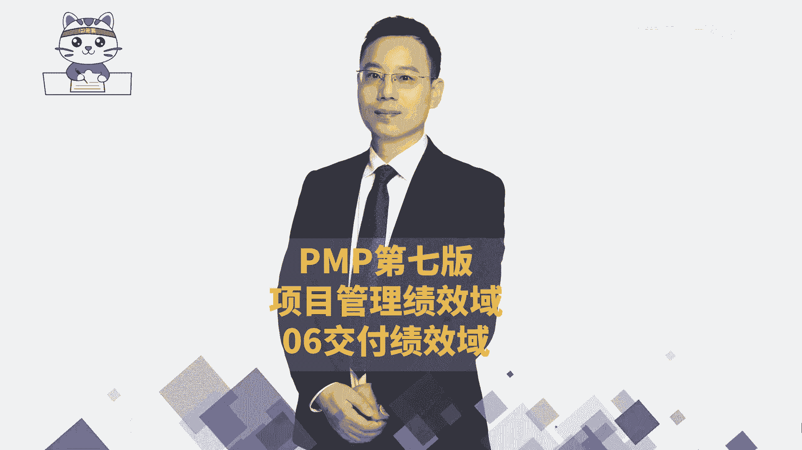
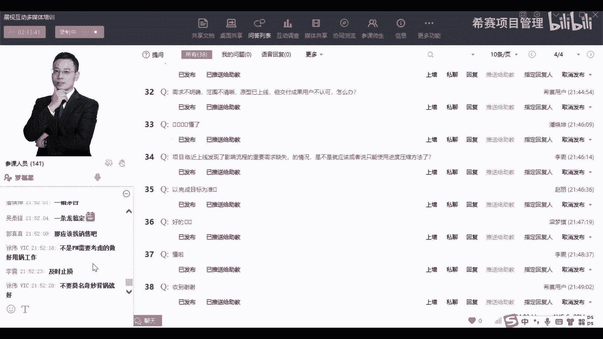

# 【收藏】2024年PMP项目管理考试第七版精讲视频《PMBOK指南》学习教程！零基础入门！ - P31：PMP第七版8大绩效域之06交付绩效域-下 - 希赛项目管理 - BV1gcpMeRE5C

然后接下来是答疑的时间，好我们一起来看一下大家答疑的问题啊，成果和产品的区别是什么，首先我们说产品它更多的是一个结果性的东西，比方说我们会讲到的是，你要去研发了一个电脑，你要研发了一个手机。

研发了一个什么热水器或者什么之类的东西，而这都是所谓的产品，那成果是什么呢，成果它更多的是强调那种啊，比方说你要去做一些科研性的项目，最后推导出了一个模型，或者说是做了一个这种，一些一些一个测试的数据。

一种科研性的东西，它的一个中间的东西或者是那种结果，最后的结果它不能够直接去商业化，那那种项目他也是项目，他说的是成果，这个呢我们在最第一节课的时候，其实有讲过这个问题，是第一节课是讲过的好。

然后再看下面第二个问题呃，韩琦同学说预测性的项目做项目整合管理，就是选择哪一些管理计划和工具吧，啊对作为预测型的项目的话，其实我们的项目管理计划就是就是会有范围，进度成本质量资源沟通风险。

采购相关方等这些个计划好，第三个，敏捷教练和项目经理有什么区别，敏捷教练呢，他就是在敏捷项目管理中的那个管事的人，在敏捷项目管理中管事的人，他其实有的时候也就有一些题目中的翻译，就翻译成叫项目经理。

但是也有一些题目中，他会把这个项目经理叫的比敏捷项目经理更大，也就说是下面有个项目经理，底下呢，具体有个敏捷教练有这种安排呃，然后第四个有没有思维导图，这个呢没有做思维导图，就是这个还没有做。

就是现在刚好是最近他们在出成绩，就是3月份考试的同学在出成绩，然后5月份考试同学马上就要考试了，所以这个时候我们在忙着做一些模拟卷，等到到时候你们8月份考试的时候，我们其实也会尽量去给大家去做。

这个就是在做这些督学呀，做模拟卷的这件事情，所以现在还没有去做，还没来得及做思维导图，我自己现在也是比较确实比较忙，对，其实大家可以自己根据这些内容稍微去画一画，但是整个现在的这些东西。

他都是还目前还是比较散的东西，但我觉得没关系，你如果看过800，你知道后面的内容，它其实有关联，有串联，然后再看一下呃，下面一个大圣同学说下载的课件中，第七课的内容里面没有今天的后半截内容，第七个问题。

潘焕坤同学说的是这一大堆绩效率，是不是敏捷项目里面的，不是它是敏捷项目管理和预测型项目管理，混到一起来，然后下面一个问题黄雪霞同学问的说，老师请问组合管理包含运营吗，组合的话。

他其实通常情况下我们在选组合的时候呢，其实把它不包含，说的是以项目的这个维度，但是运营它会包含在什么里面呢，包含在产品管理中，就产品管理就是这些东西做完以后，后面去投入运营。

它依然是处于产品的生生命周期，一般是这样一个安排会更合适一点，然后第九个刘兆伦同学说的说，变更的成本能否量化，变更的成本有一些些是可以量化的，有一些些是可以量化的，它不一定每个都可以量化。

因为某一些东西它有可能是不能量化，这也是很正常的啊，再下一个是向用户同学说的，是敏捷类的项目，需要遵循变更的流程吗，不需要敏捷的项目，他在前面我们咱们不是看过一个叫敏捷的呃，宣言和敏捷的原则。

它里面就会有拥抱变化对吧，即便是后期你随时提来一些变化过来，我们都会是欢迎的，所以他不再去遵循这样一个变更的流程好，然后再到下一个八大迹象，预和19个过程是怎么对应的，不对应它没有一个对应的关系。

他没有对应的关系，它不是它不是在一个体系里面，他是两个不同的体系，通常是49个过程是跟五大过程组，十大知识领域给关联的，也就是我们前面呃，但如果说你们手上拿讲义的话。

讲义里面应应该是在第三章还是第几章里面，不是会讲到一个那个什么框架吗，在那个框架里面，你已经有了一个很明确的一个列出来，看到没有，所以吴太丰问的这个问题，就是在那个框架里面去看会更好一点。

然后第12个娄英同学说的是敏捷教练，不算是专家吧，更贴近项目经理，对他就是更贴近项目经理，所以有一些类型的项目，他就把他取名叫项目经理，也有一些类型的项目，它是会把它叫做，你可以把它叫做小组长。

就有一些公司，他会把这个敏捷项目经理，当做是项目经理的角度，也有一些项目它是把它当做一个小组长的角度，这个看你的情况，看你的这个111个情况来安排，如来同学说呃，老师预测项目有变更，走流程。

那敏捷敏捷是对，直接走直接变，但是它的直接变其实也有流，也有逻辑的啊，他的逻辑是什么呢，你可以先看那个880视频教程的第十十五章，15章16章，它里面其实一样的，有流程，并不是说真的想变就变。

只是说他并不需要走那个变更流程，他是走他的那套敏捷的流程，是这个逻辑啊啊然后是杜志航同学说的，说老师预测型项目中质量成本范围，这些计划是不是都必须做的，是不能够取舍的，对一般情况下。

这东西都不能够随意的去取舍，你有某一些东西可以怎么样取舍，就是某一些什么物料的管理啊，什么之类的，你有有一些项目你根本就不太涉及到物料，就是管人的，那你可能就不涉及到一些物料相关的一些事情。

当然也有某一些特别的项目，我不在乎钱，就是我虽然会划定一个钱的一个范围，但这个钱多一点少一点，我其实都能够都都没所谓，那这种也是也是可以的，然后张鹏同学问，说是感觉第七版的内容被打的很碎。

考考试大纲就是就会是这样吗，考试大纲我已经上过一节课了，你可以去看一下考试大纲，就我看前面的课程，有一节课就是在讲考试大纲诶，我等一下啊，有吗哈，我都不记得了，好像还没有完全去讲。

但是考试大纲是另外一个文件，就是专门可以去，你可以去找助教老师要一下考试大纲，就是让如果说你们手上已经下载的话，可以在群里面发一下，如果没有的话，可以在群里面问一下，老师说能不能把考试大纲发一下。

有一个PDF文件啊，他是这样的，考试大纲是考试大纲，第六版是第六版，第七版是第七版，他们之间是三个玩意儿，他们是三个不同的东西，这就有点就是反正现在搞得也是很，也是很扯淡的这种方式。

但是最逻辑最强的是什么呢，逻辑最强的其实是第六版的教材，也就是说逻辑最强的是我们的880视频教程，它的逻辑是最强的，你把880看完以后，你再去看看考试大纲，大部分你能够看得懂，然后你再去看第七版呢。

有一少部分看不懂，但是大部分也是能够看得懂的，是这样一个情况，然后现在用户问了一个很好很好的问题，说第六版的题库有必要做吗，必须做呀，因为只因为考试基本上嗯我刚有讲过，说第七版东西他虽然改了改。

但是他基本是老瓶装新酒，新瓶装老酒就还是那一套，然后高平明说一直重复的理解，看880视频，加只看课件中的880中没有的内容，足够去应付考试吗啊对你直接看880，然后看880，看课件中880没有的东西。

然后加上去做题目就可以应付考试了，去做题目就可以应付考试了，是这样子的，那你还是要做模拟题的啊，我们会面后面会给大家做这个模拟题好，然后第19条西向用户同学提的说是啊，第18条有变更，走流程吧。

敏捷最低成本的快速交付啊，对对对，你再次帮我回答问题啊，给你点个赞，然后在第19条偏偏僻考过之后，是建议先考中项还是直接考高项呃，这个的话主要是看你自己的考试的能力，如果考试能力很强的话呢。

可以直接考高项，但是如果说保险起见的，考中级的会容易一些，毕竟中级他没有论文，他考考中级的话是只要是两科都通过，45分你就通过了，考高级的话，你是三科都要通过，你才能通过，所以风险会大一点点。

这个就是看你自己的学学的情况和考试能力呃，然后第20条，李琦同学说是目前这几节内容都是概括性的，后面会具体讲对吗，对是的，后面会展开讲，其实也就是880中的那些内容都是展开的。

也就是考试内容其实都还没有具体讲，对大部分的考试内容都还没有开始，还都还没有具体讲，是这个意思好，然后贺贺超同学说，可交付成果还涉及到WBS的分解，W这些词典后面会展开讲吗，当然会当然会。

然后呃那个满山的猴子里的定罪宏说，周日三个小时的时间，是只讲第八章的一个单元的课吗，呃大概率是先把第八章讲完，那看能不能讲完，如果能讲完的话呢，那我就顺顺便就把那个，咱们不是还剩了两个绩效域没讲完吗。

我会继续把这个没有讲完的两个绩效率，也继续讲完，也继续讲完啊，如果还有时间的话，再往后面讲会是这样的一个安排啊，然后潘潘焕坤同学问的说是，有没有一种可能说可持续，可持续步调和赶工同时进行啊。

就说那个你说的是那个就是赶工和快速跟进，同时进行，对不对，当然有可能当然有可能你知道阿波罗登月计划，他能够在那么短的时间之内，11年时间之内能够去把这个登月的计划做完，他一定是既有赶工，又有快速跟进啊。

是这样的好，然后然后下一条西餐用户同学说赶工要加钱，那快速跟进会降降低成本吗，他不叫降低成本，你想你去做这个事情，你本身就要花钱，对不对，就是人力成本嘛还是要花的，他只是说本来是明天才花了这个钱。

你今天就把它给花掉了，所以他没有降低成本，他只是说没有增加而已，他只是没有去增加而已，黄雪霞同学问的说是老师会补充第七版，增加内容的习题吗，呃我前面有讲过，就是如果说我们能够拿到题目，一定会给他加上的。

目前还没开始，还没有拿到题目，等到后面但凡有任何新的风吹草动，有任何的题目一定会都会把它去加上去啊，然后徐小宝说老师我这项目都干了两个月，还没有确定范围怎么办，这个也很正常呀，我曾经做过一个项目。

都做了半年多，客户都还没提过需求，主要是看是什么类型的项目，然后你是否用一些好的方式和方法，来去引导他去，你去去收集一些需求，那这样的话你可以去看一下，在880视频教程的第五章，第五章范围管理。

880的第五章的范围管理中，它会有若干的这种范围管理的工具，其中就有若干这种需求收集的工具，你可以去好好看一看，能不能用一用用其中的一些些呃，西餐用户问的问题其实已经重复了，前面已经讲过了。

就是没有说第六版的习题已经过时啊，从来就没有说过，因为他的考试是这样的，考试是按照第七版的考纲来进行的，而目前我们所我们在平台上的内容，它就是第六版的教材加第七版考纲的东西，可以理解吗。

目前平台上的题目就是第六版的教材，加第七版考纲所对应的这些习题，也就是说是足以应付咱们现在的考试的，至于说到到时候会不会加第七版新的题目，但是他如果再加了以后，我们会给大家继续加进去。

因为我最开始也讲过，我们的目的和你们的目的是一致的，你会希望能够顺利通过考试，我也希望你能够顺利通过考试，你要是持续考不过的话，你会说我的好话吗，一句好话都不会说，一定是这样的，但是你如果通过的话呢。

哎你通过了大概率可能会说我的好话，所以我会希望你能够快速通过，通过了以后，能够使我的好坏能够去帮我介绍一些学员，这才是一个合理的能够正向运转逻辑，对不对，所以我们的目标是一致的啊。

好然后再看到第28条呃，西餐用户同学说的说是采购流程失控，供应商不配合，导致项目进度拖延呃，这个的话怎么讲呢，那有可能需要去做一些商务，做一些公关，也就是说并不是每一件事情，都是项目经理能够去管控。

或者项目经理可以去搞定的，有一些东西超出你的权限的话，你可以让那些公关来出现，或者让那些商务来去出现，而且请大家吃吃喝喝一条龙啊什么之类的，嗯你一定有一些东西，有一些方式就别人不配合，一定是有原因的。

他到底是需要什么，你当然你要搞搞清楚是需要什么，这个的话，就是你可以让你的领导们来去弄这个东西，然后照例问了一个很好的问题，说老师能不能把今天上课的那个东西，帮忙去总结总结一下，巩固一下，这样吧。

我回头会找时间来去做一个思维导图，但是整个这些内容它其实是比较散，它是比较散的一些内容，但是比较散的内容其实不是很好去弄，因为它都是在做一种偏概括性的介绍，后面具体内容在后面章节中会展开。

其实你要是真的有有兴趣或者有时间的话，你也可以去看一下前面的班级，比方说我们给大家开放了那些叫雄鹰班啊，什么之类的班级，你可以看一看那些雄鹰班的那个视频，就是以前把你的视频课程录录播回放。

你可能会发现有有不一样的这种方式，每个章节是好总结，现在东西就是很散放，即便是画一个思维导图，也没有什么没有什么用，其实实话实说，真的没有什么用，潘焕坤同学说的是可持续步调强调不加班。

加班会削减团队的稳定性，而赶工肯定会导致不可避免的加班，但是可持续，你选择赶工和快速跟进两个选择同时，那怎么办哦，你说的是这个意思啊，我懂你的意思了，我现在懂你的意思呃，什么意思呢。

就是说我们在敏捷中强调是不加班，但请注意敏捷中所强调的不加班，他其实只是一种理想的状态，你要知道现在很多欧洲国家，像因为我的学员中有很多，有一有一些人在在美国呀，在德国呀，在法国呀什么之类的。

他们一个礼拜就只工作三天四天，他真的就不需要加班，因为他现在已经是都劳动过量了，他再加班的话，大概会更加没事做，他们都是正常就到点下班的，所以他们才会去这样子去强调，但是咱但是这只是一个理想理想的模型。

咱们现在这个社会的形态和状态，他不适合说不加班，我们还是要卷，所以你该加班还得加啊，该加班还得加，你不要把那个说敏捷里面可持续就不加班，敏捷中可持续，在咱们现在这个现在的现在这个时代。

就是说你加着班也让他可持续，可以理解吗，一边加着班，一边让他可持续，是这个逻辑好不好，我我说清楚了没有，你不要不要不要觉得说那个啊，他讲的说是一个可持续，就不要加班，不要用明天的时间去。

不要把明天的时间精力借过来，那只是说说而已啊，你现实生活中你该怎么样还得怎么样啊，你可千万不要想着说啊，老师讲的我可不能够左右你的工作，领导说的才是真的好不好，然后梁梦琪说觉得今天的内容太快了。

其实这只是一个概括性的介绍，这是一个概括性的介绍，然后现在用户同学说需求不明确，范围不清晰，原型已上限，但是交付成果用户不认可，那不认可你就得改呀，既然是圆形的东西，那你就要通过他的这个。

通过他的这个题那种那种，他既然不认可对吧，他不认可A那么他到底认可什么呢，你得要把他认可的东西给给给给拎出来呀，所以其实还是要去前期去通过，不管是这种圆形的方式也好，通过什么样的一种方式也好。

去收集他的需求，并且去收集关于这个需求的一种完成的定义，或者是验收的标准，就验收的标准应该是什么，这个才更重要呃，李政同学说的是，项目临近上线，发现了影响流程的重要需求缺失的情况，那是不是就应该。

而或者说只能说是做用进度压缩了，理论上来讲肯定是的，肯定是的，你肯定需要去做进度压缩，理论上的你肯定是，但是也有一种情况就是你要去申请延期咯，有些东西你来不及的话，你只能是申请延期，有这样一个情形好。

那么平台上的问题呢就到这些了，然后接下来就是大家在直接这个，聊天框里面的问题，聊天框里面我看一下啊，吴延平同学问的说是罗老师，我没我没有问题，问是不是就是最大的问题啊，呃不懂得怎么提问啊，这个怎么讲呢。

有可能只是，因为你目前可能还没有去做太多的预习，因为没有预习，所以就不知道从哪里开始，这个也是也是正常的，所以因为咱们现在这个班级，有一些同学是最近才新报名，也有一些同学是早早就报名的，呃。

有一些同学是都已经把那个880，都已经看了个，看了十章以上的，因为前面我们说看了十章以上的同学，可以得到一个小礼物对吧，有一些同学都已经看了十张以上，所以大家时间不一致，你不用去跟别人比。

跟自己比就可以了，你跟自己比，就算你自己诶学了一些什么东西，然后你发现有什么东西是OK的，我们现在正在讲的东西呢，稍微有点抽象，我也解释过，就是目前讲的是一种偏概括性的，比较抽象的东西。

到后面会展开来讲，那些展开的东西会希望大家都是能够去听懂，是是这个意思啊，是这样一个意思，OK呃还有什么问题是我们回应没回应的吗，我看一下郭真正问说我们的项目的主管呃，主主管主任调走了，换了一个主任。

是竞对厂商的支持方，我们项目被砍掉，好多业务怎么破，这个不是你项目经理该能够去破的事情呢，那这是老板们要干的事情呢，这个你只能是那老板是吃什么的，为什么会出现这种情况，难道是请了一个间谍过来。

这个不合逻辑啊，那只能是让他的领导来去考核他的工作，就是他的领导来去考核他的工作，他做的这么烂，还还让你们避掉很多一些一些业务，到底是什么原因，是公司发现这个经营不善，所以不要做这些业务。

所以找了一个黑脸过来帮你们砍业务，还是因为这个人真的是有问题呃，这个是领导的领导这个层面上的事情，那你可以去试着跟你的领导的领导来去沟通，这个话题，这个不是你这个层面能够去解决问题。

这个不是我们项目经理，这个层面能够解决问题啊，他说的是客户，客户分什么意思，我看一下客户方，我们项目的主管主任调走了，换了一个主任，竞对厂商的支持方，你说的是你的你的你的甲方式吗，那个那个谁还在吗。

郭珍珍同学还在不在啊，是甲方的主任被调走了，我这个没办法呀，这个这个那就是这个风水轮流转，今年去年是你们做庄，然后明年是别人做主啊，这个没办法的呀，那你只能是去，那你只能去去挖一个下一个金矿啊。

这个金矿可能可能有点难度，当然还有一种方式，就是因为人都是趋利的嘛，既然是趋利的，那就继续去攻关呢，继续去继续去攻关呢，继续去去去突破呀，是人都有弱点呢，他需要什么东西。

你是否能够通过利益的方式来去打动他啊，就这个这个这个是这么一个一个逻辑啊，并且事实上不可能，所有东西都是一直都是某一方，就一直得利找销售，或者说找公司的一些商务，有有公司有一些什么专门做商务。

或者专门做公关的人，对徐伟给了一个非常好的信息，这个信息可以给下面所有的那些，就是有好几个问题的同学，就说你要去学会该甩的锅，你你要甩出去，不是你能够搞定的事情，你不要站在你的这个维度。

就我们在后面学到的时候，就学会学了一个东西叫什么呃，就是有一些东西的解决叫善报，OK有一些问题的解决是善报的方式，上报给领导们，让那些领导们来去解决，而不是每一个事情都在你这个维度。

我们我最后来我最后来去念一小段文字，来去解答，来结束今天课程好不好呃，最后来念一小段文字，就是这是早两天，有个同学给我发的一个发的一个问题，他他问的一些问题就是都是那种项目经理。

不是项目经理层面能够去解决的问题，就他问了很多好几个问题，都是那种不是项目经理层面能够去解决的，那你要去知道项目经理不是神，项目经理，只是一个只有一定权限的这样一个角色，这个权限还是公司授权的。

那么超出这个角色的其他权限的东西，你就应该让其他的角色来去承担，你要把握这样一个点，你不要觉得所有东西都应该是背在你的身上，你背不动没有，你不是那个乌龟，背不动。

