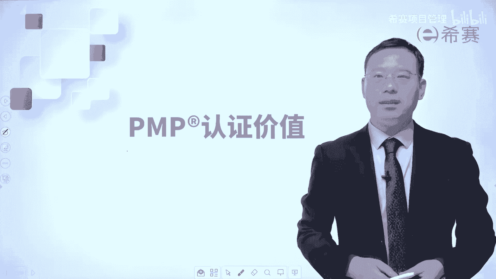
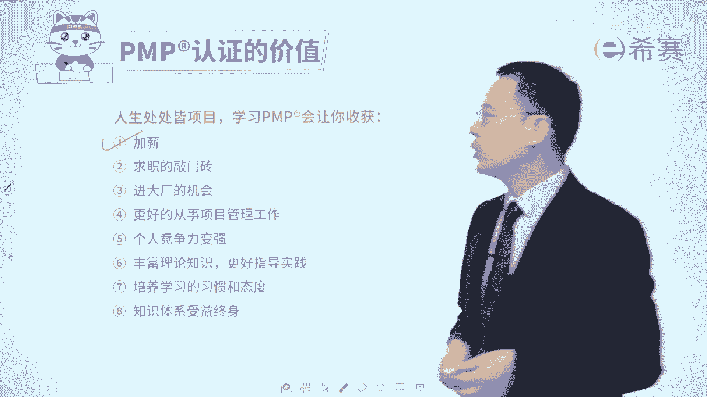
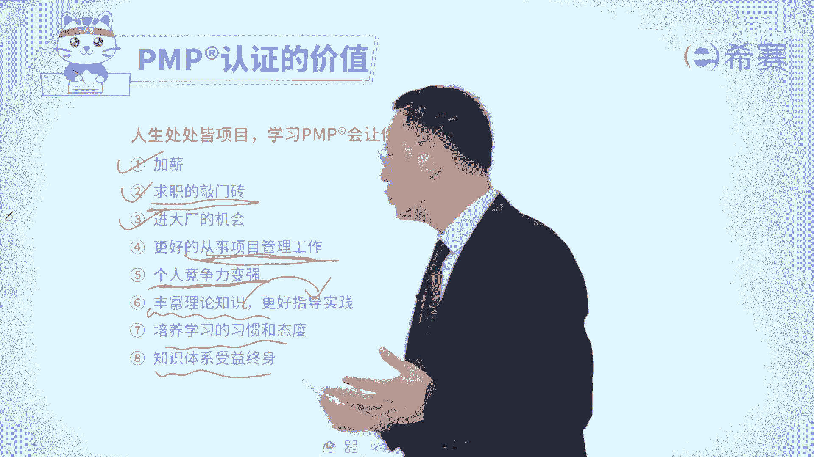

# 【收藏】2024年PMP项目管理考试第七版精讲视频《PMBOK指南》学习教程！零基础入门！ - P39：0.3PMP认证价值 - 希赛项目管理 - BV1gcpMeRE5C

大家好，我们一起来看一下关于PMP认证，它的这个价值所在，其实经过大量调研呢，有人做一个统计说，可能有70%多的人会觉得，领导力有所提升，有80%多的人会觉得，自己的执行能力有所提升。

那有60%多的人会觉得自己的创新能力，有所提升，以及有80%多的人，会觉得自己的竞争力有所提升，重点来了，就是由百分大部分人他平均而言啊，平均而言他的这个待遇提升了10%，也是植入，如果你1万块钱。

那提升10%就是1万1对吧，你一一个月多1000，你是一年就是多了1万，20年就多了12万，20年就多了24万，我相信肯定不只是提升这1万块钱啊，所以这事还是蛮值得的，那我们来去解释一下。

为什么会有人觉得领导力能够得到提升，你想一想，很多时候我们说一个人他具有领导力，他就是能够去带领别人，或引领别人，或激发别人来去把这个事情往前推进，往前做对吧，兄弟们给我上，那通常情况下你会听谁的呢。

就是谁作为你的领导，你才愿意去听他的呢，是那个啥也不会，啥也不懂的人，还是那个他其实懂一些，会一些，甚至他很懂很会他还能够去理解你的人，通常情况下，如果你学过这套结构化项目管理知识体系。

你懂得比较多的话，你是越能够去引领别人，能够去领导别人，而至于说执行力，很多时候我们执行，其实我不知道大家有没有这种习惯，就是某一些事情我们会拖延，拖延的原因有很多种啊，其中有一种拖延呢。

是因为我对这东西不太会不太懂，所以我就想晚一点再做，能拖一会儿算一会儿，那如果说当你学过了结构化项目管理知识体系，你对这些东西都比较懂的话，就在这个板块中，你可以去消除掉一些事情。

那么你的执行力一定会得到加强，并且你能够很明显的知道，我在什么节点该做什么事情，什么时候应该出什么成果，什么时候谁应该做什么东西，那不就是能够更更有效的去完成吗，那节奏都在你的手中啊。

流程都在你的手中啊，还有创新力，其实我们大量创新啊，从哪里来，大量的创新都是从模仿中来，你先去模仿借鉴参考，然后再去做创新，并且还有拿A和B进行组合，组合到一起以后，它也是一种创新，打个比方。

你小的时候写的铅笔，铅笔这边可以写字，屁股后面呢有一个橡皮擦，它可以去擦，那拿铅笔和橡皮合到一起来看，也是一种创新，所以其实你懂得越多，那么你创新的可能性会越多，那你想一想，你的领导力也变得更强。

执行力也变得更强，创新力更强，难道你不比你不觉得你更值钱了吗，你不觉得你的竞争实力变得更强了吗，那你不觉得领导又要给你提涨工资吗，还有经常有学员会跟我反馈说啊，我后面换了工作，然后薪资提升了多少多少。

经常是一些比较漂亮的数字啊，有一些30%啊，50%啊，甚至也有少数同学会有那种double的情况，所以我是觉得学习PNP课程，它不是说一定能够让你在某个板块中，就有一个大的一个飞跃。

但是呢总体而言绝大部分人而言，他是有提升，有飞跃的，有有提高的，还有就是有90%多的人，他们会觉得说是通过学习以后，工作效率能够得到提升，然后以及项目管理工作能够得到提升，能够更好的得到领导的认可。

你想为什么能够更好得到领导认可，那不就是你做事做得更好，做得更漂亮，能够让领导更放心，对不对，其实我在培训了这么些年中，我也会发现有一些人，他其实是不太看得起考试培训的，他会觉得说啊，你搞一个考试。

这有什么好弄的，我都已经是30多岁了，40多岁了，我在职场上经验很丰富，但是你要知道一个点哦，像这些个大的公司嗯，你知道最开始PMP在中国被流行起来，最开始那种接触他比较多的是谁，就是华为公司那些员工。

因为华为他要去做一些海外的项目，他需要去跟海外人去对接，所以他需要能够去掌握这套项目管理语言，从而能够跟别人更好对接，而事实上目前你会发现很多这种大公司，他在招聘的时候啊，都会明确提出是PMP优先。

所以你可不要真的是不要太小看说啊，这不是一个考试培训吗，他还是真的是有用的，有帮助的，他能够给你带来什么帮助，首先第一个是有可能会有加薪的机会，或者是有可能会找工作的时候呢。

多了一块敲门砖，不是说你拿了这块敲门砖，你就一定可以把门敲开，但是你多了这个敲门砖的话呢，你可能敲开它的概率会大一点点，还有就是有机会能够去进大厂进，比方说这些个大厂，那你是有可能的，最重要的。

其实那些东西都是其次，最重要的是，你真的能够更好的去从事项目管理工作，能够去把工作做得更好，更完整更漂亮，这样的话呢你会更有成就感，能够让你自己变得更有竞争力，能够变得更值钱，你只有更值钱。

你才会更有钱对吧，丰富这些理论知识，来更好的去指导工作，我们说理论来自于实践，同时他可以去指导实践，就是这么一回事，并且呢你在西夏，如果说是养成这种学习习惯以后，你会发现生活变得无比的充实。

也许能够培养你一个良好的学习习惯，呃每一次都有一些学员，我我问他们的时候，他们说啊，老师我都已经十多年没有学习过了，没有考试过了，其实很正常，但是还蛮希望你能够重新捡起来嗯。

最后最重要的就是整个这一套知识体系。

它不仅仅只是用在考试中，也不仅仅只是用在工作中，它可以用在生活中的方方面面，你哪怕是出去旅行，你是不是要做一个攻略，是不是要做一个计划，你做任何一些生活中的事情，它其实都会用到计划执行监控，计划执行。

监控都会是我们偏僻的这一套体系里面，教给你的，所以整个学习PNP，它一定会让你变得更加的愉悦，轻松的去应对生活和工作中的各种事情。

