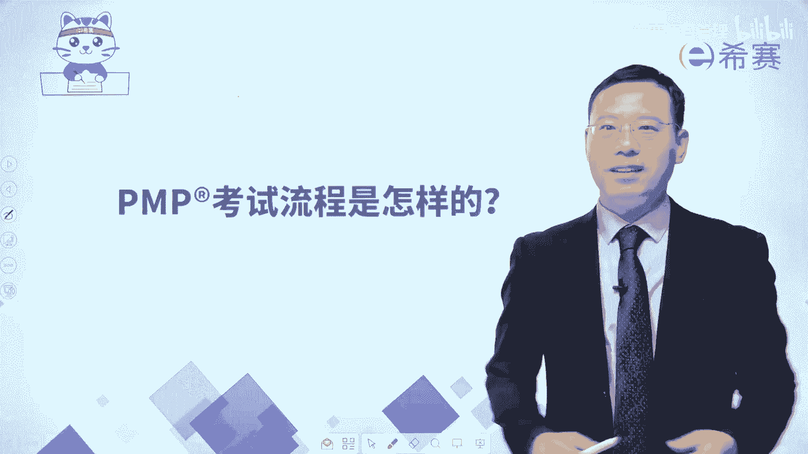
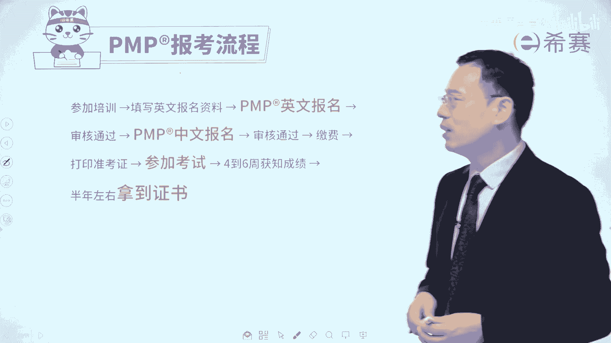
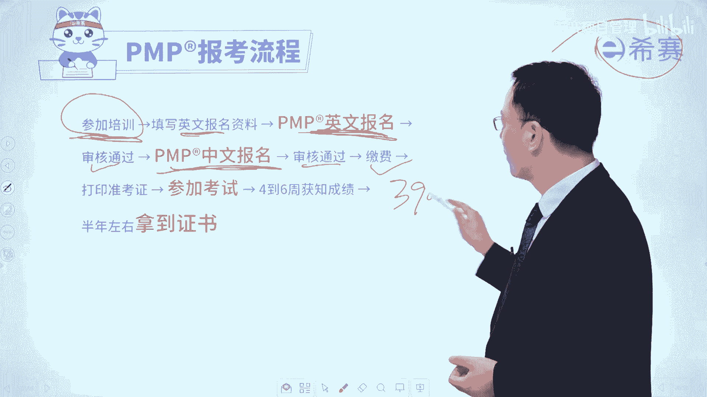
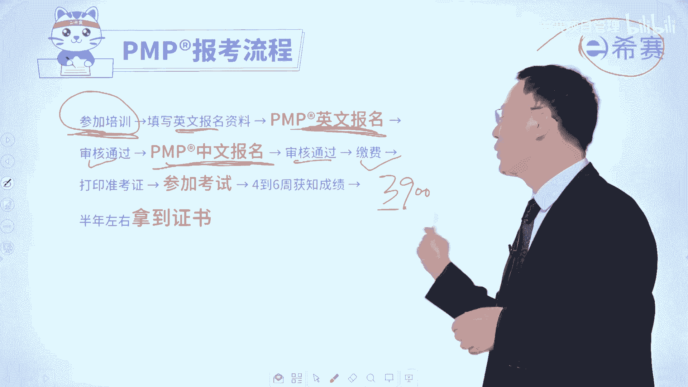

# 【收藏】2024年PMP项目管理考试第七版精讲视频《PMBOK指南》学习教程！零基础入门！ - P40：0.4PMP考试流程是怎样的？ - 希赛项目管理 - BV1gcpMeRE5C

大家好，很多同学会想要知道，说PMP考试流程是怎么样的，我如何才能够顺利的拿到PMP证书呢，其实这个流程是非常清晰的，它一般是经过这样几个环节。

首先第一个呢是你一定要参加培训，现在呢取名字叫中国国际人才交流基金会，你要参加这个基金会，他所去授权的培训机构的培训，包括像西塞，我们西塞呢就是他的这个授权的培训机构。

你要去参加这些个授权的培训机构的培训，然后呢你要去做英文的报名，那英文报名呢可能会比较难，所以呢我们想你所想及你所及，这些是你只要填写基本信息，我们的班主任老师会帮你完成这个报名的部分。

那英文报完名以后呢，会有一个审核时间，审核通过以后，那么大家对应的节点就可以做中文报名，中文报名以后呢也有一个审核节点，审核通过以后呢，你才可以去交费，那报考费目前是3900元啊。

在这里我要补充一个点，就我们西塞PNP考试的这个培训，通过率非常高呃，但是我要跟你讲，不是因为偏僻，考试很容易，是因为呀，一方面是我们的教育培训体系做的还不错，还有一方面是因为考试费确实有点贵。

3900余元，所以既然要学习就好好加油啊，我们也会好好去督促你来一起学习的好，那么你缴完费以后呢，就可以打印准考证，就可以去参加考试，考试是在一般某一个周六，上午九点到中午的12：50。

一共是有三个小时50分钟的时间，但在这个时间之内，肯定是可以去举手去上卫生间呐，然后去吃一点点小的东西来填一填肚子啊，这都是允许的啊，然后参加完考试以后呢，大概是有4~6周以后。

或6~8周以后就可以去拿到这样一个结果，拿到结果，同时，其实就能够拿到这样一个电子版的偏僻证书，那么就恭喜你拿到了偏僻的证书，你就已经是偏僻认证的认证人员了，呃纸质证书呢可能需要更长的时间才能拿到。

所以你会发现首先是你要去报班学习啊，一定是报这些个由基金会来授权的培训机构啊，或者说是由那个偏卖中国授权的培训机构啊，西塞就是啊，然后呢再做英文报名，再做中文报名，然后再缴费，再打印准考证。

这个打印的是自己亲自打印啊，一张纸亲自打印，打印完了以后呢，去参加考试，考试呢大概是230分钟，也就是三个小时50分钟，然后考完以后呢，大概是有4~6周以后会出成绩。

然后可能半年以后的时间能够收到纸质证书，同时你在这个地方的时候，就已经可以拿到你的电子版证书，它就已经是生效了，就有用了，好在整个这样一个环节中，其实对大家来讲最大的挑战呢可能是英文报名。

那么关于英文报名呢，其实我们也是会知道，大家可能大部分人啊工作中不太会去使用英语，那你只要对应的去填写一些基本信息以后，我们的班主任老师他会帮你来完成英文报名，完成英文报名以后呢，他还会给你发一些信息。

告诉你在哪个地方去登录，去查看什么什么信息，查完那个基本信息以后呢，就可以做中文报名，那不管是英文报名也好，还是中文报名也好，其实我们都录了一个那个报名的这样一个，解说视频。

你都可以去看这样一个报名解说视频，来了解一下情况，英文报名呢已经由班主任老师帮你完成了，中文报名需要你自己去完成，我会建议大家在呃做中文报名之前，一定要花时间去看一看，这个中文报名的指导视频。

这样的话对于你的报名会更加清晰，然后呢也更顺利的让你参加考试。