# 【收藏】CSPM-3中级项目管理认证考试直播课精讲视频合集（零基础入门系统教程）！ - P10：CSPM长空2-3项目管理的五个层次 - 希赛项目管理 - BV16p42197SH

那么接下来我们再来去正式的看到这几个信息，后面还有题目啊，后面还有题目没，有没有得到的小同学小同学们不要着急，有机会啊，都有机会，几乎是还是机会大大的啊，我们首先看到它总共有五个层级。

他说他说把这个能力评价呢，也是按照五个层级来进行，那么这五个层级中第一个成绩，他就是认知的层面，改变认知，什么叫改变认知，也就是我们对于某个东西的这个基本的认知啊，打个比方啊。

我们说经常有人说喜欢跟别人吵吵架，那吵架有什么好处呢，吵架其实没什么好处，吵架他只会伤和气而已，除了伤和气，也没有什么好处对吧，那么如果你能够去改变认知，你会发现如果说与人为善，你与人方便自己方便。

那这就可能会多条多个朋友，多条路，所以会更好一些，所以我们在做这些事情的时候啊，不管是不是你们，那就是你了，因为别人都没有选，那肯定就是你啦，邓青青，邓青青是邓青青，不是我好久以前的学员吗。

哦那么同意书两个都上啊，好接下来就是首先第一个是我们要去改变认知，我们怎么样去改变认知，比方说我们对于项目管理，我们需要有一个基本的认识，只要有五大过程，主要启动规划执行监控收尾啊，这些基本认知啊。

我们知道说是可能会有呃，那个做产品的会有引入期，成长期，成熟期，衰退期，我们在做项目可能会有什么启动阶段，准备阶段，执行阶段，收尾阶段等等，可能会有范围管理，进度管理，成本管理，质量管理，十大知识领域。

而我们对这些东西有更多的认知和了解，认识和了解了以后有什么好处，兄弟们有什么好处，虽然有可能我并不会去，真正就是有可能有些同学即便学过了以后，依然也不会做项目对吧，虽然有可能我们学了以后依然不会做项目。

但是至少我心里明知道该怎么做是对的啊，那样用现在这种方式可能是不对的，不好的，所以你在认知层面上提升了以后呢，你能够看到这些事情该怎么样去做是有效的，怎么样去做是无效的对吧，这是第一层。

所以他说是我们的这个管理中的五个层级，第一层是认知的改变，他就能够颠覆原有的思维，其实也就是从一个野路子，到一个正规军的过程呃，王总说，谢谢罗老师的鼓励和帮助，拿到了五位，一个50岁大哥啊。

拿到五位同志们那些小年轻小年轻肯加油啊，小年轻肯加油加油，真的我每一次都觉得特别感动，就是总有一些不管是年龄很大的小伙伴也好，还是有一些那种孕妇呀，还有一些真的是职场上特别特别忙碌的。

有一些人他是那种什么，就比方说副总裁呀这种级别的都很忙的人，也来去学习，还能够真的是很能够沉下心来学习，特别牛，特别不容易。

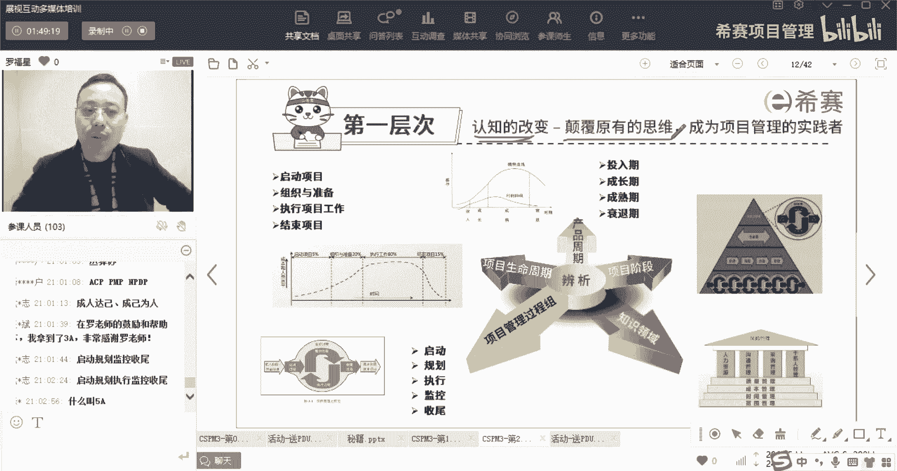

然后这是第一层，那么第一层因为他说是关于求职的知识层面，需要重新定位你的角色和使命，你你的角色是项目管理的工作人员啊，他这边给了一个说是助理，项目经理工作包袱的人，来解释一下什么叫工作包负责人。

这是一个陌生的名词，什么叫工作包的负责人呢，我们在一起，我如果你学过偏僻的话，知道有一个叫创建工作分解结构叫WBS对吧，那创建工作分解结构WBS从上往下，一层一层分解，分到很多个层级。

那么底下那个层级里面最底下的一个叫工作包，对应的工作包也要有人去落实，有人去执行，对不对，那么那个去负责去落实去执行的人，哎，那个负责人就要工作包负责人，他是对谁负责呢，他是对他相当于是小组长啊。

那个夏总说的特别对，他相当于是小组长，他是要对项目经理负责的，就是项目经理安排了大家以前是5A，但是现在最高顶格是3A了，很久以前顶格是5A，现在顶格都是3A了，是的，已经改了，已经改了。

那么他是要去给项目经理汇报，向项目经理来去来去汇报这些信息的，那么就有这样一个角色啊，啊然后还有就是有PMO的助理啊，pm的助理，还有一些新手的项目经理啊，你要你要你要把你做一个操作人员。

做一些技术人员往那个管理感的方向去走啊，并且呢他说你要多关注人和组织，关注人，其实人与人之间，其实很多时候很多事情是基于人，而组织的话，其实组织他才能够赋能，组织能够给你赋能。

很多时候你会发现有一些那种，有一些员工从那种很大很大的公司离职，或者说是或者说是被优化掉了以后，他发现了异常，本事一嗯，那个那个魂满身的本事无处释放，有这种情况，其实是因为你当时在那个组织中。

因为组织在给你赋能，如果说脱离了组织以后，你的那个技能，其实在社会上没有什么太多的作用，除非碰巧刚好能够找到一个，像类似的一模一样的组织，否则它其实很难，所以在这个时候呢。

你要懂得一些项目管理的基本知识，他说至少掌握一种开展项目的套路，什么叫套路，套路其实也就是我们做事的方式流程，OK先怎么，然后再怎么再然后怎么，这就是你要去基本掌握的，他说是这是第一层。

我们现在认知的维度去打开格局，然后去知道哦，原来这个东西还有这种正规的方式，就是打个什么，比方呢，就像呃举个很小的例子啊，在三个周末的时候，我们家小朋友，他们班级就安排了做一个菜做任务。

你知道现在小学生都是有这个做菜的任务的，就是经常会周末的时候安排一个做菜，那他这次做菜做了什么呢，这叫做生蚝油麦菜，这个菜我自己都没做过，我也没吃过啊，我感觉我没有吃过生蚝油麦菜，我就在网上搜了一下。

一收了以后就知道哦，原来说生蚝油麦菜是这样做的，我给你简单讲一个流程，我们正常来讲，拿了生菜以后就是一顿炒吧，炒一下生菜，然后放点油，放点盐就可以了，他搞的生还有油麦菜呢，是先得要去把那个生。

把那个油麦菜放到水里面去过一下，过20秒，然后就捞起来，然后呢有PDU啊，今天有PDU。

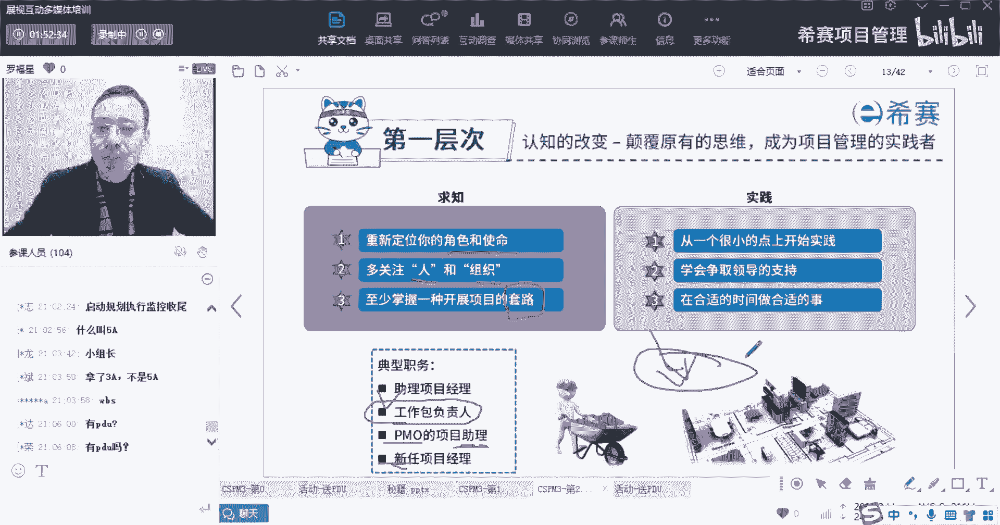

趁着我在讲故事的时候，先给你放屁就算了，你先看这一页，认真看，等会再截个图，然后呢再就再就是把那什么生蚝呀，淀粉啊，然后生抽啊等等东西放了水，还搞了水啊，搞得里面嗯，然后搞好了以后再淋到那个油麦菜上面。

淋淋到那个生菜上面就好了，诶，你会发现，其实哦原来做这个东西是有个标准做法，只是我不知道而已，只是我不知道而已，那么你如果你知道了以后，你下次如果再有人说诶，那要不来做一个生蚝油麦菜。

你不就变得很容易了吗对吧。

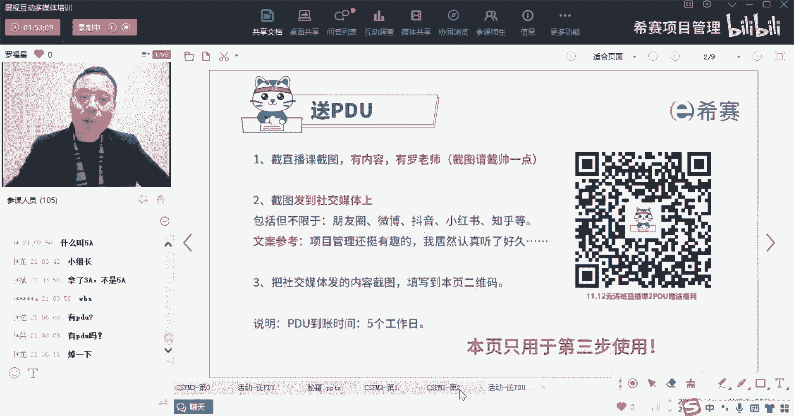

或者生蚝生菜就很容易了吗，所以我们就是懂得一些做事情的一个，基本的规则方式来做事情，OK他是从很小的一个点上面开始去实践，去尝试着去实践，学着去争取领导的支持，而这个点在我们的第三集里面会讲的更多啊。

会讲的更多，以及适当的时候做一些适当的事情啊，这就是第一层认知的改变好。

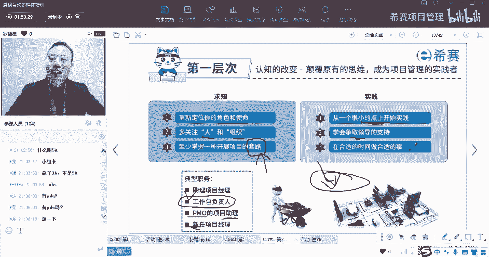

接下来到了第二层，第二层，这里面有考试要考的内容啊，兄弟们，第二层他强调什么呢，他说强调的是关于经验的积累，他说在实战中去成长，成为经验丰富的管理者，那么你的经验要怎么来经验，只有通过做事情才会有经验。

我们经常说是什么什么升级打怪兽对吧，就打怪兽升级，你一定要打怪兽，你才能够升级，你得要做项目，你才有经验，那包括那个什么生蚝油麦菜，我是自己亲自就跟小朋友一起看了视频，然后陪着小朋友做了一遍。

哎我才知道那个东西该怎么做，我下次就知道怎么做了，有有有这么一个过程，所以他关于第二个成绩，他说更多的是希望你能够去做事情，有一定的经验，那么关于这一定经验，你看这国家标准，对于第二级的项目管理。

专业人员的能力评价要求，这里列了好多啊，这个这个字因为太小了，你可能看不清楚，所以呢我给你准备大一点字，他说关于国家标准，对于第二级项目管理专业人员的能力评价要求，有这些啊，一个是说从事项目。

项目群组管理工作方面的这些个等级的人员，他应该达到能力要求，有个这个一个是环境能力要求，一个是个人能力要求。

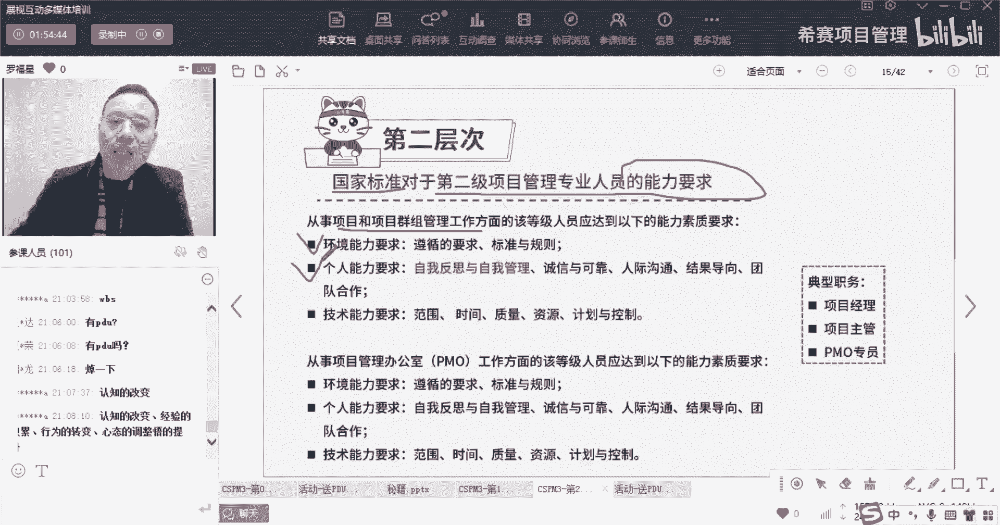

一个是技术能力要求，诶，还记不记得我们在最开始的时候有讲过，说那个能力要求这样的三个层面对吧。

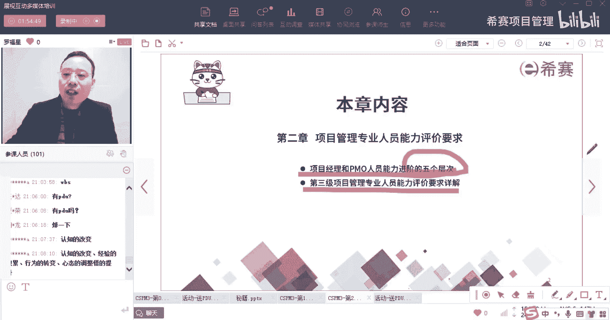

一个是一个是环境能力要求，一个是个人能力要求，一个是技术能力要求啊，环境个人技术三个方面的能力要求好。

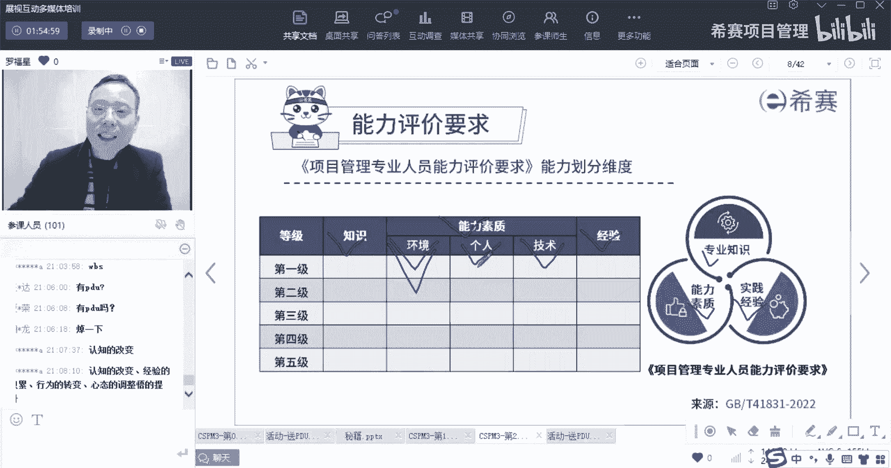

然后这个能力要求中，他说环境能力要求里面说是遵循的要求，标准和规划，合规则也是你要去，你要去遵守别人的规则啊，就说别人已经立好了规矩以后，你参考你去落实，你去负责去参与，你跟随就可以了啊，就是这个好。

第二个有个人能力要求，他的个人能力要求中，说是有自我反思和自我管理，OK那么这个人那一般反思和管理肯定是谁的，肯定是自己的啊，是自己的好，自己是个人反思和管理，然后说诚信可靠，有人际交人际交往的技能。

那么这个人际沟通，人际交往，也就是我们能够去通过交换信息达成某种共识，除此外呢他讲的时候是有结果的，导向呢，团队合作哎，团队合作也要注意一下，团队合作也说是个人的技能，说是你自己的这个技能能力要求。

然后除了这个环境的能力要求，个人能力要求以外，还有一个叫技术能力要求，这个技术要求说说的是范围，时间质量资源计划控制，这说的是什么诶，你会发现原来我们在项目管理中说的那些什么，范围。

进度成本质量资源沟通风险，采购相关方整合等等，这些东西都属于技术，我们原来学这些内容的时候，也讲过一个词叫技术，项目管理对吧，所以他会把范围管理，进度管理，成本管理，质量管理都当做是一种技能，一种技术。

OK可以理解吗，他会把这些范围进度，成本管理都当做是一种技术和技能好，这是第二层对于个人方面的能力要求，同时呢他说是如果说是做PO，如果做pm o的这方面的工作的话，那么在第二层呢。

它应该达到了这个能力要求，其实差不多啊，遵循要求标准规范啊，自我反思，诚信人际沟通，结果导向，团队合作以及技术也是范围，时间成本质量，哈哈讲这些东西好。

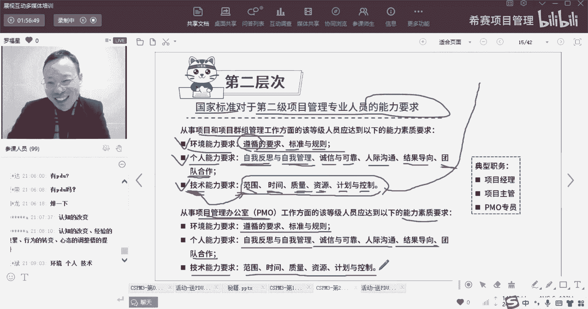

我们来诶，诶那个题目是不是搞错了。

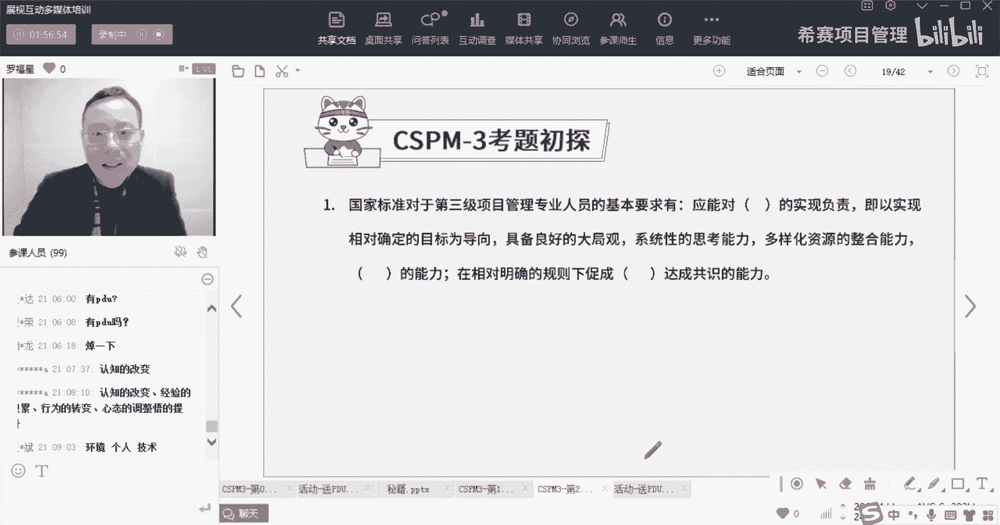

下了题目在题目到后面去了啊，那么这个第二层里面，其实也就是强调，你有很多的这样一个经验以及能力对吧，然后经验呢其实做事情才会产生的说项目管理，他说是对于项目的各个方面。

和利益相关方的这种动机来进行规划授权，监督控制，其实也就是我们做好计划，要做什么事情，然后安排谁去做，然后去跟进他做的怎么样，他又同时在这个过程中，从而能够在预期的时间之内去完成，预计的成本之内。

去完成预计的质量和范围之内完成，那么这几个点呢其实都是那种制约性的因素啊，同时还有关于收益和风险，这个呢我们在后面会看到，而第二集他说你的职位是项目经理啊，项目主管呢或者PO专员呢。

其实呢这些都是根据你的情况来诶，你需要去对这个项目负责啊，他说是要对这个项目负责，要去完成这个项目，然后关注下面这个绩效，绩效这个词，我们稍微解释一下，什么叫绩效呢。

记下它本身那个英文单词叫performance，我们也可以把它理解为这叫表现表现情况，比方说进度方面的表现怎么样呢，啊成本方面表现怎么样呢，啊那个质量方面表现怎么样呢等等啊绩效。

那么你就是需要去你需要去做事情，需要去做这个项目，推进这个项目能够交付成功的交付一般的项目，这是这个第二层，然后到了第三层，第三层，他说是行为转变中叫搞人这个词。

其实我不是很想这样的这种赤裸裸的方式去说，但是没办法搞人是什么意思呢，他说是要以德服人，成为富有激情的领导者，那么领导者是什么，领导者就是你要去引领别人，领导别人，能够去激发别人的能力和能量来做事情。

什么叫激发别人的能力和能量，做事情你就这样去想，你这里有好多好多那个玉米，你要把那些玉米给剥掉了以后，才能够出去去干嘛，哎你就跟小朋友说，我们如果今天咱们把这个，1/3的玉米给剥完了的话。

我们就可以一起去看电影对吧，或者还有就是我们今天把什么，把这个DR剩下的13搞完了以后呢，爸爸就给你们造炸爆米花，类似这种方式，诶，你其实就是想尽办法去调动他们的积极性，来做某些事情。

包括我们在以前看过那种抗战片里面，他会有一个什么样的场景，他会说兄弟们给我上吧，还有还有有些领导会说，兄弟们跟我上那么类似这种方式，它其实都是一种领导，领导是什么，就是能够去激发别人的活力和动力。

让他的冲锋有一个很好的理由，那么这是领导，OK那么关于领导和管理，这里有一个，这里有个信息，关于领导和管理是什么，我们来分别看一下啊，一个是一个是领导和管理是什么，第二个是关于这个国家标准中。

对于第三级人员的这些基本要求有哪一些，还有典型的职务有哪些。

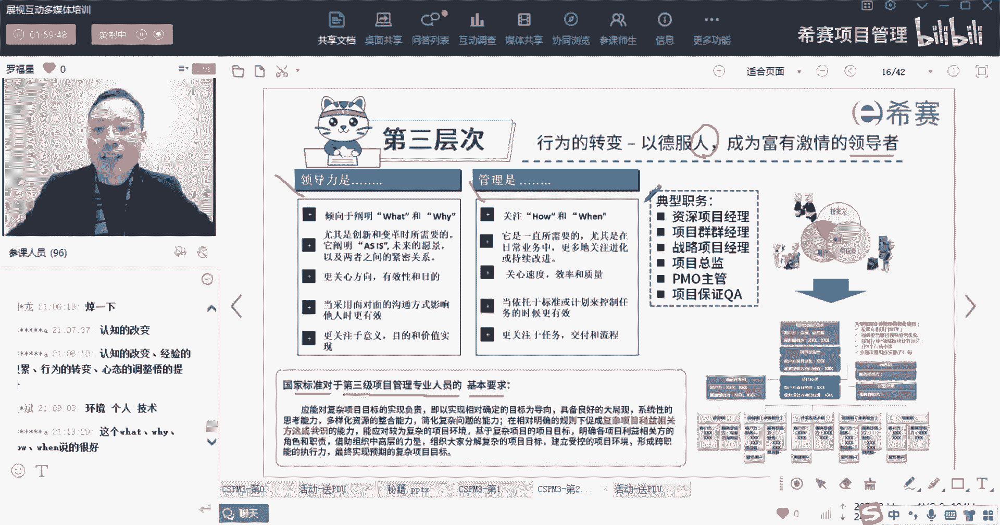

我们稍微看一看，首先第一个他说领导力是说阐明what和why，也就是给别人一个动力，让别人去知道这东西到底是为什么要这样去做，你跟他讲清楚以后，他就会心甘情愿的去做，如果你都没有跟他讲清楚。

那么他就是稀里糊涂的在做，就比方说有一个人在搬砖，你问他，你说诶你在干什么呀，我在搬砖，他一直在搬砖，所以他只是在搬砖，但是如果说你告诉他，我们现在要建一个建一个比方说是建一个学校。

能够为我们这个地方的孩子们，来提供一个很好的一个教育的机会，能够改变我们这个贫穷的那个那个那个山区，农村什么什么之类的，而这个时候别人可能就会不一样的，就能干起来更有劲对吧。

所以你能够去阐明我们要做什么东西，以及为什么而做，别人就会更有动力，就会更加搬起来干得有劲啊，他知道，尤其是在创新和变革的时候，变革这个词，创新这个词也好理解对吧，什么叫创新。

就是原来是原来一直用某种方式去生活，现在搞一种新的方式，这叫创新，而变革呢变革就是改变原来的情况，改变人的情况，就替换掉用心的东西，就替换掉旧有的东西只是变革，那么之所以要变革，往往是因为原有的方式。

他已经不行了或者不好了，我们才会去变革，那么它这里给了一个说是产品as和is，那么其实也就是说我们现在是什么样一种情形，以及我们未来希望是什么样一种情形，所以他会希望说把我们现在这个情形讲出来。

以及把我们未来的状态讲出来以后，能够去让别人看到哦，未来愿景，即使你可以把那里画一个大大的饼啊，有个目标，有一个大的饼，但这个蛋白饼这个目标在这里的时候，大概就会有更有动力去往前冲。

所以他说更关心的是方向，目的OK还有有效性，也就是说你能够告诉兄弟们往前冲，有肉吃，有汤喝，你只要跨过这个岭，那边就有一个很大的一个水库，水库里面水又清甜又舒服，什么什么什么又干净对吧。

给别人画一个大的饼，让别人充满动力，充满了斗志，他当采用面对面沟通的方式，影响他人的时候会更有效果，什么叫面对面的沟通，如果说你学过敏捷的话，你就知道我们所有的沟通方式中。

最最有效的方式就叫面对面的沟通，但是我在我在偏僻课程中，其实给大家讲过这样的案例啊，然后在这里稍微说一下，就是我曾经我们家小朋友当时在上幼儿园，到上小学的那一段，因为刚好他是9月份出生的。

我原以为他是可以上小学的，但是结果当时那一年突然就画的很严格，就不能上，因为人太多了，然后呢，我就跟那个园幼儿，幼儿园的园长当时没有去打招呼，我也不想给他送园的那个幼儿园，因为园的那个幼儿园虽然很好。

但是太远了，送的很费劲，我也想在我们家门口，就是在我们家小区来送，结果我给别人发了个信息，然后别人也回了信息，说哎呀，很抱歉，暂时没有，我给另外一个园长发信息，他也没有，因为我们那个小区有两个幼儿园。

结果我去到结果第二天，因为我休第二天是休息，上午是休息，我去到幼儿园去跟那个园长去聊，跟他用利益交换，我告诉他，如果让我的小孩在你这里读书，我会给你去培养你的老师，因为我确实有这个能力。

我是可以去给那种老师培训的，给那种幼师啊，教师啊，我是可以给他们培训的，我还有一套体系，有一套教育体系，当然不是我自创的啊，是我学的，我学了一套教育体系，然后结果我跟这个元旦讲完。

然后我又去了另外一个元旦，也跟他把同样的话也同样讲了一遍，他们都对我很客气，结果当天在下午的时候，马上就有一个园长就呃就跟我讲，还是刚好有一个空位置，然后我马上就让我太太去报名，然后呢到了晚上的时候。

另外一个人也跟我说啊，刚好这里空虚一位置，那我已经报名了，所以你会发现你单独跟他去发信息的时候，打电话的时候，现在你也跟他也有点熟，可是没有什么效果，但如果说你面对面的方式，别人会觉得你极其重视。

并且呢这个事情的效果也会更好一些，咱们中国人有一句话叫见面三分情，所以能够面对面沟通，就尽量面对面的沟通，OK这里这也是领导力的这个更好，能够去阐述的一种方式，所以你想如果说有一种那种什么那种。

很有煽动性的演出，很有煽动性的演说一定是单面的，你如果隔着屏幕，隔着一个屏幕去煽动性的演出，那肯定是起不到效果的，对不对，好他说更关键的是意义，目的和价值，所以这种方式去讲到底我们要干什么。

我们为什么要这样去干，知识才能够激活大家，激发大家领导力，就是能够去激活大家，激发大家啊，好然后呢另外他说管理是什么，管理是关注怎么做，什么时候交付，管理是这个其实做事情的过程流程如何去管理。

所以他说他还是一直所需要的是，在项目管理中啊，一直都需要这个管理，管理很重要，同时呢我们更关心的是在过程中关注速度呀，效率呀，质量啊等等，什么时候去做事情，关注交付关注流程。

OK这是领导和管理不相同的地方，那么这里面的话关注人为为多啊。

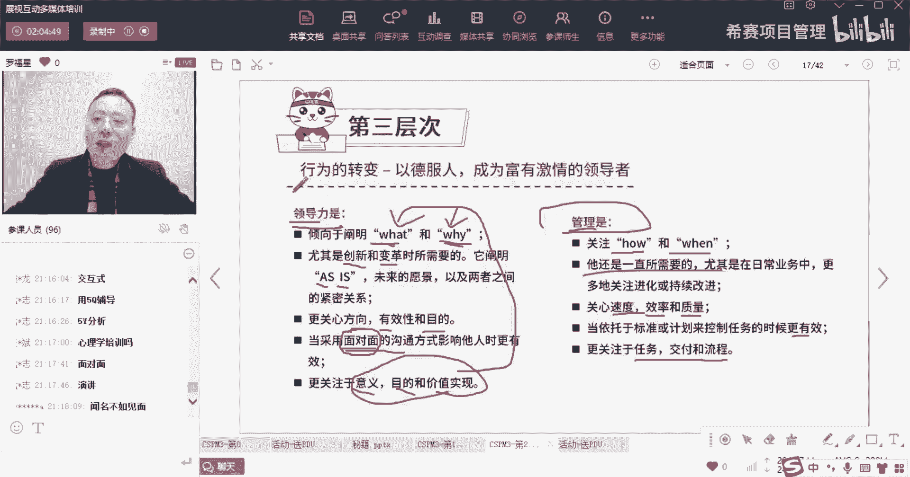

你要关注人，你要作为一个领导者，你要作为一个领导者，你要去影响他好，考试题目又来了，他说我们国家标准里面，对于第三级的项目管理专业人员，他的这个基本要求是什么呢，首先第一个能够应对复杂的项目目标。

OK人应该能对复杂项目目标的实现负责，也就是能够实现对于项目的目标为导向，具备良好的大局观，系统性的思考能力，什么叫系统性的思考，就不要头痛医头，脚痛医脚，而是而是能够通盘全局的去考虑它。

通盘全局去思考它，然后是多样化的资源整合整合，干这个词，我们前面讲过，说比方说你穿衣搭配的时候，你一定会穿穿衣搭配，你比方说我为什么今天要戴这个围巾来，第一个说出来的，我给你发一个小礼物，大家想一想。

我今天为什么要带这个围巾，你如果想到的是我今天带的真实的理由，我就给你发一个小礼物，孟孟子说冷子不是这个不是这个不是想一想，我为什么戴个围巾，OK郑同学正装正装第一个啊，就是因为黑色的衣服。

其实你想一想，如果说是这样的话，你感觉就是很你感觉这个就很丑，你知道吗，就是拍出来是黑乎乎的黑乎乎的，但是如果说你你搭了围巾以后就有点亮色，兄弟们明白了吗，所以一开始郑总说想要想要看到小礼物的。

刚好你得到机会了啊，得到机会了，所以就是如果说搞了一个围巾以后呢，它有一点点亮色，有点亮色以后，那个颜色看起来就会好看一点点，明白了吗，是这个逻辑啊，是这个逻辑，今天今天倒不是很冷，今天不是冷的原因。

OK所以有的时候你穿黑完全穿黑色衣服的时候，你就是需要那啥，你是第二个，等会有问题给你答的啊，等会有问题给你答，OK等会有问题给你答，你别着急，好郑总可以把名字敲一下，那么接下来你看我们所以整合。

所谓整合是什么，就是你要把多个东西放到一起来以后，达到一个最理想的状态，有一个平衡，有个平衡，有个balance，有个balance，有个平衡，OK哦，这种不是已经得到过了吗，今天已经有你了，有你了。

那第二个吧，第二个叫什么名字，第二个游客你叫什么名字，赶紧把名字抄一下，给你一个机会好，你看除此以外，他还有一个什么能力，要简化这些复杂问题的能力，就是这个问题本身很繁琐，很复杂的话，我们需要去简化。

OK发给王斌同学，除此以外呢，他说在对相对明确的规则下面，去促成复杂的利益相关方达成共识，什么叫复杂的利益相关方，可能是这些相关方的人，很多很杂，也可能会说这些相关方他们之间水火不容。

有有很多这种矛盾问题，沟通交流等等对吧，那么基于这种情形，那么你作为第三级，就是CSPM3级的人员的这一个项目经理，你要能够去应对这种复杂的这个项目目标，然后要去简化复杂的问题，然后要去处置那种复杂。

利益相关方之间达成共识，能够应对这种复杂的项目环境，然后OK明确各自相关方的角色和职责，借助这种高层的力量，能够去借力来去组织大家，去分解这种复杂的项目目标，然后建立一个受控的环境。

所以这个时候你是什么，你是一个资深的项目经理，是一个项目群的项目经理，是一个或者是战略经理啊，按总监，但这个钱还达不到总监这个级别啊，就是可能是一个资深的项目经理了，就是一个比较老手，一个老手K好。

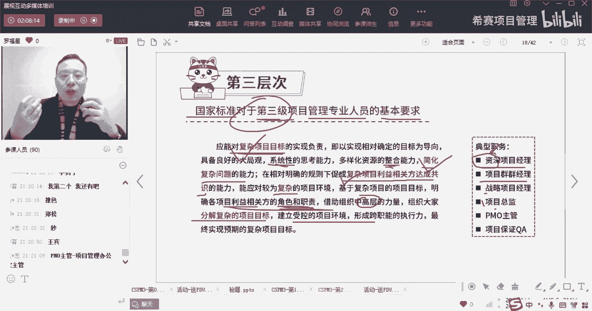

然后呢再往下面看，看到第四第四层，下面把名字可以敲一下啊，他第四层是搞什么，他说第四层是提升你的格局，提升你的格局，OK有大局观，他说是心态的调整，成为一个运筹帷幄的经营者，哇这个词一看有点像什么。

就是羽扇纶巾，谈笑间樯橹灰飞烟灭的那个是不是什么意思，就是他说你要在一个更高的维度，你不要是说在那个做项目的这个维度，来去看待这个事情，你要在那个领导者，在那个leader这样的一个公司的那个角度。

对一个谋士，一个大的一个，对一个掌控者这个维度来去看待事情，所以说是站在一个企业的投资和收益的角度，来整体看待，所以它的位置就更高了，OK他是作为一个组织级的管理者，领导者，对相孟总说的很对啊。

就是相当于把自己当作老板来对待，对罗总说的，把它当做一个操盘手来对待，所以这里面给了什么信息呢，来看一下，就因为这个数字太这个字太小了，我所以我把它调大一点啊，这个字太小了，我给你调大一点。

他说国家标准对于第四集，也就是说是那个那个高级高级，对于高级的项目管理专业人员的能力评价要求，他说能够应对组织的一个具有战略目标，来实现负责，Ok，OK应该能够对组织的一个具体的战略目标，来实现来负责。

也就是说是以成果和收益为导向，那么以成果收益为导向，这时的角度这就真的是占了一个更高的角度，对王总说的很好啊，叫越位思考，本位操作，这个时候就把那个越位思了，一个已经你已经遇到那个位置上面去了。

你要具有战略分析的能力，有战略目标的这个实现，然后能够去收益分析的能力以及机会选择能力，所以是把自己当作老板来对待，OK这是一个相当于一个总监的级别了，这真的是相当于一个资深的项目，总监的一个级别。

K优秀的应变能力以及位置的环境下，能够迅速定位和风险控制能力，其实就是一个大老板啊，一个老板的级别啊，兄弟们，一个老板的级别，能够应对复杂且多变的这种项目，群主的环境，根据战略目标的要求去策划一些项目。

选择一些项目，借助领导，借助高层的能力来去凝聚什么什么复杂能力，建立统一战线，所以这个调性就更高了啊，兄弟们真的是真的是越位思考了啊，然后能够能够保持正确的方向，就是战略方向。

并且逐步的去把模糊的东西变得清晰，把模糊的群组变得清晰啊，能够带领带在混乱的中间找到秩序哇，这都是领导们干的事情啊，这绝对不是一个小小的项目经理干的事情，兄弟们好，并不断去调整实现项目的路径。

什么叫调整实现项目路径，我们说战略其实有几个词，有有可以至少有三个词来去解释，是战略，一个词是目标，OK就是你的目标和方向对吧，第二个呢是实现实现路径，就是你有一个目标和方向，还用的是实现路径。

我们经常说是3年三年战略，5年战略对吧，还有一年战略之类的，所以战略还是既有目标，又有实现路径，有方向，还有第三个是能够整合资源，你能够整合好你的资源，你用你有已有的资源去做。

比方说你看过一个故事叫田忌赛马，田忌赛马中，田忌用了三匹马去对大王的三匹马，你的三匹马比大王的三匹马其实都要差一点，但是体验记，他用了这种一个一个一个新的，一个一个战略方式。

用了一个新的一个比配配对的方式，居然赢了兄弟们，所以你要调整你这个实现路径，这也是属于战略啊，好最终实现战略预期的结果和收益，能够对国和家的政策来做贡献啊，能够是对当地的什么环境特点有深刻认知。

能够协调国际的人员开展一些国际的项目，然后能够去做一些国际的项目，所以这是一个资深总监的位置，真的是替老板分忧解难，兄弟们啊，这已经很牛逼了啊。

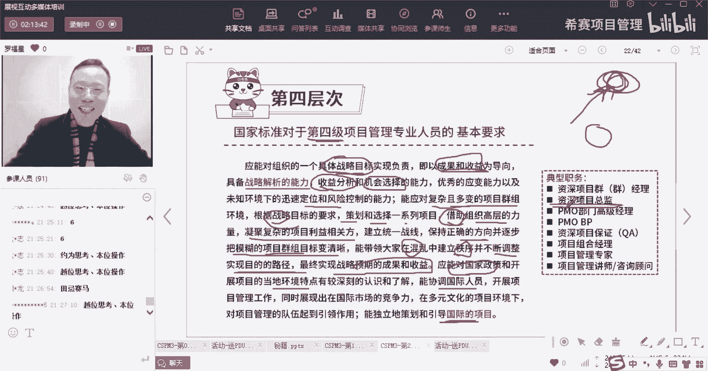

这第四层OK好，然后到第五层，第五层是什么呢，第五层他就给了一个词叫布道者，他说你要去做一个，他说是物的提升，说能够去唤醒自己的使命感，能够成为项目管理的布道者，也就是你能够是你能够去通盘全局去管理。

并且能够去还不只是不止掌门搞得好，大家都搞得好，有的时候其实你做一个就是做一个分享者，其实还是很有乐趣的，就像我自己为什么会一直从事这个行业，从这个行业当它能够给我，比方说能够养家糊口啊之类的对吧。

这肯定也是有的，但同时它还有一个好处，就说你会发现真的是有一种很快乐，比方说诶我能够教一个教很多人，让他能够去学到这些项目管理知识，他可能就会对于我们的很多这些，对我们不管是我们的国家也好。

或者某些行业，某些企业也好，他的项目管理可能会起到那么一点点作用，它只要起到一点点作用，我相信他对于节能呢，减那个那个真那个那个降本啊，增效啊，对于他的这种沟通的这种提升呢。

各方面会相信他以后一定会有那么一点作用，那么对于这整个公司的发展，一定也会有那么一点点作用，那么我就觉得诶好像我对于这个国家是，我至少不是一个废物，我不是一个只吃饭的人，我是对他有用的人。

所以有的时候你其实你做某些事情，你会觉得哎自己是真的是乐在其中，很有意思，他说到一定程度以后呢，他说你能够在一定的组织范围内，能够去营造一个有利于开展项目的，这个组织治理环境。

那么这个治理就是你来定规则嗯，要求怎么做怎么做，然后致力于项目管理行业的发展，所以能够推动这个行业的发展，还有说是项目管理人队伍的壮大，以及能够去提升这些从业人员的能力水平，好这里面有几条。

同时还有一条很重要，这里有一条，另另另一个眼才能看得见吗，叫参与国家或行业标准化的建设，也许你能够对整个国家的标准化建设，行业的标准化建设能够起到一些新的作用啊，能够去起到贡献。

说标准对于第五级的人员要求的经验，要求是什么，我们来看一下啊，首先第一个是你能够在这个环境之内去提升，对吧，然后去能够去对我们国家行业。

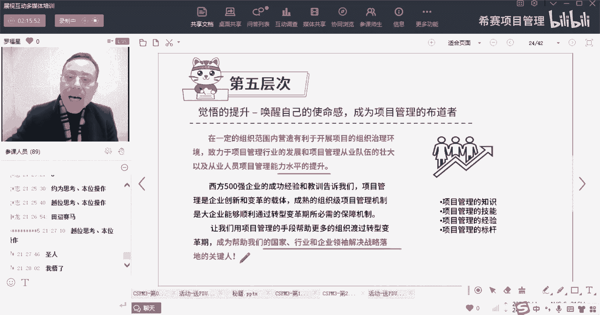

什么什么战略做贡献，能够去做很多很多很多事情，然后能够去呃。

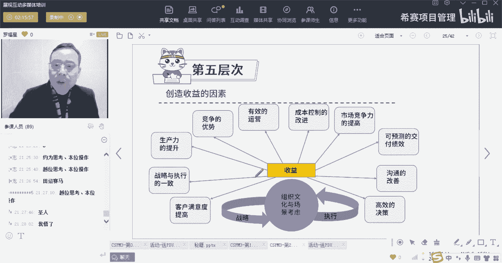

这里给了一个说是应该具有相对的这个，你看第五集的要求啊，第五级要求是是能够做什么知识，产知识组织过程，资产积累，然后呢有能力的提升，做丰富的经验的教育经验，然后能够去做一些案例的分享，能够去培训授课。

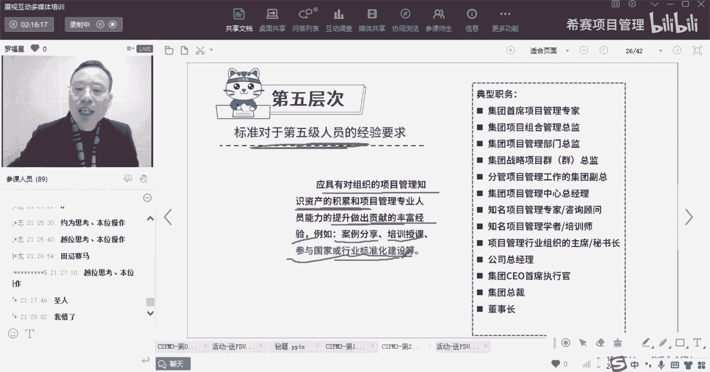