# 【收藏】CSPM-3中级项目管理认证考试直播课精讲视频合集（零基础入门系统教程）！ - P12：CSPM长空3-1项目环境影响 - 希赛项目管理 - BV16p42197SH

大家晚上好，欢迎来到西夏网专业的职业教育平台，我是罗福星，那今天晚上我们一起来开启的是CSPM，这门课程的第三章，叫项目经理角色的定位，以及受控环境的项目管理，那这个章节它的内容相对比较多。

所以呢我们是分到两次课程，我们今天晚上会讲一半，然后下一次课程呢会讲，剩下的一半会是这样的一个情况，同样的我们会把这个章节它对应的要考的东西，都做成了一种问答的形式，如果说你能够积极参与问答的话呢。

同样的我会给你发小礼物，啊啊每一次晚上你有一次机会，每一次晚上，大家大家都有一次可以发小礼物的机会，好不好，小礼物呢反正可以挑，我们有那个有有有有有偏僻的知识地图，有NPDP的知识地图。

有一个NPDP的一个鼠标垫，然后还有一个时钟，然后还有PDUPDH都可以选择，那我们就一起来看一下，这是关于第三章。

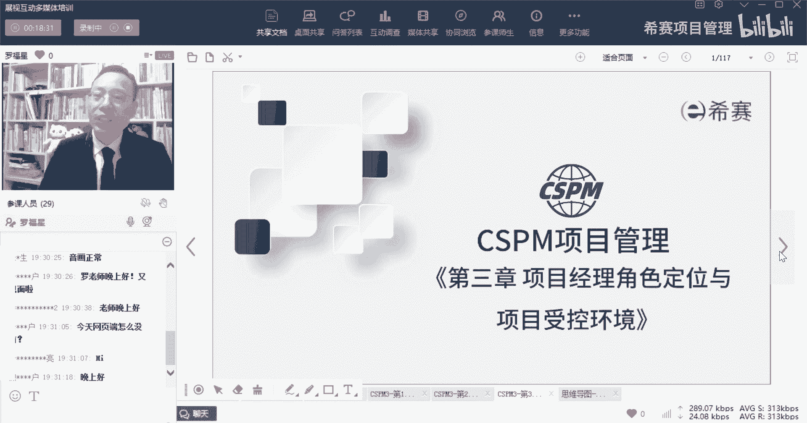

项目经理角色定位以及受控环境的项目管理，呃，这个内容呢默默老师给你们做了一个思维导图，就是我刚刚发在班级群的这一张思维导图。

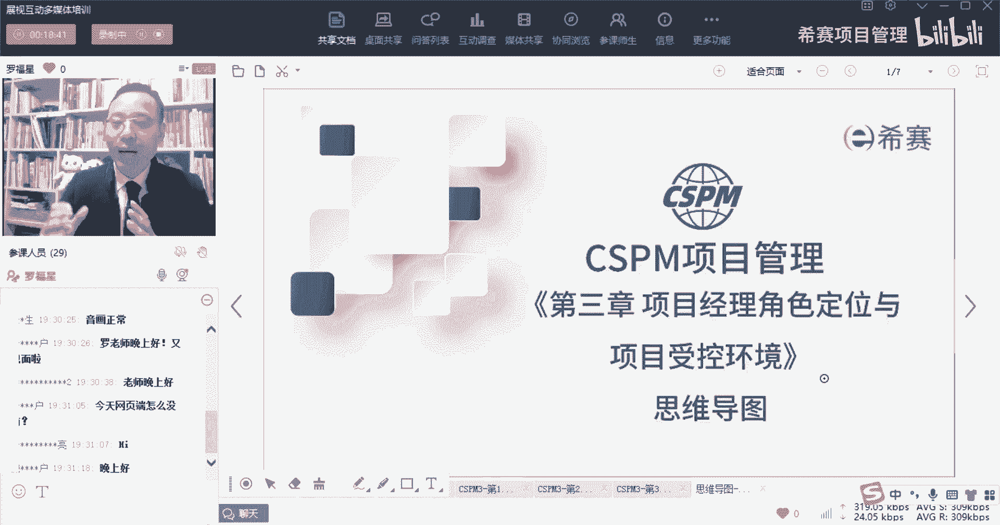

大家可以看一下啊，就整个这个章节它一共会分到这样的几个板块，第一个板块是组织视角下的项目管理，也就是说是站在公司的层面，站在组织的层面，它是如何去看待这样一个项目管理的，然后接下来会讲到第二个板块呢。

是关于项目治理，那我们其实在之前学PMP课程也好啊，学呃呃那个NPDP也好啊，可能都听过这个词叫治理对吧，叫governance，那在这里呢会把治理讲的更深入一点点。

当然如果说你已经上过了prince的课程，基本上就是你学过的那一套啊，就会把治理来讲得更深入，然后再接下来就会讲到是关于项目的组织，那这个组织会包括里面有一些什么，什么生命周期啊。

组织结构类型呢会有这样一个解释，然后再接下来我们可能到了下一次课啊，有可能到了下一次课，我们会讲到的是关于项目管理中，在咱们新版的这样一个内容，也就是也就是大家手头上拿到的一个叫拿到的。

一个一个一个新版的111本一本讲义，不叫讲义啊，应该叫做标国标啊，日本新版的新版的那个ISOR1502里面，它的标准面，它会把项目管理的哎，这样一个东西又重新做了一个划分，它分到了一个叫做八大过程组。

但是其实我是觉得这个叫法呢感觉很奇怪啊，但是你知道是怎么回事就可以了，你知道是哪几个，然后他们分别干什么，咱们把这个搞搞清楚就可以了，另外呢还会有一个叫项目管理实践的，17个知识领域。

那这个八个过程组也好，17个知识领域也好，它都是属于这本教材里面的一个章节，这个呢是第六章，这个呢是第七章啊，当然是这么一个安排，我们会先来过一下啊，然后再到了后面就是叫项目经理和PO。

他的能力素质模型，能力要求，其实理论上来讲，这个章节它应该是放在了下一个章节，放在了第二章，但是因为我们其实呃我们手上拿到的讲义呢，都是由官方给的，就是官方给了我们讲义。

我们在官方给的讲义的基础上做了一些调整，所以我们把它按照跟原样来去做处理，大部分东西都是保留它原来的位置，就没有把这个位置本身做调整，依然还留在这个地方，是这样的一个安排。

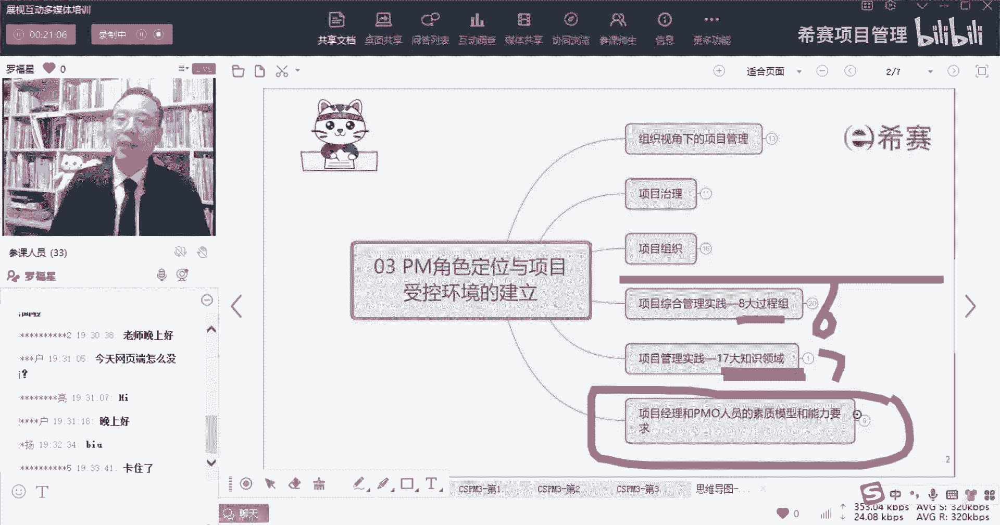

那首先我们先来看到是第一个板块，关于向那个组织视角下的项目管理。

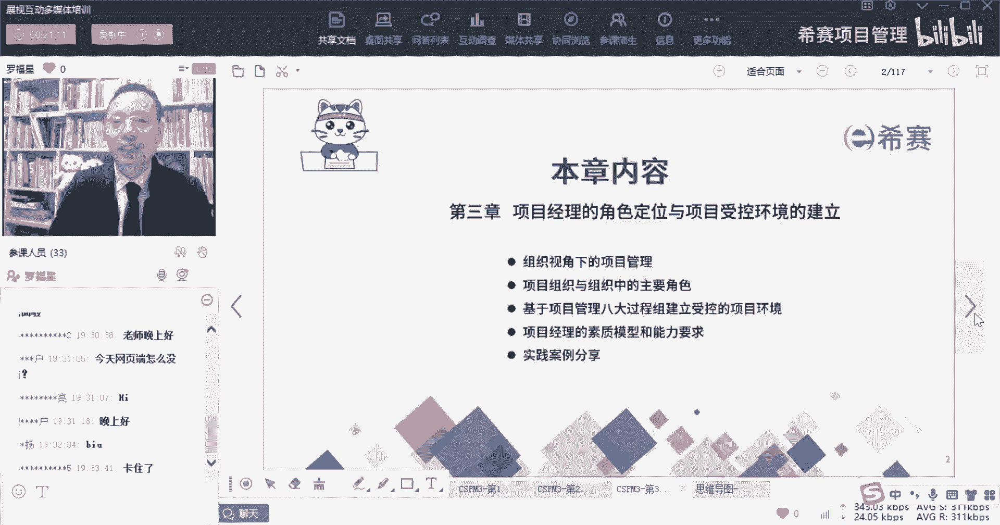

关于组织视角下的项目管理，他会讲一些什么内容呢。

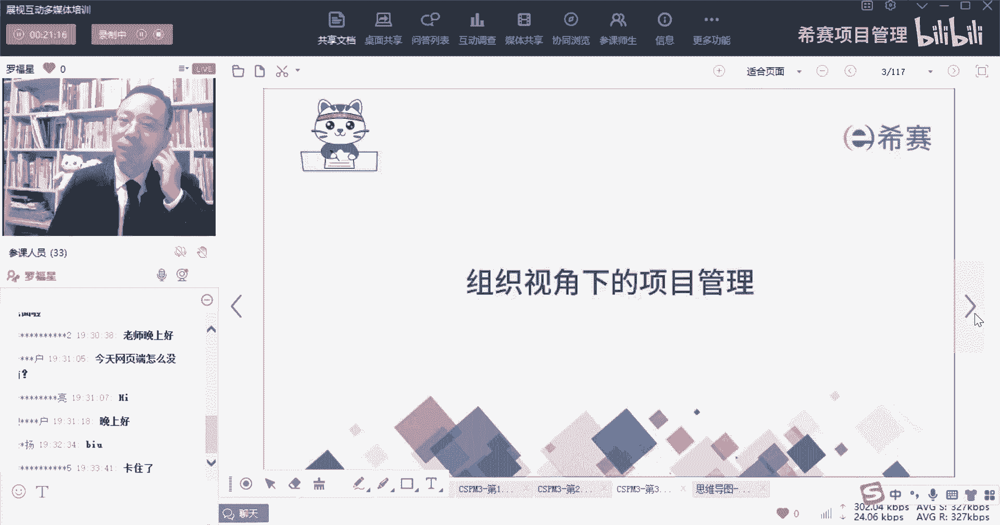

我们首先要知道一下，其实任何一个项目，他一定会受到很多外部环境的影响，也会受到很多公司内部的这些环境的影响对吧，我们说呃，其实你知道前面有我们讲过一个，就是在偏僻的课程中讲过一个词叫组织过程。

资产和事业环境因素对吧，那么那个事业环境因素，它就是咱们在这一段所说的叫项目环境，项目环境既包括了内部的环境因素，也包括了外部的环境因素，所以你看项目的环境，它会影响项目的绩效和项目成功的可能性。

而我们的这个项目环境呢，包括了组织内部的环境因素和外部的环境因素，这是要考的啊，兄弟们，等会会有题目要考的，所以我们在真正去做项目管理的时候，其实是要需要要去综合考虑，组织内部的这些环境因素。

以及外部的环境因素，首先我们得要去适应一下，整个外部的这个商业环境，并且呢能够比较好的去利用我们的这个环境，所谓利用环境也有一个很好的词汇叫借力啊，我们能够去借组织的力呃，上一次好像也有讲过。

就是有一些人，他在某一些这种大型的单位里面去工作，工作的如鱼得水，风生水起，那你其实有的时候你要去感谢你的那个单位，因为单位他给了你一个很好的思想才华的机会，事实上我们真正在做项目的时候。

如果没有这样一个组织，有一些角色的那种工作能力，其实是没有办法去凸显出来的，也说也有一种情况，就是有一些人他从某一些这种单位呃，优化掉也好，或者是被被迫怎么样也好。

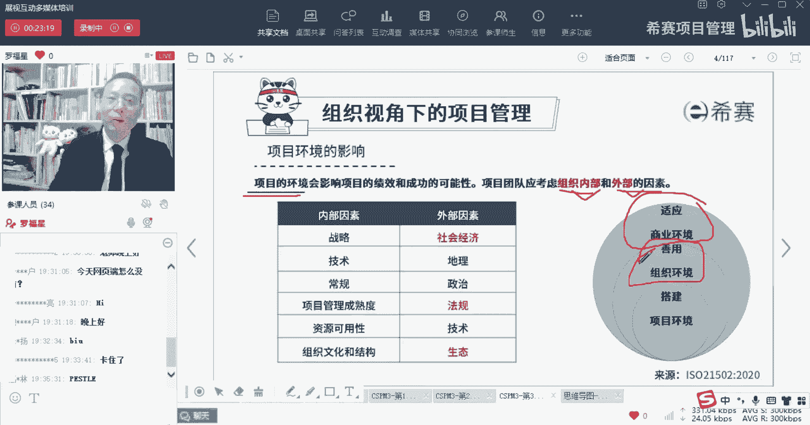

他很难再去找到一个很合适的工作，为什么呢，其实是因为他的那份工作内容本身。

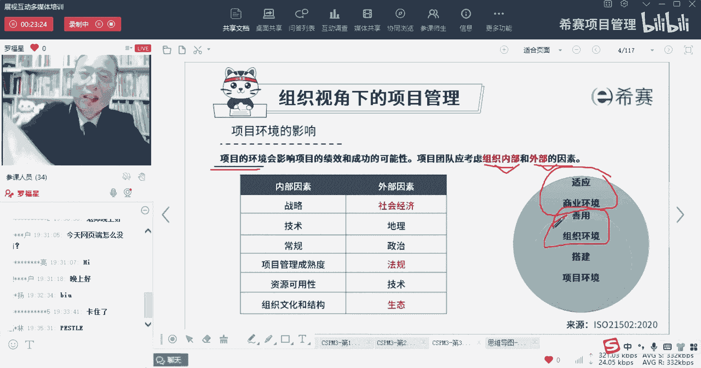

如果说换了一个别的组织里面，可能是不具备或是没有会存在这种情况，会有这种情况，所以呢我们除了要去适应外部的商业环境，我们还要能够去善于利用好组织的环境，能够去做好这样一些产出的事情。

而本身作为一个管理者，你有的时候要跳脱出来，不仅仅只是一个项目管理者啊，在项目管理中有一句很有意思的话，叫做越位思考，等位操作，那你有的时候呢你还需要去越位思考一下，你要去替领导分忧解难。

所以呢你要去替领导来去做这个事情，叫什么呢，叫搭建项目环境，理论上来讲，作为一个项目管理者，你更多的是去直接去利用好这个环境，去做事情就好了，但是对于项目的环境，有的时候需要你去构建，你要构建什么。

比方说你要去构建，说我可能这个项目需要什么样的人才，什么样的人才，什么样的人才，他什么时候干什么事情，什么时候干什么事情，什么时候干什么事情，然后跟谁去汇报，跟谁去汇报，多长时间汇报一次。

汇报到什么程度，那么对于这些东西，你也可以把它理解为说是去构建这个环境，搭建的环境，那有，所以并不是每一个项目经理，都只是负责去执行和落实，有的时候你还要是从更高远的这种位置去看待。

既要考虑到我这个项目上本身的这些个角色呀，职责呀的划分和安排，同时也要考虑到我可能在什么节点上，用什么样一种方式去跟谁汇报，需要找到谁来去做一些支持，这也是你需要去干的事情，所以你会发现整体来讲。

环境其实对我们来讲很重要，那整个在做项目的过程中呢，呃你会受到各种内部环境因素的影响，和外部环境因素的影响，我们来看一下内部环境因素，所谓的内部其实讲的就是说我们公司一类的啊，说的是项目之外。

但是咱们公司一类的对啊，你看有一个同学给了一个非常好的信息，说要有全局观，要有全局观，要有大视野，特别好啊，那首先会对我们的这个项目产生影响，第一个就是公司的战略，万一什么是战略呢。

有一个简单的那个解解释，就是按照三个词或者三个意思来去解释，战略是指说我们未来有一个大的一个愿景，就是我们公司想要构建一个巨大的一个愿景，对吧，那么未来去构建这个大的愿景呢。

唉我可能会把它定成一个5年战略计划，3年战略计划，一年战略计划，然后什么什么这个业务战略计划，那么这个战略中，它其实就包含了一个目标和方向，好我会有一个目标和方向，那你想你的目标和方向定好了。

那是不是就势必会影响公司如何去挑选项目，去筛选项目，是不是，所以我们的项目一定会受到公司，战略目标的影响，并且呢我们的项目一定会需要去跟公司的战略，怎么样，兄弟们相一致，对不对。

你的项目一定是跟公司战略是相一致，你才适合存在，要是你的你做的这个项目，跟公司的战略目标是不一致的，那么大概率你就很难获得支持，你就很难获得资源，你可能就很难推进下去。

所以首先第一个很重要的是跟战略相一致啊，完了我们再再还回到战略，我开始说战略讲有三个点来去解释，第一个点是你有目标对吧，有目标有方向，第二个呢是有步骤有计划，就是我会计划怎么做怎么做怎么做对吧。

我先从这个呃半年的战略到一年战略，到3年战略到5年战略，我可能会有步骤的方式来去做，有节奏，它相当于是一种计划，它不同于计划的地方，就是很多计划是一种确定性的，但是账面里面的类似东西呢。

它是一种不确定性的，会有这样一种情况，所以它既有这一目标和方向，又有又有这样一个计划，同时呢它还有一个点也很重要，就是它能够更好的去整合资源，就你这个战略你一定是需要去考虑整合资源。

你利用好这个资源来达到战略目标，达到这个战略结果，我们经常会讲的说，哎田忌赛马就是一个很典型的案例，所以首先第一个会影响我们项目的是战略，这一定是毫无疑问的啊，毫无疑问会影响的再来认识另外一个词。

也会影响我们的叫技术，那你想公司，比方说你想，以前我不知道有没有有多少同学是学it的啊，有多少同学学IT的，学it的同学，有没有发现说你最近这10年的工作，20年的工作，你不断的在学新技术。

有这种感觉吗，兄弟们学it的同学来亮个相，有没有感觉到这10年，20年一直在学各种新的技术，总有好多新的东西出现，我的天了是吧，诶那么其实随着技术的更新迭代，我们所做的项目它可能会有些不相同。

或者我们实现项目的方式一定会有些不相同，所以为什么T人能够去拉高薪，其实就是因为你们不断的在学习，在迭代，在进步，像有一些那种专业，有一些行业，他学的东西就一直重复的重复的重复的哦，吴总来了。

吴总晚上好，我看一下啊，张总说我大学的时候学的是产品技能，到公司不符合公司的战略，做了一段时间的冷板凳呃，这个还不是这个意思，很多时候说的是我们某一个项目本身，它跟公司的战略已经是不匹配了。

或者说是当公司的战略目标做了一些调整以后，当公司的战略目标做了一些调整以后，你就会发现原来觉得很好的那个项目，现在已经是不被看好了，不被优待了，可能会需要去剥夺掉一些资源，会是这种意思呃。

他跟你自己就你学技能和跟公司战略不匹配，这是另外一回事，就说你一般我们去到一个环境，肯定是需要去跟环境相融入对吧，但是我们现在在这里讲那个公司的项目，它会受到环境的影响，说的是。

咱们这个项目应该跟公司的战略本身是相匹配，相一致，是这个意思啊，好我们再回到第二个技术，其实你会发现基本上只要是做IT的，都在不断的学经济，新技术，真的是根本就学不完，所以你们为什么薪资待遇比别人要高。

同样是985，同样是211，同样是跟你差不多那种学校毕业的，你会发现绝大部分小伙伴他的那种薪资待遇，除了少数几个做生意啊或什么之类的，大部分人其实都没有名字，待遇好，真的是这样一个情况，所以做技术。

它本身其实还是你还是吃到了技术的红利，但同时呢你可能也受到了一些伤害，比方说头发好像没有那么多对吧，或者有可能会嗯嗯，比方说有一些别的一些什么什么影响之类，有这种可能性。

但是我们所有的项目一定会跟技术有关联。

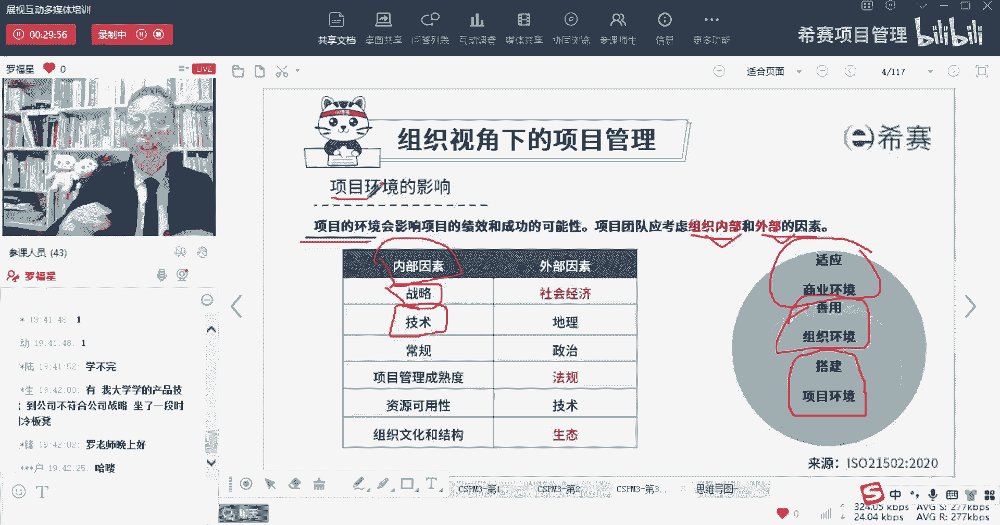

一定会受到技术影响，唉这是一定的，然后呢，还有就是一些其他的一些奇奇怪怪的一些影响，就是我们生活中的各种奇怪的，奇奇怪怪的一些影响，这个呢就生活中有本身每一个公司，有公司的这些，你看自身的这些文化企业。

文化文化是个什么东西呢，文化我们经常会说，比方说东北文化啊，有北京的胡同文化，可能会有那个就是什么中原文化，西北文化啊，荆楚文化，湖湘文化，岭南文化，闽南文化对吧等等，那你会发现。

其实文化它一定是一个比较大的东西，它是一大群人在一起的时候，慢慢慢慢去养成那种共同的习俗啊，共同的礼节啊，共同的信念啊，共同的东西，那个叫文化，而企业呢企业这一群人在一起的时候，他们也会养成一个东西。

那他们养成这东西呢也叫企业的文化，那我们的项目一定会受到企业文化的影响，就是有一些企业它的老当了，企业文化一般是比较呃展现谁的这个气质，或展现谁的意图，兄弟们，企业文化一般展现谁的意图。

一般展现的是领导的意图对吧，展现的是领导或者说是老板的意图啊，一般是感谢老板的意图，那我们所做的项目一定会受到这个文化的影响，受到公司这个企业文化的影响啊，毫无疑问的。

那还有一个呢就是公司的这个组织结构类型，公司的组织结构类型里面是一种一级一级，一级一级等级的，这种组织结构还是比较扁平的方式，去掉忠诚的这种方式，它会有不一样，对不对，它是会有一些不相同。

那我们做的项目也会有不一样，你甚至包括说就是一个汇报关系，它都不相同，是不是，所以公司的组织结构类型不一样的时候，我们这个项目的开展推进也会受到很大的影响，那再一个呢就是资源的可用性，关于资源可用性呢。

在偏僻中也会讲到资源可用性，它是属于外部的，属于事业环境因素，什么意思呢，就是说我们公司，他的这些人的整体水平是什么样子，已经定下来了，所以不会因为我作为一个小小的项目经理，而导致这个事情有巨大的改变。

所以关于资源他的能力水平以及它的可用性，都会影响到我们这个项目，就像我们经常会说哎呀，我希望那个谁能够在我这个项目上搞两个，两个月，那时候还不行不行，那个时候已经被占用掉了。

这就说明那个资源是一个很牛逼的资源，你也想要别人也要想，想要用都要抢他，所以呢他一定会是影响咱们项目的，还有一个是管理成熟度，所谓管理成熟度什么概念呢，不太就是没有，没有太把这个管理当做一回事的人。

他每一个项目都是一个全新的项目，每一次都是手忙脚乱的在搞事情，这就是一种呃，有没有同学，你们公司有评过那个叫CMMI评级啊，有吗，你们评了几级，你知道CMMI评级中，它的那个一级可能就属于每一个项目。

都是全新的项目好，然后呢你到二级的时候呢，就可能会有一部分东西是可以去重复的，可以去复用的，然后到了第三集，到了频道第三集的时候呢，就是有很多东西都是可以通过这种，偏结构化的方式呀。

能够去复用的方式来去做对吧，而到了第四集，到了第四集的时候呢，他会说我们的项目管理，很多东西是可以量化管理，什么叫量化管理，就是我能够去确定的，量化到我这个东西大概是多长时间，能够做到什么程度。

能够量化的去做这个事情，而到了第五集是什么概念，第五集是能够去优化，就是自我优化，自我更新，自我迭代，就是做的很牛逼，甚至你已经做的非常棒了，那么一个公司你经常会说哎呀，我想要去一个大公司。

你为什么想要去一个大公司，你觉得他的管理比较完善，那么这个管理完善，就属于说这样管理成熟度比较高，那也有一些小公司，也有同学会说哎呀我们公司真的是什么东西，乱七八糟，就是都是想一出是一出对吧。

那种凭感觉的感觉，那么这种如果说是想一出是一出凭感觉的，他就属于说管理的成熟度比较低，那你想你的管理成熟度，它会不会影响我们的项目管理，毫无疑问，如果说你们公司的管理成熟度是很很低的。

那很有可能会导致一种什么情况呢，就是你管项目的时候，完全靠你自己的能力，靠你的技能，但是如果说一家公司它的管理程度非常高，他会把这个事情都是能够去捋得清清楚楚，明明白白，那虽然可能有一个人是一个新手。

可是他会接受到一定的训练，培训以后，他把事情能够有效地去推进，能够按部就班地去推进就可以了，也同样能够管理好项目，所以是有背后的力量在加持，那么这些东西都会影响我们的这样一个项目，对不对。

所以首先第一个就是，我们肯定是会受到内部的影响，也会受到外部的影响，而我们的内部影响的因素呢，刚刚简单的给大家过了一下，就是包括像什么公司的战略呀，公司的这些技术能力水平的成熟度的能力啊，管理成熟度啊。

资源可用性啊，以及文化呀，组织结构这些都会影响到我们的项目，那除此以外呢，还有一些外部的因素影响，那外部因素影响这个就太大了太大了，他讲的是什么东西，我们来稍微捋一下啊，稍微捋一下。

首先他会说有一个大的一个因素呢叫社会经济，就是如果这个经济是比较好一种状态，那大家的项目都能够比较好的去开展，也都能够赚到钱，就大家都可以赚到钱，但如果说是一个经济下行的状态，可能会发现都很难都很艰难。

都像我不知道你们是不是也听说过，你的朋友的公司有在优化，就是有一些些优化，是不是对，很像房地产，它也是也也在，也在做一个很大的一个各种暴雷啊什么之类的，所以当经济下行的时候，大家会发现钱越来越不好赚。

当前有一个很好的一个信息叫什么叫点线面体，就是你所在的这个项目，它一定是隶属于这家单位，这个单位呢它一定是隶属于某一个行业，而这个行业你不管是哪个行业，你一定是在某一个社会中，那么这个社会呢是一个体。

这个社会这个体它整体在往上走，你就会发现你的行业其实相对来讲也比较好搞，如果说这个社会整体在往下行，那么你这个东西你再往上崩也崩的很难，所以我们一定是在某个面上面，同时也在某一个体上面。

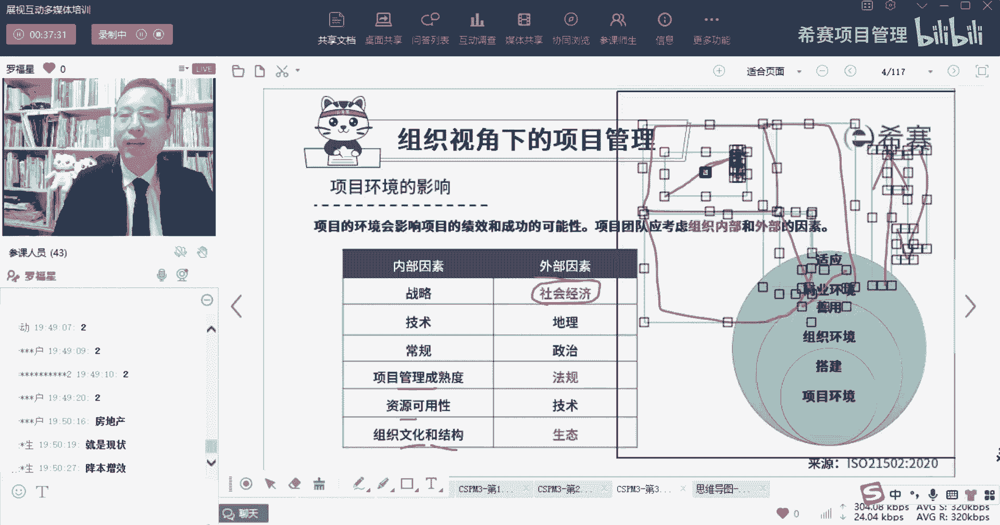

这才会说到说是男怕入错行，女怕嫁来，我们要去选对行业，但选对行业的同时，我们也希望是能够生在一个好的时代，也有经常有人说叫什么叫生不逢时对吧，那么可能刚好，就是现在这个经济下行的这个时代。

你就会发现你的很多努力，他的那个最后的结果都是非常有限的，哎这就是一个说是外部的影响，这种社会经济的影响一定会有影响，第二个呢是地理地理位置，那地理位置影响，你想一想大家在哪个城市来告诉我一下。

你现在你此时此刻你在哪个城市工作，兄弟们，北京啊，在广州啊，在东莞啊，深圳啊，成都啊，呃呃也有同学在烟台。

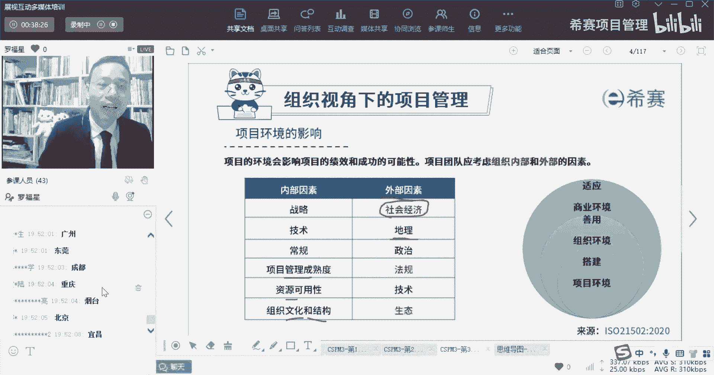

宜昌重庆对吧，诶你会发现其实相对来讲，大部分同学所在的城市都是比较大一点的城市，而这个信息呢我对我对这东西的感知，可能比你们会更加直接一点，因为大家知道，其实我们是在全国各地都拉了。

那个叫城市交流群或者省份交流群吧，比方说有有湖北的项目管理的交流群呢，湖南的西山项目管理交流群呢，然后是什么江西的项目管理交流群啊，然后北京的呀，上海的呀，深圳的呀，广广东的呀等等。

那我会很直观地感觉到，你像现在我们的北京的那个项目管理交流群，就已经建了四个群了，就500人就满群对吧，就已经搞到490啊，500左右了，那么就建新群，已经建了四个群了，上海呢已经建了三个群了。

然后广东呢也建了三个群呢，呃湖南建了两个群，然后像湖北目前是建了一个群，然后像江西建了呃，一个群呢才几十个人，所有各种各种，就是你会发现我经常会拉人的时候，我就知道诶基本上是沿海这一带。

就北上广深哪沿海城市，江苏浙江它就集齐的人多，就是我们的学员多，我们的学员多说明什么，说明全国的学员多，因为大家去选这种培训机构，它一定是一定是凭感觉的，不会是不可能说是某个地方的人，就一窝蜂的去选了。

谁谁谁，另外一个地方就一窝蜂的又选了谁，不一定会是这样的，他一般都是平均的这种感觉来去选的，所以你会发现，整体来讲真的是北上广深这种地方，他的学员就是会更多一些。

像江苏浙江这两个省份的学员就是会多很多啊，当然还包括像四川成都也还比较多，重庆啊也会有一些，当然因为可能是刚好我们自己置身在湖南，所以呢我们湖南的学员也还多，也还有一些湖南的也还比较多。

所以它我们能够很明显地感受到这个地理位置，它对于这个事情的这个开展一定会有影响，所以你们在做某些项目的时候，不是长沙的群，是湖南的群，我们是省份啊，就是各个省份的群，每个省份都有啊，想都不用想。

每个省份都有兄弟们，所以其实地理位置，他也会对我们这个项目有影响，你想包括有一些同学，你们是不是也有同学是曾经从大城市，想要逃回到小地方对吧，叫逃离北上广，有没有那种小伙伴，身边的小伙伴逃离北上广以后。

又回又再逃回北上广的，有没有那种情况，为什么呢，因为他会发现到了小小地方以后啊，找不到工作，找不到很合适的工作，你的才华，你的技能在这个小城市都没有一个合适的，没有一个麦琪的这个这个工作岗位。

就很就很尴尬，你知道吗，像我自己的话，我以前在技术行业做技术行业做项目管理，但是呢我如果回到常识的话，我也可以做那种RET这个领域的，项目管理的工作也是可以做的，但是我没有，我没有，我是进来的时候。

别人就直邀请我加入到西线来做培训，可能是因为看，我觉得觉得我应该是有讲课的潜力吧，就就就换了这个行业，要不然的话，其实如果光是做，即使这个板块，我在长沙估计也很难找到工作，也找不到工作。

包括我有同学在上海做成高精尖的这种，这种什么芯片芯片开发的，他想要回湖南，发现真的是没有什么机会，没有什么太多机会就很难，所以地理位置它也会去影响这些项目的开展，一定是的啊，毫无疑问，那至于说政治因素。

这就这就不用讲了，就是比方说因为雾霾的原因，所以呢我们就国家就颁布一些什么什么要求，必须要怎么怎么样，或者说是某一些这种呃政治的因素，有一些政治正确性，比方说我们会定一些什么样的种。

就是这个法律法规会受到政治的影响，我们会因为正的因原因而去定一些法律和法规，从而能够去干什么什么什么什么事情，对啊，一定会有这样的一种情况，所以他一定会对我们的项目有一个，很直接的影响。

还包括说像现在如果有同学在做外贸的，你从事外贸相关的工作的话，诶你会发现有难度，为什么有难度诶，他其实跟这个也有关系对吧，哎跟我们和一些西方国家，他们之间的关系也会有关系，跟这个口罩其他也有关系。

都是有的，那法律法规这个点就毫毫无疑问，虽然有有罗翔老师给大家讲过，说说中国最赚钱的项目全部都写在刑法里面，其实也就是告诉大家不要去擦边，不要去违法，那么法律法规一定会去实现。

法律法规它一定是毫无疑问的，这是一个硬规定的，是应用性的规定，那么还有一个呢就是整个社会的一个技术发展，那社会的技术发展，就是包括像我们每一家公司自身的技术，一定是会受到大的这个技术潮流的发展有关系。

呃，我不知道你们有没有这种直接的直接的感觉，就是这几年啊，我说一个我简单理解的那个技术，叫与15年以前吧，15年以前，其实没有什么语音识别的这种技术，图像识别就更差，也没有什么图像识别的这种技术。

然后到后来慢慢的这个语音识别做的越来越好，越来越好，好到什么程度好，到现在大家如果买一些某一些那种语音翻译器，甚至连你讲方言，他都可以给你识别出来，成为一个什么什么，就他当他前提是有那个方言库啊。

当他有方言库的时候，他是连翻译他都可以那个，所以你会发现这个技术的发展真的是很牛逼，很牛逼对吧，呃像有一个公司很牛，叫科大讯飞，你们有没有用过科大讯飞的产品，用的什么录音笔啊。

用他那种翻译笔啊什么之类的，真的是可以做的很牛逼，是不是啊，同传，所以这种技术的发展，它一定会导致我们上一些新的项目，比方说他因为本身科大讯飞，它的这个东西做的很好了以后，它就可以很短的时间内。

就可以生生产出很多新的产品出来，它生产这种各种什么录音笔啊，甚至说录音笔里面就可以把那些东西，直接转变成文字对吧，你们可以把我的课转变成文字，是不是也可以这样子对，所以技术发展一定会跟我们这个项目。

有很大的影响，还有一个是生态环境，生态环境怎么讲呢，如果生态环境好的话，某些地方有一些类型的项目，它是可以去开展的呃，开展跟矿场相关的，那如果说是环境已经破坏的比较多的话，那么人一定会离开这个地方。

没有人居住，这个地方人口凋零，那么各种产业都破败对吧，百废待兴，就可能会有这种情形，所以生态环境一定会有影响，包括说我说如果生态很差的时候，我们可能要开展一些什么叫整治雾霾的行动啊。

可能有可能废水废水去就是处理呀，废气处理呀等等这种这种行动，所以都会有很大的影响，包括像生态影响中，最近还有一个很有意思的一个词，呃，一个一个新闻也不是很有意思啊，其实应该算是很难过的一个新闻。

就是说什么上海陆家嘴买了苏州的一块地，三块地板，然后盖房子，然后盖了什么什么什么那个还盖了很漂亮，商场什么之类，结果发现那地势是是污染了的，是被严重污染的，那些某某重金属的超标超了多少多少倍啊。

结果导致这个地方，那大家注意的地方，其实会很有很大的这个隐患啊，有很大的隐患，那说明什么，说明其实这些东西，它一定是对我们这种建筑行业有很大的影响，所以你就知道哦，原来这些外部的因素，不管说是经济也好。

地理位置也好，政治法规技术，生态环境，它都会影响我们的项目，他说所以团队，项目，团队应该要考虑组织内部的环境因素的影响，以及外部的环境因素影响，对于那种更外部的环境，我们只能去适应它。

但是对于我们公司内部的这个环境呢，我们要善加利用，我们要去借力，我们要去借他的力，那至于说自己这个项目的环境，你作为一个leader，作为一个项目管理者，哎，你就可能是去充当这个搭建环境的角色。

来开展工作。

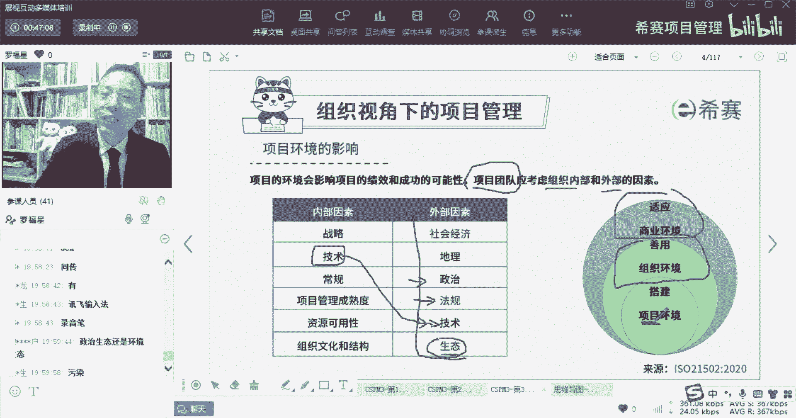