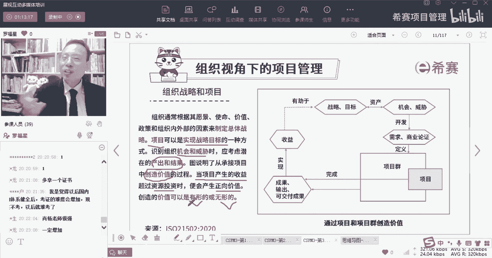

# 【收藏】CSPM-3中级项目管理认证考试直播课精讲视频合集（零基础入门系统教程）！ - P13：CSPM长空3-2组织战略和项目 - 希赛项目管理 - BV16p42197SH

那怎么样去考虑到关于所谓的这个内部因素，外部的因素呢，其实书上面给了一张图，那张图他是这样说的，首先第一个我们看一下啊，就是我们公每一家公司，他自己会有一个大的一个愿景，一个大的一个愿景。

一个version，那么它基于这个愿景使命价值观，愿景使命价值观，这又是一个很新的东西，稍微给你提一嘴啊，什么叫愿景的愿景，是说我未来想要做什么，比方说我们说我的梦想，你的梦想是什么。

我的梦想是要做一个医生对吧，哎那个愿景梦想你的愿景就是做一个医生，你的梦想就是做一个医生诶，那你为什么要做一个医生呢，哎因为我要救死扶伤，那么这个救死扶伤是你的一种使命，使命是什么。

使命是一种你与生俱来的一种责任，一种一种一种责任感的东西，使命感的东西好，那么还有一个词叫价值，价值或者价值观，那么这些所有的公司的建议，价值价值观的东西啊，我们先说价值观吧，价值观这个点是什么意思呢。

价值观说的是我们在做某些事情的时候，我会依照什么样的一些东西作为我的基本规则，比方说我说以客户第一，那我重点就是把客户放在非常非常重要的位置，这才是客户第一，如果说我说嘴巴上面说客户第一。

但是客户给我发什么东西，我不理他，不管他不理他，那就是说没有，我没有去遵循公司的这个价值观。

所以价值观是公司行为处事的规则，同时也是一条底线，是一条遵守的底线。

OK好，他说公司通常组织通常会根据其愿景使命，价值政策以及内部的因素影响，外部因素影响，从而来去制定这个战略，这一战略是什么战略。

它其实是为了去达到你的愿景，你会5年之内干什么，3年之内干什么。

一年之内干什么来定这个，所以说我们是基于这些愿景实名嫁妆，从而去制定这个战略目标，制定一些战略以及制定这个项目的目标好，同时它还没有下一句话，我一句一句跟你慢慢去解读它啊，这样的话你就懂了。

他说项目呢是可以去实现战略目标的一种方式。

所以我们的战略目标是，我要在这个行业中成为第一名。

那你要在这个行业中成为第一名，你怎么才能成为第一名呢，你得要有一个很好的产品。

能够去走向市场，然后卖的非常火，然后并且趁趁热打铁，然后又开又开展第二个产品也是非常好的，也卖的非常火，遥遥领先。

然后你再开展第三个，第四个，这样的话你慢，你很有可能就真的是能够让你这个战略物博表。

达成，说真的是成为这个行业第一名，是不是，所以你要达成某个大的战略目标。

一定是靠一个一个的项目来去达成，所以项目它才是我们去实现战略目标的方，式和方法，所以项目它要跟战略目标是相一致相匹配。

而不是不相一致啊，而不是反过来，所以我们去挑选项目的设，是基于公司的各种愿景，使命来去制定这个战略目标，同时呢我们在做项目的时候呢，他说要去识别组织的机会和威胁，而机会和威胁稍微解释一下什么叫机会。

就这个事情他居然给我给我带来更多的好处，更多的价值，更多的收益，更多的客户，哎这就是所谓的机会，那威胁是什么，威胁就有可能会让我的订单有流失，客户有流失，业务有流失，金钱有流失对吧。

诶可能会有这些东西对，我们是要去做sword分析啊，你说的特别对啊，警总说对不对，那我们通常情况下，公司他说首先要去考虑到这些优势。

劣势机会威胁考虑这些东西，考虑到这种风险的东西啊，所以是我们要去参考和考虑。

我们要去考虑到这些因素，然后呢才会去制定这些个项目。

那么这些项目中，他说还应该要考虑到潜在的产出和结果。

那么产出结果是什么，就是说我们最后做的东西，到底能做出什么玩意儿出来。

我们到底最后能够做出一个什么样的产品出来，或者是做一个什么样的服务出来。

我们会综合考虑这些东西，才会开展这个项目，对吧啊。

那么事实上呢，我们首先是会基于公司的这一愿景使命，来去制定这个战略目标，然后基于这个战略目标，我们会以我们会去选项目，怎么选呢，我们会去考虑到自身的优势和劣势。

考虑到这些外部的机会和威胁啊，然后呢来去来去选这些项目，当然可以是选项目，也可以是选项目群单，还可以说是选那个什么项项目组合对吧，选很多项目，而我们在选项目之前，一定会去了解客户的需求和痛点。

当你需要去了解客户的这些需求和痛点，然后呢你需要去做一个商业论证，那么这个商业论证其实也就是论证，这个项目值不值得去做，能不能做，能不能搞定对吧，以及能不能去交付诶，那就像我们这个项目。

我们觉得说首先第一个是可以做的，为什么，因为我们的学员基数很大，就我自己我留有两个微信，有一个微信已经是有1万800，1万08个人，还是1万06个人已经加满了，加不了了。

另外一个微信呢现在是已经加了5000多个人，加了5000多个人，然后再加5000个人就加满了，OK那么这次加了我微信的，还有更多的是没有加的，因为加了我微信的人，应该是只有只占到可能是20%吧。

或者10%，10%到20左右，大部分人是没有加我微信的，那么在这里面的话，我们的基数很大的情况下，要开展一个新的业务，开展一个新的项目，其实还是不那么难啊，其实还是不那么难，所以我们综合去考虑以后。

觉得这个东西是首先第一个是有机会可以做，第二个就是能不能做。

有没有实力去做好，我们可能会基于这种基于这些威胁和挑战呢，然后去做商业论证，论证了以后呢，就开始去做项目，而做的项目也好，项目群也好，或者项目集也好。

是能够去创造价值对吧，而创造价值呢，他不是说直接创造价值。

先是说去产生这些输出叫output，有这产出，有这些可交付成果，而这些产出可交付成果呢，它能够去做出一个一个一个一个一个成果物，能够去给别人带来好处，而这个好处如果说是更加有型的话，就产生收益。

那么这个收益一个一个的收益。

他就能够有助于公司来去靠近自己的战略，就离自己的战略就越来越近。

越来越近，就会有这样一种情形好，那我们看考试会考的几个点啊。

首先刚刚已经解释过了一下，项目它是实现战略目标的一种方式，我们在挑选项目的时候，我们会综合考虑到这些优势和威胁，然后去看我们在我们做项目的任意产出和输出，并且他说是其实这些产出输出。

这结果本身它是真的能够为企业带来价值，或者为客户带来价值，为别人带来收益，带来benefit，Benefit，收益和价值，而当项目产生收益的过程，他就超过了投入的资金的时候，那么就是正向的价值。

也就是说你的这个收的钱，比你投的钱还更多的时候，您觉得哎呦，太好了，赚到了就是正向的价值，而价值呢又可以分到有行的价值和无形的价值，这又是你们已经很熟的啊，什么叫有形的呢，有形的就是你看得见摸得着的。

比方说钱钱，比方说一栋楼，比方说那个业务量有多少多少上涨，然后那个那个那个市场占有率提升了多少多少，哎这都是你能不能看得见摸得着的对吧，这叫有形的价值，那还有一种无形的价值，什么叫无形的价值。

它指的是说那种比方说知名度啊。

商誉度啊，影响力啊等这种对生育啊。

这些东西都叫无形的价值是吧，那么价值本身就既包括了这个有形的，也包括了无形的，我们用一个利用另外一个词来稍微解释一下，比方说我们说叫一个是实力，真的是能让你得到得利了实力，还有一个是虚名。

能够让你有些虚名，比方说哎罗老师在给你们讲课的时候，那我是不是一边讲课的时候，是不是会无形中产生一些影响力，有多少同学会觉得诶可能上篇NBCSPM也，其中有一个很大一个因素，是因为有罗老师在有吗。

有这样的一个有这样的人吗，对吧，这就是可能会对一部分人有这样一些影响力。

他就能够导致这个事情的推进会变得更好一些，是不是我知道我知道你们肯定有。

所以我特意这样问的啊，谢谢谢谢谢感谢感谢感谢感谢，感谢你们的信任和支持啊，OK好。

所以你会发现其实我们真的要去做项目的话，站在组织的视角里面，他其实是一个完整的一个完整的一个链路。

它的链路中，我们需要去考虑到公司的这个大的愿景。

然后去做项目啊，要去有这一战略目标，然后一个一个的项目，然后项目本身呢唉其实是这些机会和威胁，它又会导致我们产生更多的这些个。

就是去利用好资产来去做，觉得他能不能做，能做或是不能做，我们就开展这些项目。

项目做完以后产生的结果，但是呀这些东西他其实只是属于我们内部的。

OK来看两个题目，我们先来简单过过一下嗯。

好又是西餐用户同学，还有一个是小小总啊。

这个题目的答案，组织通常根据其愿景。

使命，价值，政策和组织内部外部的因素来制定总体的战略，而项目是可以实现战略目标的一种方式，项目啊。

你要脑洞脑袋要开，动起来啊。