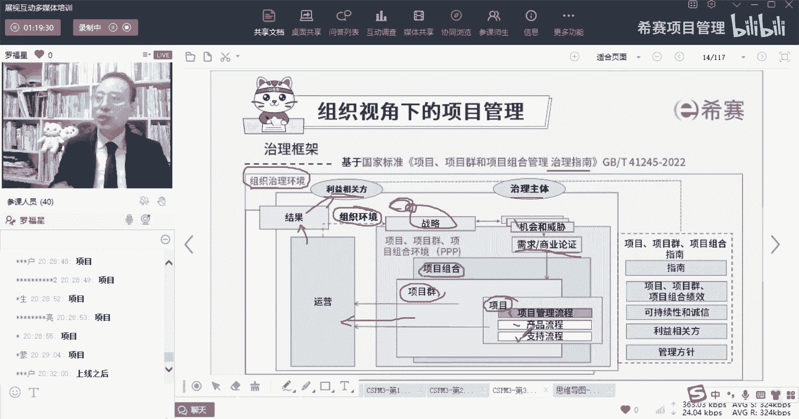
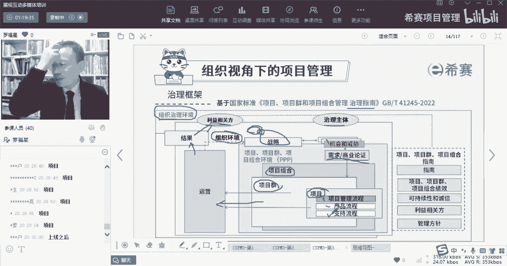
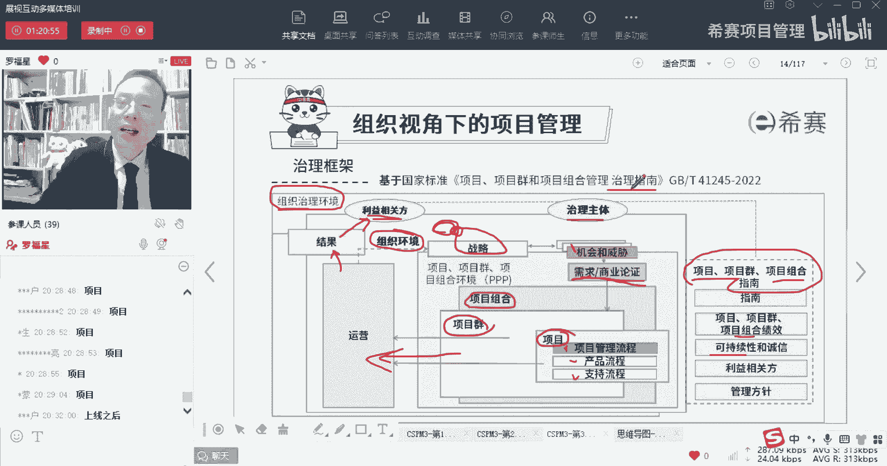
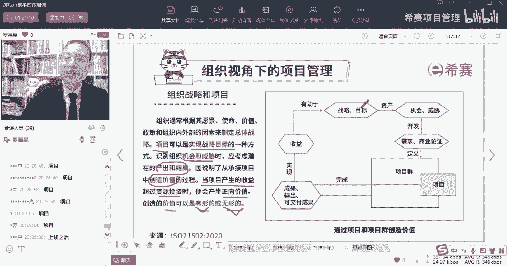
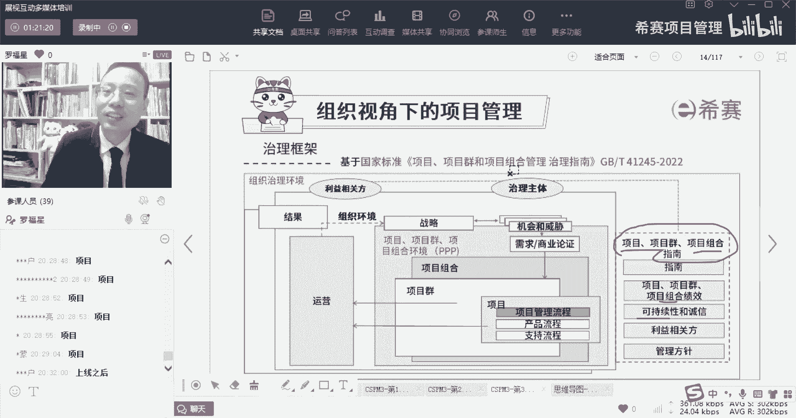

# 【收藏】CSPM-3中级项目管理认证考试直播课精讲视频合集（零基础入门系统教程）！ - P14：CSPM长空3-3治理框架 - 希赛项目管理 - BV16p42197SH

那么事实上呢我们刚刚所看的这些东西，它其实是它其实是偏向于在这一端为主，偏向于这些东西，偏向于这些东西对吧，但是事实上在这里有一份另外一份文件，在这份文件叫项目，项目群和项目组合管理中的治理智能。

这份文件智力指这个文件，你需要的话，你可以找销售，也可以发给你，可以发给你一个电子版，那么这个治理指南里面他会给到这个信息，他说是我们去做项目的时候，首先会有一个叫组织的治理环境。

其实也就是组织去搭建框架的这个大的环境，就跟就是你可以理解为什么呢，就治理这个词，Governance，它是一个更高，它是关于说是搭搭搭搭台子呀，定调子呀，能够去搞事情的一个大的。

或者你可以理解是老板们，领导们工作，去搭建这个整体运行环境的这个框架啊，他说首先我们会受到一个最大的一个，治理环境的影响，然后在这里呢还会有一些一些利益相关方，我们会有这一些利益相关方。

他们想要去做什么什么东西呀，我们刚好又能做什么事情呢，那这里就会有一个叫利益主体，治理主体，所谓治理主体其实也就是你的老板，你的大领导们那些呢就是治理主体，还包括说什么什么项目管理委员会等等。

这些它叫治理主体，其实也就是说谁去负责做治理这件事情的人，叫治理主体，好这些治理主体他会在来去，我们有了这些信息以后，然后再来看这里面会有一个内部的环境，我们会受到这个内部的环境影响，是这些治理主体。

他会去定一个大的一个治理目标，就是搭建一个框架，所以这个事情应该怎么样去运行，怎么样去运作，哎我们先去定好一个战略呃，先定好一个比方说愿景，然后呢再去做战略目标，然后再基于战略目标。

我们去分析我们的这些个优势和劣势，以及分析一下外部的一些机会和威胁，我们从而去考虑，我们的资金该往哪个地方去拨付，可以去做一些什么样的项目，要基于这个社会的一些痛点，需求或者什么之类的，我们来去做分析。

我们做一些初步的需求分析，做一些商业论证论证我们值不值得去做，然后再开展项目，那么这一开展项目，但也可以说是看项目，也可以说是开展项目群或是项目集啊，还有包括说如果更多的话，也可以说是项目组合。

我们做了这些东西以后呢，我们要去投入到运营使用，你知道一个项目本身，它在这个过程他其实没有直接产生价值，什么时候才会产生价值，兄弟们投入运营和使用，就像你们做了一个什么app。

那个app你要投入运营的过程中，才会有人过来去访问呢，使用呢才会真正的去产生价值，所以我们的项目做完以后呢，诶产生结果要去投入到运营和使用，那么这里面才会产生真正的价值，那么这个链路就是已经是剩下来啊。

那么对应的这些结果其实能够去给到客户一些，给到利益相关方一些好处，同时我们做的项目呀，其实它又会分成好几种类型的这种项目，有一个呢是项目管理，项目管理流程，项目所有的项目管理流程。

就是我们说要要做规划呀，要执行啊，要监督与控制啊，要考虑到范围啊，进度啊，成本啊，质量啊这些东西对吧，但是这些东西，它只是属于我们在项目中要做的事情的之一，OK这是一些固定流程。

但这些流程它其实还不能算是，项目中最有价值的，还有一个是什么呢，还有一个是产品流程，所以产品流程就是真的能够去造出某一个产品，比方说我们去收集到需求，我们去基于客户的需求，我们去去构建。

然后去做出这个产品，那么还包括一个产品，单了产品的话，它流程其实会更更多啊，就是还包括事后的去投入到运营和使用啊，然后去定价呀，然后去那个包括说叫promotion做促销啊，做渠道，做place啊等等。

这些东西都会考虑到，那么他是才是真的能够让你赚更多钱的东西，而除了这些东西以外，它还有一个叫知识流程，就是一种辅助性的流程，就我们不是说在做项目的时候，不是有一些叫叫什么啊。

有有三个词汇让我想象一下，忘了比方说项目绩效的数据。

项目绩效信息，项目绩效报告对吧，那么项目绩效数据本身，它就是我们去得到一些很多，那种琐琐碎碎的一些信息，那其实我们在做项目的过程中，也有很多所谓的知识性的工作需要去做，那么这些东西呢。

都是都是能够更好的帮我们来完成这个项目的，而做完的项目他才能够真正的去，当然肯定还要做验收啊，做了验收以后才能够真的去投入到运营和使用，才能够走向市场对吧，那么整个在做项目的时候。

其实也会考虑到说项目项目群，项目组合指南，所有组合这个概念，组合这个词也稍微解释一下，就是多个项目我们去挑选，到底挑这个项目还是挑那个项目，我挑哪个项目，这是在做组合管理，那么这个项目项目群。

项目组合管理指南里面，它就会涉及到有什么组合的绩效呀，什么可持续，什么叫可持续，可持续是说的是我们现在可以怎么样，我们的子孙后代也可以怎么样，我们现在可以怎么样，我们东西可以回收利用，再怎么样啊。

这都是所谓的可持续，然后涉及到各种利益相关方，还有管理的这些东西，都会是都会跟我们这个整个治理有关系，所以现在来讲的就是一个在所谓的治理框架，那么这样一个治理框架呢，我们先我们先休息一下。

我们休息10分钟以后，我们再来继续讲，从不同角度来看待这些东西，OK所以整个在项目管理过程中。

他其实，其实怎么讲呢，就是你既要考虑内部的这些因素，同时也考虑到外部的因素，而我们的治理本身，它其实也是考虑到外部因素，也考虑到内部的因素，不仅是咱们自己在搞事情。

公司领导也会需要去考虑这些事情，他到底值不值得去做，能不能去做，然后做的有什么好处，能不能够为公司赚到更多的钱，怎么样去给股东进行交代。

