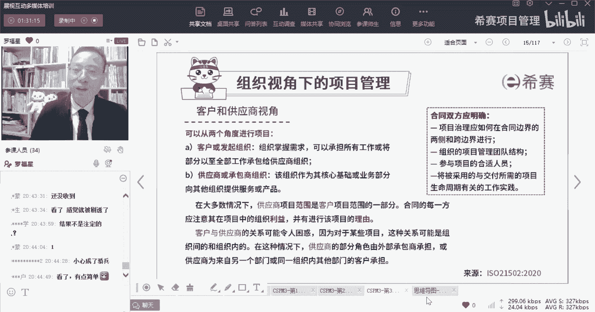
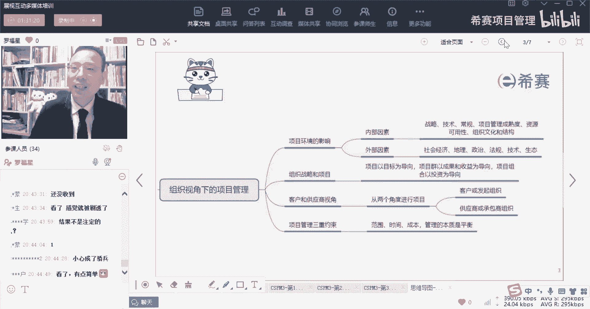
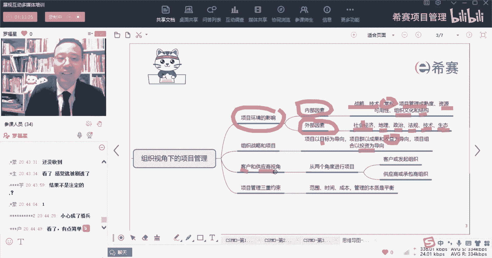
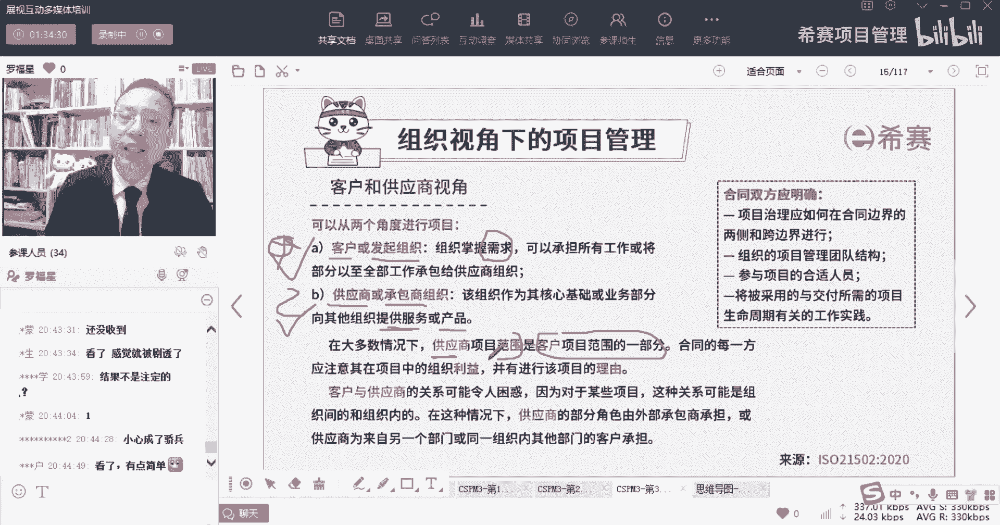
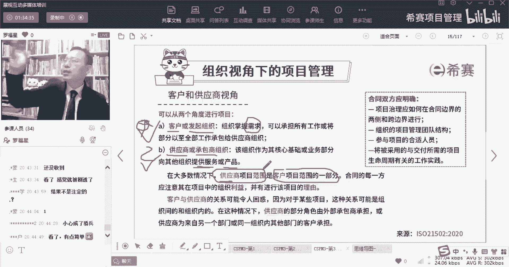
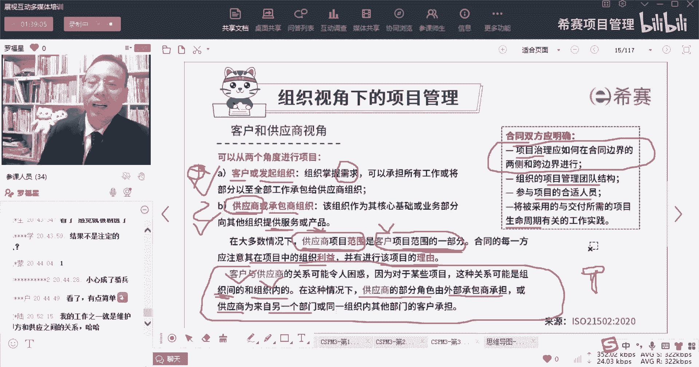
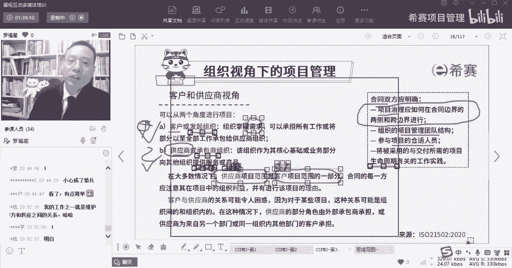
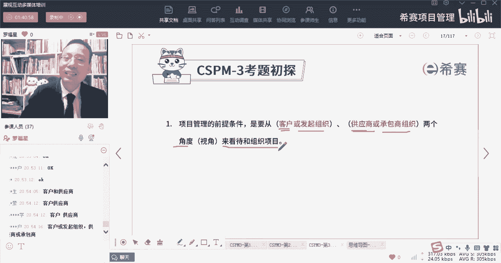
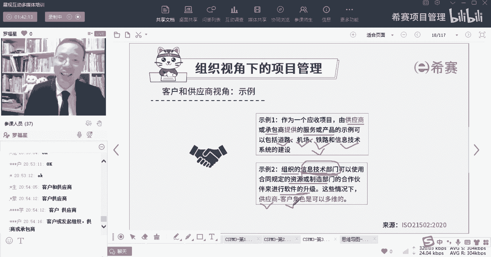

# 【收藏】CSPM-3中级项目管理认证考试直播课精讲视频合集（零基础入门系统教程）！ - P15：CSPM长空3-4客户与供应商视角 - 希赛项目管理 - BV16p42197SH

大家晚上好，欢迎来到西塞碗专业的职业教育平台，我是罗福星。

那今天晚上我们一起来分享的是，关于那个cs p m的第三章。

叫做啊角色定位以及项目受控环境的建立。

那我们刚刚呢前一节课花了一些时间，讲的内容其实只有两小点，一个呢是关于项目的环境影响，项目的环境会受到一些内部因素的影响，还会受到一些外部因素的影响，内部因素说是我们公司内部，比方说公司的战略呀。

技术呀啊公司的这些常规管理呀，公司的项目管理成熟度啊，以及公司的资源可用性和公司的组织文化，公司的组织结构类型啊，会跟这些因素有关系，那外部的因素呢就包括了这些，什么叫社会经济，地理环境。

然后政治法规技术，生态环境等这些因素，同时呢我还给大家分享了一个词叫pestle分析，那pastel分析中它是把社会和经济分开，它没有地理这个因素，对吧啊，就是这么一回事儿，那呃这个生生生态呢。

生态呢就是环境呢对吧，生态就是法环境，然后法国就是法律政治，还有一个是技术啊，这些东西基本都是一样的好，那么在还有另外呢讲到一个叫做组织的战略，就是组织战略和项目，那组织战略和项目中，他其实会讲的是说。

我们公司，就是现就是首先公司会定一个战略目标，然后呢，项目是去实现战略目标的这一种方式和方法，所以他说是项目以目标为导向，那么项目群成果啊什么什么的，那我们是后面还会讲到说是项目群成，我会以收益为导向。

这个呢其实后面会讲啊，组合管理，投资组合为导向，这是这是后来完整的，然后接下来会讲到一个内容，叫做那个那个客户的视角和供应商的视角，这个词对于学了prince two的同学，就是非常清晰和简单的。

对于没有学prince two的同学可能有一点点难度，但是我们也好也好理解啊，也很好理解，说我们从组织视角下去看，项目管理呢可以从两个视角来去看待，一个视角是客户的视角，客户的视角或者说是发起组织视角。

他是什么意思呢，就是这些人他掌握了需求，他是需求的，发起者是需求的，提出者是这个项目的甲方啊，你把它简单粗暴的理解为，就是类似于甲方的这个角色啊，甲方爸爸这个角色他去承担所有工作。

或将部分的工作全部都成承包给这种供应商，所以他是甲方爸爸这个角色，客户这个角色好，另外还有一个视角呢是供应商的视角，供应商或者是承包商的视角，你把它简单理解为乙方该组织作为其核心基础。

或者说是业务部分向其他组织来提供服务，那么不就是甲方爸爸出钱，乙方爸爸出结果，就是这个意思啊，乙方爸爸出结果啊，那如果说我们把一个项目，如果从这两个视角来去看待，你会发现能够做一个简简单区分。

做一个什么区分呢，大多数情况下，供应商，他说供应商的项目范围，是客户项目范围的一部分，也就是说客户他要做什么什么东西，他要做的东西就决定了咱们的乙方。

我们的供应商要做什么东西，就客户说我要建一栋大楼，那么乙方就说啊。

那我要去搭一个框架，我要去挖几层地下室，然后去搭一个钢筋水泥混凝土框架，然后去修修什么建什么，然后去搞水道管，电煤气燃气什么什么东西对吧，所以你的工作范围里，乙方的工作范围是受到甲方工作范围的影响。

但通常是甲方的范围的一部分，他说合同是每一方应该要注意的，在其项目中，他说合同的每一方，应注意其在项目的项目中的组织利益，并有进行该项目的理由，什么意思呢，也就是说我们去做这东西的话。

能够给你带来什么好处，那么客户他看重什么呢，客户看中的是别人最后能够给我做出一个产品，我做出一个服务，这是他可以给我的，那供应商呢他看的什么，他看的是甲方报，最后会给我钱对吧，你各自会能够得到这个利益。

并且呢他说要去进行一个进行项目的理由，进行项目的理由是什么，就叫商业论证，就我为什么要去做这个项目，我为什么值得去做，因为它能够给你带来什么样的价值和利益，OK那这双方他说合同双方应该明确。

首先第一个说是项目治理，应该如何在合同边界的两侧或者跨边界去行事，也就是我们去构建一个项目的时候，包括说这项目怎么样去开展的，什么节点，谁去做检查呀，检查些什么东西呀，如果说不合格又该怎么样呢。

那么这些东西其实都算是项目治理，他也可以在合同中明确去列出来，第二个注册项目管理团队的结构，那像有一些类型的项目，它其实会对乙方是有要求的，会希望乙方是具备什么资质，用什么样的方式来去组建什么样的团队。

来做什么什么的一些事情，他也会有的，包括谁来参与，也会可能在合同中写出来，将被采用了，与交付所需的项目的生命周期有关的，一些工作实践，那么比方说你做的是什么类型的项目，我们用什么样的生命周期来去进行。

用预测性的方式去管理，还是用敏捷型的方式去管理，或用增量型的方式，用什么样的方式，都应该在合同中约定，那这里有一这里最后面有一句话，他讲的是说他说有的时候呀，关于客户和供应商的关系，可能会让人感到困惑。

什么困惑呢，但是对于某一些项目来讲，这种关系可能是组织的内部的或组织之间的，组织之间就是甲方和乙方之间的，也可能是公司内部，公司内部是什么情况，比方说某一供应，他说某一供应商的部分角色。

是由外部的承包商来承担，这就是说组织之间，就是明确有甲方和乙方叫组织之间，但是他说供应商也可以是来自于另外一个部门，那这就是属于咱们公司要开展一个项目，比方说像你们是不是也有一些同学是在那种。

比方说什么制造类的公司呀，或者说是在这种汽车行业的公司，但是你们存在的是那种it的工作，那你做这个it工作的话，你做那种IT系统，其实是为公司的其他部门而去准准备的，而去进行的对吧。

那么其他的部门就是你的客户，你是其他部门的供应商，可以理解吗，所以有的时候我们我们一般默认为觉得供应商，供应商一定是外部的人才叫供应商，但是呢在项目管理中，如果说是从这两个视角来看待的话。

那如果说你是一个it部门，你要去给整个公司做一个ERP系统，做一个OA系统，做一个什么什么系统的话，那么你就是公司的供应商，我说清楚没有，兄弟们，就是你就相当于说是你你和他之间。

虽然里面没有那个经济的往来呀，不会去那个怎么样，也也不会去签一个什么合同啊什么之类的，它只是别人给你提需求，你去给他做系统，但事实上它相当于他们各个业务部门，就是属于客户。

而你们你如果说是去提供这个系统的，你就是属于供应商，兄弟们，我说清楚吗，所以客户和供应商既可以是甲方和乙方的，也可以是你们公司内部，这个部门和内部门之间的啊，它就属于供应商。

只要谁是是负责去提需求的东西，提需求，然后去得到结果的，他就属于客户，这个点我说清楚没有，你们都不给回应了，要给我回应，你如果觉得还不是很理解的话，你可以讲，你说你没有很好理解，你要是听明白的话。

你可以说就OK了。

好不好，举一个简单的例子啊，就像比方说像，其实有很多很多公司都是有这种情况。

就很多公司你想你的主打业务，比方说你本身你的主打业务就是去建房子，那你既然你的主打业务是建房子，那么建房子那些那些个施工队呀，那些施工部门呢，他们就是你的主主要部门对吧，但是你可能还会有一些某一些部门。

要给他提供某些服务，提供什么服务，比方说要提供那种什么核算工资的服务呀，啊，或者说是你要给他做一个系统来去计算，计算它每一每一个项目的工时啊，什么什么之类的，那么你给他做一些辅助。

你给他做一些系统来去提供辅助，那么你给他做系统的话，你就相当于是他的供应商，而他去做一个业务的部门，他们就是相当于你的客户，他来给你提一些业务的需求，你把他的业务需求来做成一个系统去交付给他，哎。

这就是客户和供应商的关系来看一个题目。

大概率应该就是就是我刚刚讲的这个东西，是不是大概就是啊就是客户和供应商啊，项目管理的前提条件是要从客户，供应商这两个角度来看待和组织项目，或者呢就是要从发起组织和承包单位。

这两个角度来去看待项目都可以啊，所以是关于你要从客户或是或者是发起组织，其实也就是类似于甲方爸爸这个角色，以及从供应商或是承包商啊，这个也就是乙方单位，从这两个角度来去看待和组织项目。

这就是项目管理的这个这个这个两个角度啊。

这两个角度，那么这里举了一个例子，举个什么例子呢，就是关于这个客户和供应商的视角的为人事情，比方说有个案例说作为一个应收的项目，由供应商或是承包商来给大家提供的服务，或产品的事例。

包括说给你修了一条铁路，那么修铁路的人，他就是你的供应商，帮我给你修了一个机场诶，给您建了一条铁路，给你做了一个信息系统的建设，跟你做了一个信息系统的维护，那么这些它都是你的供应商，OK好。

他说如果组织的信息技术部门诶，这个信息技术部门请注意哦，他是属于公司内部的自己的一员哦，他是你们公司内部的哟，好，那么你们公司的信息技术部门，可以使用合同规定，资源和制造部门的合作伙伴来进行软件升级。

那么在这种情况下，这个信息技术部门他就是你自己的供应商，OK也许是这些信息技术部门，是给别的部门去做一些什么软件维护，软件升级，那么他就充当了工商的这个角色，而其他的这些业务部门呢。

就冲到了客户的这个角色。

