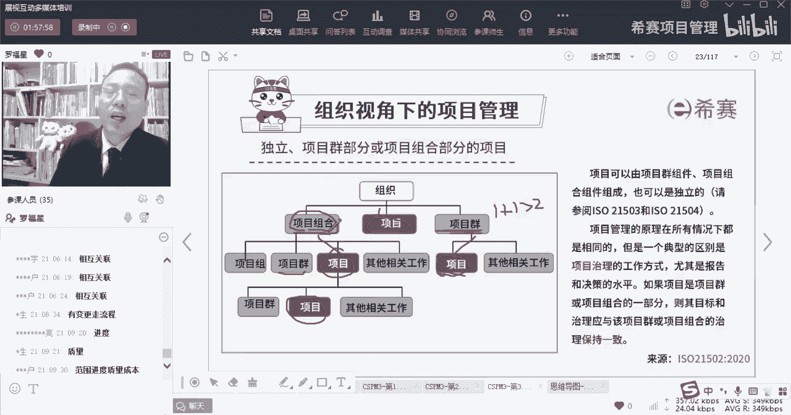
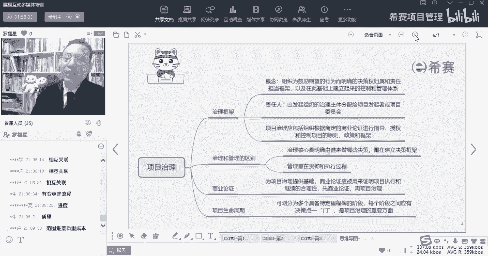
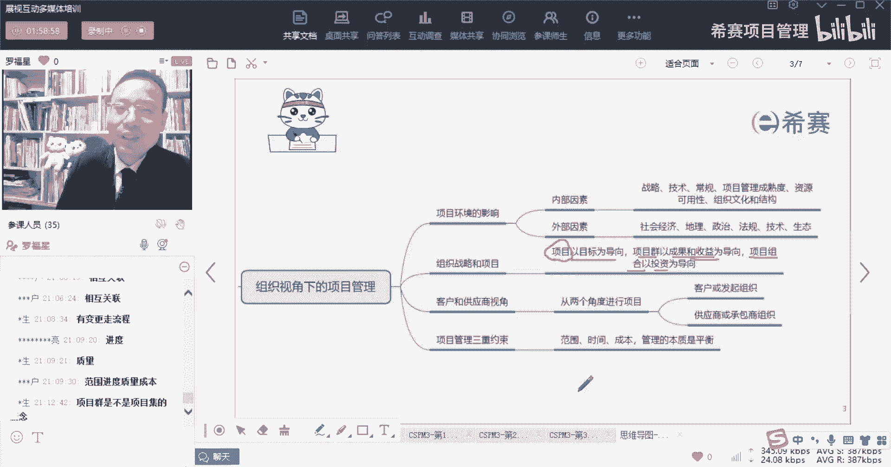
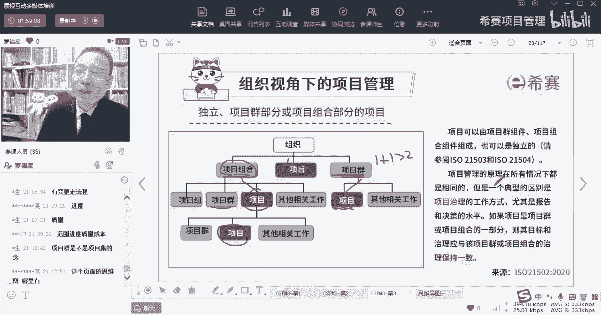

# 【收藏】CSPM-3中级项目管理认证考试直播课精讲视频合集（零基础入门系统教程）！ - P17：CSPM长空3-6项目群或项目组合中的项目 - 希赛项目管理 - BV16p42197SH

那么接下来呢我们会讲到治理框架，这里有一个叫独立的，就是关于项目，他们这个组成，这个项目组成呢，其实有一个比较好的一个理理解，就说我的每一个项目，它可能是隶属于某一个项目群。

或者可能会隶属于某一个项目组合，当然也可以是独立的项目，它可以是隶属于某一个项目群啊，比方说像这个项目，它是隶属于某个项目群里面的一个，然后像这个项目呢，它可能是隶属于项目组合中的一个。

那这个项目它不属于项目，也不属于项目群，也不属于项目那个什么，它就属于整个公司一个单独的一个项目，都有可能，那么项目项目群，项目组合他们是什么意思，我稍微简单解释一下，项目的话呢。

其实就是有一个明确的目标，我们要去做事情对吧，而项目群呢我们有另外一种翻译叫项目集，项目集说的是说这个项目和那个项目，它们之间组成一个集合，这个集合它表示的意思是，项目和项目。

他们能够达到一种叫1+1大于二的效果，1+1大于二的效果，OK这是一个项目集的概念，就是他们之间能够你放到一起去管理，可以比起你单独去管理会产生更好的效果，诶这是项目集的概念，而项目组合呢。

项目组合更多的是说为了去，为了就是为了达到公司的某一个战略目标，我会去挑选若干的项目来一起去做事情，那我去达到一个某一个这种价值最大化，我们去做一个组合的管理，我们去挑选若干的项目。

所以这里面会有一个叫呃，我们来看这一页图，就是在上上上页图里面其实会有这种表达方式。

大家可以看一下啊，好你会发现这里项目它是一个明确的目标对吧，所以是项目是以目标为导向，而项目群呢他说是以成果和收益为导向，也许是我能够去产生收益更大，我为什么要两把两个项目合到一起来做。

因为我把这两个项目合到一起来，比我单独去做两个项目要更划算，要更划算，它的收益会更大一些，OK而项目组合呢，项目组合它其实是价值最大化，他就是以投资为导向，就是投入产出比价值最大化。

它是按照这种方式来去做的，O对项目群其实就是项目集啊，其实就是项目集。

就是咱们这个项目集的概念是这个意思，这个页面的思维导图，你看一下今天的那个微信群。

班级群，我今天特意在上课之前发到班级群里面的兄弟，因为这是这是默默老师做的，然后今天才发出来的啊，今天才发出来，我在上课前特意把它发到群里面了，再等会可以，等会可以去搜一下啊，好我们来看一下。

他说项目可以是由它可以是由项目群的组建，也就是说它可以是作为项目群里面的一部分，它属于项目群中的一个，它也可以是项目组合的组成，OK也可以说是项目组合里面的一个，它也可以是独立的。

所以你既可以是自己单独的一个项目，也可以是项目组合里面的一个项目，也可以是项目群里面的一个项目啊，这是这个，另外呢他说是项目管理的原理是在所有的，在所有情况下都是相同的，呃。

不管说是你什么什么什么什么情况下，都是一样的，他尤其是关于项目的治理，他说他说但是有一个典型的区别，是说项目治理的方式会有点不相同，尤其是报告和决策水平，那么什么是治理，这里就刚好就引出一个信息叫治理。

他说如果说是项目，是属于项目群里面的一个部分，或者说项目是属于项目组合里面的一个部分，那我们这个项目的目标，他应该他项目的目标和治理，应该跟更跟项目群的目标治理是保持一致。

就是如果说你是属于项目中的一个部分。

