# 【收藏】CSPM-3中级项目管理认证考试直播课精讲视频合集（零基础入门系统教程）！ - P18：CSPM长空3-7治理及与管理区别 - 希赛项目管理 - BV16p42197SH

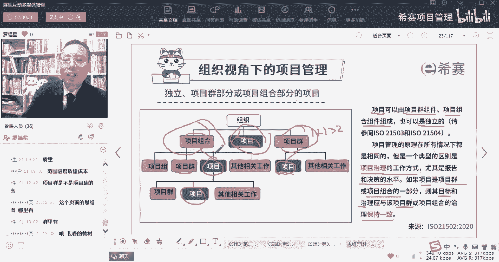

那我们这里面就重点讲到一个叫项目治理，那我们就一起来看关于关于项目治理啊，关于项目治理呢。

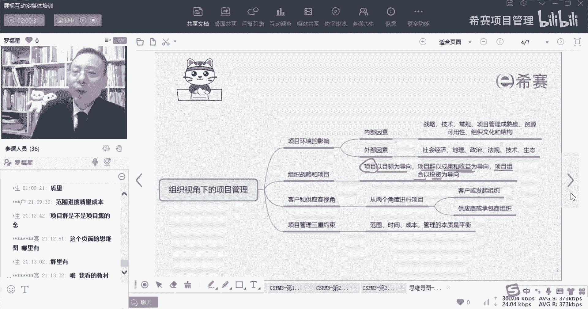

它会有一个治理框架，然后是治理和管理区别，商业论证，还有生命周期。

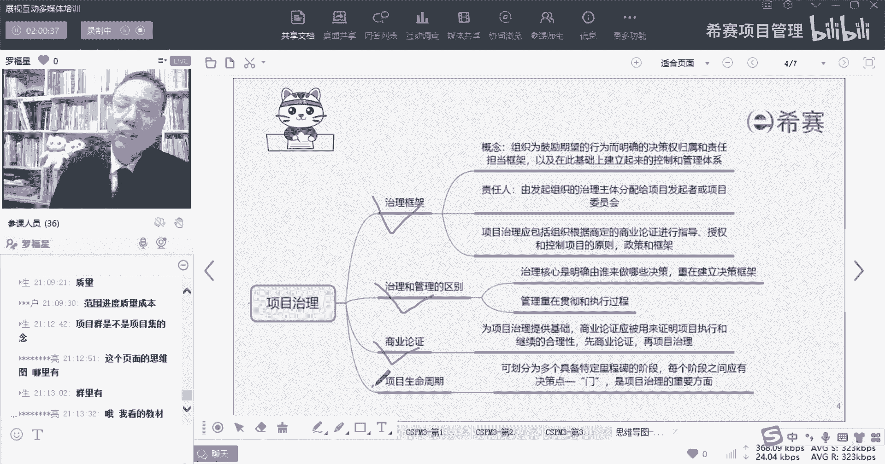

我们今天晚上可能看不完，但是我们会看一部分，能够看一部分，首先什么叫治理，治理这个词，他说是组织为了鼓励期望的行为而明确的决策，归决策权归属和责任担当的框架，也是定好一个框架，你负责干安全。

他负责干生产，他负责干设计，他负责做交付，他负责跟客户联络等等这些东西，这就是属于叫决策权的归属以及责任担当的，这归属的框架，那么你把这东西给定好，这就是在干治理，OK这就是盖在干治理。

他说以及在此基础上面来建立起来的，一种控制和管理的体系，也就是说比方说带汇报关系是什么样，一层一层如何去汇报的呀，然后什么事情超出什么区区商，超出什么情况的话，谁就应该要出动来去干预啊，来去干什么呀。

这东西都算是治理，所以治理有一个更通俗的一个解释是什么呢，就是搭台子布局，OK提前去做好布局啊，我们去安排去铺排来布局啊，做好角色的分工，这是关于治理，然后这里治理中他给了几个信息。

他治理的五个五个元素，应该是说是职责链条中赋予人民权利，哎你干你负责干安全，你负责干生产，你负责干什么东西，OK好，第二个他说是指导组织去满足其目标，我们去制定一些方针和政策。

其实也就是这些东西该怎么样去做，我们提前去列好一些规则性的东西好，然后呢去控制机制，其实这是监督与控制，就是你要去确保，这东西都是按照你所规定的方向去落实，那有没有落实到位呢，有一些好的评测方式。

所以你通过评测手段和方法来去确定，你的这个治理是不是达到了一个效果，那他万一没有达到怎么办呢，哎我们还要再一次去跟连续同步，他用了一个沟通的方式沟通，学会沟通，我们讲说是去做信息的交换来达成某种共识。

那通过信息的交换来达成共识，也就是说确保大家能够在对应的时间，能够去获得更正确的信息，来能够有正确的理解，那么这个就稍微了解一下，这个考试还没考过，那么这就是治理治理重点。

就说是一个决策权的归属以及责任的担当，OK那这个决策权归属，责任担当这些东西，这些大框架谁来建立，大领导来接你啊。

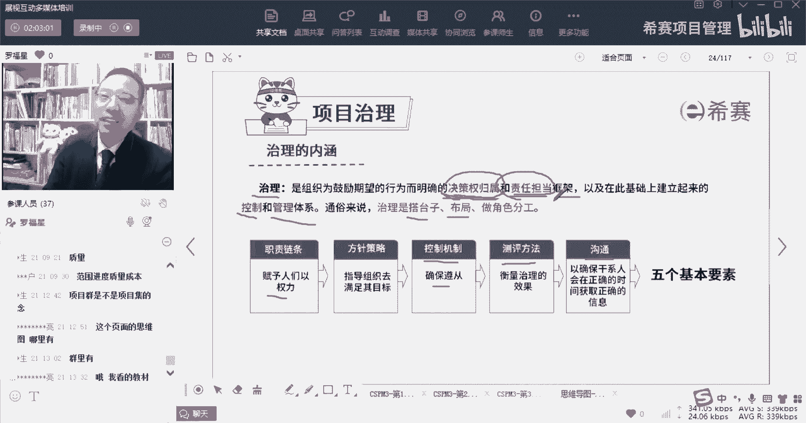

一般是大领导才会去建立这种框架，建立这个治理好，那我们来看一下，看一下这个题目选什么项目治理是什么意思，说你看题目是不是考的还是相对比较简单，对吧啊，所以你们大部分都都都选对了啊，选最后一个。

他说项目治理是指什么呢，项目治理是指组织为了鼓励期望的行为而，明确的决策权归属和责任担当的这个框架，对所有题目都是都是四选一啊，所有题目都是四选一，但是我是为了上课的需要，我才把它做成了一个填空题啊。

你们考试考的都是选择题啊，兄弟们不用太担心，考试都是考选择题啊，不要被我那个那个那个填空题给吓到了，好在此基础上来建立起一个控制和管理的体系，好学生说是把权力都集中在项目经理手上，这是不是治理他。

这算是治理中的之一吧，一种一种一种对于权力的这种约束的方式，第二个就是加强公司CEO对于项目的控制的力度，第三个就是在不规划，不在不规划项目阶段的这个前提下，把项目作为一个整体加以控制。

这都是一种很就是都属于很片面的啊。

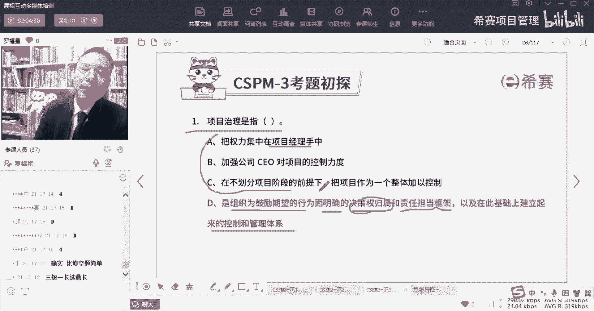

很片面的很很片面的一些东西，我们再来看另外一个，他说治理框架，那么治理框架，他说这项目的治理呢，应该包括，组织根据商店的这些商业论证来进行指导，项目的原则，授权项目的原则，控制项目的原则。

指导项目的一些政策和框架，授权项目的政策和框架，控制项目的政策和框架，话说的这词好拗口，其实也就是说你要有一套规则和方式。

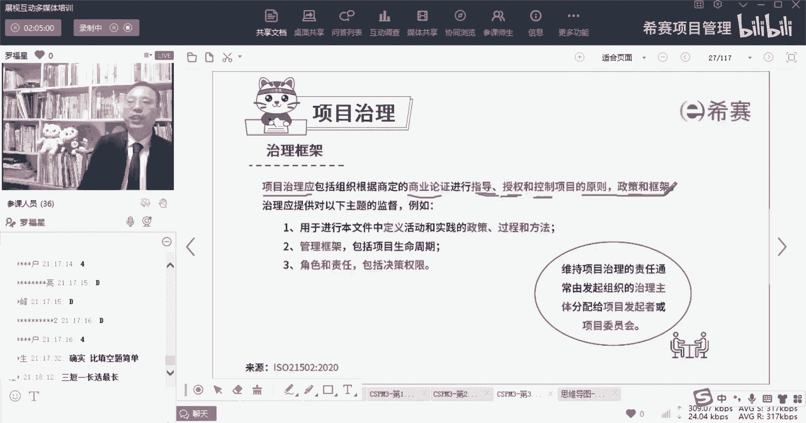

NH能够让项目可以顺顺利的去进行下来，但是你会发现这个项目治理它在什么，他在这个治理它是在论商业论证之前，还在商业论证之后，他在商业论证之后，也就是先做商业论证论证，觉得这个项目值得做好。

当然觉得这个项目值得做了以后，才会去做这个所谓的项目治理，来确定好我们这个项目他的一些什么原则呀，政策呀，框架呀等这些东西，那么下面的治理开头一看，包含了这些东西。

一个是说用于进行文本中的定义活动和实践的，一些政策过程方法，也就是说我们该怎么样去做某一些东西，比方说我们的这些文档该怎么样去写，我们的代码该怎么样去写，我们的这些个什么汇报关系该怎么样去动。

都是你提前把它规定好，那么这个规定好它就算是一种治理，OK好，第二个就是管理框架，包括生命周期该怎么样去选择，你用你你选预测型的生命周期，选那个什么瀑布型的生命周期，还是选敏捷型的生命周期。

增量型的生命周期你该怎么样去选，然后这个管理的过程中，可能会分到一些什么样的阶段，而这也是属于治理的框架，第三个就是角色和责任，谁负责干什么事情，谁负责干什么事情，包括某一些类型的事情。

谁可以拍板做决定，这也是属于治理的框架，Ok，那么整个治理的框架中，就包含了定这些个过什么乱七八糟的，这种政策文化，把定好管理的框架，以及定好谁负责什么角色和职责，这个决策的框架。

而整个治理这个词它其实很很很虚幻，就是其实你可以理解为，可能会给公司去定好规则对吧，那么同时还有就是我们不是有个词叫p mo，有印象吗，叫项目管理办公室对吧，项目管理办公室。

他会告诉我们一些项目该怎么样去做，怎么去落实，那么它其实就类似东西，也是一种治理，同时呢咱们项目经理你在做这个项目的过程中，你会去定好这个项目中的他的这个角色和职责，他也是做了一些项目治理的工作。

所以项目经理也会做一部分的项目治理的工作，尤其是越大的项目，那么项目经理做的这个治理部分也会有一些，当然了，他在什么时候是在项目前期，在项目才刚开始的时候好，这里有个词说维持项目治理的责任。

通常是由发起组织的那个治理主体来去来去，分，配，给了叫项目发起者，或者项目发起人和项目委员会哦，这里面这个词有点拗口，它大概什么意思呢，就这个治理的主体是谁，其实是他给你定下来。

治理主体就是项目的发起者，或者说是项目的委员会，也就是说谁才有资格去定好这些大的规则呢，发起人去定规则，或者是发起团队去定规则，一群人或者说是叫什么项目委员会，委员会委员会这个词也要稍微解释一下。

我们好像前面解释过，就一般委员会他都是说被委派来的代表，而这些被委派的代表，往往都是一种比较优秀的代表，都是比较牛逼的代表，都是有权力的代表啊，那么说明所以这个项目委员会，他也是那种比较有权利的那种人。

OK那么整个这个治理主体，就是由这些项目委员会或者是发起团队，他们来去安排，他们去安排这个事情应该怎么样去进行，该怎么样去落实啊，他把比方说把某一些事情分配给他PO来去落实。

来去进行对吧，这都是来看一个题目，我们先看第一道题目，项目治理诶，你看西餐用户同学给了一个很好的信息，对项目治理，应该是要根据组织所商定的商业论证来进行，指导项目的原则，授权项目的原则，控制项目的原则。

指导项目的政策和框架，授权项目的政策和框架，控制项目的政策框架，所以项目这里是在那个商业论证之后啊，先做了商业论证以后，然后给予他再去做这些什么东西好，第二个题目好，亮总已经给了一个非常好的信息了对吧。

还有北总给了一个信息说维持项目治理的责任，通常是由发起组织的治理主体，分配给项目的发起者或是委员会对吧，所以是由那个治理主体，把它分配给项目的发起者或者发起人，以及给到项目委员会啊。

是根据商定的商业论证来进行指导，授权和控制项目的一些原则政策和框架。

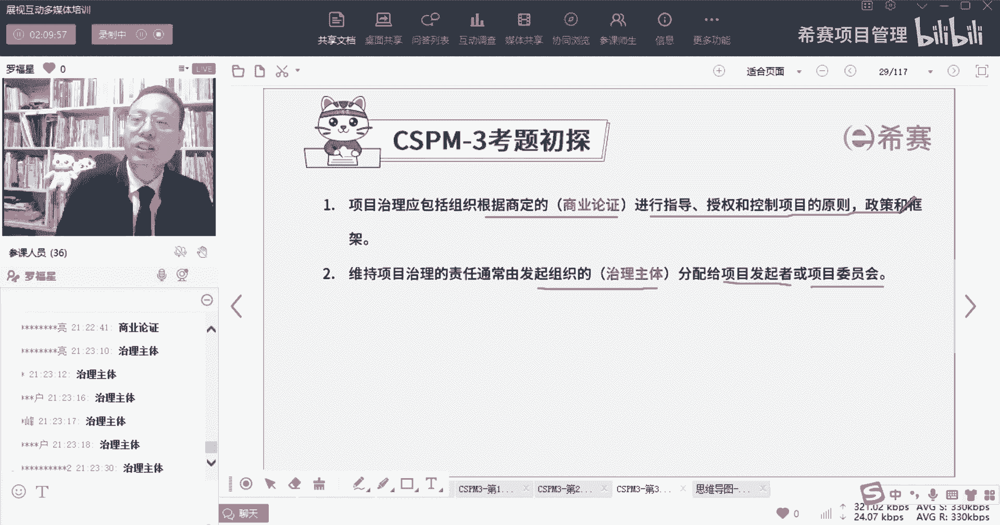

再来一个题目，这个题目因为实在不好做，所以就没有把它做成填空题，就搞了一个选择题，这个题目选什么，突然之间一下子就顿住了是吧，好魏总说用排除法的方式来选，这个题目的答案是选第二个啊，叫决策和责任。

包括决策权，项目治理框架应该提供对以下哪个主题的监督。

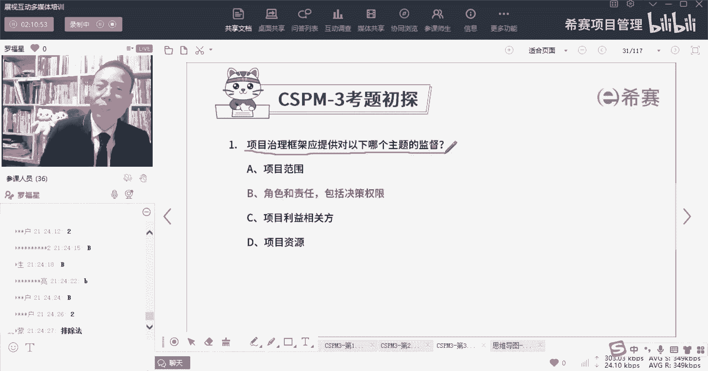

项目治理框架应该提供对以下哪个治理，哪个主题监督呢，我们往前面翻一下，OK来来来看到，所有的题目今天都在讲义上有啊，有原文啊，项目的治理应该提供对以下主题的监督，比方说对于什么啊。

用用文本来去定义活动和实践的一些政策，过程和方法啊，比方说是管理的框架，包括生命周期的定义，比方说关于角色和责任，包括决策权等等啊，这都是都是治理中要对这些主题来进行监督的。

所以基本上所有题目，都可以从原文中找到答案啊。

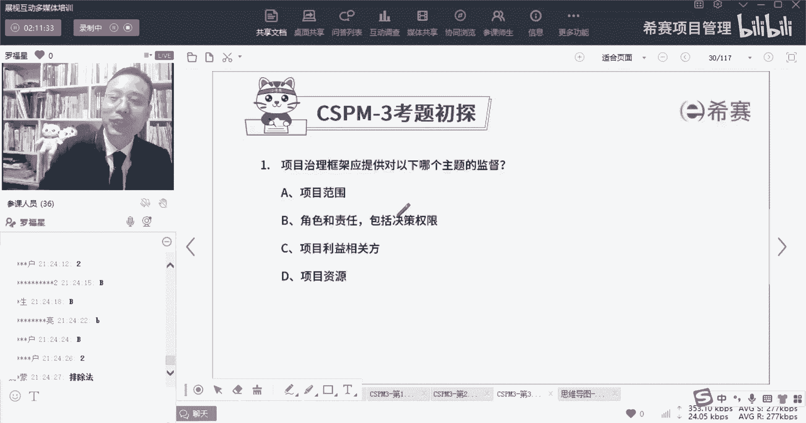

兄弟们都可以从原文找到答案，那么治理和治理和管理它们的差别点是什么呢，其实治理你看到刚刚说的是搭台子，对不对，他是去布局，他就说这个事情是以治理，它的核心是什么，他说核心是明确，应该又应该做累一些决策。

以及这些决策分别是由谁来去做出，重点是建立一个决策的框架，要干什么干什么干什么，谁负责谁负责，谁负责干，这是在干治理，所以他是把这个大的一个框架给定好了，一个大的运行规则给定好了，而管理是什么呢。

管理他说他就是管理，是进行决策和实施决策的过程，进行决策和实施决策，其实重在落实和执行，它重在贯彻和执行，所以管理是去做事情，你可以你甚至有一点点感觉是什么呢，就是治理是大领导们的脑袋啊。

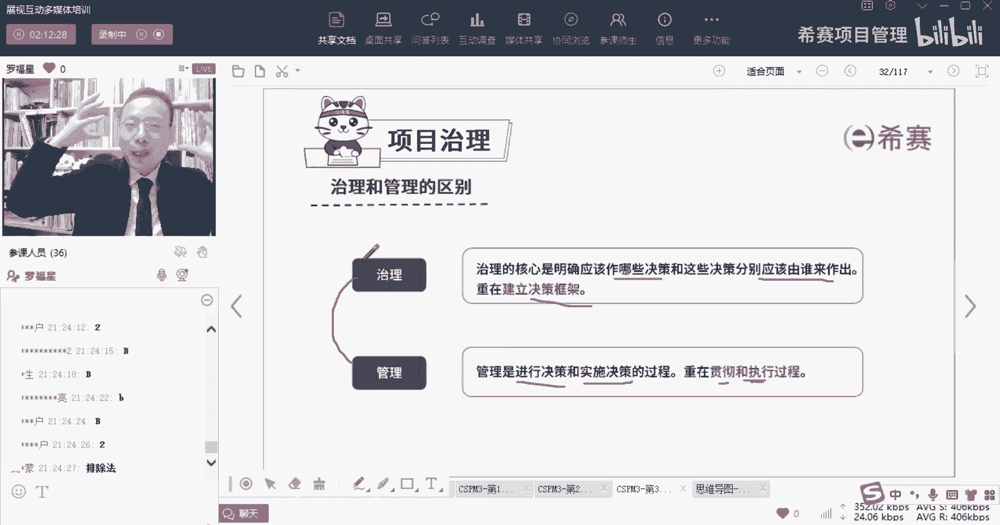

去想这个事情该谁做，谁是谁做谁做，然后管理呢是去具体安排，把这个事情能够推进下去，推行下去，这是管理，OK这是治理和管理他们的一个区别。

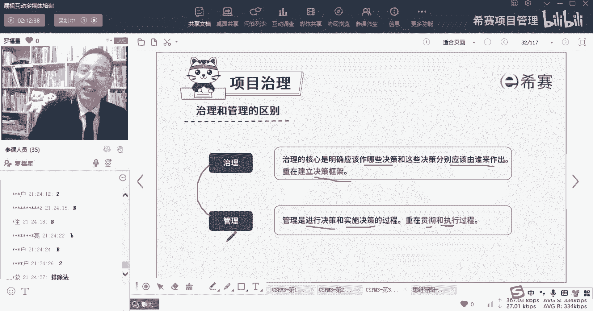

来看一个题目，请注意这里有个词啊，但这些词里面好像好多都是没有啊，哎这个题目有问题啊，就是我们很多这里面可能是漏了一页，漏了一页PPT，回头要把那页PPT给补上啊，要把它补上，那治理和管理它们的区别。

它是哪一项是错误的，那么你这种题目其实是好题目，好题目好在哪里呢，就是当我们知道这个东西以后，就顺便把三个正确的就给记住了，就顺便把三个也记住了，那么首先第一个治理对管理进行授权指导，赋能监督约束。

也就是说是至于提前安排好谁负责干什么事情，谁负责干什么事情，谁负责干什么事情，并且要看他是不是在干以及干的怎么样对吧，所以这句话本身是对的啊，说是治理是对管理进行授权指导，赋能监督好，第二句。

管理一在治理框架的约束范围内工作，其实也就是管理在治理之下来进行工作的，你先有治理，然后就定好这些规则，接下来再去管理，再去落实，去做这个事情好，通过管理，它是从通过这种方式来去实现组织的目标好。

第三句话，治理的职能和管理职能是在不同的层级，或者说是组织的不同的部分去执行，这句话本身是对的，后面一句话也是对的，说治理主体仍然对组织的绩效负有责任，什么意思呢，也就是说你看那个治理主体。

治理主体都有谁呀，我们开始看了都说了谁呀，一个叫发起人，一个叫项目委员会对吧，说这个发起人项目委员会，他们仍然对项目的绩效负责，什么意思呢。

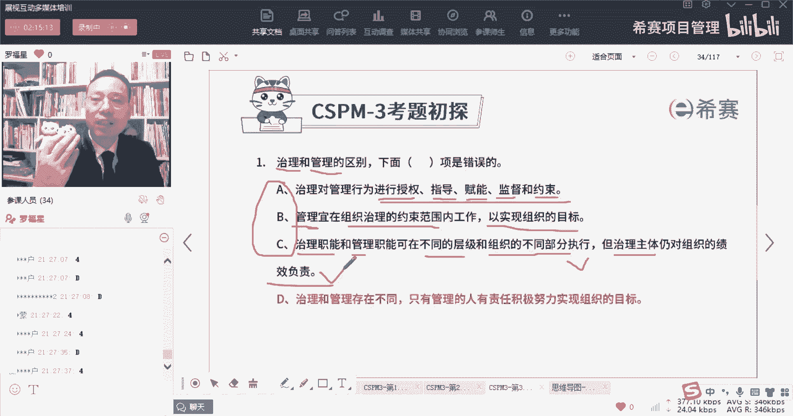

如果这个项目他顺利进行，他就不会去烦你，但是如果这个项目还遇到一些困难和挑战，他向谁去求助兄弟们，但他真的是遇到很大的困难和挑战的时候，他是需要向这个指导委员会来求助，说领导我这个东西该怎么做呀。

该怎么办呢，对吧，他要跟这个发型去求助，来去来去获得一些支持的啊，所以这些个治理他确确实实对于这个项目计算，它依然是要负责的，当了项目经理，更要更要负责好，最后一个选项就是呃治理和管理存在不同。

这个不同，这肯定是对的，前面这肯定是对的，但是后面一句话，他说只有管理的人有责任，积极努力的去实现目标，谁告诉你的管理人肯定是要去积极努力，但是治理的人他去定好这个规则，他为什么要定这个规则。

他定好规则，就是为了能够让项目更好的去成功了，兄弟们对吧，所以这句话肯定是有问题啊，这就有问题了嗯。

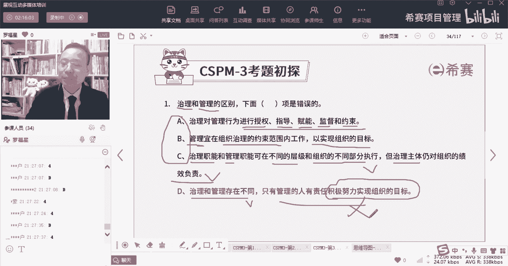

我们今天来看到这，看到这个关于治理和管理的区别，治理的核心是说要做什么事情，要做什么决策，谁来去做这个决策，来去建立一个决策的框架，而管理呢他是去落实去执行，去做这些事情呃。

到后面的这些个什么商业论证啊，生命周期这个的话我今天就都还没有讲，但是我今天没有办法给你们去延长时间，因为我明天一早要，我明天要早起，要要去企业讲课，嗯所以我今天晚上就只能到这了。

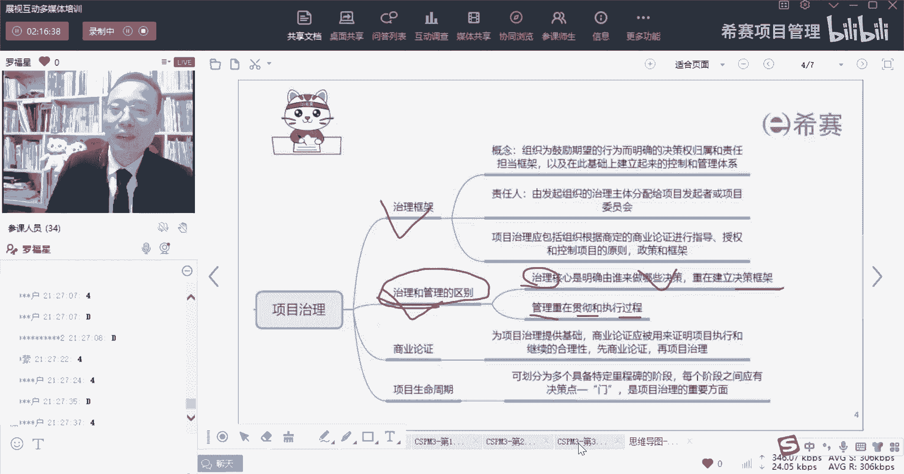

接下来就是今天晚上我念过名字的，都有哪一些人。

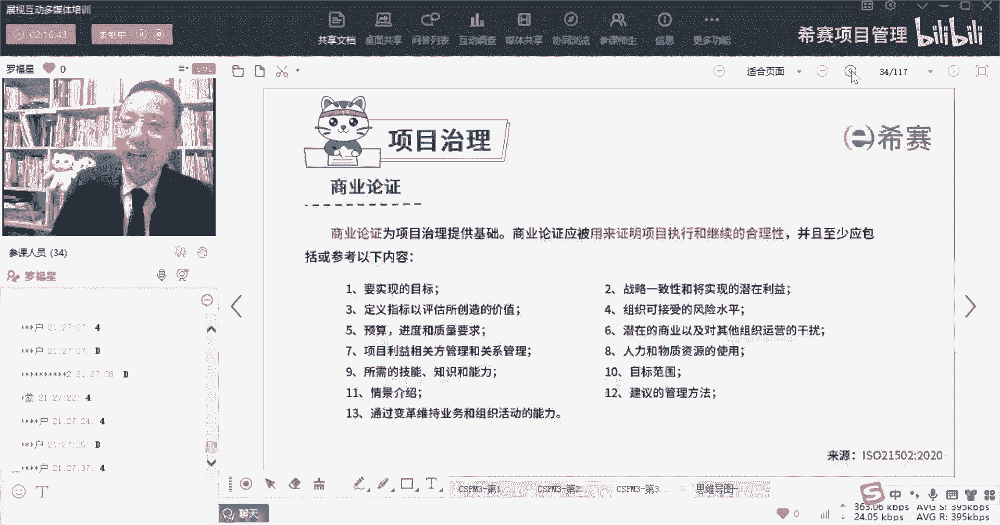

你们可以把你们的名字敲一下，或者是你们可以在群里面敲名字也可以，好不好。

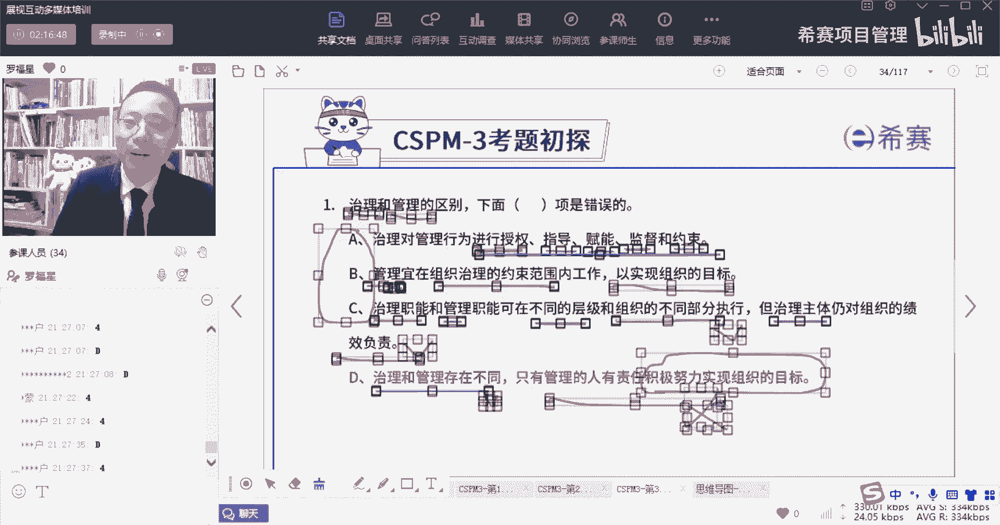

你们在群里面去敲名字，然后到时候我们我在这群里面去收集名字，给你们发个小礼物好吗。

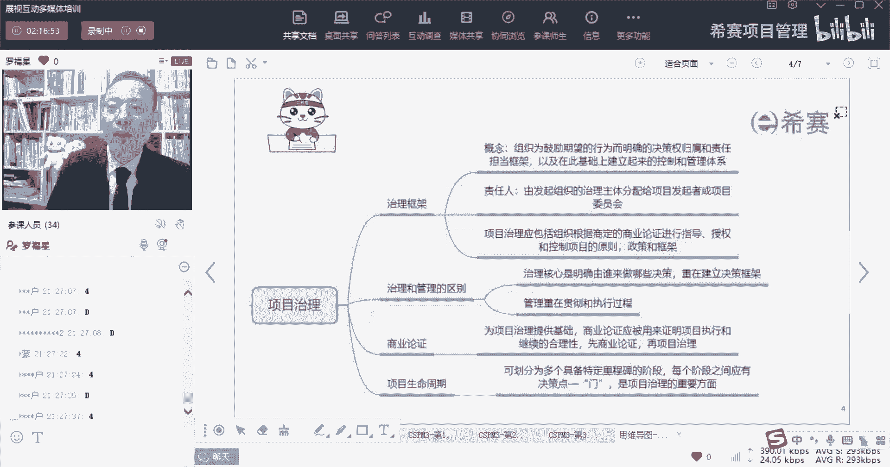

我们稍微简单回顾一下，这边都搞了些什么东西啊，就是整个关于受控，就是关于项目经理的角色定位，以及受控环境的建立，他讲的是讲的是什么啊，一个是关于组织视角下的项目管理。

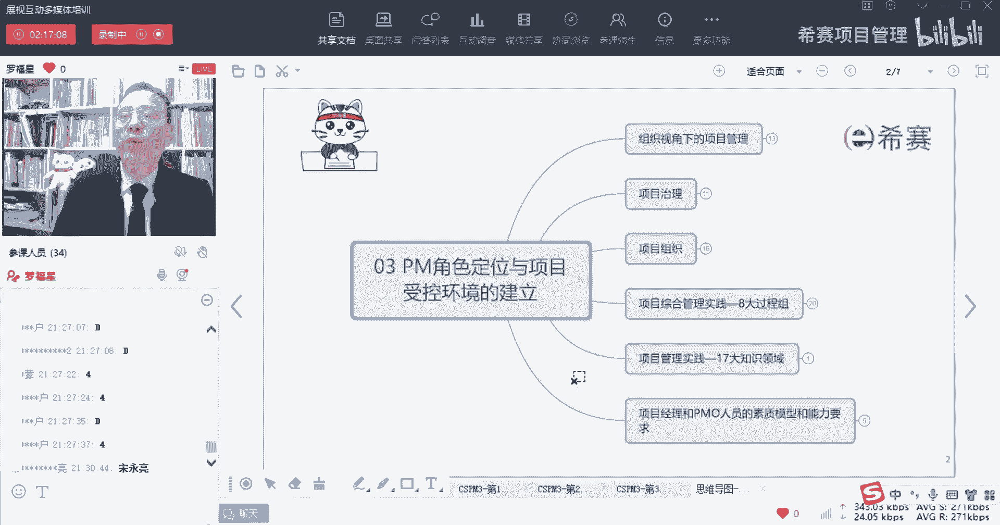

一个是关于项目治理，那么组织视角下的项目管理，他会讲到说是项目的，就是会受到很多东西影响，会受到内部因素的影响和外部因素的影响，内部因素就包括战略呀，技术呀，成熟度啊，资源啊，文化啊等等。

而外部呢就是pencil分析，然后还包括加地理对吧，PEL加上地理啊，然后呢是组织的战略和项目，那么项目是以目标为导向，项目是去实现组织战略目标的一种方式，同时呢我们还会有项目群，项目群是要去实现收益。

他是会希望能够1+1大于二，1+1大于二啊，那还有一个呢叫项目组合，项目组合呢说是能为投资为以投资为导向，也就是说是项目组合，我选多个项目，是为了能够达到价值最大化来去做选择好。

然后呢同时我们在组织视角下去做项目管理，还会有两个视角，一个是客户的视角，一个是供应商的视角，那客户呢其实就是提起需求的这个角色，而供应商呢就是去提供那些个产品，或提供这个服务的这个角色。

还有就是项目的约束，我们说项目的约束有很多约束啊，有时间啊，进度啊，成本啊，质量啊，什么风险呢，还会有这些个，比方说安全呐，然后资源呢等等，那约束它们之间其实有一个很重要的信息，就是要达到一种平衡。

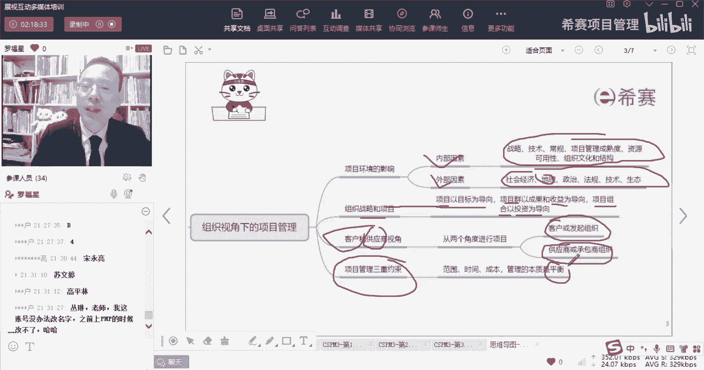

要采取一种平衡，达到一种平衡，再讲到一个治理框架，那么治理框架首先第一个什么是治理，治理是去定好这些决策权的归属，以及责任的担当来治理好一个，按定好一个框架，定好这个框架对吧。

那么一般来讲治理主体是谁呢，治理主体是发起者或是项目的委员会，通常这里是在已经有了商业论证之后，在商业论证的基础上面，然后再来去指导授权，控制这些项目的一些什么框架原则，所以他是老板们领导们干的事情啊。

然后呢项目管理呢管理是去落实和执行，是重在落实和执行，这就是今天晚上内容就这些。

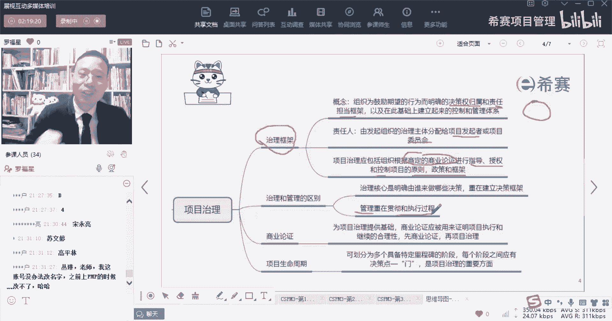