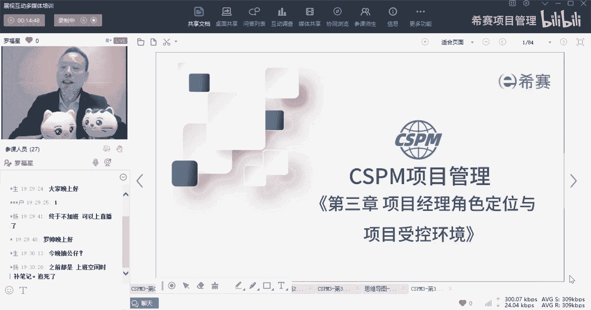
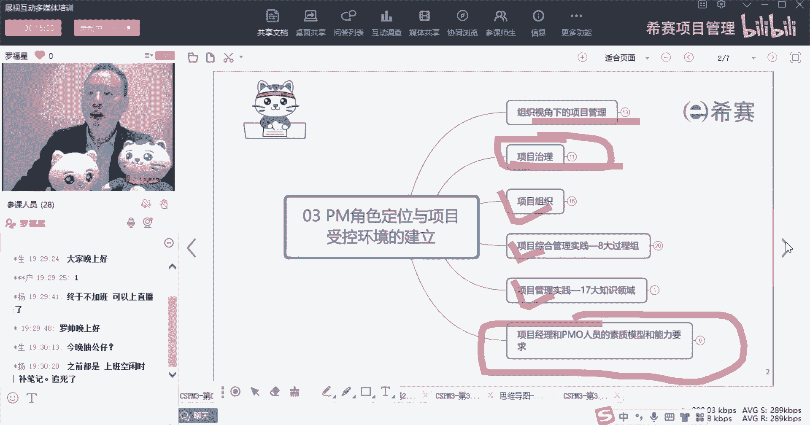
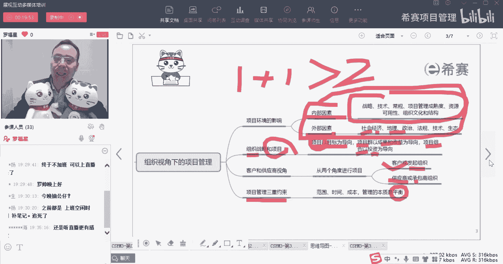
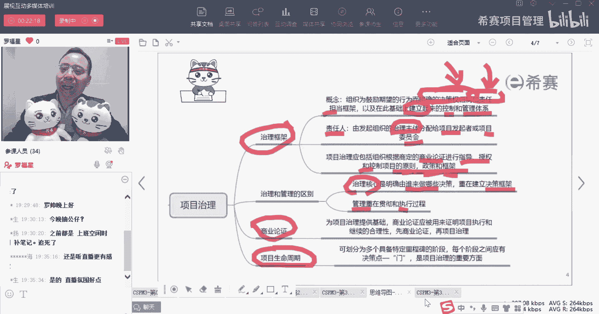
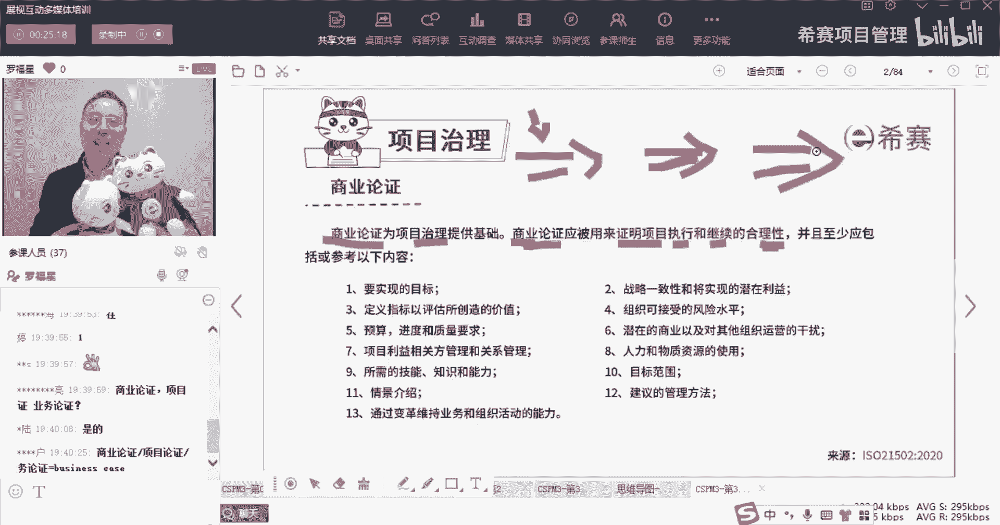
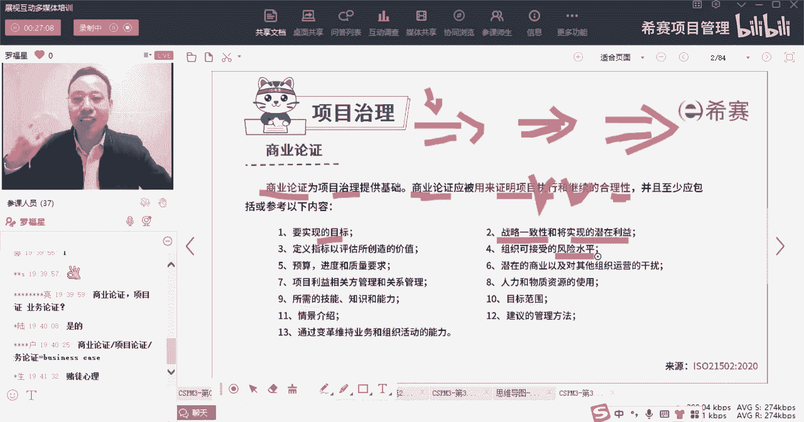
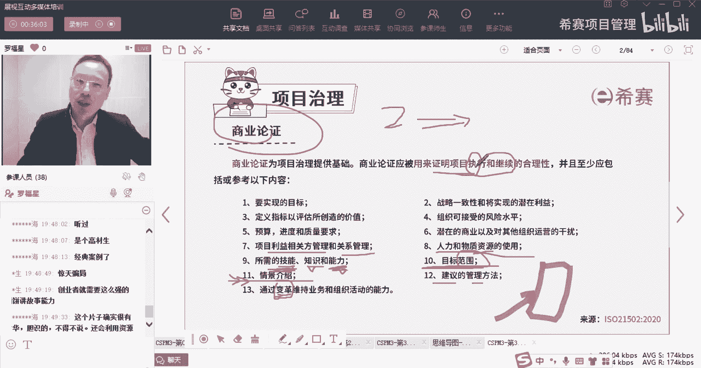
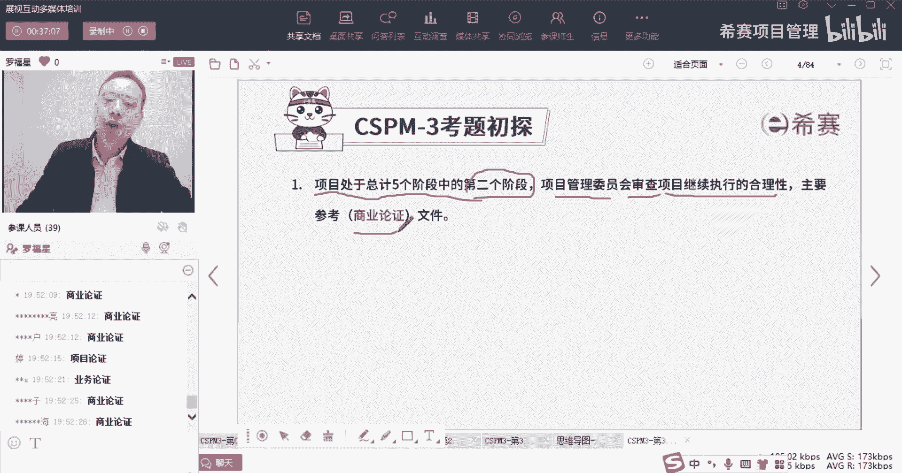
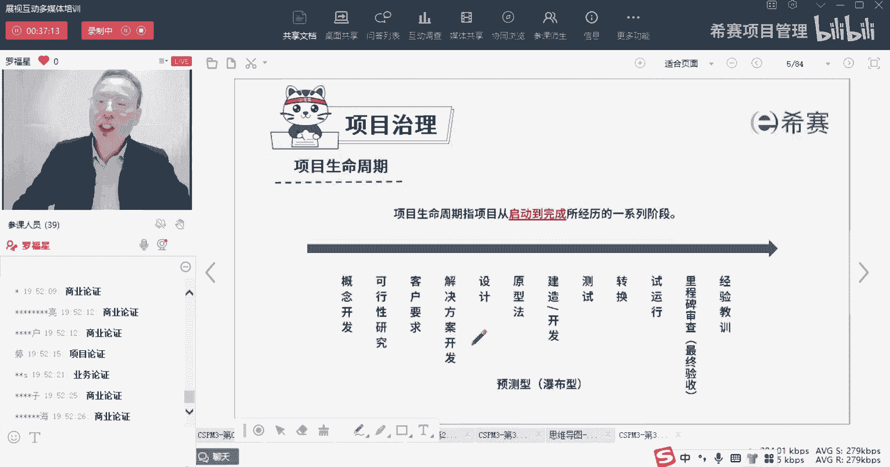
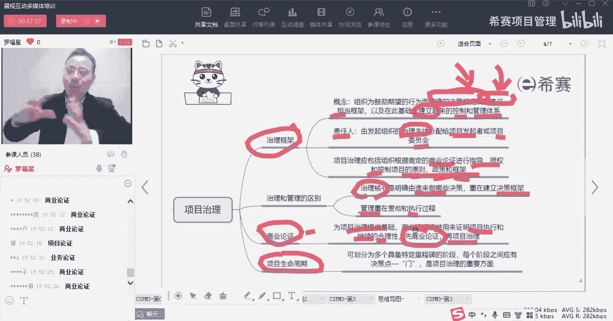

# 【收藏】CSPM-3中级项目管理认证考试直播课精讲视频合集（零基础入门系统教程）！ - P19：CSPM长空3-8项目治理之商业论证 - 希赛项目管理 - BV16p42197SH

大家晚上好，欢迎来到西夏文专业的职业教育平台，我是罗福星，今天晚上我们继续来分享的是，CSPM的第三章，叫项目经理的角色定位以及项目受控的环境，那我们一起来分享的这个内容呢。

我们在上一次课程其实是讲了一部分，我不知道大家是不是还有印象啊，就是整个这个章节的内容有点多，他会讲到是组织决策下的项目经理，他要干什么什么事情，然后是项目治理干什么事情。

我们上一次刚好是把项目治理将将讲的，快要结束，还是那最后一个小小的点，然后接下来是关于项目组织，然后那个项目综合管理，然后是项目管理实践，还有呢这个内容说实在的其实是有点问题的，不应该放在这个地方啊。

其实这个最后一个叫项目经理和PO，他的这个什么数字模型应该是放在第二章，因为官方教材的把它放到第三章，所以我也把它放第三章呃，所以这一次还放在这里，但是事实上他应该更合适的地方是第二章。

我们稍微来回顾一下。

看上一期都讲的什么东西好不好，最开始讲到组织是脚下的这样一个项目管理呢，会先说说是会累一些东西影响我们的项目，那哪些东西会影响项目呢，包括有一些内部的环境，一些外部的环境，那内部的环境其实有各种各样。

你只要理解为说是咱们公司内部的，这样一些什么战略呀，然后技术啊，能力啊，资源啊等等这些东西，文化呀都是内部的因素，就是公司内部的，那还有一个是外部因素，外部因素呢我开始有讲过。

你其实可以把它简单理解为是pestle分析，test分析，再加上一个地理位置，就是有社会呀，经济呀，法律呀，政策呀，程序就是那个技术呀，还有环境啊等这些东西，再加上地理位置，也加上这个地理位置等这些。

这是内部因素和外部因素，它们其实合到一起是什么，不就是我们以前在偏僻课程中有学过的，一个叫事业环境因素，对不对，其实就是那些事业环境因素啊，好接下来呢会讲的是关于那个组织战略和项目，它们之间的关系。

战略本身我们讲过有几个词简单来理解理解，一个是大的一个目标，比方说我们会有一个大的一个5年计划，5年战略，3年战略，一年战略，还有今年下半年战略等等，那么它可能会是一个大的目标的这种形式。

大的目标和方向的这种形式，第二个是相当于是一个具体的计划，我们怎么样去做到呢，我们一步一步怎么样去做到呢，还有一个就是战略本身，它还带了一个很重要的属性，是能够让我们去整合资源，让我们更好的去整合资源。

来去往那个目标的方向去靠近，而项目呢，它却是能够去促进我们达成战略目标的，这种手段和方法，所以项目是可以达成战略的方法之一，是这个意思啊，项目是以目标为导向，还有那叫项目群，项目群是以成果和收益为导向。

也就是如果说是我们去做项目群，或者项目急的话呢，会希望是可以1+1大于二，是更划算，叫以成果和收益为导向，那还有一个呢叫项目组合，项目组合呢它其实我们在这里没有特别展开讲，但是你稍微了解一下项目组合。

你可以理解为说是我们有很多很多的项目机会，我要从中去挑选某几个，那我挑选哪几个呢，一定是看怎么挑选最划算对吧，怎么挑选最划算呢，所以图那个那个项目组合管理，它其实会跟投资有关系，是站在投资的角度。

以投资为导向，看我怎么样去做，投资以后是能够让我的价值最大化，就是这三个因素，同时你要记得一定是项目，才是实现我们战略目标的手段和方式，然后接下来还讲到一个词，就是我们在这个组织视角下去管项目的时候呢。

还会有一个视角，一个是说客户的视角，一个是供应商的视角，那关于客户和供应商呢，你要有一个这样简单的一个理理解，就是说其实不一定真的是说有甲方和乙方的，甲方是那个供应商的，甲方是客户啊，乙方是供应商。

不完全是这样，你哪怕只是在公司内部，你们公司的别的部门，他们需要去做一个项目，然后呢，你们部门是负责去落实去做这样一个事情，那你同样的也是这样一个客户和供应商的视角，所以只要是发起这个项目的。

它都是客户视角，只要是负责去承包这个事情，去做这个事情呢，去执行这个事情呢，都是供应商的这个视角啊，这里稍微简单提了一下，然后呢在讲的是关于项目的约束，那项目的上那个约束就有很多了。

范围进度成本质量和资源沟通风险，财务相关这些东西他都可以当做约束，而约束中最为核心焦点呢，就是我们的项目的范进程对吧，范围进度成本这种三重约束，但是除此以外呢，还有很多别的因素都是啊。

那有一句话你一定要记得，就是那么多的约束条件，我们去管理项目的话，怎么到底该怎么样去搞呢，注意什么东西呢，其实会是希望能够取得某种平衡，当我们可以取得某种平衡的时候，诶你就觉得啊。

我这个才是能够达到一个良好的状态，因为每个公司它的状态是不相同的，好这是第一个板块，是组织，是脚下的项目管理。

接下来我们要讲的第二个叫治理，那治理它是什么呢，治理其实是一个很大的概念，也就是说我们去搭台子，搭框架，去定规则，这些东西都叫治理，那么首先会认识一个叫治理框架，他说要组织为了鼓励期望的行为。

而明确这种决策权的归属，明确这些责任的担当，谁有决策权，谁有什么什么，谁能够去负这个对这个东西负责，那么他就把这个东西把这个框架给搭建起来，这就是属于叫治理，他说以及在这个基础上面。

来去控制和管理这些体系，把这个控制管理体系建立起来，让这个东西能够正常运转下来，这都是治理的框架，所以治理当是谁干的事情呢，是大领导们，是公司的老板们呐，还有各位老总们，他们来去定规则呃。

甚至说有董事会啊什么的，他还去定大规则，我们说这个治理就是政府去治理这个环境对吧，政府去治理这些，而这个城市治理它都是大的，这个规则的意识好，同时呢，这里责任人他说责任人一般来讲，治理是谁来去做呢。

有一个词叫治理主体，那这个治理主体一般是谁，一般是叫项目的发起者，或者说是项目委员会，就是让项目的发起者或委员会，他们来去承担这些治理相关的工作，也让他们来去做这个治理相关的整个治理。

他说是要去在商业论证的这样一个情形下，来进行指导，授权控制，关于项目的一些原则，政策和框架，也许是我们有一个基础条件，是满足商业论证的前提下，然后呢我们再来去做好这些个什么啊，定规则，定原则，定政策。

定框架，这是关于治理，那治理和管理，他们其实还是有比较明显的差别啊，治理的核心是什么，治理核心是说要干哪些事情，谁来负责干，然后把这个框架给定起来，所以是搭台子的这种方式，而管理呢更多的是在于执行。

所以它就是贯彻和执行，也就是去做事情，一个是定规则，一个是去做事情诶，这是不一样的好，同时整个然后在整个讲这个治理中还有两个词，一个叫商业论证，这个呢我们在上一节课还没有来得及讲。

还有个叫项目的生命周期，我们也没有来得及讲，我们今天就从这里开始，我们先来看一看商业论证啊，什么叫商业论证呢。

其实你都已经很熟了对吧，我们说商业论证，商业论证他的那个有的时候翻译啊，我先告诉你这个因为咱们的这个CSPM呢，因为是才刚刚开始起头，他的很多东西呢还比较粗糙，所以有一些翻译不是很准确，也很正常。

他有的会把它翻译成项目论证，所以你们在做题目的时候，你做了看了试卷没有，那试卷中你可你可能会看到有一种叫项目论证，其实那个项目论证说的也就是这个商业论证啊，项目认证。

商业认证都叫business case，Business case，但是其实有大佬建议的说，更合适的翻译叫什么呢，既不叫商业论证，也不叫项目论证，而是说会建议翻译成叫业务论证。

OK叫business business，Business business case，他就叫业务论证会更合适，当然在我们中国呢更多的是叫可研，可行性研究分析对吧，可研分析，可研报告，可研分析。

可研报告，但是还是更规范的方式，应该叫做业务认证，因为这个business它其实不完全是commercial，不完全是商业，它包含了商业，同时还包含一种可行性，包含了各种技术的可行性呢。

啊什么法律的可行性啊，风险可行性啊，资源可行性等等，所以呢它是把它翻译成叫业务论证会更多，但是你做题目的时候，你就你就知道啊，说商业论证，项目论证，业务论证这三个三玩意是一个东西，OK我说清楚没有。

兄弟们，商业论证，项目论证，业务论证是一个玩意儿啊，它只是翻译的不相同而已，好不好，哎你们适当的可以给我一些反馈，给老给老师一些反馈啊，让我知道我不是一个人在战斗，哈哈我们在一起。

we are to leather好，我们继续往下面来看，那商业论证呢他说是为治理提供建议，为项目的治理提供一个基础，就是我们公司先有一个大的一个商业论证，论证什么，其实论证只要干一件事情。

他论证就是说这个东西值得做，论证是指的对对对对，那个西西亮亮总亮总说的是对的啊，就是商业论证，项目论证，业务论证对，就是三个三个翻译啊，是一个意思，好，商业论证。

它其实本意就是要去证明这个项目是值得搞的，有前途的，能赚到钱钱的啊，但是呢商业论证，它不是说只在项目刚刚开始起头的时候去做，它其实是要持续去做，也就是我们整个在做项目的过程中，他要持续来进行商业论证。

所以你看商业论证，他就是应该是用来去证明项目执行的合理性，项目继续的合理性，所以我们在最开始要进行商业论证，你觉得这个项目值得做，我们就开始做对吧，过程中我们还要再一次继续进行相应论证。

发现它依然是值得做，我们再继续，如果但凡有一天发现它不合适做，我们该怎么办，我们要及时止损，该放弃时要放弃，抱累了。

所以其实做项目的话呢，有一个这样的基本思路，就是如果说你做一个项目，你做到后面发现已经是不合适了，你发现前面其实是掉到坑里面去了，你就应该要去及时的止损，我相信你能看很多人都看过那部电影。

叫做呃孤注一掷，孤注一掷里面其实就有一个场景，就是当一个人被别人骗了以后，他忍不住还想要继续再翻本，忍不住还想要继续再翻本，他为什么呢，因为他不甘心，但事实上如果说你已经发现你被骗了以后，理论上来讲。

你该叫停的时候就叫停，你如果不叫停的话，以后应该是会亏更多，而商业论证它就是在告给我们去踩刹车，帮助我们及时去踩刹车的这样一份文件，他是要来去证明，我们的这个项目是值得被继续执行的。

是值得继续进行下去的，他对这种题的合理性来进行一个确认，OK那像言论证中会包含很多信息，你看首先那个说是要实现的目标是什么，然后呢我们要做的东西，他说战略是相一致的，就跟我们现在正在做的东西。

跟我们公司的战略目标是相一致的啊，以及呢我们做的这个东西，它是真的能够去实现我们所期望的这些利益，所潜在的这些利益，还有就是他说定义指标以及评估所创造的价值，就是我们有一些手段和方式。

能够去对我们的这些个商业结果做出来，结果有进行量化论证或量化去评判的，这些指标和方式，以及我们可以接受的风险水平，什么意思呢，有一些公司他是愿意去接受高风险高回报的，就是叫什么风浪越大，鱼越贵。

那也有一些公司呢它是只能接受中等风险，然后中等的收益，那还有一些公司呢它是能够去接他，只能接受这种低风险低收益。

你得要了解你们公司能够那个风险的接受程度，什么叫接受程度，就是你如果亏损亏到了40%，或者亏到了50%，你哎觉得不行了，那我就宁愿把他给咔掉对吧，所以你这种风险的追逐的类型到底是什么类型。

它需要也是需要去提前列出来你，否则的话，假如说你是那种什么就是心理素质很差的，但凡搞掉了一些些，你就啊要死要活的这种方式，你又没有把这东西列清楚，那么到时候等到项目已经亏了30%以后，你还在那继续。

那时候又心惊肉跳，理论上来讲，你发现已经超过30%以后，你就该叫停，就不要做了，对不对，你再往上面坐下去，你会更加的心惊肉跳，夜不能寐，然后头发都熬白了，所以就是公司组织的公司，它能够接受的风险水平。

也是我们同样需要去了解的好，除此外他说是预算啊，进度呀，质量啊等这些东西，其实也就是进度，成本质量这些东西也要提前列出来啊，罗总说我们有一个项目亏得连裤衩子都没了，然后还在继续投钱。

那有的时候呢也有那种情况，也有也有，但这个就不能够一概而论呢，有一些时候有些项目他为了他去投钱，其实是有更多的目的，我们说价值有两种对吧，一个是有形的价值，一个是无形的价值，当然也看情况啊。

他有可能是刚好是想要去追寻一些无形的价值，那也有可能是因为老板贪，就是脑袋抽风了都有可能性啊，罗总说是因为老板他要做市值对吧，你看所以他也是有目的的，他是有目的的，你你明显的知道。

你你会知道说像什么什么鬼公司，然后他就是呃几年之内亏了很多很多钱，他只进了几笔小小的账，但他给人给那些什么股东，给了些不叫股东啊，就是给那些个高管们发的薪资，待遇是几百万几百万的发，他就是在圈社会的钱。

圈那些个那些韭菜的钱，他使劲圈韭菜的钱，然后搞得红红火火，恍恍惚惚，然后最后被别人搞清楚以后，发现那进了几笔占比也都是自己搞的，然后他却又是B轮融资啊，C轮融资呀，然后什么IPO啊，什么之类的。

所以有些东西它就是有目的的呃，这个的话就是看情况了对吧，另当别论，我们一般讲三一论证的，更多的会讲那种，就是不按照那种，特不就是那种那种不按常理出牌的那种方式呢，不予考虑，那是另外一条路线的。

那是特别路线，正常路线下就是你要么是能够赚到钱，要么就是能够获得一些这种无形的收益，你两方面综合考量以后，你就会去做对吧，所以它里面会简单去讲一讲，我们这个项目本身它的一些预算来进度的要求。

我希望达到什么样的程度，以及潜在的商业以及对其他的一个干扰，什么意思呢，有的时候你要去想一个这样的事情，你说哎呀我很牛逼，我们公司做手机的，我现在研发了一款新的手机，我这款新的手机如果一旦上市以后。

市场上那些个手机全部都被秒成渣对吧，又价格便宜，又是续航能力长，然后又是用起来很流畅，然后又是处理速度快，打游戏又很丝滑，然后又是处理什么特别好，如何如何如何好，但是你要想一想哦。

如果说你的这款这么牛逼的手机，然后价格还便宜的吧，你上市以后，它不只是把竞争对手给干死，他同时也把你之前的那些手机也给干死了呀，所以你还要去综合考量很多信息，他说包括说你这东西。

你对于别的那些东西的运营一些干扰，包括你们自己的一些东西的干扰，你也是需要去考虑和考量的，对吧对，有那种情况，就是你这你这个仓库里面还存了3000万台，你仓库里面还存了3000万台那种老的手。

老款的手机你都没有把它给消耗掉的时候，你就马上就把这个新的产品搞走上市，并且公之于众告诉大家，我这东西多么牛逼，那这时候你把别人干死的同时，自己其实也是他也是死的很惨的对吧，有那种情况。

就有可能你赚的钱还没，还没有那种不不上市赚得多，你实际上这一款手机赚到了钱，可是你整体的综合下来，你发现你其实是亏掉了，并且那些都压在仓库里面的东西，它就只能是用很低的价格折价的方式去卖出去。

否则的话就很难受，对不对，所以这也是也是你需要去考虑的事情之一啊，但此时时刻把你拔到一个很高的位置啊，兄弟们，此时此刻是把你拔到一个很高的位置，拔到一个高级leader这个位置，或者是商业分析师。

老板等这些个角色的位置好，再来往下面看，他说项目的利益相关方的管理以及关系的管理，那么也就是干系人管理和沟通的管理，对不对，干性沟通的这些事情，我们也需要聊一聊诶，要需要去了解了解。

然后喊了一个资源的管理人的管理，然后以及我们可能所需要的知识技能，我们团队有这个技能吗，大家有这个知识能力吗，有这个交付的能力吗，因为商业论证中其实还会包含这些，就是我们有没有实力去交付他。

大家有没有听过一个叫一滴血的项目，一滴血的项目，一个据说是哈佛的美女学霸搞了一个项目，然后就哇，她说很多女性去怀宝宝的时候去做检查，那通常要抽四管血，五管血对吧，我这个就就是让大家觉得很难受的。

你说你一个月好不容易才涨那么一点血，结果全都被抽掉了，真的是太太让人难受了，所以那个美女学霸她想了一个很好的主意，他说只要只要一滴血，就可以去把所有的这种检查全部都给干掉哇。

这个项目已经听起来觉得好不好太好了，所以就让很多很多大佬去投资，包括什么默多克呀，是不是那个什么比尔盖茨有没有投，不知道啊，就是很多很多大佬都给他投资，然后还有很多人给他站站台，给他去支持。

因为这个真的是造福人，造福全人类的呀，但最后呢他是差不多是骗了几百亿美元，几百亿美元，270美元还是多少，具体数额我不见了，270美元，最后的最后发现是一个骗局，为什么呢。

因为他没有这个技能和能力去交付，就是当你最终交付不了的时候，那你就成为了一个骗局，如果你真的是可以交付的了，你最后能够交付出去，那就没毛病，没问题，关键是你交付不了，所以我们也要去考虑到。

有没有实力和能力去交付对吧，还有你的那个要做要做哪一些东西，你的范围目标，你要做什么东西，除此以外你的情景就是我们在什么样的场景下，我们才会去搞这个事情，哎这就是讲故事能力了对吧，张总说哎。

创业者就需要有这么强的画饼的能力，讲故事能力就是你会先描述一下啊，在这种场景下，他们带着多么的难受啊，多么的悲伤啊，全世界每一年都有那么那么多的女性怀孕，你想每一个人要抽掉这么这么这么多管血。

那我们全世界要被抽掉多少管血啊，然后这种方式是多么大的一个浪费，然后这些又不能起来做什么什么作用，那如果说我们可以怎么样的话，就可以保护这些群体，然后也是不会浪费资源。

也能够让他们得到更好的一个呃一个保护宝宝，也能够更建议去成长等等，讲一些故事吧，讲一下背景情况是什么，才能够说明为什么我们需要去做这个项目对吧，他说以及建议的一些管理方法呀，还有一个词叫。

通过变革来维持业务和组织的活力，这个呢不是说每一个都非得要变革啊，如果需要的话，我们是需要把变革加上变革是什么意思，就往往是我们现在的这东西它已经不好用了。

或者不太能够去喊cover现在已有的东西的时候，那我们可能就需要有一些变化，需要一些调整，所以才叫需要变革啊，那么这个变革的这些东西，也都是在商业论坛里面去说清楚，而整个商业论证讲的dram的东西。

它其实只有一条，就是决定这个项目值得做还是不值得做，这是第一条，第二点呢就是它要持续进行商业论证，要持续进行商业论证，因为现在整个外部的环境情况它是瞬息万变的，你可能在一年以前定好的一个目标。

觉得特别特别好的一个项目，可是你到现在看就是一个垃圾，有没有这种情况真的就是一个垃圾，甚至我看过说像经常有一些很多药品呢，他们当时说啊这瓶药品呢做了什么什么测试，做了什么什么测试。

然后最后被列为是叫禁止对吧，禁止生产禁止使用，那一定是因为当时觉得是一个很好的东西，后来发现它可能对人体有更大的伤害，这个伤害那还不如不要他才会把它禁掉对吧，所以你可能前期做的商业论证。

有可能并不一定那么好，所以随着时间推进，我们要进行持续的三验论证，通过持续来去证明，我们正在做的这个项目是值得继续执行的，就这么回事，OK这就是上这个项目治理中的这个叫商业论证，或者那也叫项目论证。

或者叫业务论证啊，这三个单词会混着用来看一个题目，这就是一个把把肉肉喂到口里面的一个项目，对吧，就是叫商业论证或者是项目论证，或者叫业务论证啊，就是这么一份文件啊，就是这个文件记住了。

所以虽然前面那些词你可能不太清楚，但没关系，他说项目项目是处于总计五个阶段中的，第二个阶段，其实他只是想要告诉你说项目正在执行中啊，正在执行中，项目管理委员会，他会审查项目继续执行的合理性。

也就是能不能继续进行下去，要不要停掉，那我们看什么东西呢，就看商业论证，或者是像项目论证或者业务论证啊。

就是这个意思好，这是这样的一份文件。

那么也就是关于商业论证，它是为这来提供了一个框架，然后呢被用来证明项目是执行和继续的合理性，一般是先做了商业论证以后，后面再进行项目的治理，也是先觉得这个项目是真的是值得做，然后我们再去搭建项目的框架。

这个这个逻辑是很顺的对吧，我先证明这个项目是值得做的，然后再搭建这个项目的框架，关于他的汇报关系啊。

什么职责该什么人去做呀。