# 【收藏】CSPM-3中级项目管理认证考试直播课精讲视频合集（零基础入门系统教程）！ - P20：CSPM长空3-9项目治理之项目生命周期 - 希赛项目管理 - BV16p42197SH

接下来呢在项目治理中，还有最后一个小小的内容，叫项目的生命周期，那生命周期呢我给大家稍微加了几页。

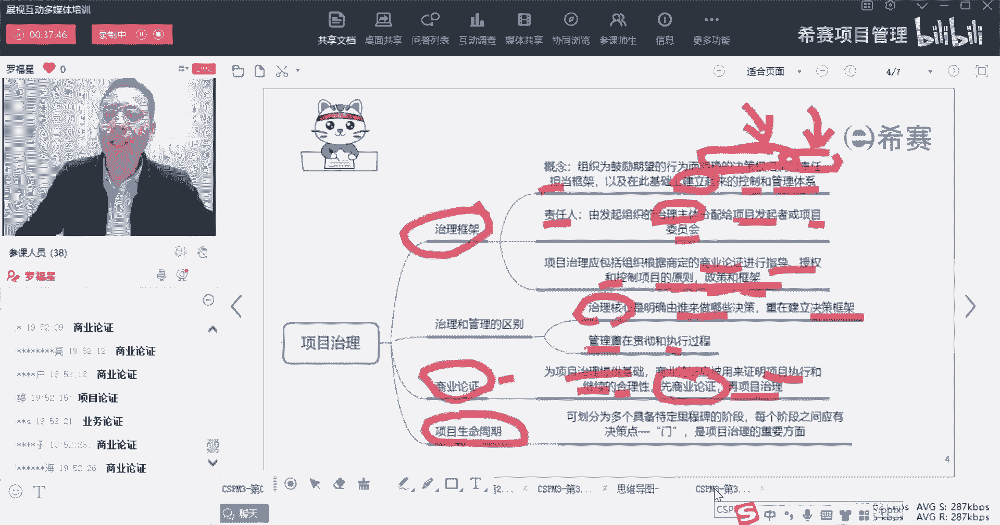

这都是你们比较熟悉的啊，是不是看上去一种很眼熟的感觉，很亲切的感觉，有没有莫名的亲切呃，整个生命周期，它指的是说项目从开始到截止，所历经的一系列的阶段，这个呢叫生命周期，不同类型的项目。

它的生命周期可能会略有不同，但如果说是按照从头到尾的方式呢，就是这种预测型的生命周期，他讲的是一开始我可能会有一个想法和创意，然后生成一个概念，然后这个概念然后进行初步的可行性研究。

其实也就是business case，就是商业论证啊，就是商业论证或者业务认证，项目论证，发现这个东西值得做以后再再去收集需求啊，解决方案啊，去设计啊，做原型啊，做开发，做构建呐，做测试呀。

后面这里有个词叫转换，转换这个词要稍微解释一下，因为你觉得有一些同学你们应该都记得啊，转换它是指的，说是从这个研发的场景，转到一个真实使用的场景叫转换，就有点像说你要你比方说你造了一个高铁。

你站在那个比方说在中车造的高铁，那么是在工厂里面造的，对不对，你要把它转换到了这个那个轨道上面，然后再去跑起来，对不对，你要跑起来，你要去这样，这是一个转转换，那包括说你研发了一款疫苗。

你研发疫苗的时候，是在那个实验室里面研发的疫苗，唉你要真的是给先给医生打，然后再给政府官员打，然后再给老百姓去打，你要诶这是转换它的这个使用的场景，而到了一个真实场景中，然后呢再进行试运行。

试运行发现没毛病，然后就走验收，就是这样的，验收完了以后，如果说没有什么问题，我们就去去结束了，就是把设备用到真实场景中，用到真正的场景中，或者把你的这个项目的结果，应用到真正的场景中。

而不是在实验室的状态，不是在研发场景中，是这个意思啊，这是所谓的转换，就你你做的任何一个东西，你啊比方说我们看比方说我们去呃，打个比方，你做的一款软件，你做的这个软件，你们写软件啊，然后去去测呀。

写软件去测呀，这些都是在开发的场景下，开发的环境下对吧，好，你到有一天的时候，你真的是需要去把它去push到外面去，然后能够让社会大众能够去用你的这个app，能够用你这个网站诶。

这个这就是一个转换的过程，那么那个转换，其实它为什么会有专门有一个转换呢，因为有很多东西它其实是在你自己那个场景，你发现是没毛病的，可是你真的把它用到生活场景的时候，各种各样的问题和困难都会出现。

所以转换它专门列了这样一个词汇啊，当然了，其实这不重要啊，在这里不重要啊，你要有这个意识啊，灰度测试对吧好，那么这个是生命周期的一种形式。

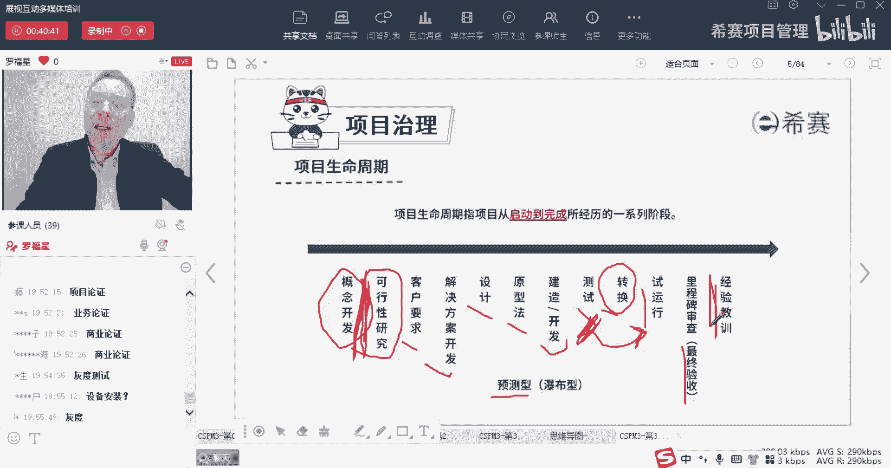

而生命周期呢除了有这种预测的方式，就是先第一步，然后第二步，第三步，第四步，第五步对吧，处理这种方式，他说像瀑布一样的流水，瀑布流水往下流，往下流的这种方式，一直往下的这种方式，这是瀑布。

那除了有瀑布的方式呢，生命周期还有一些别的方式，比方说还有一种叫迭代的方式，迭代是先搞了一点，然后再优化一点，然后再优化更多啊，这么一轮一轮一轮越来越好，越来越好的方式，诶，这是迭代型的方式。

那还有一种呢它叫增量型的方式，增量形式我先交付了一些有用的东西，我在交付更多有用的东西，我在交付更多有用的东西，就相当于是你们在炒菜的时候，你去点餐的时候，别人先给你上两盆菜，再给你上两盆菜。

再给你上一盆菜，然后再给你端了一个火锅过来，这就是一种增量的方式来去交付东西，而迭代的方式呢，就像你们所理解的，比方说开发一些手机的app，app或者是研发一些什么疫苗，他可能会研发出来。

然后做很多很多测试，测试发现有毛病，然后又改，改了以后退换了，重来重来以后又又弄，一直改来改去，改，到最后发现OK了再交付，所以它是中间会改来改去改很多次，最终去交付。

但事实上还有一种形式呢是他们两个相结合，也就是说既有增量的方式，又有迭代的方式，这个呢我们给它取个名字叫敏捷型，就像我们说开发这个手机app的话，你会先交付一个版本，它包含了一些些功能。

然后呢你又不断去优化改进，同时呢又加了一些新的功能进来，又优化了一些旧的功能加进来啊，又有一些质量交付，然后再下一期有新的增量交付，我每一轮都有新的增量交付，同时又修改了原有的一些bug。

那么这个呢就是用一种叫敏捷型的方式来理解，那同时敏捷性它还有一个专门的名词叫适应性，我们说适应能力很强对吧，谁谁谁的适应能力很强，叫适应性，这都是生命周期。

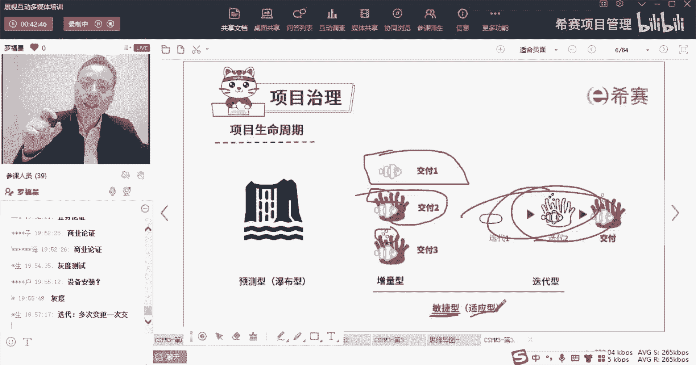

那整个生命周期呢，呃在在看发给你讲义上有这一页啊，在你发你们手上的讲义有这一页，说项目生命周期，我们可能会把它分成很多个阶段，那么到底用哪一些阶段呢，其实是根据你的情况来。

他说项目的阶段的数量以及项目阶段名称，是取决于所进行的项目的类型，所需要的治理以及所预期的风险啊，这个词你可能会觉得有点有点怪啊，我给你简单解释一下。

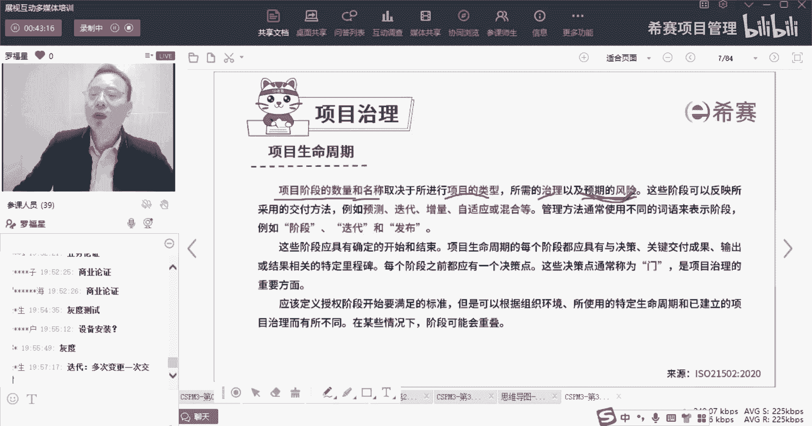

你可能就会更好理解呃，我给你看看到这一页，比方说有没有同学是上过我的NPTP课程的，有知道有个词叫stage and gate叫阶段关口模型有吗，就是上过了NPTP课程，有知道了一个stage的G。

就是通常情况下，像有一些类型的项目，它会是从开始从一个小从没有创意，从一个小创意开始，然后到一段一段一段一直到到后面来啊，有两位同学哦，有两位同学上过mp课程，那么在这种很长的一个周期中。

你从最开始的创意到初步的可行性，到详细的可行性论证，然后到项目的研发，然后到后面的这些个测试上市周期对吧，那么这里很长一段的时候，他为了方便管理，那就把每一段做一个阶段。

那个阶段呢给了一个词叫stage stage，stage阶段，那同时有的时候我们为了更好地去对，这个阶段有一个很好的管控，我们会专门对每一个阶段结尾的时候呢，专门给他设置一个关卡，关卡或者关卡。

不知道到底是读关卡还是关卡，那现在这个关卡呢它有个名词叫gate，Gate，其实就是一个门的啊，就是一个门，这个关卡这个词，这个门这个词它有点像什么呢，你就理解我们在生活中也有一句这样的俗语。

叫一夫当关，万夫莫开，一夫当关，万夫莫开，关就是关，就是关口或者关卡，OK好，我每一段对开始前面是一个博士六阶段，到了后面的就是到了一个stage gate这种方式。

那么每一个地方我都设置git设置一个门，git g a t e gate门，就是设计这个门啊，这一段也设计一个门，我这一段也设计一个门，那这个门它其实干什么呢，对他就是你这个这个这个这个这位。

这位这位老总说的啊，就是干阶段性验收的，就是他去论证或者验验证，这一阶段的事情是干完了，确认这东西干好了，如果你干好了，就继续进入下一个下一阶段，就像说你你你是这个小区的那个业主。

那么你验证那个看门大爷给你验证一下，发现诶你真的是，那么就请通行就可以通行到下一阶段，对吧就是这个意思，但如果说发现你没干好，那怎么拒绝进入A让你退回去，哪里来回哪里去对吧，之前那个那个看门大爷说。

诶你不是我们这个小区的，我们那个小区是高端小区，那你不能进对吧，就拒绝了，那么还有一种情况呢是发现有一些什么问题，那么可能会暂时先停留在这个地方，这样停在这个地方，比方说哎发现怎么有点像嫌疑犯啊。

那就是找个借口把它把它扣，把他把他给忽悠在这个地方，然后同时去报警的方式，当然这个不是很恰当的例子啊，但是这么个意思就是你需要继续往前进，还是退回去，还是停留在这个地方。

还是直接就取消掉这个事情就不要搞了，这种方式，这都是在git中干的事情，都是在这个关口关卡中干的事情，我们经常会说到有个词叫过五关斩六将对吧，这是这是累谁干的事情，是呃叫那个关大爷对吧。

关关羽是叫关羽吗，哈哈我一下都不记得了，就关公关公他干的事情，过五关斩六将，那关也就是这关啊，兄弟们好，那么这里我既然有这么多阶段。

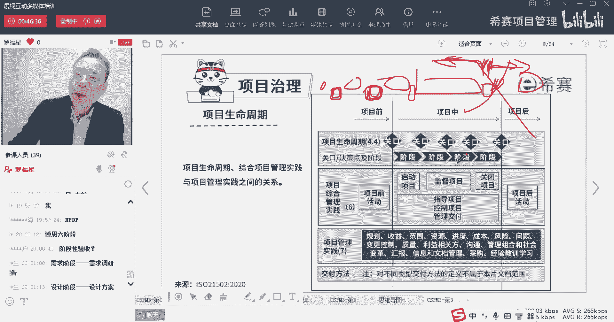

也有关口，也有阶段有关口，他会为什么会说他是跟这些东西有关系呢。

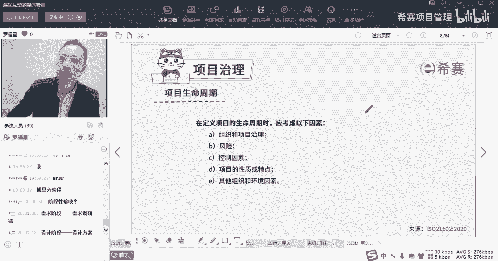

跟这些风险关系呢，你就这样去想，如果这个事情它的风险很大的话，那我是不是要一段一段地拔得更严格，一道关卡，一道关卡要把它很严格，一道关卡，一道关卡打的很严格，是不是，如果这东西风险很小的话。

那我其实就无所谓，我就小小的搞一搞，搞几道关卡就可以了对吧，所以你就经常会看到这样的广告词，他就说我们的这个产品经过了57道工序啊，什么什么什么的，对诶，他告诉你说经过了57道工序的设定。

就是哇好认真好严谨，这个产品的品质非常好，是不是有这种感觉，所以但凡它需要强调的东西是工序非常严谨，然后那个工序很复杂，然后我们质量把关很很很很严，那个时候他又会搞很多道工序。

所以它的阶段就会搞得更多啊，但是如果说你说哎呀，这不就是搞一个布娃娃吗，这布娃娃我们的小朋友他自己都可以缝，就很简单，只要搞只要设计一个图纸，然后去缝制它，往往里面填充棉花，然后再稍微修改一下啊。

就这么三个步骤，四个步骤就可以了，也是可以的，当一个事情它很简单的时候，或者他这个风险比较小的时候，我其实就用更少的数量的阶段来去做，如果优势比较复杂的时候，我们就会用更多的阶段来去做。

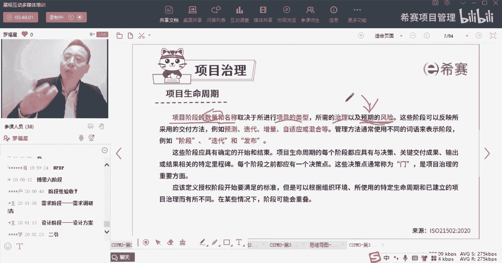

包括说正常情况下，大家都会知道的是叫做六阶段论，K博士六阶段论，但是IE就机翼公司就是叫什么，叫叫那个呃那个加了那个大佬叫什么名字，我一下子忘记了销售销售之神，那个销售大佬的记忆公司。

他们把那个汽车研发的时候，就搞了一个叫十阶段，十阶段的方式，那每个不同的行业，你的阶段都是可以根据你的需要来的啊，你要知道有这么一个有这么一回事。

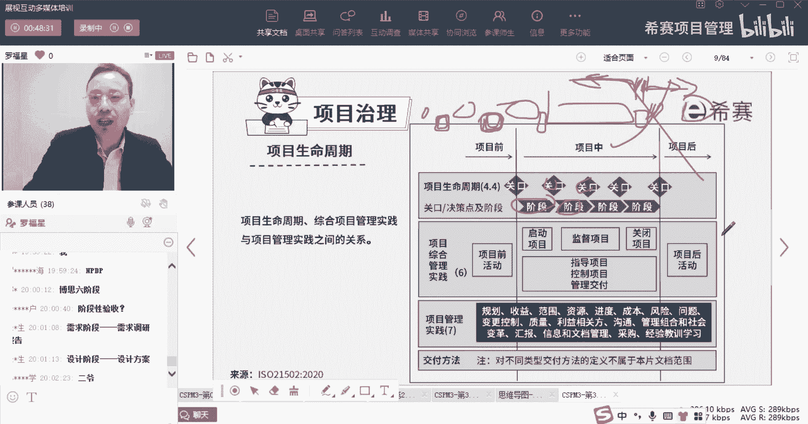

OK好，这是先认识这一个意思啊，但考试不会考这么细，考试不会考这么细，对呃，通用是不是还有个有个有个那个卖卖车，卖的很牛逼的一个大神，写了很多本书，写了什么银啊，还有什么什么之类的。

一下子把他名字给忘了一下，想不起来我们家书架上还有好多，好那你就首先知道一个点说哦，不是丰田，是是是西方国家的，是西方国家的，我搜一下好几下，哦对杰克韦尔奇，是的是的，我想的就是杰克韦尔奇啊，对啊。

杰克维奇他们那种公司，他会把那个汽车的那个生产，就是分到了很多很多段，很多段它就会分到十十阶段，十个stage它是四个大的阶段中，又分到那个十个小的阶段的这种方式，所以会根据需要来啊。

你只要知道有这个意思就可以了，考试补考的那么细致，我为什么愿意给大家讲的慢慢的去讲呢，是因为首先第一个我们的课时也不多，内容确实也比较有限，就是这个这个课因为太简单了，很多东西都是你一看就会的。

所以我也希望把那些，你可能知道或不知道的东西，尽量给你稍微捋一捋啊，是这个意思，但我不说你不知道啊，我只是说想跟你跟你分享一些有意思的东西好，那么这是关于这个，不管说是阶段的数量也好，阶段的名称也好。

都会根据你项目的这种需要来进行调整，你可能会这个东西你要搞得更精细一点，搞得更细致一点，你就可以搞很多很多阶段，你要搞得稍微粗糙一点，你就少少的阶段，甚至就像有点像什么呢，就像你们家那个净水器。

你们叫净水器诶，他会说有五个什么阀，那个那个那个那个滤芯对吧，五个不同滤芯，还是说有七个滤芯，还是有三个滤芯，你就看情况了对吧好，他说这个阶段可以反映，所采用的这些交付的方式，有什么预测型的这种方式。

有迭代型的这种方式，有增量型的方式，有自适自适应的方式。

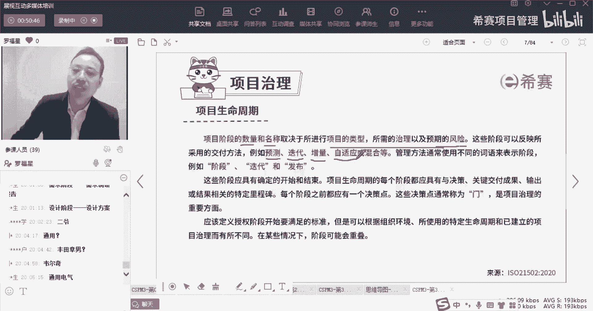

诶这不就刚好是这个预测的方式，增量的方式，迭代的方式。

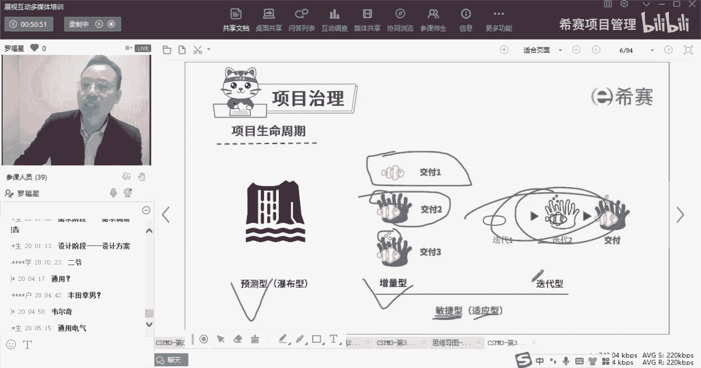

适应的方式对吧，同时他还给了一个词或是混合混合，也就是说我们可以预测，加上后面的东西都是叫混合，官方，他说管理方，管理方法通常会使用不同的这些词语来表示，阶段，可以用阶段了去表示或者用迭代呀。

用什么发布呀什么之类的，其实我们在敏捷项目管理中，敏捷项目管理那一段呢，我们就讲过说迭代呢其实就是一小周期，一小周期对吧，比方说四个礼拜为一个迭代，四个礼拜为一个迭代，这是一个迭代啊。

它也是一个小的阶段，他说用发布，比方说我说半年啊，以半年为一个周期，那个半年呢叫叫发布，所以它都可以表示阶段用不同的方式来去表达，这些阶段应该有明确的开始，和有有确定的开始和结束。

生命周期的每一个阶段都应该具有一些决策，关键交付成果输出以及什么什么里程碑特点，这词是什么意思呢，就是每一阶段我们都应该有一些输出的东西，是什么，OK然后这个输出的东西都有一个比对的，这个参考。

也就是我们在这一阶段做完了以后，我这里有个关口，那我这个关口一定是要拿一些东西，跟某些东西去进行比对，一比对，发现诶刚刚好可以往下进行，这就是这就是所谓的决策，对不对，所以你是要有结果，有参考标准。

还有一个决策的依据，以这种方式来去做，这是每一个阶段都需要有的，那每一个阶段他都有一个叫决策点，叫checkpoint的角色点，这个角色点呢也叫门门呢，其实就是GGATE。

用英文好的同学可以帮我敲一下git gt gate，它其实就是我们去就可以把，你就是就像就像前面有同学说的，他是不是就是阶段的评审，他其实就是兄弟们，他其实就是阶段的评审啊，就是这个阶段评审明白吗。

只是说因为有的时候我们说，为什么有那么多管理学大神啊，管理学大师啊，质量大，质量管理大师啊，他们搞了很多那种东西，因为你想一想，如果你能够在青史上留名留名，那是一件多么荣耀的事情。

天呐你们家祖坟冒青烟了那种感觉，所以大家都想要去在这个，在这个青史上留一个名，都想留下自己名字，所以都会搞一些不同的东西出来搞一些，甚至你知道那个整个敏捷的方式有几百种，敏捷的这种实践。

它其实大方向都是大差不差对吧，稍微这里搞了一点点改变，就说啊我们这种方法跟他们不一样，不一样不一样，我们这个方法这里做了改变，这种感觉你要有这个意识啊，所以有些词汇它很怪异。

其实就是也不一定就是它的本意是什么，你搞清楚就可以了，这是关于这个门这个gate啊，其实也就是那个那个那个那个关口关口的概念，他说应该去定义授权阶段开始要满足的标准，那么这就不是这标准吗。

你有这个可交付的成果，也有这个标准，然后拿这个标准和这个交付的成果进行比对，一比对以后就得到一个决策，决策就是OK可以继续不行，退回去，就这个意思对吧，他说，但是呢可以根据组织的环境。

所使用的特定的生命周期，和已经建立一些项目治理而有所不同，所以你这个标准其实也会跟你的情况来，有一些呢，标准就卡的比较松，它比较凶，就是这个这个漏网，这个鱼漏漏的很大。

所以那种小鱼小于十公分的鱼都可以露出去，对吧，那么如果有一些网游搞得很密，那么可能是只要是大于五公分的鱼，都漏不出去了之类的，你会根据你情况来。

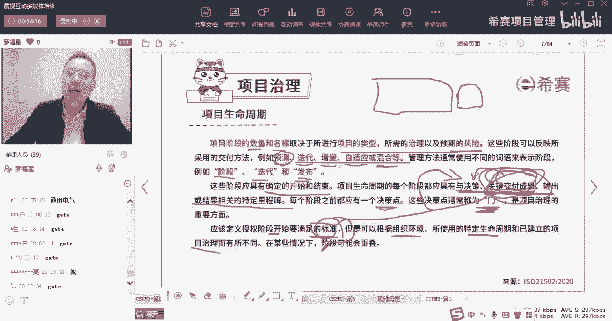

这只是给你一个提示啊，那么整个生命周期中，它的生命周期还要考虑很多因素，考虑到公司的这个治理项目的治理，组织的治理，考虑到这些公司的这些风险，风险的因素或者风险类别。

风险追逐的类型以及一些其他一些什么控制，这个控制因素，我相信它其实叫约束条件，应该它的本意应该是翻译，叫约束条件的这些东西啊，然后还有一些其他一些相关的信息特点啊。

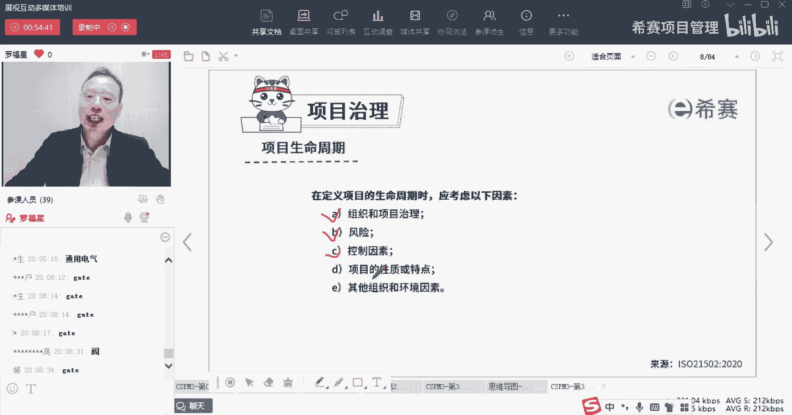

一些其他因素都会影响我们的生命周期，那么这里就一张图说，下面的生命周期和我们的项目管理实践，他们的这个展现形式，展现形式是什么呢，我们来看一下，我们来认认真真看一下这张图，它一共会分到这样几个几个阶段。

就是项目在进行中的阶段，在项目进行之前的阶段，项目进行之后的阶段，那我们在偏僻课程中基本上就是只学这一段，对不对，偏僻是只学这一段，NPDP呢是学了这三段啊，都都学到了NPDP就是把这几段都学了。

那我们在这里稍微去了解一下啊，因为很多同学其实没有去看NP的东西，那事实上呢我们在项目前在干什么，在项目前不就是叫做准备咯，对不对，我要准备准备啊，唉我觉得这个东西特别特别好，我想要去搞一个这样的项目。

我觉得他可能为公司可以带来很大的利益，能够为公司赚到钱，能够给我们带来什么什么什么什么收益对吧，所以呢这里就会有一个叫项目前活动，你看一下啊，这是生命周期啊，阶段关口的决策点。

然后这个是项目项目综合管理实践有六个，然后是项目管理实践有一十七一十一十七个啊，这写错了应该是17个，那这个项目综合管理实践和项目管理实践，他们有什么区别，我要先给你解释一下，其实然而并没有什么卵区别。

他就是哎呀，怎么讲呢，就是他在项目管理中，他没有办法，他又不能够要叫同一个名字，他为了去区分它，所以特别的把它给做了一个，作为一个名字的区分，把这一个叫项目综合管理实践。

综合管理实践中就是有项目前的活动啊，启动项目监督项目，官兵项目，然后嗯指导项目，然后控制项目交付项目，然后项目后的活动他会把它按到那个时间顺序，就有一点点像我们的五大过程组的形式，有一点点像五大过程组。

它也不完全，所以在这个版本中，他又搞了一个叫什么八大过程组，搞一个新的八大过程组啊，然后呢项目管理实践呢，你会发现它跟我们之前有一些东西相似啊，有什么范围管理，资源管理，进度管理，成本管理。

风险管理对吧，而质量管理等等这些东西，除此以外还有别的有什么规划规划，它不就是属于跟这个跟那个启动启动规划的，规划又是相似的吗，那它这个规划收益问题，采购呃，什么汇报变革。

他把这些东西呢它又叫做呃知识领域，这个叫法就有点怪，但是它其实另另外一套规则，因为事实上我们在真正做项目的时候呢，不仅仅是项目经理在管这一摊子上，他其实还需要很多很多人才。

所以他把这些要做的事情都把它给列出来，并且在我们在这个新的模型中，你会发现有更多的人参与进来，去负责多项的事情，因为本身做项目，他绝对不是一个小小的项目经理可以搞定的。

所以他这套规则其实会有它很强的实用性，他从哪里来，有没有同学是学过了prince的课程的，就是善了prince课程的有没有这个东西，这个框架它其实就是从prince里面来的啊。

就是像这些东西就是从prince里面来的，好我们了解先简单了解一下，就是一个是呃美国的标准，一个是欧洲的标准，现在呢他是把两个标准都融合到一起来，然后又搞了一套国际标准。

那这个国际标准里面就是就是又有阶段关口啊，又有这个综合管理这些什么项目前项目中，项目后又会有这些什么范围进度，成本质量以及什么收益呀，规划呀，汇报呀等等这些东西呃，它总体来讲就是会希望能够对。

希望能够达到一个，就是能够有有有一些好东西吧，对他他是尽量去取其精华的，这种思路来做这个东西，好有这个认知以后，我们再来看一下呃，整个呢在项目前活动中，我们是要去进行的一些事情。

就是做一些这种项目前的活动，比方说值得做啊，考虑什么项目呀，他为什么会如何如何啊，然后呢中期就是有项目中，项目中的过程就是去执行对吧，执行的时候就会有启动项目，然后去监督项目，指导项目，然后去控制项目。

去交付成果，然后做完东西要关闭项目，而事实上过程中他有他要考虑到那个范围，进度，成本质量等等这些一系列的东西好，然后呢项目最后搞完以后呢，我们还要考虑项目后活动，为什么，因为项目本身你做完以后。

他会不会马上就产生价值，兄弟们，绝大部分的项目它并没有马上产生价值，有少少的项目可能会产生价值，比方说你说你炒一盆菜，你这个炒菜这个项目做完了，马上就开始吃了，但是还有很多的项目。

它其实是慢慢的慢慢的慢慢的去产生价值的，就比方说你要是做了一个游戏网站，做或做了一款游戏，你研发了这款游戏以后，你投入到运营和使用以后，慢慢的慢慢的才会有人过来去玩这个游戏。

玩这个游戏以后慢慢才会觉得上瘾，才会想要去充值，才会想要去啊，那后面的一些事情，所以项目后他其实也有很多走向式，包括说你这个游戏你做好了以后，你要去真的推特推到市场，你可能还需要请张张张家辉。

是不是张家辉吗，张家辉我是渣渣，辉是兄弟，就来砍我呀，是吧是吧，那你还要请张家辉来过来做代言人，你还要请古天乐过来做代言人，你还有很多宣发，你要在腾讯这个渠道上去宣传，你要在你要在杨幂呀。

刘亦菲演的电视剧，电影里面去做一些贴片的宣传等等的，一大堆的东西，所以项目走向市场以后，还有好多好多事情是需要去做的，他这里就简单给了一个叫项目后活动好，就是这么一回事，你就大概知道了。

像哦原来在项目前有一些事情要去做，项目过程中，有一些事情要做，项目之后也有一些事情要做，同时我留意到很多同学给到一个词叫汇报，对于说汇报挺重要，对事实上汇报是很重要的，汇报及其的作用。

我们到时候会展开讲这个内容啊，我们还会还会去展开来去说这个内容的，专门有一个专门有一个一个小节，就专门去讲汇报的事情呃，包括讲汇报的时候，我们之前有讲过一个叫MC法则啊。

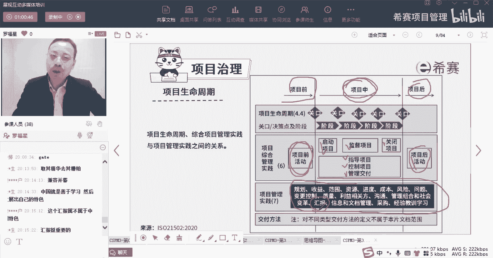

就是讲过金字塔原理，但要是有兴趣的可以去看一看金字塔原理啊，看了本书好，这是关于他的。

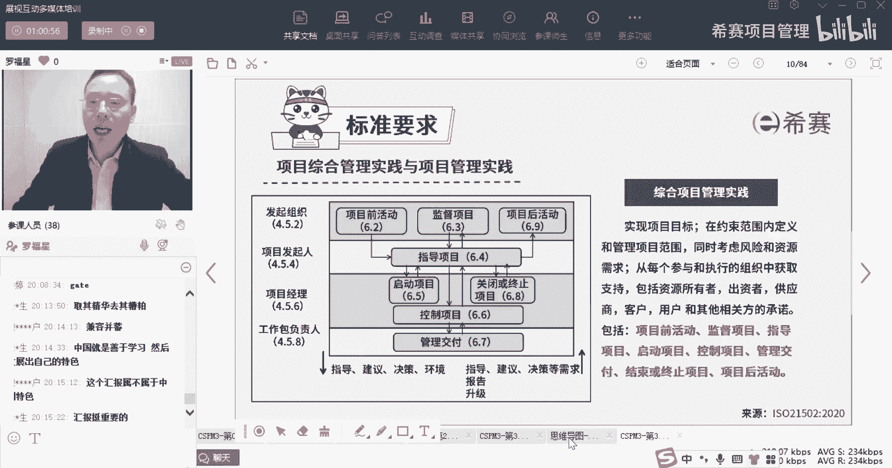

关于这个内容，关于这个生命周期，我们就稍微了解一下啊，他说可以划分为很多个不同的阶段，那节点哪里程碑，每个阶段之间会有一个gate，有这个一个一个checkpoint，一个决策点对吧，一个门啊。

他说这也是我们治理的一个重要的方面。

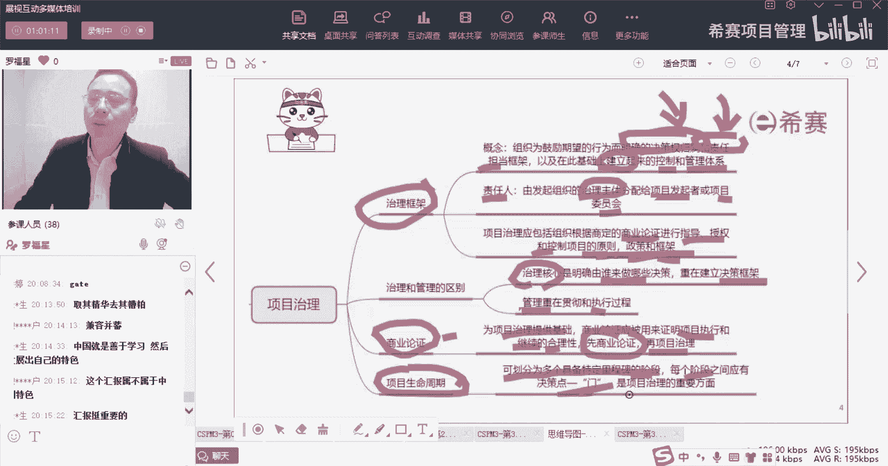