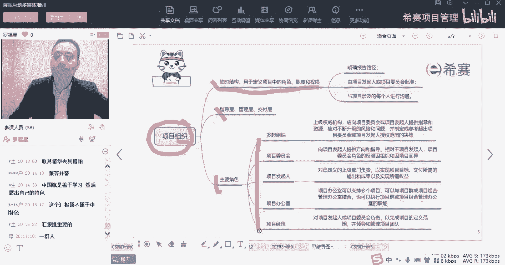
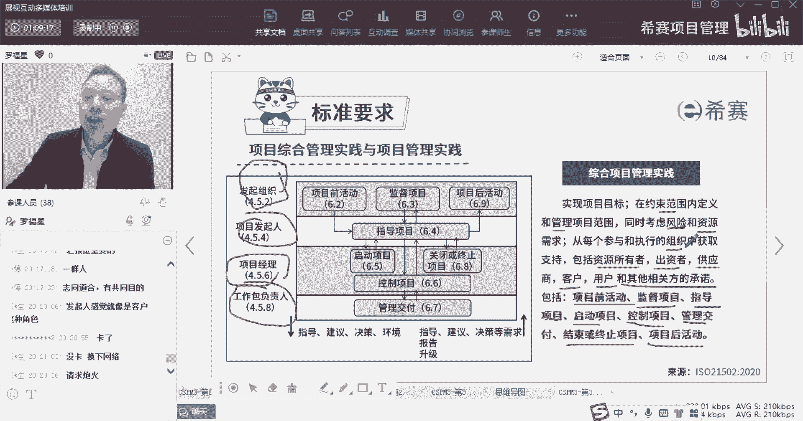
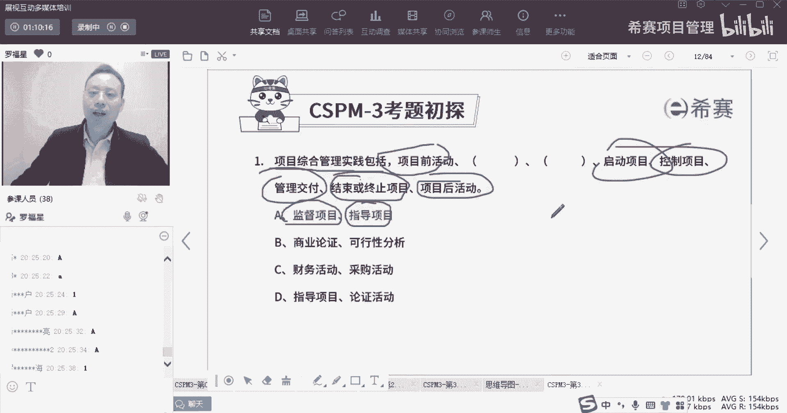

# 【收藏】CSPM-3中级项目管理认证考试直播课精讲视频合集（零基础入门系统教程）！ - P21：CSPM长空3-10标准要求项目综合管理实践与项目管理实践上 - 希赛项目管理 - BV16p42197SH

接下来我们一起看到一个新的内容，叫做项目的组织，首先什么是组织，organization组织，你可以把它简单粗暴的理解为一堆人在一起，达到某一种自运转的平衡，它就形成一个组织O就是一群人在一起。

他们之间可能有分工，有协作呀，有什么什么，你干什么，我干什么，他干什么，我管谁谁管谁，谁跟谁汇报等等这种东西，它就形成一个所谓的叫组织好，然后在组织里面会解释说组织它的那个，他的那个它的含义。

它的临时性的组织是什么，角色是什么，然后还有指导陈干什么，然后是主要主要角色，有哪一些我们会把这些角色展展来看一看啊。

好一起来看到，首先整个项目那个项目组织里面，他会讲的时候是我们在做项目的时候呢，有这些项目前的活动啊，这里面会会分到几个人啊，首先做项目的话，有一个叫发起组织，什么叫发起组织呢。

你可以理解为这是去发起这个项目的人，他其实是属于投资的这个角色，就是他有闲钱，公司有闲钱，我有闲钱，我愿意搞一些新的项目，我觉得搞新项目有，也许可以为我带来更多的价值和利益对吧。

那么这个他就去发起这个项目，就算是一个发起组织，然后呢他要干的事情是对于项目而言，是前期项目还没开始的时候，他要负责去管控这些叫项目前的活动，项目终于做完了以后，交付了以后。

最后那个项目后的活动也需要有人去管理，所以他来去负责这些事情，当然不是说他亲自做啊，而且他要去对这个东西的结果负责，他可以去指派人手，他给专门指派了一些运营团队去做，不是他亲自去做。

同时呢这里面中间还有一个叫监督项目，它这个监督是什么意思呢，它这个监督就有一点点，像我们在刚看到这个叫商业论证，业务论证或者项目论证里面，我们去确定这个项目是依然值得做的，如果发现你不合适了。

那就别做了，别做了，你你你你你你如果还可以继续砸钱砸钱砸钱，就这种方式哦，他他要去监督这个项目，看这个项目以前依依然是不是健康的，依然是不是合适的，依然是不是值得去往前的，诶，这是大佬能干的事情啊。

这是第一个角色叫发起组织，然后第二个第二个角色呢，那个组织名叫项目的发起人，发起人，他其实有一点点像是在发起组织底下的指派的，这个角色一个人，那他是负责干什么，他说是去指导项目啊。

我们在偏僻的课程中说的，发起人说的是给这个项目去提供资源和资金，对吧，同时呢我们还说，他其实也是项目经理背后的靠山，虽然在整个P的课程中，几乎从头到尾就没有几道题目说啊，项目处理。

项目经理出了问题就要去找发行，几乎没有这种选项，基本上我们都是这个选项是错的，但是因为那是偏僻的考试，偏僻考生确确实实，绝大部分事情都应该是你自己，项目经理搞定的对吧，那个题干也都是列的。

是说项目经理该搞定的事情，但是你要知道，在真实场景中，在真实生活中，很多时候项目经理也有很多无能为力的时候，也很多搞不定的时候，那这个时候呢你真的是需要去抱大腿，你真的是需要去抱大腿抱靠山。

OK那就是你去报一下你的这个项目，发行这个大腿，让他来给你提供支持和帮助对吧，那么这这这是这样的一个角色，再往下面呢还有一个角色呢叫项目经理，项目经理这个角色呢，他跟我们之前所学的项目经理。

也有一点点不相同，他说的是它其实重点是说对这个项目进行管理，这个角色，他说诶我们开始去启动这个项目，就是真正的开始去搞起来，搞起来搞起来对吧，去安排人手啊，去招兵买马呀，然后去开始搞工位啊。

开始收集需求啊，去搞事情，去把这东西给搞起来，然后还有一个叫控制项目，那他这个控制项目是跟那个监督项目，又有点不相同，这个这个老大们的这个发起组织，它的这个监督项目是干什么，是看这个项目还值不值得搞。

如果不值得搞了，我们就叫停了，如果值得搞，我继续往里面投钱对吧，而这个控制项呢，是我希望这个东西是在我的掌控之中的，进度是如期进行的，成本是如期在在我的成本之内去搞的，质量是达标的等等。

唉他搞的是这样一种控制的方式好，还有呢最后是这里又叫关闭，我们之前学过的项目，学学的内容里面说，项目经理没有资格去关闭对吧，项目经理没有资格去关闭，但是项目经理有资格干什么，有资格发起申请，发起请求。

他可以报告老板，我所有事情都做完了对吧，但我我所有东西都做完了以后，我可以报告老板，我们现在已经可以验收了，您看可以吗，我们定在下个礼拜三进行验收可以吗，类似这样一种方式，他说这也算是你的事情啊。

去关闭这个项目或终止这个项目，然后在底下还有一个角色呢，叫项目工作包的负责人，那就工作包的负责人诶，这是我们之前没有怎么去讲过对吧，那这个他讲的是说这个人负责干什么，他有点类似于说小组长啊。

或者每一个每一个具体的干活的，这个小小小伙伴呢，他们呢负责去交付，就他是真正的去做事情，真正的去执行，真正的去落实，对这个角色叫负责交付的这样一个角色，那么这几个角色呢，他们之间的关系是什么关系呢。

你看到这里有两个箭头，一个箭头是向从上往下的，从上往下的箭头是上级，可以可以给下级提供指导，提供建议，做决策，以及它会是作为它的环境会影响到他，所以他会给他提供指导和建议，他会给他提供指导建议决策。

他会给他提供指导建议决策是这样的一回事，好这里还有个向上的箭头，那么向上的箭头就表示说我们自下向的方式，你可以去，他说是你可以提一种需求，你说请求支援，请求支持，请求指导，请求建议，请求决策，请求指导。

请求什么什么哎，这种方式他说是指导建议决策的请求，而我需要这个东西，我需求好，这是一个，第二就是你报告报告老板这个东西做的非常好，报告老板这个东西做的很不错啊，报告老板这个事情有点超出了一个啦。

要要要怎么怎么样对吧，报告还有一个是升级，升级一般来讲更多的是问题的升级问题升级啊，就说这个事情唉呀有我搞不定啊，什么啊，升级，然后你就去搞定对吧好，还有你这个层面你也可能有些搞不定的事情。

你搞不定的事情，你就啊找大腿抱大腿对吧，我们说有事抱大腿啊，提前拜码头就是这么一回事，那你就去找他去问题升级的方式，OK就是但凡超出你的权限，超出你能力的这东西，你都是可以去有机会往上面去升级的啊。

这是我们简单的来认识了一下，关于项目综合管理实践的这一个内容，我们也把这把这段文字来认真的看一遍啊，来读一下综合项目管理实践，他说要实现项目的目标，在约束的范围之内来去，还有管理项目的范围。

同时要考虑到风险资源的需求，然后从每一个参与和执行组织中获得支持，所以就会跟这个组织有关系，包括资源所有者，出资者唉，这是发情，就是一个出资者，然后供应商提供需求啊，它有点像是有点像客户。

有点像是客户的那种感觉对吧，然后还有供应商，那么项目经理就是供应商，或者是那个底下的斯坦的供应商啊，然后呢客户啊，用户啊等等一些，它里面包含了项目前的活动，监督的活动指导的活动。

然后启动项目控制项目交付项目，然后终结束或终止项目项目后活动啊，讲了讲了这么一句好，讲了这么一些以后呢，我就我就把这张图就专门放在这里，后面我们每一段都是基于这个来展开讲。

每一段都是展开讲，先来选个题目，大家看一下这个选什么，哇你们都这么优秀的吗，可以呀，可以可以可以可以，居然都记住了，太牛了，他说中项目综合管理实践呢包括了很多，包括了项目前的活动。

然后呢接下来是有监督的活动，然后呢是指导的活动，然后启动控制管理，交付结束或终止，还有项目后活动啊。

这是项目综合管理的这些内容。