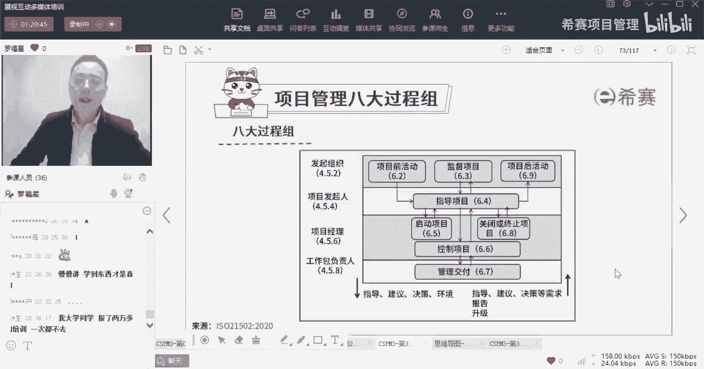
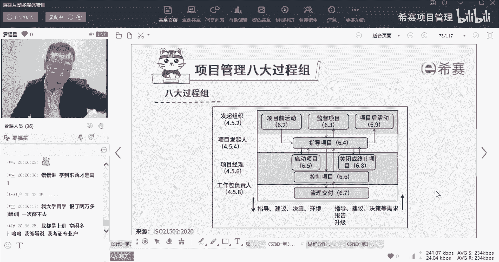
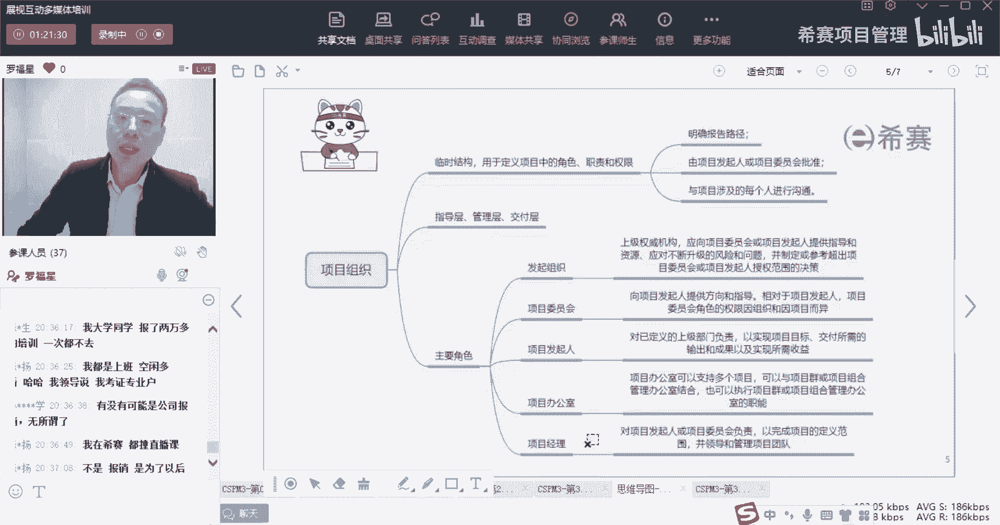
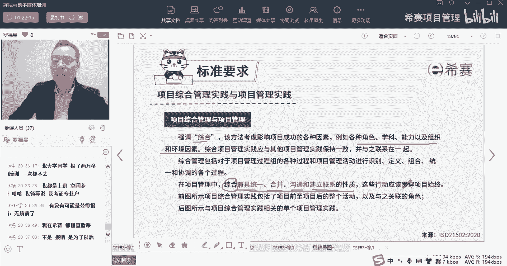
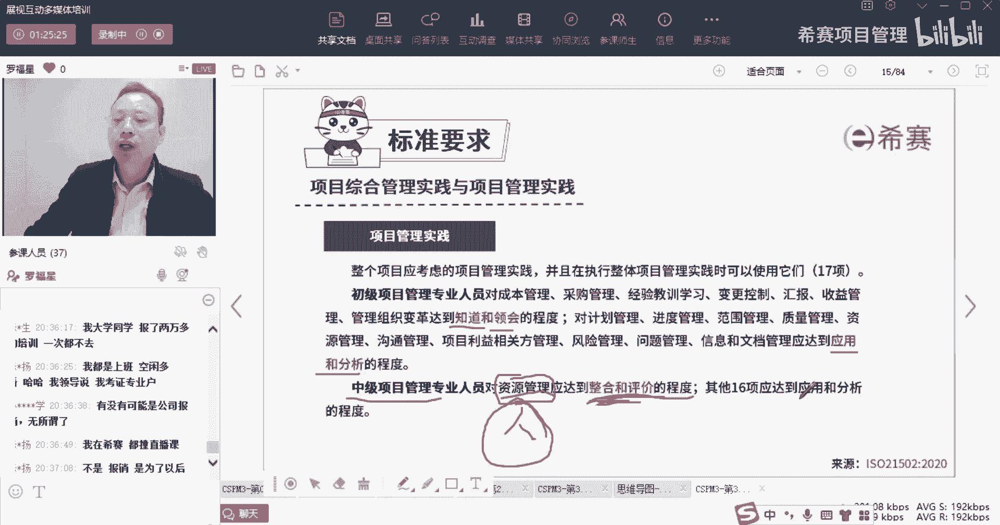

# 【收藏】CSPM-3中级项目管理认证考试直播课精讲视频合集（零基础入门系统教程）！ - P22：CSPM长空3-11标准要求项目综合管理实践与项目管理实践下 - 希赛项目管理 - BV16p42197SH

大家晚上好，欢迎来到西塞网专业的职业教育平台，我是罗福兴，那今天我们继续来分享的是CSPM的第三章，叫关于项目经理角色的定位。

以及项目受控环境的这个这个管理，哈哈对我相信他是有这种可能性的啊，你们说的这个是的有这种可能性呃，但是事实上呢很多公司，但是很多公司它都是什么情况呢，只要你没有通过就不报销，你通过了才报销。

关键是这种情况大家还不努力。

就不知道，我想不明白了好，那接下来我们一起来继续，看到的是关于项目的组织，那项目组织中我们刚刚做了一个简单的介绍吧，刚刚做了一个简单的介绍。

那整个项目组织，项目项目组织第一个板块是说项目的综合管理，项目综合管理中他说强调是一个综合，他说影响成功的放映时有很多什么角色呀，学科呀，能力啊，环境啊等等，那我们在整个项目中呢。

要做一种叫做兼具统一合并，沟通和建立联系的性质，OK它的综合是间距统一，但这个综合呢也把它翻译成叫整合啊，不管是综合整合，就是要去统一协调，达成达成一致的这种方式，这是整合，然后这种形式还是要贯穿始终。

从开始到结束啊，这是整合管理，而整个在项目项目，项目综合管理和项目管理实践中，除了有项目综合管理的这几个项目前活动呢，然后指导与管理项目工就是项目监督项目呀，然后指导管理项目工作呀，启动项目啊。

控制项目交付，然后关闭，然后到项目的后活动，除了这六个呃，不是六个啊，1234应该是八个，除了这八个错了，应该是八个，除了这八个项目管理综合实践以外呢，它同时还列了有17个项目管理实践。

那么这17个就是从规划规划管理，项目规划的管理，项目收益的管理，项目范围管理，资源的管理，进度的管理，成本风险的管理，问题的管理，变更控制的管理，质量的管理，干系人的管理，沟通的管理。

社会和组织变革的管理，报告的管理，信息的管理，采购的管理，我们后面的章节呢会从这17个里面挑了，是六七个。

跳六七个来展开讲好，我们先稍微了解一下啊，接下来就是说这个项目管理中，它就是这里把名字念了一遍吧，就是什么，他说呃整个项目项目管理实践中，对于初级项目管理专业人员，他说对于成本啊，采购呀，经验教训啊。

收益管理啊等等，这些东西都需要达到一种叫智慧知道和领会，而对于计划进度范围，质量资源沟通，利益相关方风险，这些东西达到一种应用和分析的程度，但是还好这个东西没怎么考试，这个考了叫对于资源管理。

要达到一种综合和评价的程度，OK他说的是中级项目管理专业人员，他对于资源管理达到一种叫综合和评价，就是综合应用并评价的这种程度，然后对于其他的16项呢，达到一种应用和分析的程度。

所以这一句为什么要把那个圈出来，就是要告诉你哦，原来对于一个知识的认识和了解，有一种是我知道我领会了，我知道了，其实也就是我学过我知道了的意思，然后到后面一个到下一个成就是能够去应用它。

能够去分析和使用它的这个程度，再到后面跟他说是能够整合并评价，其实也就是说你对他有认识的更加的深入，你能够去做一些取舍啊，裁剪啊，整合处理，同时考试中曾经考过一道题目，就是说在中级也就是CSPM3级。

中级CSPM3级里面，他对于这些个人员的管理中，哪一个达到综合评价的程度呢，是资源管理啊，你一定要记得是资源管理，它对于资源管理其实也就是对于人的管理，对不对，我们说资源包含人和物。

那么物这一块呢其实没有什么特别好说的，因为因为这个物的话反正也就那么点东西，但是人就不一样了，人他就是嗯有很多值得你去学习和探讨的，并且我们说这个人是什么人呢，是团队，是团队的人，因为除了有团队人以外。

还有一些干系人对吧，还有一些其他的其他相关方干系人，那么关于这人的板块来说，要达到一个更高的一个程度，到了整合和评价的程度。

