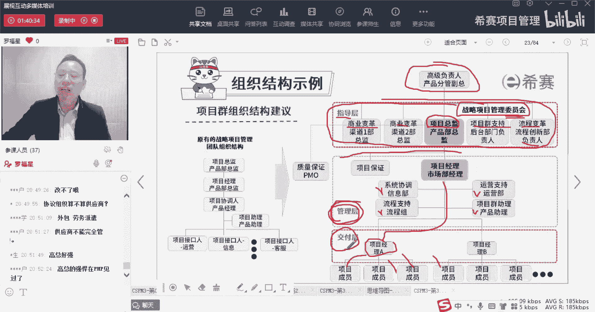
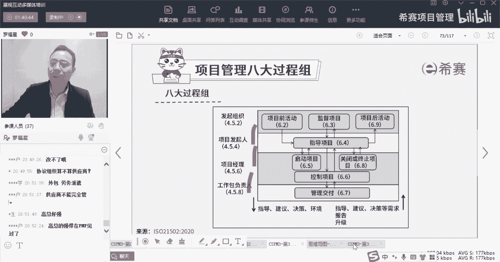
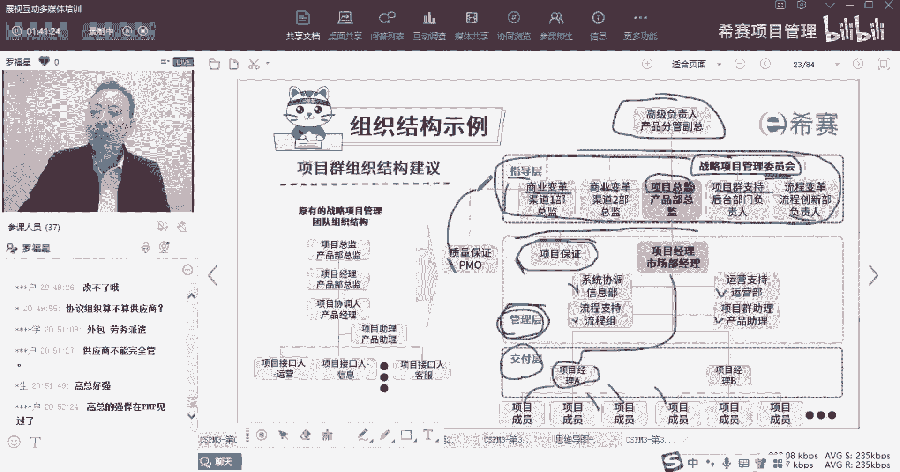

# 【收藏】CSPM-3中级项目管理认证考试直播课精讲视频合集（零基础入门系统教程）！ - P24：CSPM长空3-13组织结构示例 - 希赛项目管理 - BV16p42197SH

那接下来我们就来看一下，这里有一个很有意思的一个组织结构图，这个组织结构图呢，通常情况下我们会把组织呢分到很多层级，然后同时在做项目的时候呢，也会有很多的部门，那么很多部门中经常会有习惯的。

有一个说每一个部门有一个叫接口人，接口人，interface接口人，他说这种接口人，其实我相信很多单位都有这种习惯，因为我自己后来回想一下，我自己曾经做项目的时候，我们也会这样去描述描述谁是接口人。

谁是接口人，也会有这种描述，但是这个接口里面有一个词也很有意思，叫什么，就是呃他说如果说这个张三，他只是作为一个接口人的话，他不复的去拍板做决定啊，或者不复得怎么怎么样的话呢，他就有可能会说是啊。

这个事情我我我把它记下来，我去问我的领导啊，把领导的事情，然后下一次再传递给你，这种方式，他不对任何一个事情负责任，他只是一个传声筒的这种方式来做事情，他这种其实是不好的，那如果真的是。

如果这个接口人他真的是不去负责，而只是去做一个传声筒肯定是不行的，所以呢建议是换一种新的形式，换成什么形式呢，就是你每一个层级都会有这样对应的，一个责任人，那个才那个参与拍板做决定的也是一个责任人。

如果说我们是一个小型的项目的话呢，那么这里肯定会有一个项目经理，这里会有一个小组长啊，这里有个小组长，有小组长，有小组长，每个小组长都是负责，去对某一个事情是负责的人，而不仅仅只是一个联络员呢。

交流者呀，那如果说这是一个大的项目呢，是一个很大的一个很复杂的项目呢，那这个很大的很复杂的项目，我们底下就可以再拆分成若干的项目经理，都是可以的，那么这里面他就是把这个人，也是分到这几个层级。

我们稍微看一下啊，首先上面有个叫高级负责人，产品的分管副总，某个产品的分管副总，他作为一个高级的负责人，他来去作为一个相当于是一个发起组织，然后接下来会有一个叫指导陈指导层，他这里就是有一个叫产品总监。

这个产品总监是一个发行，它是由产品部的总监来去担任这个产品总监，除了产品总监作为这个项目的一个发起人，来去给项目提供指导1万，同时还是别的角色也会提供支持，你看还有什么商业变革渠道的总监。

然后商业变革渠道的总监，然后说项目群支持部门的这一个负责人，流程变革部门的这一些创新的负责人，这些人他也都会对整个项目来提供支持，并且他们还会合伙成立一个叫做，战略项目管理委员会，一般来讲。

只要说到委员会委员会这个词，你一定要记得，就一定是属于领导们来去聚集的，是那种代表啊，领导们的代表，那么这几个角色呢都是领导们，他们在一起，他们是给这个项目提供支持和帮助，提供一个叫指导的角色。

再往下面就到了一个项目经理，项目经理是负责去，他给了一个词叫管理啊，或者去管理，去落实去去，他或者去管理，就把这个事情分配给张三李四王五赵六对吧，把事情分配下去，然后呢大概就是分头去做事情。

他是负责去做管理，管理时会用到一些什么信息协调哎，信息部来负责信息协调，流程组来负责制作流程的支持，运营部门负责运营的支持，还有产品助理做一些什么群众的管理，然后再往下面到了一个交付城。

就是具体的小组长也好，或者具体的项目经理交付的经理也好，他们会继分管具体事情，他带着3304王五交流，他们去做事情，去交付，那整个这样一个环节。

其实跟我们在前面看到这个呃，这款诶不是这张图是呃，类似这样类似这个意思啊，就还开始有另外一张图就很相似，对不对。

其实就很相似，那么你知道这个意思，其实我们很多时候都是需要有对应的，这个角色和职责，他需要能够去赋予对应的权限来做某一些事情，当然其实除了这东西以外，还有一些别的一些角色来去做一些辅助。

像这里给了一个叫什么项目项目保证人员，他把这个项目保证就没有放到下面的一个成绩，他把它放到下面这个成绩，而这里还有个叫质量保证，他就把它放到上面这个成绩，就每一个公司你可能犯的方式，我们说治理结构啊。

组织结构啊，都可以根据各种情况，根据你公司的这些情形可以略有不同，大方向是一致的，可以略有不同，这个关系不是很大。

