# 【收藏】CSPM-3中级项目管理认证考试直播课精讲视频合集（零基础入门系统教程）！ - P26：CSPM长空3-15项目组织中的角色下 - 希赛项目管理 - BV16p42197SH

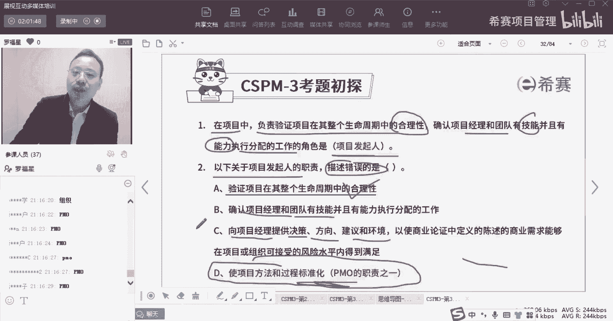

他后面还有就是发行人还要干什么事情呢，除了干这些东西以外，还有一个叫解决升级的问题和风险诶。

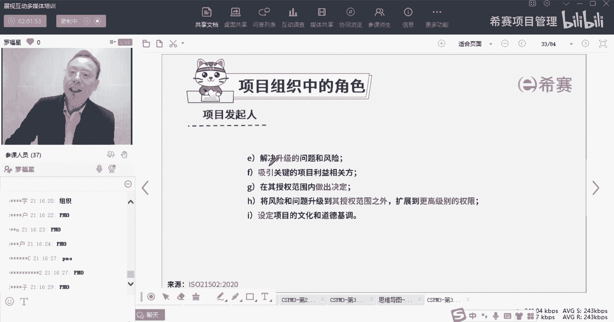

你会好奇，你说前面我们咱们咱们不是看过，说是那个发起组织，要去解决升级的问题和风险吗，怎么为什么到了这里那个项目发钱，他又要去解决这些问题和风险呢，其实是这个意思，就是你这边升级的问题和风险。

那我就归项目发起人来去解决，而如果是项目发起你都搞不定的，你再往上面升起的时候，你才是由发起组织来去解决，所以兄弟们是一层一层往上报的啊，一层一层往上报。

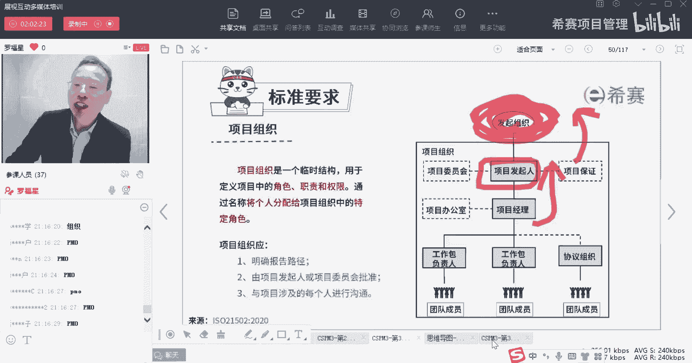

所以是这一条，所以解决升级的问题和风险，是解决项目经理这一个成品，再往上报的这个问题和风险好，第二个吸引关键的项目利益相关方，这个词呢倒是很怪异，我都没想到为什么他会有这样一个信息。

就是作为一个发起人去吸引观众的利益相关方，这个不知道不感觉感觉像是pm的事情，不知道为什么会有这一条啊，好这一条在其授权范围内进行决策，这句话永远都不会错。

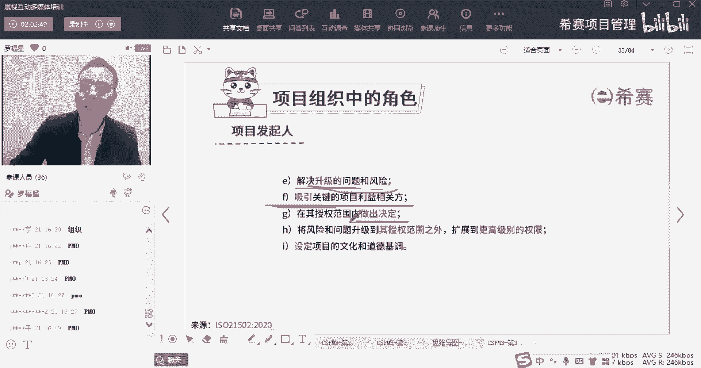

因为发起组织会给项目发起人，来去提供一些权利，你在你的权利之内，你来去做决策，你是给谁做决策呀，您是给项目经理做决策对吧，你告诉项目经理要这样要干什么，干什么，听我的对吧，这是你的决策唉。

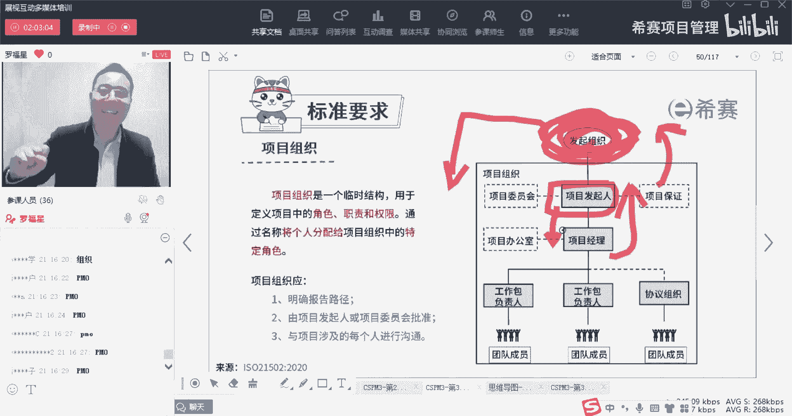

所以这句没毛病啊，就是你要去做决策，在你的范围之内做决策。

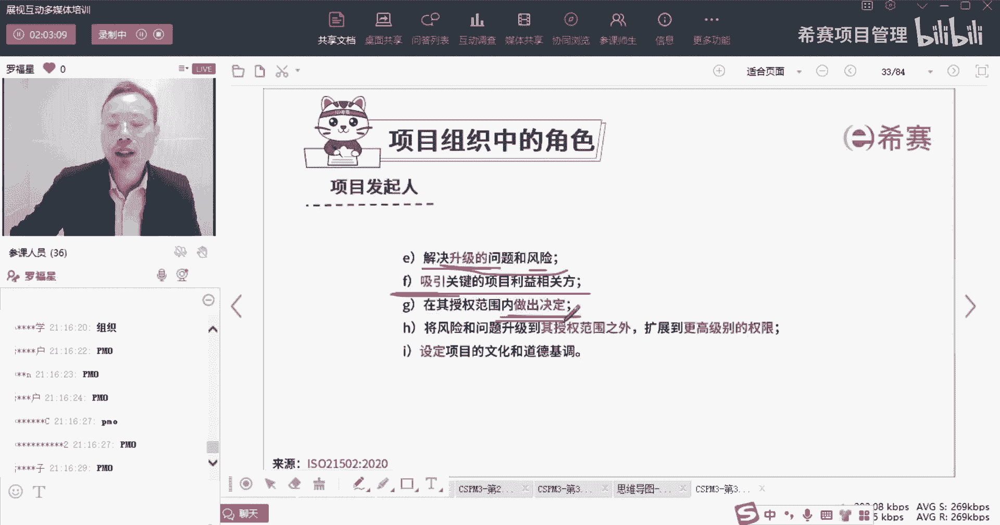

超出你范围的决策怎么办，超出你这个发行的角色的东西，你就再往上面报报给你的发起组织好。

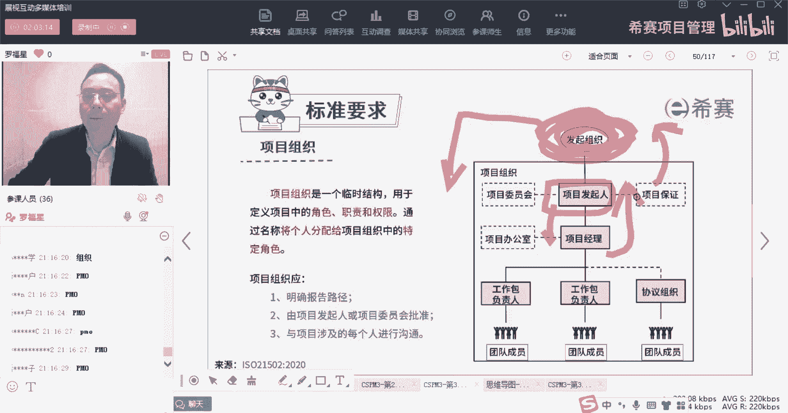

再往下面一条，说是将问题和风险升级到授权之外的，扩展到更高级别的权限，什么意思呢，就是也可以告诉你说。

如果某些事情你搞不定的话，搞不定不要慌，你搞不定的话，你就像你的老大去求助，我给你这个机会啊，也给你也给你这个这个这个这个这个权限，让你说如果你有搞不定的事情，你就可以来敲我的门啊，你就你如果搞不定。

你就来敲老大的门是可以的，这就是DH这一条。

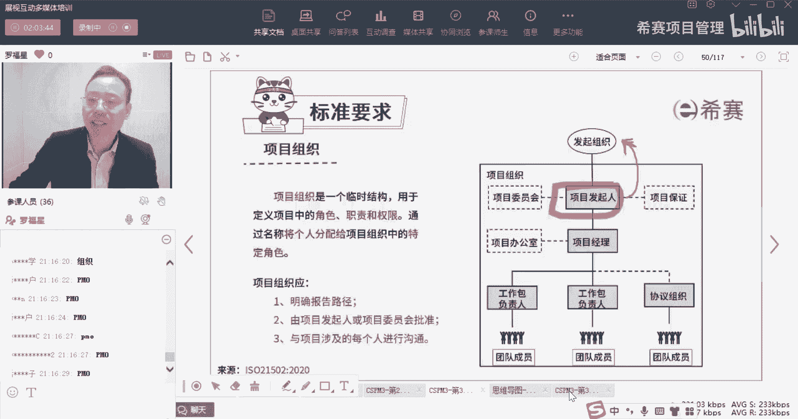

说将风问题问题和风险升级到其授权范围之外，可以往上面升级扩展到更高级别的权限好，还有一个说是设定项目的文化和道德基调，这个社会设定项目的文化和道德基调，它不就是给这个项目来去做治理吗。

他就给这个项目来去提供一些治理相关的事情。

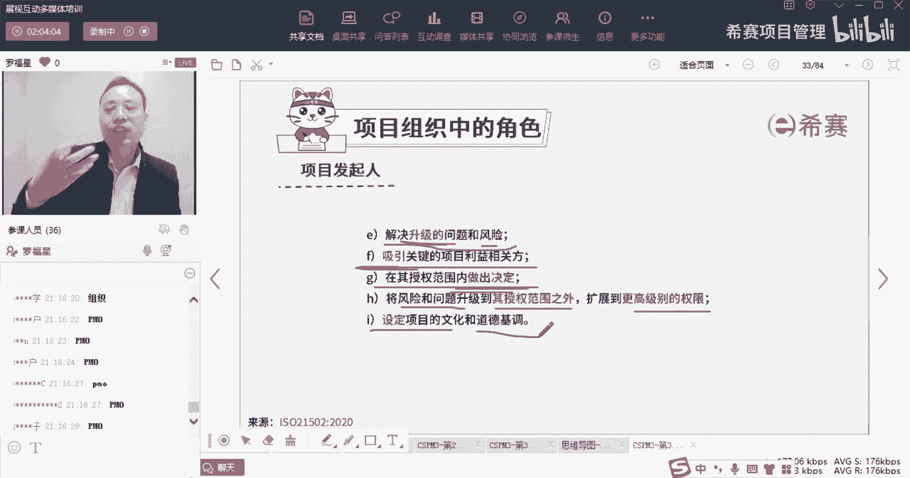

对不对，就是这个发起人的这个角色，接下来呢再有一个叫项目管理办公室啊。

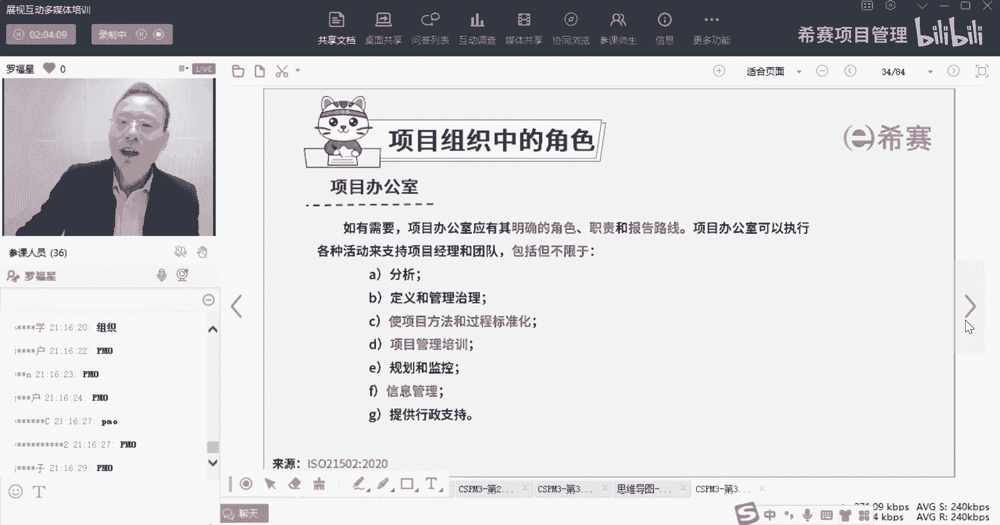

项目办公室，那么这个项目项目办公室呢，它其实会是嗯，其实更多的是像一个叫项目管理办公室，这个角色啊，他是给项目经理来提供支持。

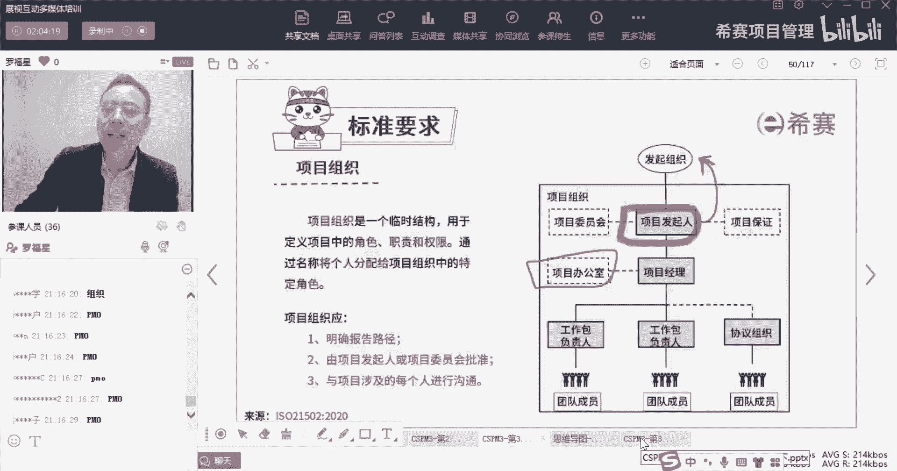

你看他是如有需要，项目办公室应该有明确的角色，职责和报告的路线，项目办公室可以执行各种活动，来去支持项目经理和团队，他要干什么，有这一条，你看兄弟们是项目方法和过程标准化，也就是我们做项目的时候。

你不能乱套，你不能随意，你得要有规则，1234的这种方式，你都按照我的标准和规范来进行，用我的模板的这个思路对吧，所以他是会把这个项目来就是标准化的，这个还有包括什么，他说去分析啊，定义一些呃。

分析定义和管理治理，其实呢一般治理是领导们来干的事情。

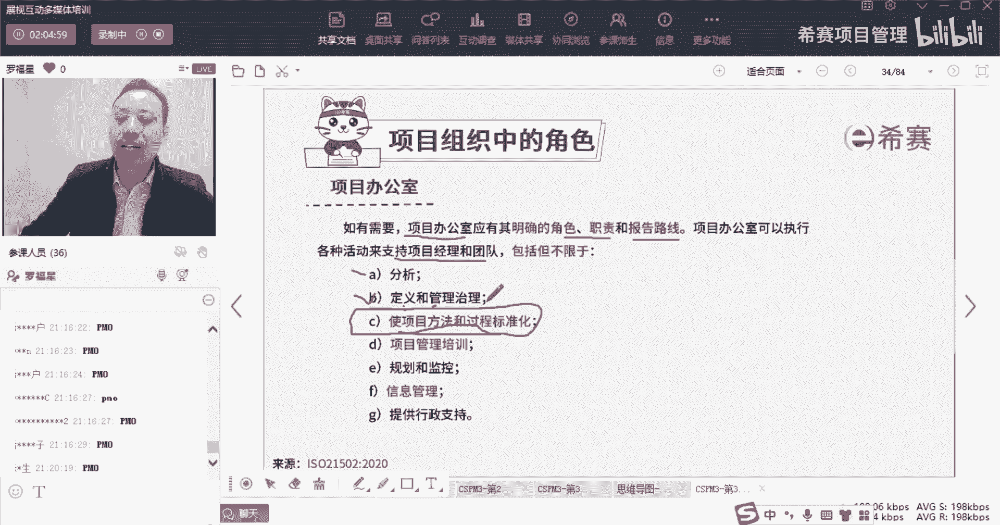

就治理应该是他的上级是委员会呀，发行他们来定好的治理，但是你项目项目管理办公室，它是在一定程度上，也可以在管理这个维度上来去做治理。

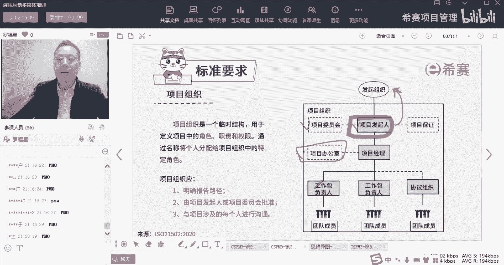

就给做一个管理标准，做了一些治理，还有就是给项目经理提供培训啊，支持啊，辅导啊，督导啊，监督对吧，这也是我们之前学过的，所以是啊有项目管理的培训，有规划，有监督以及管理信息。

这个信息管理它其实是一个什么点呢，信息管理就是你们所有项目，仅你们你们每一个项目的进行情况。

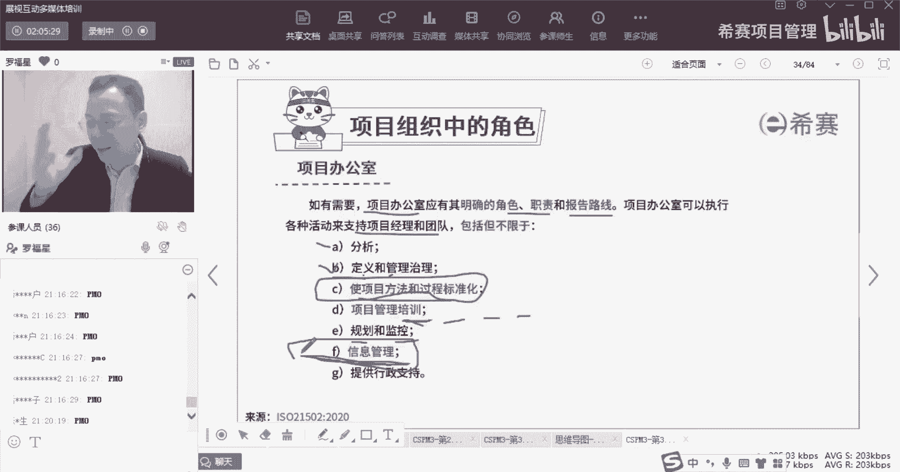

你都要跟我来汇报，就是有项目管理办公室，所有信息都要汇总到这里来，其实是要汇报到这里来的啊。

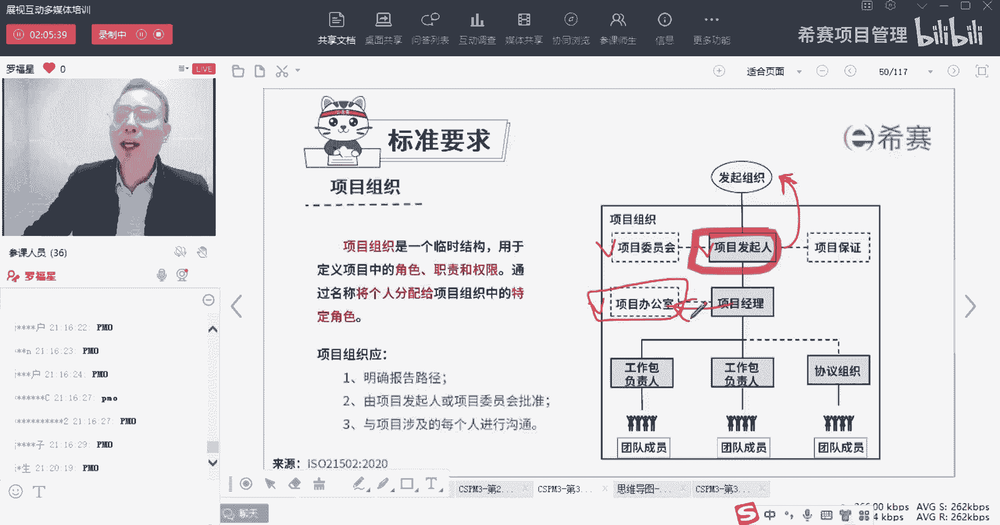

他要去管所有的项目上的事情，后面还有呢就是给项目来提供各种支持，提供的是行政支持，这是项目管理办公室，同时这个项目办公室呢也会也会有很多叫法，它可能会叫项目办公室啊，项目管理办公室啊，项目支持办公室啊。

有一些不同叫法，但是他反正只要是干类似的事情都可以，它不一定叫PO，它可能会叫一些别的一些名字，一些奇奇怪怪的名字，因为总有一些人总想要搞一些新的东西啊。

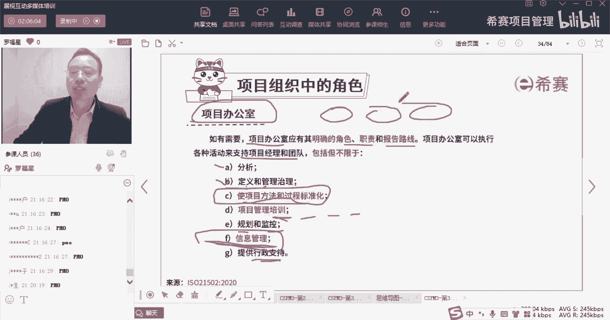

好就是这个角色好，来看一下题目，好小肿肖总是叫什么名字，我都不记得了，名字太多，第一个给出了答案啊，还有西餐用户，还有北总，还有一同学张总，那么你们给的答案都是正确的。

首先第一个要恭喜你们都给正确的答案了，他说以下哪一项，它不属于项目管理办公室，来执行支持项目经理和团队的活动，雷翔不属于他支持的选项，就说是进行项目管理培训对吧，这是给项目经理提供支持。

第二个是是项目方法和过程标准化，这也是他要去给整个公司来提供一些支持，第三个是信息管理，而我们所有的东西都要汇总到这里来，那么最后一个是什么意思，最后一个是谁的，请注意，最后一个是谁呢，虽然你还没有学。

但是我相信你应该可以蒙的出来，你蒙一蒙，最后一个是谁的呃，请注意哦，他是团队激励，团队激励对pm啊，是项目经理的兄弟们，兄弟们，这是项目经理的事情，就是你要去激，就是你作为项目经理，你要去带领团队。

你要去激励团队，所以一般就是项目经理这个角色，项目经理这个角色来去激励项目团队，然后做团队的文化建设，做工做做这个项目组的文化建设，是这个意思啊，所以最后一个选项是项目经理的，它不属于他。

不属于那个POPO是要进行项目管理培训的啊，项目方法和过程的标准化呀，然后什么什么信息信息管理呀。

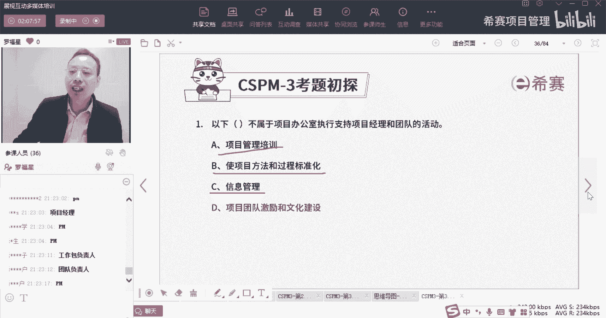

看这些东西好，我们再来往下面项目管理办公室，他说是除此以外呢，项目办公室可以去支持多个项目，可以与项目群和项目组合的办公室，来去进行结合，也可以去进行项目群或项目组合管理，办公室的这些职能工作。

他说是支持除了项目经理以外的，一些其他决策职责也是可以的，可以去支持发起人呢，可以去支持呃。

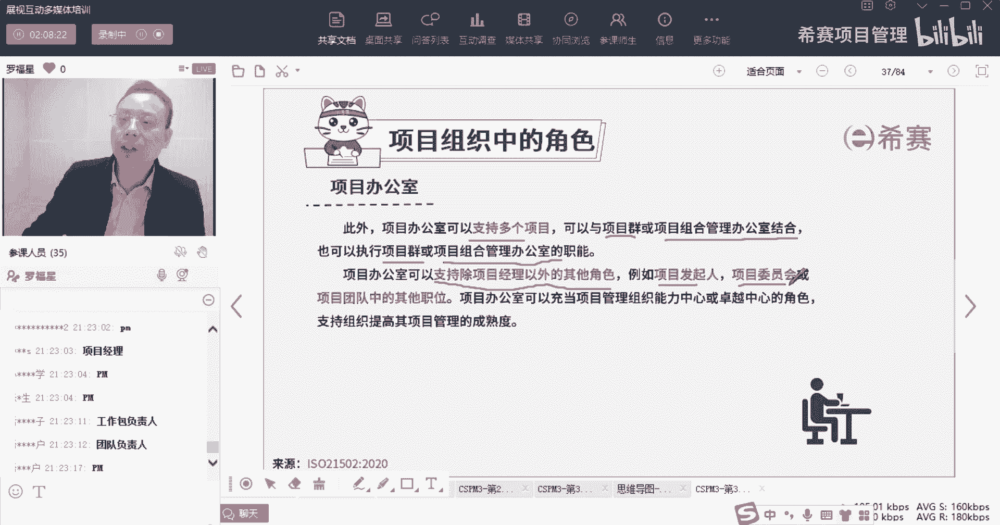

委员会呀，可以去支持团队中的某些其他的一些职位呀，其实也就是说，你是可以除了给项目经理来提供支持，你也可以跟给他提供支持，给他提供支持，给他提供支持也是可以的，你的这个知识又不局限于。

只有那个项目经理这一个角色。

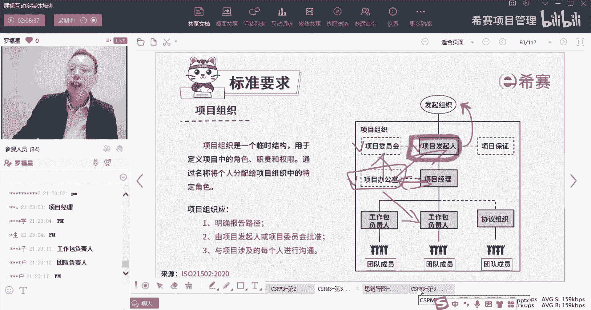

给的是这个意思啊，他说你会成为一个项目管理组织人，组织的能力，组织能力，振兴农能力中心和卓越中心的这个角色，其实也就是帮大家去提供各种支持了，从而能够让整个这个东西能够蒸蒸日上，能够红红火火啊。

这是项目管理办公室，接下来这个角色叫项目经理哦，这就是你们比较熟的了，说项目经理是对谁负责呢，项目经理对发起人或者说是项目委员会来负责。

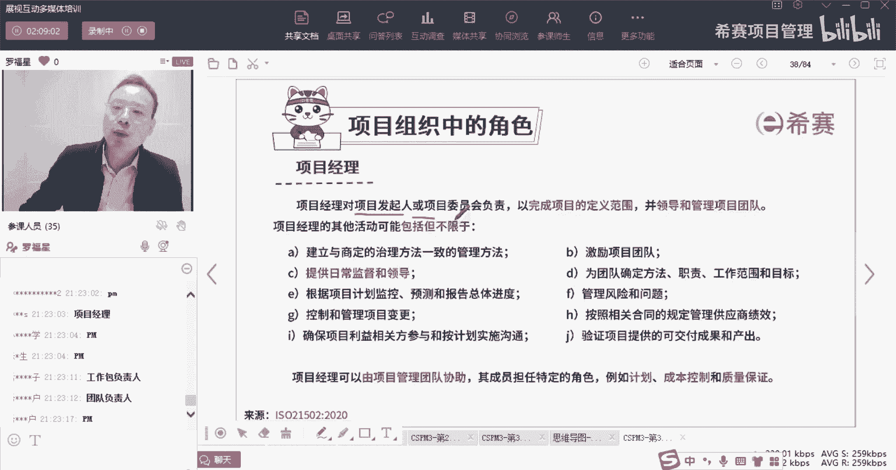

我们重新看这张图，项目经理，项目经理你是要对你的领导，对发起人来负责，因为他来去任命你作为项目经理，对不对，发行了去授权你作为项目经理，项目发行，他来去给你做这个什么什么项目治理好。

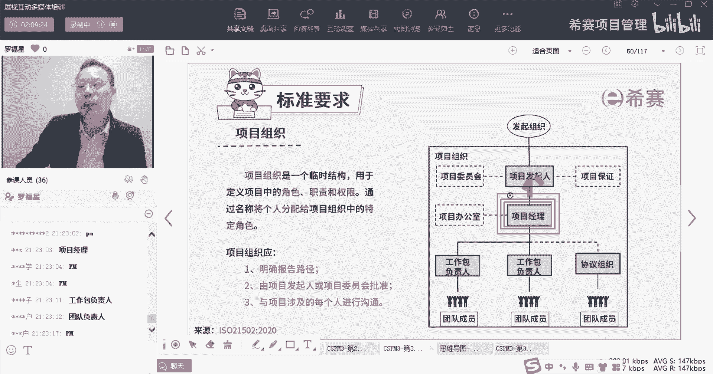

你对这个项目发行负责，对项目委员会来负责啊，这是第一句话，并且呢你要干什么呢，领导委派你去做项目经理去管这个项目，所以你要去管这个项目，你要完成这个项目，所以要完成这个项目的范围。

OK并且呢要去领导团队，要管理团队。

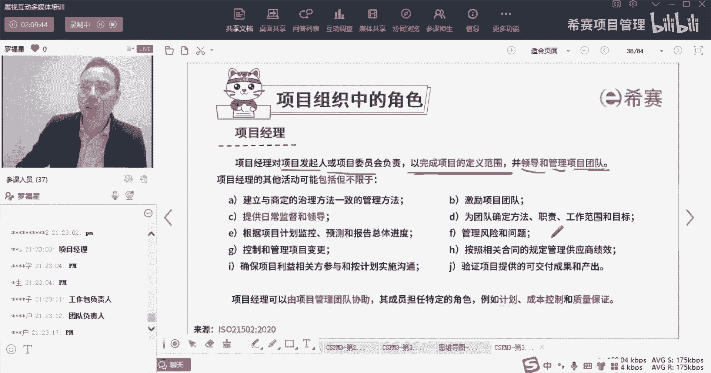

所以是兄弟们，这些都是兄弟们，归谁管，归你管。

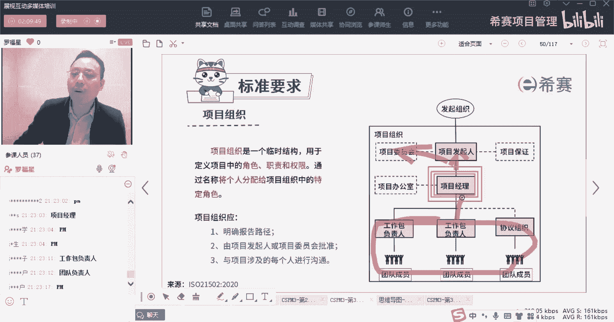

归你管，归你这个项目经理管，那项目经理呢可能会存在的活动有很多，比方说他说建立与商定一些治理方法，一致的管理方法，什么意思，公司已经有了一套治理规则以后，那么对应的治理规则。

我们在这个对应的治理规则之下，来去开展什么事情，什么什么什么什么事情，这个时候呢是项目经理，你是可以去参与做的好，第二个是激励团队诶，兄弟们有没有发现刚好就是这一句对吧。

就上一道题目中有一句话叫激励项目团队好，这里刚好就有一个叫激励激励项目团队对吧好，第三个呢就是提供日常的监督和领导，所以项目经理他在干什么，他是管理这个项目，兄弟们，他是管理这个项目啊。

所以他要提供日常的这种管理的角色啊，以及为团队来去确定一些方法呀，职责呀范围，所以你的领导给你提供支持。

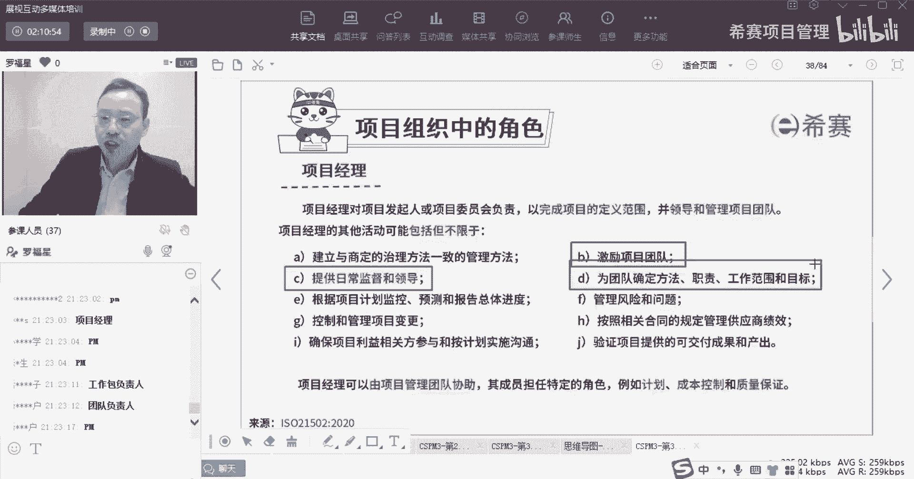

你要给团队提供支持，你要去你要去给你的兄弟们，你要给底下兄弟们给团队来去提供知识对吧。

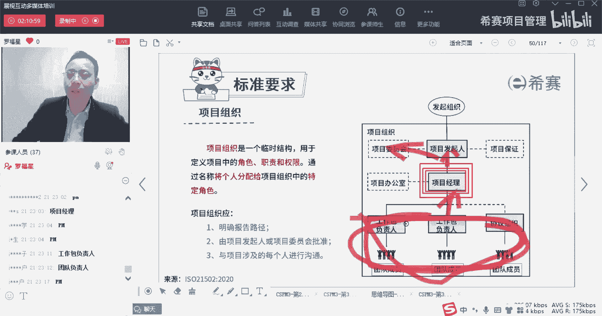

提供各种方法职能，下一个就是根据项目计划来去监督项目预测，还有报告下面的一种进展情况，管理它的风险和问题，然后去控制进度，然后控制变更，然后以及是关于合同的供应商的管理，供应商绩效的管理。

这个这个地方这H这一条呢你要知道一下，他就摇身一变变成什么，变成甲方爸爸了，摇身一变变成甲方的项目经理啊，就是如果说你们的游戏东西，要要让别人帮你搞定的时候，那你就变成甲方爸爸对吧。

你变成甲方爸爸的时候，你要管理这种合同，你要管理供应商的一些事情，最后这一条他要确保项目的那个利益相关方，与项目的计划能够去实时沟通，其实也就是我们要去做相关方的管理，关于相关方管理呢。

有一个词我我相信你可能有有一些同学还记得，有一些同学可能当时讲课的时候，可能那时候没有用这个词叫争取，我们说相关方管理，我们给的意思叫争取争取相关方案，谁帮我把这个字敲一下，争取两个字。

你是要想尽办法去争取到相关方啊，就是他是你希望他支持这个项目，他目前是反对的，你要把他争取过来，你目前它目前是平平平平无奇，你希望他是支持这个项目的，你要把它给争取过来，OK你换一个词叫策反的意思。

有有点那个意思，策反的意思啊，他如果现在只是只是属于支持，你希望他是引领这个事情，那你还想办法争取过来，所以相关方管理是去争取相关方啊，那我们用的一个方式，那个相关方管理计划呀，或者相关方参与计划呀。

其实是一种策略，一种策略和手段，想尽办法用这种策略和手段来去把它给搞过来，那他不只是公关一下，你要想尽各种手段和方式让他来支持你，让他去支持这个项目，你你总有一些办法啊。

对你们可以用你们所所熟练的这些什么商务，KTV的什么办法呀，什么一条龙啊之类的去搞定，也不是不可以啊，反正你只要有办法可以搞定就可以了，你总有你的办法对吧，有些不好意思说好。

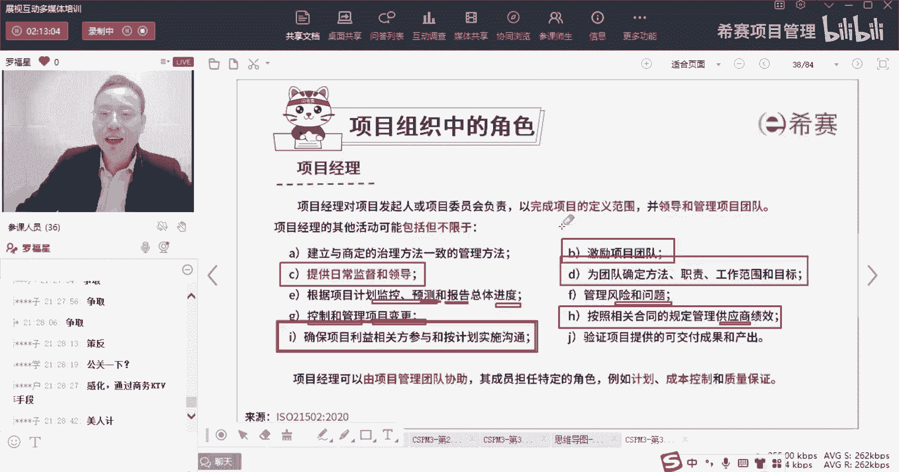

然后呢再往下面还有一条，他说是验证项目提供的这些可交付成果的产出，也就是谁来提供呀，我们在这里面看到的事。

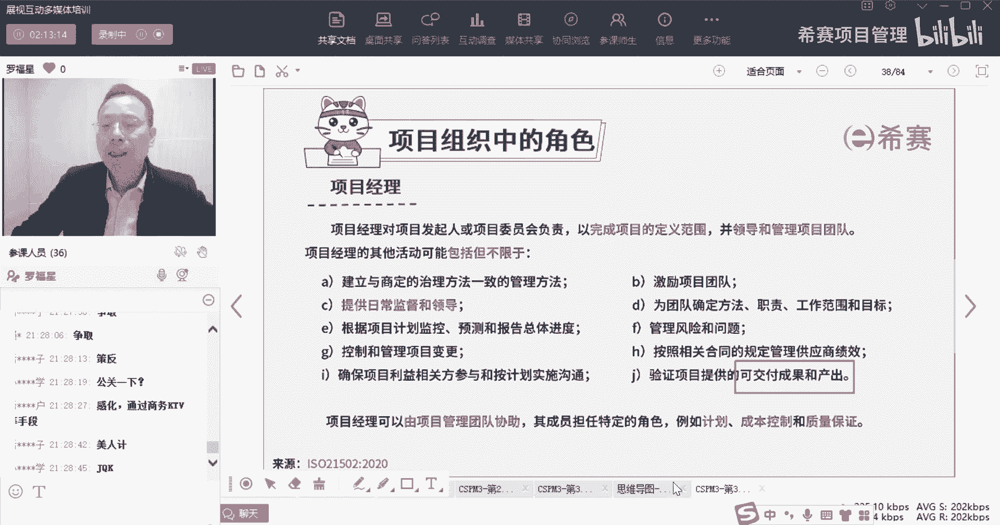

是有那个工作包的负责人来去提供对吧，那么这些工作包的负责人，也就是说你的兄弟们啊，你的项目团队兄弟们，你的项目团队兄弟们交付的这东西好不好，O不OK合不合适，你作为一个项目经理。

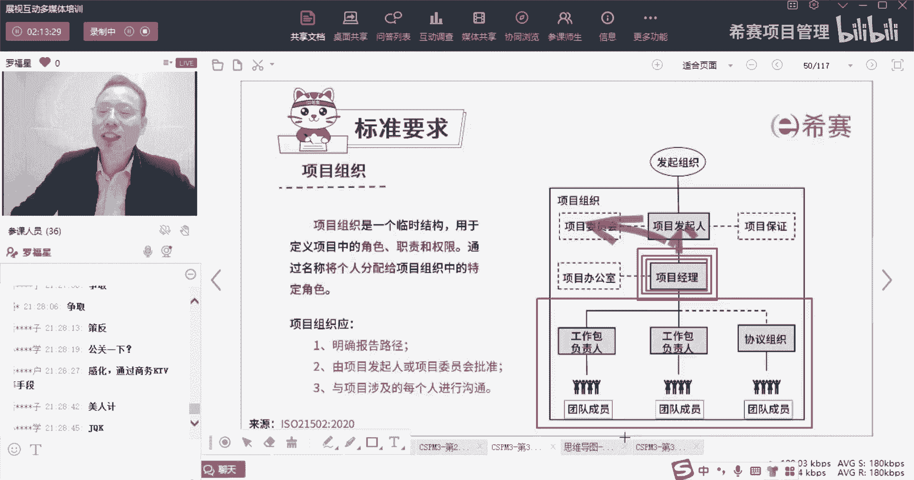

你是需要去验证的，OK所以是这样一个情况，所以项目经理他其实有点相当于什么呢。

就是我们去安排这些工作内容，然后去指导这个工作内容，去监督这些工作内容，然后去验收也不叫验收啊，就是去确保这些工作内容都是OK的，但是如果底下其实没有那么多人的话，你就带着兄弟们去做事情了。

就直接带着兄弟们去做事情。

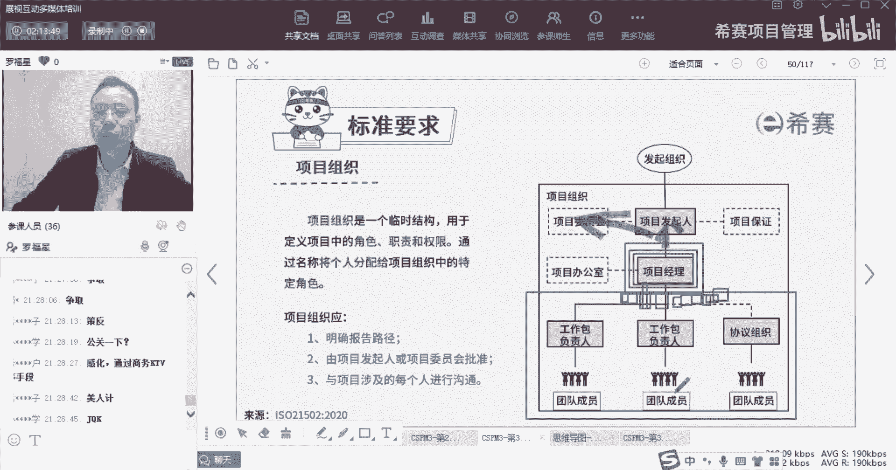

是这样建立一个情况，项目经理他说可以由团队来，项目经理可以由由项目管理团队来去协助，也就是说有可能有一些公司他的那个这个项目，如果是某些项目很大的时候，他会有一些有一些项目管理组。

一个leader小组一起来去支持，来去做什么做计划呀，做成本的控制，质量控制啊等等，所以支持项目经理，这个都是你相对比较熟的啊，这是相对比较熟的好。

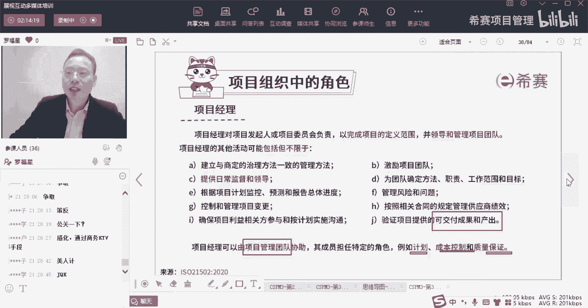

OK那么这个内容呢我们来我们来稍微回顾一下。

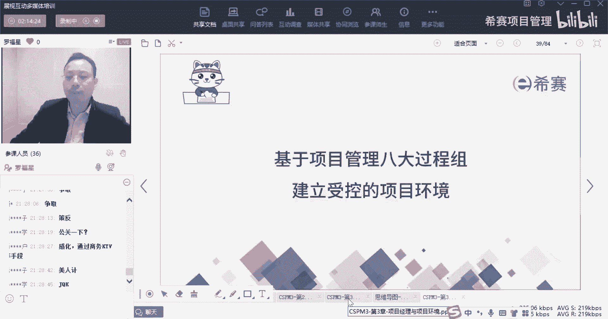

我们今天都干了，那这还有个词没讲，就是工作包负责人，工作包负责人他是干什么的，工作包负责人他就是负责去交付，就是去交付交付东西嗯，你可以把它当做是小组长，就是我们有一个小组长，那么小组长。

那就负责做A小组的这样一个事情的交付，我们有个B小组长，他就负责做B小组的交互，C小组就负责做什么什么交互，当然这里也有些东西你搞不定的时候呢，你找一些外援啊，你找一些外援，让他们去提供知识。

都是那这一段呢我们来看一下啊，首先整个项目的组织，我们来回顾一下项目的组织呢，它是一个临时结构，它要用来定义这种角色呀，职责呀，权限它有三条信息，他说一个叫明确汇报路径，比方说是由这个工作包的负责人。

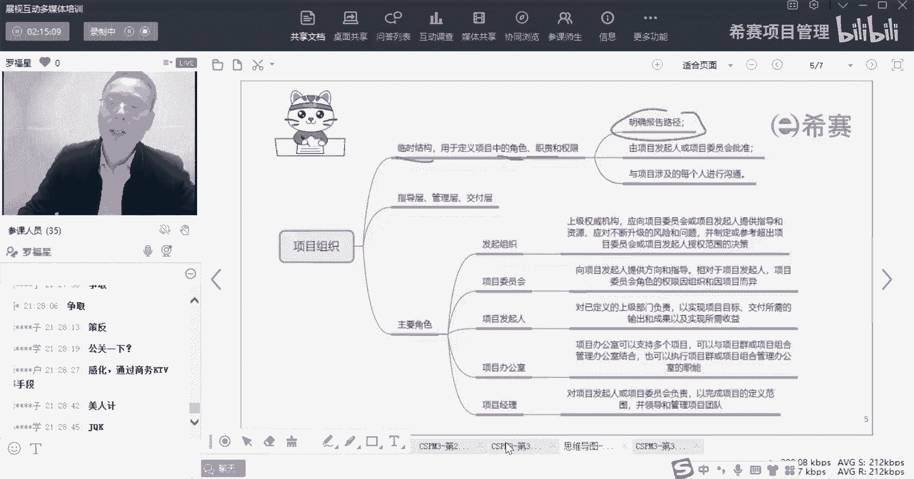

向项目经理汇报，项目经理要向发起人汇报。

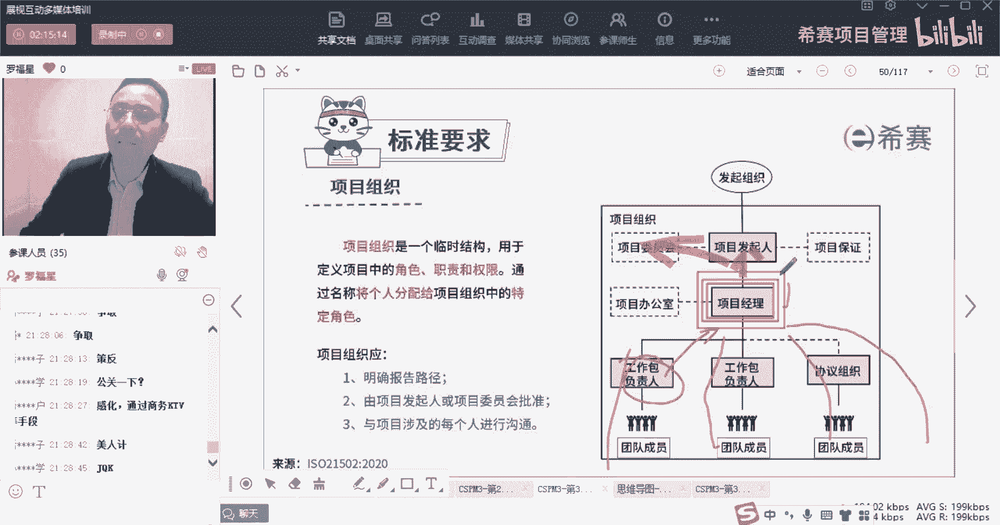

发行人要向发起组织汇报对吧，有明确的组织，然然后呢是由项目的发起人。

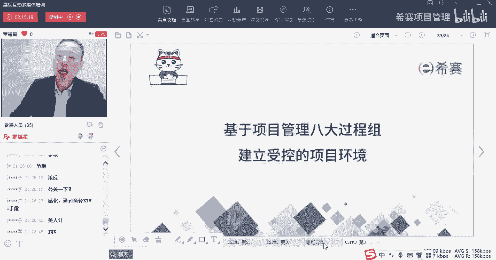

或者说是项目组织呃，项目委员会来去批准这一个临时组织。

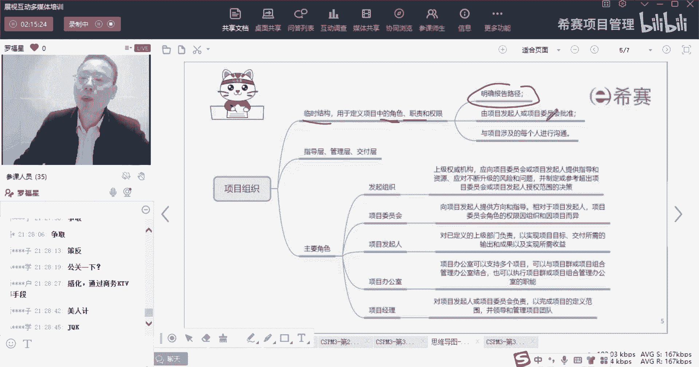

也是我们在这个项目上的组织，我们这个项目组织是谁来批准呢，是发起人或项目委员会，有这两个老大，我去去去一下啊，就是咱们这个项目里面的这个项目组织，是由这个老大和这个老大你们来去批准的啊。

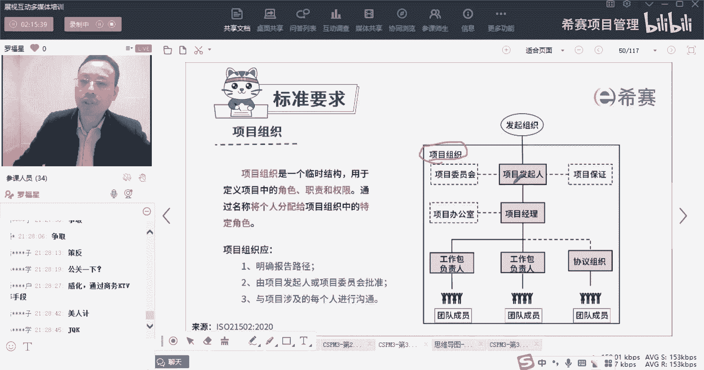

那再还有一个呢，就是他说要与项目，涉及到这个人都可以进行沟通，接下来就是有三个角色，一个是指导层，一个是管理层，一个是交付层，那么这个是属于指导成。

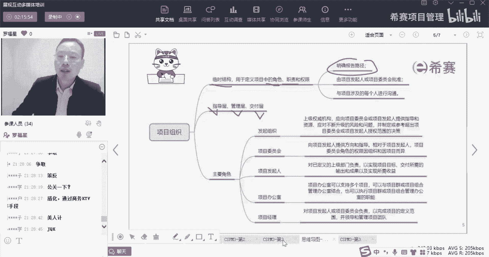

OK兄弟们，这就是指导成，你负责去指导整个这个项目的推进的，是你去指导他呃，这个管理层就是项目经理，这个层，项目经理这一层面你是负责去管理事事情，而交付层呢就是工作包底下这一层面，这一层负责去做交付。

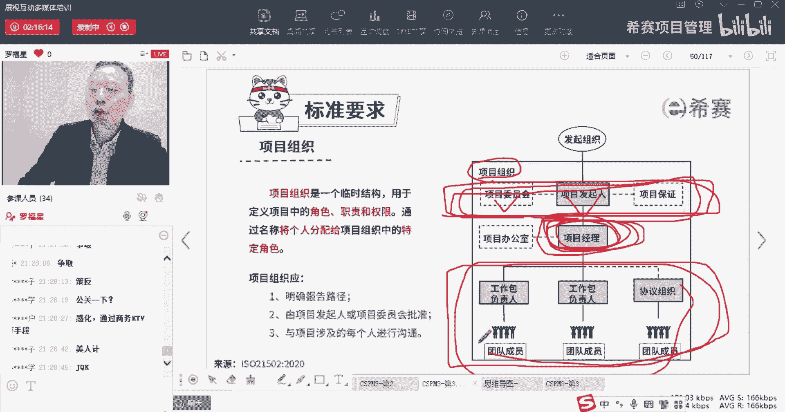

这就是说啊我们说它会分到这个叫指导层，管理层。

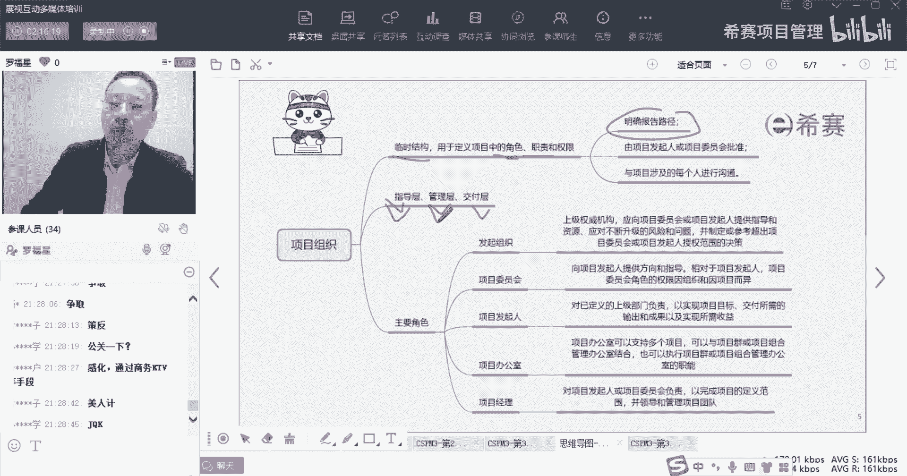

交付层，那么你可能会好奇问说是，那么发起组织是什么人一层呢，啊也有人说吧，他说你可以把它当成什么叫投资层，就投资这一层就更大，领导他去负责去投资，说唉这个项目值得做，不值得做投资这一层。

然后再接下来就是这几个层面的。

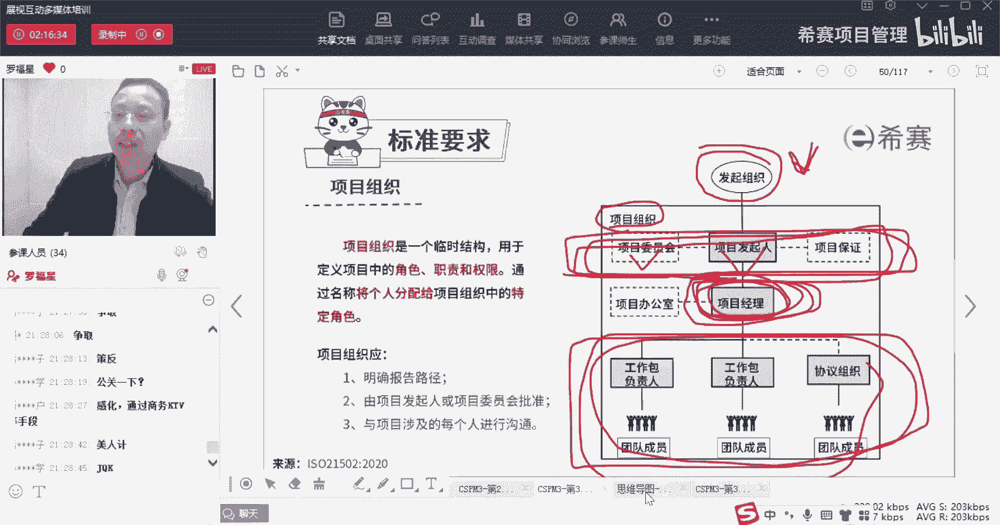

首先第一个是发起组织，发起组织是一个上级的权威组织，然后他能够去给发起人来提供指导和资源，对于那种升级到的这边的这种问题和风险，来进行应对和处理，但它不是长长期处理啊，它是有需要的才去处理，对不对，诶。

你冒出来的东西我才去处理，然后呢，他去制定这些个什么什么什么决那个范围，决策范围，雷西是你做决策的，雷西是你做不了决策的话，就我来做决策的，这是发起组织，第二个呢是项目委员会，那么项目委员会呢。

它其实是发起组织的一个靠山啊，依靠发起组织的，这不是说错了啊，项目委员会，他是项目发起人的靠山，然后项目发起人他是属于项目委员会中的一员，并且他是一个重要代表，他说这个项目委员会。

是向项目来提供方向和指导，那么同样的项目发行，他也是向项目来提供方向和指导，而接下来知道了项目发行，项目发起人，他说是由上级部门来学。

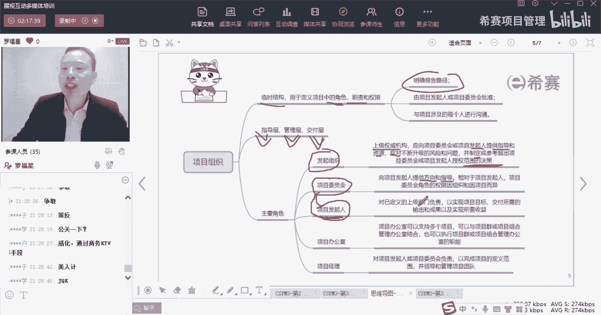

他说要对上级部门负责，也就是你要对这个发起组织来负责。

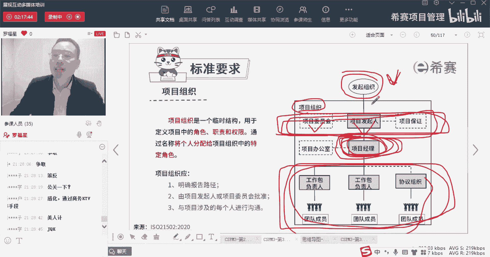

你要对上级对那个发起组织负责，就是对上级部门负责，并且呢他说是实现这个项目目标啊。

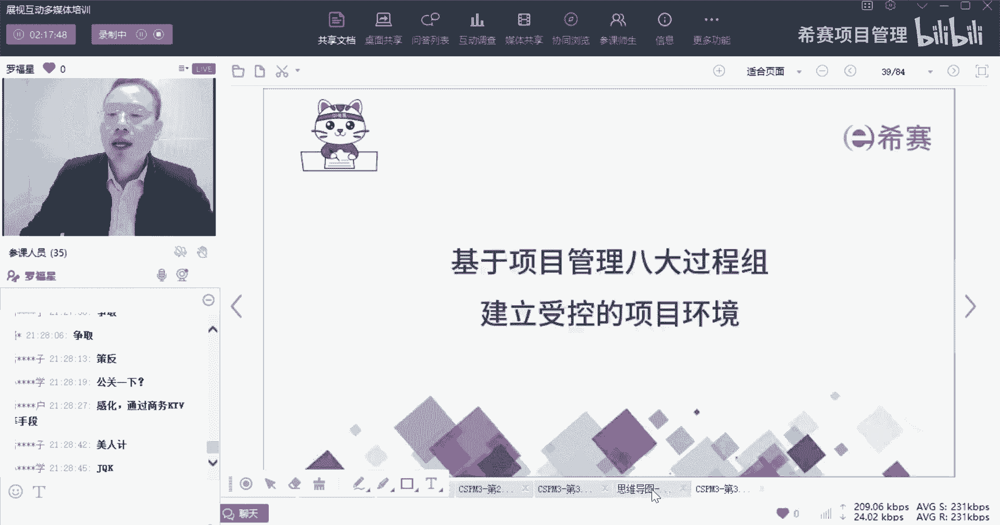

交付的这样一个成果呀，实现收益，那么这些具体的交付目标收益谁来做呢，是由项目经理来去做，项目经理也不一定亲自做，他也会安排团队成员去做，安排交付的这个工作，包负责人去做，然后再到项目办公室。

项目办公室是给项目经理提供支持和指导的人，OK其中我们最为熟悉的就是说是什么项目的，这样一个标准化呀，管理的标准化，流程的标准化呀，这些东西对吧，那项目管理办公室他说是可以管理多个项目。

可以支持多个项目，可以跟公司的这些项目，项目组合的办公室是可以联合在一起来好。

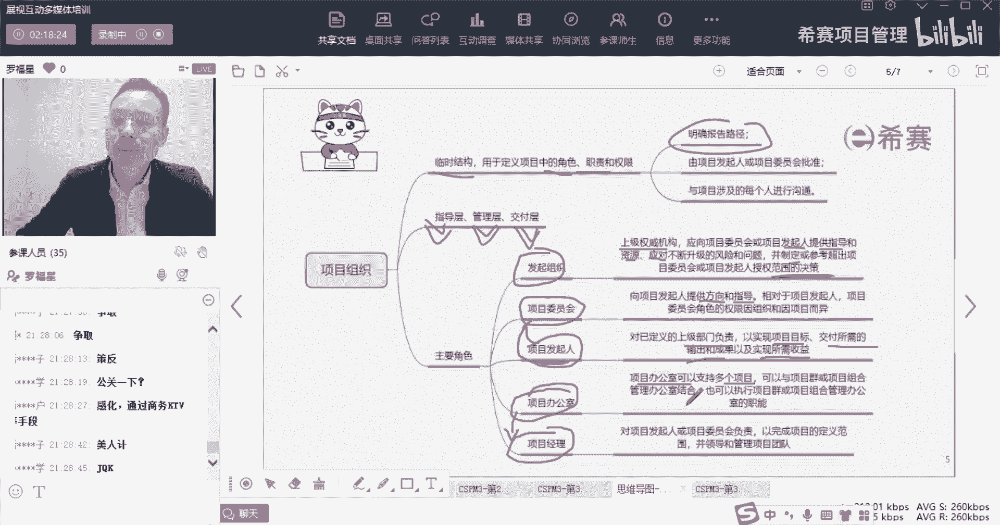

再就是项目经理，项目经理你你就是由发起人来委派的，OK就是由发起人，他来委派项目经理，你要向发起人负责，发起人委派你。

你要向发起人来去负责，你要去负责去落实执行开的那个事情。

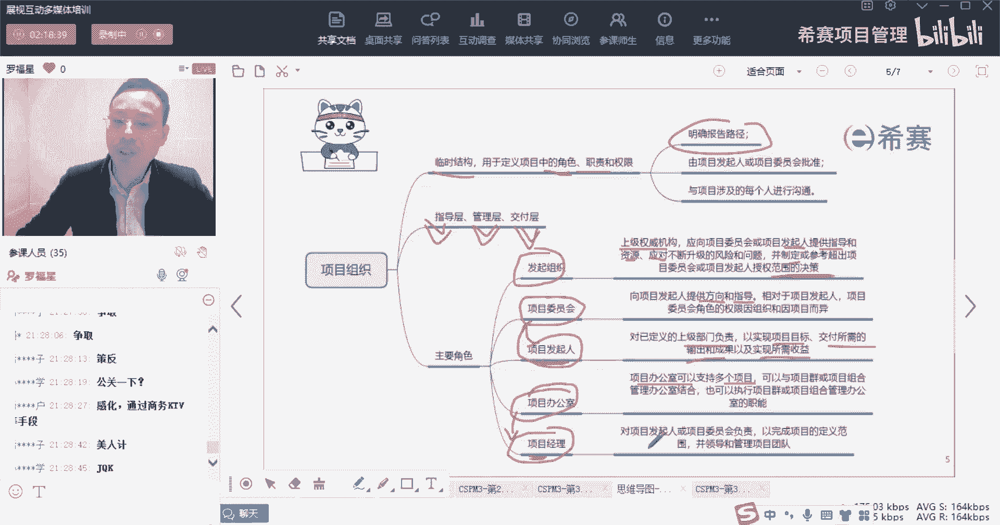

而你的这些事情谁来去做呢，又有这样一个工作包负责人，由这些人来去完成去做，是这样的一种情况，OK好了，那我们今天晚上呢。

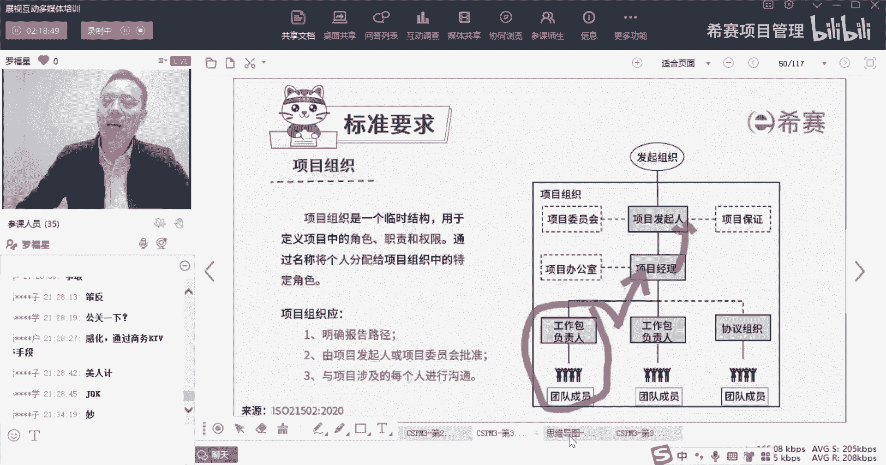

就就只讲了这一个项目的组织，后面还有两块内容没有讲，一个是关于项目管理，项目综合管理中的八大过程组呃。

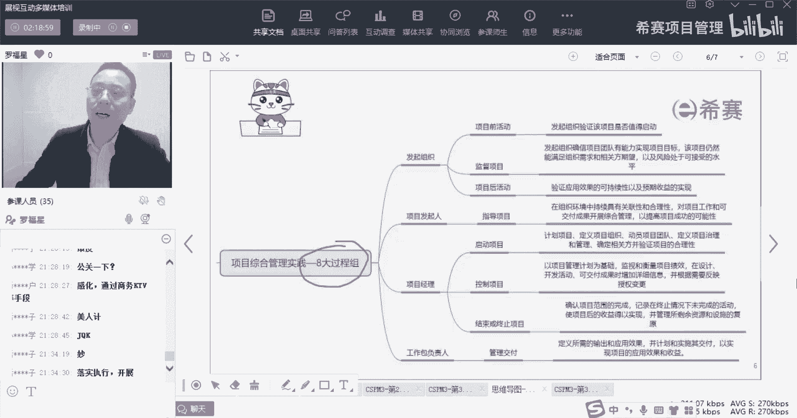

然后呢还有一个就是呃17个知识领域，这里当然没有去展开啊，没有去展开，最后还有一个简单的一个叫项目经理和角色，估计这个人可能有可能还需要一个。

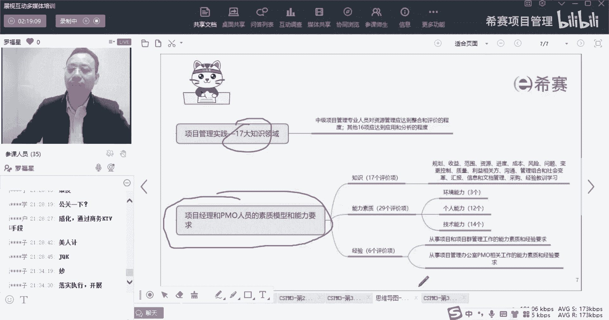

还需要一节课，好了，那我们今天晚上呢就这么多。