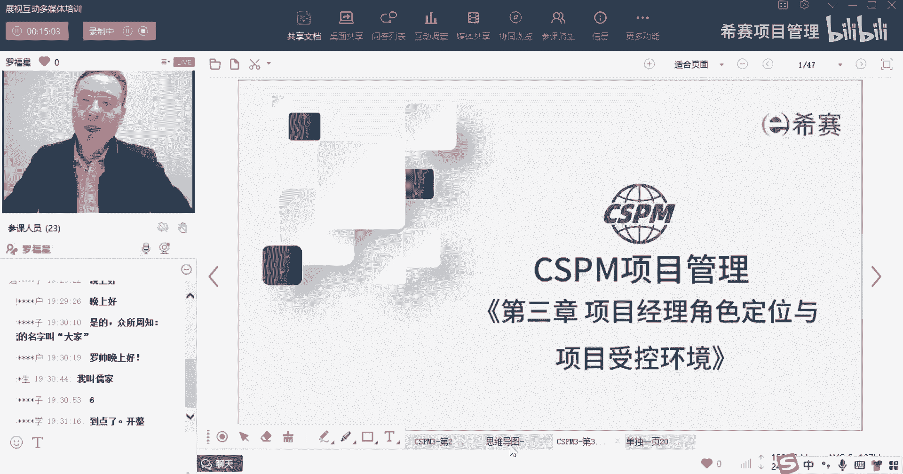
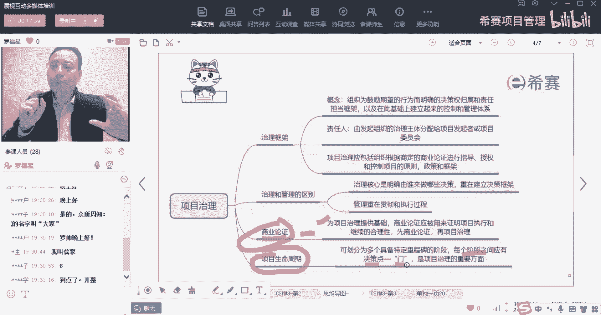
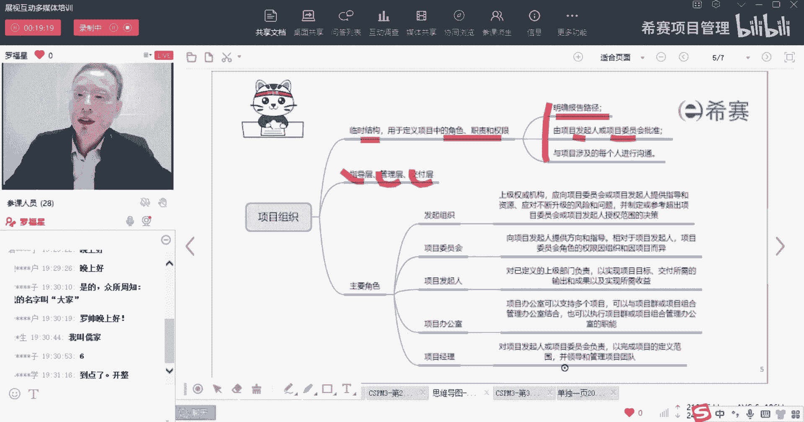
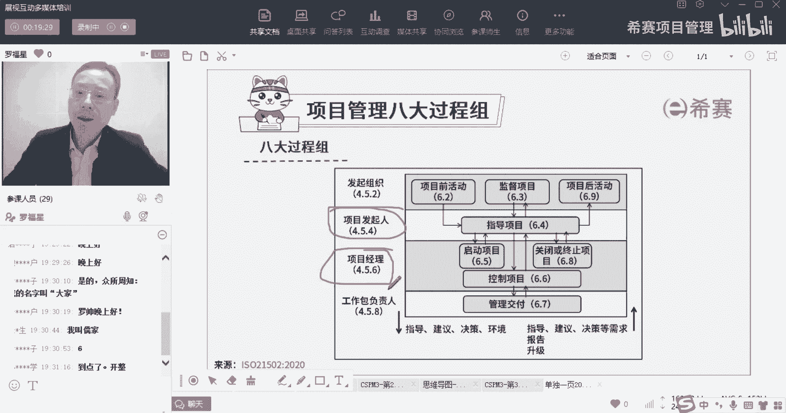
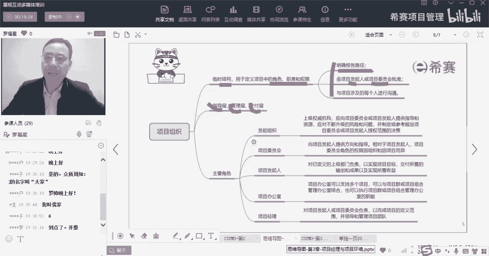
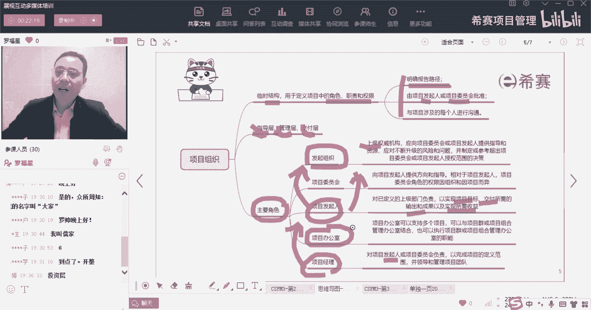
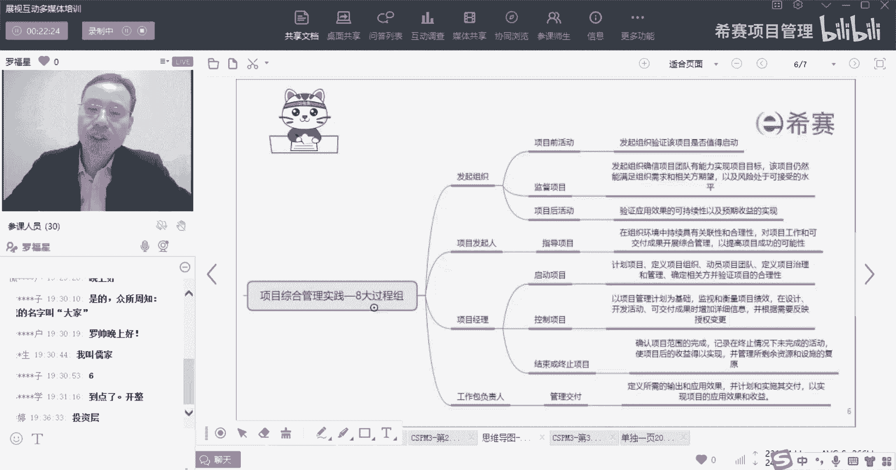
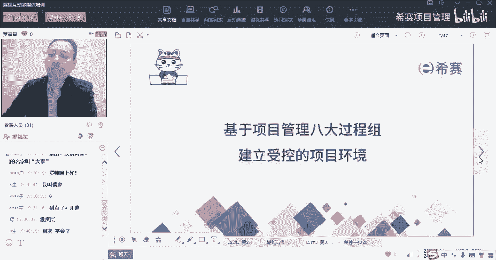
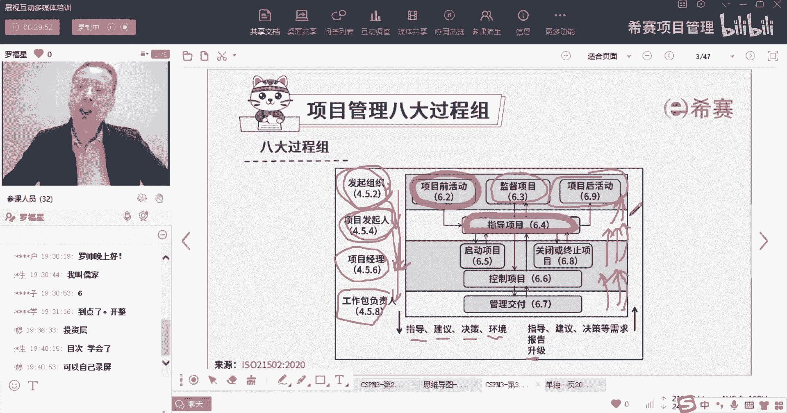

# 【收藏】CSPM-3中级项目管理认证考试直播课精讲视频合集（零基础入门系统教程）！ - P27：CSPM长空3-16项目管理八大过程组介绍 - 希赛项目管理 - BV16p42197SH

大家晚上好，欢迎来到西夏网专业的职业教育平台，我是罗福星，今天晚上我们继续来分享的是，CSPM的第三章叫项目经理，角色定位和项目的受控环境，这个章节呢它的内容相对多一点，我们在上一次课程。

其实是跟大家一起分享完了这样一个内容，我们在上一次课程中，会把关于商业论证和项目生命周期，给大家做一个分享，我们稍微简单回顾一下啊，先回顾一下上一次课，我们上一期呢先讲到商业论证，商业论证是什么呢。

它其实是去确定这个项目值得做，确定这个项目去值得做，同时他除了说确定这个项目值得做以外，还有就是在做这个项目的过程中，在做的过程中，他依然还需要再一次来确定，这个项目是值得做的。

也就是在最开始还没开始之前，他要确定这个项目是划算的，是值得的，是有价值的，然后做的过程中，依然还要确定这个项目是值得的，可以的，划算的，是值得的，这是商业论证，有的时候呢也会把它翻译成叫做项目论证。

翻译叫业务论证啊，它它其实在最一开始如果没有做商业论证，没有做业务认证的话，我们这个项目一般是不会去开始的，你一定要先去确认它是值得做才会开始，而开始了以后呢，其实过一段时间我们还要再一次来论证。

它依然是划算的，依然是值得的，我们再往里面去投资，是投钱是OK的，这是商业论证或者业务论证好，接下来呢会讲到一个叫生命周期，生命周期，它特指的是说从开始到结束，中间所历经的一系列的阶段，这是生命周期。

同时在讲生命周期的时候呢，我们之前有学过关于预测型的生命周期，就像一个瀑布一样的，从上面往下面流水的方式，流下来的这种方式就是预测型的生命周期，那我们还会有一种叫增量的生命周期。

增量的方式就是先做了这些，然后再加一些，再加一些再加一些，还有迭代的方式是滚动的来去进行，滚动的来去进行，那还有一种呢叫做适应型或叫做敏捷型，就是既有增量又有迭代的方式，那我们在这个生命周期这一块呢。

还给大家多讲一点，就是他的每一个阶段呢，我们还会中间有一个叫决策点，叫checkpoint，就这点它就叫门门这个词，用了一个词叫gate，g a t e gate叫关口或者叫关卡，那你就知道哦。

原来一个叫阶段关口的概念，阶段关卡的概念，这个关口和关卡它干什么呢，就是确定上一个阶段做的东西，是不是跟我这个关卡中所要求的东西是相匹配，如果相匹配就可以进到下一个阶段，如果不相匹配。

肯定要打回去重新做，或者有可能会说是先暂时停留在这个地方，等一段时间，当然还有一种可能是什么呢，还有一种可能发现这个项目根本就不值得做。

就直接给掐掉啊，有这种情况就是关于生命周期，然后接下来我们又讲到了关于组织结构，就是项目的组织中，首先项目组织他就是一个临时的啊，是一个临时的组织，然后这个组织里面会能够去定义出大家，大家各自的角色呀。

职责呀，权限啊，讲三句话说，一个是能够去明确报告的路径，比方说呃那个项目的那个工作包负责人，他要向项目经理汇报，项目经理他需要去向发起人来汇报，发起人需要向发起组织来汇报，这有一个汇报的路径。

第二个他说是由发起人，或者说是项目委员会来去批准，其实也就是项目内部的这个组织，是由项目的发起人或项目委员会来去批准，因为在项目内部，就是关于这个项目内部的这个组织的话，他们就是老大，他们是最大的。

所以是由项目发起人，或者说是项目委员会来批准，同时我们也知道这两个角色呢，它是作为项目治理的主体，它是项目治理的主体啊，他来去定义一些项目治理相关的东西，项目经理会适当的去参与做一些些治理的东西。

但主要是由发行人和项目委员会他们来去做好，第三个，他就是我们这一个角色和职责呀，要是要与涉及到项目的各个人去进行沟通，就是每一个人你都要了解清楚，你自己的角色和职责是什么，你的权限是什么啊。

这是第一个小小的点，所以是关于项目的组织，那么它是一个临时性的结构，然后它是能够去定义各自的角色职责权限的，那有这三条，第二个他说是有三个层级，一个叫指导层，一个叫管理层，一个叫交付层。

那么这三层呢你把它简单理解为，就是说像这一层发起人这一层，它就是属于指导成，然后项目经理这一层他就属于管理层。

工作包负责人这一层，他就属于交付层啊。

这是关于指导层，管理层和交付层，那么在这张图中上面，这个发起组织这一层他们算什么呢，哎他们算，你可以把它当做是一个叫投资层或投资方的，这个意思啊，我们老师一边在讲的时候，你一定要去回顾这东西。

要要回忆一下，今天是要再熟悉一点，因为这东西有一些些是稍微有点心，但但大部分其实都能听懂啊，我相信你都可以听懂，好在看到，另外呢我们在整个里面的话，它会给到几个主要主要的角色，那有一个角色叫发起组织。

发起组织是一个顶上的啊，是上层级的这个权威的机构，然后呢他是为谁来去提供指导呢，他为发起人来提供指导，他为项目委员会来提供指导啊，他来去制定这些规则呀，以及某一些事情，但你这边hold不住的，大的问题。

超出你这个权限的，你可以再上报给他，上报给发起组织，接下来是项目委员会，项目委员会呢它其实是由发起组织来提供的啊，它为发起人提供这些方向和指导，而发起人是属于发那个项目委员会中的之一。

来代表项目委员会来管来去来，去对项目本身来进行授权啊之类的，会有这样一个角色，所以他是他向发起人，或者是向发起人来提供指南和方向，他也是你背后的靠山，如果说发起某一些事情讨论不下来的时候。

你也可以跟这个项目委员会一起来讨论和交流，接下来第三个呢是项目的发起人，发起这个角色呢，咱们在这里他说的是一个上级部门，就是他要向上级部门来负责，所以你有什么事情明明搞不定，你要跟上级部门去申请。

你有一些什么事情，你需要去跟上级部门去汇报，你是向上级部门来负责的这样一个角色好，你要去实现项目的目标，要交付所有的这一些输出和成果，要实现所需要的价值，但是呢这些目标也好，这些交付的成果也好。

以及所实现的价值也好，并不是由发起人来亲自完成，那么通常情况呢他其实会去任命一个项目经理，会任命项目经理，所以项目经理是要对发起人负责啊，你要对发起人负责，发行给你安排了什么什么事儿，你得要去完成。

你得要去落实，你得要去做到啊，是这样的一个情况，同时呢这里面还会有一个角色叫项目办公室，那么项目办公室嗯，他就是相当于说是支持项目经理的角色，他同时有一个重要的干东西是什么。

就是去把那些项目管理的流程做流程化呀，把那些各个个过程啊，环节啊，都把它能够去做成一种结构化的这种方式，能够具备广泛接受和应用好，这是项目组织，这是我们在SN一次课程讲到的。

而今天晚上呢我们一起来分享内容。

是叫做项目综合管理实践的八个过程组。

那接下来我们就一起来看到，关于说基于项目管理的八大过程组，来建立一个受控的环境。

他关于这一个八大公主建立受控的环境，他是个什么情况呢，其实它跟我们原来说的五大过程组，它不是一回事，它有点像prince two里面有个七流程，就是在prince two这个课程中有一个叫七流程。

它就类似于这个七流程，他会讲的是说在项目开始之前，我们会专门有一个过程组，一个流程叫做项目前的活动，然后你可以把它简单理解为说是准备啊，准备的活动，提前做一些做准备性的活动。

然后接下来呢会有一个叫指导项目，指导的活动啊，指导项目，指导项目也是告诉我们这个项目该怎么弄，把这个项目的这些个治理性的东西都给拎出来，拎出来拎出来拎出来，然后在接下来呢就到了一个叫项目启动项目。

启动项目，其实也就是跟我们原来所学的项目管理，五大过程组当中的启动过程组类似对吧，项目经理来启动这个事情，启动这个项目，启动完了以后呢，理论上来讲，中间其实就会有一个执行，但他把这个执行这个板块。

它就没有单独的去说，其实就是按照方式去执行，执行的过程中，它会有一个他会把这个执行的东西放到什么呢，放到了一个就是交给了工作包的负责人，那么工作包的负责人他是需要去做交付，他去管理交付。

也就是说如果这个项目它比较大的话，我们可以把它拆分成一段一段一段的，这一段交给张三来去负责管理，这一段交给李四来去负责管理，或者这些内容交给王五去负责管理，那么他们要去执行去产生的结果。

要做一个管理交付，同时呢项目经理还又要去控制项目，也就是要去按照节奏来进行，要去按照既定的范围之内去完成，对应的进度之类去完成，然后达到这个质量测量指标等等，会有这样一个叫控制的过程，当然了。

你真的是如果做完了以后呢，你其实可以去发起发起收尾的申请的，所以这里有个叫关闭或终止项目，当然了，他跟我们在之前学偏僻的时候不相同的地方是，我们说项目经理本身没有资格去启动一个项目。

项目经理呢也没有资格去叫停一个项目，关闭一个项目，那么它这里的这个启动和关闭，它跟我们之前的那个启动关注和关闭关注，其实还是有一点差别啊，他会讲的是说，项目经理在这个里面可以去做的事情。

可以去从事的事情，本身真的就是我宣布什么什么，什么项目正式开始，他肯定也不是项目经理去宣布的，我宣布这个项目顺利完成，他也不是项目经理宣布的，项目经理，你是可以去提起申请领导，他来宣布。

应该是这个逻辑对吧，但是呢你会你在启动的时候，你要做很多准备性的工作，做很多事情，然后终止的时候，在结束的时候，你也要做很多很多事情，所以他把项目经理放到这一块，同时顶上还有一个叫监督监督项目。

它指的是什么意思呢，这个监督项目和这个控制项目可不是一回事啊，兄弟们，这个6。6这个6。6的控制项目，它是指的说我要确保项目是能够如期进行的，能够按照质量要求来进行呢，按照什么来进行，这叫控制项目对吧。

而这个6。3的监督项目，他讲的是什么呢，他讲的是说诶，我要看这个项目，他现在是不是依然是划算的，依然是值得做的，问它里面去投的钱依然是合适的，如果发现我这个投的钱是不划算不合适，那我可能就要及时叫停。

或者我可能需要去请一些资源，我可能需要去做一些调整，它讲的是这一回事，当然等会我们会展开来看啊，然后最后面还有一个过程呢，叫项目后活动诶，你会觉得说有可能我们做项目的话，还有什么向后活动吗。

我们说项目做完了不就结束了吗，但是事实上呢，你要知道项目它在什么情况下才能够产生价值，他要投入到运营和使用才能够产生价值，兄弟们，姐妹们，这还要去投入到运营和使用的时候，才能够产生价值。

那就投入运营和使用，虽然你项目经理不去管它，但是是不是专门有运营经理，专门有人负责去运营去维护，对不对，所以呢发起组织，他会安排这个事情给另外一拨人，让另外一拨人去做这个事情，那么但是这个的话。

就是又跳出了项目的本身的范围，所以没有把另外一拨人放进来，他就直接给了一个叫发起组织，来去负责这个项目后活动，但事实上他肯定是专门安排谁，谁来去做项目后活动来，并且要去确保这个项目后活动。

这个运营的活动能够产生它所需要的价值，所对应的价值一定是这样的，并且你会发现，这里这里有一个说从上往下的方式是指导建议，决策啊，以及提供环境，也就是发起组织，他为发起人去提供指导，提供建议，提供决策。

发起组织，他就为这个发起人来去安排这些治理的东西，形成为了你的环境而发行，它为项目经理去提供指导，提供建议，提供决策，那么发行人做了这个项目治理的东西，那么就是项目经理要去遵循的，它会成为你的一个环境。

而项目经理呢，他可能会把一些东西，内容去分包给各个工作包的负责人，那么他要去给工作包的负责人去提供指导建议，决策好，反过来底下的这个人，他要去对下面的人提一些对应的需求，他说他是有关于有指导的需求啊。

建议你的需求啊，决策的需求啊，你都要去，你都要去问他哎，这个事情应该怎么弄，那个事情应该怎么弄，以及你要去给他提供，你要你要向他提供，你要向提供报告啊，你要向他报告，向他report啊。

还有就是问题的升级，如果说有某一些问题，你要up要去完善升级，你搞不定的，超出你权限的，你要往上升级，就是这样的一个逻辑关系啊。

