# 【收藏】CSPM-3中级项目管理认证考试直播课精讲视频合集（零基础入门系统教程）！ - P29：CSPM长空3-18八大过程组之监督项目 - 希赛项目管理 - BV16p42197SH

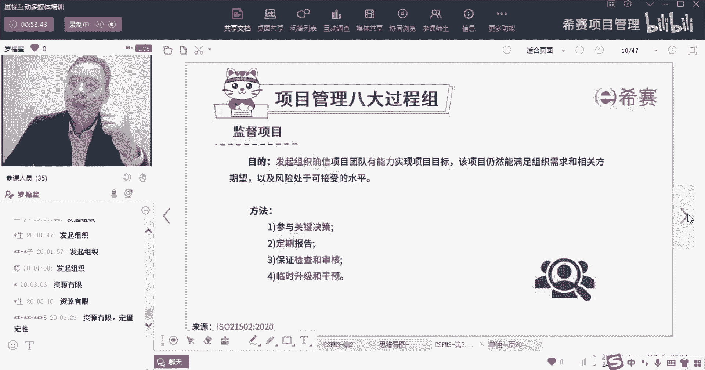

接下来到了第二个叫监督组监督项目，那么这个监督项目呢是这里来给你框一下啊，监督项目是这个6。3，那么他还是谁的谁的活，他依然是发起组织的活啊，它依然是发起组织的活，依然还是这个发起组织他的活嗯。

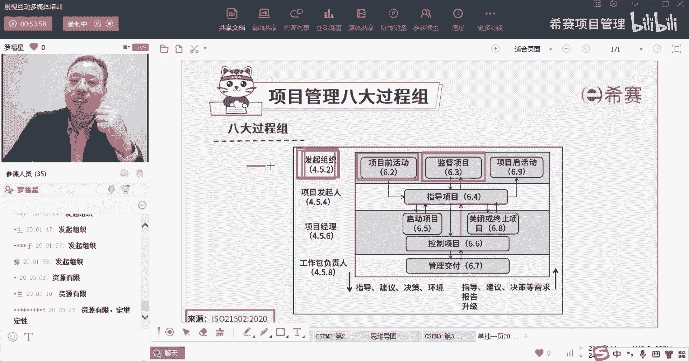

那我们来看一下啊，监督组织监督项目，监督项目是目的是什么呢，首先第一个他说是由发起组织啊，由他来干活，他来去组织项目团队啊，他来去确信他说他发起组织，确信项目团队有能力实现项目的目标。

并且呢能够确定这个项目，以及这个项目它的风险是处于可接受的水平，所以你有没有发现这个监督项目，它其实相当于干什么。

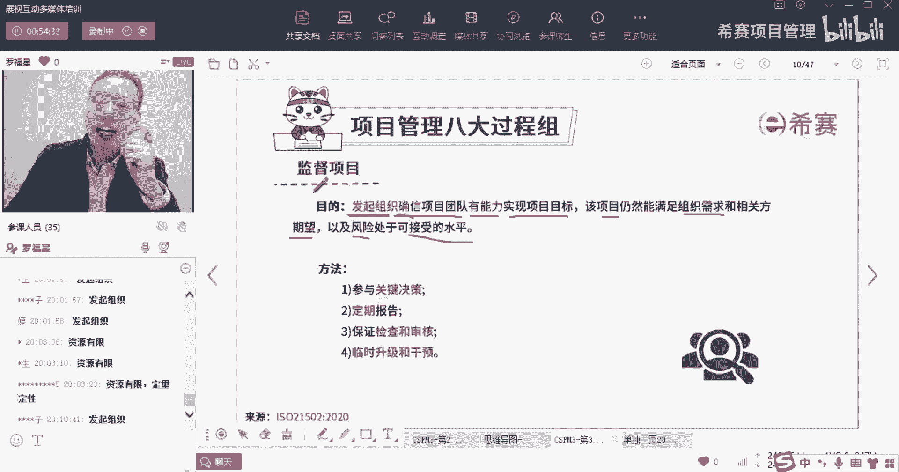

这个监督项目，它相当于是我们在做项目的过程中，他依然进行商业论证的，是不是这个意思，所以他的目的是不是这个意思，就是确保这个项目依然在执行的过程中。

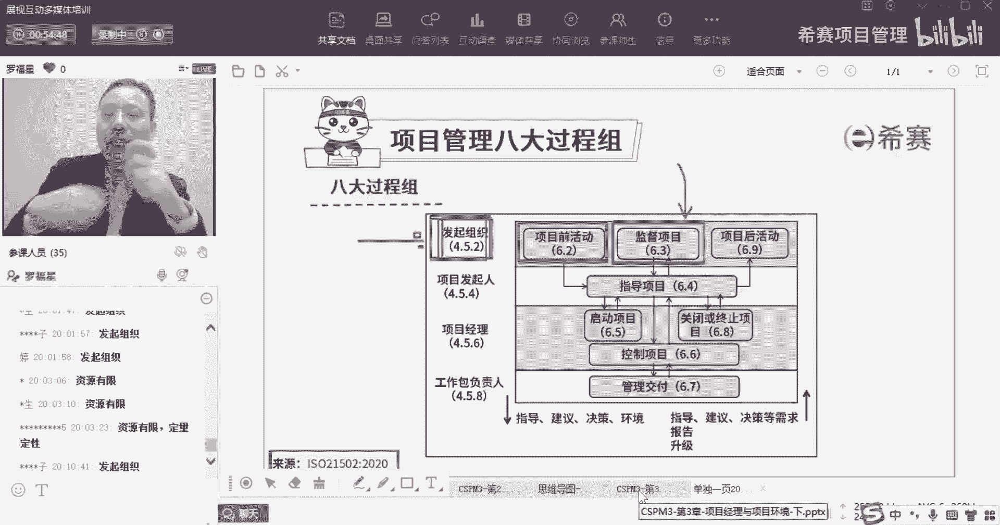

依然还是值得做的，依然还是可以继续往里面砸钱的，我有的是钱，我可以往里面砸，因为它可以产生更多的价值，它目前是好的很，这风险也都是可控的，没有什么毛病和问题的对吧。

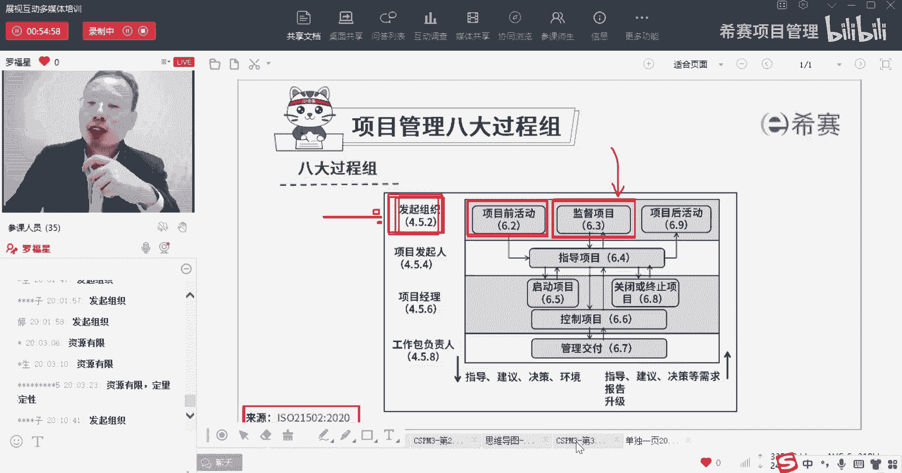

所以它是由发起出他来去，确信我们的团队牛逼，我们团队有能力去交付，以及这个项目是可以能够做的东西，它依然满足我们的需求，满足客户的需求，风险也都是在我的受控之内，没毛病，没问题，因为为什么要这样说呢。

也有可能做着做着，发现客户的需求已经不存在了，或者客户的需求发生变化了，或者组织的需求不存在了，或者是组织的需求发生变化了，所以你看这里面，我们的小哥哥小姐姐用了一个放大镜的图标。

就是这种方式来去扫视哎，也是一个很形象的一个表示啊，是由发起组织他来去确信团队有实力，项目依然是被需求，风险依然是可控，这是监督项目他的目的，监督的方法，第一个参与关键决策。

也就是说有一些重要的决策点的时候，那个那个那个决策到底是过还是不过的时候，你要去参与进来，发起组织，要参与进来，第二个有定期的报告，你们你们底下你们要定期给我报告这些情况，你报告了以后呢。

我能够基于你的报告来去做做事情对吧，来去来去做判定，来去做决策，第三个说是保证检查和审查，就是要对底下的这些项目进行审查，基于什么审查，基于这些报告来进行审查，同时这里还有一个词。

你可以发现一下叫零十的升级和干预。

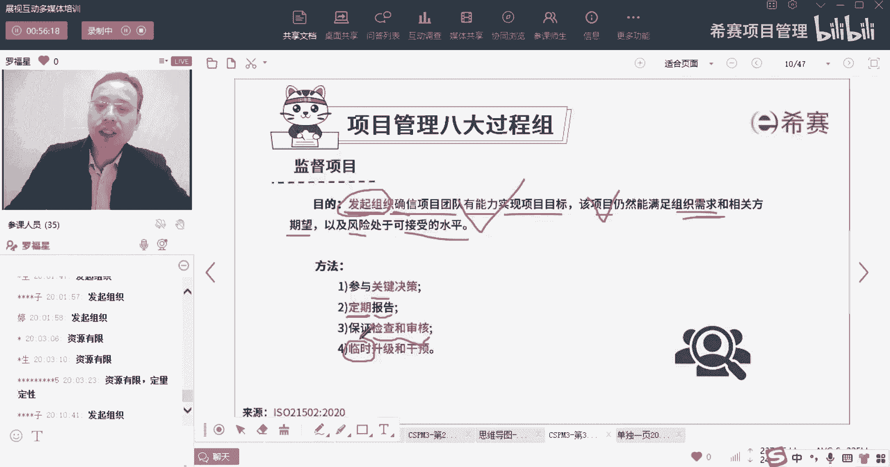

什么意思呢，就是说正常情况下，你大部分时候大部分事情，你项目经理就好好去做就可以了，你的工作包负责任就好好去做就可以了，只有某一些特别的情况，你出来状况出了问题，你才来找你的老板，你的老板搞不定。

你才来找大老板，通过这种情况，所以呢他对于这种升级干预这种事情。

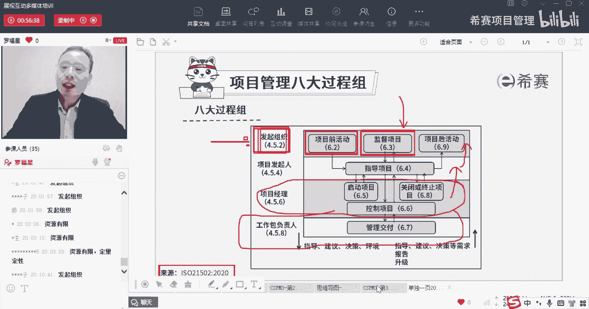

他不是经常搞，他是额外的，有需要了才搞，get到没有，我不是天天都专门去专门，今天要去处理一些升级的事情，明天要帮你处理一些升级的事情，不是这样的啊，是偶尔的时候有需要了，我才才搞这种事情。

就是偶尔的时候，因为大部分时候是正常运行，正常运转的。

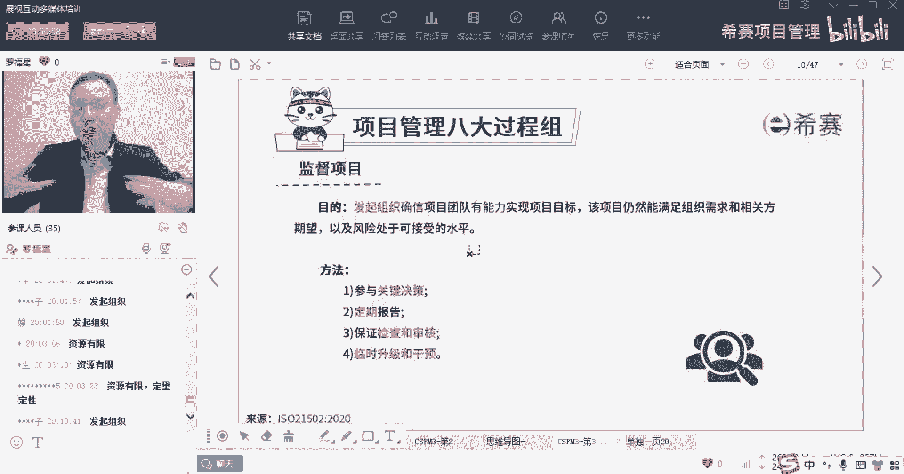

是临时有需要才会去做升级，我们来看一个题目，哇你们都这么强的吗，我这个PPT应该还没有发出来吧，你们还没有拿到吧，我是想上完课以后再发给你们的，还没上完之前，我不想发给你们。

你们这么强的这个这个速度可以啊，对我是想要上完以后再让助教发给你们，没上完不先不发，要不然的话答案你都看到了，你看一下监督项目，它的目的是什么呢，监督项目的是让发起组织。

他来确信团队是有实力可以去完成的，以及我们的这个项目依然是被需要的啊，并且他风险它依然是属于可接受水平，那么这样一个监督项目，监督项目不能够通过以下的一种方式来实现，那么可以通过哪种方式呢。

一个是参与做决策，然后底下有人定期做报告，然后呢我们要去做审查和审计，但是不能够告的是说经常性你的干预，这不可以，它一般是临时性啊，是临时性，是临时性的，升级和干预，不能搞经常性的。

你要经常性的搞这个事情，那你搞个屁，那你一天到晚忙的要死，天天在救火了，是不是，所以这个就是错误答案啊。

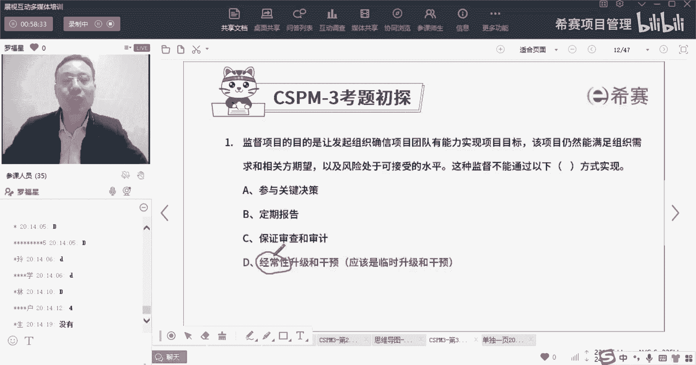

好又重新巩固了一下，继续监督项目，他说尽管许多决策，他是可以委派给项目的发起人，但是通常一些决策呢，更适合保留在发起组织当中，也就是说某一些东西我可以把这个工作内容。

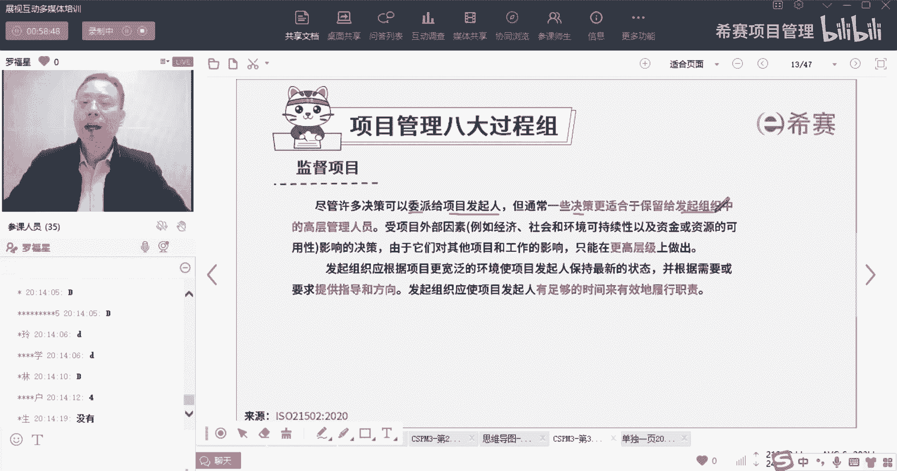

或者这个这个这个要这个这个这个权利，下放给到项目发起人，由你你来去拍板做决定，但是也有一些东西呢，可能是你这个成绩你还拍不了板的，那留在我自己手上比较好，还会有这种情况。

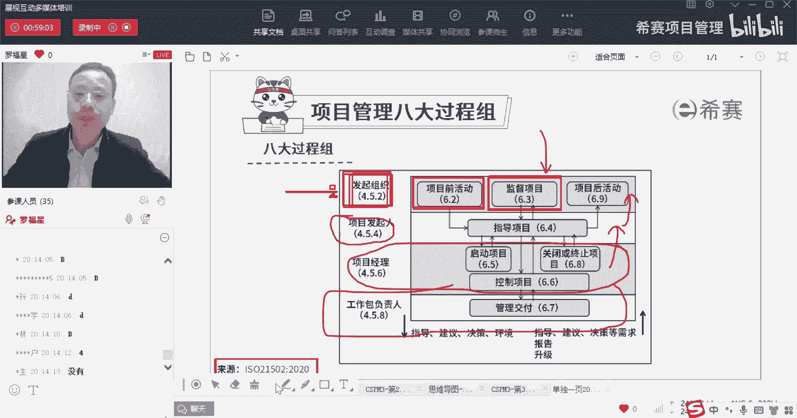

讲的是这个意思啊，也就是说这个成绩保留的必要性，他讲的是这么一个情况，受项目外部因素的影响，比如经济社会环境可持续性，资金资源可用性等等影响这种角色影响，由于他们对其他项目和工作产生影响。

所以只能够在更高层级做出决策，什么意思呢，也就是说为什么有些东西我可能会保留决策权，在我的这个发射器组织里面来，是因为某种大的，你还记不记得，我们在前面讲过一个叫宏观的态势分析，叫pastel分析对吧。

某一些PEL分析的东西，它不是你作为一个小小的项目经理，可以如何如何的，也不是你作为一个小小的一个，一个一个也不叫发小，就是某一个高管一发起人就可以怎么样。

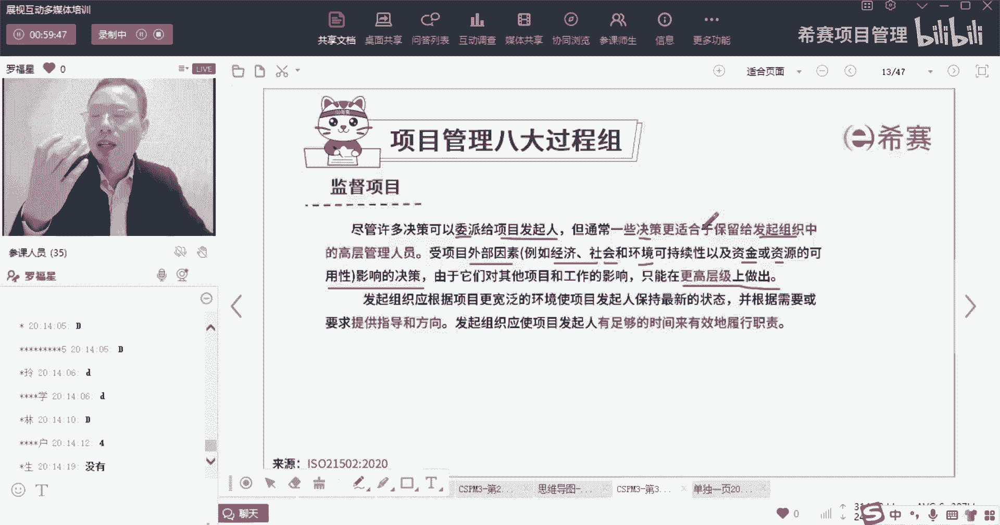

他可能需要更多的人来去群策群力，更多大领导智囊团来一起共同去承担，来去做决策，所以这种这种什么经济社会环境，这就是属于pesto里面的东西，那么这种大的东西的影响决策的话。

我们可能需要把这个决策留在自己，留在这个发起组织里面会更好一点，发起组织应该根据项目更宽泛的环境，来使项目的发行人保持最新的状态，那么就是同步信息了，根据需要或者是要求来去给他提供指导和方向。

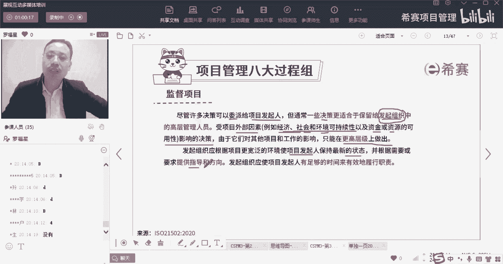

所以也就是说你你作为一个发起组织，你要去给你的这个发起人提供指南和方向啊，是这个意思。

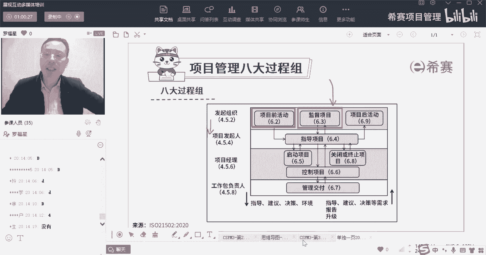

你要给那个发起人提供指南和方向，发起组织应该是项目的发起人，有足够的时间来去有效地履行职责，所以呢你要去把这个规则给定好啊，你干什么你干什么。

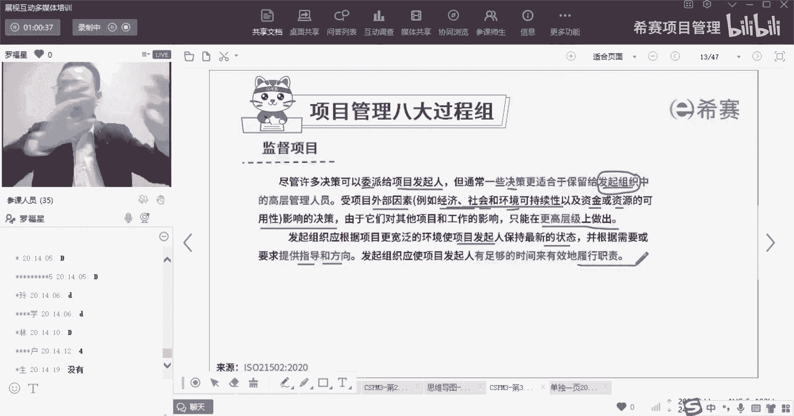

你干什么，那么这其实就是一种治理，你定规则就是在做治理，我们说治理是什么，是搭台子，定规则，定标准，定要求，这都是治理对吧，所以你作为一个发起组织，你要去给这个发起人来去做治理，那么这是监督里面的话。

你要怎么样才能够接受他呢，你提前定好规则以后，要求他来去做事情，你过程中某一些你搞他搞不定的。

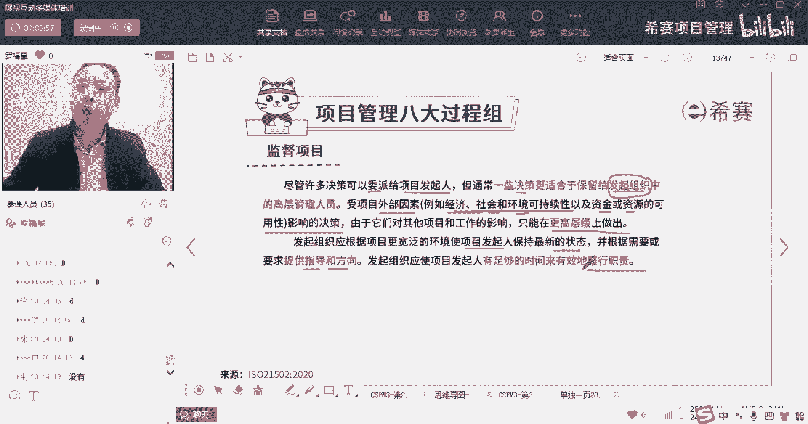