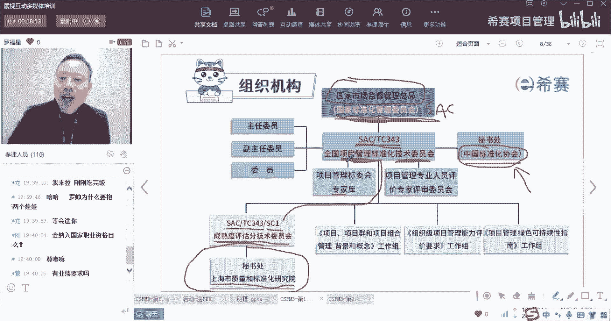
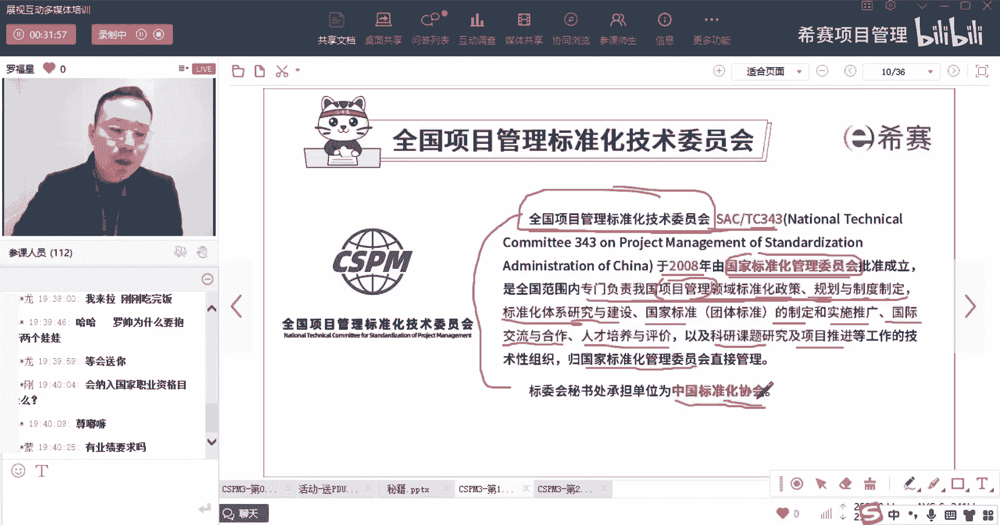

# 【收藏】CSPM-3中级项目管理认证考试直播课精讲视频合集（零基础入门系统教程）！ - P3：CSPM长空1-3全国项标委介绍SAC-TC343 - 希赛项目管理 - BV16p42197SH

在国家标准化管理委员会底下，它有很多个具体的技术委员会，其中有一个技术委员会，但它的名字就叫项目管理标准化技术委员会。

那我们也来稍微认识一下，全国项目管理标准化技术委员会，它是属于那个国家标准化委员会底下的，其中之一啊，就是它可能会有这些什么建筑类的，这样一个标准化技术委员会，可能会有这样一个摄像头，或者说是声音呢。

影视行业的标准化技术委员会，各种其中的关于项目管理这个的，关于项目管理的标准化技术委员会，它就叫TC343啊，这个SAC就是SSAC呃。

就是前面你看过的叫什么stonization administration of，然后这个TC它用的是一个词叫什么technical，Tec technical，然后C呢是ITTEE。

所以是tc committee，是这样一个技术委员会，那么这个技术委员会呢考试会考这个简称啊，它的简称就叫SACTC343，我等会给你看题目，同时这个全国项目管理的标准化技术委员会，在什么时候成立的呢。

他在2008年，他在2008年成立，也就是国家召开北京奥运会的那一年来，成立了全国项目管理标准化技术委员会，毕竟它是由国家标准化管理委员会，来批准成立的，然后他干什么事情。

他要干的事情我们也需要了解一下，后面会有题目，他说是要负责，一个是负责全国范围内的，专门负责我国项目管理领域的，这种标准化的政策规划，制度的这些制定，K1个是这些标准化的政策规范和制度的制定。

然后标准化体系的研究和建设，国家标准的制定和实施推广，以及国际交流和合作，然后人才培养和评价，你会发现诶，前面这几个好像跟前面那个国家标准化管，理委员会是说的是一致的对吧，只是说他的那个焦点是什么呢。

它的焦点是关于项目管理领域，可以理解吗，就是它会有一个前缀，前提是关于项目管理这个领域中的，这些国家标准化的政策呀，法规呀的制定体系的建设呀，国家标准这种制定和推广呢，以及国际的交流。

所以是关于项目管理这个领域的，所以它才叫全国项目管理标准化技术委员会啊，他是第343号，叫TC343，同时呢，他还要演做一些什么叫像科研课题的研究啊，以及项目推进的工作啊，这都要去做。

他是归国家标准化管理委员会来直接管理，所以它是属于国家标准化管理委员会下面的，下属的这个机构，同时呢这个是国家单位，就是全国项目管理标准化技术委员会，它属于一个国家单位。

而这个中国标准化协会它是一个社会团体，是一个社会团体，很多东西如果说有一种社会团体的话，他就可以去承接很多的事情来去做，包括也可以做这种呃。

比方说像这种考试类培训啊之类的。