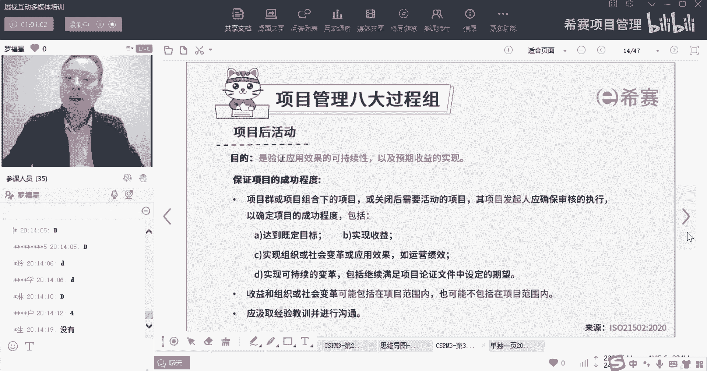
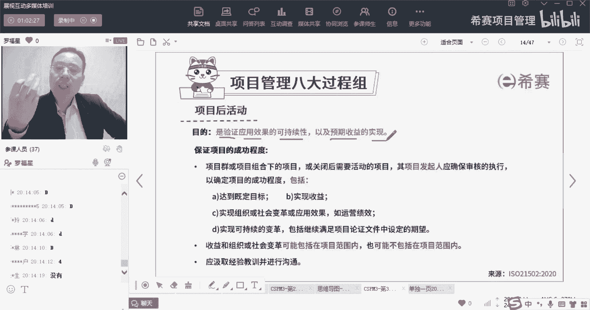
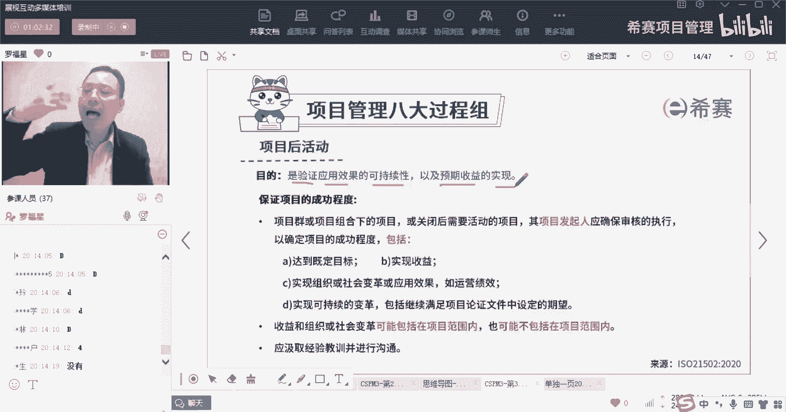
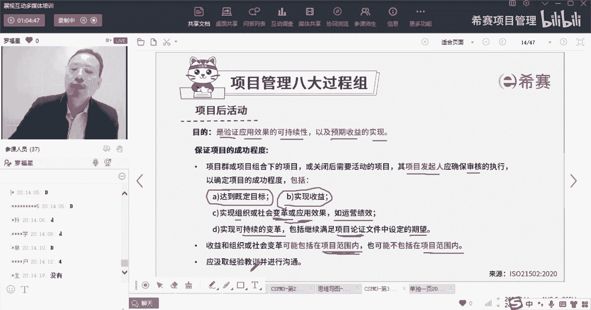
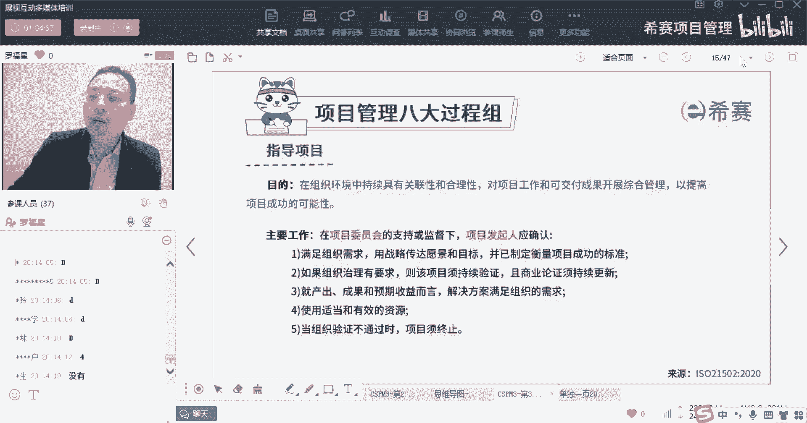
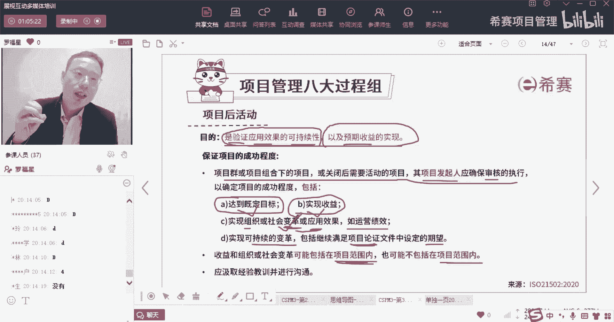

# 【收藏】CSPM-3中级项目管理认证考试直播课精讲视频合集（零基础入门系统教程）！ - P30：CSPM长空3-19八大过程组之项目后活动 - 希赛项目管理 - BV16p42197SH

接下来到了一个叫项目后活动，他是直接把这一个角色，把这个发起组织的角色全部干了啊，项目后活动，那么项目或活动呢，它通常是指的说我这项目已经完成了之后，我开始有简单提了一下，通常项目完成以后。

这个事情本身没有结束，为什么呢，因为你这个项目做完以后呀，像很多行业的东西，你项目做完以后，你才真正开始去投入运营，才真正开始挣钱，最简单的，就像有人说你们做游戏或者做那个手机的。

做一些那种那种网络的一个web，做一些i app这种东西，你开发完成以后，你投入到运营和使用的过程中，别人去使用的时候才会去产生价值，那么这个东西呢不是由项目经理去干，也不是由发行人去干。

他会专门可能有另外一个团队，就是有个运营的团队或是运维的团队，来去干这个事情，而另一个人呢还不属于项目里面，所以把他分开了，就把它又归到了这个叫发起组织者里面来。

那我们来回看一下，首先项目后活动它是干什么，它的目的是什么，他的目的他说是验证应用的效果的可持续性，以及预期的收益的实现，什么意思呢，就是咱们做了这样一个项目以后，我们来去验证一下这个项目是K是合适的。

比方说我们在最开始说这个项目，他的那个投资回收期是3年，那么3年之内真的是回收了吗，成本回收了吗，我们说这个这个回报率是百分之百分之20，那真的是产生了20%的回报了吗。

这个预期收益它是实现了吗，所以这是项目后活动，我要去判定这个项目。

它真正的是产生了我所需要的价值，而这些东西一般是由运维的团队，或者运营的团队来去实现，但是他的背后还是有个cos呢，还是个大老板呢，来去指导啊，这就是由这叫发起组织，他来干，你看这里有一个。

他说保证项目成功的程度有哪些点，第一个项目群或项目组织项目组合，下面的项目呢，或者是有什么光明的活动，他说其项目的发行人应该要去确保审核的执行，以确保项目的成功，包括什么，包括打压到了既定的目标。

比方说你的注册量达到多少，你同时在线人数达到多少，然后那个那个那个购买，购买什么服务的人数达到多少对吧，实现的这个收益，他啊还是说实现组织或社会变革，如果是有设计变革的话，那么涉及到变革的效果。

或者说是做一个新的应用的推广，那么应用的效果好比方说运营的绩效情况，还说是实现可持续的变革，包括继续去满足商业务项目论证，你看这里给一个词叫项目论证，其实就是商业论证对吧。

请继续满足商业论证文件中的期望，其实也就是说去确保我最开始所设定的目标，真的是达成了，包括说我实现多少收益啊，或者我可能会产生什么变化呀，我产生有形价值，无形价值啊等等，讲的是这么一回事。

那么这个事情是谁去弄的呢，他应该是发起组织，他可以安排给发起人去搞，但事实上是发起组织啊，收益和收益和组织或社会的变革，可能会包含在项目范围之内，也可能会包含不包含在项目范围之内。

那么如果包含在项目范围之内，这就是项目经理就可以去搞的事情，如果不包含在项目范围之内，那么就是专门由运营的经理去搞，会有这种情况，所以如果说这个项目里面里面的某一些收益，本身就是在你一边去做的时候。

假如说哎我们提供一个餐饮的服务，我一边在做这个项目的时候，你就已经在享受这个餐饮的服务了，那么这次做的过程中，你就已经感受到了，那还有就是我们的开发这些app也好呀，或者我们去研发某一款产品。

然后就把最后去生产和制造也好，它都是项目之外的，都是项目之外的对吧，同时还有一个说要去，应该要去汲取到这些经验和教训，并且进行沟通。

就是优化迭代，一轮一轮来做的，做的变得更好，OK这是项目后的活动，所以项目后活动，你会发现它其实是一个相对相对内容也很少啊。

内容很少，他就只是告诉我们说，确保这个项目的这样一个可持续性是得到了，确保这个项目的收益是实现的，他说还有一个说是，如果这些什么什么群的活动呢，那么这个发起组织要审核这些东西。

确保它的收益达到了目标达到了，然后对应的变革也达到了，这就是所谓的项目后活动，那你只要记得一个点，就是有可能就是专门移交给运营的团队。

