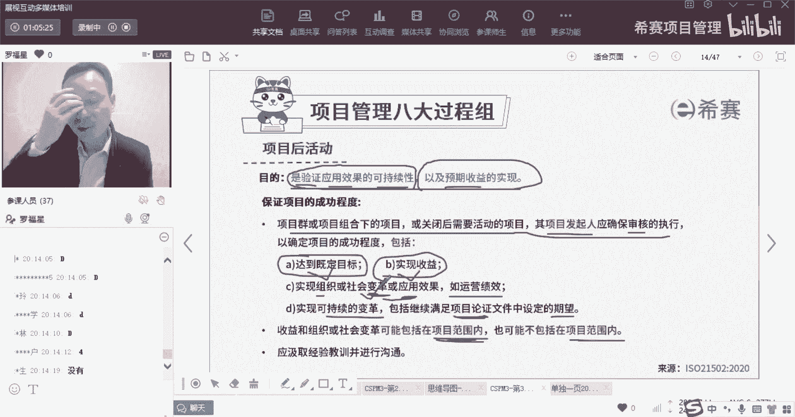
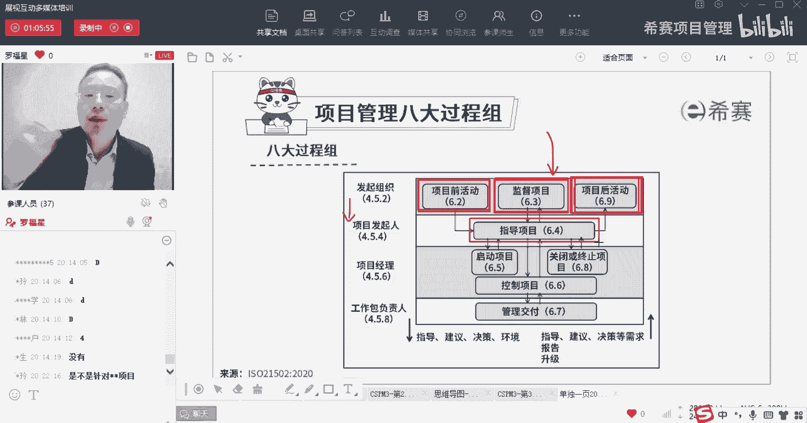
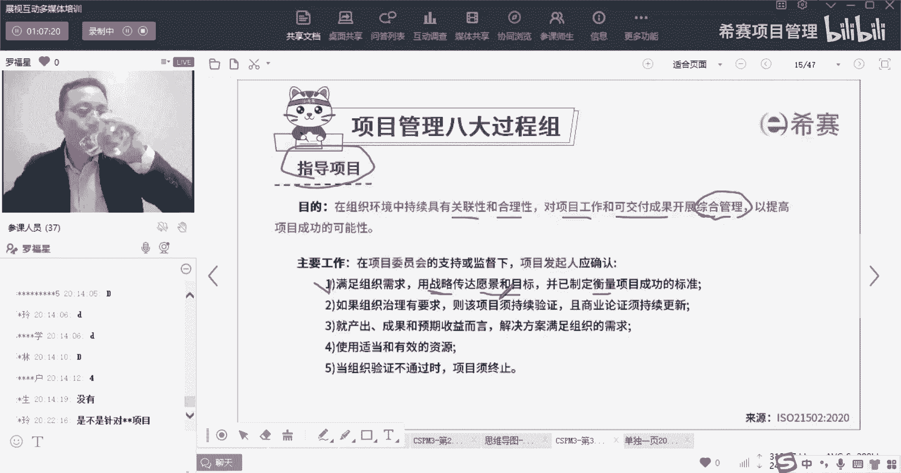
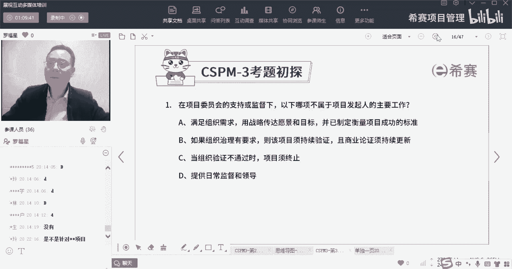
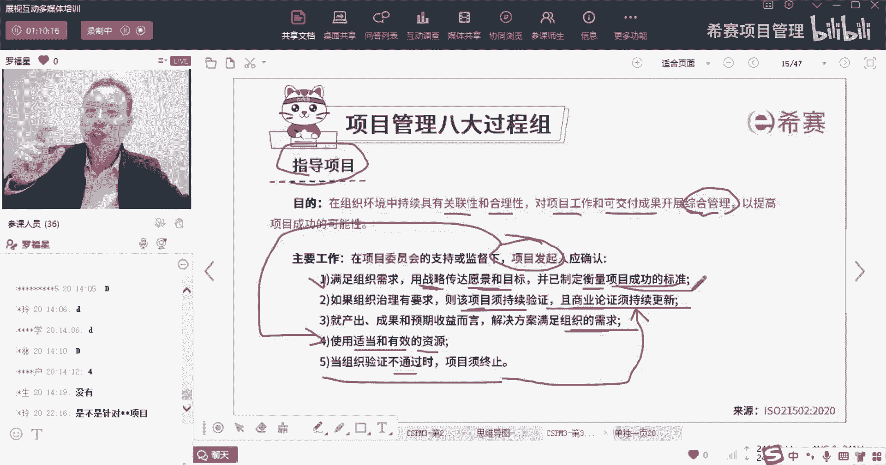
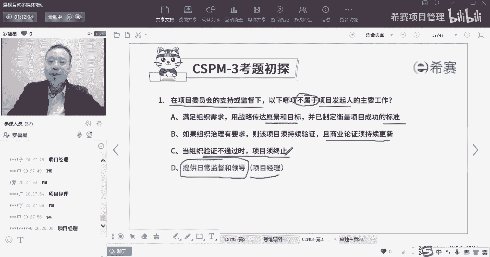

# 【收藏】CSPM-3中级项目管理认证考试直播课精讲视频合集（零基础入门系统教程）！ - P31：CSPM长空3-20八大过程组之指导项目 - 希赛项目管理 - BV16p42197SH

再继续来往下面看，那么下一个呢叫指导项目，指导项目是谁的活，指导项目是这个叫发起人的活，那么他这边其实也就是直接去指导项目了啊，直接去指导项目，当我们在真正做项目的时候，还会有另外一个角色。

还会有另外一个角色是PMO对吧，我们说PMO也会去指导项目，但是呢PM它不是另一个层面，那么这个发起组织他的这个指导呢，更多的是去治理的这个层面，是治理偏治理的这种层面。

OK是治理这个事情，那我们一起来看一下关于指导项目，指导项目，他说他的目的是什么，在组织环境中持续具有关联性和合理性，对项目工作以及对于可交付成果，它进行开展综合管理，以提高项目成功的可能性。

那么关键是什么叫综合管理，什么叫综合管理，那我们来看一下，就是他的目标和目的，是说希望说这个事情能够更好的去管理，管理项目的工作呀，管理项目的可交付成果，从而能够让项目的做项目本身可能更成功。

这是指导对吧，这是这应该叫所谓的指导项目，他的工作具体的工作是什么呢，在项目委员会的支持和监督下，由发起人来去搞，所以你看这个指导项目是谁干的事情，是由发行人干的事情啊，大家发起的背后有靠山。

背后的靠山是智囊团，是项目的委员会，项目委员会这个智囊团，那么在项目委员会的支持和监督之下发行，他说应该怎么样，用战略来传达愿景和目标，并已经制定出衡量项目成功的标准，所以他其实这句话里面。

就是你可以把它掰开来去讲啊，就是首先公司会有一个大的一个愿景对吧，我们公司有一个大的愿景，愿景是什么呢，愿景，它是指未来我想要做成什么牛逼的样子对吧，我们公司未来要做成什么样牛逼的样子。

比方说有一些公司，他的愿景是说我要做成行业的第一名，这是我的一个大的愿景，我要活102年，我要做一个百年老店，这是一个愿景，那么你这个运营怎么样才能做到呢，你需要靠一步一个一个一个的战略目标。

来去落实实现对吧，所以有战略目标，那么在这个指导指导项目的时候，你要把这个战略能够去分享出去，能够让大家去知道，因为我们最后选的项目是有战略一致性，要跟战略是相匹配相match的。

所以是公司有一个大的愿景和目标，然后呢你要去用战略来去传达这个目标和愿景，来告诉大家怎么怎么样做，并且还要告诉他们说这个有一个标准，哎我们怎么样去搞这个项目的成功呢，准是什么，第二个。

如果组织治理有要求，那么这个项目需要持续的验证，并且呢是商业论证也需要持续更新，也就是说，如果公司本身他就对对对，这个持续对项目进行验证有要求的话，那么你要持续的去验证这个项目，持续进行商业论证。

进行可行性的这样一个技术的分析，不能够说做到一半的时候，突然发现这个项目已经不划算，不值得了，那就很可惜，第三个就产出成果预期收益而言，解决方案要满足主人的需求，其实也就是我们做的东西。

应该是要满足他的需要的啊，咱们做的东西一定要满足公司的需求，或者满足客户的需求，这样的话呢这个项目才值得去做，第四个，使用适当的和有效的资源，就你会安排的一些资源分配的一些资源，这也是你可以去说的。

我们通常说什么，说那个那个发起人是能够去给项目经理去认命，便是能够去让项目经理动用多少资源，去管理项目对吧，让项目经理可以动用多少资源去管理项目，那么到底动用多少资源呢，是由你发起来去做决定。

OK是由发起人来去做决定，所以发起人你要去决定到底是使用多少资源，还有下一个当组织验证不通过的时候，要终止，这一条，其实就是跟前面的这一条，是跟第二条是关联起来，我们进行商业论证的时候。

如果发现这东西不合适了，就要及时叫停，及时止损啊。

这是指导，其实这些词呢写的都比较，写的都比较生疏啊，它的意图是什么呢。

我们简单用人话来说一下，指导项目，就是说发钱他需要去给这个项目经理去委任命，去委派，以及给他安排一定的资源，或者赋予一定的资源来做项目，同时呢他要把这个整个公司要做的东西，能够去传达给项目经理。

传达给团队，传达给兄弟们，还有这个项目他做到什么样，就是因为我让我去让你做这个项目，我去开始启动这个项目，所以呢我会把这个项目的成功标准也拎出来，你要做到这个程度，过程中还要去持续更新。

如果一旦发现不合适了，那么这个项目就要叫停，这是指导项目干的事情来做一个题目。

张总速度这么快的吗，什么情况，你们确定手上没有拿到我的那个讲义啊，没有拿到，我现在就是最新版的讲义，怎么感觉有点假了，确实答案选对了啊，你们答案选对了，做过是不是因为这个题目已经做的好。

那你告诉我一下最后一个选项，它是谁的，谁的谁的谁的职责，最后一个选项他是谁的职责，把问题稍微升级一下，提一下难度，OK特别特别棒啊，哎呀真的是，所以你看给你们给你们去上课，真的是不累，为什么不累呢。

因为因为这个更难的题目你都可以答得出来，好这个题目还是这样讲的，他说是在项目委员会的支持和或是监督之下，在哪一项它不属于它，不属于项目发起人的主要工作，用战略来传达愿景和目标。

然后呢并已制定衡量项目成功的标准，第二个如果治理，如果像如果组织治理有要求的话呢，我们要保持这个项目是持续验证，然后即便是商业论证也要持续进行更新，第三个单组织验证不通过的时候，下面要及时叫停。

而最后一个选项提供日常的监督和领导，这是谁的事情呢，这是pm的事情啊，这是项目经理的事情，所以真的是要给你点个赞棒。

真的我好希望所有的班，所有班都可以像这样一个班就最好了。