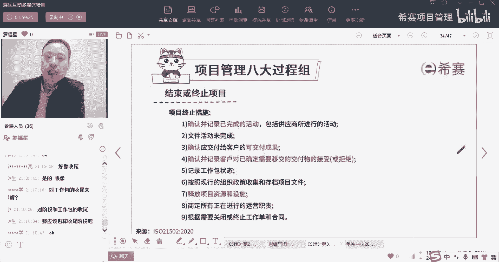
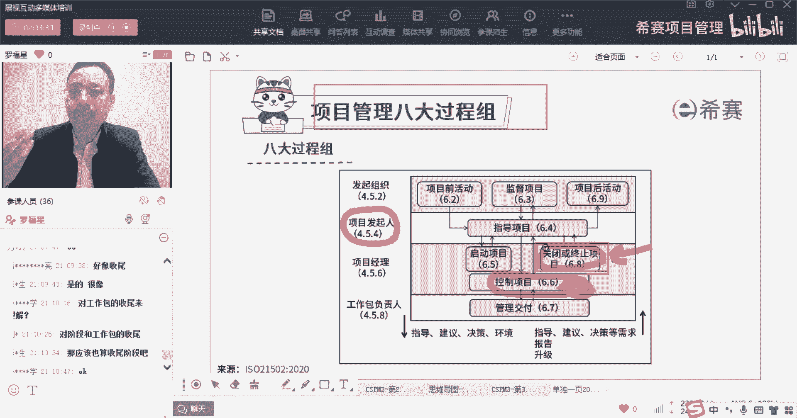

# 【收藏】CSPM-3中级项目管理认证考试直播课精讲视频合集（零基础入门系统教程）！ - P34：CSPM长空3-23八大过程组之结束或终止项目 - 希赛项目管理 - BV16p42197SH

再往下面来到来到下一个叫做结束项目或阶段，那么这个结束项目或阶段。

正好我们一起来了解一下，当然这里面，结束项目或阶段是什么呢，他说是确认范围的完成，使项目后的收益得以实现，并能够管理剩余的资源和设施的复原记录，项目终止情况下没有完成的活动，这个才是干什么，叫验收对吧。

这个是验收，OK所以结束或终止项目，它其实干的事情就是验收，那么这里确认是范围的完成呢，啊我们对于那个验收，我们在项目管理偏僻中，其实会有两个验收，一个是关于确认范围的验收。

一个是关于结束项目或阶段的验收，而他这个地方他给了这个词，给的其实就是说的是类似于这个验收，既包括小的验收，也包含很大的验收，并且还是确认，如果验收了以后，这东西是可以交付出去的，能够去产生价值。

能够去产生收益，那么结束项目或阶段的时候，他说结束项目或阶段，哦他做的事情还挺多，有有四面结束项目或阶段有多种情形来去处理，第一个是关闭项目之前，如果不是由终止而导致的，那么应该要去核实所有活动情况。

什么意思呢，你就提前终止吗，如果是提前终止的话，我们要去确认这个提前终止的情况是什么样的，OK他说还有什么剩余的一些东西，第二个就是如果项目是项目群里面的一部分，那么我们要把这个东西。

既需要移交给这个项目群经理，就是如果说我们是提前终止了，但是这个项目它又是属于项目群众的一部分，那么要把这个没有完成的东西，要移交给这个项目群经理，或者医药这个项目组合经理，第三个。

他说如果项目不是项目群或项目组合的一部分，他说应该要去确定，是否应该将不完整的活动风险和问题，移交给一些管理机构或是指定人，所以这里面讲了一个什么情况呢，就是如果说你不是顺利的去完成。

你要把没有完成的东西移交给到你的项目群，经理，或者移交给别人，是这个意思，当然其实我们在偏僻中讲的，就是如果没有完成的话，要记录下来，然后要去要去把这种完成的部分去做啊，做验收啊，然后做那个什么移交啊。

讲了这个事情，而他现在讲的是没有完成的东西，也要去做移交，要交给对应的人，让他们方便进一步的进行跟踪和管理。

就是这个第还有第四种情况，为实现部分的项目范围而建立，所有的活动进行审核，其实也就是做完哪些部分，比方说你做了2/3，那么对于这个做完了三分之二一样的，要去做验收啊，去审核它的状态。

然后去就是他正式的关闭项目经理与发起人，关键团队主义以及相关方面去进行协商，去关闭，也就是你完成的部分，也要去做这个对应的验收的事情，就是这个意思，所以整个这一段讲的是说你做完的部分要验收。

没有做完的部分要去指定对应的人，移交给对应的人，关闭审核，应该是根据协议以及达到标准来进行评估，又要被正式记录下，这个评估，发起人应该是可以，所有关闭后审查职权和法安排，什么意思。

项目发起人因认可所有关闭后，审查职权和范围的安排，对整个项目中汲取经验教训进行回顾，包括在类似项目和其他项目中，其他未来项目中考虑的这些改进意见，此类审核是任何审核的一部分，也可以是单独行动的一部分。

而他的意思其实也就是说，我们所有做的这个动作。

就是你作为项目经理，你会做这些动作，对不对，你会做这样一个关闭的动作，你做关闭动作的时候，有一些做完的东西，那需要去签字确认，没有做完的东西要移交给谁，那么所有的这些安排都要得到发起人的许可。

都得到它的这样一个同意。

能够达成共识，这样的话这个事情才可以往下去推进。

这是结束项目或阶段好，还有第五条，第六条应该应该只有这只有这两条狼。

第五条，相关方被告知关闭项目，应该采取什么什么东西来聚转移来移交，并在移交的过程中，采取有关的这些组织或是社会背景，我社会变革措施，包括收益的实现，它应该采取以实现持续的利益，哎呀这个好好绕口啊。

就是我们正常再去做终止的时候，在结束的时候把东西移交出去的时候，我们是需要有一个正常的一个移交，那么移交东西呢其实有一个这样的特征，就是既要把结果移交出去，工作手册呀，用户手册呀。

用工作指南啊等等东西也都要去移交给他，如果需要的话，培训也要把他培训出去，那么对应的如果说是这个东西，你正常情况，我们一般是只是把东西移交给别人就可以了，对吧，那么具体他去产生结果。

产生收益是由那个运营团队去进行，但是如果我们把它看作整体，看作一个整体，那么对于如何去产生一个收益，你也需要去给他做一些交代，就包括这种产生收益也要去给他做一些交代，包括如果说这个项目本身是希望。

能够对某一些东西产生变革，你也需要对后续这个被接受的组织来产生交代，在完成之前，项目发起人或者说是项目组织发起组织，他说可以基于原因来去提前终止项目，包括说项目已经不需要了，OK项目本身不需要了。

可以提前终止，或者是有更高的风险，导致这东西是无法接受的程度，那么也是可以不需要，或者外部客户觉得不需要，我们也可以提前终止，就是有很多原因可以外部提前终止，当然也有一种原因是我们做不成器。

当我们做不到交付不了的时候，也是可以去提前终止，这都是在合同里面是有约定的，一般是在合同里面会有一些约定，除非存在一些特殊的原因，否则的话，那终止项目应该包含与完成项目类似的，这种活动。

就是所有的做一半的东西也好，没做完的东西也好，我们都要有它自己这个流程，做完的东西要验收，要移交，没有做完的东西你要去，你要去指定给谁，或者你要移，你也要把它移交给谁，你说我这一部分没有完成。

麻烦你盯着类似这个意思要交接，也有这个交接的意思在里面。

结束项目或阶段他的项目终止的措施，第一个说是确认并记录已经完成的东西，包括供应商，供应商是什么，就是去执行方，执行方所进行的活动完成了，第二个说是文件活动未完成的东西也要记录。

第三个就是劝因交付给客户的这些可交付，成功交付的东西给他记录，这些客户对于已交付的东西的接受或者拒绝，其实就是验收验收，然后呢还记得我们自己的这一个工作包的状态，其实就是完成情况吧。

按照现行的政策和组织来去承担文件，这不就是我们说总总结经验教训呢，然后去把这些个这还不是总结经验教训，这个其实说的是说啊，去把这种过程资产来去进行存档，把过程文件进行存档，同时其实他这里没有讲经验教训。

所以这里面也包含了把经验教训来进行存档，好释放掉对应的资源，释放掉对应的设施，让他可以去重新回到，然后接下来还有一句说，你看这就是我们补充的是在这个行，在这里面补充的商定所有正在进行的运营职责。

也就是说这东西要移交给别人，那么别人该怎么样去落实去使用，去用这个项目的成果呢，用这个服务的成果呢，A要提前把这东西也给做一个约定，这样的话你一并移交的时候，你顺便跟他做有一些交代。

那你告诉他这东西可以怎么样去用啊，可以达到一个什么样的效果啊，其实可能也会给领导做一个汇报，说领导，你最开始希望说，这东西可以产生什么样的收益啊，我们现在做完了以后，那个收益预期的收益是什么样的。

也可能会有一些交代性的东西，最后是根据需要来去关闭，所以这个宗旨，其实它本质上跟我们在项目管理中的那个结束，项目或阶段本身没有什么太多的差别。

其实也就是做最后的这个验收，这样来看的话，你会发现哦，原来控制项目中，他是会对那种验收前做一些准备，所以他有点点像是说把那个确认范围的，验收钱的东西给做了，而后面这个关闭它就是单纯的做验收。

做关闭就单纯的去做验收的这个动作，做关闭的这个动作啊。

验收啊，总结经验教训啊，整理文档啊，存档文档啊，然后移交呀，以及移交这些什么运营的职责做终止。

这是结束，这是结束或终止项目，我们来看一个题目，这个题目呢你通过直觉你就可以选出来啊，学没学你都可以选出来，答案就是第三个对吧，确认并记录所有完成的事情，确认可交付成果啊，可交付的这些可交付成果。

然后呢应该是记录以及存档，所有的这些工作包的状态对吧，然后是释放掉对应的资源和设备，所以不是删除啊，你要做完以后把它删掉了，这个这是事故啊。

这是事故，好，再来一个题目，对山库跑路，这个可能会要入刑的，肯定要踩缝纫机啊，这个呢就需要我们之前学过的一些项目管理，基础基础那个那个基础，你要有基础就很容易选出来，你要没基础，好像一时半会儿而已。

好像也可以选出来啊，好像没有技术也能够选出来，如果有技术就比较能够选啊，项目经理负责一个项目，他接近尾声，几项任务，现在其实已经完成，可移交给客户，那么这个时候项目经理你该怎么做呢。

选项来说是更新整个项目的质量管理计划，选项C说是更新整个项目的沟通管理计划，选项B说是自己来去确认和验收，而最后一个选项是说让客户来去确认，并验收可交付成果，所以你发现其实这个学学没学。

你仔细你都对，你都可以搞出来。