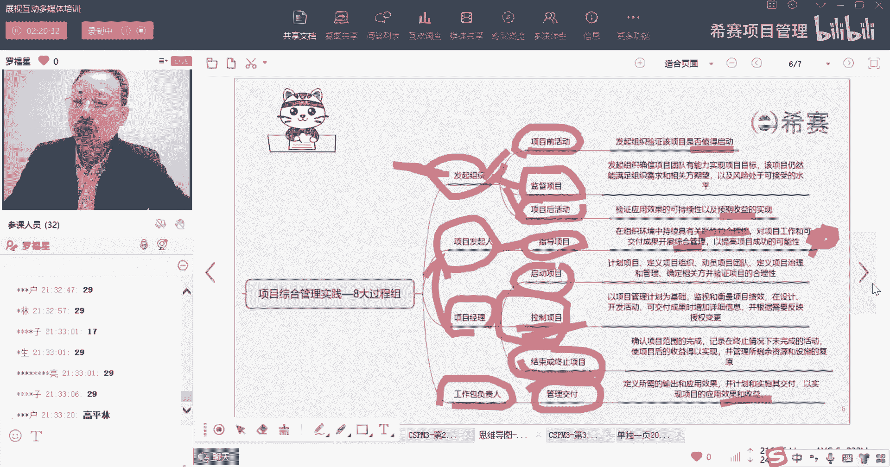

# 【收藏】CSPM-3中级项目管理认证考试直播课精讲视频合集（零基础入门系统教程）！ - P35：CSPM长空3-24八大过程组之管理交付及总结 - 希赛项目管理 - BV16p42197SH

接下来我们来看的是，最后一个要去分享的过程中叫管理交付，那管理交付是谁的事情呢，管理交付他说是工作包负责人，什么叫工作包，我们有一个东西叫做创建工作分解结构，就是把要做的事情把它拆分成更小的小颗粒。

那么小颗粒有什么好处呢，小颗粒是方便去管理啊，更方便去管理，所以我们来参与小颗粒，方便去管理，那么在这个拆的小K中，有一个东西叫做WBS叫工作分解结构，就把要工要做的工作内容分解成更小的颗粒。

叫工作分解结构，而这最小的工作内容呢就把它当做叫做工作包，而工作包呢我们有有几个原则，稍微来回忆一下，有一个叫880的原则，就是八小时到80小时之内完成，也就是一人天到十人天。

十人天其实就是一个人搞搞两个礼拜啊，所以他搞一天到搞两个礼拜之间都是可以的，搞一天到搞两个礼拜之间，那都是可以的，你不要搞得太大的颗粒，你也不要搞太小的颗粒，这是一个第二个，还有一个百分之百的原则。

百分之百的原则，也就是我们的下一层，它的求和将将好，等于算一成，没有多也没有少，下一乘的求和将将好等于上一层的这种方式，你没有多也没有少，而这是它的一些分分的原则，同时呢我们去分的时候呢。

还会有滚动式规划的方式，我们可能有一些东西可以把它分得比较细，有一些东西分不下去，暂时分不下去的东西呢，我们先等着过一段时间再去分啊，那么这里面最底下一层就叫工作包，那么工作包负责人。

也就是说这个工作包，我任命给张三来负责做这个工作包，我任命给李四来负责做哪一个事情，任命给谁去做，我们前面学，其实我们在偏僻中是学过一个东西，叫做责任分配矩阵，所谓的责任分配矩阵。

就是把某一个责任分配给谁对吧，当某一个责任分配给谁，那把这个工作包分配给谁呢，哎这个人就叫工作包的负责人，他是负责干什么呢，负责去交付这个工作包，就他负责去交付。

负责去落实，去执行，那我们一起来看一下交付管理，交付管理它的目的是什么呢，说是定义所需要的这些输出和应用的效果，并计划和实施这个交付来实现这个项目的应用，效果和收益，其实也就是说具体去做事情来产生结果。

具体去规划，具体去做事情，来真正的产生结果，那项目的工作包可以被组织被组织成工作包，用于去分配给各路的这些团队成员来进行工作，然后工作包呢他说是分给工作包的负责人，工资包负责人是通过呃。

但不限于以下方式来去管理什么方式，一个是自己去规划一下要做的事情，然后呢去动员团队，就是你作为一个公众报的复制人，你肯定底下还有一些也有可能啊，有可能底下还有两个小弟，还有两三个小弟来去负责去做事情。

那你同样你作为小组长，你也要去动员大将，第三个你要去负责解决这种风险问题变更，你会发现其实每一个成绩都是做同样的事情，只是说大家的风险问题，事情是可能不同层级的，你是你你这个成绩的风险，你这成绩的问题。

你这成绩的那些什么各种东西对吧好，然后说是啊管理各种什么供应商，其实如果说有供应商的话，如果是有供应商负责来去交付东西，你就要管理供应商，如果没有供应商交付，是你自己亲自做，或者你带团队做。

你就是带着团队一起去做，使用适当的和相称的这种方法和技术来去做，验证这个结果，看结果是不是达成了，我们要进行先控制质量，再去确认范围，然后向项目经理去通报项目的进度情况，如果说有一些风险和问题比较大。

超出你权限。

你要去升级，你要去升级，也就是某一些事情，您是需要去网上升级。

兄弟们，你要往上升级，还有就是做的过程中有些经验和教训，我们要去总结经验和教训，一旦项目经理，他确认了工作包已经完成了以后呢，这个东西确定完成以后是可以去结束他的，可以去close掉。

然后说维护所有专业工作记录，所以你看工作记录不能删除，要留下来啊。

维护所开展的工作记录，这是工作包，其实就是负责去交付，他是谁来干呢。

他是由工作包负责人来去干，来负责做交付，就这么一个点来看一个题目。

我詹总的速度可以呀，还有刘总，张总，亮总，好我们来看一下这个呢，它其实讲的就是累一个过程或每一个过程中，每一个过程中，他的目的是定义所需要的输出和应用，以及并计划和实施其交付。

那么哪一个才是负责真正交付呢，就是管理交付。

OK就是管理交付这样一个过程，管理交付这个过程，它是来去定义这些输出和应用，便去落实去管理交付，你有没有发现。

其实几乎我们的这个八个过程中，它的每一个过程的目的都会考到，几乎是每一个过程中的目的都会考到，虽然有几个还暂时还没有出题目，但是估计下一次可能就会出，所以你看他这种题目的调性是什么调性。

你就大概能够去知道，现在呢其实默默老师，还有那个还有芷若老师以及华荣老师，他们在给给你们去，按照按照官方出题的这种思路和路径，也在班里面去出一些题啊，他们已经在在做这个事情。

所以目前虽然你们暂时手上只有两套试卷，但是等到你们考试之前，应该还会再出一套新的试卷，这套试卷呢可能就是我们我们自己出的，但是我们出的那种品质和调性，应该是几乎一模一样，因为我们在很多别的科目里面。

其实都是干了很多事情，我们会像偏僻就不用说了，偏僻会有大量这种外来外来的项目，然后基于外来的项目，外来的题目我们会去做一些更新的方式啊，NPDP呢也会是有很多外来题目。

同时呢我们自己也会去基于它来去做一，点点对吧，所以ACP啊不是C，所以CSPM这个科目，它目前官方只给了一套试卷，然后我们的那个芷若老师和黄蓉老师，去参加考试的时候，又把你又整了一套试卷。

又把你又把你整了，又又把你混混了一套，又整了一套出来，然后现在呢我们还在，他们还在做，但是最近这几天没有搞，最近这几天因为马上就要考试，偏偏考试，但是接下来还会搞，搞了以后你们应该还会再有一套试卷啊。

哈不够做，但我知道你不够做，但是应该是足够让你更好的去应付他，其实你会发现，所有的这些试卷都是在帮助你干一件什么事情，就帮助你把这个讲义上的东西，搞得滚瓜烂熟而已，就是帮你把这个讲义上的东西。

搞得滚瓜烂熟而已，因为你有时候顺着去看呢，很容易漏掉，但是你如果看到一道一道题目以后，你就不容易漏掉了，就是这样一个情况。

今天晚上我们一共是讲的所谓的叫八大过程组，八大公主面，首先是发起组织，他会负责一个是叫项目前活动，项目前活动他只要干一件事情，就是来去找到一些新的项目机会，并且去论证这个项目机会是值得做的。

所以他去验证论证这个项目是值得启动的，值得去做，接下来有一个叫监督项目，监督项目它只是只干一件事情，就是在做的过程中，他确保这个项目依然是OK的，依然是合适的，依然是值得做的。

那通过这种项目发现他依然是满足客户的需求，或者是客户所需要的，社会所需要的，我们公司所需要的，并且风险也是OK的，它其实就相当于是过程中的这样一个商业论证，第三个是项目后活动，项目后活动。

它通常讲的是说东西已经交付了以后，投入到运营和使用，那么这个投入运营和作用，我希望它是能够产生对应的预期收益，能够实现预期收益，这是发起组织，他来负责三个，接下来是发起人，发起人负责。

第一个呢就是指导项目，他是这样一个领导啊，领导的这个角色，那个发起者是站在一个叫投资的这个角色，然后发起人士做一个领导的角色，他干什么事情，他就是来去给这个项目经理来安排工作，来去给你做一些指导。

做一些疏导，所以说是那个看这个项目的什么合理性呢，对项目的可行性啊，什么展开综合管理来去给项目经理去指派任务，来去做一些框架治理，干这些事情，所以这个思维导图还要改一改啊，因为这个他没有把那个真实。

重要东西给列出来好，第三个就是项目经理，他要干的这个过程中有几个呢，一个三个，一个是启动项目，启动项目，其实他相当于是替领导去启动这个项目，要做很多具体的工作性的东西，去做计划呀，做治理呀，做组建团队。

动员团队啊啊去干什么事情，论证这个项目是值得做的，接下来是控制项目，控制项目呢，其实也就是要确保这个项目依然是属于可行的，他这个他这个控制更多是具体的，关注这些表现情况。

项目绩效就项目的进展情况怎么样呢，下面的绩效情况怎么样呢，你会基于这些东西，拿了一个实际情况和你的规划进行比对，有偏差的分析，有趋势的分析，有这个还有一个什么，就是这种根本原因的分析。

以及你还需要去给领导做一个报告啊，你要去给领导汇报，从而让领导知道，你这个项目目前是OK的一个状态，还有一个是结束项目或阶段，那么结束项目或阶段，那么其实控制中还有一个就是未结束来做准备，为结束做准备。

那么最后还有一个呢结束项目或阶段，它其实就是说我们确定最终的东西都做完了，做完东西就可以去结束，就收尾，就验收就移交，然后整整合这些主持人资产经验和教训，然后去做做收集已经没有完成的东西。

这边特别留意一下，没有完成的东西，他要交代给谁谁谁，他要指派给谁是谁，如果这个项目它是属于项目群里面的一部分，那么没有完成部分就要交给项目群经理，或者如果这个项目它不属于任何组织。

你就要交给你的发起人或者是你的那个委员会，你要把它交代给谁，谁有这个东西好，最后一个是工作包的负责人，他就负责去做管理交付，管理交付，也就是说具体的这个事情你要去做规划，你要去执行，你要去产生结果啊。

产生这个结果和收益，这是他的这个八个过程组。

然后呢，最后还讲了有17个知识领域，十个17个知识领域啊，这就是很多啊，就是这里有17个有什么规划，收益范围，资源进度等等，然后呢还有29个能力素质，29个能力素质评价，其中有环境素质有多少个个人能力。

有多少个技术能力有多少个啊，这是29个能力数值，最后呢还有就是有六个经验啊，这里有六个经验从事从事项目管理经验，从事PO的经验就这么写好了。

那么到目前为止的话呢，我们的整个第三章关于项目经理角色的定位和。

项目受控环境就给大家讲完了，好了感谢您的收看。

祝你拥有一个愉快的夜晚。