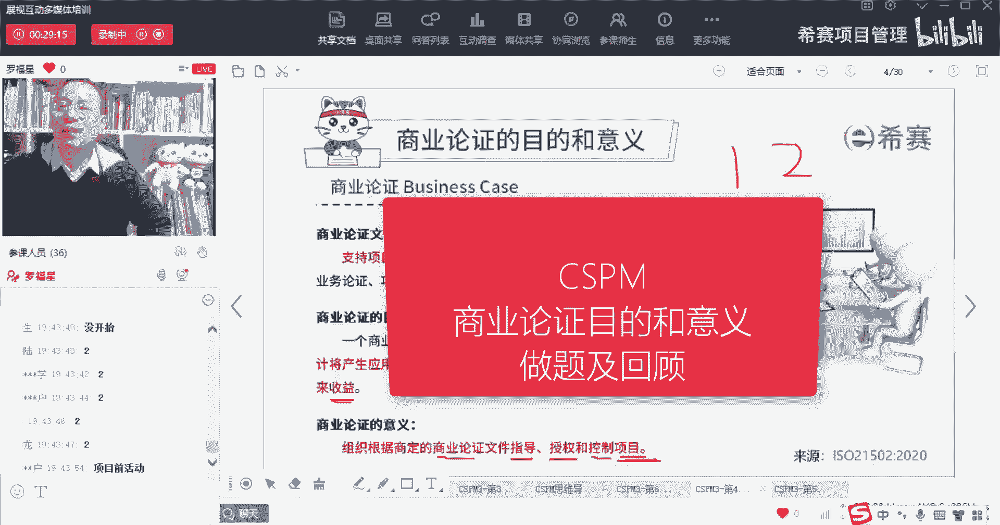
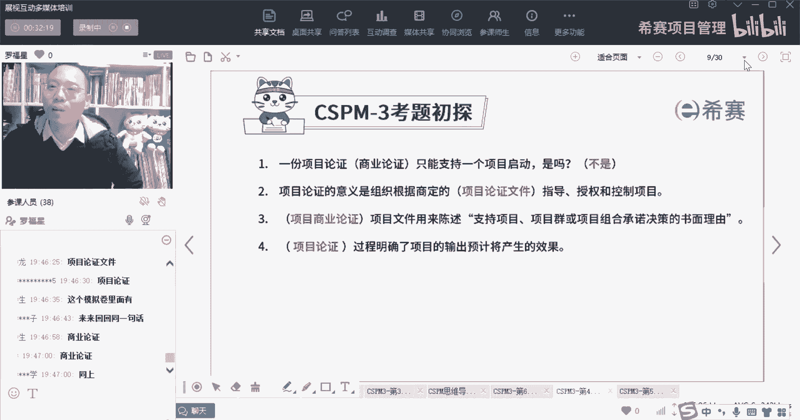
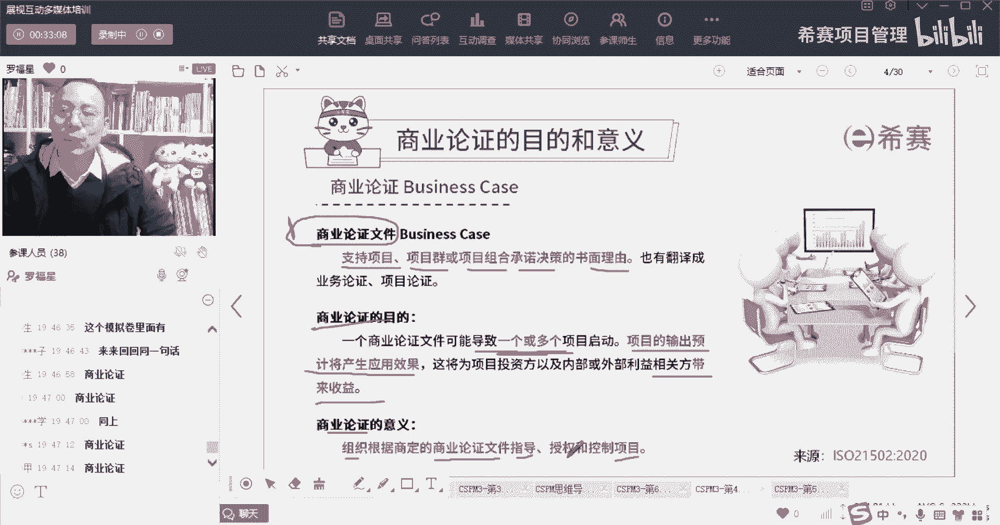

# 【收藏】CSPM-3中级项目管理认证考试直播课精讲视频合集（零基础入门系统教程）！ - P37：CSPM长空4-2商业论证的意义和目的做题及回顾 - 希赛项目管理 - BV16p42197SH

我们来看两个题目，项目论证或者叫商业论证，它只能支持一个项目启动是吗，是打个一不是打个二是吗，我们这刚刚才看过啊，答案是不是，对不对，答案是二啊，答案是不是，因为他才告诉你一份商业论证。

它可以支持一个或多多个项目的启动，因为有可能你的这个商业论证，它是一个项目群的商业论证，也可能是一个项目组合的商业论证，它可能会支持好多好多个子项目细节的项目，所以它并不是只能支持一个on好。

我们再来看第二个题目，商业论证它的意义是，组织会根据商定的什么东西来去指导，授权和控制项目，这啥啊，当考试没有没有填问题啊，考试都是选择题啊，这个题目已经帮你把答案写在上面了，把答案写在上面了。

这个题目的答案已经写在题目上面了，对其实就是商业论证或者呢叫项目论证对吧，其实就是根据项目商业论证或者叫项目论证啊，所以是根据商定的这个项目论证文件，或者根据商定的这个商业论证的文件，来指导项目。

来授权项目，来控制项目对吧，当然它还可以翻译成叫业务论证，对呃活跃分子说的很对啊，对还可以叫业务论证，OK好，第三个什么东西，这份文件用来去陈述支持项目，项目群或项目组合，承诺决策的这样一个书面理由。

什么东西是去支持我们的项目，项目群或项目组合承诺决策的这个理由，并且是一个书面的理由，那么它是一份什么文件，还是商业论证法，同样这一段东西来来回回倒腾的跟你去出啊，就同样这个地方就出了四个题目。

你想就这么一页就出了四个题，一个什么过程，他明确了项目的输出预计产生的效果，我觉得是计划，他会能够去明确项目的输出预计加强的效果，但是事实上呢，但是事实上是商业论证啊，是商业论证，事情是这样的。

也就是我们再回过头来看这一句话啊。

我们再回过头来看这一句话，你会发现他刚刚都考了些啥玩意儿，探案第一句话的是说，首先商业论证文件，它是来去支持我们项目项目群，项目组合承诺决策的这个书面理由，OK啊这是考了一次对吧。

然后呢他说他是像那个商业论证或者项目论证，可以支持或导致一个或多个项目，一个或多个项目啊啊第三个，他说这个商业论证文件呢，它会输出我们项目的预计产生的结果，以及还能够为这些相关方带来收益。

还有就是这个商业论证呢，我说公司或单位或组织，它应该要根据商定的商业论证文件来指导项目。

来授权项目。