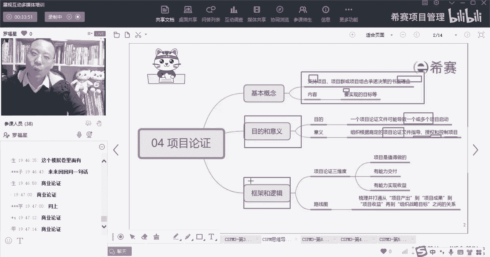
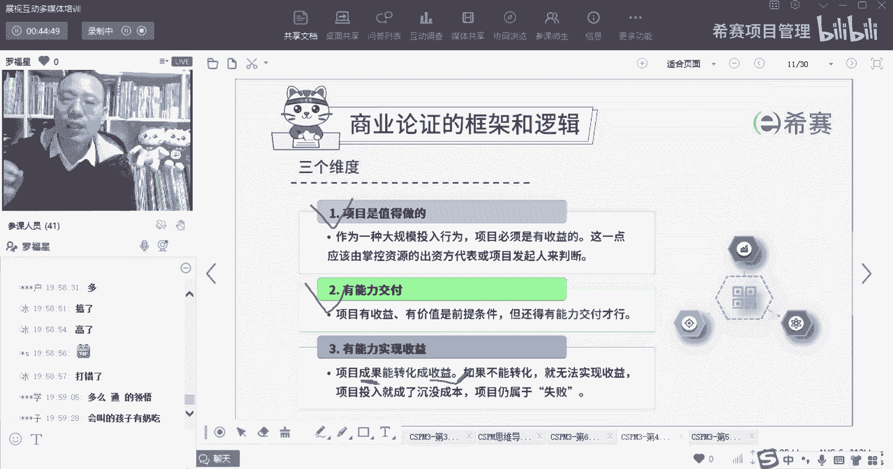

# 【收藏】CSPM-3中级项目管理认证考试直播课精讲视频合集（零基础入门系统教程）！ - P38：CSPM长空4-3商业论证三个维度 - 希赛项目管理 - BV16p42197SH

接下来就是商业论证它的这个框架和逻辑，那商业论证它的这个目的，首先单论证本身是去支持对吧，你看是支持这个项目的一份理由，然后呢他会要去实有实现很多目标，然后呢他的目的是能够去。

它是能够去启动一个或多个的项目，以及它能够去根据这个商店的这个，商业论证文件来指导项目来去授权项目，来去控制项目，接下来我们一起分享的是关于商业论证，它的这些所谓的框架和理由。

一起来看一下，首先商业论证呢它会有三个维度来考量信息，首先第一个维度是说他能够确定说，这个项目是值得做的，OK这个项目是值得做，什么叫值得做呢，就是你的投入产出是划算的。

有投入产出比你投了1000万进去，它能够为你产生1100万的营收，这就说明这个项目是可能是值得做的对吧，所以他说作为一种大规模投入的行为，项目必须是要有收益的啊。

他说这一点应该有掌控资源的这些出资方代表，或者说是项目的发起人来判断，也就是说这个东西我是划算的，我是有收益的，我是值得的，给的是这个意思，就是项目是值得做的，给的是这样一个点会好的啊，兄弟们，第二句。

我们这商业论证还要论证一个什么重要点的，论证是我们有能力去交付，也就是说你不只是说这个东西值得去做，我一定是可以赚到钱，同时还告诉你，我是有水平，有能力可以去交付出来，也就是兄弟们是有能力可以做成的。

这个我们在之前的课程有给大家讲过，一滴血的这个案例对吧，那个反面案例，虽然那个项目非常值啊，投入产出感觉非常高，可是最后发现你做不成，如果做不成，他就是一个骗局，就是一个诈骗行为，所以一定要做成项目。

有收益有价值，它的前提条件是什么呢，它的前提条件是你有能力来交付，你要具备这种实力去交付你，否则的话也是有问题的，第三个呢是我们交付的这个东西，通常你做项目，你做完以后能够交付一个产品。

或者能够交付一个服务对吧，但是交付的这东西它真的就能够产生价值吗，就能够产生收益吗，也不一定哦，我们之前在PMP的课堂中，给大家讲过一个叫一星计划的案例，有印象吗，兄弟们还有印象没有。

一星计划的案例大概讲的怎么回事呢，就是说呃摩托罗拉公司和很多国家一起来，联合发60颗人造卫星到天上去，然后能够去全球覆盖，这样导致在各个地方，包括什么喜马拉雅山呢，嗯什么哈沙哈拉沙漠呀。

嗯什么这这什么尼罗河流域啊等等，各个地方的那种地方，你的手机都可以接到这个信号，对这卫星电话都可以接到卫星的信号，能够去有打电话接电话，那事实上呢他们有没有能力去交付呢，他们还真的是有能力去交付。

他真的是做成了，因为这个公司很牛逼，他的项目管理质量管理做的非常好，真的是做成了，可是最后这东西却没有成功，为什么呢，他做成了以后，他的资费非常的昂贵，而我们生活中绝大部分人。

并不需要去到一个什么撒哈拉沙漠里面去散步，他不需要去到一个什么太平洋的小岛，里面去度假，我们生活中的这种活动半径都很小，可能也就是100km以内对吧，大部分时候就是100km以内。

你如果要偶尔要出差的话，你可能会去到更远的地方，但是也都在城市里面，并不会去到那种奇奇怪怪的地方，所以你用你自己的手机电话就足够了，并不需要用到这种卫星的电话，所以那个项目呢他先做成了。

可是这个项目的成果它不能够转化成收益，如果你转化不了的话，那么就没有办法实现收益，你要是没有办法实现收益，那么你的投入就没有真正的产出，你这个产出不是一个真实的，那么你的投入就成了一个叫沉没成本，项目。

相当于是失败了，我们在讲项目的时候，有一个词叫沉没成本，沉没成本是什么意思呢，就是亮总说的叫打水漂了，就是我花了一笔钱，但是这笔钱他最后没有产生价值，没有产生结果，那个钱最后是失败了，打水漂了。

那个呢就叫沉没成本，这个沉默证明，他其实在生活中是极其好用的一个工具，如果你把它用好了以后，说不定你是有机会的，比方说我我曾经在里面讲过，一个比较扯淡的一个例子，但是你其实可以去参考着去用啊。

假如说你要去买一件貂皮大衣，貂皮大衣呢它可能是8000块，但是呢你不想出那么多钱，你说最后最多我出出500，他说不行，500块钱我不能卖给你，然后呢你滚不要你在我这里店里面消费了，你这个穷鬼对吧。

可能有这种情况，那为了避免这种情况，你又想跟他讨价还价，你又想把它还到很低的价格，有一种什么样的手段和方式呢，就是你不断去消耗它，让他在你身上投入很多的时间和精力，你跟他试第一件衣服，然后是第二件。

是第三件事，第五件，第八件哦，把他这个店里面试试了三个小时，他在你身上就投入了大量的时间和精力，可是如果最后最终没有成交的话，他还在你身上，所有投入的时间和精力都通通打水漂了，所以这个店老板，他大概率。

他其实是不舍得，让他所投入的时间和精力成为打水漂，所以他会怎么样呢，他其实很想要跟你成交，在这种情况下，你再跟他讨价还价，虽然他不会也不会同意，说一个8000块钱的衣服就500块钱卖给你，但是他会说啊。

那不行，太低了，然后就可能会慢慢拉锯拉锯拉锯拉锯，对不对，那么这个沉没成本是不是只是用来砍价呢，No no no，不是这个，那事实上呢，它不只是用来去讨价还价这么简单啊。

你如果看过一个电影叫孤注一掷的话，你就知道孤注一掷里面那种骗子，他是利用什么样的手段和方式来去骗大家的，它会用到一个沉没成本的概念，就是他首先会给你一点点蝇头小利，给你一点点蝇头小利，给你一点点蛋糕。

给你送一束花，给你送一个免费的这个蛋糕，给你送一个免费的什么东西啊，然后呢告诉你有一个什么什么都会投资，然后你就投一点点钱，然后又可以回收，然后再投一点钱又有回收，忍不住诶。

这一次你投了32万块钱的时候，就没有回收了，那么你不甘心不甘心，你这个2万块钱成为沉没成本，你要怎么办呢，你想你要想你尽办法把这2万块钱捞回来，他就告诉你，他说其实呢我们这个钱还在你的账号里面。

但是暂时因为什么什么原因冻结了，那你需要再出5万块钱就可以解锁这2万块钱，那你出还是不出，兄弟们出还是不出，你出打一个一，不出打一个二，他其实就是利用这种人的心理，人就就觉得说哎呀。

那我肯定要把他把那2万块钱给捞回来，我如果不把那2万块钱捞回来，我不就亏掉了吗，所以很多人他会选择继续出钱好，那么这样的话一下子你就成2万变成两家，5万变成7万块钱，你有7万块钱掉在里面，出不来。

他又被锁死了以后，他一定会有个各种各样的借口来给你讲一大堆，然后说你再出十二十万就可以把它给解锁，那你出还是不出，有人在想，我7万都已经出了，我还我一定要把它搞回来，要不然的话我就浪费掉了。

所以他就利用这种沉没成本的这个概念，你不甘心不甘心，就越来越出的越来越多，越来越多，最后就掉到窟窿里面就出不来啊，商业论证它的一个焦点是什么呢，它的焦点就是首先一定要确定，这个项目是值得做的。

就是我的投入产出比我觉得是划算的，第二个呢是你真的是能够做成功的，你有能力去交付，第三个就是你交付出来，最后做出来这个成果本身它能够去转换成收益，它能够转换成收益，能够产生benefit。

你如果不能产生收益的话，那么这个东西依然是失败的，这个手花出去的钱依然是浪费。

