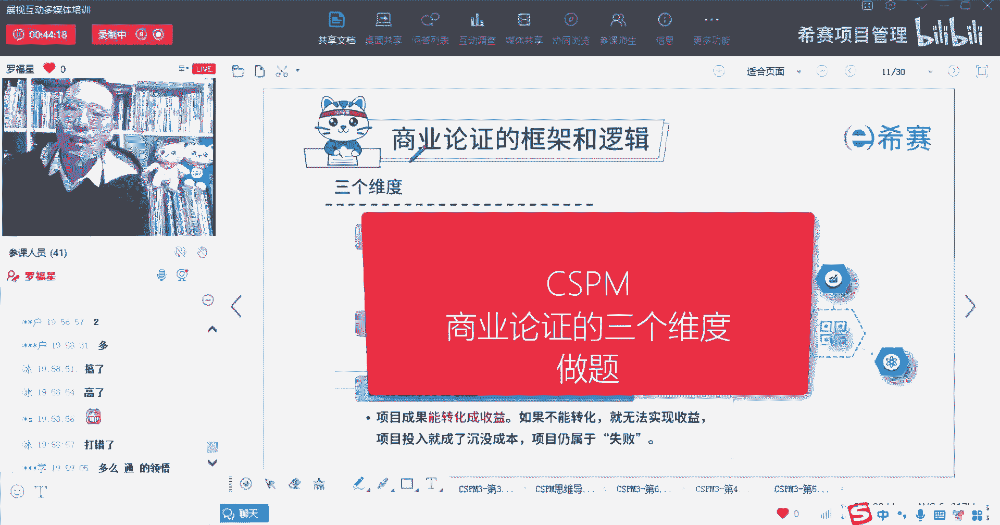
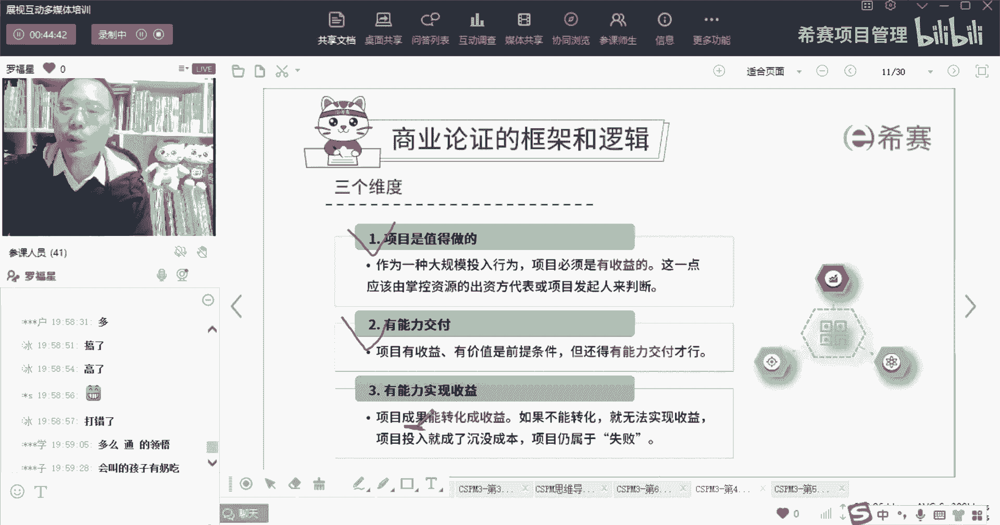
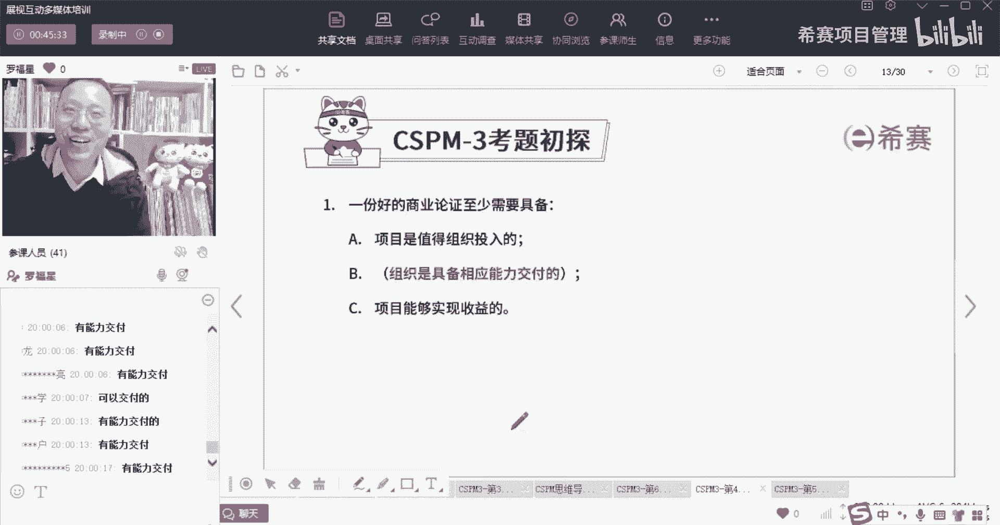

# 【收藏】CSPM-3中级项目管理认证考试直播课精讲视频合集（零基础入门系统教程）！ - P39：CSPM长空4-4商业论证三个维度的做题 - 希赛项目管理 - BV16p42197SH

商业论证，它的焦点就是，首先一定要确定这个项目是值得做的，就是我的这个投入产出比我觉得是划算的，第二个呢是你真的是能够做成功的，你有能力去交付，第三个就是你交付出来，最后做出来这个成果本身。

它能够去转换成收益好。

我们来看这题目了，那你感觉凭凭感觉来敲一敲，看能不能想出来大概是什么一份好的商业论证，他至少应该具备这三条，第一条呢是项目是值得组织投入，是有能力去交付的，是有能力去交付的啊，然后第三条呢是项目。

它的那个成果能够最终转转换成收益项目，它是可以去实现这个收益的，OK考试就这么考，试就这么考。

但是他考的更简单啊，考试还是会给你选择。